cola Report for Consensus Partitioning
==================

**Date**: 2019-12-03 07:53:47 CET, **cola version**: 1.3.2

----------------------------------------------------------------

<style type='text/css'>

body, td, th {
   font-family: Arial,Helvetica,sans-serif;
   background-color: white;
   font-size: 13px;
  max-width: 800px;
  margin: auto;
  margin-left:210px;
  padding: 0px 10px 0px 10px;
  border-left: 1px solid #EEEEEE;
  line-height: 150%;
}

tt, code, pre {
   font-family: 'DejaVu Sans Mono', 'Droid Sans Mono', 'Lucida Console', Consolas, Monaco, 

monospace;
}

h1 {
   font-size:2.2em;
}

h2 {
   font-size:1.8em;
}

h3 {
   font-size:1.4em;
}

h4 {
   font-size:1.0em;
}

h5 {
   font-size:0.9em;
}

h6 {
   font-size:0.8em;
}

a {
  text-decoration: none;
  color: #0366d6;
}

a:hover {
  text-decoration: underline;
}

a:visited {
   color: #0366d6;
}

pre, img {
  max-width: 100%;
}
pre {
  overflow-x: auto;
}
pre code {
   display: block; padding: 0.5em;
}

code {
  font-size: 92%;
  border: 1px solid #ccc;
}

code[class] {
  background-color: #F8F8F8;
}

table, td, th {
  border: 1px solid #ccc;
}

blockquote {
   color:#666666;
   margin:0;
   padding-left: 1em;
   border-left: 0.5em #EEE solid;
}

hr {
   height: 0px;
   border-bottom: none;
   border-top-width: thin;
   border-top-style: dotted;
   border-top-color: #999999;
}

@media print {
   * {
      background: transparent !important;
      color: black !important;
      filter:none !important;
      -ms-filter: none !important;
   }

   body {
      font-size:12pt;
      max-width:100%;
   }

   a, a:visited {
      text-decoration: underline;
   }

   hr {
      visibility: hidden;
      page-break-before: always;
   }

   pre, blockquote {
      padding-right: 1em;
      page-break-inside: avoid;
   }

   tr, img {
      page-break-inside: avoid;
   }

   img {
      max-width: 100% !important;
   }

   @page :left {
      margin: 15mm 20mm 15mm 10mm;
   }

   @page :right {
      margin: 15mm 10mm 15mm 20mm;
   }

   p, h2, h3 {
      orphans: 3; widows: 3;
   }

   h2, h3 {
      page-break-after: avoid;
   }
}
</style>


## Summary


All available functions which can be applied to this `res_list` object:


```r
res_list
```

```
#> A 'ConsensusPartitionList' object with 24 methods.
#>   On a matrix with 51941 rows and 67 columns.
#>   Top rows are extracted by 'SD, CV, MAD, ATC' methods.
#>   Subgroups are detected by 'hclust, kmeans, skmeans, pam, mclust, NMF' method.
#>   Number of partitions are tried for k = 2, 3, 4, 5, 6.
#>   Performed in total 30000 partitions by row resampling.
#> 
#> Following methods can be applied to this 'ConsensusPartitionList' object:
#>  [1] "cola_report"           "collect_classes"       "collect_plots"         "collect_stats"        
#>  [5] "colnames"              "functional_enrichment" "get_anno_col"          "get_anno"             
#>  [9] "get_classes"           "get_matrix"            "get_membership"        "get_stats"            
#> [13] "is_best_k"             "is_stable_k"           "ncol"                  "nrow"                 
#> [17] "rownames"              "show"                  "suggest_best_k"        "test_to_known_factors"
#> [21] "top_rows_heatmap"      "top_rows_overlap"     
#> 
#> You can get result for a single method by, e.g. object["SD", "hclust"] or object["SD:hclust"]
#> or a subset of methods by object[c("SD", "CV")], c("hclust", "kmeans")]
```

The call of `run_all_consensus_partition_methods()` was:


```
#> run_all_consensus_partition_methods(data = mat, mc.cores = 4, anno = anno)
```

Dimension of the input matrix:


```r
mat = get_matrix(res_list)
dim(mat)
```

```
#> [1] 51941    67
```

### Density distribution

The density distribution for each sample is visualized as in one column in the
following heatmap. The clustering is based on the distance which is the
Kolmogorov-Smirnov statistic between two distributions.


```r
library(ComplexHeatmap)
densityHeatmap(mat, top_annotation = HeatmapAnnotation(df = get_anno(res_list), 
    col = get_anno_col(res_list)), ylab = "value", cluster_columns = TRUE, show_column_names = FALSE,
    mc.cores = 4)
```


### Suggest the best k


Folowing table shows the best `k` (number of partitions) for each combination
of top-value methods and partition methods. Clicking on the method name in
the table goes to the section for a single combination of methods.

[The cola vignette](http://bioconductor.org/packages/devel/bioc/vignettes/cola/inst/doc/cola.html#toc_13)
explains the definition of the metrics used for determining the best
number of partitions.


```r
suggest_best_k(res_list)
```


|                            | The best k| 1-PAC| Mean silhouette| Concordance|   |Optional k |
|:---------------------------|----------:|-----:|---------------:|-----------:|:--|:----------|
|[SD:kmeans](#SD-kmeans)     |          2| 1.000|           0.996|       0.996|** |           |
|[CV:kmeans](#CV-kmeans)     |          2| 1.000|           0.994|       0.997|** |           |
|[CV:skmeans](#CV-skmeans)   |          3| 1.000|           0.950|       0.967|** |2          |
|[MAD:hclust](#MAD-hclust)   |          5| 1.000|           0.962|       0.977|** |2          |
|[MAD:kmeans](#MAD-kmeans)   |          2| 1.000|           0.998|       0.998|** |           |
|[MAD:mclust](#MAD-mclust)   |          2| 1.000|           0.999|       0.999|** |           |
|[ATC:hclust](#ATC-hclust)   |          4| 1.000|           0.961|       0.971|** |2,3        |
|[ATC:kmeans](#ATC-kmeans)   |          2| 1.000|           0.991|       0.996|** |           |
|[ATC:pam](#ATC-pam)         |          2| 1.000|           0.974|       0.990|** |           |
|[ATC:mclust](#ATC-mclust)   |          2| 1.000|           1.000|       1.000|** |           |
|[SD:mclust](#SD-mclust)     |          6| 0.997|           0.952|       0.980|** |2          |
|[SD:hclust](#SD-hclust)     |          6| 0.986|           0.943|       0.970|** |2,5        |
|[MAD:pam](#MAD-pam)         |          6| 0.959|           0.907|       0.967|** |2,3        |
|[CV:NMF](#CV-NMF)           |          6| 0.956|           0.897|       0.955|** |2,3        |
|[CV:hclust](#CV-hclust)     |          6| 0.950|           0.923|       0.943|** |2,5        |
|[MAD:NMF](#MAD-NMF)         |          6| 0.950|           0.891|       0.950|*  |2,3        |
|[CV:mclust](#CV-mclust)     |          6| 0.947|           0.929|       0.968|*  |2          |
|[SD:NMF](#SD-NMF)           |          6| 0.943|           0.893|       0.953|*  |2,3        |
|[CV:pam](#CV-pam)           |          6| 0.917|           0.859|       0.945|*  |2,3,4      |
|[SD:skmeans](#SD-skmeans)   |          4| 0.915|           0.898|       0.938|*  |2,3        |
|[ATC:skmeans](#ATC-skmeans) |          3| 0.912|           0.927|       0.965|*  |2          |
|[SD:pam](#SD-pam)           |          6| 0.910|           0.883|       0.956|*  |2,3,4      |
|[MAD:skmeans](#MAD-skmeans) |          4| 0.904|           0.898|       0.929|*  |2,3        |
|[ATC:NMF](#ATC-NMF)         |          3| 0.901|           0.915|       0.963|*  |2          |

\*\*: 1-PAC > 0.95, \*: 1-PAC > 0.9


### CDF of consensus matrices

Cumulative distribution function curves of consensus matrix for all methods.


```r
collect_plots(res_list, fun = plot_ecdf)
```


### Consensus heatmap

Consensus heatmaps for all methods. ([What is a consensus heatmap?](http://bioconductor.org/packages/devel/bioc/vignettes/cola/inst/doc/cola.html#toc_9))


<style type='text/css'>


.ui-helper-hidden {
	display: none;
}
.ui-helper-hidden-accessible {
	border: 0;
	clip: rect(0 0 0 0);
	height: 1px;
	margin: -1px;
	overflow: hidden;
	padding: 0;
	position: absolute;
	width: 1px;
}
.ui-helper-reset {
	margin: 0;
	padding: 0;
	border: 0;
	outline: 0;
	line-height: 1.3;
	text-decoration: none;
	font-size: 100%;
	list-style: none;
}
.ui-helper-clearfix:before,
.ui-helper-clearfix:after {
	content: "";
	display: table;
	border-collapse: collapse;
}
.ui-helper-clearfix:after {
	clear: both;
}
.ui-helper-zfix {
	width: 100%;
	height: 100%;
	top: 0;
	left: 0;
	position: absolute;
	opacity: 0;
	filter:Alpha(Opacity=0); 
}

.ui-front {
	z-index: 100;
}


.ui-state-disabled {
	cursor: default !important;
	pointer-events: none;
}


.ui-icon {
	display: inline-block;
	vertical-align: middle;
	margin-top: -.25em;
	position: relative;
	text-indent: -99999px;
	overflow: hidden;
	background-repeat: no-repeat;
}

.ui-widget-icon-block {
	left: 50%;
	margin-left: -8px;
	display: block;
}


.ui-widget-overlay {
	position: fixed;
	top: 0;
	left: 0;
	width: 100%;
	height: 100%;
}
.ui-accordion .ui-accordion-header {
	display: block;
	cursor: pointer;
	position: relative;
	margin: 2px 0 0 0;
	padding: .5em .5em .5em .7em;
	font-size: 100%;
}
.ui-accordion .ui-accordion-content {
	padding: 1em 2.2em;
	border-top: 0;
	overflow: auto;
}
.ui-autocomplete {
	position: absolute;
	top: 0;
	left: 0;
	cursor: default;
}
.ui-menu {
	list-style: none;
	padding: 0;
	margin: 0;
	display: block;
	outline: 0;
}
.ui-menu .ui-menu {
	position: absolute;
}
.ui-menu .ui-menu-item {
	margin: 0;
	cursor: pointer;
	
	list-style-image: url("data:image/gif;base64,R0lGODlhAQABAIAAAAAAAP///yH5BAEAAAAALAAAAAABAAEAAAIBRAA7");
}
.ui-menu .ui-menu-item-wrapper {
	position: relative;
	padding: 3px 1em 3px .4em;
}
.ui-menu .ui-menu-divider {
	margin: 5px 0;
	height: 0;
	font-size: 0;
	line-height: 0;
	border-width: 1px 0 0 0;
}
.ui-menu .ui-state-focus,
.ui-menu .ui-state-active {
	margin: -1px;
}


.ui-menu-icons {
	position: relative;
}
.ui-menu-icons .ui-menu-item-wrapper {
	padding-left: 2em;
}


.ui-menu .ui-icon {
	position: absolute;
	top: 0;
	bottom: 0;
	left: .2em;
	margin: auto 0;
}


.ui-menu .ui-menu-icon {
	left: auto;
	right: 0;
}
.ui-button {
	padding: .4em 1em;
	display: inline-block;
	position: relative;
	line-height: normal;
	margin-right: .1em;
	cursor: pointer;
	vertical-align: middle;
	text-align: center;
	-webkit-user-select: none;
	-moz-user-select: none;
	-ms-user-select: none;
	user-select: none;

	
	overflow: visible;
}

.ui-button,
.ui-button:link,
.ui-button:visited,
.ui-button:hover,
.ui-button:active {
	text-decoration: none;
}


.ui-button-icon-only {
	width: 2em;
	box-sizing: border-box;
	text-indent: -9999px;
	white-space: nowrap;
}


input.ui-button.ui-button-icon-only {
	text-indent: 0;
}


.ui-button-icon-only .ui-icon {
	position: absolute;
	top: 50%;
	left: 50%;
	margin-top: -8px;
	margin-left: -8px;
}

.ui-button.ui-icon-notext .ui-icon {
	padding: 0;
	width: 2.1em;
	height: 2.1em;
	text-indent: -9999px;
	white-space: nowrap;

}

input.ui-button.ui-icon-notext .ui-icon {
	width: auto;
	height: auto;
	text-indent: 0;
	white-space: normal;
	padding: .4em 1em;
}


input.ui-button::-moz-focus-inner,
button.ui-button::-moz-focus-inner {
	border: 0;
	padding: 0;
}
.ui-controlgroup {
	vertical-align: middle;
	display: inline-block;
}
.ui-controlgroup > .ui-controlgroup-item {
	float: left;
	margin-left: 0;
	margin-right: 0;
}
.ui-controlgroup > .ui-controlgroup-item:focus,
.ui-controlgroup > .ui-controlgroup-item.ui-visual-focus {
	z-index: 9999;
}
.ui-controlgroup-vertical > .ui-controlgroup-item {
	display: block;
	float: none;
	width: 100%;
	margin-top: 0;
	margin-bottom: 0;
	text-align: left;
}
.ui-controlgroup-vertical .ui-controlgroup-item {
	box-sizing: border-box;
}
.ui-controlgroup .ui-controlgroup-label {
	padding: .4em 1em;
}
.ui-controlgroup .ui-controlgroup-label span {
	font-size: 80%;
}
.ui-controlgroup-horizontal .ui-controlgroup-label + .ui-controlgroup-item {
	border-left: none;
}
.ui-controlgroup-vertical .ui-controlgroup-label + .ui-controlgroup-item {
	border-top: none;
}
.ui-controlgroup-horizontal .ui-controlgroup-label.ui-widget-content {
	border-right: none;
}
.ui-controlgroup-vertical .ui-controlgroup-label.ui-widget-content {
	border-bottom: none;
}


.ui-controlgroup-vertical .ui-spinner-input {

	
	width: 75%;
	width: calc( 100% - 2.4em );
}
.ui-controlgroup-vertical .ui-spinner .ui-spinner-up {
	border-top-style: solid;
}

.ui-checkboxradio-label .ui-icon-background {
	box-shadow: inset 1px 1px 1px #ccc;
	border-radius: .12em;
	border: none;
}
.ui-checkboxradio-radio-label .ui-icon-background {
	width: 16px;
	height: 16px;
	border-radius: 1em;
	overflow: visible;
	border: none;
}
.ui-checkboxradio-radio-label.ui-checkboxradio-checked .ui-icon,
.ui-checkboxradio-radio-label.ui-checkboxradio-checked:hover .ui-icon {
	background-image: none;
	width: 8px;
	height: 8px;
	border-width: 4px;
	border-style: solid;
}
.ui-checkboxradio-disabled {
	pointer-events: none;
}
.ui-datepicker {
	width: 17em;
	padding: .2em .2em 0;
	display: none;
}
.ui-datepicker .ui-datepicker-header {
	position: relative;
	padding: .2em 0;
}
.ui-datepicker .ui-datepicker-prev,
.ui-datepicker .ui-datepicker-next {
	position: absolute;
	top: 2px;
	width: 1.8em;
	height: 1.8em;
}
.ui-datepicker .ui-datepicker-prev-hover,
.ui-datepicker .ui-datepicker-next-hover {
	top: 1px;
}
.ui-datepicker .ui-datepicker-prev {
	left: 2px;
}
.ui-datepicker .ui-datepicker-next {
	right: 2px;
}
.ui-datepicker .ui-datepicker-prev-hover {
	left: 1px;
}
.ui-datepicker .ui-datepicker-next-hover {
	right: 1px;
}
.ui-datepicker .ui-datepicker-prev span,
.ui-datepicker .ui-datepicker-next span {
	display: block;
	position: absolute;
	left: 50%;
	margin-left: -8px;
	top: 50%;
	margin-top: -8px;
}
.ui-datepicker .ui-datepicker-title {
	margin: 0 2.3em;
	line-height: 1.8em;
	text-align: center;
}
.ui-datepicker .ui-datepicker-title select {
	font-size: 1em;
	margin: 1px 0;
}
.ui-datepicker select.ui-datepicker-month,
.ui-datepicker select.ui-datepicker-year {
	width: 45%;
}
.ui-datepicker table {
	width: 100%;
	font-size: .9em;
	border-collapse: collapse;
	margin: 0 0 .4em;
}
.ui-datepicker th {
	padding: .7em .3em;
	text-align: center;
	font-weight: bold;
	border: 0;
}
.ui-datepicker td {
	border: 0;
	padding: 1px;
}
.ui-datepicker td span,
.ui-datepicker td a {
	display: block;
	padding: .2em;
	text-align: right;
	text-decoration: none;
}
.ui-datepicker .ui-datepicker-buttonpane {
	background-image: none;
	margin: .7em 0 0 0;
	padding: 0 .2em;
	border-left: 0;
	border-right: 0;
	border-bottom: 0;
}
.ui-datepicker .ui-datepicker-buttonpane button {
	float: right;
	margin: .5em .2em .4em;
	cursor: pointer;
	padding: .2em .6em .3em .6em;
	width: auto;
	overflow: visible;
}
.ui-datepicker .ui-datepicker-buttonpane button.ui-datepicker-current {
	float: left;
}


.ui-datepicker.ui-datepicker-multi {
	width: auto;
}
.ui-datepicker-multi .ui-datepicker-group {
	float: left;
}
.ui-datepicker-multi .ui-datepicker-group table {
	width: 95%;
	margin: 0 auto .4em;
}
.ui-datepicker-multi-2 .ui-datepicker-group {
	width: 50%;
}
.ui-datepicker-multi-3 .ui-datepicker-group {
	width: 33.3%;
}
.ui-datepicker-multi-4 .ui-datepicker-group {
	width: 25%;
}
.ui-datepicker-multi .ui-datepicker-group-last .ui-datepicker-header,
.ui-datepicker-multi .ui-datepicker-group-middle .ui-datepicker-header {
	border-left-width: 0;
}
.ui-datepicker-multi .ui-datepicker-buttonpane {
	clear: left;
}
.ui-datepicker-row-break {
	clear: both;
	width: 100%;
	font-size: 0;
}


.ui-datepicker-rtl {
	direction: rtl;
}
.ui-datepicker-rtl .ui-datepicker-prev {
	right: 2px;
	left: auto;
}
.ui-datepicker-rtl .ui-datepicker-next {
	left: 2px;
	right: auto;
}
.ui-datepicker-rtl .ui-datepicker-prev:hover {
	right: 1px;
	left: auto;
}
.ui-datepicker-rtl .ui-datepicker-next:hover {
	left: 1px;
	right: auto;
}
.ui-datepicker-rtl .ui-datepicker-buttonpane {
	clear: right;
}
.ui-datepicker-rtl .ui-datepicker-buttonpane button {
	float: left;
}
.ui-datepicker-rtl .ui-datepicker-buttonpane button.ui-datepicker-current,
.ui-datepicker-rtl .ui-datepicker-group {
	float: right;
}
.ui-datepicker-rtl .ui-datepicker-group-last .ui-datepicker-header,
.ui-datepicker-rtl .ui-datepicker-group-middle .ui-datepicker-header {
	border-right-width: 0;
	border-left-width: 1px;
}


.ui-datepicker .ui-icon {
	display: block;
	text-indent: -99999px;
	overflow: hidden;
	background-repeat: no-repeat;
	left: .5em;
	top: .3em;
}
.ui-dialog {
	position: absolute;
	top: 0;
	left: 0;
	padding: .2em;
	outline: 0;
}
.ui-dialog .ui-dialog-titlebar {
	padding: .4em 1em;
	position: relative;
}
.ui-dialog .ui-dialog-title {
	float: left;
	margin: .1em 0;
	white-space: nowrap;
	width: 90%;
	overflow: hidden;
	text-overflow: ellipsis;
}
.ui-dialog .ui-dialog-titlebar-close {
	position: absolute;
	right: .3em;
	top: 50%;
	width: 20px;
	margin: -10px 0 0 0;
	padding: 1px;
	height: 20px;
}
.ui-dialog .ui-dialog-content {
	position: relative;
	border: 0;
	padding: .5em 1em;
	background: none;
	overflow: auto;
}
.ui-dialog .ui-dialog-buttonpane {
	text-align: left;
	border-width: 1px 0 0 0;
	background-image: none;
	margin-top: .5em;
	padding: .3em 1em .5em .4em;
}
.ui-dialog .ui-dialog-buttonpane .ui-dialog-buttonset {
	float: right;
}
.ui-dialog .ui-dialog-buttonpane button {
	margin: .5em .4em .5em 0;
	cursor: pointer;
}
.ui-dialog .ui-resizable-n {
	height: 2px;
	top: 0;
}
.ui-dialog .ui-resizable-e {
	width: 2px;
	right: 0;
}
.ui-dialog .ui-resizable-s {
	height: 2px;
	bottom: 0;
}
.ui-dialog .ui-resizable-w {
	width: 2px;
	left: 0;
}
.ui-dialog .ui-resizable-se,
.ui-dialog .ui-resizable-sw,
.ui-dialog .ui-resizable-ne,
.ui-dialog .ui-resizable-nw {
	width: 7px;
	height: 7px;
}
.ui-dialog .ui-resizable-se {
	right: 0;
	bottom: 0;
}
.ui-dialog .ui-resizable-sw {
	left: 0;
	bottom: 0;
}
.ui-dialog .ui-resizable-ne {
	right: 0;
	top: 0;
}
.ui-dialog .ui-resizable-nw {
	left: 0;
	top: 0;
}
.ui-draggable .ui-dialog-titlebar {
	cursor: move;
}
.ui-draggable-handle {
	-ms-touch-action: none;
	touch-action: none;
}
.ui-resizable {
	position: relative;
}
.ui-resizable-handle {
	position: absolute;
	font-size: 0.1px;
	display: block;
	-ms-touch-action: none;
	touch-action: none;
}
.ui-resizable-disabled .ui-resizable-handle,
.ui-resizable-autohide .ui-resizable-handle {
	display: none;
}
.ui-resizable-n {
	cursor: n-resize;
	height: 7px;
	width: 100%;
	top: -5px;
	left: 0;
}
.ui-resizable-s {
	cursor: s-resize;
	height: 7px;
	width: 100%;
	bottom: -5px;
	left: 0;
}
.ui-resizable-e {
	cursor: e-resize;
	width: 7px;
	right: -5px;
	top: 0;
	height: 100%;
}
.ui-resizable-w {
	cursor: w-resize;
	width: 7px;
	left: -5px;
	top: 0;
	height: 100%;
}
.ui-resizable-se {
	cursor: se-resize;
	width: 12px;
	height: 12px;
	right: 1px;
	bottom: 1px;
}
.ui-resizable-sw {
	cursor: sw-resize;
	width: 9px;
	height: 9px;
	left: -5px;
	bottom: -5px;
}
.ui-resizable-nw {
	cursor: nw-resize;
	width: 9px;
	height: 9px;
	left: -5px;
	top: -5px;
}
.ui-resizable-ne {
	cursor: ne-resize;
	width: 9px;
	height: 9px;
	right: -5px;
	top: -5px;
}
.ui-progressbar {
	height: 2em;
	text-align: left;
	overflow: hidden;
}
.ui-progressbar .ui-progressbar-value {
	margin: -1px;
	height: 100%;
}
.ui-progressbar .ui-progressbar-overlay {
	background: url("data:image/gif;base64,R0lGODlhKAAoAIABAAAAAP///yH/C05FVFNDQVBFMi4wAwEAAAAh+QQJAQABACwAAAAAKAAoAAACkYwNqXrdC52DS06a7MFZI+4FHBCKoDeWKXqymPqGqxvJrXZbMx7Ttc+w9XgU2FB3lOyQRWET2IFGiU9m1frDVpxZZc6bfHwv4c1YXP6k1Vdy292Fb6UkuvFtXpvWSzA+HycXJHUXiGYIiMg2R6W459gnWGfHNdjIqDWVqemH2ekpObkpOlppWUqZiqr6edqqWQAAIfkECQEAAQAsAAAAACgAKAAAApSMgZnGfaqcg1E2uuzDmmHUBR8Qil95hiPKqWn3aqtLsS18y7G1SzNeowWBENtQd+T1JktP05nzPTdJZlR6vUxNWWjV+vUWhWNkWFwxl9VpZRedYcflIOLafaa28XdsH/ynlcc1uPVDZxQIR0K25+cICCmoqCe5mGhZOfeYSUh5yJcJyrkZWWpaR8doJ2o4NYq62lAAACH5BAkBAAEALAAAAAAoACgAAAKVDI4Yy22ZnINRNqosw0Bv7i1gyHUkFj7oSaWlu3ovC8GxNso5fluz3qLVhBVeT/Lz7ZTHyxL5dDalQWPVOsQWtRnuwXaFTj9jVVh8pma9JjZ4zYSj5ZOyma7uuolffh+IR5aW97cHuBUXKGKXlKjn+DiHWMcYJah4N0lYCMlJOXipGRr5qdgoSTrqWSq6WFl2ypoaUAAAIfkECQEAAQAsAAAAACgAKAAAApaEb6HLgd/iO7FNWtcFWe+ufODGjRfoiJ2akShbueb0wtI50zm02pbvwfWEMWBQ1zKGlLIhskiEPm9R6vRXxV4ZzWT2yHOGpWMyorblKlNp8HmHEb/lCXjcW7bmtXP8Xt229OVWR1fod2eWqNfHuMjXCPkIGNileOiImVmCOEmoSfn3yXlJWmoHGhqp6ilYuWYpmTqKUgAAIfkECQEAAQAsAAAAACgAKAAAApiEH6kb58biQ3FNWtMFWW3eNVcojuFGfqnZqSebuS06w5V80/X02pKe8zFwP6EFWOT1lDFk8rGERh1TTNOocQ61Hm4Xm2VexUHpzjymViHrFbiELsefVrn6XKfnt2Q9G/+Xdie499XHd2g4h7ioOGhXGJboGAnXSBnoBwKYyfioubZJ2Hn0RuRZaflZOil56Zp6iioKSXpUAAAh+QQJAQABACwAAAAAKAAoAAACkoQRqRvnxuI7kU1a1UU5bd5tnSeOZXhmn5lWK3qNTWvRdQxP8qvaC+/yaYQzXO7BMvaUEmJRd3TsiMAgswmNYrSgZdYrTX6tSHGZO73ezuAw2uxuQ+BbeZfMxsexY35+/Qe4J1inV0g4x3WHuMhIl2jXOKT2Q+VU5fgoSUI52VfZyfkJGkha6jmY+aaYdirq+lQAACH5BAkBAAEALAAAAAAoACgAAAKWBIKpYe0L3YNKToqswUlvznigd4wiR4KhZrKt9Upqip61i9E3vMvxRdHlbEFiEXfk9YARYxOZZD6VQ2pUunBmtRXo1Lf8hMVVcNl8JafV38aM2/Fu5V16Bn63r6xt97j09+MXSFi4BniGFae3hzbH9+hYBzkpuUh5aZmHuanZOZgIuvbGiNeomCnaxxap2upaCZsq+1kAACH5BAkBAAEALAAAAAAoACgAAAKXjI8By5zf4kOxTVrXNVlv1X0d8IGZGKLnNpYtm8Lr9cqVeuOSvfOW79D9aDHizNhDJidFZhNydEahOaDH6nomtJjp1tutKoNWkvA6JqfRVLHU/QUfau9l2x7G54d1fl995xcIGAdXqMfBNadoYrhH+Mg2KBlpVpbluCiXmMnZ2Sh4GBqJ+ckIOqqJ6LmKSllZmsoq6wpQAAAh+QQJAQABACwAAAAAKAAoAAAClYx/oLvoxuJDkU1a1YUZbJ59nSd2ZXhWqbRa2/gF8Gu2DY3iqs7yrq+xBYEkYvFSM8aSSObE+ZgRl1BHFZNr7pRCavZ5BW2142hY3AN/zWtsmf12p9XxxFl2lpLn1rseztfXZjdIWIf2s5dItwjYKBgo9yg5pHgzJXTEeGlZuenpyPmpGQoKOWkYmSpaSnqKileI2FAAACH5BAkBAAEALAAAAAAoACgAAAKVjB+gu+jG4kORTVrVhRlsnn2dJ3ZleFaptFrb+CXmO9OozeL5VfP99HvAWhpiUdcwkpBH3825AwYdU8xTqlLGhtCosArKMpvfa1mMRae9VvWZfeB2XfPkeLmm18lUcBj+p5dnN8jXZ3YIGEhYuOUn45aoCDkp16hl5IjYJvjWKcnoGQpqyPlpOhr3aElaqrq56Bq7VAAAOw==");
	height: 100%;
	filter: alpha(opacity=25); 
	opacity: 0.25;
}
.ui-progressbar-indeterminate .ui-progressbar-value {
	background-image: none;
}
.ui-selectable {
	-ms-touch-action: none;
	touch-action: none;
}
.ui-selectable-helper {
	position: absolute;
	z-index: 100;
	border: 1px dotted black;
}
.ui-selectmenu-menu {
	padding: 0;
	margin: 0;
	position: absolute;
	top: 0;
	left: 0;
	display: none;
}
.ui-selectmenu-menu .ui-menu {
	overflow: auto;
	overflow-x: hidden;
	padding-bottom: 1px;
}
.ui-selectmenu-menu .ui-menu .ui-selectmenu-optgroup {
	font-size: 1em;
	font-weight: bold;
	line-height: 1.5;
	padding: 2px 0.4em;
	margin: 0.5em 0 0 0;
	height: auto;
	border: 0;
}
.ui-selectmenu-open {
	display: block;
}
.ui-selectmenu-text {
	display: block;
	margin-right: 20px;
	overflow: hidden;
	text-overflow: ellipsis;
}
.ui-selectmenu-button.ui-button {
	text-align: left;
	white-space: nowrap;
	width: 14em;
}
.ui-selectmenu-icon.ui-icon {
	float: right;
	margin-top: 0;
}
.ui-slider {
	position: relative;
	text-align: left;
}
.ui-slider .ui-slider-handle {
	position: absolute;
	z-index: 2;
	width: 1.2em;
	height: 1.2em;
	cursor: default;
	-ms-touch-action: none;
	touch-action: none;
}
.ui-slider .ui-slider-range {
	position: absolute;
	z-index: 1;
	font-size: .7em;
	display: block;
	border: 0;
	background-position: 0 0;
}


.ui-slider.ui-state-disabled .ui-slider-handle,
.ui-slider.ui-state-disabled .ui-slider-range {
	filter: inherit;
}

.ui-slider-horizontal {
	height: .8em;
}
.ui-slider-horizontal .ui-slider-handle {
	top: -.3em;
	margin-left: -.6em;
}
.ui-slider-horizontal .ui-slider-range {
	top: 0;
	height: 100%;
}
.ui-slider-horizontal .ui-slider-range-min {
	left: 0;
}
.ui-slider-horizontal .ui-slider-range-max {
	right: 0;
}

.ui-slider-vertical {
	width: .8em;
	height: 100px;
}
.ui-slider-vertical .ui-slider-handle {
	left: -.3em;
	margin-left: 0;
	margin-bottom: -.6em;
}
.ui-slider-vertical .ui-slider-range {
	left: 0;
	width: 100%;
}
.ui-slider-vertical .ui-slider-range-min {
	bottom: 0;
}
.ui-slider-vertical .ui-slider-range-max {
	top: 0;
}
.ui-sortable-handle {
	-ms-touch-action: none;
	touch-action: none;
}
.ui-spinner {
	position: relative;
	display: inline-block;
	overflow: hidden;
	padding: 0;
	vertical-align: middle;
}
.ui-spinner-input {
	border: none;
	background: none;
	color: inherit;
	padding: .222em 0;
	margin: .2em 0;
	vertical-align: middle;
	margin-left: .4em;
	margin-right: 2em;
}
.ui-spinner-button {
	width: 1.6em;
	height: 50%;
	font-size: .5em;
	padding: 0;
	margin: 0;
	text-align: center;
	position: absolute;
	cursor: default;
	display: block;
	overflow: hidden;
	right: 0;
}

.ui-spinner a.ui-spinner-button {
	border-top-style: none;
	border-bottom-style: none;
	border-right-style: none;
}
.ui-spinner-up {
	top: 0;
}
.ui-spinner-down {
	bottom: 0;
}
.ui-tabs {
	position: relative;
	padding: .2em;
}
.ui-tabs .ui-tabs-nav {
	margin: 0;
	padding: .2em .2em 0;
}
.ui-tabs .ui-tabs-nav li {
	list-style: none;
	float: left;
	position: relative;
	top: 0;
	margin: 1px .2em 0 0;
	border-bottom-width: 0;
	padding: 0;
	white-space: nowrap;
}
.ui-tabs .ui-tabs-nav .ui-tabs-anchor {
	float: left;
	padding: .5em 1em;
	text-decoration: none;
}
.ui-tabs .ui-tabs-nav li.ui-tabs-active {
	margin-bottom: -1px;
	padding-bottom: 1px;
}
.ui-tabs .ui-tabs-nav li.ui-tabs-active .ui-tabs-anchor,
.ui-tabs .ui-tabs-nav li.ui-state-disabled .ui-tabs-anchor,
.ui-tabs .ui-tabs-nav li.ui-tabs-loading .ui-tabs-anchor {
	cursor: text;
}
.ui-tabs-collapsible .ui-tabs-nav li.ui-tabs-active .ui-tabs-anchor {
	cursor: pointer;
}
.ui-tabs .ui-tabs-panel {
	display: block;
	border-width: 0;
	padding: 1em 1.4em;
	background: none;
}
.ui-tooltip {
	padding: 8px;
	position: absolute;
	z-index: 9999;
	max-width: 300px;
}
body .ui-tooltip {
	border-width: 2px;
}

.ui-widget {
	font-family: Arial,Helvetica,sans-serif;
	font-size: 1em;
}
.ui-widget .ui-widget {
	font-size: 1em;
}
.ui-widget input,
.ui-widget select,
.ui-widget textarea,
.ui-widget button {
	font-family: Arial,Helvetica,sans-serif;
	font-size: 1em;
}
.ui-widget.ui-widget-content {
	border: 1px solid #c5c5c5;
}
.ui-widget-content {
	border: 1px solid #dddddd;
	background: #ffffff;
	color: #333333;
}
.ui-widget-content a {
	color: #333333;
}
.ui-widget-header {
	border: 1px solid #dddddd;
	background: #e9e9e9;
	color: #333333;
	font-weight: bold;
}
.ui-widget-header a {
	color: #333333;
}


.ui-state-default,
.ui-widget-content .ui-state-default,
.ui-widget-header .ui-state-default,
.ui-button,


html .ui-button.ui-state-disabled:hover,
html .ui-button.ui-state-disabled:active {
	border: 1px solid #c5c5c5;
	background: #f6f6f6;
	font-weight: normal;
	color: #454545;
}
.ui-state-default a,
.ui-state-default a:link,
.ui-state-default a:visited,
a.ui-button,
a:link.ui-button,
a:visited.ui-button,
.ui-button {
	color: #454545;
	text-decoration: none;
}
.ui-state-hover,
.ui-widget-content .ui-state-hover,
.ui-widget-header .ui-state-hover,
.ui-state-focus,
.ui-widget-content .ui-state-focus,
.ui-widget-header .ui-state-focus,
.ui-button:hover,
.ui-button:focus {
	border: 1px solid #cccccc;
	background: #ededed;
	font-weight: normal;
	color: #2b2b2b;
}
.ui-state-hover a,
.ui-state-hover a:hover,
.ui-state-hover a:link,
.ui-state-hover a:visited,
.ui-state-focus a,
.ui-state-focus a:hover,
.ui-state-focus a:link,
.ui-state-focus a:visited,
a.ui-button:hover,
a.ui-button:focus {
	color: #2b2b2b;
	text-decoration: none;
}

.ui-visual-focus {
	box-shadow: 0 0 3px 1px rgb(94, 158, 214);
}
.ui-state-active,
.ui-widget-content .ui-state-active,
.ui-widget-header .ui-state-active,
a.ui-button:active,
.ui-button:active,
.ui-button.ui-state-active:hover {
	border: 1px solid #003eff;
	background: #007fff;
	font-weight: normal;
	color: #ffffff;
}
.ui-icon-background,
.ui-state-active .ui-icon-background {
	border: #003eff;
	background-color: #ffffff;
}
.ui-state-active a,
.ui-state-active a:link,
.ui-state-active a:visited {
	color: #ffffff;
	text-decoration: none;
}


.ui-state-highlight,
.ui-widget-content .ui-state-highlight,
.ui-widget-header .ui-state-highlight {
	border: 1px solid #dad55e;
	background: #fffa90;
	color: #777620;
}
.ui-state-checked {
	border: 1px solid #dad55e;
	background: #fffa90;
}
.ui-state-highlight a,
.ui-widget-content .ui-state-highlight a,
.ui-widget-header .ui-state-highlight a {
	color: #777620;
}
.ui-state-error,
.ui-widget-content .ui-state-error,
.ui-widget-header .ui-state-error {
	border: 1px solid #f1a899;
	background: #fddfdf;
	color: #5f3f3f;
}
.ui-state-error a,
.ui-widget-content .ui-state-error a,
.ui-widget-header .ui-state-error a {
	color: #5f3f3f;
}
.ui-state-error-text,
.ui-widget-content .ui-state-error-text,
.ui-widget-header .ui-state-error-text {
	color: #5f3f3f;
}
.ui-priority-primary,
.ui-widget-content .ui-priority-primary,
.ui-widget-header .ui-priority-primary {
	font-weight: bold;
}
.ui-priority-secondary,
.ui-widget-content .ui-priority-secondary,
.ui-widget-header .ui-priority-secondary {
	opacity: .7;
	filter:Alpha(Opacity=70); 
	font-weight: normal;
}
.ui-state-disabled,
.ui-widget-content .ui-state-disabled,
.ui-widget-header .ui-state-disabled {
	opacity: .35;
	filter:Alpha(Opacity=35); 
	background-image: none;
}
.ui-state-disabled .ui-icon {
	filter:Alpha(Opacity=35); 
}


.ui-icon {
	width: 16px;
	height: 16px;
}
.ui-icon,
.ui-widget-content .ui-icon {
	background-image: url("images/ui-icons_444444_256x240.png");
}
.ui-widget-header .ui-icon {
	background-image: url("images/ui-icons_444444_256x240.png");
}
.ui-state-hover .ui-icon,
.ui-state-focus .ui-icon,
.ui-button:hover .ui-icon,
.ui-button:focus .ui-icon {
	background-image: url("images/ui-icons_555555_256x240.png");
}
.ui-state-active .ui-icon,
.ui-button:active .ui-icon {
	background-image: url("images/ui-icons_ffffff_256x240.png");
}
.ui-state-highlight .ui-icon,
.ui-button .ui-state-highlight.ui-icon {
	background-image: url("images/ui-icons_777620_256x240.png");
}
.ui-state-error .ui-icon,
.ui-state-error-text .ui-icon {
	background-image: url("images/ui-icons_cc0000_256x240.png");
}
.ui-button .ui-icon {
	background-image: url("images/ui-icons_777777_256x240.png");
}


.ui-icon-blank { background-position: 16px 16px; }
.ui-icon-caret-1-n { background-position: 0 0; }
.ui-icon-caret-1-ne { background-position: -16px 0; }
.ui-icon-caret-1-e { background-position: -32px 0; }
.ui-icon-caret-1-se { background-position: -48px 0; }
.ui-icon-caret-1-s { background-position: -65px 0; }
.ui-icon-caret-1-sw { background-position: -80px 0; }
.ui-icon-caret-1-w { background-position: -96px 0; }
.ui-icon-caret-1-nw { background-position: -112px 0; }
.ui-icon-caret-2-n-s { background-position: -128px 0; }
.ui-icon-caret-2-e-w { background-position: -144px 0; }
.ui-icon-triangle-1-n { background-position: 0 -16px; }
.ui-icon-triangle-1-ne { background-position: -16px -16px; }
.ui-icon-triangle-1-e { background-position: -32px -16px; }
.ui-icon-triangle-1-se { background-position: -48px -16px; }
.ui-icon-triangle-1-s { background-position: -65px -16px; }
.ui-icon-triangle-1-sw { background-position: -80px -16px; }
.ui-icon-triangle-1-w { background-position: -96px -16px; }
.ui-icon-triangle-1-nw { background-position: -112px -16px; }
.ui-icon-triangle-2-n-s { background-position: -128px -16px; }
.ui-icon-triangle-2-e-w { background-position: -144px -16px; }
.ui-icon-arrow-1-n { background-position: 0 -32px; }
.ui-icon-arrow-1-ne { background-position: -16px -32px; }
.ui-icon-arrow-1-e { background-position: -32px -32px; }
.ui-icon-arrow-1-se { background-position: -48px -32px; }
.ui-icon-arrow-1-s { background-position: -65px -32px; }
.ui-icon-arrow-1-sw { background-position: -80px -32px; }
.ui-icon-arrow-1-w { background-position: -96px -32px; }
.ui-icon-arrow-1-nw { background-position: -112px -32px; }
.ui-icon-arrow-2-n-s { background-position: -128px -32px; }
.ui-icon-arrow-2-ne-sw { background-position: -144px -32px; }
.ui-icon-arrow-2-e-w { background-position: -160px -32px; }
.ui-icon-arrow-2-se-nw { background-position: -176px -32px; }
.ui-icon-arrowstop-1-n { background-position: -192px -32px; }
.ui-icon-arrowstop-1-e { background-position: -208px -32px; }
.ui-icon-arrowstop-1-s { background-position: -224px -32px; }
.ui-icon-arrowstop-1-w { background-position: -240px -32px; }
.ui-icon-arrowthick-1-n { background-position: 1px -48px; }
.ui-icon-arrowthick-1-ne { background-position: -16px -48px; }
.ui-icon-arrowthick-1-e { background-position: -32px -48px; }
.ui-icon-arrowthick-1-se { background-position: -48px -48px; }
.ui-icon-arrowthick-1-s { background-position: -64px -48px; }
.ui-icon-arrowthick-1-sw { background-position: -80px -48px; }
.ui-icon-arrowthick-1-w { background-position: -96px -48px; }
.ui-icon-arrowthick-1-nw { background-position: -112px -48px; }
.ui-icon-arrowthick-2-n-s { background-position: -128px -48px; }
.ui-icon-arrowthick-2-ne-sw { background-position: -144px -48px; }
.ui-icon-arrowthick-2-e-w { background-position: -160px -48px; }
.ui-icon-arrowthick-2-se-nw { background-position: -176px -48px; }
.ui-icon-arrowthickstop-1-n { background-position: -192px -48px; }
.ui-icon-arrowthickstop-1-e { background-position: -208px -48px; }
.ui-icon-arrowthickstop-1-s { background-position: -224px -48px; }
.ui-icon-arrowthickstop-1-w { background-position: -240px -48px; }
.ui-icon-arrowreturnthick-1-w { background-position: 0 -64px; }
.ui-icon-arrowreturnthick-1-n { background-position: -16px -64px; }
.ui-icon-arrowreturnthick-1-e { background-position: -32px -64px; }
.ui-icon-arrowreturnthick-1-s { background-position: -48px -64px; }
.ui-icon-arrowreturn-1-w { background-position: -64px -64px; }
.ui-icon-arrowreturn-1-n { background-position: -80px -64px; }
.ui-icon-arrowreturn-1-e { background-position: -96px -64px; }
.ui-icon-arrowreturn-1-s { background-position: -112px -64px; }
.ui-icon-arrowrefresh-1-w { background-position: -128px -64px; }
.ui-icon-arrowrefresh-1-n { background-position: -144px -64px; }
.ui-icon-arrowrefresh-1-e { background-position: -160px -64px; }
.ui-icon-arrowrefresh-1-s { background-position: -176px -64px; }
.ui-icon-arrow-4 { background-position: 0 -80px; }
.ui-icon-arrow-4-diag { background-position: -16px -80px; }
.ui-icon-extlink { background-position: -32px -80px; }
.ui-icon-newwin { background-position: -48px -80px; }
.ui-icon-refresh { background-position: -64px -80px; }
.ui-icon-shuffle { background-position: -80px -80px; }
.ui-icon-transfer-e-w { background-position: -96px -80px; }
.ui-icon-transferthick-e-w { background-position: -112px -80px; }
.ui-icon-folder-collapsed { background-position: 0 -96px; }
.ui-icon-folder-open { background-position: -16px -96px; }
.ui-icon-document { background-position: -32px -96px; }
.ui-icon-document-b { background-position: -48px -96px; }
.ui-icon-note { background-position: -64px -96px; }
.ui-icon-mail-closed { background-position: -80px -96px; }
.ui-icon-mail-open { background-position: -96px -96px; }
.ui-icon-suitcase { background-position: -112px -96px; }
.ui-icon-comment { background-position: -128px -96px; }
.ui-icon-person { background-position: -144px -96px; }
.ui-icon-print { background-position: -160px -96px; }
.ui-icon-trash { background-position: -176px -96px; }
.ui-icon-locked { background-position: -192px -96px; }
.ui-icon-unlocked { background-position: -208px -96px; }
.ui-icon-bookmark { background-position: -224px -96px; }
.ui-icon-tag { background-position: -240px -96px; }
.ui-icon-home { background-position: 0 -112px; }
.ui-icon-flag { background-position: -16px -112px; }
.ui-icon-calendar { background-position: -32px -112px; }
.ui-icon-cart { background-position: -48px -112px; }
.ui-icon-pencil { background-position: -64px -112px; }
.ui-icon-clock { background-position: -80px -112px; }
.ui-icon-disk { background-position: -96px -112px; }
.ui-icon-calculator { background-position: -112px -112px; }
.ui-icon-zoomin { background-position: -128px -112px; }
.ui-icon-zoomout { background-position: -144px -112px; }
.ui-icon-search { background-position: -160px -112px; }
.ui-icon-wrench { background-position: -176px -112px; }
.ui-icon-gear { background-position: -192px -112px; }
.ui-icon-heart { background-position: -208px -112px; }
.ui-icon-star { background-position: -224px -112px; }
.ui-icon-link { background-position: -240px -112px; }
.ui-icon-cancel { background-position: 0 -128px; }
.ui-icon-plus { background-position: -16px -128px; }
.ui-icon-plusthick { background-position: -32px -128px; }
.ui-icon-minus { background-position: -48px -128px; }
.ui-icon-minusthick { background-position: -64px -128px; }
.ui-icon-close { background-position: -80px -128px; }
.ui-icon-closethick { background-position: -96px -128px; }
.ui-icon-key { background-position: -112px -128px; }
.ui-icon-lightbulb { background-position: -128px -128px; }
.ui-icon-scissors { background-position: -144px -128px; }
.ui-icon-clipboard { background-position: -160px -128px; }
.ui-icon-copy { background-position: -176px -128px; }
.ui-icon-contact { background-position: -192px -128px; }
.ui-icon-image { background-position: -208px -128px; }
.ui-icon-video { background-position: -224px -128px; }
.ui-icon-script { background-position: -240px -128px; }
.ui-icon-alert { background-position: 0 -144px; }
.ui-icon-info { background-position: -16px -144px; }
.ui-icon-notice { background-position: -32px -144px; }
.ui-icon-help { background-position: -48px -144px; }
.ui-icon-check { background-position: -64px -144px; }
.ui-icon-bullet { background-position: -80px -144px; }
.ui-icon-radio-on { background-position: -96px -144px; }
.ui-icon-radio-off { background-position: -112px -144px; }
.ui-icon-pin-w { background-position: -128px -144px; }
.ui-icon-pin-s { background-position: -144px -144px; }
.ui-icon-play { background-position: 0 -160px; }
.ui-icon-pause { background-position: -16px -160px; }
.ui-icon-seek-next { background-position: -32px -160px; }
.ui-icon-seek-prev { background-position: -48px -160px; }
.ui-icon-seek-end { background-position: -64px -160px; }
.ui-icon-seek-start { background-position: -80px -160px; }

.ui-icon-seek-first { background-position: -80px -160px; }
.ui-icon-stop { background-position: -96px -160px; }
.ui-icon-eject { background-position: -112px -160px; }
.ui-icon-volume-off { background-position: -128px -160px; }
.ui-icon-volume-on { background-position: -144px -160px; }
.ui-icon-power { background-position: 0 -176px; }
.ui-icon-signal-diag { background-position: -16px -176px; }
.ui-icon-signal { background-position: -32px -176px; }
.ui-icon-battery-0 { background-position: -48px -176px; }
.ui-icon-battery-1 { background-position: -64px -176px; }
.ui-icon-battery-2 { background-position: -80px -176px; }
.ui-icon-battery-3 { background-position: -96px -176px; }
.ui-icon-circle-plus { background-position: 0 -192px; }
.ui-icon-circle-minus { background-position: -16px -192px; }
.ui-icon-circle-close { background-position: -32px -192px; }
.ui-icon-circle-triangle-e { background-position: -48px -192px; }
.ui-icon-circle-triangle-s { background-position: -64px -192px; }
.ui-icon-circle-triangle-w { background-position: -80px -192px; }
.ui-icon-circle-triangle-n { background-position: -96px -192px; }
.ui-icon-circle-arrow-e { background-position: -112px -192px; }
.ui-icon-circle-arrow-s { background-position: -128px -192px; }
.ui-icon-circle-arrow-w { background-position: -144px -192px; }
.ui-icon-circle-arrow-n { background-position: -160px -192px; }
.ui-icon-circle-zoomin { background-position: -176px -192px; }
.ui-icon-circle-zoomout { background-position: -192px -192px; }
.ui-icon-circle-check { background-position: -208px -192px; }
.ui-icon-circlesmall-plus { background-position: 0 -208px; }
.ui-icon-circlesmall-minus { background-position: -16px -208px; }
.ui-icon-circlesmall-close { background-position: -32px -208px; }
.ui-icon-squaresmall-plus { background-position: -48px -208px; }
.ui-icon-squaresmall-minus { background-position: -64px -208px; }
.ui-icon-squaresmall-close { background-position: -80px -208px; }
.ui-icon-grip-dotted-vertical { background-position: 0 -224px; }
.ui-icon-grip-dotted-horizontal { background-position: -16px -224px; }
.ui-icon-grip-solid-vertical { background-position: -32px -224px; }
.ui-icon-grip-solid-horizontal { background-position: -48px -224px; }
.ui-icon-gripsmall-diagonal-se { background-position: -64px -224px; }
.ui-icon-grip-diagonal-se { background-position: -80px -224px; }


.ui-corner-all,
.ui-corner-top,
.ui-corner-left,
.ui-corner-tl {
	border-top-left-radius: 3px;
}
.ui-corner-all,
.ui-corner-top,
.ui-corner-right,
.ui-corner-tr {
	border-top-right-radius: 3px;
}
.ui-corner-all,
.ui-corner-bottom,
.ui-corner-left,
.ui-corner-bl {
	border-bottom-left-radius: 3px;
}
.ui-corner-all,
.ui-corner-bottom,
.ui-corner-right,
.ui-corner-br {
	border-bottom-right-radius: 3px;
}


.ui-widget-overlay {
	background: #aaaaaa;
	opacity: .3;
	filter: Alpha(Opacity=30); 
}
.ui-widget-shadow {
	-webkit-box-shadow: 0px 0px 5px #666666;
	box-shadow: 0px 0px 5px #666666;
} 
</style>
<script src='js/jquery-1.12.4.js'></script>
<script src='js/jquery-ui.js'></script>

<script>
$( function() {
	$( '#tabs-collect-consensus-heatmap' ).tabs();
} );
</script>
<div id='tabs-collect-consensus-heatmap'>
<ul>
<li><a href='#tab-collect-consensus-heatmap-1'>k = 2</a></li>
<li><a href='#tab-collect-consensus-heatmap-2'>k = 3</a></li>
<li><a href='#tab-collect-consensus-heatmap-3'>k = 4</a></li>
<li><a href='#tab-collect-consensus-heatmap-4'>k = 5</a></li>
<li><a href='#tab-collect-consensus-heatmap-5'>k = 6</a></li>
</ul>
<div id='tab-collect-consensus-heatmap-1'>
<pre><code class="r">collect_plots(res_list, k = 2, fun = consensus_heatmap, mc.cores = 4)
</code></pre>

<p></p>

</div>
<div id='tab-collect-consensus-heatmap-2'>
<pre><code class="r">collect_plots(res_list, k = 3, fun = consensus_heatmap, mc.cores = 4)
</code></pre>

<p></p>

</div>
<div id='tab-collect-consensus-heatmap-3'>
<pre><code class="r">collect_plots(res_list, k = 4, fun = consensus_heatmap, mc.cores = 4)
</code></pre>

<p></p>

</div>
<div id='tab-collect-consensus-heatmap-4'>
<pre><code class="r">collect_plots(res_list, k = 5, fun = consensus_heatmap, mc.cores = 4)
</code></pre>

<p></p>

</div>
<div id='tab-collect-consensus-heatmap-5'>
<pre><code class="r">collect_plots(res_list, k = 6, fun = consensus_heatmap, mc.cores = 4)
</code></pre>

<p></p>

</div>
</div>


### Membership heatmap

Membership heatmaps for all methods. ([What is a membership heatmap?](http://bioconductor.org/packages/devel/bioc/vignettes/cola/inst/doc/cola.html#toc_12))


<script>
$( function() {
	$( '#tabs-collect-membership-heatmap' ).tabs();
} );
</script>
<div id='tabs-collect-membership-heatmap'>
<ul>
<li><a href='#tab-collect-membership-heatmap-1'>k = 2</a></li>
<li><a href='#tab-collect-membership-heatmap-2'>k = 3</a></li>
<li><a href='#tab-collect-membership-heatmap-3'>k = 4</a></li>
<li><a href='#tab-collect-membership-heatmap-4'>k = 5</a></li>
<li><a href='#tab-collect-membership-heatmap-5'>k = 6</a></li>
</ul>
<div id='tab-collect-membership-heatmap-1'>
<pre><code class="r">collect_plots(res_list, k = 2, fun = membership_heatmap, mc.cores = 4)
</code></pre>

<p></p>

</div>
<div id='tab-collect-membership-heatmap-2'>
<pre><code class="r">collect_plots(res_list, k = 3, fun = membership_heatmap, mc.cores = 4)
</code></pre>

<p></p>

</div>
<div id='tab-collect-membership-heatmap-3'>
<pre><code class="r">collect_plots(res_list, k = 4, fun = membership_heatmap, mc.cores = 4)
</code></pre>

<p></p>

</div>
<div id='tab-collect-membership-heatmap-4'>
<pre><code class="r">collect_plots(res_list, k = 5, fun = membership_heatmap, mc.cores = 4)
</code></pre>

<p></p>

</div>
<div id='tab-collect-membership-heatmap-5'>
<pre><code class="r">collect_plots(res_list, k = 6, fun = membership_heatmap, mc.cores = 4)
</code></pre>

<p></p>

</div>
</div>


### Signature heatmap

Signature heatmaps for all methods. ([What is a signature heatmap?](http://bioconductor.org/packages/devel/bioc/vignettes/cola/inst/doc/cola.html#toc_22))


Note in following heatmaps, rows are scaled.


<script>
$( function() {
	$( '#tabs-collect-get-signatures' ).tabs();
} );
</script>
<div id='tabs-collect-get-signatures'>
<ul>
<li><a href='#tab-collect-get-signatures-1'>k = 2</a></li>
<li><a href='#tab-collect-get-signatures-2'>k = 3</a></li>
<li><a href='#tab-collect-get-signatures-3'>k = 4</a></li>
<li><a href='#tab-collect-get-signatures-4'>k = 5</a></li>
<li><a href='#tab-collect-get-signatures-5'>k = 6</a></li>
</ul>
<div id='tab-collect-get-signatures-1'>
<pre><code class="r">collect_plots(res_list, k = 2, fun = get_signatures, mc.cores = 4)
</code></pre>

<p></p>

</div>
<div id='tab-collect-get-signatures-2'>
<pre><code class="r">collect_plots(res_list, k = 3, fun = get_signatures, mc.cores = 4)
</code></pre>

<p></p>

</div>
<div id='tab-collect-get-signatures-3'>
<pre><code class="r">collect_plots(res_list, k = 4, fun = get_signatures, mc.cores = 4)
</code></pre>

<p></p>

</div>
<div id='tab-collect-get-signatures-4'>
<pre><code class="r">collect_plots(res_list, k = 5, fun = get_signatures, mc.cores = 4)
</code></pre>

<p></p>

</div>
<div id='tab-collect-get-signatures-5'>
<pre><code class="r">collect_plots(res_list, k = 6, fun = get_signatures, mc.cores = 4)
</code></pre>

<p></p>

</div>
</div>


### Statistics table

The statistics used for measuring the stability of consensus partitioning.
([How are they
defined?](http://bioconductor.org/packages/devel/bioc/vignettes/cola/inst/doc/cola.html#toc_13))


<script>
$( function() {
	$( '#tabs-get-stats-from-consensus-partition-list' ).tabs();
} );
</script>
<div id='tabs-get-stats-from-consensus-partition-list'>
<ul>
<li><a href='#tab-get-stats-from-consensus-partition-list-1'>k = 2</a></li>
<li><a href='#tab-get-stats-from-consensus-partition-list-2'>k = 3</a></li>
<li><a href='#tab-get-stats-from-consensus-partition-list-3'>k = 4</a></li>
<li><a href='#tab-get-stats-from-consensus-partition-list-4'>k = 5</a></li>
<li><a href='#tab-get-stats-from-consensus-partition-list-5'>k = 6</a></li>
</ul>
<div id='tab-get-stats-from-consensus-partition-list-1'>
<pre><code class="r">get_stats(res_list, k = 2)
</code></pre>

<pre><code>#&gt;             k 1-PAC mean_silhouette concordance area_increased  Rand Jaccard
#&gt; SD:NMF      2     1           0.968       0.988          0.481 0.518   0.518
#&gt; CV:NMF      2     1           0.973       0.988          0.484 0.518   0.518
#&gt; MAD:NMF     2     1           0.974       0.990          0.481 0.518   0.518
#&gt; ATC:NMF     2     1           0.994       0.997          0.495 0.506   0.506
#&gt; SD:skmeans  2     1           0.987       0.994          0.482 0.518   0.518
#&gt; CV:skmeans  2     1           0.992       0.996          0.483 0.518   0.518
#&gt; MAD:skmeans 2     1           0.990       0.996          0.481 0.518   0.518
#&gt; ATC:skmeans 2     1           0.999       0.999          0.494 0.506   0.506
#&gt; SD:mclust   2     1           0.998       0.998          0.473 0.525   0.525
#&gt; CV:mclust   2     1           0.997       0.997          0.473 0.525   0.525
#&gt; MAD:mclust  2     1           0.999       0.999          0.475 0.525   0.525
#&gt; ATC:mclust  2     1           1.000       1.000          0.476 0.525   0.525
#&gt; SD:kmeans   2     1           0.996       0.996          0.476 0.525   0.525
#&gt; CV:kmeans   2     1           0.994       0.997          0.477 0.525   0.525
#&gt; MAD:kmeans  2     1           0.998       0.998          0.475 0.525   0.525
#&gt; ATC:kmeans  2     1           0.991       0.996          0.490 0.512   0.512
#&gt; SD:pam      2     1           1.000       1.000          0.475 0.525   0.525
#&gt; CV:pam      2     1           0.998       0.999          0.476 0.525   0.525
#&gt; MAD:pam     2     1           1.000       1.000          0.475 0.525   0.525
#&gt; ATC:pam     2     1           0.974       0.990          0.483 0.518   0.518
#&gt; SD:hclust   2     1           1.000       1.000          0.475 0.525   0.525
#&gt; CV:hclust   2     1           1.000       1.000          0.475 0.525   0.525
#&gt; MAD:hclust  2     1           1.000       1.000          0.475 0.525   0.525
#&gt; ATC:hclust  2     1           1.000       1.000          0.494 0.506   0.506
</code></pre>

</div>
<div id='tab-get-stats-from-consensus-partition-list-2'>
<pre><code class="r">get_stats(res_list, k = 3)
</code></pre>

<pre><code>#&gt;             k 1-PAC mean_silhouette concordance area_increased  Rand Jaccard
#&gt; SD:NMF      3 0.947           0.924       0.969          0.277 0.811   0.656
#&gt; CV:NMF      3 0.935           0.919       0.966          0.275 0.810   0.656
#&gt; MAD:NMF     3 0.948           0.911       0.964          0.282 0.819   0.667
#&gt; ATC:NMF     3 0.901           0.915       0.963          0.237 0.844   0.702
#&gt; SD:skmeans  3 1.000           0.935       0.967          0.382 0.801   0.620
#&gt; CV:skmeans  3 1.000           0.950       0.967          0.384 0.796   0.613
#&gt; MAD:skmeans 3 1.000           0.939       0.970          0.390 0.801   0.620
#&gt; ATC:skmeans 3 0.912           0.927       0.965          0.240 0.855   0.719
#&gt; SD:mclust   3 0.575           0.722       0.866          0.281 0.909   0.828
#&gt; CV:mclust   3 0.676           0.786       0.880          0.280 0.866   0.751
#&gt; MAD:mclust  3 0.715           0.769       0.879          0.256 0.826   0.682
#&gt; ATC:mclust  3 0.667           0.733       0.794          0.228 0.912   0.834
#&gt; SD:kmeans   3 0.625           0.427       0.700          0.284 0.889   0.789
#&gt; CV:kmeans   3 0.640           0.812       0.797          0.256 1.000   1.000
#&gt; MAD:kmeans  3 0.615           0.501       0.772          0.280 0.902   0.814
#&gt; ATC:kmeans  3 0.750           0.783       0.885          0.214 0.924   0.853
#&gt; SD:pam      3 1.000           0.991       0.996          0.138 0.935   0.876
#&gt; CV:pam      3 0.962           0.941       0.958          0.158 0.935   0.876
#&gt; MAD:pam     3 0.954           0.955       0.974          0.143 0.935   0.876
#&gt; ATC:pam     3 0.744           0.886       0.876          0.221 0.931   0.866
#&gt; SD:hclust   3 0.801           0.923       0.935          0.201 0.931   0.869
#&gt; CV:hclust   3 0.801           0.854       0.892          0.239 0.931   0.869
#&gt; MAD:hclust  3 0.801           0.927       0.935          0.200 0.931   0.869
#&gt; ATC:hclust  3 1.000           0.942       0.958          0.110 0.934   0.869
</code></pre>

</div>
<div id='tab-get-stats-from-consensus-partition-list-3'>
<pre><code class="r">get_stats(res_list, k = 4)
</code></pre>

<pre><code>#&gt;             k 1-PAC mean_silhouette concordance area_increased  Rand Jaccard
#&gt; SD:NMF      4 0.671           0.563       0.745         0.1413 0.796   0.554
#&gt; CV:NMF      4 0.656           0.643       0.809         0.1383 0.857   0.654
#&gt; MAD:NMF     4 0.667           0.702       0.839         0.1577 0.817   0.563
#&gt; ATC:NMF     4 0.598           0.599       0.767         0.1496 0.907   0.771
#&gt; SD:skmeans  4 0.915           0.898       0.938         0.1048 0.932   0.796
#&gt; CV:skmeans  4 0.827           0.883       0.923         0.1043 0.932   0.794
#&gt; MAD:skmeans 4 0.904           0.898       0.929         0.1001 0.932   0.796
#&gt; ATC:skmeans 4 0.846           0.832       0.923         0.2006 0.802   0.528
#&gt; SD:mclust   4 0.561           0.779       0.816         0.0783 0.954   0.901
#&gt; CV:mclust   4 0.648           0.809       0.844         0.1057 0.903   0.771
#&gt; MAD:mclust  4 0.720           0.746       0.870         0.1631 0.867   0.683
#&gt; ATC:mclust  4 0.659           0.759       0.881         0.1577 0.828   0.633
#&gt; SD:kmeans   4 0.608           0.809       0.765         0.1425 0.740   0.444
#&gt; CV:kmeans   4 0.614           0.786       0.757         0.1655 0.737   0.499
#&gt; MAD:kmeans  4 0.599           0.734       0.741         0.1441 0.764   0.491
#&gt; ATC:kmeans  4 0.696           0.816       0.792         0.1342 0.930   0.842
#&gt; SD:pam      4 1.000           0.960       0.986         0.0534 0.975   0.946
#&gt; CV:pam      4 0.907           0.946       0.949         0.0682 0.973   0.941
#&gt; MAD:pam     4 0.717           0.904       0.895         0.1333 0.973   0.941
#&gt; ATC:pam     4 0.792           0.781       0.896         0.2137 0.852   0.673
#&gt; SD:hclust   4 0.795           0.908       0.929         0.1157 0.935   0.857
#&gt; CV:hclust   4 0.795           0.837       0.885         0.1127 0.935   0.857
#&gt; MAD:hclust  4 0.732           0.911       0.905         0.1197 0.935   0.857
#&gt; ATC:hclust  4 1.000           0.961       0.971         0.0969 0.953   0.893
</code></pre>

</div>
<div id='tab-get-stats-from-consensus-partition-list-4'>
<pre><code class="r">get_stats(res_list, k = 5)
</code></pre>

<pre><code>#&gt;             k 1-PAC mean_silhouette concordance area_increased  Rand Jaccard
#&gt; SD:NMF      5 0.740           0.779       0.865         0.0931 0.859   0.590
#&gt; CV:NMF      5 0.697           0.773       0.865         0.0889 0.878   0.615
#&gt; MAD:NMF     5 0.800           0.786       0.872         0.0791 0.860   0.550
#&gt; ATC:NMF     5 0.592           0.645       0.784         0.1040 0.762   0.388
#&gt; SD:skmeans  5 0.866           0.815       0.871         0.0557 1.000   1.000
#&gt; CV:skmeans  5 0.817           0.756       0.839         0.0589 0.964   0.871
#&gt; MAD:skmeans 5 0.802           0.668       0.845         0.0685 0.971   0.894
#&gt; ATC:skmeans 5 0.800           0.764       0.875         0.0464 0.976   0.910
#&gt; SD:mclust   5 0.715           0.509       0.761         0.1449 0.823   0.595
#&gt; CV:mclust   5 0.710           0.714       0.847         0.1179 0.798   0.476
#&gt; MAD:mclust  5 0.707           0.794       0.849         0.1030 0.871   0.604
#&gt; ATC:mclust  5 0.716           0.660       0.790         0.1081 0.958   0.873
#&gt; SD:kmeans   5 0.676           0.779       0.794         0.0833 0.964   0.862
#&gt; CV:kmeans   5 0.691           0.785       0.808         0.0887 0.964   0.862
#&gt; MAD:kmeans  5 0.684           0.764       0.771         0.0851 0.914   0.700
#&gt; ATC:kmeans  5 0.666           0.738       0.775         0.1166 0.834   0.570
#&gt; SD:pam      5 0.897           0.903       0.955         0.3279 0.805   0.554
#&gt; CV:pam      5 0.827           0.843       0.931         0.2856 0.801   0.540
#&gt; MAD:pam     5 0.835           0.877       0.938         0.2170 0.801   0.544
#&gt; ATC:pam     5 0.805           0.847       0.906         0.0652 0.888   0.665
#&gt; SD:hclust   5 0.935           0.947       0.966         0.2064 0.841   0.593
#&gt; CV:hclust   5 0.939           0.947       0.965         0.1769 0.837   0.584
#&gt; MAD:hclust  5 1.000           0.962       0.977         0.2037 0.841   0.593
#&gt; ATC:hclust  5 0.687           0.708       0.792         0.2204 0.842   0.597
</code></pre>

</div>
<div id='tab-get-stats-from-consensus-partition-list-5'>
<pre><code class="r">get_stats(res_list, k = 6)
</code></pre>

<pre><code>#&gt;             k 1-PAC mean_silhouette concordance area_increased  Rand Jaccard
#&gt; SD:NMF      6 0.943           0.893       0.953         0.0481 0.954   0.805
#&gt; CV:NMF      6 0.956           0.897       0.955         0.0536 0.949   0.786
#&gt; MAD:NMF     6 0.950           0.891       0.950         0.0388 0.970   0.862
#&gt; ATC:NMF     6 0.573           0.524       0.717         0.0383 0.957   0.806
#&gt; SD:skmeans  6 0.832           0.688       0.753         0.0506 0.846   0.490
#&gt; CV:skmeans  6 0.838           0.794       0.845         0.0462 0.877   0.564
#&gt; MAD:skmeans 6 0.849           0.811       0.838         0.0427 0.907   0.642
#&gt; ATC:skmeans 6 0.856           0.816       0.913         0.0369 0.943   0.773
#&gt; SD:mclust   6 0.997           0.952       0.980         0.0631 0.793   0.387
#&gt; CV:mclust   6 0.947           0.929       0.968         0.0664 0.906   0.647
#&gt; MAD:mclust  6 0.771           0.754       0.859         0.0438 0.918   0.667
#&gt; ATC:mclust  6 0.698           0.271       0.681         0.0652 0.828   0.506
#&gt; SD:kmeans   6 0.746           0.748       0.767         0.0578 0.939   0.740
#&gt; CV:kmeans   6 0.763           0.754       0.773         0.0583 0.960   0.823
#&gt; MAD:kmeans  6 0.738           0.736       0.760         0.0536 0.959   0.819
#&gt; ATC:kmeans  6 0.664           0.677       0.745         0.0592 0.941   0.756
#&gt; SD:pam      6 0.910           0.883       0.956         0.0596 0.953   0.806
#&gt; CV:pam      6 0.917           0.859       0.945         0.0607 0.919   0.681
#&gt; MAD:pam     6 0.959           0.907       0.967         0.0671 0.953   0.804
#&gt; ATC:pam     6 0.806           0.805       0.830         0.0516 0.967   0.869
#&gt; SD:hclust   6 0.986           0.943       0.970         0.0370 0.967   0.858
#&gt; CV:hclust   6 0.950           0.923       0.943         0.0347 0.967   0.856
#&gt; MAD:hclust  6 0.884           0.859       0.900         0.0396 1.000   1.000
#&gt; ATC:hclust  6 0.756           0.759       0.867         0.0604 0.905   0.651
</code></pre>

</div>
</div>

Following heatmap plots the partition for each combination of methods and the
lightness correspond to the silhouette scores for samples in each method. On
top the consensus subgroup is inferred from all methods by taking the mean
silhouette scores as weight.


<script>
$( function() {
	$( '#tabs-collect-stats-from-consensus-partition-list' ).tabs();
} );
</script>
<div id='tabs-collect-stats-from-consensus-partition-list'>
<ul>
<li><a href='#tab-collect-stats-from-consensus-partition-list-1'>k = 2</a></li>
<li><a href='#tab-collect-stats-from-consensus-partition-list-2'>k = 3</a></li>
<li><a href='#tab-collect-stats-from-consensus-partition-list-3'>k = 4</a></li>
<li><a href='#tab-collect-stats-from-consensus-partition-list-4'>k = 5</a></li>
<li><a href='#tab-collect-stats-from-consensus-partition-list-5'>k = 6</a></li>
</ul>
<div id='tab-collect-stats-from-consensus-partition-list-1'>
<pre><code class="r">collect_stats(res_list, k = 2)
</code></pre>

<p></p>

</div>
<div id='tab-collect-stats-from-consensus-partition-list-2'>
<pre><code class="r">collect_stats(res_list, k = 3)
</code></pre>

<p></p>

</div>
<div id='tab-collect-stats-from-consensus-partition-list-3'>
<pre><code class="r">collect_stats(res_list, k = 4)
</code></pre>

<p></p>

</div>
<div id='tab-collect-stats-from-consensus-partition-list-4'>
<pre><code class="r">collect_stats(res_list, k = 5)
</code></pre>

<p></p>

</div>
<div id='tab-collect-stats-from-consensus-partition-list-5'>
<pre><code class="r">collect_stats(res_list, k = 6)
</code></pre>

<p></p>

</div>
</div>

### Partition from all methods


Collect partitions from all methods:


<script>
$( function() {
	$( '#tabs-collect-classes-from-consensus-partition-list' ).tabs();
} );
</script>
<div id='tabs-collect-classes-from-consensus-partition-list'>
<ul>
<li><a href='#tab-collect-classes-from-consensus-partition-list-1'>k = 2</a></li>
<li><a href='#tab-collect-classes-from-consensus-partition-list-2'>k = 3</a></li>
<li><a href='#tab-collect-classes-from-consensus-partition-list-3'>k = 4</a></li>
<li><a href='#tab-collect-classes-from-consensus-partition-list-4'>k = 5</a></li>
<li><a href='#tab-collect-classes-from-consensus-partition-list-5'>k = 6</a></li>
</ul>
<div id='tab-collect-classes-from-consensus-partition-list-1'>
<pre><code class="r">collect_classes(res_list, k = 2)
</code></pre>

<p></p>

</div>
<div id='tab-collect-classes-from-consensus-partition-list-2'>
<pre><code class="r">collect_classes(res_list, k = 3)
</code></pre>

<p></p>

</div>
<div id='tab-collect-classes-from-consensus-partition-list-3'>
<pre><code class="r">collect_classes(res_list, k = 4)
</code></pre>

<p></p>

</div>
<div id='tab-collect-classes-from-consensus-partition-list-4'>
<pre><code class="r">collect_classes(res_list, k = 5)
</code></pre>

<p></p>

</div>
<div id='tab-collect-classes-from-consensus-partition-list-5'>
<pre><code class="r">collect_classes(res_list, k = 6)
</code></pre>

<p></p>

</div>
</div>


### Top rows overlap


Overlap of top rows from different top-row methods:


<script>
$( function() {
	$( '#tabs-top-rows-overlap-by-euler' ).tabs();
} );
</script>
<div id='tabs-top-rows-overlap-by-euler'>
<ul>
<li><a href='#tab-top-rows-overlap-by-euler-1'>top_n = 1000</a></li>
<li><a href='#tab-top-rows-overlap-by-euler-2'>top_n = 2000</a></li>
<li><a href='#tab-top-rows-overlap-by-euler-3'>top_n = 3000</a></li>
<li><a href='#tab-top-rows-overlap-by-euler-4'>top_n = 4000</a></li>
<li><a href='#tab-top-rows-overlap-by-euler-5'>top_n = 5000</a></li>
</ul>
<div id='tab-top-rows-overlap-by-euler-1'>
<pre><code class="r">top_rows_overlap(res_list, top_n = 1000, method = &quot;euler&quot;)
</code></pre>

<p></p>

</div>
<div id='tab-top-rows-overlap-by-euler-2'>
<pre><code class="r">top_rows_overlap(res_list, top_n = 2000, method = &quot;euler&quot;)
</code></pre>

<p></p>

</div>
<div id='tab-top-rows-overlap-by-euler-3'>
<pre><code class="r">top_rows_overlap(res_list, top_n = 3000, method = &quot;euler&quot;)
</code></pre>

<p></p>

</div>
<div id='tab-top-rows-overlap-by-euler-4'>
<pre><code class="r">top_rows_overlap(res_list, top_n = 4000, method = &quot;euler&quot;)
</code></pre>

<p></p>

</div>
<div id='tab-top-rows-overlap-by-euler-5'>
<pre><code class="r">top_rows_overlap(res_list, top_n = 5000, method = &quot;euler&quot;)
</code></pre>

<p></p>

</div>
</div>

Also visualize the correspondance of rankings between different top-row methods:


<script>
$( function() {
	$( '#tabs-top-rows-overlap-by-correspondance' ).tabs();
} );
</script>
<div id='tabs-top-rows-overlap-by-correspondance'>
<ul>
<li><a href='#tab-top-rows-overlap-by-correspondance-1'>top_n = 1000</a></li>
<li><a href='#tab-top-rows-overlap-by-correspondance-2'>top_n = 2000</a></li>
<li><a href='#tab-top-rows-overlap-by-correspondance-3'>top_n = 3000</a></li>
<li><a href='#tab-top-rows-overlap-by-correspondance-4'>top_n = 4000</a></li>
<li><a href='#tab-top-rows-overlap-by-correspondance-5'>top_n = 5000</a></li>
</ul>
<div id='tab-top-rows-overlap-by-correspondance-1'>
<pre><code class="r">top_rows_overlap(res_list, top_n = 1000, method = &quot;correspondance&quot;)
</code></pre>

<p></p>

</div>
<div id='tab-top-rows-overlap-by-correspondance-2'>
<pre><code class="r">top_rows_overlap(res_list, top_n = 2000, method = &quot;correspondance&quot;)
</code></pre>

<p></p>

</div>
<div id='tab-top-rows-overlap-by-correspondance-3'>
<pre><code class="r">top_rows_overlap(res_list, top_n = 3000, method = &quot;correspondance&quot;)
</code></pre>

<p>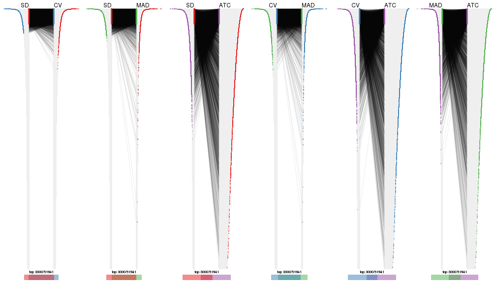</p>

</div>
<div id='tab-top-rows-overlap-by-correspondance-4'>
<pre><code class="r">top_rows_overlap(res_list, top_n = 4000, method = &quot;correspondance&quot;)
</code></pre>

<p></p>

</div>
<div id='tab-top-rows-overlap-by-correspondance-5'>
<pre><code class="r">top_rows_overlap(res_list, top_n = 5000, method = &quot;correspondance&quot;)
</code></pre>

<p></p>

</div>
</div>


Heatmaps of the top rows:


<script>
$( function() {
	$( '#tabs-top-rows-heatmap' ).tabs();
} );
</script>
<div id='tabs-top-rows-heatmap'>
<ul>
<li><a href='#tab-top-rows-heatmap-1'>top_n = 1000</a></li>
<li><a href='#tab-top-rows-heatmap-2'>top_n = 2000</a></li>
<li><a href='#tab-top-rows-heatmap-3'>top_n = 3000</a></li>
<li><a href='#tab-top-rows-heatmap-4'>top_n = 4000</a></li>
<li><a href='#tab-top-rows-heatmap-5'>top_n = 5000</a></li>
</ul>
<div id='tab-top-rows-heatmap-1'>
<pre><code class="r">top_rows_heatmap(res_list, top_n = 1000)
</code></pre>

<p></p>

</div>
<div id='tab-top-rows-heatmap-2'>
<pre><code class="r">top_rows_heatmap(res_list, top_n = 2000)
</code></pre>

<p></p>

</div>
<div id='tab-top-rows-heatmap-3'>
<pre><code class="r">top_rows_heatmap(res_list, top_n = 3000)
</code></pre>

<p></p>

</div>
<div id='tab-top-rows-heatmap-4'>
<pre><code class="r">top_rows_heatmap(res_list, top_n = 4000)
</code></pre>

<p></p>

</div>
<div id='tab-top-rows-heatmap-5'>
<pre><code class="r">top_rows_heatmap(res_list, top_n = 5000)
</code></pre>

<p></p>

</div>
</div>


### Test to known annotations


Test correlation between subgroups and known annotations. If the known
annotation is numeric, one-way ANOVA test is applied, and if the known
annotation is discrete, chi-squared contingency table test is applied.


<script>
$( function() {
	$( '#tabs-test-to-known-factors-from-consensus-partition-list' ).tabs();
} );
</script>
<div id='tabs-test-to-known-factors-from-consensus-partition-list'>
<ul>
<li><a href='#tab-test-to-known-factors-from-consensus-partition-list-1'>k = 2</a></li>
<li><a href='#tab-test-to-known-factors-from-consensus-partition-list-2'>k = 3</a></li>
<li><a href='#tab-test-to-known-factors-from-consensus-partition-list-3'>k = 4</a></li>
<li><a href='#tab-test-to-known-factors-from-consensus-partition-list-4'>k = 5</a></li>
<li><a href='#tab-test-to-known-factors-from-consensus-partition-list-5'>k = 6</a></li>
</ul>
<div id='tab-test-to-known-factors-from-consensus-partition-list-1'>
<pre><code class="r">test_to_known_factors(res_list, k = 2)
</code></pre>

<pre><code>#&gt;              n disease.state(p) k
#&gt; SD:NMF      66         2.61e-10 2
#&gt; CV:NMF      67         7.40e-10 2
#&gt; MAD:NMF     66         2.61e-10 2
#&gt; ATC:NMF     67         9.63e-09 2
#&gt; SD:skmeans  67         7.40e-10 2
#&gt; CV:skmeans  67         7.40e-10 2
#&gt; MAD:skmeans 67         7.40e-10 2
#&gt; ATC:skmeans 67         9.63e-09 2
#&gt; SD:mclust   67         1.68e-10 2
#&gt; CV:mclust   67         1.68e-10 2
#&gt; MAD:mclust  67         1.68e-10 2
#&gt; ATC:mclust  67         1.68e-10 2
#&gt; SD:kmeans   67         1.68e-10 2
#&gt; CV:kmeans   67         1.68e-10 2
#&gt; MAD:kmeans  67         1.68e-10 2
#&gt; ATC:kmeans  67         3.51e-09 2
#&gt; SD:pam      67         1.68e-10 2
#&gt; CV:pam      67         1.68e-10 2
#&gt; MAD:pam     67         1.68e-10 2
#&gt; ATC:pam     66         1.39e-09 2
#&gt; SD:hclust   67         1.68e-10 2
#&gt; CV:hclust   67         1.68e-10 2
#&gt; MAD:hclust  67         1.68e-10 2
#&gt; ATC:hclust  67         9.63e-09 2
</code></pre>

</div>
<div id='tab-test-to-known-factors-from-consensus-partition-list-2'>
<pre><code class="r">test_to_known_factors(res_list, k = 3)
</code></pre>

<pre><code>#&gt;              n disease.state(p) k
#&gt; SD:NMF      65         2.26e-14 3
#&gt; CV:NMF      64         4.83e-14 3
#&gt; MAD:NMF     64         1.08e-13 3
#&gt; ATC:NMF     65         1.12e-08 3
#&gt; SD:skmeans  65         4.05e-15 3
#&gt; CV:skmeans  66         4.75e-15 3
#&gt; MAD:skmeans 65         9.56e-15 3
#&gt; ATC:skmeans 67         3.11e-12 3
#&gt; SD:mclust   61         1.21e-16 3
#&gt; CV:mclust   63         2.18e-17 3
#&gt; MAD:mclust  60         2.85e-16 3
#&gt; ATC:mclust  61         1.06e-13 3
#&gt; SD:kmeans   32         5.94e-06 3
#&gt; CV:kmeans   67         1.68e-10 3
#&gt; MAD:kmeans  44         2.94e-10 3
#&gt; ATC:kmeans  62         1.92e-09 3
#&gt; SD:pam      67         3.83e-17 3
#&gt; CV:pam      66         1.64e-18 3
#&gt; MAD:pam     67         3.83e-17 3
#&gt; ATC:pam     67         8.42e-15 3
#&gt; SD:hclust   67         6.34e-10 3
#&gt; CV:hclust   67         6.34e-10 3
#&gt; MAD:hclust  67         6.34e-10 3
#&gt; ATC:hclust  67         4.21e-07 3
</code></pre>

</div>
<div id='tab-test-to-known-factors-from-consensus-partition-list-3'>
<pre><code class="r">test_to_known_factors(res_list, k = 4)
</code></pre>

<pre><code>#&gt;              n disease.state(p) k
#&gt; SD:NMF      40         4.13e-12 4
#&gt; CV:NMF      52         1.98e-13 4
#&gt; MAD:NMF     55         7.43e-16 4
#&gt; ATC:NMF     50         9.27e-09 4
#&gt; SD:skmeans  65         4.31e-23 4
#&gt; CV:skmeans  66         3.31e-23 4
#&gt; MAD:skmeans 65         1.02e-22 4
#&gt; ATC:skmeans 62         3.29e-12 4
#&gt; SD:mclust   66         1.17e-26 4
#&gt; CV:mclust   61         6.65e-20 4
#&gt; MAD:mclust  65         4.09e-21 4
#&gt; ATC:mclust  61         5.18e-12 4
#&gt; SD:kmeans   66         3.31e-23 4
#&gt; CV:kmeans   61         6.59e-22 4
#&gt; MAD:kmeans  56         3.78e-19 4
#&gt; ATC:kmeans  62         8.66e-13 4
#&gt; SD:pam      66         1.17e-26 4
#&gt; CV:pam      66         1.17e-26 4
#&gt; MAD:pam     67         1.90e-24 4
#&gt; ATC:pam     64         1.22e-17 4
#&gt; SD:hclust   66         8.68e-18 4
#&gt; CV:hclust   66         8.68e-18 4
#&gt; MAD:hclust  67         1.51e-16 4
#&gt; ATC:hclust  67         1.87e-12 4
</code></pre>

</div>
<div id='tab-test-to-known-factors-from-consensus-partition-list-4'>
<pre><code class="r">test_to_known_factors(res_list, k = 5)
</code></pre>

<pre><code>#&gt;              n disease.state(p) k
#&gt; SD:NMF      59         5.26e-25 5
#&gt; CV:NMF      59         5.26e-25 5
#&gt; MAD:NMF     57         6.95e-18 5
#&gt; ATC:NMF     53         7.16e-12 5
#&gt; SD:skmeans  64         4.92e-23 5
#&gt; CV:skmeans  61         1.85e-20 5
#&gt; MAD:skmeans 56         3.57e-19 5
#&gt; ATC:skmeans 57         2.08e-12 5
#&gt; SD:mclust   32         2.51e-10 5
#&gt; CV:mclust   55         1.18e-21 5
#&gt; MAD:mclust  65         1.81e-22 5
#&gt; ATC:mclust  49         1.64e-10 5
#&gt; SD:kmeans   59         7.92e-20 5
#&gt; CV:kmeans   59         7.92e-20 5
#&gt; MAD:kmeans  61         2.43e-20 5
#&gt; ATC:kmeans  58         4.73e-11 5
#&gt; SD:pam      65         1.21e-28 5
#&gt; CV:pam      62         1.19e-24 5
#&gt; MAD:pam     67         4.23e-26 5
#&gt; ATC:pam     66         2.13e-16 5
#&gt; SD:hclust   66         7.60e-22 5
#&gt; CV:hclust   66         4.32e-21 5
#&gt; MAD:hclust  67         9.85e-21 5
#&gt; ATC:hclust  59         2.62e-14 5
</code></pre>

</div>
<div id='tab-test-to-known-factors-from-consensus-partition-list-5'>
<pre><code class="r">test_to_known_factors(res_list, k = 6)
</code></pre>

<pre><code>#&gt;              n disease.state(p) k
#&gt; SD:NMF      65         4.06e-24 6
#&gt; CV:NMF      64         1.23e-23 6
#&gt; MAD:NMF     63         5.00e-25 6
#&gt; ATC:NMF     44         5.37e-13 6
#&gt; SD:skmeans  54         2.21e-27 6
#&gt; CV:skmeans  52         2.31e-27 6
#&gt; MAD:skmeans 63         3.27e-26 6
#&gt; ATC:skmeans 60         4.69e-12 6
#&gt; SD:mclust   66         3.45e-27 6
#&gt; CV:mclust   66         3.45e-27 6
#&gt; MAD:mclust  56         3.24e-22 6
#&gt; ATC:mclust  27         1.12e-06 6
#&gt; SD:kmeans   55         2.17e-25 6
#&gt; CV:kmeans   57         6.84e-26 6
#&gt; MAD:kmeans  59         8.96e-25 6
#&gt; ATC:kmeans  57         1.71e-15 6
#&gt; SD:pam      63         2.66e-26 6
#&gt; CV:pam      62         2.10e-26 6
#&gt; MAD:pam     64         4.35e-23 6
#&gt; ATC:pam     60         2.63e-18 6
#&gt; SD:hclust   66         6.69e-30 6
#&gt; CV:hclust   65         7.90e-29 6
#&gt; MAD:hclust  66         1.57e-20 6
#&gt; ATC:hclust  60         9.93e-14 6
</code></pre>

</div>
</div>


 
## Results for each method


---------------------------------------------------


### SD:hclust**


The object with results only for a single top-value method and a single partition method 
can be extracted as:

```r
res = res_list["SD", "hclust"]
# you can also extract it by
# res = res_list["SD:hclust"]
```

A summary of `res` and all the functions that can be applied to it:

```r
res
```

```
#> A 'ConsensusPartition' object with k = 2, 3, 4, 5, 6.
#>   On a matrix with 51941 rows and 67 columns.
#>   Top rows (1000, 2000, 3000, 4000, 5000) are extracted by 'SD' method.
#>   Subgroups are detected by 'hclust' method.
#>   Performed in total 1250 partitions by row resampling.
#>   Best k for subgroups seems to be 6.
#> 
#> Following methods can be applied to this 'ConsensusPartition' object:
#>  [1] "cola_report"             "collect_classes"         "collect_plots"          
#>  [4] "collect_stats"           "colnames"                "compare_signatures"     
#>  [7] "consensus_heatmap"       "dimension_reduction"     "functional_enrichment"  
#> [10] "get_anno_col"            "get_anno"                "get_classes"            
#> [13] "get_consensus"           "get_matrix"              "get_membership"         
#> [16] "get_param"               "get_signatures"          "get_stats"              
#> [19] "is_best_k"               "is_stable_k"             "membership_heatmap"     
#> [22] "ncol"                    "nrow"                    "plot_ecdf"              
#> [25] "rownames"                "select_partition_number" "show"                   
#> [28] "suggest_best_k"          "test_to_known_factors"
```

`collect_plots()` function collects all the plots made from `res` for all `k` (number of partitions)
into one single page to provide an easy and fast comparison between different `k`.

```r
collect_plots(res)
```


The plots are:

- The first row: a plot of the ECDF (Empirical cumulative distribution
  function) curves of the consensus matrix for each `k` and the heatmap of
  predicted classes for each `k`.
- The second row: heatmaps of the consensus matrix for each `k`.
- The third row: heatmaps of the membership matrix for each `k`.
- The fouth row: heatmaps of the signatures for each `k`.

All the plots in panels can be made by individual functions and they are
plotted later in this section.

`select_partition_number()` produces several plots showing different
statistics for choosing "optimized" `k`. There are following statistics:

- ECDF curves of the consensus matrix for each `k`;
- 1-PAC. [The PAC
  score](https://en.wikipedia.org/wiki/Consensus_clustering#Over-interpretation_potential_of_consensus_clustering)
  measures the proportion of the ambiguous subgrouping.
- Mean silhouette score.
- Concordance. The mean probability of fiting the consensus class ids in all
  partitions.
- Area increased. Denote $A_k$ as the area under the ECDF curve for current
  `k`, the area increased is defined as $A_k - A_{k-1}$.
- Rand index. The percent of pairs of samples that are both in a same cluster
  or both are not in a same cluster in the partition of k and k-1.
- Jaccard index. The ratio of pairs of samples are both in a same cluster in
  the partition of k and k-1 and the pairs of samples are both in a same
  cluster in the partition k or k-1.

The detailed explanations of these statistics can be found in [the cola
vignette](http://bioconductor.org/packages/devel/bioc/vignettes/cola/inst/doc/cola.html#toc_13).

Generally speaking, lower PAC score, higher mean silhouette score or higher
concordance corresponds to better partition. Rand index and Jaccard index
measure how similar the current partition is compared to partition with `k-1`.
If they are too similar, we won't accept `k` is better than `k-1`.

```r
select_partition_number(res)
```


The numeric values for all these statistics can be obtained by `get_stats()`.

```r
get_stats(res)
```

```
#>   k 1-PAC mean_silhouette concordance area_increased  Rand Jaccard
#> 2 2 1.000           1.000       1.000          0.475 0.525   0.525
#> 3 3 0.801           0.923       0.935          0.201 0.931   0.869
#> 4 4 0.795           0.908       0.929          0.116 0.935   0.857
#> 5 5 0.935           0.947       0.966          0.206 0.841   0.593
#> 6 6 0.986           0.943       0.970          0.037 0.967   0.858
```

`suggest_best_k()` suggests the best $k$ based on these statistics. The rules are as follows:

- All $k$ with Jaccard index larger than 0.95 are removed because the increase of
  the partition number does not provides enough extra information. If all $k$ are removed,
  the best $k$ is assigned by `NA`.
- For $k$ with 1-PAC larger than 0.9, the maximal $k$ is taken as the "best k". Other $k$ is called "optional k".
- If it does not fit the second rule. The $k$ with the highest vote of highest
  1-PAC, mean silhouette and concordance is taken as the "best k".

```r
suggest_best_k(res)
```

```
#> [1] 6
#> attr(,"optional")
#> [1] 2 5
```

There is also optional best $k$ = 2 5 that is worth to check.

Following shows the table of the partitions (You need to click the **show/hide
code output** link to see it). The membership matrix (columns with name `p*`)
is inferred by
[`clue::cl_consensus()`](https://www.rdocumentation.org/link/cl_consensus?package=clue)
function with the `SE` method. Basically the value in the membership matrix
represents the probability to belong to a certain group. The finall class
label for an item is determined with the group with highest probability it
belongs to.

In `get_classes()` function, the entropy is calculated from the membership
matrix and the silhouette score is calculated from the consensus matrix.


<script>
$( function() {
	$( '#tabs-SD-hclust-get-classes' ).tabs();
} );
</script>
<div id='tabs-SD-hclust-get-classes'>
<ul>
<li><a href='#tab-SD-hclust-get-classes-1'>k = 2</a></li>
<li><a href='#tab-SD-hclust-get-classes-2'>k = 3</a></li>
<li><a href='#tab-SD-hclust-get-classes-3'>k = 4</a></li>
<li><a href='#tab-SD-hclust-get-classes-4'>k = 5</a></li>
<li><a href='#tab-SD-hclust-get-classes-5'>k = 6</a></li>
</ul>

<div id='tab-SD-hclust-get-classes-1'>
<p><a id='tab-SD-hclust-get-classes-1-a' style='color:#0366d6' href='#'>show/hide code output</a></p>
<pre><code class="r">cbind(get_classes(res, k = 2), get_membership(res, k = 2))
</code></pre>

<pre><code>#&gt;           class entropy silhouette p1 p2
#&gt; GSM312811     2       0          1  0  1
#&gt; GSM312812     2       0          1  0  1
#&gt; GSM312813     2       0          1  0  1
#&gt; GSM312814     2       0          1  0  1
#&gt; GSM312815     2       0          1  0  1
#&gt; GSM312816     2       0          1  0  1
#&gt; GSM312817     2       0          1  0  1
#&gt; GSM312818     2       0          1  0  1
#&gt; GSM312819     2       0          1  0  1
#&gt; GSM312820     2       0          1  0  1
#&gt; GSM312821     2       0          1  0  1
#&gt; GSM312822     2       0          1  0  1
#&gt; GSM312823     2       0          1  0  1
#&gt; GSM312824     2       0          1  0  1
#&gt; GSM312825     2       0          1  0  1
#&gt; GSM312826     2       0          1  0  1
#&gt; GSM312839     2       0          1  0  1
#&gt; GSM312840     2       0          1  0  1
#&gt; GSM312841     2       0          1  0  1
#&gt; GSM312843     2       0          1  0  1
#&gt; GSM312844     2       0          1  0  1
#&gt; GSM312845     2       0          1  0  1
#&gt; GSM312846     2       0          1  0  1
#&gt; GSM312847     2       0          1  0  1
#&gt; GSM312848     2       0          1  0  1
#&gt; GSM312849     2       0          1  0  1
#&gt; GSM312851     2       0          1  0  1
#&gt; GSM312853     2       0          1  0  1
#&gt; GSM312854     2       0          1  0  1
#&gt; GSM312856     2       0          1  0  1
#&gt; GSM312857     2       0          1  0  1
#&gt; GSM312858     2       0          1  0  1
#&gt; GSM312859     2       0          1  0  1
#&gt; GSM312860     2       0          1  0  1
#&gt; GSM312861     2       0          1  0  1
#&gt; GSM312862     2       0          1  0  1
#&gt; GSM312863     2       0          1  0  1
#&gt; GSM312864     2       0          1  0  1
#&gt; GSM312865     2       0          1  0  1
#&gt; GSM312867     2       0          1  0  1
#&gt; GSM312868     2       0          1  0  1
#&gt; GSM312869     2       0          1  0  1
#&gt; GSM312870     1       0          1  1  0
#&gt; GSM312872     1       0          1  1  0
#&gt; GSM312874     1       0          1  1  0
#&gt; GSM312875     1       0          1  1  0
#&gt; GSM312876     1       0          1  1  0
#&gt; GSM312877     1       0          1  1  0
#&gt; GSM312879     1       0          1  1  0
#&gt; GSM312882     1       0          1  1  0
#&gt; GSM312883     1       0          1  1  0
#&gt; GSM312886     1       0          1  1  0
#&gt; GSM312887     1       0          1  1  0
#&gt; GSM312890     1       0          1  1  0
#&gt; GSM312893     1       0          1  1  0
#&gt; GSM312894     1       0          1  1  0
#&gt; GSM312895     1       0          1  1  0
#&gt; GSM312937     1       0          1  1  0
#&gt; GSM312938     1       0          1  1  0
#&gt; GSM312939     1       0          1  1  0
#&gt; GSM312940     1       0          1  1  0
#&gt; GSM312941     1       0          1  1  0
#&gt; GSM312942     1       0          1  1  0
#&gt; GSM312943     1       0          1  1  0
#&gt; GSM312944     1       0          1  1  0
#&gt; GSM312945     1       0          1  1  0
#&gt; GSM312946     1       0          1  1  0
</code></pre>

<script>
$('#tab-SD-hclust-get-classes-1-a').parent().next().next().hide();
$('#tab-SD-hclust-get-classes-1-a').click(function(){
  $('#tab-SD-hclust-get-classes-1-a').parent().next().next().toggle();
  return(false);
});
</script>
</div>

<div id='tab-SD-hclust-get-classes-2'>
<p><a id='tab-SD-hclust-get-classes-2-a' style='color:#0366d6' href='#'>show/hide code output</a></p>
<pre><code class="r">cbind(get_classes(res, k = 3), get_membership(res, k = 3))
</code></pre>

<pre><code>#&gt;           class entropy silhouette p1    p2    p3
#&gt; GSM312811     2  0.0000      0.870  0 1.000 0.000
#&gt; GSM312812     2  0.0000      0.870  0 1.000 0.000
#&gt; GSM312813     2  0.0000      0.870  0 1.000 0.000
#&gt; GSM312814     2  0.0000      0.870  0 1.000 0.000
#&gt; GSM312815     2  0.0000      0.870  0 1.000 0.000
#&gt; GSM312816     3  0.4750      1.000  0 0.216 0.784
#&gt; GSM312817     2  0.0000      0.870  0 1.000 0.000
#&gt; GSM312818     3  0.4750      1.000  0 0.216 0.784
#&gt; GSM312819     2  0.0000      0.870  0 1.000 0.000
#&gt; GSM312820     3  0.4750      1.000  0 0.216 0.784
#&gt; GSM312821     3  0.4750      1.000  0 0.216 0.784
#&gt; GSM312822     2  0.0000      0.870  0 1.000 0.000
#&gt; GSM312823     2  0.0000      0.870  0 1.000 0.000
#&gt; GSM312824     2  0.0000      0.870  0 1.000 0.000
#&gt; GSM312825     2  0.0000      0.870  0 1.000 0.000
#&gt; GSM312826     2  0.0000      0.870  0 1.000 0.000
#&gt; GSM312839     2  0.0000      0.870  0 1.000 0.000
#&gt; GSM312840     2  0.0000      0.870  0 1.000 0.000
#&gt; GSM312841     2  0.0000      0.870  0 1.000 0.000
#&gt; GSM312843     2  0.4291      0.862  0 0.820 0.180
#&gt; GSM312844     2  0.0000      0.870  0 1.000 0.000
#&gt; GSM312845     2  0.4750      0.858  0 0.784 0.216
#&gt; GSM312846     2  0.4750      0.858  0 0.784 0.216
#&gt; GSM312847     2  0.4750      0.858  0 0.784 0.216
#&gt; GSM312848     2  0.4750      0.858  0 0.784 0.216
#&gt; GSM312849     2  0.4750      0.858  0 0.784 0.216
#&gt; GSM312851     2  0.4750      0.858  0 0.784 0.216
#&gt; GSM312853     2  0.4750      0.858  0 0.784 0.216
#&gt; GSM312854     2  0.4750      0.858  0 0.784 0.216
#&gt; GSM312856     2  0.4750      0.858  0 0.784 0.216
#&gt; GSM312857     2  0.4750      0.858  0 0.784 0.216
#&gt; GSM312858     2  0.4750      0.858  0 0.784 0.216
#&gt; GSM312859     2  0.0000      0.870  0 1.000 0.000
#&gt; GSM312860     2  0.0424      0.870  0 0.992 0.008
#&gt; GSM312861     2  0.4750      0.858  0 0.784 0.216
#&gt; GSM312862     2  0.4291      0.862  0 0.820 0.180
#&gt; GSM312863     2  0.4750      0.858  0 0.784 0.216
#&gt; GSM312864     2  0.0424      0.870  0 0.992 0.008
#&gt; GSM312865     2  0.4750      0.858  0 0.784 0.216
#&gt; GSM312867     2  0.4750      0.858  0 0.784 0.216
#&gt; GSM312868     2  0.4750      0.858  0 0.784 0.216
#&gt; GSM312869     2  0.0000      0.870  0 1.000 0.000
#&gt; GSM312870     1  0.0000      1.000  1 0.000 0.000
#&gt; GSM312872     1  0.0000      1.000  1 0.000 0.000
#&gt; GSM312874     1  0.0000      1.000  1 0.000 0.000
#&gt; GSM312875     1  0.0000      1.000  1 0.000 0.000
#&gt; GSM312876     1  0.0000      1.000  1 0.000 0.000
#&gt; GSM312877     1  0.0000      1.000  1 0.000 0.000
#&gt; GSM312879     1  0.0000      1.000  1 0.000 0.000
#&gt; GSM312882     1  0.0000      1.000  1 0.000 0.000
#&gt; GSM312883     1  0.0000      1.000  1 0.000 0.000
#&gt; GSM312886     1  0.0000      1.000  1 0.000 0.000
#&gt; GSM312887     1  0.0000      1.000  1 0.000 0.000
#&gt; GSM312890     1  0.0000      1.000  1 0.000 0.000
#&gt; GSM312893     1  0.0000      1.000  1 0.000 0.000
#&gt; GSM312894     1  0.0000      1.000  1 0.000 0.000
#&gt; GSM312895     1  0.0000      1.000  1 0.000 0.000
#&gt; GSM312937     1  0.0000      1.000  1 0.000 0.000
#&gt; GSM312938     1  0.0000      1.000  1 0.000 0.000
#&gt; GSM312939     1  0.0000      1.000  1 0.000 0.000
#&gt; GSM312940     1  0.0000      1.000  1 0.000 0.000
#&gt; GSM312941     1  0.0000      1.000  1 0.000 0.000
#&gt; GSM312942     1  0.0000      1.000  1 0.000 0.000
#&gt; GSM312943     1  0.0000      1.000  1 0.000 0.000
#&gt; GSM312944     1  0.0000      1.000  1 0.000 0.000
#&gt; GSM312945     1  0.0000      1.000  1 0.000 0.000
#&gt; GSM312946     1  0.0000      1.000  1 0.000 0.000
</code></pre>

<script>
$('#tab-SD-hclust-get-classes-2-a').parent().next().next().hide();
$('#tab-SD-hclust-get-classes-2-a').click(function(){
  $('#tab-SD-hclust-get-classes-2-a').parent().next().next().toggle();
  return(false);
});
</script>
</div>

<div id='tab-SD-hclust-get-classes-3'>
<p><a id='tab-SD-hclust-get-classes-3-a' style='color:#0366d6' href='#'>show/hide code output</a></p>
<pre><code class="r">cbind(get_classes(res, k = 4), get_membership(res, k = 4))
</code></pre>

<pre><code>#&gt;           class entropy silhouette   p1    p2   p3    p4
#&gt; GSM312811     2  0.0000      0.870 0.00 1.000 0.00 0.000
#&gt; GSM312812     2  0.0000      0.870 0.00 1.000 0.00 0.000
#&gt; GSM312813     2  0.0000      0.870 0.00 1.000 0.00 0.000
#&gt; GSM312814     2  0.0000      0.870 0.00 1.000 0.00 0.000
#&gt; GSM312815     2  0.0000      0.870 0.00 1.000 0.00 0.000
#&gt; GSM312816     4  0.3764      1.000 0.00 0.216 0.00 0.784
#&gt; GSM312817     2  0.0000      0.870 0.00 1.000 0.00 0.000
#&gt; GSM312818     4  0.3764      1.000 0.00 0.216 0.00 0.784
#&gt; GSM312819     2  0.0000      0.870 0.00 1.000 0.00 0.000
#&gt; GSM312820     4  0.3764      1.000 0.00 0.216 0.00 0.784
#&gt; GSM312821     4  0.3764      1.000 0.00 0.216 0.00 0.784
#&gt; GSM312822     2  0.0000      0.870 0.00 1.000 0.00 0.000
#&gt; GSM312823     2  0.0000      0.870 0.00 1.000 0.00 0.000
#&gt; GSM312824     2  0.0000      0.870 0.00 1.000 0.00 0.000
#&gt; GSM312825     2  0.0000      0.870 0.00 1.000 0.00 0.000
#&gt; GSM312826     2  0.0000      0.870 0.00 1.000 0.00 0.000
#&gt; GSM312839     2  0.0000      0.870 0.00 1.000 0.00 0.000
#&gt; GSM312840     2  0.0000      0.870 0.00 1.000 0.00 0.000
#&gt; GSM312841     2  0.0000      0.870 0.00 1.000 0.00 0.000
#&gt; GSM312843     2  0.3400      0.862 0.00 0.820 0.00 0.180
#&gt; GSM312844     2  0.0000      0.870 0.00 1.000 0.00 0.000
#&gt; GSM312845     2  0.3764      0.858 0.00 0.784 0.00 0.216
#&gt; GSM312846     2  0.3764      0.858 0.00 0.784 0.00 0.216
#&gt; GSM312847     2  0.3764      0.858 0.00 0.784 0.00 0.216
#&gt; GSM312848     2  0.3764      0.858 0.00 0.784 0.00 0.216
#&gt; GSM312849     2  0.3764      0.858 0.00 0.784 0.00 0.216
#&gt; GSM312851     2  0.3764      0.858 0.00 0.784 0.00 0.216
#&gt; GSM312853     2  0.3764      0.858 0.00 0.784 0.00 0.216
#&gt; GSM312854     2  0.3764      0.858 0.00 0.784 0.00 0.216
#&gt; GSM312856     2  0.3764      0.858 0.00 0.784 0.00 0.216
#&gt; GSM312857     2  0.3764      0.858 0.00 0.784 0.00 0.216
#&gt; GSM312858     2  0.3764      0.858 0.00 0.784 0.00 0.216
#&gt; GSM312859     2  0.0000      0.870 0.00 1.000 0.00 0.000
#&gt; GSM312860     2  0.0336      0.870 0.00 0.992 0.00 0.008
#&gt; GSM312861     2  0.3764      0.858 0.00 0.784 0.00 0.216
#&gt; GSM312862     2  0.3400      0.862 0.00 0.820 0.00 0.180
#&gt; GSM312863     2  0.3764      0.858 0.00 0.784 0.00 0.216
#&gt; GSM312864     2  0.0336      0.870 0.00 0.992 0.00 0.008
#&gt; GSM312865     2  0.3764      0.858 0.00 0.784 0.00 0.216
#&gt; GSM312867     2  0.3764      0.858 0.00 0.784 0.00 0.216
#&gt; GSM312868     2  0.3764      0.858 0.00 0.784 0.00 0.216
#&gt; GSM312869     2  0.0000      0.870 0.00 1.000 0.00 0.000
#&gt; GSM312870     3  0.0000      1.000 0.00 0.000 1.00 0.000
#&gt; GSM312872     3  0.0000      1.000 0.00 0.000 1.00 0.000
#&gt; GSM312874     3  0.0000      1.000 0.00 0.000 1.00 0.000
#&gt; GSM312875     3  0.0000      1.000 0.00 0.000 1.00 0.000
#&gt; GSM312876     3  0.0000      1.000 0.00 0.000 1.00 0.000
#&gt; GSM312877     1  0.4790      0.387 0.62 0.000 0.38 0.000
#&gt; GSM312879     3  0.0000      1.000 0.00 0.000 1.00 0.000
#&gt; GSM312882     3  0.0000      1.000 0.00 0.000 1.00 0.000
#&gt; GSM312883     3  0.0000      1.000 0.00 0.000 1.00 0.000
#&gt; GSM312886     3  0.0000      1.000 0.00 0.000 1.00 0.000
#&gt; GSM312887     1  0.0000      0.972 1.00 0.000 0.00 0.000
#&gt; GSM312890     1  0.0000      0.972 1.00 0.000 0.00 0.000
#&gt; GSM312893     1  0.0000      0.972 1.00 0.000 0.00 0.000
#&gt; GSM312894     1  0.0000      0.972 1.00 0.000 0.00 0.000
#&gt; GSM312895     1  0.0000      0.972 1.00 0.000 0.00 0.000
#&gt; GSM312937     1  0.0000      0.972 1.00 0.000 0.00 0.000
#&gt; GSM312938     1  0.0000      0.972 1.00 0.000 0.00 0.000
#&gt; GSM312939     1  0.0000      0.972 1.00 0.000 0.00 0.000
#&gt; GSM312940     1  0.0000      0.972 1.00 0.000 0.00 0.000
#&gt; GSM312941     1  0.0000      0.972 1.00 0.000 0.00 0.000
#&gt; GSM312942     1  0.0000      0.972 1.00 0.000 0.00 0.000
#&gt; GSM312943     1  0.0000      0.972 1.00 0.000 0.00 0.000
#&gt; GSM312944     1  0.0000      0.972 1.00 0.000 0.00 0.000
#&gt; GSM312945     1  0.0000      0.972 1.00 0.000 0.00 0.000
#&gt; GSM312946     1  0.0000      0.972 1.00 0.000 0.00 0.000
</code></pre>

<script>
$('#tab-SD-hclust-get-classes-3-a').parent().next().next().hide();
$('#tab-SD-hclust-get-classes-3-a').click(function(){
  $('#tab-SD-hclust-get-classes-3-a').parent().next().next().toggle();
  return(false);
});
</script>
</div>

<div id='tab-SD-hclust-get-classes-4'>
<p><a id='tab-SD-hclust-get-classes-4-a' style='color:#0366d6' href='#'>show/hide code output</a></p>
<pre><code class="r">cbind(get_classes(res, k = 5), get_membership(res, k = 5))
</code></pre>

<pre><code>#&gt;           class entropy silhouette    p1    p2   p3    p4    p5
#&gt; GSM312811     2  0.0000      0.953 0.000 1.000 0.00 0.000 0.000
#&gt; GSM312812     2  0.0000      0.953 0.000 1.000 0.00 0.000 0.000
#&gt; GSM312813     2  0.0000      0.953 0.000 1.000 0.00 0.000 0.000
#&gt; GSM312814     2  0.0162      0.953 0.000 0.996 0.00 0.004 0.000
#&gt; GSM312815     2  0.0000      0.953 0.000 1.000 0.00 0.000 0.000
#&gt; GSM312816     5  0.2471      1.000 0.000 0.136 0.00 0.000 0.864
#&gt; GSM312817     2  0.0162      0.953 0.000 0.996 0.00 0.000 0.004
#&gt; GSM312818     5  0.2471      1.000 0.000 0.136 0.00 0.000 0.864
#&gt; GSM312819     2  0.0404      0.951 0.000 0.988 0.00 0.000 0.012
#&gt; GSM312820     5  0.2471      1.000 0.000 0.136 0.00 0.000 0.864
#&gt; GSM312821     5  0.2471      1.000 0.000 0.136 0.00 0.000 0.864
#&gt; GSM312822     2  0.0162      0.953 0.000 0.996 0.00 0.004 0.000
#&gt; GSM312823     2  0.0404      0.948 0.000 0.988 0.00 0.012 0.000
#&gt; GSM312824     2  0.0290      0.953 0.000 0.992 0.00 0.000 0.008
#&gt; GSM312825     2  0.0290      0.953 0.000 0.992 0.00 0.000 0.008
#&gt; GSM312826     2  0.0290      0.953 0.000 0.992 0.00 0.000 0.008
#&gt; GSM312839     2  0.0000      0.953 0.000 1.000 0.00 0.000 0.000
#&gt; GSM312840     2  0.0290      0.953 0.000 0.992 0.00 0.000 0.008
#&gt; GSM312841     2  0.0404      0.951 0.000 0.988 0.00 0.000 0.012
#&gt; GSM312843     2  0.3274      0.673 0.000 0.780 0.00 0.220 0.000
#&gt; GSM312844     2  0.0000      0.953 0.000 1.000 0.00 0.000 0.000
#&gt; GSM312845     4  0.0000      1.000 0.000 0.000 0.00 1.000 0.000
#&gt; GSM312846     4  0.0000      1.000 0.000 0.000 0.00 1.000 0.000
#&gt; GSM312847     4  0.0000      1.000 0.000 0.000 0.00 1.000 0.000
#&gt; GSM312848     4  0.0000      1.000 0.000 0.000 0.00 1.000 0.000
#&gt; GSM312849     4  0.0000      1.000 0.000 0.000 0.00 1.000 0.000
#&gt; GSM312851     4  0.0000      1.000 0.000 0.000 0.00 1.000 0.000
#&gt; GSM312853     4  0.0000      1.000 0.000 0.000 0.00 1.000 0.000
#&gt; GSM312854     4  0.0000      1.000 0.000 0.000 0.00 1.000 0.000
#&gt; GSM312856     4  0.0000      1.000 0.000 0.000 0.00 1.000 0.000
#&gt; GSM312857     4  0.0000      1.000 0.000 0.000 0.00 1.000 0.000
#&gt; GSM312858     4  0.0000      1.000 0.000 0.000 0.00 1.000 0.000
#&gt; GSM312859     2  0.1270      0.911 0.000 0.948 0.00 0.052 0.000
#&gt; GSM312860     2  0.1410      0.902 0.000 0.940 0.00 0.060 0.000
#&gt; GSM312861     4  0.0000      1.000 0.000 0.000 0.00 1.000 0.000
#&gt; GSM312862     2  0.3274      0.673 0.000 0.780 0.00 0.220 0.000
#&gt; GSM312863     4  0.0000      1.000 0.000 0.000 0.00 1.000 0.000
#&gt; GSM312864     2  0.1410      0.900 0.000 0.940 0.00 0.060 0.000
#&gt; GSM312865     4  0.0000      1.000 0.000 0.000 0.00 1.000 0.000
#&gt; GSM312867     4  0.0000      1.000 0.000 0.000 0.00 1.000 0.000
#&gt; GSM312868     4  0.0000      1.000 0.000 0.000 0.00 1.000 0.000
#&gt; GSM312869     2  0.0290      0.953 0.000 0.992 0.00 0.000 0.008
#&gt; GSM312870     3  0.0000      1.000 0.000 0.000 1.00 0.000 0.000
#&gt; GSM312872     3  0.0000      1.000 0.000 0.000 1.00 0.000 0.000
#&gt; GSM312874     3  0.0000      1.000 0.000 0.000 1.00 0.000 0.000
#&gt; GSM312875     3  0.0000      1.000 0.000 0.000 1.00 0.000 0.000
#&gt; GSM312876     3  0.0000      1.000 0.000 0.000 1.00 0.000 0.000
#&gt; GSM312877     1  0.4126      0.437 0.620 0.000 0.38 0.000 0.000
#&gt; GSM312879     3  0.0000      1.000 0.000 0.000 1.00 0.000 0.000
#&gt; GSM312882     3  0.0000      1.000 0.000 0.000 1.00 0.000 0.000
#&gt; GSM312883     3  0.0000      1.000 0.000 0.000 1.00 0.000 0.000
#&gt; GSM312886     3  0.0000      1.000 0.000 0.000 1.00 0.000 0.000
#&gt; GSM312887     1  0.0000      0.932 1.000 0.000 0.00 0.000 0.000
#&gt; GSM312890     1  0.0000      0.932 1.000 0.000 0.00 0.000 0.000
#&gt; GSM312893     1  0.0000      0.932 1.000 0.000 0.00 0.000 0.000
#&gt; GSM312894     1  0.0000      0.932 1.000 0.000 0.00 0.000 0.000
#&gt; GSM312895     1  0.0000      0.932 1.000 0.000 0.00 0.000 0.000
#&gt; GSM312937     1  0.0000      0.932 1.000 0.000 0.00 0.000 0.000
#&gt; GSM312938     1  0.0000      0.932 1.000 0.000 0.00 0.000 0.000
#&gt; GSM312939     1  0.0000      0.932 1.000 0.000 0.00 0.000 0.000
#&gt; GSM312940     1  0.0000      0.932 1.000 0.000 0.00 0.000 0.000
#&gt; GSM312941     1  0.0000      0.932 1.000 0.000 0.00 0.000 0.000
#&gt; GSM312942     1  0.2471      0.889 0.864 0.000 0.00 0.000 0.136
#&gt; GSM312943     1  0.2471      0.889 0.864 0.000 0.00 0.000 0.136
#&gt; GSM312944     1  0.2471      0.889 0.864 0.000 0.00 0.000 0.136
#&gt; GSM312945     1  0.2471      0.889 0.864 0.000 0.00 0.000 0.136
#&gt; GSM312946     1  0.2471      0.889 0.864 0.000 0.00 0.000 0.136
</code></pre>

<script>
$('#tab-SD-hclust-get-classes-4-a').parent().next().next().hide();
$('#tab-SD-hclust-get-classes-4-a').click(function(){
  $('#tab-SD-hclust-get-classes-4-a').parent().next().next().toggle();
  return(false);
});
</script>
</div>

<div id='tab-SD-hclust-get-classes-5'>
<p><a id='tab-SD-hclust-get-classes-5-a' style='color:#0366d6' href='#'>show/hide code output</a></p>
<pre><code class="r">cbind(get_classes(res, k = 6), get_membership(res, k = 6))
</code></pre>

<pre><code>#&gt;           class entropy silhouette    p1    p2   p3    p4    p5    p6
#&gt; GSM312811     2  0.0000      0.941 0.000 1.000 0.00 0.000 0.000 0.000
#&gt; GSM312812     2  0.0000      0.941 0.000 1.000 0.00 0.000 0.000 0.000
#&gt; GSM312813     2  0.0000      0.941 0.000 1.000 0.00 0.000 0.000 0.000
#&gt; GSM312814     2  0.0146      0.942 0.000 0.996 0.00 0.004 0.000 0.000
#&gt; GSM312815     2  0.0146      0.942 0.000 0.996 0.00 0.000 0.004 0.000
#&gt; GSM312816     5  0.0000      1.000 0.000 0.000 0.00 0.000 1.000 0.000
#&gt; GSM312817     2  0.0146      0.942 0.000 0.996 0.00 0.000 0.004 0.000
#&gt; GSM312818     5  0.0000      1.000 0.000 0.000 0.00 0.000 1.000 0.000
#&gt; GSM312819     2  0.2448      0.893 0.000 0.884 0.00 0.000 0.064 0.052
#&gt; GSM312820     5  0.0000      1.000 0.000 0.000 0.00 0.000 1.000 0.000
#&gt; GSM312821     5  0.0000      1.000 0.000 0.000 0.00 0.000 1.000 0.000
#&gt; GSM312822     2  0.0146      0.942 0.000 0.996 0.00 0.004 0.000 0.000
#&gt; GSM312823     2  0.0363      0.939 0.000 0.988 0.00 0.012 0.000 0.000
#&gt; GSM312824     2  0.0806      0.938 0.000 0.972 0.00 0.000 0.020 0.008
#&gt; GSM312825     2  0.0806      0.938 0.000 0.972 0.00 0.000 0.020 0.008
#&gt; GSM312826     2  0.0806      0.938 0.000 0.972 0.00 0.000 0.020 0.008
#&gt; GSM312839     2  0.0146      0.942 0.000 0.996 0.00 0.000 0.004 0.000
#&gt; GSM312840     2  0.1995      0.909 0.000 0.912 0.00 0.000 0.036 0.052
#&gt; GSM312841     2  0.2448      0.893 0.000 0.884 0.00 0.000 0.064 0.052
#&gt; GSM312843     2  0.2941      0.717 0.000 0.780 0.00 0.220 0.000 0.000
#&gt; GSM312844     2  0.0000      0.941 0.000 1.000 0.00 0.000 0.000 0.000
#&gt; GSM312845     4  0.0000      1.000 0.000 0.000 0.00 1.000 0.000 0.000
#&gt; GSM312846     4  0.0000      1.000 0.000 0.000 0.00 1.000 0.000 0.000
#&gt; GSM312847     4  0.0000      1.000 0.000 0.000 0.00 1.000 0.000 0.000
#&gt; GSM312848     4  0.0000      1.000 0.000 0.000 0.00 1.000 0.000 0.000
#&gt; GSM312849     4  0.0000      1.000 0.000 0.000 0.00 1.000 0.000 0.000
#&gt; GSM312851     4  0.0000      1.000 0.000 0.000 0.00 1.000 0.000 0.000
#&gt; GSM312853     4  0.0000      1.000 0.000 0.000 0.00 1.000 0.000 0.000
#&gt; GSM312854     4  0.0000      1.000 0.000 0.000 0.00 1.000 0.000 0.000
#&gt; GSM312856     4  0.0000      1.000 0.000 0.000 0.00 1.000 0.000 0.000
#&gt; GSM312857     4  0.0000      1.000 0.000 0.000 0.00 1.000 0.000 0.000
#&gt; GSM312858     4  0.0000      1.000 0.000 0.000 0.00 1.000 0.000 0.000
#&gt; GSM312859     2  0.1398      0.915 0.000 0.940 0.00 0.052 0.000 0.008
#&gt; GSM312860     2  0.1267      0.908 0.000 0.940 0.00 0.060 0.000 0.000
#&gt; GSM312861     4  0.0000      1.000 0.000 0.000 0.00 1.000 0.000 0.000
#&gt; GSM312862     2  0.2941      0.717 0.000 0.780 0.00 0.220 0.000 0.000
#&gt; GSM312863     4  0.0000      1.000 0.000 0.000 0.00 1.000 0.000 0.000
#&gt; GSM312864     2  0.3005      0.868 0.000 0.864 0.00 0.060 0.024 0.052
#&gt; GSM312865     4  0.0000      1.000 0.000 0.000 0.00 1.000 0.000 0.000
#&gt; GSM312867     4  0.0000      1.000 0.000 0.000 0.00 1.000 0.000 0.000
#&gt; GSM312868     4  0.0000      1.000 0.000 0.000 0.00 1.000 0.000 0.000
#&gt; GSM312869     2  0.0806      0.938 0.000 0.972 0.00 0.000 0.020 0.008
#&gt; GSM312870     3  0.0000      0.929 0.000 0.000 1.00 0.000 0.000 0.000
#&gt; GSM312872     3  0.0000      0.929 0.000 0.000 1.00 0.000 0.000 0.000
#&gt; GSM312874     3  0.0000      0.929 0.000 0.000 1.00 0.000 0.000 0.000
#&gt; GSM312875     3  0.0000      0.929 0.000 0.000 1.00 0.000 0.000 0.000
#&gt; GSM312876     3  0.0000      0.929 0.000 0.000 1.00 0.000 0.000 0.000
#&gt; GSM312877     3  0.6059     -0.158 0.260 0.000 0.38 0.000 0.000 0.360
#&gt; GSM312879     3  0.0000      0.929 0.000 0.000 1.00 0.000 0.000 0.000
#&gt; GSM312882     3  0.0000      0.929 0.000 0.000 1.00 0.000 0.000 0.000
#&gt; GSM312883     3  0.0000      0.929 0.000 0.000 1.00 0.000 0.000 0.000
#&gt; GSM312886     3  0.0000      0.929 0.000 0.000 1.00 0.000 0.000 0.000
#&gt; GSM312887     1  0.0000      1.000 1.000 0.000 0.00 0.000 0.000 0.000
#&gt; GSM312890     1  0.0000      1.000 1.000 0.000 0.00 0.000 0.000 0.000
#&gt; GSM312893     1  0.0000      1.000 1.000 0.000 0.00 0.000 0.000 0.000
#&gt; GSM312894     1  0.0000      1.000 1.000 0.000 0.00 0.000 0.000 0.000
#&gt; GSM312895     1  0.0000      1.000 1.000 0.000 0.00 0.000 0.000 0.000
#&gt; GSM312937     1  0.0000      1.000 1.000 0.000 0.00 0.000 0.000 0.000
#&gt; GSM312938     1  0.0000      1.000 1.000 0.000 0.00 0.000 0.000 0.000
#&gt; GSM312939     1  0.0000      1.000 1.000 0.000 0.00 0.000 0.000 0.000
#&gt; GSM312940     1  0.0000      1.000 1.000 0.000 0.00 0.000 0.000 0.000
#&gt; GSM312941     1  0.0000      1.000 1.000 0.000 0.00 0.000 0.000 0.000
#&gt; GSM312942     6  0.1141      1.000 0.052 0.000 0.00 0.000 0.000 0.948
#&gt; GSM312943     6  0.1141      1.000 0.052 0.000 0.00 0.000 0.000 0.948
#&gt; GSM312944     6  0.1141      1.000 0.052 0.000 0.00 0.000 0.000 0.948
#&gt; GSM312945     6  0.1141      1.000 0.052 0.000 0.00 0.000 0.000 0.948
#&gt; GSM312946     6  0.1141      1.000 0.052 0.000 0.00 0.000 0.000 0.948
</code></pre>

<script>
$('#tab-SD-hclust-get-classes-5-a').parent().next().next().hide();
$('#tab-SD-hclust-get-classes-5-a').click(function(){
  $('#tab-SD-hclust-get-classes-5-a').parent().next().next().toggle();
  return(false);
});
</script>
</div>
</div>

Heatmaps for the consensus matrix. It visualizes the probability of two
samples to be in a same group.


<script>
$( function() {
	$( '#tabs-SD-hclust-consensus-heatmap' ).tabs();
} );
</script>
<div id='tabs-SD-hclust-consensus-heatmap'>
<ul>
<li><a href='#tab-SD-hclust-consensus-heatmap-1'>k = 2</a></li>
<li><a href='#tab-SD-hclust-consensus-heatmap-2'>k = 3</a></li>
<li><a href='#tab-SD-hclust-consensus-heatmap-3'>k = 4</a></li>
<li><a href='#tab-SD-hclust-consensus-heatmap-4'>k = 5</a></li>
<li><a href='#tab-SD-hclust-consensus-heatmap-5'>k = 6</a></li>
</ul>
<div id='tab-SD-hclust-consensus-heatmap-1'>
<pre><code class="r">consensus_heatmap(res, k = 2)
</code></pre>

<p></p>

</div>
<div id='tab-SD-hclust-consensus-heatmap-2'>
<pre><code class="r">consensus_heatmap(res, k = 3)
</code></pre>

<p></p>

</div>
<div id='tab-SD-hclust-consensus-heatmap-3'>
<pre><code class="r">consensus_heatmap(res, k = 4)
</code></pre>

<p></p>

</div>
<div id='tab-SD-hclust-consensus-heatmap-4'>
<pre><code class="r">consensus_heatmap(res, k = 5)
</code></pre>

<p></p>

</div>
<div id='tab-SD-hclust-consensus-heatmap-5'>
<pre><code class="r">consensus_heatmap(res, k = 6)
</code></pre>

<p></p>

</div>
</div>

Heatmaps for the membership of samples in all partitions to see how consistent they are:


<script>
$( function() {
	$( '#tabs-SD-hclust-membership-heatmap' ).tabs();
} );
</script>
<div id='tabs-SD-hclust-membership-heatmap'>
<ul>
<li><a href='#tab-SD-hclust-membership-heatmap-1'>k = 2</a></li>
<li><a href='#tab-SD-hclust-membership-heatmap-2'>k = 3</a></li>
<li><a href='#tab-SD-hclust-membership-heatmap-3'>k = 4</a></li>
<li><a href='#tab-SD-hclust-membership-heatmap-4'>k = 5</a></li>
<li><a href='#tab-SD-hclust-membership-heatmap-5'>k = 6</a></li>
</ul>
<div id='tab-SD-hclust-membership-heatmap-1'>
<pre><code class="r">membership_heatmap(res, k = 2)
</code></pre>

<p></p>

</div>
<div id='tab-SD-hclust-membership-heatmap-2'>
<pre><code class="r">membership_heatmap(res, k = 3)
</code></pre>

<p></p>

</div>
<div id='tab-SD-hclust-membership-heatmap-3'>
<pre><code class="r">membership_heatmap(res, k = 4)
</code></pre>

<p></p>

</div>
<div id='tab-SD-hclust-membership-heatmap-4'>
<pre><code class="r">membership_heatmap(res, k = 5)
</code></pre>

<p></p>

</div>
<div id='tab-SD-hclust-membership-heatmap-5'>
<pre><code class="r">membership_heatmap(res, k = 6)
</code></pre>

<p></p>

</div>
</div>

As soon as we have had the classes for columns, we can look for signatures
which are significantly different between classes which can be candidate marks
for certain classes. Following are the heatmaps for signatures.


Signature heatmaps where rows are scaled:


<script>
$( function() {
	$( '#tabs-SD-hclust-get-signatures' ).tabs();
} );
</script>
<div id='tabs-SD-hclust-get-signatures'>
<ul>
<li><a href='#tab-SD-hclust-get-signatures-1'>k = 2</a></li>
<li><a href='#tab-SD-hclust-get-signatures-2'>k = 3</a></li>
<li><a href='#tab-SD-hclust-get-signatures-3'>k = 4</a></li>
<li><a href='#tab-SD-hclust-get-signatures-4'>k = 5</a></li>
<li><a href='#tab-SD-hclust-get-signatures-5'>k = 6</a></li>
</ul>
<div id='tab-SD-hclust-get-signatures-1'>
<pre><code class="r">get_signatures(res, k = 2)
</code></pre>

<p></p>

</div>
<div id='tab-SD-hclust-get-signatures-2'>
<pre><code class="r">get_signatures(res, k = 3)
</code></pre>

<p></p>

</div>
<div id='tab-SD-hclust-get-signatures-3'>
<pre><code class="r">get_signatures(res, k = 4)
</code></pre>

<pre><code>#&gt; Error in mat[ceiling(1:nr/h_ratio), ceiling(1:nc/w_ratio), drop = FALSE]: subscript out of bounds
</code></pre>

<p></p>

</div>
<div id='tab-SD-hclust-get-signatures-4'>
<pre><code class="r">get_signatures(res, k = 5)
</code></pre>

<pre><code>#&gt; Error in mat[ceiling(1:nr/h_ratio), ceiling(1:nc/w_ratio), drop = FALSE]: subscript out of bounds
</code></pre>

<p></p>

</div>
<div id='tab-SD-hclust-get-signatures-5'>
<pre><code class="r">get_signatures(res, k = 6)
</code></pre>

<pre><code>#&gt; Error in mat[ceiling(1:nr/h_ratio), ceiling(1:nc/w_ratio), drop = FALSE]: subscript out of bounds
</code></pre>

<p></p>

</div>
</div>


Signature heatmaps where rows are not scaled:


<script>
$( function() {
	$( '#tabs-SD-hclust-get-signatures-no-scale' ).tabs();
} );
</script>
<div id='tabs-SD-hclust-get-signatures-no-scale'>
<ul>
<li><a href='#tab-SD-hclust-get-signatures-no-scale-1'>k = 2</a></li>
<li><a href='#tab-SD-hclust-get-signatures-no-scale-2'>k = 3</a></li>
<li><a href='#tab-SD-hclust-get-signatures-no-scale-3'>k = 4</a></li>
<li><a href='#tab-SD-hclust-get-signatures-no-scale-4'>k = 5</a></li>
<li><a href='#tab-SD-hclust-get-signatures-no-scale-5'>k = 6</a></li>
</ul>
<div id='tab-SD-hclust-get-signatures-no-scale-1'>
<pre><code class="r">get_signatures(res, k = 2, scale_rows = FALSE)
</code></pre>

<p></p>

</div>
<div id='tab-SD-hclust-get-signatures-no-scale-2'>
<pre><code class="r">get_signatures(res, k = 3, scale_rows = FALSE)
</code></pre>

<p></p>

</div>
<div id='tab-SD-hclust-get-signatures-no-scale-3'>
<pre><code class="r">get_signatures(res, k = 4, scale_rows = FALSE)
</code></pre>

<p></p>

</div>
<div id='tab-SD-hclust-get-signatures-no-scale-4'>
<pre><code class="r">get_signatures(res, k = 5, scale_rows = FALSE)
</code></pre>

<p></p>

</div>
<div id='tab-SD-hclust-get-signatures-no-scale-5'>
<pre><code class="r">get_signatures(res, k = 6, scale_rows = FALSE)
</code></pre>

<p></p>

</div>
</div>


Compare the overlap of signatures from different k:

```r
compare_signatures(res)
```


`get_signature()` returns a data frame invisibly. TO get the list of signatures, the function
call should be assigned to a variable explicitly. In following code, if `plot` argument is set
to `FALSE`, no heatmap is plotted while only the differential analysis is performed.

```r
# code only for demonstration
tb = get_signature(res, k = ..., plot = FALSE)
```

An example of the output of `tb` is:

```
#>   which_row         fdr    mean_1    mean_2 scaled_mean_1 scaled_mean_2 km
#> 1        38 0.042760348  8.373488  9.131774    -0.5533452     0.5164555  1
#> 2        40 0.018707592  7.106213  8.469186    -0.6173731     0.5762149  1
#> 3        55 0.019134737 10.221463 11.207825    -0.6159697     0.5749050  1
#> 4        59 0.006059896  5.921854  7.869574    -0.6899429     0.6439467  1
#> 5        60 0.018055526  8.928898 10.211722    -0.6204761     0.5791110  1
#> 6        98 0.009384629 15.714769 14.887706     0.6635654    -0.6193277  2
...
```

The columns in `tb` are:

1. `which_row`: row indices corresponding to the input matrix.
2. `fdr`: FDR for the differential test. 
3. `mean_x`: The mean value in group x.
4. `scaled_mean_x`: The mean value in group x after rows are scaled.
5. `km`: Row groups if k-means clustering is applied to rows.


UMAP plot which shows how samples are separated.


<script>
$( function() {
	$( '#tabs-SD-hclust-dimension-reduction' ).tabs();
} );
</script>
<div id='tabs-SD-hclust-dimension-reduction'>
<ul>
<li><a href='#tab-SD-hclust-dimension-reduction-1'>k = 2</a></li>
<li><a href='#tab-SD-hclust-dimension-reduction-2'>k = 3</a></li>
<li><a href='#tab-SD-hclust-dimension-reduction-3'>k = 4</a></li>
<li><a href='#tab-SD-hclust-dimension-reduction-4'>k = 5</a></li>
<li><a href='#tab-SD-hclust-dimension-reduction-5'>k = 6</a></li>
</ul>
<div id='tab-SD-hclust-dimension-reduction-1'>
<pre><code class="r">dimension_reduction(res, k = 2, method = &quot;UMAP&quot;)
</code></pre>

<p></p>

</div>
<div id='tab-SD-hclust-dimension-reduction-2'>
<pre><code class="r">dimension_reduction(res, k = 3, method = &quot;UMAP&quot;)
</code></pre>

<p></p>

</div>
<div id='tab-SD-hclust-dimension-reduction-3'>
<pre><code class="r">dimension_reduction(res, k = 4, method = &quot;UMAP&quot;)
</code></pre>

<p></p>

</div>
<div id='tab-SD-hclust-dimension-reduction-4'>
<pre><code class="r">dimension_reduction(res, k = 5, method = &quot;UMAP&quot;)
</code></pre>

<p></p>

</div>
<div id='tab-SD-hclust-dimension-reduction-5'>
<pre><code class="r">dimension_reduction(res, k = 6, method = &quot;UMAP&quot;)
</code></pre>

<p></p>

</div>
</div>


Following heatmap shows how subgroups are split when increasing `k`:

```r
collect_classes(res)
```


Test correlation between subgroups and known annotations. If the known
annotation is numeric, one-way ANOVA test is applied, and if the known
annotation is discrete, chi-squared contingency table test is applied.

```r
test_to_known_factors(res)
```

```
#>            n disease.state(p) k
#> SD:hclust 67         1.68e-10 2
#> SD:hclust 67         6.34e-10 3
#> SD:hclust 66         8.68e-18 4
#> SD:hclust 66         7.60e-22 5
#> SD:hclust 66         6.69e-30 6
```


If matrix rows can be associated to genes, consider to use `GO_Enrichment(res,
...)` to perform function enrichment for the signature genes.


 

---------------------------------------------------


### SD:kmeans**


The object with results only for a single top-value method and a single partition method 
can be extracted as:

```r
res = res_list["SD", "kmeans"]
# you can also extract it by
# res = res_list["SD:kmeans"]
```

A summary of `res` and all the functions that can be applied to it:

```r
res
```

```
#> A 'ConsensusPartition' object with k = 2, 3, 4, 5, 6.
#>   On a matrix with 51941 rows and 67 columns.
#>   Top rows (1000, 2000, 3000, 4000, 5000) are extracted by 'SD' method.
#>   Subgroups are detected by 'kmeans' method.
#>   Performed in total 1250 partitions by row resampling.
#>   Best k for subgroups seems to be 2.
#> 
#> Following methods can be applied to this 'ConsensusPartition' object:
#>  [1] "cola_report"             "collect_classes"         "collect_plots"          
#>  [4] "collect_stats"           "colnames"                "compare_signatures"     
#>  [7] "consensus_heatmap"       "dimension_reduction"     "functional_enrichment"  
#> [10] "get_anno_col"            "get_anno"                "get_classes"            
#> [13] "get_consensus"           "get_matrix"              "get_membership"         
#> [16] "get_param"               "get_signatures"          "get_stats"              
#> [19] "is_best_k"               "is_stable_k"             "membership_heatmap"     
#> [22] "ncol"                    "nrow"                    "plot_ecdf"              
#> [25] "rownames"                "select_partition_number" "show"                   
#> [28] "suggest_best_k"          "test_to_known_factors"
```

`collect_plots()` function collects all the plots made from `res` for all `k` (number of partitions)
into one single page to provide an easy and fast comparison between different `k`.

```r
collect_plots(res)
```

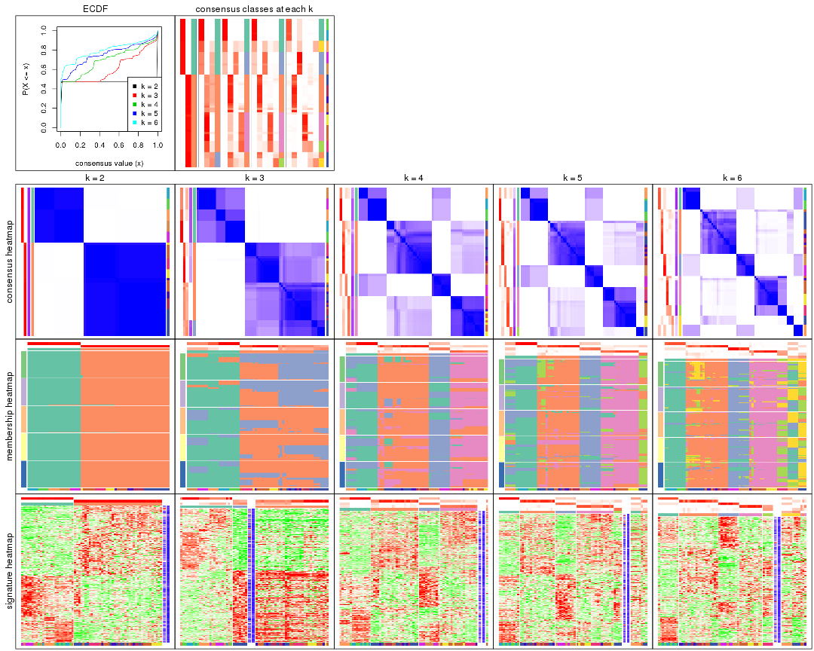

The plots are:

- The first row: a plot of the ECDF (Empirical cumulative distribution
  function) curves of the consensus matrix for each `k` and the heatmap of
  predicted classes for each `k`.
- The second row: heatmaps of the consensus matrix for each `k`.
- The third row: heatmaps of the membership matrix for each `k`.
- The fouth row: heatmaps of the signatures for each `k`.

All the plots in panels can be made by individual functions and they are
plotted later in this section.

`select_partition_number()` produces several plots showing different
statistics for choosing "optimized" `k`. There are following statistics:

- ECDF curves of the consensus matrix for each `k`;
- 1-PAC. [The PAC
  score](https://en.wikipedia.org/wiki/Consensus_clustering#Over-interpretation_potential_of_consensus_clustering)
  measures the proportion of the ambiguous subgrouping.
- Mean silhouette score.
- Concordance. The mean probability of fiting the consensus class ids in all
  partitions.
- Area increased. Denote $A_k$ as the area under the ECDF curve for current
  `k`, the area increased is defined as $A_k - A_{k-1}$.
- Rand index. The percent of pairs of samples that are both in a same cluster
  or both are not in a same cluster in the partition of k and k-1.
- Jaccard index. The ratio of pairs of samples are both in a same cluster in
  the partition of k and k-1 and the pairs of samples are both in a same
  cluster in the partition k or k-1.

The detailed explanations of these statistics can be found in [the cola
vignette](http://bioconductor.org/packages/devel/bioc/vignettes/cola/inst/doc/cola.html#toc_13).

Generally speaking, lower PAC score, higher mean silhouette score or higher
concordance corresponds to better partition. Rand index and Jaccard index
measure how similar the current partition is compared to partition with `k-1`.
If they are too similar, we won't accept `k` is better than `k-1`.

```r
select_partition_number(res)
```


The numeric values for all these statistics can be obtained by `get_stats()`.

```r
get_stats(res)
```

```
#>   k 1-PAC mean_silhouette concordance area_increased  Rand Jaccard
#> 2 2 1.000           0.996       0.996         0.4757 0.525   0.525
#> 3 3 0.625           0.427       0.700         0.2845 0.889   0.789
#> 4 4 0.608           0.809       0.765         0.1425 0.740   0.444
#> 5 5 0.676           0.779       0.794         0.0833 0.964   0.862
#> 6 6 0.746           0.748       0.767         0.0578 0.939   0.740
```

`suggest_best_k()` suggests the best $k$ based on these statistics. The rules are as follows:

- All $k$ with Jaccard index larger than 0.95 are removed because the increase of
  the partition number does not provides enough extra information. If all $k$ are removed,
  the best $k$ is assigned by `NA`.
- For $k$ with 1-PAC larger than 0.9, the maximal $k$ is taken as the "best k". Other $k$ is called "optional k".
- If it does not fit the second rule. The $k$ with the highest vote of highest
  1-PAC, mean silhouette and concordance is taken as the "best k".

```r
suggest_best_k(res)
```

```
#> [1] 2
```


Following shows the table of the partitions (You need to click the **show/hide
code output** link to see it). The membership matrix (columns with name `p*`)
is inferred by
[`clue::cl_consensus()`](https://www.rdocumentation.org/link/cl_consensus?package=clue)
function with the `SE` method. Basically the value in the membership matrix
represents the probability to belong to a certain group. The finall class
label for an item is determined with the group with highest probability it
belongs to.

In `get_classes()` function, the entropy is calculated from the membership
matrix and the silhouette score is calculated from the consensus matrix.


<script>
$( function() {
	$( '#tabs-SD-kmeans-get-classes' ).tabs();
} );
</script>
<div id='tabs-SD-kmeans-get-classes'>
<ul>
<li><a href='#tab-SD-kmeans-get-classes-1'>k = 2</a></li>
<li><a href='#tab-SD-kmeans-get-classes-2'>k = 3</a></li>
<li><a href='#tab-SD-kmeans-get-classes-3'>k = 4</a></li>
<li><a href='#tab-SD-kmeans-get-classes-4'>k = 5</a></li>
<li><a href='#tab-SD-kmeans-get-classes-5'>k = 6</a></li>
</ul>

<div id='tab-SD-kmeans-get-classes-1'>
<p><a id='tab-SD-kmeans-get-classes-1-a' style='color:#0366d6' href='#'>show/hide code output</a></p>
<pre><code class="r">cbind(get_classes(res, k = 2), get_membership(res, k = 2))
</code></pre>

<pre><code>#&gt;           class entropy silhouette    p1    p2
#&gt; GSM312811     2  0.0000      0.996 0.000 1.000
#&gt; GSM312812     2  0.0000      0.996 0.000 1.000
#&gt; GSM312813     2  0.0000      0.996 0.000 1.000
#&gt; GSM312814     2  0.0000      0.996 0.000 1.000
#&gt; GSM312815     2  0.0000      0.996 0.000 1.000
#&gt; GSM312816     2  0.0000      0.996 0.000 1.000
#&gt; GSM312817     2  0.0000      0.996 0.000 1.000
#&gt; GSM312818     2  0.0000      0.996 0.000 1.000
#&gt; GSM312819     2  0.0000      0.996 0.000 1.000
#&gt; GSM312820     2  0.0000      0.996 0.000 1.000
#&gt; GSM312821     2  0.0000      0.996 0.000 1.000
#&gt; GSM312822     2  0.0000      0.996 0.000 1.000
#&gt; GSM312823     2  0.0000      0.996 0.000 1.000
#&gt; GSM312824     2  0.0000      0.996 0.000 1.000
#&gt; GSM312825     2  0.0000      0.996 0.000 1.000
#&gt; GSM312826     2  0.0000      0.996 0.000 1.000
#&gt; GSM312839     2  0.0000      0.996 0.000 1.000
#&gt; GSM312840     2  0.0000      0.996 0.000 1.000
#&gt; GSM312841     2  0.0000      0.996 0.000 1.000
#&gt; GSM312843     2  0.0376      0.996 0.004 0.996
#&gt; GSM312844     2  0.0000      0.996 0.000 1.000
#&gt; GSM312845     2  0.1843      0.978 0.028 0.972
#&gt; GSM312846     2  0.0672      0.995 0.008 0.992
#&gt; GSM312847     2  0.0672      0.995 0.008 0.992
#&gt; GSM312848     2  0.0672      0.995 0.008 0.992
#&gt; GSM312849     2  0.0672      0.995 0.008 0.992
#&gt; GSM312851     2  0.0672      0.995 0.008 0.992
#&gt; GSM312853     2  0.0672      0.995 0.008 0.992
#&gt; GSM312854     2  0.0672      0.995 0.008 0.992
#&gt; GSM312856     2  0.0672      0.995 0.008 0.992
#&gt; GSM312857     2  0.0672      0.995 0.008 0.992
#&gt; GSM312858     2  0.0672      0.995 0.008 0.992
#&gt; GSM312859     2  0.0000      0.996 0.000 1.000
#&gt; GSM312860     2  0.0376      0.996 0.004 0.996
#&gt; GSM312861     2  0.0672      0.995 0.008 0.992
#&gt; GSM312862     2  0.0000      0.996 0.000 1.000
#&gt; GSM312863     2  0.0672      0.995 0.008 0.992
#&gt; GSM312864     2  0.0000      0.996 0.000 1.000
#&gt; GSM312865     2  0.0672      0.995 0.008 0.992
#&gt; GSM312867     2  0.0672      0.995 0.008 0.992
#&gt; GSM312868     2  0.0672      0.995 0.008 0.992
#&gt; GSM312869     2  0.0000      0.996 0.000 1.000
#&gt; GSM312870     1  0.0672      0.997 0.992 0.008
#&gt; GSM312872     1  0.0672      0.997 0.992 0.008
#&gt; GSM312874     1  0.0672      0.997 0.992 0.008
#&gt; GSM312875     1  0.0672      0.997 0.992 0.008
#&gt; GSM312876     1  0.0672      0.997 0.992 0.008
#&gt; GSM312877     1  0.0672      0.997 0.992 0.008
#&gt; GSM312879     1  0.0672      0.997 0.992 0.008
#&gt; GSM312882     1  0.0672      0.997 0.992 0.008
#&gt; GSM312883     1  0.0672      0.997 0.992 0.008
#&gt; GSM312886     1  0.0672      0.997 0.992 0.008
#&gt; GSM312887     1  0.0000      0.995 1.000 0.000
#&gt; GSM312890     1  0.0000      0.995 1.000 0.000
#&gt; GSM312893     1  0.0000      0.995 1.000 0.000
#&gt; GSM312894     1  0.0000      0.995 1.000 0.000
#&gt; GSM312895     1  0.0000      0.995 1.000 0.000
#&gt; GSM312937     1  0.0000      0.995 1.000 0.000
#&gt; GSM312938     1  0.0000      0.995 1.000 0.000
#&gt; GSM312939     1  0.0000      0.995 1.000 0.000
#&gt; GSM312940     1  0.0000      0.995 1.000 0.000
#&gt; GSM312941     1  0.0000      0.995 1.000 0.000
#&gt; GSM312942     1  0.0672      0.997 0.992 0.008
#&gt; GSM312943     1  0.0672      0.997 0.992 0.008
#&gt; GSM312944     1  0.0672      0.997 0.992 0.008
#&gt; GSM312945     1  0.0672      0.997 0.992 0.008
#&gt; GSM312946     1  0.0672      0.997 0.992 0.008
</code></pre>

<script>
$('#tab-SD-kmeans-get-classes-1-a').parent().next().next().hide();
$('#tab-SD-kmeans-get-classes-1-a').click(function(){
  $('#tab-SD-kmeans-get-classes-1-a').parent().next().next().toggle();
  return(false);
});
</script>
</div>

<div id='tab-SD-kmeans-get-classes-2'>
<p><a id='tab-SD-kmeans-get-classes-2-a' style='color:#0366d6' href='#'>show/hide code output</a></p>
<pre><code class="r">cbind(get_classes(res, k = 3), get_membership(res, k = 3))
</code></pre>

<pre><code>#&gt;           class entropy silhouette    p1    p2    p3
#&gt; GSM312811     3  0.6302     0.8415 0.000 0.480 0.520
#&gt; GSM312812     2  0.6192    -0.4610 0.000 0.580 0.420
#&gt; GSM312813     2  0.6126    -0.3952 0.000 0.600 0.400
#&gt; GSM312814     3  0.6299     0.8474 0.000 0.476 0.524
#&gt; GSM312815     2  0.6192    -0.4610 0.000 0.580 0.420
#&gt; GSM312816     3  0.6168     0.8955 0.000 0.412 0.588
#&gt; GSM312817     2  0.6192    -0.4793 0.000 0.580 0.420
#&gt; GSM312818     3  0.6168     0.8955 0.000 0.412 0.588
#&gt; GSM312819     2  0.6309    -0.7977 0.000 0.500 0.500
#&gt; GSM312820     3  0.6168     0.8955 0.000 0.412 0.588
#&gt; GSM312821     3  0.6168     0.8955 0.000 0.412 0.588
#&gt; GSM312822     3  0.6302     0.8415 0.000 0.480 0.520
#&gt; GSM312823     2  0.6126    -0.3952 0.000 0.600 0.400
#&gt; GSM312824     2  0.6126    -0.3952 0.000 0.600 0.400
#&gt; GSM312825     2  0.6126    -0.3952 0.000 0.600 0.400
#&gt; GSM312826     2  0.6126    -0.3952 0.000 0.600 0.400
#&gt; GSM312839     2  0.6140    -0.4070 0.000 0.596 0.404
#&gt; GSM312840     2  0.6140    -0.4081 0.000 0.596 0.404
#&gt; GSM312841     2  0.6204    -0.4772 0.000 0.576 0.424
#&gt; GSM312843     2  0.1753     0.4627 0.000 0.952 0.048
#&gt; GSM312844     2  0.6140    -0.4070 0.000 0.596 0.404
#&gt; GSM312845     2  0.0747     0.4773 0.016 0.984 0.000
#&gt; GSM312846     2  0.0000     0.4886 0.000 1.000 0.000
#&gt; GSM312847     2  0.0000     0.4886 0.000 1.000 0.000
#&gt; GSM312848     2  0.0000     0.4886 0.000 1.000 0.000
#&gt; GSM312849     2  0.0000     0.4886 0.000 1.000 0.000
#&gt; GSM312851     2  0.3752     0.3870 0.000 0.856 0.144
#&gt; GSM312853     2  0.3752     0.3870 0.000 0.856 0.144
#&gt; GSM312854     2  0.3686     0.3912 0.000 0.860 0.140
#&gt; GSM312856     2  0.3686     0.3912 0.000 0.860 0.140
#&gt; GSM312857     2  0.3752     0.3870 0.000 0.856 0.144
#&gt; GSM312858     2  0.0000     0.4886 0.000 1.000 0.000
#&gt; GSM312859     2  0.5905    -0.3126 0.000 0.648 0.352
#&gt; GSM312860     2  0.5178    -0.0211 0.000 0.744 0.256
#&gt; GSM312861     2  0.0000     0.4886 0.000 1.000 0.000
#&gt; GSM312862     2  0.0237     0.4863 0.000 0.996 0.004
#&gt; GSM312863     2  0.3551     0.3974 0.000 0.868 0.132
#&gt; GSM312864     2  0.6215    -0.5059 0.000 0.572 0.428
#&gt; GSM312865     2  0.0237     0.4870 0.000 0.996 0.004
#&gt; GSM312867     2  0.0000     0.4886 0.000 1.000 0.000
#&gt; GSM312868     2  0.0000     0.4886 0.000 1.000 0.000
#&gt; GSM312869     2  0.6126    -0.3952 0.000 0.600 0.400
#&gt; GSM312870     1  0.6062     0.8463 0.616 0.000 0.384
#&gt; GSM312872     1  0.6062     0.8463 0.616 0.000 0.384
#&gt; GSM312874     1  0.6062     0.8463 0.616 0.000 0.384
#&gt; GSM312875     1  0.6062     0.8463 0.616 0.000 0.384
#&gt; GSM312876     1  0.6062     0.8463 0.616 0.000 0.384
#&gt; GSM312877     1  0.5810     0.8548 0.664 0.000 0.336
#&gt; GSM312879     1  0.6062     0.8463 0.616 0.000 0.384
#&gt; GSM312882     1  0.6062     0.8463 0.616 0.000 0.384
#&gt; GSM312883     1  0.6062     0.8463 0.616 0.000 0.384
#&gt; GSM312886     1  0.6062     0.8463 0.616 0.000 0.384
#&gt; GSM312887     1  0.0000     0.8618 1.000 0.000 0.000
#&gt; GSM312890     1  0.0000     0.8618 1.000 0.000 0.000
#&gt; GSM312893     1  0.0000     0.8618 1.000 0.000 0.000
#&gt; GSM312894     1  0.0000     0.8618 1.000 0.000 0.000
#&gt; GSM312895     1  0.0000     0.8618 1.000 0.000 0.000
#&gt; GSM312937     1  0.0000     0.8618 1.000 0.000 0.000
#&gt; GSM312938     1  0.0000     0.8618 1.000 0.000 0.000
#&gt; GSM312939     1  0.0000     0.8618 1.000 0.000 0.000
#&gt; GSM312940     1  0.0000     0.8618 1.000 0.000 0.000
#&gt; GSM312941     1  0.0000     0.8618 1.000 0.000 0.000
#&gt; GSM312942     1  0.4346     0.8711 0.816 0.000 0.184
#&gt; GSM312943     1  0.4346     0.8711 0.816 0.000 0.184
#&gt; GSM312944     1  0.4346     0.8711 0.816 0.000 0.184
#&gt; GSM312945     1  0.4346     0.8711 0.816 0.000 0.184
#&gt; GSM312946     1  0.4346     0.8711 0.816 0.000 0.184
</code></pre>

<script>
$('#tab-SD-kmeans-get-classes-2-a').parent().next().next().hide();
$('#tab-SD-kmeans-get-classes-2-a').click(function(){
  $('#tab-SD-kmeans-get-classes-2-a').parent().next().next().toggle();
  return(false);
});
</script>
</div>

<div id='tab-SD-kmeans-get-classes-3'>
<p><a id='tab-SD-kmeans-get-classes-3-a' style='color:#0366d6' href='#'>show/hide code output</a></p>
<pre><code class="r">cbind(get_classes(res, k = 4), get_membership(res, k = 4))
</code></pre>

<pre><code>#&gt;           class entropy silhouette    p1    p2    p3    p4
#&gt; GSM312811     2  0.3885      0.773 0.000 0.844 0.064 0.092
#&gt; GSM312812     2  0.0707      0.824 0.000 0.980 0.020 0.000
#&gt; GSM312813     2  0.1724      0.827 0.000 0.948 0.020 0.032
#&gt; GSM312814     2  0.4605      0.753 0.000 0.800 0.108 0.092
#&gt; GSM312815     2  0.1389      0.818 0.000 0.952 0.048 0.000
#&gt; GSM312816     2  0.6764      0.602 0.000 0.596 0.260 0.144
#&gt; GSM312817     2  0.1929      0.828 0.000 0.940 0.024 0.036
#&gt; GSM312818     2  0.6788      0.599 0.000 0.592 0.264 0.144
#&gt; GSM312819     2  0.3160      0.801 0.000 0.872 0.020 0.108
#&gt; GSM312820     2  0.6764      0.602 0.000 0.596 0.260 0.144
#&gt; GSM312821     2  0.6764      0.602 0.000 0.596 0.260 0.144
#&gt; GSM312822     2  0.4605      0.753 0.000 0.800 0.108 0.092
#&gt; GSM312823     2  0.1022      0.824 0.000 0.968 0.000 0.032
#&gt; GSM312824     2  0.1022      0.824 0.000 0.968 0.000 0.032
#&gt; GSM312825     2  0.1022      0.824 0.000 0.968 0.000 0.032
#&gt; GSM312826     2  0.1022      0.824 0.000 0.968 0.000 0.032
#&gt; GSM312839     2  0.0921      0.826 0.000 0.972 0.000 0.028
#&gt; GSM312840     2  0.1356      0.826 0.000 0.960 0.008 0.032
#&gt; GSM312841     2  0.0707      0.825 0.000 0.980 0.020 0.000
#&gt; GSM312843     4  0.4744      0.881 0.000 0.284 0.012 0.704
#&gt; GSM312844     2  0.0592      0.827 0.000 0.984 0.000 0.016
#&gt; GSM312845     4  0.4746      0.895 0.008 0.304 0.000 0.688
#&gt; GSM312846     4  0.4477      0.898 0.000 0.312 0.000 0.688
#&gt; GSM312847     4  0.4454      0.900 0.000 0.308 0.000 0.692
#&gt; GSM312848     4  0.4454      0.900 0.000 0.308 0.000 0.692
#&gt; GSM312849     4  0.4500      0.895 0.000 0.316 0.000 0.684
#&gt; GSM312851     4  0.4789      0.820 0.000 0.172 0.056 0.772
#&gt; GSM312853     4  0.4789      0.820 0.000 0.172 0.056 0.772
#&gt; GSM312854     4  0.4832      0.824 0.000 0.176 0.056 0.768
#&gt; GSM312856     4  0.4832      0.824 0.000 0.176 0.056 0.768
#&gt; GSM312857     4  0.4789      0.820 0.000 0.172 0.056 0.772
#&gt; GSM312858     4  0.4431      0.900 0.000 0.304 0.000 0.696
#&gt; GSM312859     2  0.2345      0.753 0.000 0.900 0.000 0.100
#&gt; GSM312860     2  0.3649      0.556 0.000 0.796 0.000 0.204
#&gt; GSM312861     4  0.4522      0.893 0.000 0.320 0.000 0.680
#&gt; GSM312862     4  0.4522      0.892 0.000 0.320 0.000 0.680
#&gt; GSM312863     4  0.4511      0.831 0.000 0.176 0.040 0.784
#&gt; GSM312864     2  0.5686      0.363 0.000 0.592 0.032 0.376
#&gt; GSM312865     4  0.4406      0.900 0.000 0.300 0.000 0.700
#&gt; GSM312867     4  0.4500      0.895 0.000 0.316 0.000 0.684
#&gt; GSM312868     4  0.4406      0.900 0.000 0.300 0.000 0.700
#&gt; GSM312869     2  0.1022      0.824 0.000 0.968 0.000 0.032
#&gt; GSM312870     3  0.4605      0.973 0.336 0.000 0.664 0.000
#&gt; GSM312872     3  0.4605      0.973 0.336 0.000 0.664 0.000
#&gt; GSM312874     3  0.4605      0.973 0.336 0.000 0.664 0.000
#&gt; GSM312875     3  0.4781      0.973 0.336 0.000 0.660 0.004
#&gt; GSM312876     3  0.4781      0.973 0.336 0.000 0.660 0.004
#&gt; GSM312877     3  0.5535      0.817 0.420 0.000 0.560 0.020
#&gt; GSM312879     3  0.5038      0.972 0.336 0.000 0.652 0.012
#&gt; GSM312882     3  0.5252      0.971 0.336 0.000 0.644 0.020
#&gt; GSM312883     3  0.5252      0.971 0.336 0.000 0.644 0.020
#&gt; GSM312886     3  0.5149      0.971 0.336 0.000 0.648 0.016
#&gt; GSM312887     1  0.0000      0.830 1.000 0.000 0.000 0.000
#&gt; GSM312890     1  0.0000      0.830 1.000 0.000 0.000 0.000
#&gt; GSM312893     1  0.0000      0.830 1.000 0.000 0.000 0.000
#&gt; GSM312894     1  0.0000      0.830 1.000 0.000 0.000 0.000
#&gt; GSM312895     1  0.0000      0.830 1.000 0.000 0.000 0.000
#&gt; GSM312937     1  0.0000      0.830 1.000 0.000 0.000 0.000
#&gt; GSM312938     1  0.0000      0.830 1.000 0.000 0.000 0.000
#&gt; GSM312939     1  0.0000      0.830 1.000 0.000 0.000 0.000
#&gt; GSM312940     1  0.0000      0.830 1.000 0.000 0.000 0.000
#&gt; GSM312941     1  0.0000      0.830 1.000 0.000 0.000 0.000
#&gt; GSM312942     1  0.6262      0.549 0.660 0.000 0.208 0.132
#&gt; GSM312943     1  0.6262      0.549 0.660 0.000 0.208 0.132
#&gt; GSM312944     1  0.6262      0.549 0.660 0.000 0.208 0.132
#&gt; GSM312945     1  0.6262      0.549 0.660 0.000 0.208 0.132
#&gt; GSM312946     1  0.6262      0.549 0.660 0.000 0.208 0.132
</code></pre>

<script>
$('#tab-SD-kmeans-get-classes-3-a').parent().next().next().hide();
$('#tab-SD-kmeans-get-classes-3-a').click(function(){
  $('#tab-SD-kmeans-get-classes-3-a').parent().next().next().toggle();
  return(false);
});
</script>
</div>

<div id='tab-SD-kmeans-get-classes-4'>
<p><a id='tab-SD-kmeans-get-classes-4-a' style='color:#0366d6' href='#'>show/hide code output</a></p>
<pre><code class="r">cbind(get_classes(res, k = 5), get_membership(res, k = 5))
</code></pre>

<pre><code>#&gt;           class entropy silhouette    p1    p2    p3    p4    p5
#&gt; GSM312811     2   0.454      0.602 0.000 0.768 0.048 0.024 0.160
#&gt; GSM312812     2   0.215      0.787 0.000 0.916 0.036 0.000 0.048
#&gt; GSM312813     2   0.315      0.806 0.000 0.876 0.052 0.028 0.044
#&gt; GSM312814     2   0.518      0.386 0.000 0.676 0.040 0.024 0.260
#&gt; GSM312815     2   0.315      0.705 0.000 0.844 0.028 0.000 0.128
#&gt; GSM312816     5   0.430      1.000 0.000 0.260 0.000 0.028 0.712
#&gt; GSM312817     2   0.343      0.803 0.000 0.860 0.064 0.028 0.048
#&gt; GSM312818     5   0.430      1.000 0.000 0.260 0.000 0.028 0.712
#&gt; GSM312819     2   0.254      0.807 0.000 0.904 0.052 0.032 0.012
#&gt; GSM312820     5   0.430      1.000 0.000 0.260 0.000 0.028 0.712
#&gt; GSM312821     5   0.430      1.000 0.000 0.260 0.000 0.028 0.712
#&gt; GSM312822     2   0.518      0.386 0.000 0.676 0.040 0.024 0.260
#&gt; GSM312823     2   0.128      0.830 0.000 0.956 0.012 0.032 0.000
#&gt; GSM312824     2   0.117      0.829 0.000 0.960 0.008 0.032 0.000
#&gt; GSM312825     2   0.117      0.829 0.000 0.960 0.008 0.032 0.000
#&gt; GSM312826     2   0.117      0.829 0.000 0.960 0.008 0.032 0.000
#&gt; GSM312839     2   0.149      0.830 0.000 0.948 0.024 0.028 0.000
#&gt; GSM312840     2   0.131      0.828 0.000 0.956 0.020 0.024 0.000
#&gt; GSM312841     2   0.101      0.812 0.000 0.968 0.020 0.000 0.012
#&gt; GSM312843     4   0.468      0.828 0.000 0.176 0.072 0.744 0.008
#&gt; GSM312844     2   0.101      0.830 0.000 0.968 0.012 0.020 0.000
#&gt; GSM312845     4   0.286      0.884 0.000 0.132 0.004 0.856 0.008
#&gt; GSM312846     4   0.286      0.884 0.000 0.132 0.004 0.856 0.008
#&gt; GSM312847     4   0.286      0.884 0.000 0.132 0.004 0.856 0.008
#&gt; GSM312848     4   0.286      0.884 0.000 0.132 0.004 0.856 0.008
#&gt; GSM312849     4   0.286      0.884 0.000 0.132 0.004 0.856 0.008
#&gt; GSM312851     4   0.570      0.779 0.000 0.068 0.116 0.708 0.108
#&gt; GSM312853     4   0.570      0.779 0.000 0.068 0.116 0.708 0.108
#&gt; GSM312854     4   0.570      0.779 0.000 0.068 0.116 0.708 0.108
#&gt; GSM312856     4   0.570      0.779 0.000 0.068 0.116 0.708 0.108
#&gt; GSM312857     4   0.570      0.779 0.000 0.068 0.116 0.708 0.108
#&gt; GSM312858     4   0.242      0.884 0.000 0.132 0.000 0.868 0.000
#&gt; GSM312859     2   0.271      0.766 0.000 0.876 0.024 0.100 0.000
#&gt; GSM312860     2   0.310      0.708 0.000 0.836 0.016 0.148 0.000
#&gt; GSM312861     4   0.313      0.869 0.000 0.156 0.008 0.832 0.004
#&gt; GSM312862     4   0.331      0.869 0.000 0.144 0.020 0.832 0.004
#&gt; GSM312863     4   0.540      0.791 0.000 0.068 0.116 0.732 0.084
#&gt; GSM312864     2   0.661      0.150 0.000 0.520 0.092 0.344 0.044
#&gt; GSM312865     4   0.233      0.883 0.000 0.124 0.000 0.876 0.000
#&gt; GSM312867     4   0.286      0.884 0.000 0.132 0.004 0.856 0.008
#&gt; GSM312868     4   0.254      0.884 0.000 0.128 0.004 0.868 0.000
#&gt; GSM312869     2   0.117      0.829 0.000 0.960 0.008 0.032 0.000
#&gt; GSM312870     3   0.361      0.964 0.268 0.000 0.732 0.000 0.000
#&gt; GSM312872     3   0.361      0.964 0.268 0.000 0.732 0.000 0.000
#&gt; GSM312874     3   0.361      0.964 0.268 0.000 0.732 0.000 0.000
#&gt; GSM312875     3   0.361      0.964 0.268 0.000 0.732 0.000 0.000
#&gt; GSM312876     3   0.361      0.964 0.268 0.000 0.732 0.000 0.000
#&gt; GSM312877     3   0.530      0.861 0.332 0.000 0.616 0.020 0.032
#&gt; GSM312879     3   0.465      0.960 0.268 0.000 0.696 0.012 0.024
#&gt; GSM312882     3   0.499      0.954 0.268 0.000 0.680 0.020 0.032
#&gt; GSM312883     3   0.499      0.954 0.268 0.000 0.680 0.020 0.032
#&gt; GSM312886     3   0.473      0.959 0.268 0.000 0.692 0.012 0.028
#&gt; GSM312887     1   0.029      0.759 0.992 0.000 0.000 0.000 0.008
#&gt; GSM312890     1   0.000      0.762 1.000 0.000 0.000 0.000 0.000
#&gt; GSM312893     1   0.000      0.762 1.000 0.000 0.000 0.000 0.000
#&gt; GSM312894     1   0.000      0.762 1.000 0.000 0.000 0.000 0.000
#&gt; GSM312895     1   0.000      0.762 1.000 0.000 0.000 0.000 0.000
#&gt; GSM312937     1   0.000      0.762 1.000 0.000 0.000 0.000 0.000
#&gt; GSM312938     1   0.029      0.759 0.992 0.000 0.000 0.000 0.008
#&gt; GSM312939     1   0.000      0.762 1.000 0.000 0.000 0.000 0.000
#&gt; GSM312940     1   0.000      0.762 1.000 0.000 0.000 0.000 0.000
#&gt; GSM312941     1   0.000      0.762 1.000 0.000 0.000 0.000 0.000
#&gt; GSM312942     1   0.717      0.299 0.476 0.000 0.320 0.048 0.156
#&gt; GSM312943     1   0.717      0.299 0.476 0.000 0.320 0.048 0.156
#&gt; GSM312944     1   0.717      0.299 0.476 0.000 0.320 0.048 0.156
#&gt; GSM312945     1   0.717      0.299 0.476 0.000 0.320 0.048 0.156
#&gt; GSM312946     1   0.717      0.299 0.476 0.000 0.320 0.048 0.156
</code></pre>

<script>
$('#tab-SD-kmeans-get-classes-4-a').parent().next().next().hide();
$('#tab-SD-kmeans-get-classes-4-a').click(function(){
  $('#tab-SD-kmeans-get-classes-4-a').parent().next().next().toggle();
  return(false);
});
</script>
</div>

<div id='tab-SD-kmeans-get-classes-5'>
<p><a id='tab-SD-kmeans-get-classes-5-a' style='color:#0366d6' href='#'>show/hide code output</a></p>
<pre><code class="r">cbind(get_classes(res, k = 6), get_membership(res, k = 6))
</code></pre>

<pre><code>#&gt;           class entropy silhouette    p1    p2    p3    p4    p5    p6
#&gt; GSM312811     2  0.5278      0.725 0.056 0.676 0.000 0.000 0.184 0.084
#&gt; GSM312812     2  0.2395      0.835 0.012 0.892 0.000 0.000 0.076 0.020
#&gt; GSM312813     2  0.3997      0.814 0.040 0.796 0.000 0.012 0.128 0.024
#&gt; GSM312814     2  0.5846      0.639 0.052 0.612 0.000 0.000 0.200 0.136
#&gt; GSM312815     2  0.3397      0.805 0.024 0.836 0.000 0.000 0.084 0.056
#&gt; GSM312816     6  0.5438      0.308 0.000 0.172 0.000 0.000 0.260 0.568
#&gt; GSM312817     2  0.4927      0.790 0.076 0.724 0.000 0.012 0.156 0.032
#&gt; GSM312818     6  0.5438      0.308 0.000 0.172 0.000 0.000 0.260 0.568
#&gt; GSM312819     2  0.3752      0.807 0.076 0.804 0.000 0.004 0.108 0.008
#&gt; GSM312820     6  0.5438      0.308 0.000 0.172 0.000 0.000 0.260 0.568
#&gt; GSM312821     6  0.5438      0.308 0.000 0.172 0.000 0.000 0.260 0.568
#&gt; GSM312822     2  0.5846      0.639 0.052 0.612 0.000 0.000 0.200 0.136
#&gt; GSM312823     2  0.1774      0.848 0.020 0.936 0.000 0.024 0.016 0.004
#&gt; GSM312824     2  0.0692      0.848 0.004 0.976 0.000 0.020 0.000 0.000
#&gt; GSM312825     2  0.0692      0.848 0.004 0.976 0.000 0.020 0.000 0.000
#&gt; GSM312826     2  0.0692      0.848 0.004 0.976 0.000 0.020 0.000 0.000
#&gt; GSM312839     2  0.1882      0.848 0.024 0.928 0.000 0.020 0.028 0.000
#&gt; GSM312840     2  0.1599      0.843 0.028 0.940 0.000 0.008 0.024 0.000
#&gt; GSM312841     2  0.1788      0.839 0.040 0.928 0.000 0.000 0.028 0.004
#&gt; GSM312843     4  0.6033      0.155 0.072 0.180 0.000 0.624 0.116 0.008
#&gt; GSM312844     2  0.1690      0.849 0.020 0.940 0.000 0.020 0.016 0.004
#&gt; GSM312845     4  0.0717      0.813 0.008 0.016 0.000 0.976 0.000 0.000
#&gt; GSM312846     4  0.0806      0.812 0.008 0.020 0.000 0.972 0.000 0.000
#&gt; GSM312847     4  0.0717      0.813 0.008 0.016 0.000 0.976 0.000 0.000
#&gt; GSM312848     4  0.0717      0.813 0.008 0.016 0.000 0.976 0.000 0.000
#&gt; GSM312849     4  0.0806      0.812 0.008 0.020 0.000 0.972 0.000 0.000
#&gt; GSM312851     5  0.4179      1.000 0.000 0.012 0.000 0.472 0.516 0.000
#&gt; GSM312853     5  0.4179      1.000 0.000 0.012 0.000 0.472 0.516 0.000
#&gt; GSM312854     5  0.4179      1.000 0.000 0.012 0.000 0.472 0.516 0.000
#&gt; GSM312856     5  0.4179      1.000 0.000 0.012 0.000 0.472 0.516 0.000
#&gt; GSM312857     5  0.4179      1.000 0.000 0.012 0.000 0.472 0.516 0.000
#&gt; GSM312858     4  0.2014      0.781 0.024 0.016 0.000 0.924 0.032 0.004
#&gt; GSM312859     2  0.2577      0.828 0.024 0.896 0.000 0.048 0.024 0.008
#&gt; GSM312860     2  0.2726      0.761 0.008 0.848 0.000 0.136 0.000 0.008
#&gt; GSM312861     4  0.1699      0.785 0.012 0.040 0.000 0.936 0.004 0.008
#&gt; GSM312862     4  0.2485      0.746 0.032 0.040 0.000 0.900 0.024 0.004
#&gt; GSM312863     4  0.4410     -0.903 0.008 0.012 0.000 0.508 0.472 0.000
#&gt; GSM312864     2  0.7115      0.288 0.084 0.464 0.000 0.176 0.264 0.012
#&gt; GSM312865     4  0.1511      0.782 0.012 0.012 0.000 0.944 0.032 0.000
#&gt; GSM312867     4  0.0458      0.813 0.000 0.016 0.000 0.984 0.000 0.000
#&gt; GSM312868     4  0.2127      0.769 0.024 0.016 0.000 0.920 0.032 0.008
#&gt; GSM312869     2  0.0837      0.847 0.004 0.972 0.000 0.020 0.004 0.000
#&gt; GSM312870     3  0.0146      0.943 0.000 0.000 0.996 0.000 0.000 0.004
#&gt; GSM312872     3  0.0146      0.943 0.000 0.000 0.996 0.000 0.000 0.004
#&gt; GSM312874     3  0.0146      0.943 0.000 0.000 0.996 0.000 0.000 0.004
#&gt; GSM312875     3  0.0146      0.943 0.000 0.000 0.996 0.000 0.004 0.000
#&gt; GSM312876     3  0.0146      0.943 0.000 0.000 0.996 0.000 0.004 0.000
#&gt; GSM312877     3  0.3490      0.868 0.056 0.000 0.836 0.012 0.084 0.012
#&gt; GSM312879     3  0.1606      0.939 0.000 0.000 0.932 0.004 0.056 0.008
#&gt; GSM312882     3  0.2323      0.927 0.000 0.000 0.892 0.012 0.084 0.012
#&gt; GSM312883     3  0.2323      0.927 0.000 0.000 0.892 0.012 0.084 0.012
#&gt; GSM312886     3  0.1888      0.935 0.000 0.000 0.916 0.004 0.068 0.012
#&gt; GSM312887     1  0.3651      0.955 0.792 0.000 0.160 0.000 0.032 0.016
#&gt; GSM312890     1  0.2454      0.989 0.840 0.000 0.160 0.000 0.000 0.000
#&gt; GSM312893     1  0.2454      0.989 0.840 0.000 0.160 0.000 0.000 0.000
#&gt; GSM312894     1  0.2454      0.989 0.840 0.000 0.160 0.000 0.000 0.000
#&gt; GSM312895     1  0.2454      0.989 0.840 0.000 0.160 0.000 0.000 0.000
#&gt; GSM312937     1  0.2454      0.989 0.840 0.000 0.160 0.000 0.000 0.000
#&gt; GSM312938     1  0.3651      0.955 0.792 0.000 0.160 0.000 0.032 0.016
#&gt; GSM312939     1  0.2454      0.989 0.840 0.000 0.160 0.000 0.000 0.000
#&gt; GSM312940     1  0.2454      0.989 0.840 0.000 0.160 0.000 0.000 0.000
#&gt; GSM312941     1  0.2454      0.989 0.840 0.000 0.160 0.000 0.000 0.000
#&gt; GSM312942     6  0.6094      0.243 0.312 0.000 0.300 0.000 0.000 0.388
#&gt; GSM312943     6  0.6094      0.243 0.312 0.000 0.300 0.000 0.000 0.388
#&gt; GSM312944     6  0.6094      0.243 0.312 0.000 0.300 0.000 0.000 0.388
#&gt; GSM312945     6  0.6094      0.243 0.312 0.000 0.300 0.000 0.000 0.388
#&gt; GSM312946     6  0.6094      0.243 0.312 0.000 0.300 0.000 0.000 0.388
</code></pre>

<script>
$('#tab-SD-kmeans-get-classes-5-a').parent().next().next().hide();
$('#tab-SD-kmeans-get-classes-5-a').click(function(){
  $('#tab-SD-kmeans-get-classes-5-a').parent().next().next().toggle();
  return(false);
});
</script>
</div>
</div>

Heatmaps for the consensus matrix. It visualizes the probability of two
samples to be in a same group.


<script>
$( function() {
	$( '#tabs-SD-kmeans-consensus-heatmap' ).tabs();
} );
</script>
<div id='tabs-SD-kmeans-consensus-heatmap'>
<ul>
<li><a href='#tab-SD-kmeans-consensus-heatmap-1'>k = 2</a></li>
<li><a href='#tab-SD-kmeans-consensus-heatmap-2'>k = 3</a></li>
<li><a href='#tab-SD-kmeans-consensus-heatmap-3'>k = 4</a></li>
<li><a href='#tab-SD-kmeans-consensus-heatmap-4'>k = 5</a></li>
<li><a href='#tab-SD-kmeans-consensus-heatmap-5'>k = 6</a></li>
</ul>
<div id='tab-SD-kmeans-consensus-heatmap-1'>
<pre><code class="r">consensus_heatmap(res, k = 2)
</code></pre>

<p>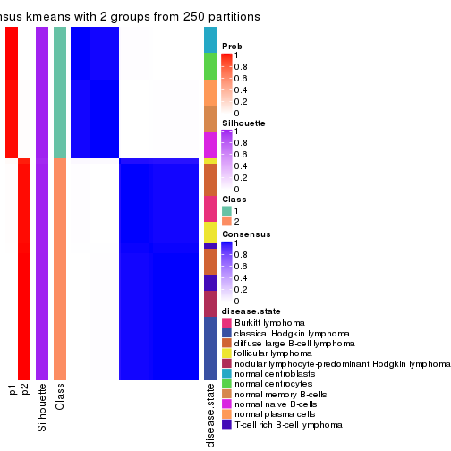</p>

</div>
<div id='tab-SD-kmeans-consensus-heatmap-2'>
<pre><code class="r">consensus_heatmap(res, k = 3)
</code></pre>

<p></p>

</div>
<div id='tab-SD-kmeans-consensus-heatmap-3'>
<pre><code class="r">consensus_heatmap(res, k = 4)
</code></pre>

<p></p>

</div>
<div id='tab-SD-kmeans-consensus-heatmap-4'>
<pre><code class="r">consensus_heatmap(res, k = 5)
</code></pre>

<p></p>

</div>
<div id='tab-SD-kmeans-consensus-heatmap-5'>
<pre><code class="r">consensus_heatmap(res, k = 6)
</code></pre>

<p></p>

</div>
</div>

Heatmaps for the membership of samples in all partitions to see how consistent they are:


<script>
$( function() {
	$( '#tabs-SD-kmeans-membership-heatmap' ).tabs();
} );
</script>
<div id='tabs-SD-kmeans-membership-heatmap'>
<ul>
<li><a href='#tab-SD-kmeans-membership-heatmap-1'>k = 2</a></li>
<li><a href='#tab-SD-kmeans-membership-heatmap-2'>k = 3</a></li>
<li><a href='#tab-SD-kmeans-membership-heatmap-3'>k = 4</a></li>
<li><a href='#tab-SD-kmeans-membership-heatmap-4'>k = 5</a></li>
<li><a href='#tab-SD-kmeans-membership-heatmap-5'>k = 6</a></li>
</ul>
<div id='tab-SD-kmeans-membership-heatmap-1'>
<pre><code class="r">membership_heatmap(res, k = 2)
</code></pre>

<p></p>

</div>
<div id='tab-SD-kmeans-membership-heatmap-2'>
<pre><code class="r">membership_heatmap(res, k = 3)
</code></pre>

<p></p>

</div>
<div id='tab-SD-kmeans-membership-heatmap-3'>
<pre><code class="r">membership_heatmap(res, k = 4)
</code></pre>

<p></p>

</div>
<div id='tab-SD-kmeans-membership-heatmap-4'>
<pre><code class="r">membership_heatmap(res, k = 5)
</code></pre>

<p></p>

</div>
<div id='tab-SD-kmeans-membership-heatmap-5'>
<pre><code class="r">membership_heatmap(res, k = 6)
</code></pre>

<p></p>

</div>
</div>

As soon as we have had the classes for columns, we can look for signatures
which are significantly different between classes which can be candidate marks
for certain classes. Following are the heatmaps for signatures.


Signature heatmaps where rows are scaled:


<script>
$( function() {
	$( '#tabs-SD-kmeans-get-signatures' ).tabs();
} );
</script>
<div id='tabs-SD-kmeans-get-signatures'>
<ul>
<li><a href='#tab-SD-kmeans-get-signatures-1'>k = 2</a></li>
<li><a href='#tab-SD-kmeans-get-signatures-2'>k = 3</a></li>
<li><a href='#tab-SD-kmeans-get-signatures-3'>k = 4</a></li>
<li><a href='#tab-SD-kmeans-get-signatures-4'>k = 5</a></li>
<li><a href='#tab-SD-kmeans-get-signatures-5'>k = 6</a></li>
</ul>
<div id='tab-SD-kmeans-get-signatures-1'>
<pre><code class="r">get_signatures(res, k = 2)
</code></pre>

<p></p>

</div>
<div id='tab-SD-kmeans-get-signatures-2'>
<pre><code class="r">get_signatures(res, k = 3)
</code></pre>

<p></p>

</div>
<div id='tab-SD-kmeans-get-signatures-3'>
<pre><code class="r">get_signatures(res, k = 4)
</code></pre>

<pre><code>#&gt; Error in mat[ceiling(1:nr/h_ratio), ceiling(1:nc/w_ratio), drop = FALSE]: subscript out of bounds
</code></pre>

<p></p>

</div>
<div id='tab-SD-kmeans-get-signatures-4'>
<pre><code class="r">get_signatures(res, k = 5)
</code></pre>

<p></p>

</div>
<div id='tab-SD-kmeans-get-signatures-5'>
<pre><code class="r">get_signatures(res, k = 6)
</code></pre>

<p></p>

</div>
</div>


Signature heatmaps where rows are not scaled:


<script>
$( function() {
	$( '#tabs-SD-kmeans-get-signatures-no-scale' ).tabs();
} );
</script>
<div id='tabs-SD-kmeans-get-signatures-no-scale'>
<ul>
<li><a href='#tab-SD-kmeans-get-signatures-no-scale-1'>k = 2</a></li>
<li><a href='#tab-SD-kmeans-get-signatures-no-scale-2'>k = 3</a></li>
<li><a href='#tab-SD-kmeans-get-signatures-no-scale-3'>k = 4</a></li>
<li><a href='#tab-SD-kmeans-get-signatures-no-scale-4'>k = 5</a></li>
<li><a href='#tab-SD-kmeans-get-signatures-no-scale-5'>k = 6</a></li>
</ul>
<div id='tab-SD-kmeans-get-signatures-no-scale-1'>
<pre><code class="r">get_signatures(res, k = 2, scale_rows = FALSE)
</code></pre>

<p></p>

</div>
<div id='tab-SD-kmeans-get-signatures-no-scale-2'>
<pre><code class="r">get_signatures(res, k = 3, scale_rows = FALSE)
</code></pre>

<p></p>

</div>
<div id='tab-SD-kmeans-get-signatures-no-scale-3'>
<pre><code class="r">get_signatures(res, k = 4, scale_rows = FALSE)
</code></pre>

<p></p>

</div>
<div id='tab-SD-kmeans-get-signatures-no-scale-4'>
<pre><code class="r">get_signatures(res, k = 5, scale_rows = FALSE)
</code></pre>

<p></p>

</div>
<div id='tab-SD-kmeans-get-signatures-no-scale-5'>
<pre><code class="r">get_signatures(res, k = 6, scale_rows = FALSE)
</code></pre>

<p></p>

</div>
</div>


Compare the overlap of signatures from different k:

```r
compare_signatures(res)
```


`get_signature()` returns a data frame invisibly. TO get the list of signatures, the function
call should be assigned to a variable explicitly. In following code, if `plot` argument is set
to `FALSE`, no heatmap is plotted while only the differential analysis is performed.

```r
# code only for demonstration
tb = get_signature(res, k = ..., plot = FALSE)
```

An example of the output of `tb` is:

```
#>   which_row         fdr    mean_1    mean_2 scaled_mean_1 scaled_mean_2 km
#> 1        38 0.042760348  8.373488  9.131774    -0.5533452     0.5164555  1
#> 2        40 0.018707592  7.106213  8.469186    -0.6173731     0.5762149  1
#> 3        55 0.019134737 10.221463 11.207825    -0.6159697     0.5749050  1
#> 4        59 0.006059896  5.921854  7.869574    -0.6899429     0.6439467  1
#> 5        60 0.018055526  8.928898 10.211722    -0.6204761     0.5791110  1
#> 6        98 0.009384629 15.714769 14.887706     0.6635654    -0.6193277  2
...
```

The columns in `tb` are:

1. `which_row`: row indices corresponding to the input matrix.
2. `fdr`: FDR for the differential test. 
3. `mean_x`: The mean value in group x.
4. `scaled_mean_x`: The mean value in group x after rows are scaled.
5. `km`: Row groups if k-means clustering is applied to rows.


UMAP plot which shows how samples are separated.


<script>
$( function() {
	$( '#tabs-SD-kmeans-dimension-reduction' ).tabs();
} );
</script>
<div id='tabs-SD-kmeans-dimension-reduction'>
<ul>
<li><a href='#tab-SD-kmeans-dimension-reduction-1'>k = 2</a></li>
<li><a href='#tab-SD-kmeans-dimension-reduction-2'>k = 3</a></li>
<li><a href='#tab-SD-kmeans-dimension-reduction-3'>k = 4</a></li>
<li><a href='#tab-SD-kmeans-dimension-reduction-4'>k = 5</a></li>
<li><a href='#tab-SD-kmeans-dimension-reduction-5'>k = 6</a></li>
</ul>
<div id='tab-SD-kmeans-dimension-reduction-1'>
<pre><code class="r">dimension_reduction(res, k = 2, method = &quot;UMAP&quot;)
</code></pre>

<p></p>

</div>
<div id='tab-SD-kmeans-dimension-reduction-2'>
<pre><code class="r">dimension_reduction(res, k = 3, method = &quot;UMAP&quot;)
</code></pre>

<p></p>

</div>
<div id='tab-SD-kmeans-dimension-reduction-3'>
<pre><code class="r">dimension_reduction(res, k = 4, method = &quot;UMAP&quot;)
</code></pre>

<p></p>

</div>
<div id='tab-SD-kmeans-dimension-reduction-4'>
<pre><code class="r">dimension_reduction(res, k = 5, method = &quot;UMAP&quot;)
</code></pre>

<p></p>

</div>
<div id='tab-SD-kmeans-dimension-reduction-5'>
<pre><code class="r">dimension_reduction(res, k = 6, method = &quot;UMAP&quot;)
</code></pre>

<p></p>

</div>
</div>


Following heatmap shows how subgroups are split when increasing `k`:

```r
collect_classes(res)
```


Test correlation between subgroups and known annotations. If the known
annotation is numeric, one-way ANOVA test is applied, and if the known
annotation is discrete, chi-squared contingency table test is applied.

```r
test_to_known_factors(res)
```

```
#>            n disease.state(p) k
#> SD:kmeans 67         1.68e-10 2
#> SD:kmeans 32         5.94e-06 3
#> SD:kmeans 66         3.31e-23 4
#> SD:kmeans 59         7.92e-20 5
#> SD:kmeans 55         2.17e-25 6
```


If matrix rows can be associated to genes, consider to use `GO_Enrichment(res,
...)` to perform function enrichment for the signature genes.


 

---------------------------------------------------


### SD:skmeans*


The object with results only for a single top-value method and a single partition method 
can be extracted as:

```r
res = res_list["SD", "skmeans"]
# you can also extract it by
# res = res_list["SD:skmeans"]
```

A summary of `res` and all the functions that can be applied to it:

```r
res
```

```
#> A 'ConsensusPartition' object with k = 2, 3, 4, 5, 6.
#>   On a matrix with 51941 rows and 67 columns.
#>   Top rows (1000, 2000, 3000, 4000, 5000) are extracted by 'SD' method.
#>   Subgroups are detected by 'skmeans' method.
#>   Performed in total 1250 partitions by row resampling.
#>   Best k for subgroups seems to be 4.
#> 
#> Following methods can be applied to this 'ConsensusPartition' object:
#>  [1] "cola_report"             "collect_classes"         "collect_plots"          
#>  [4] "collect_stats"           "colnames"                "compare_signatures"     
#>  [7] "consensus_heatmap"       "dimension_reduction"     "functional_enrichment"  
#> [10] "get_anno_col"            "get_anno"                "get_classes"            
#> [13] "get_consensus"           "get_matrix"              "get_membership"         
#> [16] "get_param"               "get_signatures"          "get_stats"              
#> [19] "is_best_k"               "is_stable_k"             "membership_heatmap"     
#> [22] "ncol"                    "nrow"                    "plot_ecdf"              
#> [25] "rownames"                "select_partition_number" "show"                   
#> [28] "suggest_best_k"          "test_to_known_factors"
```

`collect_plots()` function collects all the plots made from `res` for all `k` (number of partitions)
into one single page to provide an easy and fast comparison between different `k`.

```r
collect_plots(res)
```


The plots are:

- The first row: a plot of the ECDF (Empirical cumulative distribution
  function) curves of the consensus matrix for each `k` and the heatmap of
  predicted classes for each `k`.
- The second row: heatmaps of the consensus matrix for each `k`.
- The third row: heatmaps of the membership matrix for each `k`.
- The fouth row: heatmaps of the signatures for each `k`.

All the plots in panels can be made by individual functions and they are
plotted later in this section.

`select_partition_number()` produces several plots showing different
statistics for choosing "optimized" `k`. There are following statistics:

- ECDF curves of the consensus matrix for each `k`;
- 1-PAC. [The PAC
  score](https://en.wikipedia.org/wiki/Consensus_clustering#Over-interpretation_potential_of_consensus_clustering)
  measures the proportion of the ambiguous subgrouping.
- Mean silhouette score.
- Concordance. The mean probability of fiting the consensus class ids in all
  partitions.
- Area increased. Denote $A_k$ as the area under the ECDF curve for current
  `k`, the area increased is defined as $A_k - A_{k-1}$.
- Rand index. The percent of pairs of samples that are both in a same cluster
  or both are not in a same cluster in the partition of k and k-1.
- Jaccard index. The ratio of pairs of samples are both in a same cluster in
  the partition of k and k-1 and the pairs of samples are both in a same
  cluster in the partition k or k-1.

The detailed explanations of these statistics can be found in [the cola
vignette](http://bioconductor.org/packages/devel/bioc/vignettes/cola/inst/doc/cola.html#toc_13).

Generally speaking, lower PAC score, higher mean silhouette score or higher
concordance corresponds to better partition. Rand index and Jaccard index
measure how similar the current partition is compared to partition with `k-1`.
If they are too similar, we won't accept `k` is better than `k-1`.

```r
select_partition_number(res)
```


The numeric values for all these statistics can be obtained by `get_stats()`.

```r
get_stats(res)
```

```
#>   k 1-PAC mean_silhouette concordance area_increased  Rand Jaccard
#> 2 2 1.000           0.987       0.994         0.4821 0.518   0.518
#> 3 3 1.000           0.935       0.967         0.3816 0.801   0.620
#> 4 4 0.915           0.898       0.938         0.1048 0.932   0.796
#> 5 5 0.866           0.815       0.871         0.0557 1.000   1.000
#> 6 6 0.832           0.688       0.753         0.0506 0.846   0.490
```

`suggest_best_k()` suggests the best $k$ based on these statistics. The rules are as follows:

- All $k$ with Jaccard index larger than 0.95 are removed because the increase of
  the partition number does not provides enough extra information. If all $k$ are removed,
  the best $k$ is assigned by `NA`.
- For $k$ with 1-PAC larger than 0.9, the maximal $k$ is taken as the "best k". Other $k$ is called "optional k".
- If it does not fit the second rule. The $k$ with the highest vote of highest
  1-PAC, mean silhouette and concordance is taken as the "best k".

```r
suggest_best_k(res)
```

```
#> [1] 4
#> attr(,"optional")
#> [1] 2 3
```

There is also optional best $k$ = 2 3 that is worth to check.

Following shows the table of the partitions (You need to click the **show/hide
code output** link to see it). The membership matrix (columns with name `p*`)
is inferred by
[`clue::cl_consensus()`](https://www.rdocumentation.org/link/cl_consensus?package=clue)
function with the `SE` method. Basically the value in the membership matrix
represents the probability to belong to a certain group. The finall class
label for an item is determined with the group with highest probability it
belongs to.

In `get_classes()` function, the entropy is calculated from the membership
matrix and the silhouette score is calculated from the consensus matrix.


<script>
$( function() {
	$( '#tabs-SD-skmeans-get-classes' ).tabs();
} );
</script>
<div id='tabs-SD-skmeans-get-classes'>
<ul>
<li><a href='#tab-SD-skmeans-get-classes-1'>k = 2</a></li>
<li><a href='#tab-SD-skmeans-get-classes-2'>k = 3</a></li>
<li><a href='#tab-SD-skmeans-get-classes-3'>k = 4</a></li>
<li><a href='#tab-SD-skmeans-get-classes-4'>k = 5</a></li>
<li><a href='#tab-SD-skmeans-get-classes-5'>k = 6</a></li>
</ul>

<div id='tab-SD-skmeans-get-classes-1'>
<p><a id='tab-SD-skmeans-get-classes-1-a' style='color:#0366d6' href='#'>show/hide code output</a></p>
<pre><code class="r">cbind(get_classes(res, k = 2), get_membership(res, k = 2))
</code></pre>

<pre><code>#&gt;           class entropy silhouette    p1    p2
#&gt; GSM312811     2   0.000      0.996 0.000 1.000
#&gt; GSM312812     2   0.000      0.996 0.000 1.000
#&gt; GSM312813     2   0.000      0.996 0.000 1.000
#&gt; GSM312814     2   0.000      0.996 0.000 1.000
#&gt; GSM312815     2   0.000      0.996 0.000 1.000
#&gt; GSM312816     2   0.000      0.996 0.000 1.000
#&gt; GSM312817     2   0.000      0.996 0.000 1.000
#&gt; GSM312818     2   0.000      0.996 0.000 1.000
#&gt; GSM312819     2   0.000      0.996 0.000 1.000
#&gt; GSM312820     2   0.000      0.996 0.000 1.000
#&gt; GSM312821     2   0.000      0.996 0.000 1.000
#&gt; GSM312822     2   0.000      0.996 0.000 1.000
#&gt; GSM312823     2   0.000      0.996 0.000 1.000
#&gt; GSM312824     2   0.000      0.996 0.000 1.000
#&gt; GSM312825     2   0.000      0.996 0.000 1.000
#&gt; GSM312826     2   0.000      0.996 0.000 1.000
#&gt; GSM312839     2   0.000      0.996 0.000 1.000
#&gt; GSM312840     2   0.000      0.996 0.000 1.000
#&gt; GSM312841     2   0.000      0.996 0.000 1.000
#&gt; GSM312843     2   0.000      0.996 0.000 1.000
#&gt; GSM312844     2   0.000      0.996 0.000 1.000
#&gt; GSM312845     1   0.753      0.722 0.784 0.216
#&gt; GSM312846     2   0.625      0.812 0.156 0.844
#&gt; GSM312847     2   0.000      0.996 0.000 1.000
#&gt; GSM312848     2   0.000      0.996 0.000 1.000
#&gt; GSM312849     2   0.000      0.996 0.000 1.000
#&gt; GSM312851     2   0.000      0.996 0.000 1.000
#&gt; GSM312853     2   0.000      0.996 0.000 1.000
#&gt; GSM312854     2   0.000      0.996 0.000 1.000
#&gt; GSM312856     2   0.000      0.996 0.000 1.000
#&gt; GSM312857     2   0.000      0.996 0.000 1.000
#&gt; GSM312858     2   0.000      0.996 0.000 1.000
#&gt; GSM312859     2   0.000      0.996 0.000 1.000
#&gt; GSM312860     2   0.000      0.996 0.000 1.000
#&gt; GSM312861     2   0.000      0.996 0.000 1.000
#&gt; GSM312862     2   0.000      0.996 0.000 1.000
#&gt; GSM312863     2   0.000      0.996 0.000 1.000
#&gt; GSM312864     2   0.000      0.996 0.000 1.000
#&gt; GSM312865     2   0.000      0.996 0.000 1.000
#&gt; GSM312867     2   0.000      0.996 0.000 1.000
#&gt; GSM312868     2   0.000      0.996 0.000 1.000
#&gt; GSM312869     2   0.000      0.996 0.000 1.000
#&gt; GSM312870     1   0.000      0.991 1.000 0.000
#&gt; GSM312872     1   0.000      0.991 1.000 0.000
#&gt; GSM312874     1   0.000      0.991 1.000 0.000
#&gt; GSM312875     1   0.000      0.991 1.000 0.000
#&gt; GSM312876     1   0.000      0.991 1.000 0.000
#&gt; GSM312877     1   0.000      0.991 1.000 0.000
#&gt; GSM312879     1   0.000      0.991 1.000 0.000
#&gt; GSM312882     1   0.000      0.991 1.000 0.000
#&gt; GSM312883     1   0.000      0.991 1.000 0.000
#&gt; GSM312886     1   0.000      0.991 1.000 0.000
#&gt; GSM312887     1   0.000      0.991 1.000 0.000
#&gt; GSM312890     1   0.000      0.991 1.000 0.000
#&gt; GSM312893     1   0.000      0.991 1.000 0.000
#&gt; GSM312894     1   0.000      0.991 1.000 0.000
#&gt; GSM312895     1   0.000      0.991 1.000 0.000
#&gt; GSM312937     1   0.000      0.991 1.000 0.000
#&gt; GSM312938     1   0.000      0.991 1.000 0.000
#&gt; GSM312939     1   0.000      0.991 1.000 0.000
#&gt; GSM312940     1   0.000      0.991 1.000 0.000
#&gt; GSM312941     1   0.000      0.991 1.000 0.000
#&gt; GSM312942     1   0.000      0.991 1.000 0.000
#&gt; GSM312943     1   0.000      0.991 1.000 0.000
#&gt; GSM312944     1   0.000      0.991 1.000 0.000
#&gt; GSM312945     1   0.000      0.991 1.000 0.000
#&gt; GSM312946     1   0.000      0.991 1.000 0.000
</code></pre>

<script>
$('#tab-SD-skmeans-get-classes-1-a').parent().next().next().hide();
$('#tab-SD-skmeans-get-classes-1-a').click(function(){
  $('#tab-SD-skmeans-get-classes-1-a').parent().next().next().toggle();
  return(false);
});
</script>
</div>

<div id='tab-SD-skmeans-get-classes-2'>
<p><a id='tab-SD-skmeans-get-classes-2-a' style='color:#0366d6' href='#'>show/hide code output</a></p>
<pre><code class="r">cbind(get_classes(res, k = 3), get_membership(res, k = 3))
</code></pre>

<pre><code>#&gt;           class entropy silhouette    p1    p2    p3
#&gt; GSM312811     2  0.1289     0.9433 0.000 0.968 0.032
#&gt; GSM312812     2  0.0000     0.9544 0.000 1.000 0.000
#&gt; GSM312813     2  0.0000     0.9544 0.000 1.000 0.000
#&gt; GSM312814     2  0.1289     0.9433 0.000 0.968 0.032
#&gt; GSM312815     2  0.0000     0.9544 0.000 1.000 0.000
#&gt; GSM312816     2  0.1289     0.9433 0.000 0.968 0.032
#&gt; GSM312817     2  0.0000     0.9544 0.000 1.000 0.000
#&gt; GSM312818     2  0.1711     0.9387 0.008 0.960 0.032
#&gt; GSM312819     2  0.0592     0.9510 0.000 0.988 0.012
#&gt; GSM312820     2  0.1289     0.9433 0.000 0.968 0.032
#&gt; GSM312821     2  0.1289     0.9433 0.000 0.968 0.032
#&gt; GSM312822     2  0.1289     0.9433 0.000 0.968 0.032
#&gt; GSM312823     2  0.0000     0.9544 0.000 1.000 0.000
#&gt; GSM312824     2  0.0000     0.9544 0.000 1.000 0.000
#&gt; GSM312825     2  0.0000     0.9544 0.000 1.000 0.000
#&gt; GSM312826     2  0.0000     0.9544 0.000 1.000 0.000
#&gt; GSM312839     2  0.0000     0.9544 0.000 1.000 0.000
#&gt; GSM312840     2  0.0000     0.9544 0.000 1.000 0.000
#&gt; GSM312841     2  0.0000     0.9544 0.000 1.000 0.000
#&gt; GSM312843     3  0.6286     0.0432 0.000 0.464 0.536
#&gt; GSM312844     2  0.0000     0.9544 0.000 1.000 0.000
#&gt; GSM312845     3  0.1289     0.9448 0.000 0.032 0.968
#&gt; GSM312846     3  0.1289     0.9448 0.000 0.032 0.968
#&gt; GSM312847     3  0.1753     0.9525 0.000 0.048 0.952
#&gt; GSM312848     3  0.1753     0.9525 0.000 0.048 0.952
#&gt; GSM312849     3  0.1753     0.9525 0.000 0.048 0.952
#&gt; GSM312851     3  0.0747     0.9462 0.000 0.016 0.984
#&gt; GSM312853     3  0.0747     0.9462 0.000 0.016 0.984
#&gt; GSM312854     3  0.0747     0.9462 0.000 0.016 0.984
#&gt; GSM312856     3  0.0747     0.9462 0.000 0.016 0.984
#&gt; GSM312857     3  0.0747     0.9462 0.000 0.016 0.984
#&gt; GSM312858     3  0.1753     0.9525 0.000 0.048 0.952
#&gt; GSM312859     2  0.0237     0.9524 0.000 0.996 0.004
#&gt; GSM312860     2  0.1411     0.9279 0.000 0.964 0.036
#&gt; GSM312861     3  0.1753     0.9525 0.000 0.048 0.952
#&gt; GSM312862     2  0.6252     0.1184 0.000 0.556 0.444
#&gt; GSM312863     3  0.0747     0.9462 0.000 0.016 0.984
#&gt; GSM312864     2  0.5529     0.5982 0.000 0.704 0.296
#&gt; GSM312865     3  0.1753     0.9525 0.000 0.048 0.952
#&gt; GSM312867     3  0.1643     0.9513 0.000 0.044 0.956
#&gt; GSM312868     3  0.1753     0.9525 0.000 0.048 0.952
#&gt; GSM312869     2  0.0000     0.9544 0.000 1.000 0.000
#&gt; GSM312870     1  0.0000     0.9945 1.000 0.000 0.000
#&gt; GSM312872     1  0.0000     0.9945 1.000 0.000 0.000
#&gt; GSM312874     1  0.0000     0.9945 1.000 0.000 0.000
#&gt; GSM312875     1  0.0000     0.9945 1.000 0.000 0.000
#&gt; GSM312876     1  0.0000     0.9945 1.000 0.000 0.000
#&gt; GSM312877     1  0.0000     0.9945 1.000 0.000 0.000
#&gt; GSM312879     1  0.0000     0.9945 1.000 0.000 0.000
#&gt; GSM312882     1  0.0000     0.9945 1.000 0.000 0.000
#&gt; GSM312883     1  0.0000     0.9945 1.000 0.000 0.000
#&gt; GSM312886     1  0.0000     0.9945 1.000 0.000 0.000
#&gt; GSM312887     1  0.0747     0.9918 0.984 0.000 0.016
#&gt; GSM312890     1  0.0747     0.9918 0.984 0.000 0.016
#&gt; GSM312893     1  0.0747     0.9918 0.984 0.000 0.016
#&gt; GSM312894     1  0.0747     0.9918 0.984 0.000 0.016
#&gt; GSM312895     1  0.0747     0.9918 0.984 0.000 0.016
#&gt; GSM312937     1  0.0747     0.9918 0.984 0.000 0.016
#&gt; GSM312938     1  0.0747     0.9918 0.984 0.000 0.016
#&gt; GSM312939     1  0.0747     0.9918 0.984 0.000 0.016
#&gt; GSM312940     1  0.0747     0.9918 0.984 0.000 0.016
#&gt; GSM312941     1  0.0747     0.9918 0.984 0.000 0.016
#&gt; GSM312942     1  0.0000     0.9945 1.000 0.000 0.000
#&gt; GSM312943     1  0.0000     0.9945 1.000 0.000 0.000
#&gt; GSM312944     1  0.0000     0.9945 1.000 0.000 0.000
#&gt; GSM312945     1  0.0000     0.9945 1.000 0.000 0.000
#&gt; GSM312946     1  0.0000     0.9945 1.000 0.000 0.000
</code></pre>

<script>
$('#tab-SD-skmeans-get-classes-2-a').parent().next().next().hide();
$('#tab-SD-skmeans-get-classes-2-a').click(function(){
  $('#tab-SD-skmeans-get-classes-2-a').parent().next().next().toggle();
  return(false);
});
</script>
</div>

<div id='tab-SD-skmeans-get-classes-3'>
<p><a id='tab-SD-skmeans-get-classes-3-a' style='color:#0366d6' href='#'>show/hide code output</a></p>
<pre><code class="r">cbind(get_classes(res, k = 4), get_membership(res, k = 4))
</code></pre>

<pre><code>#&gt;           class entropy silhouette    p1    p2    p3    p4
#&gt; GSM312811     2  0.2313    0.91619 0.032 0.924 0.000 0.044
#&gt; GSM312812     2  0.0000    0.93956 0.000 1.000 0.000 0.000
#&gt; GSM312813     2  0.0000    0.93956 0.000 1.000 0.000 0.000
#&gt; GSM312814     2  0.2313    0.91619 0.032 0.924 0.000 0.044
#&gt; GSM312815     2  0.0336    0.93817 0.008 0.992 0.000 0.000
#&gt; GSM312816     2  0.2313    0.91619 0.032 0.924 0.000 0.044
#&gt; GSM312817     2  0.0188    0.93893 0.000 0.996 0.000 0.004
#&gt; GSM312818     2  0.3756    0.88298 0.032 0.872 0.052 0.044
#&gt; GSM312819     2  0.0469    0.93704 0.000 0.988 0.000 0.012
#&gt; GSM312820     2  0.2313    0.91619 0.032 0.924 0.000 0.044
#&gt; GSM312821     2  0.2313    0.91619 0.032 0.924 0.000 0.044
#&gt; GSM312822     2  0.2313    0.91619 0.032 0.924 0.000 0.044
#&gt; GSM312823     2  0.0000    0.93956 0.000 1.000 0.000 0.000
#&gt; GSM312824     2  0.0000    0.93956 0.000 1.000 0.000 0.000
#&gt; GSM312825     2  0.0000    0.93956 0.000 1.000 0.000 0.000
#&gt; GSM312826     2  0.0000    0.93956 0.000 1.000 0.000 0.000
#&gt; GSM312839     2  0.0000    0.93956 0.000 1.000 0.000 0.000
#&gt; GSM312840     2  0.0000    0.93956 0.000 1.000 0.000 0.000
#&gt; GSM312841     2  0.0000    0.93956 0.000 1.000 0.000 0.000
#&gt; GSM312843     4  0.4889    0.33884 0.004 0.360 0.000 0.636
#&gt; GSM312844     2  0.0000    0.93956 0.000 1.000 0.000 0.000
#&gt; GSM312845     4  0.3708    0.81905 0.148 0.020 0.000 0.832
#&gt; GSM312846     4  0.3862    0.81388 0.152 0.024 0.000 0.824
#&gt; GSM312847     4  0.1489    0.92963 0.004 0.044 0.000 0.952
#&gt; GSM312848     4  0.1398    0.93055 0.004 0.040 0.000 0.956
#&gt; GSM312849     4  0.1489    0.92963 0.004 0.044 0.000 0.952
#&gt; GSM312851     4  0.0188    0.92391 0.004 0.000 0.000 0.996
#&gt; GSM312853     4  0.0188    0.92391 0.004 0.000 0.000 0.996
#&gt; GSM312854     4  0.0188    0.92391 0.004 0.000 0.000 0.996
#&gt; GSM312856     4  0.0188    0.92391 0.004 0.000 0.000 0.996
#&gt; GSM312857     4  0.0188    0.92391 0.004 0.000 0.000 0.996
#&gt; GSM312858     4  0.1302    0.92981 0.000 0.044 0.000 0.956
#&gt; GSM312859     2  0.0336    0.93611 0.000 0.992 0.000 0.008
#&gt; GSM312860     2  0.1474    0.90352 0.000 0.948 0.000 0.052
#&gt; GSM312861     4  0.1389    0.92829 0.000 0.048 0.000 0.952
#&gt; GSM312862     2  0.4994    0.00841 0.000 0.520 0.000 0.480
#&gt; GSM312863     4  0.0188    0.92391 0.004 0.000 0.000 0.996
#&gt; GSM312864     2  0.4543    0.56743 0.000 0.676 0.000 0.324
#&gt; GSM312865     4  0.1211    0.93063 0.000 0.040 0.000 0.960
#&gt; GSM312867     4  0.1489    0.92963 0.004 0.044 0.000 0.952
#&gt; GSM312868     4  0.1211    0.93063 0.000 0.040 0.000 0.960
#&gt; GSM312869     2  0.0000    0.93956 0.000 1.000 0.000 0.000
#&gt; GSM312870     3  0.0707    0.91974 0.020 0.000 0.980 0.000
#&gt; GSM312872     3  0.0707    0.91974 0.020 0.000 0.980 0.000
#&gt; GSM312874     3  0.0707    0.91974 0.020 0.000 0.980 0.000
#&gt; GSM312875     3  0.0707    0.91974 0.020 0.000 0.980 0.000
#&gt; GSM312876     3  0.0707    0.91974 0.020 0.000 0.980 0.000
#&gt; GSM312877     3  0.0707    0.91974 0.020 0.000 0.980 0.000
#&gt; GSM312879     3  0.0707    0.91974 0.020 0.000 0.980 0.000
#&gt; GSM312882     3  0.0707    0.91974 0.020 0.000 0.980 0.000
#&gt; GSM312883     3  0.0707    0.91974 0.020 0.000 0.980 0.000
#&gt; GSM312886     3  0.0707    0.91974 0.020 0.000 0.980 0.000
#&gt; GSM312887     1  0.1211    1.00000 0.960 0.000 0.040 0.000
#&gt; GSM312890     1  0.1211    1.00000 0.960 0.000 0.040 0.000
#&gt; GSM312893     1  0.1211    1.00000 0.960 0.000 0.040 0.000
#&gt; GSM312894     1  0.1211    1.00000 0.960 0.000 0.040 0.000
#&gt; GSM312895     1  0.1211    1.00000 0.960 0.000 0.040 0.000
#&gt; GSM312937     1  0.1211    1.00000 0.960 0.000 0.040 0.000
#&gt; GSM312938     1  0.1211    1.00000 0.960 0.000 0.040 0.000
#&gt; GSM312939     1  0.1211    1.00000 0.960 0.000 0.040 0.000
#&gt; GSM312940     1  0.1211    1.00000 0.960 0.000 0.040 0.000
#&gt; GSM312941     1  0.1211    1.00000 0.960 0.000 0.040 0.000
#&gt; GSM312942     3  0.3528    0.81297 0.192 0.000 0.808 0.000
#&gt; GSM312943     3  0.3528    0.81297 0.192 0.000 0.808 0.000
#&gt; GSM312944     3  0.3528    0.81297 0.192 0.000 0.808 0.000
#&gt; GSM312945     3  0.3528    0.81297 0.192 0.000 0.808 0.000
#&gt; GSM312946     3  0.3528    0.81297 0.192 0.000 0.808 0.000
</code></pre>

<script>
$('#tab-SD-skmeans-get-classes-3-a').parent().next().next().hide();
$('#tab-SD-skmeans-get-classes-3-a').click(function(){
  $('#tab-SD-skmeans-get-classes-3-a').parent().next().next().toggle();
  return(false);
});
</script>
</div>

<div id='tab-SD-skmeans-get-classes-4'>
<p><a id='tab-SD-skmeans-get-classes-4-a' style='color:#0366d6' href='#'>show/hide code output</a></p>
<pre><code class="r">cbind(get_classes(res, k = 5), get_membership(res, k = 5))
</code></pre>

<pre><code>#&gt;           class entropy silhouette    p1    p2    p3    p4 p5
#&gt; GSM312811     2  0.3990      0.738 0.000 0.688 0.000 0.004 NA
#&gt; GSM312812     2  0.0000      0.857 0.000 1.000 0.000 0.000 NA
#&gt; GSM312813     2  0.0000      0.857 0.000 1.000 0.000 0.000 NA
#&gt; GSM312814     2  0.4084      0.727 0.000 0.668 0.000 0.004 NA
#&gt; GSM312815     2  0.1478      0.838 0.000 0.936 0.000 0.000 NA
#&gt; GSM312816     2  0.4510      0.656 0.000 0.560 0.000 0.008 NA
#&gt; GSM312817     2  0.0000      0.857 0.000 1.000 0.000 0.000 NA
#&gt; GSM312818     2  0.5641      0.604 0.000 0.504 0.056 0.008 NA
#&gt; GSM312819     2  0.0162      0.856 0.000 0.996 0.000 0.000 NA
#&gt; GSM312820     2  0.4510      0.656 0.000 0.560 0.000 0.008 NA
#&gt; GSM312821     2  0.4510      0.656 0.000 0.560 0.000 0.008 NA
#&gt; GSM312822     2  0.4135      0.721 0.000 0.656 0.000 0.004 NA
#&gt; GSM312823     2  0.0000      0.857 0.000 1.000 0.000 0.000 NA
#&gt; GSM312824     2  0.0000      0.857 0.000 1.000 0.000 0.000 NA
#&gt; GSM312825     2  0.0000      0.857 0.000 1.000 0.000 0.000 NA
#&gt; GSM312826     2  0.0000      0.857 0.000 1.000 0.000 0.000 NA
#&gt; GSM312839     2  0.0000      0.857 0.000 1.000 0.000 0.000 NA
#&gt; GSM312840     2  0.0000      0.857 0.000 1.000 0.000 0.000 NA
#&gt; GSM312841     2  0.0000      0.857 0.000 1.000 0.000 0.000 NA
#&gt; GSM312843     4  0.5740      0.410 0.000 0.308 0.000 0.580 NA
#&gt; GSM312844     2  0.0000      0.857 0.000 1.000 0.000 0.000 NA
#&gt; GSM312845     4  0.3934      0.782 0.124 0.000 0.000 0.800 NA
#&gt; GSM312846     4  0.4155      0.761 0.144 0.000 0.000 0.780 NA
#&gt; GSM312847     4  0.1956      0.871 0.000 0.008 0.000 0.916 NA
#&gt; GSM312848     4  0.1956      0.871 0.000 0.008 0.000 0.916 NA
#&gt; GSM312849     4  0.2069      0.870 0.000 0.012 0.000 0.912 NA
#&gt; GSM312851     4  0.3074      0.832 0.000 0.000 0.000 0.804 NA
#&gt; GSM312853     4  0.2732      0.851 0.000 0.000 0.000 0.840 NA
#&gt; GSM312854     4  0.2690      0.852 0.000 0.000 0.000 0.844 NA
#&gt; GSM312856     4  0.2690      0.852 0.000 0.000 0.000 0.844 NA
#&gt; GSM312857     4  0.2732      0.851 0.000 0.000 0.000 0.840 NA
#&gt; GSM312858     4  0.0290      0.880 0.000 0.008 0.000 0.992 NA
#&gt; GSM312859     2  0.0510      0.849 0.000 0.984 0.000 0.016 NA
#&gt; GSM312860     2  0.1469      0.829 0.000 0.948 0.000 0.036 NA
#&gt; GSM312861     4  0.1836      0.873 0.000 0.036 0.000 0.932 NA
#&gt; GSM312862     2  0.5028      0.292 0.000 0.564 0.000 0.400 NA
#&gt; GSM312863     4  0.1671      0.872 0.000 0.000 0.000 0.924 NA
#&gt; GSM312864     2  0.6175      0.333 0.000 0.528 0.000 0.312 NA
#&gt; GSM312865     4  0.0898      0.880 0.000 0.008 0.000 0.972 NA
#&gt; GSM312867     4  0.1894      0.871 0.000 0.008 0.000 0.920 NA
#&gt; GSM312868     4  0.0579      0.880 0.000 0.008 0.000 0.984 NA
#&gt; GSM312869     2  0.0000      0.857 0.000 1.000 0.000 0.000 NA
#&gt; GSM312870     3  0.0000      0.840 0.000 0.000 1.000 0.000 NA
#&gt; GSM312872     3  0.0000      0.840 0.000 0.000 1.000 0.000 NA
#&gt; GSM312874     3  0.0000      0.840 0.000 0.000 1.000 0.000 NA
#&gt; GSM312875     3  0.0000      0.840 0.000 0.000 1.000 0.000 NA
#&gt; GSM312876     3  0.0000      0.840 0.000 0.000 1.000 0.000 NA
#&gt; GSM312877     3  0.0000      0.840 0.000 0.000 1.000 0.000 NA
#&gt; GSM312879     3  0.0000      0.840 0.000 0.000 1.000 0.000 NA
#&gt; GSM312882     3  0.0000      0.840 0.000 0.000 1.000 0.000 NA
#&gt; GSM312883     3  0.0000      0.840 0.000 0.000 1.000 0.000 NA
#&gt; GSM312886     3  0.0000      0.840 0.000 0.000 1.000 0.000 NA
#&gt; GSM312887     1  0.0000      1.000 1.000 0.000 0.000 0.000 NA
#&gt; GSM312890     1  0.0000      1.000 1.000 0.000 0.000 0.000 NA
#&gt; GSM312893     1  0.0000      1.000 1.000 0.000 0.000 0.000 NA
#&gt; GSM312894     1  0.0000      1.000 1.000 0.000 0.000 0.000 NA
#&gt; GSM312895     1  0.0000      1.000 1.000 0.000 0.000 0.000 NA
#&gt; GSM312937     1  0.0000      1.000 1.000 0.000 0.000 0.000 NA
#&gt; GSM312938     1  0.0000      1.000 1.000 0.000 0.000 0.000 NA
#&gt; GSM312939     1  0.0000      1.000 1.000 0.000 0.000 0.000 NA
#&gt; GSM312940     1  0.0000      1.000 1.000 0.000 0.000 0.000 NA
#&gt; GSM312941     1  0.0000      1.000 1.000 0.000 0.000 0.000 NA
#&gt; GSM312942     3  0.5733      0.621 0.084 0.000 0.476 0.000 NA
#&gt; GSM312943     3  0.5733      0.621 0.084 0.000 0.476 0.000 NA
#&gt; GSM312944     3  0.5733      0.621 0.084 0.000 0.476 0.000 NA
#&gt; GSM312945     3  0.5733      0.621 0.084 0.000 0.476 0.000 NA
#&gt; GSM312946     3  0.5733      0.621 0.084 0.000 0.476 0.000 NA
</code></pre>

<script>
$('#tab-SD-skmeans-get-classes-4-a').parent().next().next().hide();
$('#tab-SD-skmeans-get-classes-4-a').click(function(){
  $('#tab-SD-skmeans-get-classes-4-a').parent().next().next().toggle();
  return(false);
});
</script>
</div>

<div id='tab-SD-skmeans-get-classes-5'>
<p><a id='tab-SD-skmeans-get-classes-5-a' style='color:#0366d6' href='#'>show/hide code output</a></p>
<pre><code class="r">cbind(get_classes(res, k = 6), get_membership(res, k = 6))
</code></pre>

<pre><code>#&gt;           class entropy silhouette    p1    p2    p3    p4    p5    p6
#&gt; GSM312811     1  0.6110     0.0298 0.416 0.344 0.000 0.004 0.000 0.236
#&gt; GSM312812     2  0.1088     0.9279 0.024 0.960 0.000 0.000 0.000 0.016
#&gt; GSM312813     2  0.1088     0.9279 0.024 0.960 0.000 0.000 0.000 0.016
#&gt; GSM312814     1  0.6437     0.1370 0.444 0.284 0.000 0.024 0.000 0.248
#&gt; GSM312815     2  0.3377     0.7644 0.136 0.808 0.000 0.000 0.000 0.056
#&gt; GSM312816     1  0.6963     0.2400 0.464 0.192 0.000 0.100 0.000 0.244
#&gt; GSM312817     2  0.1245     0.9224 0.032 0.952 0.000 0.000 0.000 0.016
#&gt; GSM312818     1  0.7148     0.2349 0.464 0.184 0.008 0.100 0.000 0.244
#&gt; GSM312819     2  0.0291     0.9440 0.004 0.992 0.000 0.004 0.000 0.000
#&gt; GSM312820     1  0.6963     0.2400 0.464 0.192 0.000 0.100 0.000 0.244
#&gt; GSM312821     1  0.6963     0.2400 0.464 0.192 0.000 0.100 0.000 0.244
#&gt; GSM312822     1  0.6416     0.1482 0.452 0.276 0.000 0.024 0.000 0.248
#&gt; GSM312823     2  0.0146     0.9461 0.000 0.996 0.000 0.000 0.000 0.004
#&gt; GSM312824     2  0.0000     0.9465 0.000 1.000 0.000 0.000 0.000 0.000
#&gt; GSM312825     2  0.0000     0.9465 0.000 1.000 0.000 0.000 0.000 0.000
#&gt; GSM312826     2  0.0000     0.9465 0.000 1.000 0.000 0.000 0.000 0.000
#&gt; GSM312839     2  0.0291     0.9450 0.004 0.992 0.000 0.000 0.000 0.004
#&gt; GSM312840     2  0.0000     0.9465 0.000 1.000 0.000 0.000 0.000 0.000
#&gt; GSM312841     2  0.0000     0.9465 0.000 1.000 0.000 0.000 0.000 0.000
#&gt; GSM312843     4  0.2633     0.5006 0.020 0.112 0.000 0.864 0.000 0.004
#&gt; GSM312844     2  0.0146     0.9461 0.000 0.996 0.000 0.000 0.000 0.004
#&gt; GSM312845     5  0.3797     0.8836 0.000 0.000 0.000 0.420 0.580 0.000
#&gt; GSM312846     5  0.3765     0.8504 0.000 0.000 0.000 0.404 0.596 0.000
#&gt; GSM312847     5  0.3854     0.9294 0.000 0.000 0.000 0.464 0.536 0.000
#&gt; GSM312848     5  0.3860     0.9206 0.000 0.000 0.000 0.472 0.528 0.000
#&gt; GSM312849     5  0.3854     0.9294 0.000 0.000 0.000 0.464 0.536 0.000
#&gt; GSM312851     4  0.1075     0.5776 0.048 0.000 0.000 0.952 0.000 0.000
#&gt; GSM312853     4  0.0000     0.6152 0.000 0.000 0.000 1.000 0.000 0.000
#&gt; GSM312854     4  0.0000     0.6152 0.000 0.000 0.000 1.000 0.000 0.000
#&gt; GSM312856     4  0.0000     0.6152 0.000 0.000 0.000 1.000 0.000 0.000
#&gt; GSM312857     4  0.0000     0.6152 0.000 0.000 0.000 1.000 0.000 0.000
#&gt; GSM312858     4  0.3288     0.0256 0.000 0.000 0.000 0.724 0.276 0.000
#&gt; GSM312859     2  0.0458     0.9367 0.000 0.984 0.000 0.000 0.016 0.000
#&gt; GSM312860     2  0.0865     0.9195 0.000 0.964 0.000 0.000 0.036 0.000
#&gt; GSM312861     4  0.5271    -0.5340 0.000 0.104 0.000 0.516 0.380 0.000
#&gt; GSM312862     2  0.5635     0.3907 0.012 0.612 0.000 0.216 0.152 0.008
#&gt; GSM312863     4  0.1444     0.5428 0.000 0.000 0.000 0.928 0.072 0.000
#&gt; GSM312864     4  0.4656     0.1825 0.036 0.404 0.000 0.556 0.000 0.004
#&gt; GSM312865     4  0.3221     0.0851 0.000 0.000 0.000 0.736 0.264 0.000
#&gt; GSM312867     5  0.3860     0.9209 0.000 0.000 0.000 0.472 0.528 0.000
#&gt; GSM312868     4  0.3050     0.1912 0.000 0.000 0.000 0.764 0.236 0.000
#&gt; GSM312869     2  0.0000     0.9465 0.000 1.000 0.000 0.000 0.000 0.000
#&gt; GSM312870     3  0.0000     1.0000 0.000 0.000 1.000 0.000 0.000 0.000
#&gt; GSM312872     3  0.0000     1.0000 0.000 0.000 1.000 0.000 0.000 0.000
#&gt; GSM312874     3  0.0000     1.0000 0.000 0.000 1.000 0.000 0.000 0.000
#&gt; GSM312875     3  0.0000     1.0000 0.000 0.000 1.000 0.000 0.000 0.000
#&gt; GSM312876     3  0.0000     1.0000 0.000 0.000 1.000 0.000 0.000 0.000
#&gt; GSM312877     3  0.0000     1.0000 0.000 0.000 1.000 0.000 0.000 0.000
#&gt; GSM312879     3  0.0000     1.0000 0.000 0.000 1.000 0.000 0.000 0.000
#&gt; GSM312882     3  0.0000     1.0000 0.000 0.000 1.000 0.000 0.000 0.000
#&gt; GSM312883     3  0.0000     1.0000 0.000 0.000 1.000 0.000 0.000 0.000
#&gt; GSM312886     3  0.0000     1.0000 0.000 0.000 1.000 0.000 0.000 0.000
#&gt; GSM312887     1  0.3854     0.5139 0.536 0.000 0.000 0.000 0.464 0.000
#&gt; GSM312890     1  0.3854     0.5139 0.536 0.000 0.000 0.000 0.464 0.000
#&gt; GSM312893     1  0.3854     0.5139 0.536 0.000 0.000 0.000 0.464 0.000
#&gt; GSM312894     1  0.3854     0.5139 0.536 0.000 0.000 0.000 0.464 0.000
#&gt; GSM312895     1  0.3854     0.5139 0.536 0.000 0.000 0.000 0.464 0.000
#&gt; GSM312937     1  0.3854     0.5139 0.536 0.000 0.000 0.000 0.464 0.000
#&gt; GSM312938     1  0.3854     0.5139 0.536 0.000 0.000 0.000 0.464 0.000
#&gt; GSM312939     1  0.3854     0.5139 0.536 0.000 0.000 0.000 0.464 0.000
#&gt; GSM312940     1  0.3854     0.5139 0.536 0.000 0.000 0.000 0.464 0.000
#&gt; GSM312941     1  0.3854     0.5139 0.536 0.000 0.000 0.000 0.464 0.000
#&gt; GSM312942     6  0.3773     1.0000 0.044 0.000 0.204 0.000 0.000 0.752
#&gt; GSM312943     6  0.3773     1.0000 0.044 0.000 0.204 0.000 0.000 0.752
#&gt; GSM312944     6  0.3773     1.0000 0.044 0.000 0.204 0.000 0.000 0.752
#&gt; GSM312945     6  0.3773     1.0000 0.044 0.000 0.204 0.000 0.000 0.752
#&gt; GSM312946     6  0.3773     1.0000 0.044 0.000 0.204 0.000 0.000 0.752
</code></pre>

<script>
$('#tab-SD-skmeans-get-classes-5-a').parent().next().next().hide();
$('#tab-SD-skmeans-get-classes-5-a').click(function(){
  $('#tab-SD-skmeans-get-classes-5-a').parent().next().next().toggle();
  return(false);
});
</script>
</div>
</div>

Heatmaps for the consensus matrix. It visualizes the probability of two
samples to be in a same group.


<script>
$( function() {
	$( '#tabs-SD-skmeans-consensus-heatmap' ).tabs();
} );
</script>
<div id='tabs-SD-skmeans-consensus-heatmap'>
<ul>
<li><a href='#tab-SD-skmeans-consensus-heatmap-1'>k = 2</a></li>
<li><a href='#tab-SD-skmeans-consensus-heatmap-2'>k = 3</a></li>
<li><a href='#tab-SD-skmeans-consensus-heatmap-3'>k = 4</a></li>
<li><a href='#tab-SD-skmeans-consensus-heatmap-4'>k = 5</a></li>
<li><a href='#tab-SD-skmeans-consensus-heatmap-5'>k = 6</a></li>
</ul>
<div id='tab-SD-skmeans-consensus-heatmap-1'>
<pre><code class="r">consensus_heatmap(res, k = 2)
</code></pre>

<p></p>

</div>
<div id='tab-SD-skmeans-consensus-heatmap-2'>
<pre><code class="r">consensus_heatmap(res, k = 3)
</code></pre>

<p></p>

</div>
<div id='tab-SD-skmeans-consensus-heatmap-3'>
<pre><code class="r">consensus_heatmap(res, k = 4)
</code></pre>

<p>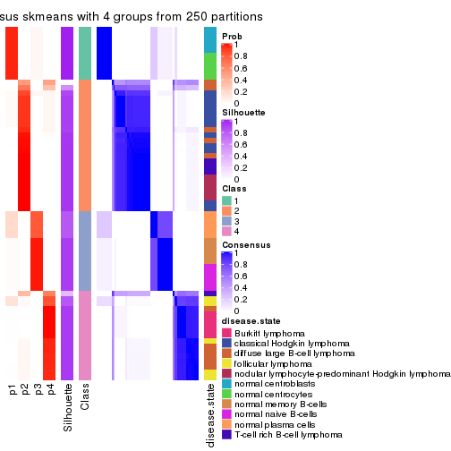</p>

</div>
<div id='tab-SD-skmeans-consensus-heatmap-4'>
<pre><code class="r">consensus_heatmap(res, k = 5)
</code></pre>

<p></p>

</div>
<div id='tab-SD-skmeans-consensus-heatmap-5'>
<pre><code class="r">consensus_heatmap(res, k = 6)
</code></pre>

<p>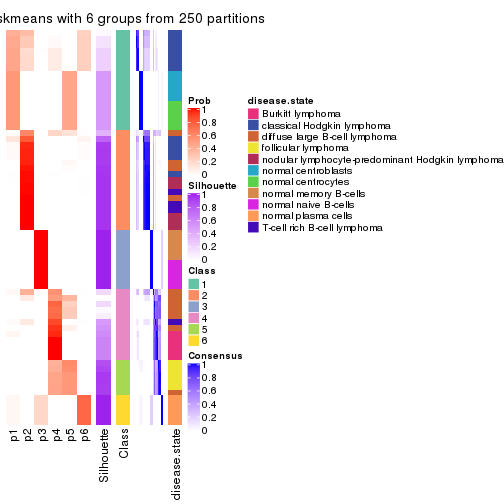</p>

</div>
</div>

Heatmaps for the membership of samples in all partitions to see how consistent they are:


<script>
$( function() {
	$( '#tabs-SD-skmeans-membership-heatmap' ).tabs();
} );
</script>
<div id='tabs-SD-skmeans-membership-heatmap'>
<ul>
<li><a href='#tab-SD-skmeans-membership-heatmap-1'>k = 2</a></li>
<li><a href='#tab-SD-skmeans-membership-heatmap-2'>k = 3</a></li>
<li><a href='#tab-SD-skmeans-membership-heatmap-3'>k = 4</a></li>
<li><a href='#tab-SD-skmeans-membership-heatmap-4'>k = 5</a></li>
<li><a href='#tab-SD-skmeans-membership-heatmap-5'>k = 6</a></li>
</ul>
<div id='tab-SD-skmeans-membership-heatmap-1'>
<pre><code class="r">membership_heatmap(res, k = 2)
</code></pre>

<p></p>

</div>
<div id='tab-SD-skmeans-membership-heatmap-2'>
<pre><code class="r">membership_heatmap(res, k = 3)
</code></pre>

<p></p>

</div>
<div id='tab-SD-skmeans-membership-heatmap-3'>
<pre><code class="r">membership_heatmap(res, k = 4)
</code></pre>

<p></p>

</div>
<div id='tab-SD-skmeans-membership-heatmap-4'>
<pre><code class="r">membership_heatmap(res, k = 5)
</code></pre>

<p>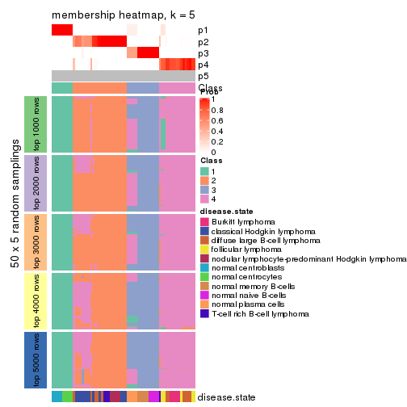</p>

</div>
<div id='tab-SD-skmeans-membership-heatmap-5'>
<pre><code class="r">membership_heatmap(res, k = 6)
</code></pre>

<p></p>

</div>
</div>

As soon as we have had the classes for columns, we can look for signatures
which are significantly different between classes which can be candidate marks
for certain classes. Following are the heatmaps for signatures.


Signature heatmaps where rows are scaled:


<script>
$( function() {
	$( '#tabs-SD-skmeans-get-signatures' ).tabs();
} );
</script>
<div id='tabs-SD-skmeans-get-signatures'>
<ul>
<li><a href='#tab-SD-skmeans-get-signatures-1'>k = 2</a></li>
<li><a href='#tab-SD-skmeans-get-signatures-2'>k = 3</a></li>
<li><a href='#tab-SD-skmeans-get-signatures-3'>k = 4</a></li>
<li><a href='#tab-SD-skmeans-get-signatures-4'>k = 5</a></li>
<li><a href='#tab-SD-skmeans-get-signatures-5'>k = 6</a></li>
</ul>
<div id='tab-SD-skmeans-get-signatures-1'>
<pre><code class="r">get_signatures(res, k = 2)
</code></pre>

<p></p>

</div>
<div id='tab-SD-skmeans-get-signatures-2'>
<pre><code class="r">get_signatures(res, k = 3)
</code></pre>

<p></p>

</div>
<div id='tab-SD-skmeans-get-signatures-3'>
<pre><code class="r">get_signatures(res, k = 4)
</code></pre>

<p></p>

</div>
<div id='tab-SD-skmeans-get-signatures-4'>
<pre><code class="r">get_signatures(res, k = 5)
</code></pre>

<p></p>

</div>
<div id='tab-SD-skmeans-get-signatures-5'>
<pre><code class="r">get_signatures(res, k = 6)
</code></pre>

<p></p>

</div>
</div>


Signature heatmaps where rows are not scaled:


<script>
$( function() {
	$( '#tabs-SD-skmeans-get-signatures-no-scale' ).tabs();
} );
</script>
<div id='tabs-SD-skmeans-get-signatures-no-scale'>
<ul>
<li><a href='#tab-SD-skmeans-get-signatures-no-scale-1'>k = 2</a></li>
<li><a href='#tab-SD-skmeans-get-signatures-no-scale-2'>k = 3</a></li>
<li><a href='#tab-SD-skmeans-get-signatures-no-scale-3'>k = 4</a></li>
<li><a href='#tab-SD-skmeans-get-signatures-no-scale-4'>k = 5</a></li>
<li><a href='#tab-SD-skmeans-get-signatures-no-scale-5'>k = 6</a></li>
</ul>
<div id='tab-SD-skmeans-get-signatures-no-scale-1'>
<pre><code class="r">get_signatures(res, k = 2, scale_rows = FALSE)
</code></pre>

<p></p>

</div>
<div id='tab-SD-skmeans-get-signatures-no-scale-2'>
<pre><code class="r">get_signatures(res, k = 3, scale_rows = FALSE)
</code></pre>

<p></p>

</div>
<div id='tab-SD-skmeans-get-signatures-no-scale-3'>
<pre><code class="r">get_signatures(res, k = 4, scale_rows = FALSE)
</code></pre>

<p></p>

</div>
<div id='tab-SD-skmeans-get-signatures-no-scale-4'>
<pre><code class="r">get_signatures(res, k = 5, scale_rows = FALSE)
</code></pre>

<p></p>

</div>
<div id='tab-SD-skmeans-get-signatures-no-scale-5'>
<pre><code class="r">get_signatures(res, k = 6, scale_rows = FALSE)
</code></pre>

<p></p>

</div>
</div>


Compare the overlap of signatures from different k:

```r
compare_signatures(res)
```


`get_signature()` returns a data frame invisibly. TO get the list of signatures, the function
call should be assigned to a variable explicitly. In following code, if `plot` argument is set
to `FALSE`, no heatmap is plotted while only the differential analysis is performed.

```r
# code only for demonstration
tb = get_signature(res, k = ..., plot = FALSE)
```

An example of the output of `tb` is:

```
#>   which_row         fdr    mean_1    mean_2 scaled_mean_1 scaled_mean_2 km
#> 1        38 0.042760348  8.373488  9.131774    -0.5533452     0.5164555  1
#> 2        40 0.018707592  7.106213  8.469186    -0.6173731     0.5762149  1
#> 3        55 0.019134737 10.221463 11.207825    -0.6159697     0.5749050  1
#> 4        59 0.006059896  5.921854  7.869574    -0.6899429     0.6439467  1
#> 5        60 0.018055526  8.928898 10.211722    -0.6204761     0.5791110  1
#> 6        98 0.009384629 15.714769 14.887706     0.6635654    -0.6193277  2
...
```

The columns in `tb` are:

1. `which_row`: row indices corresponding to the input matrix.
2. `fdr`: FDR for the differential test. 
3. `mean_x`: The mean value in group x.
4. `scaled_mean_x`: The mean value in group x after rows are scaled.
5. `km`: Row groups if k-means clustering is applied to rows.


UMAP plot which shows how samples are separated.


<script>
$( function() {
	$( '#tabs-SD-skmeans-dimension-reduction' ).tabs();
} );
</script>
<div id='tabs-SD-skmeans-dimension-reduction'>
<ul>
<li><a href='#tab-SD-skmeans-dimension-reduction-1'>k = 2</a></li>
<li><a href='#tab-SD-skmeans-dimension-reduction-2'>k = 3</a></li>
<li><a href='#tab-SD-skmeans-dimension-reduction-3'>k = 4</a></li>
<li><a href='#tab-SD-skmeans-dimension-reduction-4'>k = 5</a></li>
<li><a href='#tab-SD-skmeans-dimension-reduction-5'>k = 6</a></li>
</ul>
<div id='tab-SD-skmeans-dimension-reduction-1'>
<pre><code class="r">dimension_reduction(res, k = 2, method = &quot;UMAP&quot;)
</code></pre>

<p></p>

</div>
<div id='tab-SD-skmeans-dimension-reduction-2'>
<pre><code class="r">dimension_reduction(res, k = 3, method = &quot;UMAP&quot;)
</code></pre>

<p></p>

</div>
<div id='tab-SD-skmeans-dimension-reduction-3'>
<pre><code class="r">dimension_reduction(res, k = 4, method = &quot;UMAP&quot;)
</code></pre>

<p></p>

</div>
<div id='tab-SD-skmeans-dimension-reduction-4'>
<pre><code class="r">dimension_reduction(res, k = 5, method = &quot;UMAP&quot;)
</code></pre>

<p></p>

</div>
<div id='tab-SD-skmeans-dimension-reduction-5'>
<pre><code class="r">dimension_reduction(res, k = 6, method = &quot;UMAP&quot;)
</code></pre>

<p></p>

</div>
</div>


Following heatmap shows how subgroups are split when increasing `k`:

```r
collect_classes(res)
```


Test correlation between subgroups and known annotations. If the known
annotation is numeric, one-way ANOVA test is applied, and if the known
annotation is discrete, chi-squared contingency table test is applied.

```r
test_to_known_factors(res)
```

```
#>             n disease.state(p) k
#> SD:skmeans 67         7.40e-10 2
#> SD:skmeans 65         4.05e-15 3
#> SD:skmeans 65         4.31e-23 4
#> SD:skmeans 64         4.92e-23 5
#> SD:skmeans 54         2.21e-27 6
```


If matrix rows can be associated to genes, consider to use `GO_Enrichment(res,
...)` to perform function enrichment for the signature genes.


 

---------------------------------------------------


### SD:pam*


The object with results only for a single top-value method and a single partition method 
can be extracted as:

```r
res = res_list["SD", "pam"]
# you can also extract it by
# res = res_list["SD:pam"]
```

A summary of `res` and all the functions that can be applied to it:

```r
res
```

```
#> A 'ConsensusPartition' object with k = 2, 3, 4, 5, 6.
#>   On a matrix with 51941 rows and 67 columns.
#>   Top rows (1000, 2000, 3000, 4000, 5000) are extracted by 'SD' method.
#>   Subgroups are detected by 'pam' method.
#>   Performed in total 1250 partitions by row resampling.
#>   Best k for subgroups seems to be 6.
#> 
#> Following methods can be applied to this 'ConsensusPartition' object:
#>  [1] "cola_report"             "collect_classes"         "collect_plots"          
#>  [4] "collect_stats"           "colnames"                "compare_signatures"     
#>  [7] "consensus_heatmap"       "dimension_reduction"     "functional_enrichment"  
#> [10] "get_anno_col"            "get_anno"                "get_classes"            
#> [13] "get_consensus"           "get_matrix"              "get_membership"         
#> [16] "get_param"               "get_signatures"          "get_stats"              
#> [19] "is_best_k"               "is_stable_k"             "membership_heatmap"     
#> [22] "ncol"                    "nrow"                    "plot_ecdf"              
#> [25] "rownames"                "select_partition_number" "show"                   
#> [28] "suggest_best_k"          "test_to_known_factors"
```

`collect_plots()` function collects all the plots made from `res` for all `k` (number of partitions)
into one single page to provide an easy and fast comparison between different `k`.

```r
collect_plots(res)
```


The plots are:

- The first row: a plot of the ECDF (Empirical cumulative distribution
  function) curves of the consensus matrix for each `k` and the heatmap of
  predicted classes for each `k`.
- The second row: heatmaps of the consensus matrix for each `k`.
- The third row: heatmaps of the membership matrix for each `k`.
- The fouth row: heatmaps of the signatures for each `k`.

All the plots in panels can be made by individual functions and they are
plotted later in this section.

`select_partition_number()` produces several plots showing different
statistics for choosing "optimized" `k`. There are following statistics:

- ECDF curves of the consensus matrix for each `k`;
- 1-PAC. [The PAC
  score](https://en.wikipedia.org/wiki/Consensus_clustering#Over-interpretation_potential_of_consensus_clustering)
  measures the proportion of the ambiguous subgrouping.
- Mean silhouette score.
- Concordance. The mean probability of fiting the consensus class ids in all
  partitions.
- Area increased. Denote $A_k$ as the area under the ECDF curve for current
  `k`, the area increased is defined as $A_k - A_{k-1}$.
- Rand index. The percent of pairs of samples that are both in a same cluster
  or both are not in a same cluster in the partition of k and k-1.
- Jaccard index. The ratio of pairs of samples are both in a same cluster in
  the partition of k and k-1 and the pairs of samples are both in a same
  cluster in the partition k or k-1.

The detailed explanations of these statistics can be found in [the cola
vignette](http://bioconductor.org/packages/devel/bioc/vignettes/cola/inst/doc/cola.html#toc_13).

Generally speaking, lower PAC score, higher mean silhouette score or higher
concordance corresponds to better partition. Rand index and Jaccard index
measure how similar the current partition is compared to partition with `k-1`.
If they are too similar, we won't accept `k` is better than `k-1`.

```r
select_partition_number(res)
```


The numeric values for all these statistics can be obtained by `get_stats()`.

```r
get_stats(res)
```

```
#>   k 1-PAC mean_silhouette concordance area_increased  Rand Jaccard
#> 2 2 1.000           1.000       1.000         0.4754 0.525   0.525
#> 3 3 1.000           0.991       0.996         0.1384 0.935   0.876
#> 4 4 1.000           0.960       0.986         0.0534 0.975   0.946
#> 5 5 0.897           0.903       0.955         0.3279 0.805   0.554
#> 6 6 0.910           0.883       0.956         0.0596 0.953   0.806
```

`suggest_best_k()` suggests the best $k$ based on these statistics. The rules are as follows:

- All $k$ with Jaccard index larger than 0.95 are removed because the increase of
  the partition number does not provides enough extra information. If all $k$ are removed,
  the best $k$ is assigned by `NA`.
- For $k$ with 1-PAC larger than 0.9, the maximal $k$ is taken as the "best k". Other $k$ is called "optional k".
- If it does not fit the second rule. The $k$ with the highest vote of highest
  1-PAC, mean silhouette and concordance is taken as the "best k".

```r
suggest_best_k(res)
```

```
#> [1] 6
#> attr(,"optional")
#> [1] 2 3 4
```

There is also optional best $k$ = 2 3 4 that is worth to check.

Following shows the table of the partitions (You need to click the **show/hide
code output** link to see it). The membership matrix (columns with name `p*`)
is inferred by
[`clue::cl_consensus()`](https://www.rdocumentation.org/link/cl_consensus?package=clue)
function with the `SE` method. Basically the value in the membership matrix
represents the probability to belong to a certain group. The finall class
label for an item is determined with the group with highest probability it
belongs to.

In `get_classes()` function, the entropy is calculated from the membership
matrix and the silhouette score is calculated from the consensus matrix.


<script>
$( function() {
	$( '#tabs-SD-pam-get-classes' ).tabs();
} );
</script>
<div id='tabs-SD-pam-get-classes'>
<ul>
<li><a href='#tab-SD-pam-get-classes-1'>k = 2</a></li>
<li><a href='#tab-SD-pam-get-classes-2'>k = 3</a></li>
<li><a href='#tab-SD-pam-get-classes-3'>k = 4</a></li>
<li><a href='#tab-SD-pam-get-classes-4'>k = 5</a></li>
<li><a href='#tab-SD-pam-get-classes-5'>k = 6</a></li>
</ul>

<div id='tab-SD-pam-get-classes-1'>
<p><a id='tab-SD-pam-get-classes-1-a' style='color:#0366d6' href='#'>show/hide code output</a></p>
<pre><code class="r">cbind(get_classes(res, k = 2), get_membership(res, k = 2))
</code></pre>

<pre><code>#&gt;           class entropy silhouette p1 p2
#&gt; GSM312811     2       0          1  0  1
#&gt; GSM312812     2       0          1  0  1
#&gt; GSM312813     2       0          1  0  1
#&gt; GSM312814     2       0          1  0  1
#&gt; GSM312815     2       0          1  0  1
#&gt; GSM312816     2       0          1  0  1
#&gt; GSM312817     2       0          1  0  1
#&gt; GSM312818     2       0          1  0  1
#&gt; GSM312819     2       0          1  0  1
#&gt; GSM312820     2       0          1  0  1
#&gt; GSM312821     2       0          1  0  1
#&gt; GSM312822     2       0          1  0  1
#&gt; GSM312823     2       0          1  0  1
#&gt; GSM312824     2       0          1  0  1
#&gt; GSM312825     2       0          1  0  1
#&gt; GSM312826     2       0          1  0  1
#&gt; GSM312839     2       0          1  0  1
#&gt; GSM312840     2       0          1  0  1
#&gt; GSM312841     2       0          1  0  1
#&gt; GSM312843     2       0          1  0  1
#&gt; GSM312844     2       0          1  0  1
#&gt; GSM312845     2       0          1  0  1
#&gt; GSM312846     2       0          1  0  1
#&gt; GSM312847     2       0          1  0  1
#&gt; GSM312848     2       0          1  0  1
#&gt; GSM312849     2       0          1  0  1
#&gt; GSM312851     2       0          1  0  1
#&gt; GSM312853     2       0          1  0  1
#&gt; GSM312854     2       0          1  0  1
#&gt; GSM312856     2       0          1  0  1
#&gt; GSM312857     2       0          1  0  1
#&gt; GSM312858     2       0          1  0  1
#&gt; GSM312859     2       0          1  0  1
#&gt; GSM312860     2       0          1  0  1
#&gt; GSM312861     2       0          1  0  1
#&gt; GSM312862     2       0          1  0  1
#&gt; GSM312863     2       0          1  0  1
#&gt; GSM312864     2       0          1  0  1
#&gt; GSM312865     2       0          1  0  1
#&gt; GSM312867     2       0          1  0  1
#&gt; GSM312868     2       0          1  0  1
#&gt; GSM312869     2       0          1  0  1
#&gt; GSM312870     1       0          1  1  0
#&gt; GSM312872     1       0          1  1  0
#&gt; GSM312874     1       0          1  1  0
#&gt; GSM312875     1       0          1  1  0
#&gt; GSM312876     1       0          1  1  0
#&gt; GSM312877     1       0          1  1  0
#&gt; GSM312879     1       0          1  1  0
#&gt; GSM312882     1       0          1  1  0
#&gt; GSM312883     1       0          1  1  0
#&gt; GSM312886     1       0          1  1  0
#&gt; GSM312887     1       0          1  1  0
#&gt; GSM312890     1       0          1  1  0
#&gt; GSM312893     1       0          1  1  0
#&gt; GSM312894     1       0          1  1  0
#&gt; GSM312895     1       0          1  1  0
#&gt; GSM312937     1       0          1  1  0
#&gt; GSM312938     1       0          1  1  0
#&gt; GSM312939     1       0          1  1  0
#&gt; GSM312940     1       0          1  1  0
#&gt; GSM312941     1       0          1  1  0
#&gt; GSM312942     1       0          1  1  0
#&gt; GSM312943     1       0          1  1  0
#&gt; GSM312944     1       0          1  1  0
#&gt; GSM312945     1       0          1  1  0
#&gt; GSM312946     1       0          1  1  0
</code></pre>

<script>
$('#tab-SD-pam-get-classes-1-a').parent().next().next().hide();
$('#tab-SD-pam-get-classes-1-a').click(function(){
  $('#tab-SD-pam-get-classes-1-a').parent().next().next().toggle();
  return(false);
});
</script>
</div>

<div id='tab-SD-pam-get-classes-2'>
<p><a id='tab-SD-pam-get-classes-2-a' style='color:#0366d6' href='#'>show/hide code output</a></p>
<pre><code class="r">cbind(get_classes(res, k = 3), get_membership(res, k = 3))
</code></pre>

<pre><code>#&gt;           class entropy silhouette    p1    p2    p3
#&gt; GSM312811     2  0.0000      1.000 0.000 1.000 0.000
#&gt; GSM312812     2  0.0000      1.000 0.000 1.000 0.000
#&gt; GSM312813     2  0.0000      1.000 0.000 1.000 0.000
#&gt; GSM312814     2  0.0000      1.000 0.000 1.000 0.000
#&gt; GSM312815     2  0.0000      1.000 0.000 1.000 0.000
#&gt; GSM312816     2  0.0000      1.000 0.000 1.000 0.000
#&gt; GSM312817     2  0.0000      1.000 0.000 1.000 0.000
#&gt; GSM312818     2  0.0000      1.000 0.000 1.000 0.000
#&gt; GSM312819     2  0.0000      1.000 0.000 1.000 0.000
#&gt; GSM312820     2  0.0000      1.000 0.000 1.000 0.000
#&gt; GSM312821     2  0.0000      1.000 0.000 1.000 0.000
#&gt; GSM312822     2  0.0000      1.000 0.000 1.000 0.000
#&gt; GSM312823     2  0.0000      1.000 0.000 1.000 0.000
#&gt; GSM312824     2  0.0000      1.000 0.000 1.000 0.000
#&gt; GSM312825     2  0.0000      1.000 0.000 1.000 0.000
#&gt; GSM312826     2  0.0000      1.000 0.000 1.000 0.000
#&gt; GSM312839     2  0.0000      1.000 0.000 1.000 0.000
#&gt; GSM312840     2  0.0000      1.000 0.000 1.000 0.000
#&gt; GSM312841     2  0.0000      1.000 0.000 1.000 0.000
#&gt; GSM312843     2  0.0000      1.000 0.000 1.000 0.000
#&gt; GSM312844     2  0.0000      1.000 0.000 1.000 0.000
#&gt; GSM312845     2  0.0424      0.992 0.008 0.992 0.000
#&gt; GSM312846     2  0.0000      1.000 0.000 1.000 0.000
#&gt; GSM312847     2  0.0000      1.000 0.000 1.000 0.000
#&gt; GSM312848     2  0.0000      1.000 0.000 1.000 0.000
#&gt; GSM312849     2  0.0000      1.000 0.000 1.000 0.000
#&gt; GSM312851     2  0.0000      1.000 0.000 1.000 0.000
#&gt; GSM312853     2  0.0000      1.000 0.000 1.000 0.000
#&gt; GSM312854     2  0.0000      1.000 0.000 1.000 0.000
#&gt; GSM312856     2  0.0000      1.000 0.000 1.000 0.000
#&gt; GSM312857     2  0.0000      1.000 0.000 1.000 0.000
#&gt; GSM312858     2  0.0000      1.000 0.000 1.000 0.000
#&gt; GSM312859     2  0.0000      1.000 0.000 1.000 0.000
#&gt; GSM312860     2  0.0000      1.000 0.000 1.000 0.000
#&gt; GSM312861     2  0.0000      1.000 0.000 1.000 0.000
#&gt; GSM312862     2  0.0000      1.000 0.000 1.000 0.000
#&gt; GSM312863     2  0.0000      1.000 0.000 1.000 0.000
#&gt; GSM312864     2  0.0000      1.000 0.000 1.000 0.000
#&gt; GSM312865     2  0.0000      1.000 0.000 1.000 0.000
#&gt; GSM312867     2  0.0000      1.000 0.000 1.000 0.000
#&gt; GSM312868     2  0.0000      1.000 0.000 1.000 0.000
#&gt; GSM312869     2  0.0000      1.000 0.000 1.000 0.000
#&gt; GSM312870     3  0.0000      1.000 0.000 0.000 1.000
#&gt; GSM312872     3  0.0000      1.000 0.000 0.000 1.000
#&gt; GSM312874     3  0.0000      1.000 0.000 0.000 1.000
#&gt; GSM312875     3  0.0000      1.000 0.000 0.000 1.000
#&gt; GSM312876     3  0.0000      1.000 0.000 0.000 1.000
#&gt; GSM312877     1  0.4974      0.694 0.764 0.000 0.236
#&gt; GSM312879     3  0.0000      1.000 0.000 0.000 1.000
#&gt; GSM312882     3  0.0000      1.000 0.000 0.000 1.000
#&gt; GSM312883     3  0.0000      1.000 0.000 0.000 1.000
#&gt; GSM312886     3  0.0000      1.000 0.000 0.000 1.000
#&gt; GSM312887     1  0.0000      0.983 1.000 0.000 0.000
#&gt; GSM312890     1  0.0000      0.983 1.000 0.000 0.000
#&gt; GSM312893     1  0.0000      0.983 1.000 0.000 0.000
#&gt; GSM312894     1  0.0000      0.983 1.000 0.000 0.000
#&gt; GSM312895     1  0.0000      0.983 1.000 0.000 0.000
#&gt; GSM312937     1  0.0000      0.983 1.000 0.000 0.000
#&gt; GSM312938     1  0.0000      0.983 1.000 0.000 0.000
#&gt; GSM312939     1  0.0000      0.983 1.000 0.000 0.000
#&gt; GSM312940     1  0.0000      0.983 1.000 0.000 0.000
#&gt; GSM312941     1  0.0000      0.983 1.000 0.000 0.000
#&gt; GSM312942     1  0.0237      0.981 0.996 0.000 0.004
#&gt; GSM312943     1  0.0237      0.981 0.996 0.000 0.004
#&gt; GSM312944     1  0.0237      0.981 0.996 0.000 0.004
#&gt; GSM312945     1  0.0237      0.981 0.996 0.000 0.004
#&gt; GSM312946     1  0.0237      0.981 0.996 0.000 0.004
</code></pre>

<script>
$('#tab-SD-pam-get-classes-2-a').parent().next().next().hide();
$('#tab-SD-pam-get-classes-2-a').click(function(){
  $('#tab-SD-pam-get-classes-2-a').parent().next().next().toggle();
  return(false);
});
</script>
</div>

<div id='tab-SD-pam-get-classes-3'>
<p><a id='tab-SD-pam-get-classes-3-a' style='color:#0366d6' href='#'>show/hide code output</a></p>
<pre><code class="r">cbind(get_classes(res, k = 4), get_membership(res, k = 4))
</code></pre>

<pre><code>#&gt;           class entropy silhouette    p1    p2   p3    p4
#&gt; GSM312811     2   0.000      0.993 0.000 1.000 0.00 0.000
#&gt; GSM312812     2   0.000      0.993 0.000 1.000 0.00 0.000
#&gt; GSM312813     2   0.000      0.993 0.000 1.000 0.00 0.000
#&gt; GSM312814     2   0.000      0.993 0.000 1.000 0.00 0.000
#&gt; GSM312815     2   0.000      0.993 0.000 1.000 0.00 0.000
#&gt; GSM312816     2   0.000      0.993 0.000 1.000 0.00 0.000
#&gt; GSM312817     2   0.000      0.993 0.000 1.000 0.00 0.000
#&gt; GSM312818     2   0.000      0.993 0.000 1.000 0.00 0.000
#&gt; GSM312819     2   0.000      0.993 0.000 1.000 0.00 0.000
#&gt; GSM312820     2   0.000      0.993 0.000 1.000 0.00 0.000
#&gt; GSM312821     2   0.000      0.993 0.000 1.000 0.00 0.000
#&gt; GSM312822     2   0.000      0.993 0.000 1.000 0.00 0.000
#&gt; GSM312823     2   0.000      0.993 0.000 1.000 0.00 0.000
#&gt; GSM312824     2   0.000      0.993 0.000 1.000 0.00 0.000
#&gt; GSM312825     2   0.000      0.993 0.000 1.000 0.00 0.000
#&gt; GSM312826     2   0.000      0.993 0.000 1.000 0.00 0.000
#&gt; GSM312839     2   0.000      0.993 0.000 1.000 0.00 0.000
#&gt; GSM312840     2   0.000      0.993 0.000 1.000 0.00 0.000
#&gt; GSM312841     2   0.000      0.993 0.000 1.000 0.00 0.000
#&gt; GSM312843     2   0.000      0.993 0.000 1.000 0.00 0.000
#&gt; GSM312844     2   0.000      0.993 0.000 1.000 0.00 0.000
#&gt; GSM312845     2   0.511      0.655 0.196 0.744 0.00 0.060
#&gt; GSM312846     2   0.000      0.993 0.000 1.000 0.00 0.000
#&gt; GSM312847     2   0.000      0.993 0.000 1.000 0.00 0.000
#&gt; GSM312848     2   0.000      0.993 0.000 1.000 0.00 0.000
#&gt; GSM312849     2   0.000      0.993 0.000 1.000 0.00 0.000
#&gt; GSM312851     2   0.000      0.993 0.000 1.000 0.00 0.000
#&gt; GSM312853     2   0.000      0.993 0.000 1.000 0.00 0.000
#&gt; GSM312854     2   0.000      0.993 0.000 1.000 0.00 0.000
#&gt; GSM312856     2   0.000      0.993 0.000 1.000 0.00 0.000
#&gt; GSM312857     2   0.000      0.993 0.000 1.000 0.00 0.000
#&gt; GSM312858     2   0.000      0.993 0.000 1.000 0.00 0.000
#&gt; GSM312859     2   0.000      0.993 0.000 1.000 0.00 0.000
#&gt; GSM312860     2   0.000      0.993 0.000 1.000 0.00 0.000
#&gt; GSM312861     2   0.000      0.993 0.000 1.000 0.00 0.000
#&gt; GSM312862     2   0.000      0.993 0.000 1.000 0.00 0.000
#&gt; GSM312863     2   0.000      0.993 0.000 1.000 0.00 0.000
#&gt; GSM312864     2   0.000      0.993 0.000 1.000 0.00 0.000
#&gt; GSM312865     2   0.000      0.993 0.000 1.000 0.00 0.000
#&gt; GSM312867     2   0.000      0.993 0.000 1.000 0.00 0.000
#&gt; GSM312868     2   0.000      0.993 0.000 1.000 0.00 0.000
#&gt; GSM312869     2   0.000      0.993 0.000 1.000 0.00 0.000
#&gt; GSM312870     3   0.000      1.000 0.000 0.000 1.00 0.000
#&gt; GSM312872     3   0.000      1.000 0.000 0.000 1.00 0.000
#&gt; GSM312874     3   0.000      1.000 0.000 0.000 1.00 0.000
#&gt; GSM312875     3   0.000      1.000 0.000 0.000 1.00 0.000
#&gt; GSM312876     3   0.000      1.000 0.000 0.000 1.00 0.000
#&gt; GSM312877     1   0.380     -0.361 0.780 0.000 0.22 0.000
#&gt; GSM312879     3   0.000      1.000 0.000 0.000 1.00 0.000
#&gt; GSM312882     3   0.000      1.000 0.000 0.000 1.00 0.000
#&gt; GSM312883     3   0.000      1.000 0.000 0.000 1.00 0.000
#&gt; GSM312886     3   0.000      1.000 0.000 0.000 1.00 0.000
#&gt; GSM312887     1   0.500      0.931 0.516 0.000 0.00 0.484
#&gt; GSM312890     1   0.500      0.931 0.516 0.000 0.00 0.484
#&gt; GSM312893     1   0.500      0.931 0.516 0.000 0.00 0.484
#&gt; GSM312894     1   0.500      0.931 0.516 0.000 0.00 0.484
#&gt; GSM312895     1   0.500      0.931 0.516 0.000 0.00 0.484
#&gt; GSM312937     1   0.500      0.931 0.516 0.000 0.00 0.484
#&gt; GSM312938     1   0.500      0.931 0.516 0.000 0.00 0.484
#&gt; GSM312939     1   0.500      0.931 0.516 0.000 0.00 0.484
#&gt; GSM312940     1   0.500      0.931 0.516 0.000 0.00 0.484
#&gt; GSM312941     1   0.500      0.931 0.516 0.000 0.00 0.484
#&gt; GSM312942     4   0.500      1.000 0.484 0.000 0.00 0.516
#&gt; GSM312943     4   0.500      1.000 0.484 0.000 0.00 0.516
#&gt; GSM312944     4   0.500      1.000 0.484 0.000 0.00 0.516
#&gt; GSM312945     4   0.500      1.000 0.484 0.000 0.00 0.516
#&gt; GSM312946     4   0.500      1.000 0.484 0.000 0.00 0.516
</code></pre>

<script>
$('#tab-SD-pam-get-classes-3-a').parent().next().next().hide();
$('#tab-SD-pam-get-classes-3-a').click(function(){
  $('#tab-SD-pam-get-classes-3-a').parent().next().next().toggle();
  return(false);
});
</script>
</div>

<div id='tab-SD-pam-get-classes-4'>
<p><a id='tab-SD-pam-get-classes-4-a' style='color:#0366d6' href='#'>show/hide code output</a></p>
<pre><code class="r">cbind(get_classes(res, k = 5), get_membership(res, k = 5))
</code></pre>

<pre><code>#&gt;           class entropy silhouette    p1    p2   p3    p4    p5
#&gt; GSM312811     2  0.0000      0.937 0.000 1.000 0.00 0.000 0.000
#&gt; GSM312812     2  0.0000      0.937 0.000 1.000 0.00 0.000 0.000
#&gt; GSM312813     2  0.0000      0.937 0.000 1.000 0.00 0.000 0.000
#&gt; GSM312814     2  0.0162      0.934 0.000 0.996 0.00 0.004 0.000
#&gt; GSM312815     2  0.0000      0.937 0.000 1.000 0.00 0.000 0.000
#&gt; GSM312816     2  0.1410      0.893 0.000 0.940 0.00 0.060 0.000
#&gt; GSM312817     2  0.0000      0.937 0.000 1.000 0.00 0.000 0.000
#&gt; GSM312818     2  0.2516      0.839 0.000 0.860 0.00 0.140 0.000
#&gt; GSM312819     2  0.0000      0.937 0.000 1.000 0.00 0.000 0.000
#&gt; GSM312820     2  0.3424      0.719 0.000 0.760 0.00 0.240 0.000
#&gt; GSM312821     2  0.3913      0.573 0.000 0.676 0.00 0.324 0.000
#&gt; GSM312822     2  0.0000      0.937 0.000 1.000 0.00 0.000 0.000
#&gt; GSM312823     2  0.0000      0.937 0.000 1.000 0.00 0.000 0.000
#&gt; GSM312824     2  0.0000      0.937 0.000 1.000 0.00 0.000 0.000
#&gt; GSM312825     2  0.0000      0.937 0.000 1.000 0.00 0.000 0.000
#&gt; GSM312826     2  0.0000      0.937 0.000 1.000 0.00 0.000 0.000
#&gt; GSM312839     2  0.0000      0.937 0.000 1.000 0.00 0.000 0.000
#&gt; GSM312840     2  0.0000      0.937 0.000 1.000 0.00 0.000 0.000
#&gt; GSM312841     2  0.0000      0.937 0.000 1.000 0.00 0.000 0.000
#&gt; GSM312843     4  0.1197      0.909 0.000 0.048 0.00 0.952 0.000
#&gt; GSM312844     2  0.0000      0.937 0.000 1.000 0.00 0.000 0.000
#&gt; GSM312845     4  0.4455      0.340 0.404 0.008 0.00 0.588 0.000
#&gt; GSM312846     2  0.3561      0.649 0.000 0.740 0.00 0.260 0.000
#&gt; GSM312847     4  0.1197      0.909 0.000 0.048 0.00 0.952 0.000
#&gt; GSM312848     4  0.1197      0.909 0.000 0.048 0.00 0.952 0.000
#&gt; GSM312849     2  0.2929      0.771 0.000 0.820 0.00 0.180 0.000
#&gt; GSM312851     4  0.0000      0.906 0.000 0.000 0.00 1.000 0.000
#&gt; GSM312853     4  0.0000      0.906 0.000 0.000 0.00 1.000 0.000
#&gt; GSM312854     4  0.0000      0.906 0.000 0.000 0.00 1.000 0.000
#&gt; GSM312856     4  0.0000      0.906 0.000 0.000 0.00 1.000 0.000
#&gt; GSM312857     4  0.0000      0.906 0.000 0.000 0.00 1.000 0.000
#&gt; GSM312858     4  0.1197      0.909 0.000 0.048 0.00 0.952 0.000
#&gt; GSM312859     2  0.0000      0.937 0.000 1.000 0.00 0.000 0.000
#&gt; GSM312860     2  0.0000      0.937 0.000 1.000 0.00 0.000 0.000
#&gt; GSM312861     4  0.3039      0.755 0.000 0.192 0.00 0.808 0.000
#&gt; GSM312862     2  0.3109      0.745 0.000 0.800 0.00 0.200 0.000
#&gt; GSM312863     4  0.0000      0.906 0.000 0.000 0.00 1.000 0.000
#&gt; GSM312864     4  0.0510      0.901 0.000 0.016 0.00 0.984 0.000
#&gt; GSM312865     4  0.1197      0.909 0.000 0.048 0.00 0.952 0.000
#&gt; GSM312867     4  0.3039      0.755 0.000 0.192 0.00 0.808 0.000
#&gt; GSM312868     4  0.1197      0.909 0.000 0.048 0.00 0.952 0.000
#&gt; GSM312869     2  0.0000      0.937 0.000 1.000 0.00 0.000 0.000
#&gt; GSM312870     3  0.0000      1.000 0.000 0.000 1.00 0.000 0.000
#&gt; GSM312872     3  0.0000      1.000 0.000 0.000 1.00 0.000 0.000
#&gt; GSM312874     3  0.0000      1.000 0.000 0.000 1.00 0.000 0.000
#&gt; GSM312875     3  0.0000      1.000 0.000 0.000 1.00 0.000 0.000
#&gt; GSM312876     3  0.0000      1.000 0.000 0.000 1.00 0.000 0.000
#&gt; GSM312877     5  0.6491      0.354 0.296 0.000 0.22 0.000 0.484
#&gt; GSM312879     3  0.0000      1.000 0.000 0.000 1.00 0.000 0.000
#&gt; GSM312882     3  0.0000      1.000 0.000 0.000 1.00 0.000 0.000
#&gt; GSM312883     3  0.0000      1.000 0.000 0.000 1.00 0.000 0.000
#&gt; GSM312886     3  0.0000      1.000 0.000 0.000 1.00 0.000 0.000
#&gt; GSM312887     1  0.0000      1.000 1.000 0.000 0.00 0.000 0.000
#&gt; GSM312890     1  0.0000      1.000 1.000 0.000 0.00 0.000 0.000
#&gt; GSM312893     1  0.0000      1.000 1.000 0.000 0.00 0.000 0.000
#&gt; GSM312894     1  0.0000      1.000 1.000 0.000 0.00 0.000 0.000
#&gt; GSM312895     1  0.0000      1.000 1.000 0.000 0.00 0.000 0.000
#&gt; GSM312937     1  0.0000      1.000 1.000 0.000 0.00 0.000 0.000
#&gt; GSM312938     1  0.0000      1.000 1.000 0.000 0.00 0.000 0.000
#&gt; GSM312939     1  0.0000      1.000 1.000 0.000 0.00 0.000 0.000
#&gt; GSM312940     1  0.0000      1.000 1.000 0.000 0.00 0.000 0.000
#&gt; GSM312941     1  0.0000      1.000 1.000 0.000 0.00 0.000 0.000
#&gt; GSM312942     5  0.0000      0.908 0.000 0.000 0.00 0.000 1.000
#&gt; GSM312943     5  0.0000      0.908 0.000 0.000 0.00 0.000 1.000
#&gt; GSM312944     5  0.0000      0.908 0.000 0.000 0.00 0.000 1.000
#&gt; GSM312945     5  0.0000      0.908 0.000 0.000 0.00 0.000 1.000
#&gt; GSM312946     5  0.0000      0.908 0.000 0.000 0.00 0.000 1.000
</code></pre>

<script>
$('#tab-SD-pam-get-classes-4-a').parent().next().next().hide();
$('#tab-SD-pam-get-classes-4-a').click(function(){
  $('#tab-SD-pam-get-classes-4-a').parent().next().next().toggle();
  return(false);
});
</script>
</div>

<div id='tab-SD-pam-get-classes-5'>
<p><a id='tab-SD-pam-get-classes-5-a' style='color:#0366d6' href='#'>show/hide code output</a></p>
<pre><code class="r">cbind(get_classes(res, k = 6), get_membership(res, k = 6))
</code></pre>

<pre><code>#&gt;           class entropy silhouette    p1    p2   p3    p4    p5    p6
#&gt; GSM312811     2  0.2823      0.717 0.000 0.796 0.00 0.000 0.204 0.000
#&gt; GSM312812     2  0.0000      0.923 0.000 1.000 0.00 0.000 0.000 0.000
#&gt; GSM312813     2  0.0000      0.923 0.000 1.000 0.00 0.000 0.000 0.000
#&gt; GSM312814     2  0.3765      0.289 0.000 0.596 0.00 0.000 0.404 0.000
#&gt; GSM312815     2  0.0000      0.923 0.000 1.000 0.00 0.000 0.000 0.000
#&gt; GSM312816     5  0.0000      0.828 0.000 0.000 0.00 0.000 1.000 0.000
#&gt; GSM312817     2  0.0000      0.923 0.000 1.000 0.00 0.000 0.000 0.000
#&gt; GSM312818     5  0.0000      0.828 0.000 0.000 0.00 0.000 1.000 0.000
#&gt; GSM312819     2  0.0000      0.923 0.000 1.000 0.00 0.000 0.000 0.000
#&gt; GSM312820     5  0.0000      0.828 0.000 0.000 0.00 0.000 1.000 0.000
#&gt; GSM312821     5  0.0000      0.828 0.000 0.000 0.00 0.000 1.000 0.000
#&gt; GSM312822     5  0.3782      0.187 0.000 0.412 0.00 0.000 0.588 0.000
#&gt; GSM312823     2  0.0000      0.923 0.000 1.000 0.00 0.000 0.000 0.000
#&gt; GSM312824     2  0.0000      0.923 0.000 1.000 0.00 0.000 0.000 0.000
#&gt; GSM312825     2  0.0000      0.923 0.000 1.000 0.00 0.000 0.000 0.000
#&gt; GSM312826     2  0.0000      0.923 0.000 1.000 0.00 0.000 0.000 0.000
#&gt; GSM312839     2  0.0000      0.923 0.000 1.000 0.00 0.000 0.000 0.000
#&gt; GSM312840     2  0.0000      0.923 0.000 1.000 0.00 0.000 0.000 0.000
#&gt; GSM312841     2  0.0000      0.923 0.000 1.000 0.00 0.000 0.000 0.000
#&gt; GSM312843     4  0.0000      0.935 0.000 0.000 0.00 1.000 0.000 0.000
#&gt; GSM312844     2  0.0000      0.923 0.000 1.000 0.00 0.000 0.000 0.000
#&gt; GSM312845     4  0.4002      0.331 0.404 0.008 0.00 0.588 0.000 0.000
#&gt; GSM312846     2  0.3198      0.633 0.000 0.740 0.00 0.260 0.000 0.000
#&gt; GSM312847     4  0.0000      0.935 0.000 0.000 0.00 1.000 0.000 0.000
#&gt; GSM312848     4  0.0000      0.935 0.000 0.000 0.00 1.000 0.000 0.000
#&gt; GSM312849     2  0.2631      0.744 0.000 0.820 0.00 0.180 0.000 0.000
#&gt; GSM312851     4  0.0000      0.935 0.000 0.000 0.00 1.000 0.000 0.000
#&gt; GSM312853     4  0.0000      0.935 0.000 0.000 0.00 1.000 0.000 0.000
#&gt; GSM312854     4  0.0000      0.935 0.000 0.000 0.00 1.000 0.000 0.000
#&gt; GSM312856     4  0.0000      0.935 0.000 0.000 0.00 1.000 0.000 0.000
#&gt; GSM312857     4  0.0000      0.935 0.000 0.000 0.00 1.000 0.000 0.000
#&gt; GSM312858     4  0.0000      0.935 0.000 0.000 0.00 1.000 0.000 0.000
#&gt; GSM312859     2  0.0000      0.923 0.000 1.000 0.00 0.000 0.000 0.000
#&gt; GSM312860     2  0.0000      0.923 0.000 1.000 0.00 0.000 0.000 0.000
#&gt; GSM312861     4  0.2631      0.730 0.000 0.180 0.00 0.820 0.000 0.000
#&gt; GSM312862     2  0.2793      0.719 0.000 0.800 0.00 0.200 0.000 0.000
#&gt; GSM312863     4  0.0000      0.935 0.000 0.000 0.00 1.000 0.000 0.000
#&gt; GSM312864     4  0.0458      0.922 0.000 0.016 0.00 0.984 0.000 0.000
#&gt; GSM312865     4  0.0000      0.935 0.000 0.000 0.00 1.000 0.000 0.000
#&gt; GSM312867     4  0.2597      0.736 0.000 0.176 0.00 0.824 0.000 0.000
#&gt; GSM312868     4  0.0000      0.935 0.000 0.000 0.00 1.000 0.000 0.000
#&gt; GSM312869     2  0.0000      0.923 0.000 1.000 0.00 0.000 0.000 0.000
#&gt; GSM312870     3  0.0000      1.000 0.000 0.000 1.00 0.000 0.000 0.000
#&gt; GSM312872     3  0.0000      1.000 0.000 0.000 1.00 0.000 0.000 0.000
#&gt; GSM312874     3  0.0000      1.000 0.000 0.000 1.00 0.000 0.000 0.000
#&gt; GSM312875     3  0.0000      1.000 0.000 0.000 1.00 0.000 0.000 0.000
#&gt; GSM312876     3  0.0000      1.000 0.000 0.000 1.00 0.000 0.000 0.000
#&gt; GSM312877     6  0.5830      0.354 0.296 0.000 0.22 0.000 0.000 0.484
#&gt; GSM312879     3  0.0000      1.000 0.000 0.000 1.00 0.000 0.000 0.000
#&gt; GSM312882     3  0.0000      1.000 0.000 0.000 1.00 0.000 0.000 0.000
#&gt; GSM312883     3  0.0000      1.000 0.000 0.000 1.00 0.000 0.000 0.000
#&gt; GSM312886     3  0.0000      1.000 0.000 0.000 1.00 0.000 0.000 0.000
#&gt; GSM312887     1  0.0000      1.000 1.000 0.000 0.00 0.000 0.000 0.000
#&gt; GSM312890     1  0.0000      1.000 1.000 0.000 0.00 0.000 0.000 0.000
#&gt; GSM312893     1  0.0000      1.000 1.000 0.000 0.00 0.000 0.000 0.000
#&gt; GSM312894     1  0.0000      1.000 1.000 0.000 0.00 0.000 0.000 0.000
#&gt; GSM312895     1  0.0000      1.000 1.000 0.000 0.00 0.000 0.000 0.000
#&gt; GSM312937     1  0.0000      1.000 1.000 0.000 0.00 0.000 0.000 0.000
#&gt; GSM312938     1  0.0000      1.000 1.000 0.000 0.00 0.000 0.000 0.000
#&gt; GSM312939     1  0.0000      1.000 1.000 0.000 0.00 0.000 0.000 0.000
#&gt; GSM312940     1  0.0000      1.000 1.000 0.000 0.00 0.000 0.000 0.000
#&gt; GSM312941     1  0.0000      1.000 1.000 0.000 0.00 0.000 0.000 0.000
#&gt; GSM312942     6  0.0000      0.892 0.000 0.000 0.00 0.000 0.000 1.000
#&gt; GSM312943     6  0.0000      0.892 0.000 0.000 0.00 0.000 0.000 1.000
#&gt; GSM312944     6  0.0000      0.892 0.000 0.000 0.00 0.000 0.000 1.000
#&gt; GSM312945     6  0.0000      0.892 0.000 0.000 0.00 0.000 0.000 1.000
#&gt; GSM312946     6  0.0000      0.892 0.000 0.000 0.00 0.000 0.000 1.000
</code></pre>

<script>
$('#tab-SD-pam-get-classes-5-a').parent().next().next().hide();
$('#tab-SD-pam-get-classes-5-a').click(function(){
  $('#tab-SD-pam-get-classes-5-a').parent().next().next().toggle();
  return(false);
});
</script>
</div>
</div>

Heatmaps for the consensus matrix. It visualizes the probability of two
samples to be in a same group.


<script>
$( function() {
	$( '#tabs-SD-pam-consensus-heatmap' ).tabs();
} );
</script>
<div id='tabs-SD-pam-consensus-heatmap'>
<ul>
<li><a href='#tab-SD-pam-consensus-heatmap-1'>k = 2</a></li>
<li><a href='#tab-SD-pam-consensus-heatmap-2'>k = 3</a></li>
<li><a href='#tab-SD-pam-consensus-heatmap-3'>k = 4</a></li>
<li><a href='#tab-SD-pam-consensus-heatmap-4'>k = 5</a></li>
<li><a href='#tab-SD-pam-consensus-heatmap-5'>k = 6</a></li>
</ul>
<div id='tab-SD-pam-consensus-heatmap-1'>
<pre><code class="r">consensus_heatmap(res, k = 2)
</code></pre>

<p></p>

</div>
<div id='tab-SD-pam-consensus-heatmap-2'>
<pre><code class="r">consensus_heatmap(res, k = 3)
</code></pre>

<p></p>

</div>
<div id='tab-SD-pam-consensus-heatmap-3'>
<pre><code class="r">consensus_heatmap(res, k = 4)
</code></pre>

<p></p>

</div>
<div id='tab-SD-pam-consensus-heatmap-4'>
<pre><code class="r">consensus_heatmap(res, k = 5)
</code></pre>

<p></p>

</div>
<div id='tab-SD-pam-consensus-heatmap-5'>
<pre><code class="r">consensus_heatmap(res, k = 6)
</code></pre>

<p></p>

</div>
</div>

Heatmaps for the membership of samples in all partitions to see how consistent they are:


<script>
$( function() {
	$( '#tabs-SD-pam-membership-heatmap' ).tabs();
} );
</script>
<div id='tabs-SD-pam-membership-heatmap'>
<ul>
<li><a href='#tab-SD-pam-membership-heatmap-1'>k = 2</a></li>
<li><a href='#tab-SD-pam-membership-heatmap-2'>k = 3</a></li>
<li><a href='#tab-SD-pam-membership-heatmap-3'>k = 4</a></li>
<li><a href='#tab-SD-pam-membership-heatmap-4'>k = 5</a></li>
<li><a href='#tab-SD-pam-membership-heatmap-5'>k = 6</a></li>
</ul>
<div id='tab-SD-pam-membership-heatmap-1'>
<pre><code class="r">membership_heatmap(res, k = 2)
</code></pre>

<p></p>

</div>
<div id='tab-SD-pam-membership-heatmap-2'>
<pre><code class="r">membership_heatmap(res, k = 3)
</code></pre>

<p></p>

</div>
<div id='tab-SD-pam-membership-heatmap-3'>
<pre><code class="r">membership_heatmap(res, k = 4)
</code></pre>

<p></p>

</div>
<div id='tab-SD-pam-membership-heatmap-4'>
<pre><code class="r">membership_heatmap(res, k = 5)
</code></pre>

<p></p>

</div>
<div id='tab-SD-pam-membership-heatmap-5'>
<pre><code class="r">membership_heatmap(res, k = 6)
</code></pre>

<p></p>

</div>
</div>

As soon as we have had the classes for columns, we can look for signatures
which are significantly different between classes which can be candidate marks
for certain classes. Following are the heatmaps for signatures.


Signature heatmaps where rows are scaled:


<script>
$( function() {
	$( '#tabs-SD-pam-get-signatures' ).tabs();
} );
</script>
<div id='tabs-SD-pam-get-signatures'>
<ul>
<li><a href='#tab-SD-pam-get-signatures-1'>k = 2</a></li>
<li><a href='#tab-SD-pam-get-signatures-2'>k = 3</a></li>
<li><a href='#tab-SD-pam-get-signatures-3'>k = 4</a></li>
<li><a href='#tab-SD-pam-get-signatures-4'>k = 5</a></li>
<li><a href='#tab-SD-pam-get-signatures-5'>k = 6</a></li>
</ul>
<div id='tab-SD-pam-get-signatures-1'>
<pre><code class="r">get_signatures(res, k = 2)
</code></pre>

<p></p>

</div>
<div id='tab-SD-pam-get-signatures-2'>
<pre><code class="r">get_signatures(res, k = 3)
</code></pre>

<p></p>

</div>
<div id='tab-SD-pam-get-signatures-3'>
<pre><code class="r">get_signatures(res, k = 4)
</code></pre>

<pre><code>#&gt; Error in mat[ceiling(1:nr/h_ratio), ceiling(1:nc/w_ratio), drop = FALSE]: subscript out of bounds
</code></pre>

<p></p>

</div>
<div id='tab-SD-pam-get-signatures-4'>
<pre><code class="r">get_signatures(res, k = 5)
</code></pre>

<p></p>

</div>
<div id='tab-SD-pam-get-signatures-5'>
<pre><code class="r">get_signatures(res, k = 6)
</code></pre>

<p></p>

</div>
</div>


Signature heatmaps where rows are not scaled:


<script>
$( function() {
	$( '#tabs-SD-pam-get-signatures-no-scale' ).tabs();
} );
</script>
<div id='tabs-SD-pam-get-signatures-no-scale'>
<ul>
<li><a href='#tab-SD-pam-get-signatures-no-scale-1'>k = 2</a></li>
<li><a href='#tab-SD-pam-get-signatures-no-scale-2'>k = 3</a></li>
<li><a href='#tab-SD-pam-get-signatures-no-scale-3'>k = 4</a></li>
<li><a href='#tab-SD-pam-get-signatures-no-scale-4'>k = 5</a></li>
<li><a href='#tab-SD-pam-get-signatures-no-scale-5'>k = 6</a></li>
</ul>
<div id='tab-SD-pam-get-signatures-no-scale-1'>
<pre><code class="r">get_signatures(res, k = 2, scale_rows = FALSE)
</code></pre>

<p></p>

</div>
<div id='tab-SD-pam-get-signatures-no-scale-2'>
<pre><code class="r">get_signatures(res, k = 3, scale_rows = FALSE)
</code></pre>

<p></p>

</div>
<div id='tab-SD-pam-get-signatures-no-scale-3'>
<pre><code class="r">get_signatures(res, k = 4, scale_rows = FALSE)
</code></pre>

<p></p>

</div>
<div id='tab-SD-pam-get-signatures-no-scale-4'>
<pre><code class="r">get_signatures(res, k = 5, scale_rows = FALSE)
</code></pre>

<p>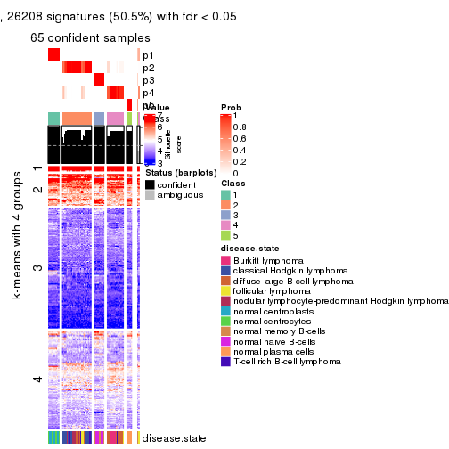</p>

</div>
<div id='tab-SD-pam-get-signatures-no-scale-5'>
<pre><code class="r">get_signatures(res, k = 6, scale_rows = FALSE)
</code></pre>

<p></p>

</div>
</div>


Compare the overlap of signatures from different k:

```r
compare_signatures(res)
```


`get_signature()` returns a data frame invisibly. TO get the list of signatures, the function
call should be assigned to a variable explicitly. In following code, if `plot` argument is set
to `FALSE`, no heatmap is plotted while only the differential analysis is performed.

```r
# code only for demonstration
tb = get_signature(res, k = ..., plot = FALSE)
```

An example of the output of `tb` is:

```
#>   which_row         fdr    mean_1    mean_2 scaled_mean_1 scaled_mean_2 km
#> 1        38 0.042760348  8.373488  9.131774    -0.5533452     0.5164555  1
#> 2        40 0.018707592  7.106213  8.469186    -0.6173731     0.5762149  1
#> 3        55 0.019134737 10.221463 11.207825    -0.6159697     0.5749050  1
#> 4        59 0.006059896  5.921854  7.869574    -0.6899429     0.6439467  1
#> 5        60 0.018055526  8.928898 10.211722    -0.6204761     0.5791110  1
#> 6        98 0.009384629 15.714769 14.887706     0.6635654    -0.6193277  2
...
```

The columns in `tb` are:

1. `which_row`: row indices corresponding to the input matrix.
2. `fdr`: FDR for the differential test. 
3. `mean_x`: The mean value in group x.
4. `scaled_mean_x`: The mean value in group x after rows are scaled.
5. `km`: Row groups if k-means clustering is applied to rows.


UMAP plot which shows how samples are separated.


<script>
$( function() {
	$( '#tabs-SD-pam-dimension-reduction' ).tabs();
} );
</script>
<div id='tabs-SD-pam-dimension-reduction'>
<ul>
<li><a href='#tab-SD-pam-dimension-reduction-1'>k = 2</a></li>
<li><a href='#tab-SD-pam-dimension-reduction-2'>k = 3</a></li>
<li><a href='#tab-SD-pam-dimension-reduction-3'>k = 4</a></li>
<li><a href='#tab-SD-pam-dimension-reduction-4'>k = 5</a></li>
<li><a href='#tab-SD-pam-dimension-reduction-5'>k = 6</a></li>
</ul>
<div id='tab-SD-pam-dimension-reduction-1'>
<pre><code class="r">dimension_reduction(res, k = 2, method = &quot;UMAP&quot;)
</code></pre>

<p></p>

</div>
<div id='tab-SD-pam-dimension-reduction-2'>
<pre><code class="r">dimension_reduction(res, k = 3, method = &quot;UMAP&quot;)
</code></pre>

<p></p>

</div>
<div id='tab-SD-pam-dimension-reduction-3'>
<pre><code class="r">dimension_reduction(res, k = 4, method = &quot;UMAP&quot;)
</code></pre>

<p></p>

</div>
<div id='tab-SD-pam-dimension-reduction-4'>
<pre><code class="r">dimension_reduction(res, k = 5, method = &quot;UMAP&quot;)
</code></pre>

<p></p>

</div>
<div id='tab-SD-pam-dimension-reduction-5'>
<pre><code class="r">dimension_reduction(res, k = 6, method = &quot;UMAP&quot;)
</code></pre>

<p></p>

</div>
</div>


Following heatmap shows how subgroups are split when increasing `k`:

```r
collect_classes(res)
```


Test correlation between subgroups and known annotations. If the known
annotation is numeric, one-way ANOVA test is applied, and if the known
annotation is discrete, chi-squared contingency table test is applied.

```r
test_to_known_factors(res)
```

```
#>         n disease.state(p) k
#> SD:pam 67         1.68e-10 2
#> SD:pam 67         3.83e-17 3
#> SD:pam 66         1.17e-26 4
#> SD:pam 65         1.21e-28 5
#> SD:pam 63         2.66e-26 6
```


If matrix rows can be associated to genes, consider to use `GO_Enrichment(res,
...)` to perform function enrichment for the signature genes.


 

---------------------------------------------------


### SD:mclust**


The object with results only for a single top-value method and a single partition method 
can be extracted as:

```r
res = res_list["SD", "mclust"]
# you can also extract it by
# res = res_list["SD:mclust"]
```

A summary of `res` and all the functions that can be applied to it:

```r
res
```

```
#> A 'ConsensusPartition' object with k = 2, 3, 4, 5, 6.
#>   On a matrix with 51941 rows and 67 columns.
#>   Top rows (1000, 2000, 3000, 4000, 5000) are extracted by 'SD' method.
#>   Subgroups are detected by 'mclust' method.
#>   Performed in total 1250 partitions by row resampling.
#>   Best k for subgroups seems to be 6.
#> 
#> Following methods can be applied to this 'ConsensusPartition' object:
#>  [1] "cola_report"             "collect_classes"         "collect_plots"          
#>  [4] "collect_stats"           "colnames"                "compare_signatures"     
#>  [7] "consensus_heatmap"       "dimension_reduction"     "functional_enrichment"  
#> [10] "get_anno_col"            "get_anno"                "get_classes"            
#> [13] "get_consensus"           "get_matrix"              "get_membership"         
#> [16] "get_param"               "get_signatures"          "get_stats"              
#> [19] "is_best_k"               "is_stable_k"             "membership_heatmap"     
#> [22] "ncol"                    "nrow"                    "plot_ecdf"              
#> [25] "rownames"                "select_partition_number" "show"                   
#> [28] "suggest_best_k"          "test_to_known_factors"
```

`collect_plots()` function collects all the plots made from `res` for all `k` (number of partitions)
into one single page to provide an easy and fast comparison between different `k`.

```r
collect_plots(res)
```


The plots are:

- The first row: a plot of the ECDF (Empirical cumulative distribution
  function) curves of the consensus matrix for each `k` and the heatmap of
  predicted classes for each `k`.
- The second row: heatmaps of the consensus matrix for each `k`.
- The third row: heatmaps of the membership matrix for each `k`.
- The fouth row: heatmaps of the signatures for each `k`.

All the plots in panels can be made by individual functions and they are
plotted later in this section.

`select_partition_number()` produces several plots showing different
statistics for choosing "optimized" `k`. There are following statistics:

- ECDF curves of the consensus matrix for each `k`;
- 1-PAC. [The PAC
  score](https://en.wikipedia.org/wiki/Consensus_clustering#Over-interpretation_potential_of_consensus_clustering)
  measures the proportion of the ambiguous subgrouping.
- Mean silhouette score.
- Concordance. The mean probability of fiting the consensus class ids in all
  partitions.
- Area increased. Denote $A_k$ as the area under the ECDF curve for current
  `k`, the area increased is defined as $A_k - A_{k-1}$.
- Rand index. The percent of pairs of samples that are both in a same cluster
  or both are not in a same cluster in the partition of k and k-1.
- Jaccard index. The ratio of pairs of samples are both in a same cluster in
  the partition of k and k-1 and the pairs of samples are both in a same
  cluster in the partition k or k-1.

The detailed explanations of these statistics can be found in [the cola
vignette](http://bioconductor.org/packages/devel/bioc/vignettes/cola/inst/doc/cola.html#toc_13).

Generally speaking, lower PAC score, higher mean silhouette score or higher
concordance corresponds to better partition. Rand index and Jaccard index
measure how similar the current partition is compared to partition with `k-1`.
If they are too similar, we won't accept `k` is better than `k-1`.

```r
select_partition_number(res)
```


The numeric values for all these statistics can be obtained by `get_stats()`.

```r
get_stats(res)
```

```
#>   k 1-PAC mean_silhouette concordance area_increased  Rand Jaccard
#> 2 2 1.000           0.998       0.998         0.4734 0.525   0.525
#> 3 3 0.575           0.722       0.866         0.2807 0.909   0.828
#> 4 4 0.561           0.779       0.816         0.0783 0.954   0.901
#> 5 5 0.715           0.509       0.761         0.1449 0.823   0.595
#> 6 6 0.997           0.952       0.980         0.0631 0.793   0.387
```

`suggest_best_k()` suggests the best $k$ based on these statistics. The rules are as follows:

- All $k$ with Jaccard index larger than 0.95 are removed because the increase of
  the partition number does not provides enough extra information. If all $k$ are removed,
  the best $k$ is assigned by `NA`.
- For $k$ with 1-PAC larger than 0.9, the maximal $k$ is taken as the "best k". Other $k$ is called "optional k".
- If it does not fit the second rule. The $k$ with the highest vote of highest
  1-PAC, mean silhouette and concordance is taken as the "best k".

```r
suggest_best_k(res)
```

```
#> [1] 6
#> attr(,"optional")
#> [1] 2
```

There is also optional best $k$ = 2 that is worth to check.

Following shows the table of the partitions (You need to click the **show/hide
code output** link to see it). The membership matrix (columns with name `p*`)
is inferred by
[`clue::cl_consensus()`](https://www.rdocumentation.org/link/cl_consensus?package=clue)
function with the `SE` method. Basically the value in the membership matrix
represents the probability to belong to a certain group. The finall class
label for an item is determined with the group with highest probability it
belongs to.

In `get_classes()` function, the entropy is calculated from the membership
matrix and the silhouette score is calculated from the consensus matrix.


<script>
$( function() {
	$( '#tabs-SD-mclust-get-classes' ).tabs();
} );
</script>
<div id='tabs-SD-mclust-get-classes'>
<ul>
<li><a href='#tab-SD-mclust-get-classes-1'>k = 2</a></li>
<li><a href='#tab-SD-mclust-get-classes-2'>k = 3</a></li>
<li><a href='#tab-SD-mclust-get-classes-3'>k = 4</a></li>
<li><a href='#tab-SD-mclust-get-classes-4'>k = 5</a></li>
<li><a href='#tab-SD-mclust-get-classes-5'>k = 6</a></li>
</ul>

<div id='tab-SD-mclust-get-classes-1'>
<p><a id='tab-SD-mclust-get-classes-1-a' style='color:#0366d6' href='#'>show/hide code output</a></p>
<pre><code class="r">cbind(get_classes(res, k = 2), get_membership(res, k = 2))
</code></pre>

<pre><code>#&gt;           class entropy silhouette    p1    p2
#&gt; GSM312811     2  0.0000      1.000 0.000 1.000
#&gt; GSM312812     2  0.0000      1.000 0.000 1.000
#&gt; GSM312813     2  0.0000      1.000 0.000 1.000
#&gt; GSM312814     2  0.0000      1.000 0.000 1.000
#&gt; GSM312815     2  0.0000      1.000 0.000 1.000
#&gt; GSM312816     2  0.0000      1.000 0.000 1.000
#&gt; GSM312817     2  0.0000      1.000 0.000 1.000
#&gt; GSM312818     2  0.0000      1.000 0.000 1.000
#&gt; GSM312819     2  0.0000      1.000 0.000 1.000
#&gt; GSM312820     2  0.0000      1.000 0.000 1.000
#&gt; GSM312821     2  0.0000      1.000 0.000 1.000
#&gt; GSM312822     2  0.0000      1.000 0.000 1.000
#&gt; GSM312823     2  0.0000      1.000 0.000 1.000
#&gt; GSM312824     2  0.0000      1.000 0.000 1.000
#&gt; GSM312825     2  0.0000      1.000 0.000 1.000
#&gt; GSM312826     2  0.0000      1.000 0.000 1.000
#&gt; GSM312839     2  0.0000      1.000 0.000 1.000
#&gt; GSM312840     2  0.0000      1.000 0.000 1.000
#&gt; GSM312841     2  0.0000      1.000 0.000 1.000
#&gt; GSM312843     2  0.0000      1.000 0.000 1.000
#&gt; GSM312844     2  0.0000      1.000 0.000 1.000
#&gt; GSM312845     2  0.0000      1.000 0.000 1.000
#&gt; GSM312846     2  0.0000      1.000 0.000 1.000
#&gt; GSM312847     2  0.0000      1.000 0.000 1.000
#&gt; GSM312848     2  0.0000      1.000 0.000 1.000
#&gt; GSM312849     2  0.0000      1.000 0.000 1.000
#&gt; GSM312851     2  0.0000      1.000 0.000 1.000
#&gt; GSM312853     2  0.0000      1.000 0.000 1.000
#&gt; GSM312854     2  0.0000      1.000 0.000 1.000
#&gt; GSM312856     2  0.0000      1.000 0.000 1.000
#&gt; GSM312857     2  0.0000      1.000 0.000 1.000
#&gt; GSM312858     2  0.0000      1.000 0.000 1.000
#&gt; GSM312859     2  0.0000      1.000 0.000 1.000
#&gt; GSM312860     2  0.0000      1.000 0.000 1.000
#&gt; GSM312861     2  0.0000      1.000 0.000 1.000
#&gt; GSM312862     2  0.0000      1.000 0.000 1.000
#&gt; GSM312863     2  0.0000      1.000 0.000 1.000
#&gt; GSM312864     2  0.0000      1.000 0.000 1.000
#&gt; GSM312865     2  0.0000      1.000 0.000 1.000
#&gt; GSM312867     2  0.0000      1.000 0.000 1.000
#&gt; GSM312868     2  0.0000      1.000 0.000 1.000
#&gt; GSM312869     2  0.0000      1.000 0.000 1.000
#&gt; GSM312870     1  0.0000      0.993 1.000 0.000
#&gt; GSM312872     1  0.0000      0.993 1.000 0.000
#&gt; GSM312874     1  0.0000      0.993 1.000 0.000
#&gt; GSM312875     1  0.0000      0.993 1.000 0.000
#&gt; GSM312876     1  0.0000      0.993 1.000 0.000
#&gt; GSM312877     1  0.0000      0.993 1.000 0.000
#&gt; GSM312879     1  0.0000      0.993 1.000 0.000
#&gt; GSM312882     1  0.0000      0.993 1.000 0.000
#&gt; GSM312883     1  0.0000      0.993 1.000 0.000
#&gt; GSM312886     1  0.0000      0.993 1.000 0.000
#&gt; GSM312887     1  0.0938      0.994 0.988 0.012
#&gt; GSM312890     1  0.0938      0.994 0.988 0.012
#&gt; GSM312893     1  0.0938      0.994 0.988 0.012
#&gt; GSM312894     1  0.0938      0.994 0.988 0.012
#&gt; GSM312895     1  0.0938      0.994 0.988 0.012
#&gt; GSM312937     1  0.0938      0.994 0.988 0.012
#&gt; GSM312938     1  0.0938      0.994 0.988 0.012
#&gt; GSM312939     1  0.0938      0.994 0.988 0.012
#&gt; GSM312940     1  0.0938      0.994 0.988 0.012
#&gt; GSM312941     1  0.0938      0.994 0.988 0.012
#&gt; GSM312942     1  0.0672      0.995 0.992 0.008
#&gt; GSM312943     1  0.0672      0.995 0.992 0.008
#&gt; GSM312944     1  0.0672      0.995 0.992 0.008
#&gt; GSM312945     1  0.0672      0.995 0.992 0.008
#&gt; GSM312946     1  0.0672      0.995 0.992 0.008
</code></pre>

<script>
$('#tab-SD-mclust-get-classes-1-a').parent().next().next().hide();
$('#tab-SD-mclust-get-classes-1-a').click(function(){
  $('#tab-SD-mclust-get-classes-1-a').parent().next().next().toggle();
  return(false);
});
</script>
</div>

<div id='tab-SD-mclust-get-classes-2'>
<p><a id='tab-SD-mclust-get-classes-2-a' style='color:#0366d6' href='#'>show/hide code output</a></p>
<pre><code class="r">cbind(get_classes(res, k = 3), get_membership(res, k = 3))
</code></pre>

<pre><code>#&gt;           class entropy silhouette    p1    p2    p3
#&gt; GSM312811     2  0.0000      0.825 0.000 1.000 0.000
#&gt; GSM312812     2  0.0000      0.825 0.000 1.000 0.000
#&gt; GSM312813     2  0.0000      0.825 0.000 1.000 0.000
#&gt; GSM312814     2  0.0000      0.825 0.000 1.000 0.000
#&gt; GSM312815     2  0.0000      0.825 0.000 1.000 0.000
#&gt; GSM312816     2  0.8561      0.134 0.096 0.484 0.420
#&gt; GSM312817     2  0.0000      0.825 0.000 1.000 0.000
#&gt; GSM312818     2  0.8561      0.134 0.096 0.484 0.420
#&gt; GSM312819     2  0.6986      0.502 0.056 0.688 0.256
#&gt; GSM312820     2  0.8561      0.134 0.096 0.484 0.420
#&gt; GSM312821     2  0.8561      0.134 0.096 0.484 0.420
#&gt; GSM312822     2  0.0000      0.825 0.000 1.000 0.000
#&gt; GSM312823     2  0.0000      0.825 0.000 1.000 0.000
#&gt; GSM312824     2  0.0000      0.825 0.000 1.000 0.000
#&gt; GSM312825     2  0.0000      0.825 0.000 1.000 0.000
#&gt; GSM312826     2  0.0000      0.825 0.000 1.000 0.000
#&gt; GSM312839     2  0.0000      0.825 0.000 1.000 0.000
#&gt; GSM312840     2  0.0000      0.825 0.000 1.000 0.000
#&gt; GSM312841     2  0.0000      0.825 0.000 1.000 0.000
#&gt; GSM312843     2  0.0000      0.825 0.000 1.000 0.000
#&gt; GSM312844     2  0.0000      0.825 0.000 1.000 0.000
#&gt; GSM312845     3  0.6291     -0.191 0.000 0.468 0.532
#&gt; GSM312846     2  0.6192      0.422 0.000 0.580 0.420
#&gt; GSM312847     2  0.5650      0.609 0.000 0.688 0.312
#&gt; GSM312848     2  0.4702      0.724 0.000 0.788 0.212
#&gt; GSM312849     2  0.5621      0.614 0.000 0.692 0.308
#&gt; GSM312851     2  0.4796      0.719 0.000 0.780 0.220
#&gt; GSM312853     2  0.4796      0.719 0.000 0.780 0.220
#&gt; GSM312854     2  0.4796      0.719 0.000 0.780 0.220
#&gt; GSM312856     2  0.4796      0.719 0.000 0.780 0.220
#&gt; GSM312857     2  0.4796      0.719 0.000 0.780 0.220
#&gt; GSM312858     2  0.4702      0.724 0.000 0.788 0.212
#&gt; GSM312859     2  0.0000      0.825 0.000 1.000 0.000
#&gt; GSM312860     2  0.0000      0.825 0.000 1.000 0.000
#&gt; GSM312861     2  0.0000      0.825 0.000 1.000 0.000
#&gt; GSM312862     2  0.0000      0.825 0.000 1.000 0.000
#&gt; GSM312863     2  0.4750      0.722 0.000 0.784 0.216
#&gt; GSM312864     2  0.0000      0.825 0.000 1.000 0.000
#&gt; GSM312865     2  0.5650      0.609 0.000 0.688 0.312
#&gt; GSM312867     2  0.5621      0.614 0.000 0.692 0.308
#&gt; GSM312868     2  0.4702      0.724 0.000 0.788 0.212
#&gt; GSM312869     2  0.0000      0.825 0.000 1.000 0.000
#&gt; GSM312870     1  0.5968      0.796 0.636 0.000 0.364
#&gt; GSM312872     1  0.5968      0.796 0.636 0.000 0.364
#&gt; GSM312874     1  0.5968      0.796 0.636 0.000 0.364
#&gt; GSM312875     1  0.5968      0.796 0.636 0.000 0.364
#&gt; GSM312876     1  0.5968      0.796 0.636 0.000 0.364
#&gt; GSM312877     1  0.0592      0.635 0.988 0.000 0.012
#&gt; GSM312879     1  0.5968      0.796 0.636 0.000 0.364
#&gt; GSM312882     1  0.5968      0.796 0.636 0.000 0.364
#&gt; GSM312883     1  0.5138      0.773 0.748 0.000 0.252
#&gt; GSM312886     1  0.6305      0.708 0.516 0.000 0.484
#&gt; GSM312887     3  0.5988      0.911 0.368 0.000 0.632
#&gt; GSM312890     3  0.5968      0.914 0.364 0.000 0.636
#&gt; GSM312893     3  0.5968      0.914 0.364 0.000 0.636
#&gt; GSM312894     3  0.5988      0.911 0.368 0.000 0.632
#&gt; GSM312895     3  0.5968      0.914 0.364 0.000 0.636
#&gt; GSM312937     3  0.5968      0.914 0.364 0.000 0.636
#&gt; GSM312938     3  0.5988      0.911 0.368 0.000 0.632
#&gt; GSM312939     3  0.5968      0.914 0.364 0.000 0.636
#&gt; GSM312940     3  0.5968      0.914 0.364 0.000 0.636
#&gt; GSM312941     3  0.5968      0.914 0.364 0.000 0.636
#&gt; GSM312942     1  0.1163      0.647 0.972 0.000 0.028
#&gt; GSM312943     1  0.0747      0.636 0.984 0.000 0.016
#&gt; GSM312944     1  0.0747      0.636 0.984 0.000 0.016
#&gt; GSM312945     1  0.0747      0.636 0.984 0.000 0.016
#&gt; GSM312946     1  0.0747      0.636 0.984 0.000 0.016
</code></pre>

<script>
$('#tab-SD-mclust-get-classes-2-a').parent().next().next().hide();
$('#tab-SD-mclust-get-classes-2-a').click(function(){
  $('#tab-SD-mclust-get-classes-2-a').parent().next().next().toggle();
  return(false);
});
</script>
</div>

<div id='tab-SD-mclust-get-classes-3'>
<p><a id='tab-SD-mclust-get-classes-3-a' style='color:#0366d6' href='#'>show/hide code output</a></p>
<pre><code class="r">cbind(get_classes(res, k = 4), get_membership(res, k = 4))
</code></pre>

<pre><code>#&gt;           class entropy silhouette    p1    p2    p3    p4
#&gt; GSM312811     2  0.2589      0.783 0.000 0.884 0.000 0.116
#&gt; GSM312812     2  0.0000      0.804 0.000 1.000 0.000 0.000
#&gt; GSM312813     2  0.2530      0.768 0.112 0.888 0.000 0.000
#&gt; GSM312814     2  0.2345      0.789 0.000 0.900 0.000 0.100
#&gt; GSM312815     2  0.0000      0.804 0.000 1.000 0.000 0.000
#&gt; GSM312816     2  0.8469      0.547 0.112 0.504 0.096 0.288
#&gt; GSM312817     2  0.2714      0.768 0.112 0.884 0.000 0.004
#&gt; GSM312818     2  0.8469      0.547 0.112 0.504 0.096 0.288
#&gt; GSM312819     2  0.4586      0.747 0.112 0.812 0.068 0.008
#&gt; GSM312820     2  0.8469      0.547 0.112 0.504 0.096 0.288
#&gt; GSM312821     2  0.8469      0.547 0.112 0.504 0.096 0.288
#&gt; GSM312822     2  0.2868      0.774 0.000 0.864 0.000 0.136
#&gt; GSM312823     2  0.0707      0.802 0.020 0.980 0.000 0.000
#&gt; GSM312824     2  0.0000      0.804 0.000 1.000 0.000 0.000
#&gt; GSM312825     2  0.0000      0.804 0.000 1.000 0.000 0.000
#&gt; GSM312826     2  0.0000      0.804 0.000 1.000 0.000 0.000
#&gt; GSM312839     2  0.0000      0.804 0.000 1.000 0.000 0.000
#&gt; GSM312840     2  0.0336      0.804 0.000 0.992 0.000 0.008
#&gt; GSM312841     2  0.1940      0.795 0.000 0.924 0.000 0.076
#&gt; GSM312843     2  0.0921      0.805 0.000 0.972 0.000 0.028
#&gt; GSM312844     2  0.0000      0.804 0.000 1.000 0.000 0.000
#&gt; GSM312845     2  0.6621      0.683 0.188 0.628 0.000 0.184
#&gt; GSM312846     2  0.6437      0.703 0.168 0.648 0.000 0.184
#&gt; GSM312847     2  0.4916      0.745 0.056 0.760 0.000 0.184
#&gt; GSM312848     2  0.4789      0.748 0.056 0.772 0.000 0.172
#&gt; GSM312849     2  0.6437      0.703 0.168 0.648 0.000 0.184
#&gt; GSM312851     2  0.6277      0.584 0.056 0.476 0.000 0.468
#&gt; GSM312853     2  0.6277      0.584 0.056 0.476 0.000 0.468
#&gt; GSM312854     2  0.6276      0.588 0.056 0.480 0.000 0.464
#&gt; GSM312856     2  0.5898      0.706 0.056 0.628 0.000 0.316
#&gt; GSM312857     2  0.6277      0.584 0.056 0.476 0.000 0.468
#&gt; GSM312858     2  0.4789      0.748 0.056 0.772 0.000 0.172
#&gt; GSM312859     2  0.0000      0.804 0.000 1.000 0.000 0.000
#&gt; GSM312860     2  0.2469      0.770 0.108 0.892 0.000 0.000
#&gt; GSM312861     2  0.1389      0.803 0.000 0.952 0.000 0.048
#&gt; GSM312862     2  0.2530      0.768 0.112 0.888 0.000 0.000
#&gt; GSM312863     2  0.5857      0.711 0.056 0.636 0.000 0.308
#&gt; GSM312864     2  0.4257      0.769 0.048 0.812 0.000 0.140
#&gt; GSM312865     2  0.4789      0.748 0.056 0.772 0.000 0.172
#&gt; GSM312867     2  0.6437      0.703 0.168 0.648 0.000 0.184
#&gt; GSM312868     2  0.6284      0.712 0.164 0.664 0.000 0.172
#&gt; GSM312869     2  0.0000      0.804 0.000 1.000 0.000 0.000
#&gt; GSM312870     3  0.0000      0.870 0.000 0.000 1.000 0.000
#&gt; GSM312872     3  0.0000      0.870 0.000 0.000 1.000 0.000
#&gt; GSM312874     3  0.0000      0.870 0.000 0.000 1.000 0.000
#&gt; GSM312875     3  0.0000      0.870 0.000 0.000 1.000 0.000
#&gt; GSM312876     3  0.0000      0.870 0.000 0.000 1.000 0.000
#&gt; GSM312877     3  0.6616     -0.484 0.108 0.000 0.584 0.308
#&gt; GSM312879     3  0.0000      0.870 0.000 0.000 1.000 0.000
#&gt; GSM312882     3  0.1211      0.838 0.000 0.000 0.960 0.040
#&gt; GSM312883     3  0.1867      0.798 0.000 0.000 0.928 0.072
#&gt; GSM312886     3  0.3521      0.674 0.084 0.000 0.864 0.052
#&gt; GSM312887     1  0.2081      0.925 0.916 0.000 0.000 0.084
#&gt; GSM312890     1  0.0000      0.970 1.000 0.000 0.000 0.000
#&gt; GSM312893     1  0.0000      0.970 1.000 0.000 0.000 0.000
#&gt; GSM312894     1  0.2011      0.927 0.920 0.000 0.000 0.080
#&gt; GSM312895     1  0.0000      0.970 1.000 0.000 0.000 0.000
#&gt; GSM312937     1  0.0000      0.970 1.000 0.000 0.000 0.000
#&gt; GSM312938     1  0.2081      0.925 0.916 0.000 0.000 0.084
#&gt; GSM312939     1  0.0000      0.970 1.000 0.000 0.000 0.000
#&gt; GSM312940     1  0.0000      0.970 1.000 0.000 0.000 0.000
#&gt; GSM312941     1  0.0000      0.970 1.000 0.000 0.000 0.000
#&gt; GSM312942     4  0.6867      0.977 0.108 0.000 0.384 0.508
#&gt; GSM312943     4  0.6727      0.994 0.096 0.000 0.384 0.520
#&gt; GSM312944     4  0.6727      0.994 0.096 0.000 0.384 0.520
#&gt; GSM312945     4  0.6727      0.994 0.096 0.000 0.384 0.520
#&gt; GSM312946     4  0.6727      0.994 0.096 0.000 0.384 0.520
</code></pre>

<script>
$('#tab-SD-mclust-get-classes-3-a').parent().next().next().hide();
$('#tab-SD-mclust-get-classes-3-a').click(function(){
  $('#tab-SD-mclust-get-classes-3-a').parent().next().next().toggle();
  return(false);
});
</script>
</div>

<div id='tab-SD-mclust-get-classes-4'>
<p><a id='tab-SD-mclust-get-classes-4-a' style='color:#0366d6' href='#'>show/hide code output</a></p>
<pre><code class="r">cbind(get_classes(res, k = 5), get_membership(res, k = 5))
</code></pre>

<pre><code>#&gt;           class entropy silhouette   p1    p2    p3    p4    p5
#&gt; GSM312811     4  0.1908      0.272 0.00 0.092 0.000 0.908 0.000
#&gt; GSM312812     2  0.4304      0.503 0.00 0.516 0.000 0.484 0.000
#&gt; GSM312813     4  0.4307     -0.527 0.00 0.496 0.000 0.504 0.000
#&gt; GSM312814     4  0.2516      0.206 0.00 0.140 0.000 0.860 0.000
#&gt; GSM312815     2  0.4304      0.503 0.00 0.516 0.000 0.484 0.000
#&gt; GSM312816     4  0.1892      0.430 0.00 0.004 0.000 0.916 0.080
#&gt; GSM312817     4  0.0880      0.384 0.00 0.032 0.000 0.968 0.000
#&gt; GSM312818     4  0.1952      0.431 0.00 0.004 0.000 0.912 0.084
#&gt; GSM312819     4  0.0703      0.390 0.00 0.024 0.000 0.976 0.000
#&gt; GSM312820     4  0.1952      0.431 0.00 0.004 0.000 0.912 0.084
#&gt; GSM312821     4  0.1952      0.431 0.00 0.004 0.000 0.912 0.084
#&gt; GSM312822     4  0.0609      0.382 0.00 0.020 0.000 0.980 0.000
#&gt; GSM312823     4  0.2329      0.253 0.00 0.124 0.000 0.876 0.000
#&gt; GSM312824     2  0.4304      0.503 0.00 0.516 0.000 0.484 0.000
#&gt; GSM312825     2  0.4304      0.503 0.00 0.516 0.000 0.484 0.000
#&gt; GSM312826     2  0.4304      0.503 0.00 0.516 0.000 0.484 0.000
#&gt; GSM312839     2  0.4304      0.503 0.00 0.516 0.000 0.484 0.000
#&gt; GSM312840     2  0.4307      0.485 0.00 0.500 0.000 0.500 0.000
#&gt; GSM312841     4  0.4101     -0.344 0.00 0.372 0.000 0.628 0.000
#&gt; GSM312843     4  0.3774      0.434 0.00 0.296 0.000 0.704 0.000
#&gt; GSM312844     4  0.4306     -0.530 0.00 0.492 0.000 0.508 0.000
#&gt; GSM312845     4  0.4307      0.393 0.00 0.500 0.000 0.500 0.000
#&gt; GSM312846     4  0.4307      0.393 0.00 0.500 0.000 0.500 0.000
#&gt; GSM312847     2  0.4307     -0.459 0.00 0.500 0.000 0.500 0.000
#&gt; GSM312848     2  0.4307     -0.459 0.00 0.500 0.000 0.500 0.000
#&gt; GSM312849     4  0.4307      0.393 0.00 0.500 0.000 0.500 0.000
#&gt; GSM312851     4  0.5691      0.419 0.00 0.400 0.000 0.516 0.084
#&gt; GSM312853     4  0.5691      0.419 0.00 0.400 0.000 0.516 0.084
#&gt; GSM312854     4  0.5691      0.419 0.00 0.400 0.000 0.516 0.084
#&gt; GSM312856     4  0.4448      0.399 0.00 0.480 0.000 0.516 0.004
#&gt; GSM312857     4  0.5691      0.419 0.00 0.400 0.000 0.516 0.084
#&gt; GSM312858     4  0.4307      0.393 0.00 0.500 0.000 0.500 0.000
#&gt; GSM312859     2  0.4307      0.483 0.00 0.504 0.000 0.496 0.000
#&gt; GSM312860     4  0.4300     -0.498 0.00 0.476 0.000 0.524 0.000
#&gt; GSM312861     4  0.3612      0.357 0.00 0.268 0.000 0.732 0.000
#&gt; GSM312862     4  0.3816      0.385 0.00 0.304 0.000 0.696 0.000
#&gt; GSM312863     4  0.4448      0.399 0.00 0.480 0.000 0.516 0.004
#&gt; GSM312864     4  0.2017      0.432 0.00 0.008 0.000 0.912 0.080
#&gt; GSM312865     2  0.4307     -0.459 0.00 0.500 0.000 0.500 0.000
#&gt; GSM312867     4  0.4307      0.393 0.00 0.500 0.000 0.500 0.000
#&gt; GSM312868     2  0.4307     -0.459 0.00 0.500 0.000 0.500 0.000
#&gt; GSM312869     2  0.4304      0.503 0.00 0.516 0.000 0.484 0.000
#&gt; GSM312870     3  0.0000      0.994 0.00 0.000 1.000 0.000 0.000
#&gt; GSM312872     3  0.0000      0.994 0.00 0.000 1.000 0.000 0.000
#&gt; GSM312874     3  0.0000      0.994 0.00 0.000 1.000 0.000 0.000
#&gt; GSM312875     3  0.0000      0.994 0.00 0.000 1.000 0.000 0.000
#&gt; GSM312876     3  0.0000      0.994 0.00 0.000 1.000 0.000 0.000
#&gt; GSM312877     5  0.3707      0.720 0.00 0.000 0.284 0.000 0.716
#&gt; GSM312879     3  0.0000      0.994 0.00 0.000 1.000 0.000 0.000
#&gt; GSM312882     3  0.0000      0.994 0.00 0.000 1.000 0.000 0.000
#&gt; GSM312883     3  0.0963      0.953 0.00 0.000 0.964 0.000 0.036
#&gt; GSM312886     3  0.0000      0.994 0.00 0.000 1.000 0.000 0.000
#&gt; GSM312887     1  0.3161      0.838 0.86 0.000 0.008 0.100 0.032
#&gt; GSM312890     1  0.0000      0.956 1.00 0.000 0.000 0.000 0.000
#&gt; GSM312893     1  0.0000      0.956 1.00 0.000 0.000 0.000 0.000
#&gt; GSM312894     1  0.1043      0.930 0.96 0.000 0.000 0.000 0.040
#&gt; GSM312895     1  0.0000      0.956 1.00 0.000 0.000 0.000 0.000
#&gt; GSM312937     1  0.0000      0.956 1.00 0.000 0.000 0.000 0.000
#&gt; GSM312938     1  0.2984      0.831 0.86 0.000 0.000 0.108 0.032
#&gt; GSM312939     1  0.0000      0.956 1.00 0.000 0.000 0.000 0.000
#&gt; GSM312940     1  0.0000      0.956 1.00 0.000 0.000 0.000 0.000
#&gt; GSM312941     1  0.0000      0.956 1.00 0.000 0.000 0.000 0.000
#&gt; GSM312942     5  0.2020      0.942 0.00 0.000 0.100 0.000 0.900
#&gt; GSM312943     5  0.1792      0.951 0.00 0.000 0.084 0.000 0.916
#&gt; GSM312944     5  0.1792      0.951 0.00 0.000 0.084 0.000 0.916
#&gt; GSM312945     5  0.1792      0.951 0.00 0.000 0.084 0.000 0.916
#&gt; GSM312946     5  0.1792      0.951 0.00 0.000 0.084 0.000 0.916
</code></pre>

<script>
$('#tab-SD-mclust-get-classes-4-a').parent().next().next().hide();
$('#tab-SD-mclust-get-classes-4-a').click(function(){
  $('#tab-SD-mclust-get-classes-4-a').parent().next().next().toggle();
  return(false);
});
</script>
</div>

<div id='tab-SD-mclust-get-classes-5'>
<p><a id='tab-SD-mclust-get-classes-5-a' style='color:#0366d6' href='#'>show/hide code output</a></p>
<pre><code class="r">cbind(get_classes(res, k = 6), get_membership(res, k = 6))
</code></pre>

<pre><code>#&gt;           class entropy silhouette    p1    p2    p3    p4    p5    p6
#&gt; GSM312811     2  0.1204      0.942 0.000 0.944 0.000 0.000 0.056 0.000
#&gt; GSM312812     2  0.0000      0.966 0.000 1.000 0.000 0.000 0.000 0.000
#&gt; GSM312813     2  0.0000      0.966 0.000 1.000 0.000 0.000 0.000 0.000
#&gt; GSM312814     2  0.0937      0.952 0.000 0.960 0.000 0.000 0.040 0.000
#&gt; GSM312815     2  0.0000      0.966 0.000 1.000 0.000 0.000 0.000 0.000
#&gt; GSM312816     5  0.1267      0.904 0.000 0.060 0.000 0.000 0.940 0.000
#&gt; GSM312817     2  0.0713      0.957 0.000 0.972 0.000 0.000 0.028 0.000
#&gt; GSM312818     5  0.0000      0.968 0.000 0.000 0.000 0.000 1.000 0.000
#&gt; GSM312819     2  0.1327      0.936 0.000 0.936 0.000 0.000 0.064 0.000
#&gt; GSM312820     5  0.0000      0.968 0.000 0.000 0.000 0.000 1.000 0.000
#&gt; GSM312821     5  0.0000      0.968 0.000 0.000 0.000 0.000 1.000 0.000
#&gt; GSM312822     2  0.1267      0.939 0.000 0.940 0.000 0.000 0.060 0.000
#&gt; GSM312823     2  0.0790      0.945 0.000 0.968 0.000 0.032 0.000 0.000
#&gt; GSM312824     2  0.0000      0.966 0.000 1.000 0.000 0.000 0.000 0.000
#&gt; GSM312825     2  0.0000      0.966 0.000 1.000 0.000 0.000 0.000 0.000
#&gt; GSM312826     2  0.0000      0.966 0.000 1.000 0.000 0.000 0.000 0.000
#&gt; GSM312839     2  0.0000      0.966 0.000 1.000 0.000 0.000 0.000 0.000
#&gt; GSM312840     2  0.0000      0.966 0.000 1.000 0.000 0.000 0.000 0.000
#&gt; GSM312841     2  0.1075      0.947 0.000 0.952 0.000 0.000 0.048 0.000
#&gt; GSM312843     4  0.3695      0.388 0.000 0.376 0.000 0.624 0.000 0.000
#&gt; GSM312844     2  0.0000      0.966 0.000 1.000 0.000 0.000 0.000 0.000
#&gt; GSM312845     4  0.0000      0.960 0.000 0.000 0.000 1.000 0.000 0.000
#&gt; GSM312846     4  0.0000      0.960 0.000 0.000 0.000 1.000 0.000 0.000
#&gt; GSM312847     4  0.0000      0.960 0.000 0.000 0.000 1.000 0.000 0.000
#&gt; GSM312848     4  0.0000      0.960 0.000 0.000 0.000 1.000 0.000 0.000
#&gt; GSM312849     4  0.0146      0.958 0.000 0.004 0.000 0.996 0.000 0.000
#&gt; GSM312851     4  0.0146      0.959 0.000 0.000 0.000 0.996 0.004 0.000
#&gt; GSM312853     4  0.0146      0.959 0.000 0.000 0.000 0.996 0.004 0.000
#&gt; GSM312854     4  0.0146      0.959 0.000 0.000 0.000 0.996 0.004 0.000
#&gt; GSM312856     4  0.0146      0.959 0.000 0.000 0.000 0.996 0.004 0.000
#&gt; GSM312857     4  0.0146      0.959 0.000 0.000 0.000 0.996 0.004 0.000
#&gt; GSM312858     4  0.0458      0.947 0.000 0.016 0.000 0.984 0.000 0.000
#&gt; GSM312859     2  0.0000      0.966 0.000 1.000 0.000 0.000 0.000 0.000
#&gt; GSM312860     2  0.0000      0.966 0.000 1.000 0.000 0.000 0.000 0.000
#&gt; GSM312861     2  0.2260      0.822 0.000 0.860 0.000 0.140 0.000 0.000
#&gt; GSM312862     2  0.2340      0.811 0.000 0.852 0.000 0.148 0.000 0.000
#&gt; GSM312863     4  0.0146      0.959 0.000 0.000 0.000 0.996 0.004 0.000
#&gt; GSM312864     2  0.0790      0.956 0.000 0.968 0.000 0.000 0.032 0.000
#&gt; GSM312865     4  0.0000      0.960 0.000 0.000 0.000 1.000 0.000 0.000
#&gt; GSM312867     4  0.0000      0.960 0.000 0.000 0.000 1.000 0.000 0.000
#&gt; GSM312868     4  0.0713      0.935 0.000 0.028 0.000 0.972 0.000 0.000
#&gt; GSM312869     2  0.0000      0.966 0.000 1.000 0.000 0.000 0.000 0.000
#&gt; GSM312870     3  0.0000      1.000 0.000 0.000 1.000 0.000 0.000 0.000
#&gt; GSM312872     3  0.0000      1.000 0.000 0.000 1.000 0.000 0.000 0.000
#&gt; GSM312874     3  0.0000      1.000 0.000 0.000 1.000 0.000 0.000 0.000
#&gt; GSM312875     3  0.0000      1.000 0.000 0.000 1.000 0.000 0.000 0.000
#&gt; GSM312876     3  0.0000      1.000 0.000 0.000 1.000 0.000 0.000 0.000
#&gt; GSM312877     6  0.2793      0.734 0.000 0.000 0.200 0.000 0.000 0.800
#&gt; GSM312879     3  0.0000      1.000 0.000 0.000 1.000 0.000 0.000 0.000
#&gt; GSM312882     3  0.0000      1.000 0.000 0.000 1.000 0.000 0.000 0.000
#&gt; GSM312883     3  0.0000      1.000 0.000 0.000 1.000 0.000 0.000 0.000
#&gt; GSM312886     3  0.0000      1.000 0.000 0.000 1.000 0.000 0.000 0.000
#&gt; GSM312887     1  0.0146      0.995 0.996 0.000 0.000 0.000 0.004 0.000
#&gt; GSM312890     1  0.0000      0.999 1.000 0.000 0.000 0.000 0.000 0.000
#&gt; GSM312893     1  0.0000      0.999 1.000 0.000 0.000 0.000 0.000 0.000
#&gt; GSM312894     1  0.0000      0.999 1.000 0.000 0.000 0.000 0.000 0.000
#&gt; GSM312895     1  0.0000      0.999 1.000 0.000 0.000 0.000 0.000 0.000
#&gt; GSM312937     1  0.0000      0.999 1.000 0.000 0.000 0.000 0.000 0.000
#&gt; GSM312938     1  0.0146      0.995 0.996 0.000 0.000 0.000 0.004 0.000
#&gt; GSM312939     1  0.0000      0.999 1.000 0.000 0.000 0.000 0.000 0.000
#&gt; GSM312940     1  0.0000      0.999 1.000 0.000 0.000 0.000 0.000 0.000
#&gt; GSM312941     1  0.0000      0.999 1.000 0.000 0.000 0.000 0.000 0.000
#&gt; GSM312942     6  0.0146      0.946 0.000 0.000 0.004 0.000 0.000 0.996
#&gt; GSM312943     6  0.0000      0.949 0.000 0.000 0.000 0.000 0.000 1.000
#&gt; GSM312944     6  0.0000      0.949 0.000 0.000 0.000 0.000 0.000 1.000
#&gt; GSM312945     6  0.0000      0.949 0.000 0.000 0.000 0.000 0.000 1.000
#&gt; GSM312946     6  0.0000      0.949 0.000 0.000 0.000 0.000 0.000 1.000
</code></pre>

<script>
$('#tab-SD-mclust-get-classes-5-a').parent().next().next().hide();
$('#tab-SD-mclust-get-classes-5-a').click(function(){
  $('#tab-SD-mclust-get-classes-5-a').parent().next().next().toggle();
  return(false);
});
</script>
</div>
</div>

Heatmaps for the consensus matrix. It visualizes the probability of two
samples to be in a same group.


<script>
$( function() {
	$( '#tabs-SD-mclust-consensus-heatmap' ).tabs();
} );
</script>
<div id='tabs-SD-mclust-consensus-heatmap'>
<ul>
<li><a href='#tab-SD-mclust-consensus-heatmap-1'>k = 2</a></li>
<li><a href='#tab-SD-mclust-consensus-heatmap-2'>k = 3</a></li>
<li><a href='#tab-SD-mclust-consensus-heatmap-3'>k = 4</a></li>
<li><a href='#tab-SD-mclust-consensus-heatmap-4'>k = 5</a></li>
<li><a href='#tab-SD-mclust-consensus-heatmap-5'>k = 6</a></li>
</ul>
<div id='tab-SD-mclust-consensus-heatmap-1'>
<pre><code class="r">consensus_heatmap(res, k = 2)
</code></pre>

<p></p>

</div>
<div id='tab-SD-mclust-consensus-heatmap-2'>
<pre><code class="r">consensus_heatmap(res, k = 3)
</code></pre>

<p></p>

</div>
<div id='tab-SD-mclust-consensus-heatmap-3'>
<pre><code class="r">consensus_heatmap(res, k = 4)
</code></pre>

<p>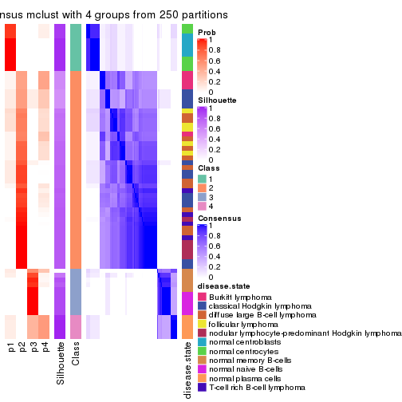</p>

</div>
<div id='tab-SD-mclust-consensus-heatmap-4'>
<pre><code class="r">consensus_heatmap(res, k = 5)
</code></pre>

<p></p>

</div>
<div id='tab-SD-mclust-consensus-heatmap-5'>
<pre><code class="r">consensus_heatmap(res, k = 6)
</code></pre>

<p></p>

</div>
</div>

Heatmaps for the membership of samples in all partitions to see how consistent they are:


<script>
$( function() {
	$( '#tabs-SD-mclust-membership-heatmap' ).tabs();
} );
</script>
<div id='tabs-SD-mclust-membership-heatmap'>
<ul>
<li><a href='#tab-SD-mclust-membership-heatmap-1'>k = 2</a></li>
<li><a href='#tab-SD-mclust-membership-heatmap-2'>k = 3</a></li>
<li><a href='#tab-SD-mclust-membership-heatmap-3'>k = 4</a></li>
<li><a href='#tab-SD-mclust-membership-heatmap-4'>k = 5</a></li>
<li><a href='#tab-SD-mclust-membership-heatmap-5'>k = 6</a></li>
</ul>
<div id='tab-SD-mclust-membership-heatmap-1'>
<pre><code class="r">membership_heatmap(res, k = 2)
</code></pre>

<p></p>

</div>
<div id='tab-SD-mclust-membership-heatmap-2'>
<pre><code class="r">membership_heatmap(res, k = 3)
</code></pre>

<p></p>

</div>
<div id='tab-SD-mclust-membership-heatmap-3'>
<pre><code class="r">membership_heatmap(res, k = 4)
</code></pre>

<p></p>

</div>
<div id='tab-SD-mclust-membership-heatmap-4'>
<pre><code class="r">membership_heatmap(res, k = 5)
</code></pre>

<p></p>

</div>
<div id='tab-SD-mclust-membership-heatmap-5'>
<pre><code class="r">membership_heatmap(res, k = 6)
</code></pre>

<p></p>

</div>
</div>

As soon as we have had the classes for columns, we can look for signatures
which are significantly different between classes which can be candidate marks
for certain classes. Following are the heatmaps for signatures.


Signature heatmaps where rows are scaled:


<script>
$( function() {
	$( '#tabs-SD-mclust-get-signatures' ).tabs();
} );
</script>
<div id='tabs-SD-mclust-get-signatures'>
<ul>
<li><a href='#tab-SD-mclust-get-signatures-1'>k = 2</a></li>
<li><a href='#tab-SD-mclust-get-signatures-2'>k = 3</a></li>
<li><a href='#tab-SD-mclust-get-signatures-3'>k = 4</a></li>
<li><a href='#tab-SD-mclust-get-signatures-4'>k = 5</a></li>
<li><a href='#tab-SD-mclust-get-signatures-5'>k = 6</a></li>
</ul>
<div id='tab-SD-mclust-get-signatures-1'>
<pre><code class="r">get_signatures(res, k = 2)
</code></pre>

<p></p>

</div>
<div id='tab-SD-mclust-get-signatures-2'>
<pre><code class="r">get_signatures(res, k = 3)
</code></pre>

<p></p>

</div>
<div id='tab-SD-mclust-get-signatures-3'>
<pre><code class="r">get_signatures(res, k = 4)
</code></pre>

<pre><code>#&gt; Error in mat[ceiling(1:nr/h_ratio), ceiling(1:nc/w_ratio), drop = FALSE]: subscript out of bounds
</code></pre>

<p></p>

</div>
<div id='tab-SD-mclust-get-signatures-4'>
<pre><code class="r">get_signatures(res, k = 5)
</code></pre>

<p></p>

</div>
<div id='tab-SD-mclust-get-signatures-5'>
<pre><code class="r">get_signatures(res, k = 6)
</code></pre>

<pre><code>#&gt; Error in mat[ceiling(1:nr/h_ratio), ceiling(1:nc/w_ratio), drop = FALSE]: subscript out of bounds
</code></pre>

<p></p>

</div>
</div>


Signature heatmaps where rows are not scaled:


<script>
$( function() {
	$( '#tabs-SD-mclust-get-signatures-no-scale' ).tabs();
} );
</script>
<div id='tabs-SD-mclust-get-signatures-no-scale'>
<ul>
<li><a href='#tab-SD-mclust-get-signatures-no-scale-1'>k = 2</a></li>
<li><a href='#tab-SD-mclust-get-signatures-no-scale-2'>k = 3</a></li>
<li><a href='#tab-SD-mclust-get-signatures-no-scale-3'>k = 4</a></li>
<li><a href='#tab-SD-mclust-get-signatures-no-scale-4'>k = 5</a></li>
<li><a href='#tab-SD-mclust-get-signatures-no-scale-5'>k = 6</a></li>
</ul>
<div id='tab-SD-mclust-get-signatures-no-scale-1'>
<pre><code class="r">get_signatures(res, k = 2, scale_rows = FALSE)
</code></pre>

<p></p>

</div>
<div id='tab-SD-mclust-get-signatures-no-scale-2'>
<pre><code class="r">get_signatures(res, k = 3, scale_rows = FALSE)
</code></pre>

<p></p>

</div>
<div id='tab-SD-mclust-get-signatures-no-scale-3'>
<pre><code class="r">get_signatures(res, k = 4, scale_rows = FALSE)
</code></pre>

<p></p>

</div>
<div id='tab-SD-mclust-get-signatures-no-scale-4'>
<pre><code class="r">get_signatures(res, k = 5, scale_rows = FALSE)
</code></pre>

<p></p>

</div>
<div id='tab-SD-mclust-get-signatures-no-scale-5'>
<pre><code class="r">get_signatures(res, k = 6, scale_rows = FALSE)
</code></pre>

<p></p>

</div>
</div>


Compare the overlap of signatures from different k:

```r
compare_signatures(res)
```


`get_signature()` returns a data frame invisibly. TO get the list of signatures, the function
call should be assigned to a variable explicitly. In following code, if `plot` argument is set
to `FALSE`, no heatmap is plotted while only the differential analysis is performed.

```r
# code only for demonstration
tb = get_signature(res, k = ..., plot = FALSE)
```

An example of the output of `tb` is:

```
#>   which_row         fdr    mean_1    mean_2 scaled_mean_1 scaled_mean_2 km
#> 1        38 0.042760348  8.373488  9.131774    -0.5533452     0.5164555  1
#> 2        40 0.018707592  7.106213  8.469186    -0.6173731     0.5762149  1
#> 3        55 0.019134737 10.221463 11.207825    -0.6159697     0.5749050  1
#> 4        59 0.006059896  5.921854  7.869574    -0.6899429     0.6439467  1
#> 5        60 0.018055526  8.928898 10.211722    -0.6204761     0.5791110  1
#> 6        98 0.009384629 15.714769 14.887706     0.6635654    -0.6193277  2
...
```

The columns in `tb` are:

1. `which_row`: row indices corresponding to the input matrix.
2. `fdr`: FDR for the differential test. 
3. `mean_x`: The mean value in group x.
4. `scaled_mean_x`: The mean value in group x after rows are scaled.
5. `km`: Row groups if k-means clustering is applied to rows.


UMAP plot which shows how samples are separated.


<script>
$( function() {
	$( '#tabs-SD-mclust-dimension-reduction' ).tabs();
} );
</script>
<div id='tabs-SD-mclust-dimension-reduction'>
<ul>
<li><a href='#tab-SD-mclust-dimension-reduction-1'>k = 2</a></li>
<li><a href='#tab-SD-mclust-dimension-reduction-2'>k = 3</a></li>
<li><a href='#tab-SD-mclust-dimension-reduction-3'>k = 4</a></li>
<li><a href='#tab-SD-mclust-dimension-reduction-4'>k = 5</a></li>
<li><a href='#tab-SD-mclust-dimension-reduction-5'>k = 6</a></li>
</ul>
<div id='tab-SD-mclust-dimension-reduction-1'>
<pre><code class="r">dimension_reduction(res, k = 2, method = &quot;UMAP&quot;)
</code></pre>

<p></p>

</div>
<div id='tab-SD-mclust-dimension-reduction-2'>
<pre><code class="r">dimension_reduction(res, k = 3, method = &quot;UMAP&quot;)
</code></pre>

<p></p>

</div>
<div id='tab-SD-mclust-dimension-reduction-3'>
<pre><code class="r">dimension_reduction(res, k = 4, method = &quot;UMAP&quot;)
</code></pre>

<p></p>

</div>
<div id='tab-SD-mclust-dimension-reduction-4'>
<pre><code class="r">dimension_reduction(res, k = 5, method = &quot;UMAP&quot;)
</code></pre>

<p></p>

</div>
<div id='tab-SD-mclust-dimension-reduction-5'>
<pre><code class="r">dimension_reduction(res, k = 6, method = &quot;UMAP&quot;)
</code></pre>

<p></p>

</div>
</div>


Following heatmap shows how subgroups are split when increasing `k`:

```r
collect_classes(res)
```


Test correlation between subgroups and known annotations. If the known
annotation is numeric, one-way ANOVA test is applied, and if the known
annotation is discrete, chi-squared contingency table test is applied.

```r
test_to_known_factors(res)
```

```
#>            n disease.state(p) k
#> SD:mclust 67         1.68e-10 2
#> SD:mclust 61         1.21e-16 3
#> SD:mclust 66         1.17e-26 4
#> SD:mclust 32         2.51e-10 5
#> SD:mclust 66         3.45e-27 6
```


If matrix rows can be associated to genes, consider to use `GO_Enrichment(res,
...)` to perform function enrichment for the signature genes.


 

---------------------------------------------------


### SD:NMF*


The object with results only for a single top-value method and a single partition method 
can be extracted as:

```r
res = res_list["SD", "NMF"]
# you can also extract it by
# res = res_list["SD:NMF"]
```

A summary of `res` and all the functions that can be applied to it:

```r
res
```

```
#> A 'ConsensusPartition' object with k = 2, 3, 4, 5, 6.
#>   On a matrix with 51941 rows and 67 columns.
#>   Top rows (1000, 2000, 3000, 4000, 5000) are extracted by 'SD' method.
#>   Subgroups are detected by 'NMF' method.
#>   Performed in total 1250 partitions by row resampling.
#>   Best k for subgroups seems to be 6.
#> 
#> Following methods can be applied to this 'ConsensusPartition' object:
#>  [1] "cola_report"             "collect_classes"         "collect_plots"          
#>  [4] "collect_stats"           "colnames"                "compare_signatures"     
#>  [7] "consensus_heatmap"       "dimension_reduction"     "functional_enrichment"  
#> [10] "get_anno_col"            "get_anno"                "get_classes"            
#> [13] "get_consensus"           "get_matrix"              "get_membership"         
#> [16] "get_param"               "get_signatures"          "get_stats"              
#> [19] "is_best_k"               "is_stable_k"             "membership_heatmap"     
#> [22] "ncol"                    "nrow"                    "plot_ecdf"              
#> [25] "rownames"                "select_partition_number" "show"                   
#> [28] "suggest_best_k"          "test_to_known_factors"
```

`collect_plots()` function collects all the plots made from `res` for all `k` (number of partitions)
into one single page to provide an easy and fast comparison between different `k`.

```r
collect_plots(res)
```


The plots are:

- The first row: a plot of the ECDF (Empirical cumulative distribution
  function) curves of the consensus matrix for each `k` and the heatmap of
  predicted classes for each `k`.
- The second row: heatmaps of the consensus matrix for each `k`.
- The third row: heatmaps of the membership matrix for each `k`.
- The fouth row: heatmaps of the signatures for each `k`.

All the plots in panels can be made by individual functions and they are
plotted later in this section.

`select_partition_number()` produces several plots showing different
statistics for choosing "optimized" `k`. There are following statistics:

- ECDF curves of the consensus matrix for each `k`;
- 1-PAC. [The PAC
  score](https://en.wikipedia.org/wiki/Consensus_clustering#Over-interpretation_potential_of_consensus_clustering)
  measures the proportion of the ambiguous subgrouping.
- Mean silhouette score.
- Concordance. The mean probability of fiting the consensus class ids in all
  partitions.
- Area increased. Denote $A_k$ as the area under the ECDF curve for current
  `k`, the area increased is defined as $A_k - A_{k-1}$.
- Rand index. The percent of pairs of samples that are both in a same cluster
  or both are not in a same cluster in the partition of k and k-1.
- Jaccard index. The ratio of pairs of samples are both in a same cluster in
  the partition of k and k-1 and the pairs of samples are both in a same
  cluster in the partition k or k-1.

The detailed explanations of these statistics can be found in [the cola
vignette](http://bioconductor.org/packages/devel/bioc/vignettes/cola/inst/doc/cola.html#toc_13).

Generally speaking, lower PAC score, higher mean silhouette score or higher
concordance corresponds to better partition. Rand index and Jaccard index
measure how similar the current partition is compared to partition with `k-1`.
If they are too similar, we won't accept `k` is better than `k-1`.

```r
select_partition_number(res)
```


The numeric values for all these statistics can be obtained by `get_stats()`.

```r
get_stats(res)
```

```
#>   k 1-PAC mean_silhouette concordance area_increased  Rand Jaccard
#> 2 2 1.000           0.968       0.988         0.4810 0.518   0.518
#> 3 3 0.947           0.924       0.969         0.2771 0.811   0.656
#> 4 4 0.671           0.563       0.745         0.1413 0.796   0.554
#> 5 5 0.740           0.779       0.865         0.0931 0.859   0.590
#> 6 6 0.943           0.893       0.953         0.0481 0.954   0.805
```

`suggest_best_k()` suggests the best $k$ based on these statistics. The rules are as follows:

- All $k$ with Jaccard index larger than 0.95 are removed because the increase of
  the partition number does not provides enough extra information. If all $k$ are removed,
  the best $k$ is assigned by `NA`.
- For $k$ with 1-PAC larger than 0.9, the maximal $k$ is taken as the "best k". Other $k$ is called "optional k".
- If it does not fit the second rule. The $k$ with the highest vote of highest
  1-PAC, mean silhouette and concordance is taken as the "best k".

```r
suggest_best_k(res)
```

```
#> [1] 6
#> attr(,"optional")
#> [1] 2 3
```

There is also optional best $k$ = 2 3 that is worth to check.

Following shows the table of the partitions (You need to click the **show/hide
code output** link to see it). The membership matrix (columns with name `p*`)
is inferred by
[`clue::cl_consensus()`](https://www.rdocumentation.org/link/cl_consensus?package=clue)
function with the `SE` method. Basically the value in the membership matrix
represents the probability to belong to a certain group. The finall class
label for an item is determined with the group with highest probability it
belongs to.

In `get_classes()` function, the entropy is calculated from the membership
matrix and the silhouette score is calculated from the consensus matrix.


<script>
$( function() {
	$( '#tabs-SD-NMF-get-classes' ).tabs();
} );
</script>
<div id='tabs-SD-NMF-get-classes'>
<ul>
<li><a href='#tab-SD-NMF-get-classes-1'>k = 2</a></li>
<li><a href='#tab-SD-NMF-get-classes-2'>k = 3</a></li>
<li><a href='#tab-SD-NMF-get-classes-3'>k = 4</a></li>
<li><a href='#tab-SD-NMF-get-classes-4'>k = 5</a></li>
<li><a href='#tab-SD-NMF-get-classes-5'>k = 6</a></li>
</ul>

<div id='tab-SD-NMF-get-classes-1'>
<p><a id='tab-SD-NMF-get-classes-1-a' style='color:#0366d6' href='#'>show/hide code output</a></p>
<pre><code class="r">cbind(get_classes(res, k = 2), get_membership(res, k = 2))
</code></pre>

<pre><code>#&gt;           class entropy silhouette    p1    p2
#&gt; GSM312811     2   0.000     0.9924 0.000 1.000
#&gt; GSM312812     2   0.000     0.9924 0.000 1.000
#&gt; GSM312813     2   0.000     0.9924 0.000 1.000
#&gt; GSM312814     2   0.000     0.9924 0.000 1.000
#&gt; GSM312815     2   0.000     0.9924 0.000 1.000
#&gt; GSM312816     2   0.000     0.9924 0.000 1.000
#&gt; GSM312817     2   0.000     0.9924 0.000 1.000
#&gt; GSM312818     2   0.529     0.8607 0.120 0.880
#&gt; GSM312819     2   0.000     0.9924 0.000 1.000
#&gt; GSM312820     2   0.000     0.9924 0.000 1.000
#&gt; GSM312821     2   0.000     0.9924 0.000 1.000
#&gt; GSM312822     2   0.000     0.9924 0.000 1.000
#&gt; GSM312823     2   0.000     0.9924 0.000 1.000
#&gt; GSM312824     2   0.000     0.9924 0.000 1.000
#&gt; GSM312825     2   0.000     0.9924 0.000 1.000
#&gt; GSM312826     2   0.000     0.9924 0.000 1.000
#&gt; GSM312839     2   0.000     0.9924 0.000 1.000
#&gt; GSM312840     2   0.000     0.9924 0.000 1.000
#&gt; GSM312841     2   0.000     0.9924 0.000 1.000
#&gt; GSM312843     2   0.000     0.9924 0.000 1.000
#&gt; GSM312844     2   0.000     0.9924 0.000 1.000
#&gt; GSM312845     1   1.000    -0.0011 0.504 0.496
#&gt; GSM312846     2   0.671     0.7819 0.176 0.824
#&gt; GSM312847     2   0.000     0.9924 0.000 1.000
#&gt; GSM312848     2   0.000     0.9924 0.000 1.000
#&gt; GSM312849     2   0.000     0.9924 0.000 1.000
#&gt; GSM312851     2   0.000     0.9924 0.000 1.000
#&gt; GSM312853     2   0.000     0.9924 0.000 1.000
#&gt; GSM312854     2   0.000     0.9924 0.000 1.000
#&gt; GSM312856     2   0.000     0.9924 0.000 1.000
#&gt; GSM312857     2   0.000     0.9924 0.000 1.000
#&gt; GSM312858     2   0.000     0.9924 0.000 1.000
#&gt; GSM312859     2   0.000     0.9924 0.000 1.000
#&gt; GSM312860     2   0.000     0.9924 0.000 1.000
#&gt; GSM312861     2   0.000     0.9924 0.000 1.000
#&gt; GSM312862     2   0.000     0.9924 0.000 1.000
#&gt; GSM312863     2   0.000     0.9924 0.000 1.000
#&gt; GSM312864     2   0.000     0.9924 0.000 1.000
#&gt; GSM312865     2   0.000     0.9924 0.000 1.000
#&gt; GSM312867     2   0.000     0.9924 0.000 1.000
#&gt; GSM312868     2   0.000     0.9924 0.000 1.000
#&gt; GSM312869     2   0.000     0.9924 0.000 1.000
#&gt; GSM312870     1   0.000     0.9798 1.000 0.000
#&gt; GSM312872     1   0.000     0.9798 1.000 0.000
#&gt; GSM312874     1   0.000     0.9798 1.000 0.000
#&gt; GSM312875     1   0.000     0.9798 1.000 0.000
#&gt; GSM312876     1   0.000     0.9798 1.000 0.000
#&gt; GSM312877     1   0.000     0.9798 1.000 0.000
#&gt; GSM312879     1   0.000     0.9798 1.000 0.000
#&gt; GSM312882     1   0.000     0.9798 1.000 0.000
#&gt; GSM312883     1   0.000     0.9798 1.000 0.000
#&gt; GSM312886     1   0.000     0.9798 1.000 0.000
#&gt; GSM312887     1   0.000     0.9798 1.000 0.000
#&gt; GSM312890     1   0.000     0.9798 1.000 0.000
#&gt; GSM312893     1   0.000     0.9798 1.000 0.000
#&gt; GSM312894     1   0.000     0.9798 1.000 0.000
#&gt; GSM312895     1   0.000     0.9798 1.000 0.000
#&gt; GSM312937     1   0.000     0.9798 1.000 0.000
#&gt; GSM312938     1   0.000     0.9798 1.000 0.000
#&gt; GSM312939     1   0.000     0.9798 1.000 0.000
#&gt; GSM312940     1   0.000     0.9798 1.000 0.000
#&gt; GSM312941     1   0.000     0.9798 1.000 0.000
#&gt; GSM312942     1   0.000     0.9798 1.000 0.000
#&gt; GSM312943     1   0.000     0.9798 1.000 0.000
#&gt; GSM312944     1   0.000     0.9798 1.000 0.000
#&gt; GSM312945     1   0.000     0.9798 1.000 0.000
#&gt; GSM312946     1   0.000     0.9798 1.000 0.000
</code></pre>

<script>
$('#tab-SD-NMF-get-classes-1-a').parent().next().next().hide();
$('#tab-SD-NMF-get-classes-1-a').click(function(){
  $('#tab-SD-NMF-get-classes-1-a').parent().next().next().toggle();
  return(false);
});
</script>
</div>

<div id='tab-SD-NMF-get-classes-2'>
<p><a id='tab-SD-NMF-get-classes-2-a' style='color:#0366d6' href='#'>show/hide code output</a></p>
<pre><code class="r">cbind(get_classes(res, k = 3), get_membership(res, k = 3))
</code></pre>

<pre><code>#&gt;           class entropy silhouette    p1    p2    p3
#&gt; GSM312811     2  0.0000     0.9791 0.000 1.000 0.000
#&gt; GSM312812     2  0.0000     0.9791 0.000 1.000 0.000
#&gt; GSM312813     2  0.0000     0.9791 0.000 1.000 0.000
#&gt; GSM312814     2  0.0000     0.9791 0.000 1.000 0.000
#&gt; GSM312815     2  0.0000     0.9791 0.000 1.000 0.000
#&gt; GSM312816     2  0.0000     0.9791 0.000 1.000 0.000
#&gt; GSM312817     2  0.0000     0.9791 0.000 1.000 0.000
#&gt; GSM312818     2  0.5678     0.5409 0.000 0.684 0.316
#&gt; GSM312819     2  0.0000     0.9791 0.000 1.000 0.000
#&gt; GSM312820     2  0.0237     0.9762 0.000 0.996 0.004
#&gt; GSM312821     2  0.0237     0.9762 0.000 0.996 0.004
#&gt; GSM312822     2  0.0000     0.9791 0.000 1.000 0.000
#&gt; GSM312823     2  0.0000     0.9791 0.000 1.000 0.000
#&gt; GSM312824     2  0.0000     0.9791 0.000 1.000 0.000
#&gt; GSM312825     2  0.0000     0.9791 0.000 1.000 0.000
#&gt; GSM312826     2  0.0000     0.9791 0.000 1.000 0.000
#&gt; GSM312839     2  0.0000     0.9791 0.000 1.000 0.000
#&gt; GSM312840     2  0.0000     0.9791 0.000 1.000 0.000
#&gt; GSM312841     2  0.0000     0.9791 0.000 1.000 0.000
#&gt; GSM312843     2  0.0000     0.9791 0.000 1.000 0.000
#&gt; GSM312844     2  0.0000     0.9791 0.000 1.000 0.000
#&gt; GSM312845     1  0.0000     0.9481 1.000 0.000 0.000
#&gt; GSM312846     1  0.0000     0.9481 1.000 0.000 0.000
#&gt; GSM312847     1  0.0237     0.9452 0.996 0.004 0.000
#&gt; GSM312848     2  0.3340     0.8643 0.120 0.880 0.000
#&gt; GSM312849     1  0.1031     0.9249 0.976 0.024 0.000
#&gt; GSM312851     2  0.0000     0.9791 0.000 1.000 0.000
#&gt; GSM312853     2  0.0000     0.9791 0.000 1.000 0.000
#&gt; GSM312854     2  0.2796     0.8951 0.092 0.908 0.000
#&gt; GSM312856     2  0.0000     0.9791 0.000 1.000 0.000
#&gt; GSM312857     2  0.1163     0.9557 0.028 0.972 0.000
#&gt; GSM312858     2  0.3619     0.8452 0.136 0.864 0.000
#&gt; GSM312859     2  0.0000     0.9791 0.000 1.000 0.000
#&gt; GSM312860     2  0.0000     0.9791 0.000 1.000 0.000
#&gt; GSM312861     2  0.0000     0.9791 0.000 1.000 0.000
#&gt; GSM312862     2  0.0000     0.9791 0.000 1.000 0.000
#&gt; GSM312863     2  0.0000     0.9791 0.000 1.000 0.000
#&gt; GSM312864     2  0.0000     0.9791 0.000 1.000 0.000
#&gt; GSM312865     1  0.0237     0.9452 0.996 0.004 0.000
#&gt; GSM312867     1  0.0000     0.9481 1.000 0.000 0.000
#&gt; GSM312868     2  0.0000     0.9791 0.000 1.000 0.000
#&gt; GSM312869     2  0.0000     0.9791 0.000 1.000 0.000
#&gt; GSM312870     3  0.0000     0.9527 0.000 0.000 1.000
#&gt; GSM312872     3  0.0000     0.9527 0.000 0.000 1.000
#&gt; GSM312874     3  0.0000     0.9527 0.000 0.000 1.000
#&gt; GSM312875     3  0.0000     0.9527 0.000 0.000 1.000
#&gt; GSM312876     3  0.0000     0.9527 0.000 0.000 1.000
#&gt; GSM312877     3  0.0592     0.9448 0.012 0.000 0.988
#&gt; GSM312879     3  0.0000     0.9527 0.000 0.000 1.000
#&gt; GSM312882     3  0.0000     0.9527 0.000 0.000 1.000
#&gt; GSM312883     3  0.0000     0.9527 0.000 0.000 1.000
#&gt; GSM312886     3  0.0000     0.9527 0.000 0.000 1.000
#&gt; GSM312887     3  0.6252     0.1914 0.444 0.000 0.556
#&gt; GSM312890     1  0.0000     0.9481 1.000 0.000 0.000
#&gt; GSM312893     1  0.0000     0.9481 1.000 0.000 0.000
#&gt; GSM312894     1  0.0000     0.9481 1.000 0.000 0.000
#&gt; GSM312895     1  0.0000     0.9481 1.000 0.000 0.000
#&gt; GSM312937     1  0.0000     0.9481 1.000 0.000 0.000
#&gt; GSM312938     1  0.0000     0.9481 1.000 0.000 0.000
#&gt; GSM312939     1  0.0000     0.9481 1.000 0.000 0.000
#&gt; GSM312940     1  0.0000     0.9481 1.000 0.000 0.000
#&gt; GSM312941     1  0.0000     0.9481 1.000 0.000 0.000
#&gt; GSM312942     3  0.1529     0.9195 0.040 0.000 0.960
#&gt; GSM312943     1  0.4235     0.7821 0.824 0.000 0.176
#&gt; GSM312944     1  0.2625     0.8848 0.916 0.000 0.084
#&gt; GSM312945     1  0.2878     0.8743 0.904 0.000 0.096
#&gt; GSM312946     1  0.6305     0.0776 0.516 0.000 0.484
</code></pre>

<script>
$('#tab-SD-NMF-get-classes-2-a').parent().next().next().hide();
$('#tab-SD-NMF-get-classes-2-a').click(function(){
  $('#tab-SD-NMF-get-classes-2-a').parent().next().next().toggle();
  return(false);
});
</script>
</div>

<div id='tab-SD-NMF-get-classes-3'>
<p><a id='tab-SD-NMF-get-classes-3-a' style='color:#0366d6' href='#'>show/hide code output</a></p>
<pre><code class="r">cbind(get_classes(res, k = 4), get_membership(res, k = 4))
</code></pre>

<pre><code>#&gt;           class entropy silhouette    p1    p2    p3    p4
#&gt; GSM312811     2  0.0707     0.8837 0.000 0.980 0.000 0.020
#&gt; GSM312812     2  0.0000     0.8906 0.000 1.000 0.000 0.000
#&gt; GSM312813     2  0.0000     0.8906 0.000 1.000 0.000 0.000
#&gt; GSM312814     2  0.1118     0.8765 0.000 0.964 0.000 0.036
#&gt; GSM312815     2  0.0336     0.8876 0.000 0.992 0.000 0.008
#&gt; GSM312816     2  0.3447     0.8026 0.020 0.852 0.000 0.128
#&gt; GSM312817     2  0.0000     0.8906 0.000 1.000 0.000 0.000
#&gt; GSM312818     2  0.7870     0.2171 0.012 0.452 0.352 0.184
#&gt; GSM312819     2  0.0000     0.8906 0.000 1.000 0.000 0.000
#&gt; GSM312820     2  0.4646     0.7549 0.028 0.780 0.008 0.184
#&gt; GSM312821     2  0.5206     0.7320 0.012 0.756 0.048 0.184
#&gt; GSM312822     2  0.2081     0.8480 0.000 0.916 0.000 0.084
#&gt; GSM312823     2  0.0000     0.8906 0.000 1.000 0.000 0.000
#&gt; GSM312824     2  0.0000     0.8906 0.000 1.000 0.000 0.000
#&gt; GSM312825     2  0.1211     0.8653 0.000 0.960 0.000 0.040
#&gt; GSM312826     2  0.0000     0.8906 0.000 1.000 0.000 0.000
#&gt; GSM312839     2  0.0336     0.8876 0.000 0.992 0.000 0.008
#&gt; GSM312840     2  0.0000     0.8906 0.000 1.000 0.000 0.000
#&gt; GSM312841     2  0.0000     0.8906 0.000 1.000 0.000 0.000
#&gt; GSM312843     2  0.6706     0.4770 0.288 0.588 0.000 0.124
#&gt; GSM312844     2  0.0000     0.8906 0.000 1.000 0.000 0.000
#&gt; GSM312845     1  0.4477     0.2064 0.688 0.000 0.000 0.312
#&gt; GSM312846     1  0.5070     0.1876 0.580 0.004 0.000 0.416
#&gt; GSM312847     1  0.2089     0.2316 0.932 0.020 0.000 0.048
#&gt; GSM312848     1  0.4855     0.0763 0.644 0.352 0.000 0.004
#&gt; GSM312849     1  0.7423     0.0444 0.428 0.168 0.000 0.404
#&gt; GSM312851     1  0.7081    -0.1989 0.452 0.424 0.000 0.124
#&gt; GSM312853     1  0.7078    -0.1901 0.456 0.420 0.000 0.124
#&gt; GSM312854     1  0.6726     0.0862 0.584 0.292 0.000 0.124
#&gt; GSM312856     1  0.7078    -0.1901 0.456 0.420 0.000 0.124
#&gt; GSM312857     1  0.7042    -0.1231 0.488 0.388 0.000 0.124
#&gt; GSM312858     1  0.5250    -0.1300 0.552 0.440 0.000 0.008
#&gt; GSM312859     2  0.0000     0.8906 0.000 1.000 0.000 0.000
#&gt; GSM312860     2  0.0336     0.8876 0.000 0.992 0.000 0.008
#&gt; GSM312861     2  0.2921     0.7778 0.140 0.860 0.000 0.000
#&gt; GSM312862     2  0.0779     0.8832 0.004 0.980 0.000 0.016
#&gt; GSM312863     1  0.7081    -0.1989 0.452 0.424 0.000 0.124
#&gt; GSM312864     2  0.6377     0.5409 0.256 0.632 0.000 0.112
#&gt; GSM312865     1  0.1042     0.2325 0.972 0.020 0.000 0.008
#&gt; GSM312867     1  0.4522     0.2068 0.680 0.000 0.000 0.320
#&gt; GSM312868     2  0.4955     0.3241 0.444 0.556 0.000 0.000
#&gt; GSM312869     2  0.0000     0.8906 0.000 1.000 0.000 0.000
#&gt; GSM312870     3  0.0000     0.9595 0.000 0.000 1.000 0.000
#&gt; GSM312872     3  0.0000     0.9595 0.000 0.000 1.000 0.000
#&gt; GSM312874     3  0.0188     0.9578 0.004 0.000 0.996 0.000
#&gt; GSM312875     3  0.0188     0.9605 0.000 0.000 0.996 0.004
#&gt; GSM312876     3  0.0188     0.9605 0.000 0.000 0.996 0.004
#&gt; GSM312877     3  0.4134     0.5333 0.000 0.000 0.740 0.260
#&gt; GSM312879     3  0.0188     0.9605 0.000 0.000 0.996 0.004
#&gt; GSM312882     3  0.0188     0.9605 0.000 0.000 0.996 0.004
#&gt; GSM312883     3  0.0336     0.9574 0.000 0.000 0.992 0.008
#&gt; GSM312886     3  0.0336     0.9585 0.000 0.000 0.992 0.008
#&gt; GSM312887     1  0.7743    -0.2363 0.436 0.000 0.308 0.256
#&gt; GSM312890     1  0.4972     0.1681 0.544 0.000 0.000 0.456
#&gt; GSM312893     1  0.4972     0.1681 0.544 0.000 0.000 0.456
#&gt; GSM312894     1  0.4972     0.1681 0.544 0.000 0.000 0.456
#&gt; GSM312895     1  0.4972     0.1681 0.544 0.000 0.000 0.456
#&gt; GSM312937     1  0.4972     0.1681 0.544 0.000 0.000 0.456
#&gt; GSM312938     1  0.5060     0.1776 0.584 0.000 0.004 0.412
#&gt; GSM312939     1  0.4972     0.1681 0.544 0.000 0.000 0.456
#&gt; GSM312940     1  0.4972     0.1681 0.544 0.000 0.000 0.456
#&gt; GSM312941     1  0.4972     0.1681 0.544 0.000 0.000 0.456
#&gt; GSM312942     4  0.3764     0.8646 0.000 0.000 0.216 0.784
#&gt; GSM312943     4  0.2999     0.9553 0.004 0.000 0.132 0.864
#&gt; GSM312944     4  0.3217     0.9530 0.012 0.000 0.128 0.860
#&gt; GSM312945     4  0.3217     0.9530 0.012 0.000 0.128 0.860
#&gt; GSM312946     4  0.3157     0.9504 0.004 0.000 0.144 0.852
</code></pre>

<script>
$('#tab-SD-NMF-get-classes-3-a').parent().next().next().hide();
$('#tab-SD-NMF-get-classes-3-a').click(function(){
  $('#tab-SD-NMF-get-classes-3-a').parent().next().next().toggle();
  return(false);
});
</script>
</div>

<div id='tab-SD-NMF-get-classes-4'>
<p><a id='tab-SD-NMF-get-classes-4-a' style='color:#0366d6' href='#'>show/hide code output</a></p>
<pre><code class="r">cbind(get_classes(res, k = 5), get_membership(res, k = 5))
</code></pre>

<pre><code>#&gt;           class entropy silhouette    p1    p2    p3    p4    p5
#&gt; GSM312811     2  0.1725   0.858409 0.000 0.936 0.000 0.020 0.044
#&gt; GSM312812     2  0.0162   0.892225 0.000 0.996 0.000 0.000 0.004
#&gt; GSM312813     2  0.0162   0.892225 0.000 0.996 0.000 0.000 0.004
#&gt; GSM312814     2  0.3359   0.790765 0.000 0.844 0.000 0.072 0.084
#&gt; GSM312815     2  0.0671   0.883587 0.000 0.980 0.000 0.004 0.016
#&gt; GSM312816     2  0.5025   0.651907 0.000 0.704 0.000 0.124 0.172
#&gt; GSM312817     2  0.0162   0.891304 0.000 0.996 0.000 0.004 0.000
#&gt; GSM312818     5  0.8218  -0.149431 0.000 0.320 0.136 0.196 0.348
#&gt; GSM312819     2  0.0162   0.891304 0.000 0.996 0.000 0.004 0.000
#&gt; GSM312820     2  0.6577   0.364832 0.000 0.500 0.012 0.160 0.328
#&gt; GSM312821     2  0.6772   0.326042 0.000 0.480 0.016 0.176 0.328
#&gt; GSM312822     2  0.3691   0.771404 0.000 0.820 0.000 0.076 0.104
#&gt; GSM312823     2  0.0000   0.891978 0.000 1.000 0.000 0.000 0.000
#&gt; GSM312824     2  0.0162   0.892225 0.000 0.996 0.000 0.000 0.004
#&gt; GSM312825     2  0.0162   0.892225 0.000 0.996 0.000 0.000 0.004
#&gt; GSM312826     2  0.0162   0.892225 0.000 0.996 0.000 0.000 0.004
#&gt; GSM312839     2  0.0162   0.892225 0.000 0.996 0.000 0.000 0.004
#&gt; GSM312840     2  0.0000   0.891978 0.000 1.000 0.000 0.000 0.000
#&gt; GSM312841     2  0.0000   0.891978 0.000 1.000 0.000 0.000 0.000
#&gt; GSM312843     4  0.3055   0.814489 0.000 0.144 0.000 0.840 0.016
#&gt; GSM312844     2  0.0000   0.891978 0.000 1.000 0.000 0.000 0.000
#&gt; GSM312845     4  0.4774   0.274222 0.424 0.000 0.020 0.556 0.000
#&gt; GSM312846     1  0.1124   0.842682 0.960 0.004 0.000 0.036 0.000
#&gt; GSM312847     4  0.4166   0.473788 0.348 0.004 0.000 0.648 0.000
#&gt; GSM312848     4  0.4035   0.810577 0.060 0.156 0.000 0.784 0.000
#&gt; GSM312849     1  0.5379   0.372794 0.632 0.300 0.000 0.056 0.012
#&gt; GSM312851     4  0.3410   0.799919 0.000 0.092 0.000 0.840 0.068
#&gt; GSM312853     4  0.2193   0.834632 0.000 0.092 0.000 0.900 0.008
#&gt; GSM312854     4  0.2077   0.834108 0.008 0.084 0.000 0.908 0.000
#&gt; GSM312856     4  0.2068   0.835123 0.000 0.092 0.000 0.904 0.004
#&gt; GSM312857     4  0.2237   0.834230 0.008 0.084 0.000 0.904 0.004
#&gt; GSM312858     4  0.4113   0.810252 0.076 0.140 0.000 0.784 0.000
#&gt; GSM312859     2  0.0290   0.890474 0.000 0.992 0.000 0.000 0.008
#&gt; GSM312860     2  0.0703   0.879858 0.000 0.976 0.000 0.000 0.024
#&gt; GSM312861     4  0.4182   0.531446 0.000 0.400 0.000 0.600 0.000
#&gt; GSM312862     2  0.5165   0.095796 0.000 0.512 0.000 0.040 0.448
#&gt; GSM312863     4  0.1908   0.835517 0.000 0.092 0.000 0.908 0.000
#&gt; GSM312864     4  0.3048   0.806162 0.000 0.176 0.000 0.820 0.004
#&gt; GSM312865     4  0.3650   0.724502 0.176 0.028 0.000 0.796 0.000
#&gt; GSM312867     1  0.4533   0.000552 0.544 0.008 0.000 0.448 0.000
#&gt; GSM312868     4  0.3210   0.787657 0.000 0.212 0.000 0.788 0.000
#&gt; GSM312869     2  0.0162   0.892225 0.000 0.996 0.000 0.000 0.004
#&gt; GSM312870     3  0.0404   0.969037 0.000 0.000 0.988 0.000 0.012
#&gt; GSM312872     3  0.0290   0.970600 0.000 0.000 0.992 0.000 0.008
#&gt; GSM312874     3  0.0510   0.967212 0.000 0.000 0.984 0.000 0.016
#&gt; GSM312875     3  0.0404   0.969412 0.000 0.000 0.988 0.000 0.012
#&gt; GSM312876     3  0.0290   0.970238 0.000 0.000 0.992 0.000 0.008
#&gt; GSM312877     3  0.2727   0.848426 0.016 0.000 0.868 0.000 0.116
#&gt; GSM312879     3  0.0404   0.971197 0.000 0.000 0.988 0.000 0.012
#&gt; GSM312882     3  0.0703   0.964402 0.000 0.000 0.976 0.000 0.024
#&gt; GSM312883     3  0.0703   0.964402 0.000 0.000 0.976 0.000 0.024
#&gt; GSM312886     3  0.0404   0.969754 0.000 0.000 0.988 0.000 0.012
#&gt; GSM312887     1  0.3165   0.709313 0.848 0.000 0.116 0.000 0.036
#&gt; GSM312890     1  0.0000   0.874308 1.000 0.000 0.000 0.000 0.000
#&gt; GSM312893     1  0.0000   0.874308 1.000 0.000 0.000 0.000 0.000
#&gt; GSM312894     1  0.0404   0.865185 0.988 0.000 0.012 0.000 0.000
#&gt; GSM312895     1  0.0000   0.874308 1.000 0.000 0.000 0.000 0.000
#&gt; GSM312937     1  0.0000   0.874308 1.000 0.000 0.000 0.000 0.000
#&gt; GSM312938     1  0.0162   0.872061 0.996 0.000 0.000 0.004 0.000
#&gt; GSM312939     1  0.0000   0.874308 1.000 0.000 0.000 0.000 0.000
#&gt; GSM312940     1  0.0000   0.874308 1.000 0.000 0.000 0.000 0.000
#&gt; GSM312941     1  0.0000   0.874308 1.000 0.000 0.000 0.000 0.000
#&gt; GSM312942     5  0.5177   0.767501 0.180 0.000 0.132 0.000 0.688
#&gt; GSM312943     5  0.5284   0.779519 0.216 0.000 0.116 0.000 0.668
#&gt; GSM312944     5  0.5337   0.767663 0.228 0.000 0.100 0.004 0.668
#&gt; GSM312945     5  0.5295   0.775544 0.224 0.000 0.112 0.000 0.664
#&gt; GSM312946     5  0.5295   0.779199 0.200 0.000 0.128 0.000 0.672
</code></pre>

<script>
$('#tab-SD-NMF-get-classes-4-a').parent().next().next().hide();
$('#tab-SD-NMF-get-classes-4-a').click(function(){
  $('#tab-SD-NMF-get-classes-4-a').parent().next().next().toggle();
  return(false);
});
</script>
</div>

<div id='tab-SD-NMF-get-classes-5'>
<p><a id='tab-SD-NMF-get-classes-5-a' style='color:#0366d6' href='#'>show/hide code output</a></p>
<pre><code class="r">cbind(get_classes(res, k = 6), get_membership(res, k = 6))
</code></pre>

<pre><code>#&gt;           class entropy silhouette    p1    p2    p3    p4    p5    p6
#&gt; GSM312811     2  0.1765      0.841 0.000 0.904 0.000 0.000 0.096 0.000
#&gt; GSM312812     2  0.0000      0.931 0.000 1.000 0.000 0.000 0.000 0.000
#&gt; GSM312813     2  0.0000      0.931 0.000 1.000 0.000 0.000 0.000 0.000
#&gt; GSM312814     2  0.2697      0.713 0.000 0.812 0.000 0.000 0.188 0.000
#&gt; GSM312815     2  0.0865      0.904 0.000 0.964 0.000 0.000 0.036 0.000
#&gt; GSM312816     2  0.3756      0.145 0.000 0.600 0.000 0.000 0.400 0.000
#&gt; GSM312817     2  0.0146      0.929 0.000 0.996 0.000 0.000 0.004 0.000
#&gt; GSM312818     5  0.1461      0.650 0.000 0.044 0.016 0.000 0.940 0.000
#&gt; GSM312819     2  0.0291      0.928 0.000 0.992 0.000 0.000 0.004 0.004
#&gt; GSM312820     5  0.3244      0.803 0.000 0.268 0.000 0.000 0.732 0.000
#&gt; GSM312821     5  0.3076      0.828 0.000 0.240 0.000 0.000 0.760 0.000
#&gt; GSM312822     2  0.3126      0.601 0.000 0.752 0.000 0.000 0.248 0.000
#&gt; GSM312823     2  0.0146      0.931 0.000 0.996 0.000 0.000 0.004 0.000
#&gt; GSM312824     2  0.0146      0.931 0.000 0.996 0.000 0.000 0.004 0.000
#&gt; GSM312825     2  0.0146      0.931 0.000 0.996 0.000 0.000 0.004 0.000
#&gt; GSM312826     2  0.0146      0.931 0.000 0.996 0.000 0.000 0.004 0.000
#&gt; GSM312839     2  0.0000      0.931 0.000 1.000 0.000 0.000 0.000 0.000
#&gt; GSM312840     2  0.0000      0.931 0.000 1.000 0.000 0.000 0.000 0.000
#&gt; GSM312841     2  0.0000      0.931 0.000 1.000 0.000 0.000 0.000 0.000
#&gt; GSM312843     4  0.0000      0.929 0.000 0.000 0.000 1.000 0.000 0.000
#&gt; GSM312844     2  0.0000      0.931 0.000 1.000 0.000 0.000 0.000 0.000
#&gt; GSM312845     4  0.4136      0.662 0.192 0.000 0.076 0.732 0.000 0.000
#&gt; GSM312846     1  0.0146      0.964 0.996 0.000 0.000 0.000 0.004 0.000
#&gt; GSM312847     4  0.0260      0.925 0.008 0.000 0.000 0.992 0.000 0.000
#&gt; GSM312848     4  0.0405      0.923 0.000 0.008 0.000 0.988 0.004 0.000
#&gt; GSM312849     1  0.3990      0.592 0.736 0.232 0.004 0.012 0.012 0.004
#&gt; GSM312851     4  0.1610      0.863 0.000 0.000 0.000 0.916 0.084 0.000
#&gt; GSM312853     4  0.0000      0.929 0.000 0.000 0.000 1.000 0.000 0.000
#&gt; GSM312854     4  0.0000      0.929 0.000 0.000 0.000 1.000 0.000 0.000
#&gt; GSM312856     4  0.0000      0.929 0.000 0.000 0.000 1.000 0.000 0.000
#&gt; GSM312857     4  0.0000      0.929 0.000 0.000 0.000 1.000 0.000 0.000
#&gt; GSM312858     4  0.0000      0.929 0.000 0.000 0.000 1.000 0.000 0.000
#&gt; GSM312859     2  0.0146      0.931 0.000 0.996 0.000 0.000 0.004 0.000
#&gt; GSM312860     2  0.0291      0.928 0.000 0.992 0.000 0.000 0.004 0.004
#&gt; GSM312861     4  0.1700      0.854 0.000 0.080 0.000 0.916 0.004 0.000
#&gt; GSM312862     6  0.2445      0.800 0.000 0.108 0.000 0.020 0.000 0.872
#&gt; GSM312863     4  0.0000      0.929 0.000 0.000 0.000 1.000 0.000 0.000
#&gt; GSM312864     4  0.1010      0.902 0.000 0.036 0.000 0.960 0.004 0.000
#&gt; GSM312865     4  0.0000      0.929 0.000 0.000 0.000 1.000 0.000 0.000
#&gt; GSM312867     4  0.4018      0.307 0.412 0.008 0.000 0.580 0.000 0.000
#&gt; GSM312868     4  0.0000      0.929 0.000 0.000 0.000 1.000 0.000 0.000
#&gt; GSM312869     2  0.0146      0.931 0.000 0.996 0.000 0.000 0.004 0.000
#&gt; GSM312870     3  0.0865      0.975 0.000 0.000 0.964 0.000 0.036 0.000
#&gt; GSM312872     3  0.0632      0.979 0.000 0.000 0.976 0.000 0.024 0.000
#&gt; GSM312874     3  0.1075      0.971 0.000 0.000 0.952 0.000 0.048 0.000
#&gt; GSM312875     3  0.0146      0.979 0.000 0.000 0.996 0.000 0.004 0.000
#&gt; GSM312876     3  0.0000      0.980 0.000 0.000 1.000 0.000 0.000 0.000
#&gt; GSM312877     3  0.0458      0.975 0.000 0.000 0.984 0.000 0.016 0.000
#&gt; GSM312879     3  0.0632      0.979 0.000 0.000 0.976 0.000 0.024 0.000
#&gt; GSM312882     3  0.0260      0.978 0.000 0.000 0.992 0.000 0.008 0.000
#&gt; GSM312883     3  0.0458      0.975 0.000 0.000 0.984 0.000 0.016 0.000
#&gt; GSM312886     3  0.1075      0.970 0.000 0.000 0.952 0.000 0.048 0.000
#&gt; GSM312887     1  0.0547      0.951 0.980 0.000 0.000 0.000 0.020 0.000
#&gt; GSM312890     1  0.0000      0.967 1.000 0.000 0.000 0.000 0.000 0.000
#&gt; GSM312893     1  0.0000      0.967 1.000 0.000 0.000 0.000 0.000 0.000
#&gt; GSM312894     1  0.0000      0.967 1.000 0.000 0.000 0.000 0.000 0.000
#&gt; GSM312895     1  0.0000      0.967 1.000 0.000 0.000 0.000 0.000 0.000
#&gt; GSM312937     1  0.0000      0.967 1.000 0.000 0.000 0.000 0.000 0.000
#&gt; GSM312938     1  0.0000      0.967 1.000 0.000 0.000 0.000 0.000 0.000
#&gt; GSM312939     1  0.0000      0.967 1.000 0.000 0.000 0.000 0.000 0.000
#&gt; GSM312940     1  0.0000      0.967 1.000 0.000 0.000 0.000 0.000 0.000
#&gt; GSM312941     1  0.0000      0.967 1.000 0.000 0.000 0.000 0.000 0.000
#&gt; GSM312942     6  0.0146      0.964 0.004 0.000 0.000 0.000 0.000 0.996
#&gt; GSM312943     6  0.0146      0.964 0.004 0.000 0.000 0.000 0.000 0.996
#&gt; GSM312944     6  0.0146      0.964 0.004 0.000 0.000 0.000 0.000 0.996
#&gt; GSM312945     6  0.0146      0.964 0.004 0.000 0.000 0.000 0.000 0.996
#&gt; GSM312946     6  0.0146      0.964 0.004 0.000 0.000 0.000 0.000 0.996
</code></pre>

<script>
$('#tab-SD-NMF-get-classes-5-a').parent().next().next().hide();
$('#tab-SD-NMF-get-classes-5-a').click(function(){
  $('#tab-SD-NMF-get-classes-5-a').parent().next().next().toggle();
  return(false);
});
</script>
</div>
</div>

Heatmaps for the consensus matrix. It visualizes the probability of two
samples to be in a same group.


<script>
$( function() {
	$( '#tabs-SD-NMF-consensus-heatmap' ).tabs();
} );
</script>
<div id='tabs-SD-NMF-consensus-heatmap'>
<ul>
<li><a href='#tab-SD-NMF-consensus-heatmap-1'>k = 2</a></li>
<li><a href='#tab-SD-NMF-consensus-heatmap-2'>k = 3</a></li>
<li><a href='#tab-SD-NMF-consensus-heatmap-3'>k = 4</a></li>
<li><a href='#tab-SD-NMF-consensus-heatmap-4'>k = 5</a></li>
<li><a href='#tab-SD-NMF-consensus-heatmap-5'>k = 6</a></li>
</ul>
<div id='tab-SD-NMF-consensus-heatmap-1'>
<pre><code class="r">consensus_heatmap(res, k = 2)
</code></pre>

<p></p>

</div>
<div id='tab-SD-NMF-consensus-heatmap-2'>
<pre><code class="r">consensus_heatmap(res, k = 3)
</code></pre>

<p></p>

</div>
<div id='tab-SD-NMF-consensus-heatmap-3'>
<pre><code class="r">consensus_heatmap(res, k = 4)
</code></pre>

<p></p>

</div>
<div id='tab-SD-NMF-consensus-heatmap-4'>
<pre><code class="r">consensus_heatmap(res, k = 5)
</code></pre>

<p></p>

</div>
<div id='tab-SD-NMF-consensus-heatmap-5'>
<pre><code class="r">consensus_heatmap(res, k = 6)
</code></pre>

<p></p>

</div>
</div>

Heatmaps for the membership of samples in all partitions to see how consistent they are:


<script>
$( function() {
	$( '#tabs-SD-NMF-membership-heatmap' ).tabs();
} );
</script>
<div id='tabs-SD-NMF-membership-heatmap'>
<ul>
<li><a href='#tab-SD-NMF-membership-heatmap-1'>k = 2</a></li>
<li><a href='#tab-SD-NMF-membership-heatmap-2'>k = 3</a></li>
<li><a href='#tab-SD-NMF-membership-heatmap-3'>k = 4</a></li>
<li><a href='#tab-SD-NMF-membership-heatmap-4'>k = 5</a></li>
<li><a href='#tab-SD-NMF-membership-heatmap-5'>k = 6</a></li>
</ul>
<div id='tab-SD-NMF-membership-heatmap-1'>
<pre><code class="r">membership_heatmap(res, k = 2)
</code></pre>

<p></p>

</div>
<div id='tab-SD-NMF-membership-heatmap-2'>
<pre><code class="r">membership_heatmap(res, k = 3)
</code></pre>

<p></p>

</div>
<div id='tab-SD-NMF-membership-heatmap-3'>
<pre><code class="r">membership_heatmap(res, k = 4)
</code></pre>

<p></p>

</div>
<div id='tab-SD-NMF-membership-heatmap-4'>
<pre><code class="r">membership_heatmap(res, k = 5)
</code></pre>

<p></p>

</div>
<div id='tab-SD-NMF-membership-heatmap-5'>
<pre><code class="r">membership_heatmap(res, k = 6)
</code></pre>

<p></p>

</div>
</div>

As soon as we have had the classes for columns, we can look for signatures
which are significantly different between classes which can be candidate marks
for certain classes. Following are the heatmaps for signatures.


Signature heatmaps where rows are scaled:


<script>
$( function() {
	$( '#tabs-SD-NMF-get-signatures' ).tabs();
} );
</script>
<div id='tabs-SD-NMF-get-signatures'>
<ul>
<li><a href='#tab-SD-NMF-get-signatures-1'>k = 2</a></li>
<li><a href='#tab-SD-NMF-get-signatures-2'>k = 3</a></li>
<li><a href='#tab-SD-NMF-get-signatures-3'>k = 4</a></li>
<li><a href='#tab-SD-NMF-get-signatures-4'>k = 5</a></li>
<li><a href='#tab-SD-NMF-get-signatures-5'>k = 6</a></li>
</ul>
<div id='tab-SD-NMF-get-signatures-1'>
<pre><code class="r">get_signatures(res, k = 2)
</code></pre>

<pre><code>#&gt; Error in mat[ceiling(1:nr/h_ratio), ceiling(1:nc/w_ratio), drop = FALSE]: subscript out of bounds
</code></pre>

<p></p>

</div>
<div id='tab-SD-NMF-get-signatures-2'>
<pre><code class="r">get_signatures(res, k = 3)
</code></pre>

<p>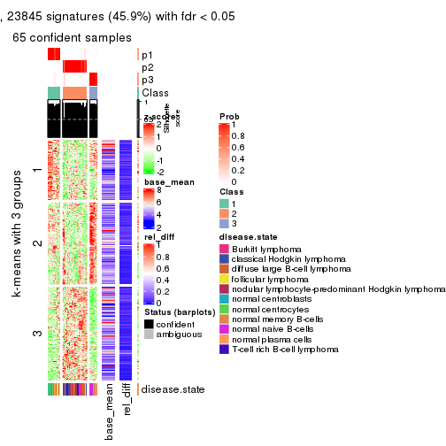</p>

</div>
<div id='tab-SD-NMF-get-signatures-3'>
<pre><code class="r">get_signatures(res, k = 4)
</code></pre>

<p>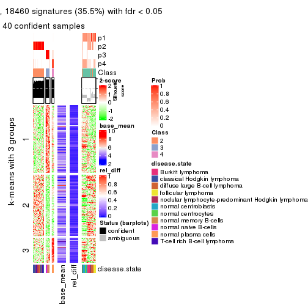</p>

</div>
<div id='tab-SD-NMF-get-signatures-4'>
<pre><code class="r">get_signatures(res, k = 5)
</code></pre>

<p></p>

</div>
<div id='tab-SD-NMF-get-signatures-5'>
<pre><code class="r">get_signatures(res, k = 6)
</code></pre>

<p></p>

</div>
</div>


Signature heatmaps where rows are not scaled:


<script>
$( function() {
	$( '#tabs-SD-NMF-get-signatures-no-scale' ).tabs();
} );
</script>
<div id='tabs-SD-NMF-get-signatures-no-scale'>
<ul>
<li><a href='#tab-SD-NMF-get-signatures-no-scale-1'>k = 2</a></li>
<li><a href='#tab-SD-NMF-get-signatures-no-scale-2'>k = 3</a></li>
<li><a href='#tab-SD-NMF-get-signatures-no-scale-3'>k = 4</a></li>
<li><a href='#tab-SD-NMF-get-signatures-no-scale-4'>k = 5</a></li>
<li><a href='#tab-SD-NMF-get-signatures-no-scale-5'>k = 6</a></li>
</ul>
<div id='tab-SD-NMF-get-signatures-no-scale-1'>
<pre><code class="r">get_signatures(res, k = 2, scale_rows = FALSE)
</code></pre>

<p></p>

</div>
<div id='tab-SD-NMF-get-signatures-no-scale-2'>
<pre><code class="r">get_signatures(res, k = 3, scale_rows = FALSE)
</code></pre>

<p></p>

</div>
<div id='tab-SD-NMF-get-signatures-no-scale-3'>
<pre><code class="r">get_signatures(res, k = 4, scale_rows = FALSE)
</code></pre>

<p>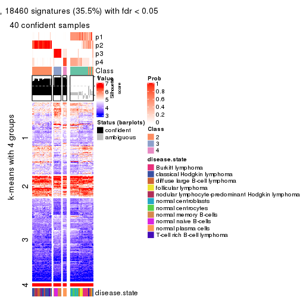</p>

</div>
<div id='tab-SD-NMF-get-signatures-no-scale-4'>
<pre><code class="r">get_signatures(res, k = 5, scale_rows = FALSE)
</code></pre>

<p></p>

</div>
<div id='tab-SD-NMF-get-signatures-no-scale-5'>
<pre><code class="r">get_signatures(res, k = 6, scale_rows = FALSE)
</code></pre>

<p></p>

</div>
</div>


Compare the overlap of signatures from different k:

```r
compare_signatures(res)
```


`get_signature()` returns a data frame invisibly. TO get the list of signatures, the function
call should be assigned to a variable explicitly. In following code, if `plot` argument is set
to `FALSE`, no heatmap is plotted while only the differential analysis is performed.

```r
# code only for demonstration
tb = get_signature(res, k = ..., plot = FALSE)
```

An example of the output of `tb` is:

```
#>   which_row         fdr    mean_1    mean_2 scaled_mean_1 scaled_mean_2 km
#> 1        38 0.042760348  8.373488  9.131774    -0.5533452     0.5164555  1
#> 2        40 0.018707592  7.106213  8.469186    -0.6173731     0.5762149  1
#> 3        55 0.019134737 10.221463 11.207825    -0.6159697     0.5749050  1
#> 4        59 0.006059896  5.921854  7.869574    -0.6899429     0.6439467  1
#> 5        60 0.018055526  8.928898 10.211722    -0.6204761     0.5791110  1
#> 6        98 0.009384629 15.714769 14.887706     0.6635654    -0.6193277  2
...
```

The columns in `tb` are:

1. `which_row`: row indices corresponding to the input matrix.
2. `fdr`: FDR for the differential test. 
3. `mean_x`: The mean value in group x.
4. `scaled_mean_x`: The mean value in group x after rows are scaled.
5. `km`: Row groups if k-means clustering is applied to rows.


UMAP plot which shows how samples are separated.


<script>
$( function() {
	$( '#tabs-SD-NMF-dimension-reduction' ).tabs();
} );
</script>
<div id='tabs-SD-NMF-dimension-reduction'>
<ul>
<li><a href='#tab-SD-NMF-dimension-reduction-1'>k = 2</a></li>
<li><a href='#tab-SD-NMF-dimension-reduction-2'>k = 3</a></li>
<li><a href='#tab-SD-NMF-dimension-reduction-3'>k = 4</a></li>
<li><a href='#tab-SD-NMF-dimension-reduction-4'>k = 5</a></li>
<li><a href='#tab-SD-NMF-dimension-reduction-5'>k = 6</a></li>
</ul>
<div id='tab-SD-NMF-dimension-reduction-1'>
<pre><code class="r">dimension_reduction(res, k = 2, method = &quot;UMAP&quot;)
</code></pre>

<p></p>

</div>
<div id='tab-SD-NMF-dimension-reduction-2'>
<pre><code class="r">dimension_reduction(res, k = 3, method = &quot;UMAP&quot;)
</code></pre>

<p></p>

</div>
<div id='tab-SD-NMF-dimension-reduction-3'>
<pre><code class="r">dimension_reduction(res, k = 4, method = &quot;UMAP&quot;)
</code></pre>

<p></p>

</div>
<div id='tab-SD-NMF-dimension-reduction-4'>
<pre><code class="r">dimension_reduction(res, k = 5, method = &quot;UMAP&quot;)
</code></pre>

<p></p>

</div>
<div id='tab-SD-NMF-dimension-reduction-5'>
<pre><code class="r">dimension_reduction(res, k = 6, method = &quot;UMAP&quot;)
</code></pre>

<p></p>

</div>
</div>


Following heatmap shows how subgroups are split when increasing `k`:

```r
collect_classes(res)
```


Test correlation between subgroups and known annotations. If the known
annotation is numeric, one-way ANOVA test is applied, and if the known
annotation is discrete, chi-squared contingency table test is applied.

```r
test_to_known_factors(res)
```

```
#>         n disease.state(p) k
#> SD:NMF 66         2.61e-10 2
#> SD:NMF 65         2.26e-14 3
#> SD:NMF 40         4.13e-12 4
#> SD:NMF 59         5.26e-25 5
#> SD:NMF 65         4.06e-24 6
```


If matrix rows can be associated to genes, consider to use `GO_Enrichment(res,
...)` to perform function enrichment for the signature genes.


 

---------------------------------------------------


### CV:hclust**


The object with results only for a single top-value method and a single partition method 
can be extracted as:

```r
res = res_list["CV", "hclust"]
# you can also extract it by
# res = res_list["CV:hclust"]
```

A summary of `res` and all the functions that can be applied to it:

```r
res
```

```
#> A 'ConsensusPartition' object with k = 2, 3, 4, 5, 6.
#>   On a matrix with 51941 rows and 67 columns.
#>   Top rows (1000, 2000, 3000, 4000, 5000) are extracted by 'CV' method.
#>   Subgroups are detected by 'hclust' method.
#>   Performed in total 1250 partitions by row resampling.
#>   Best k for subgroups seems to be 6.
#> 
#> Following methods can be applied to this 'ConsensusPartition' object:
#>  [1] "cola_report"             "collect_classes"         "collect_plots"          
#>  [4] "collect_stats"           "colnames"                "compare_signatures"     
#>  [7] "consensus_heatmap"       "dimension_reduction"     "functional_enrichment"  
#> [10] "get_anno_col"            "get_anno"                "get_classes"            
#> [13] "get_consensus"           "get_matrix"              "get_membership"         
#> [16] "get_param"               "get_signatures"          "get_stats"              
#> [19] "is_best_k"               "is_stable_k"             "membership_heatmap"     
#> [22] "ncol"                    "nrow"                    "plot_ecdf"              
#> [25] "rownames"                "select_partition_number" "show"                   
#> [28] "suggest_best_k"          "test_to_known_factors"
```

`collect_plots()` function collects all the plots made from `res` for all `k` (number of partitions)
into one single page to provide an easy and fast comparison between different `k`.

```r
collect_plots(res)
```


The plots are:

- The first row: a plot of the ECDF (Empirical cumulative distribution
  function) curves of the consensus matrix for each `k` and the heatmap of
  predicted classes for each `k`.
- The second row: heatmaps of the consensus matrix for each `k`.
- The third row: heatmaps of the membership matrix for each `k`.
- The fouth row: heatmaps of the signatures for each `k`.

All the plots in panels can be made by individual functions and they are
plotted later in this section.

`select_partition_number()` produces several plots showing different
statistics for choosing "optimized" `k`. There are following statistics:

- ECDF curves of the consensus matrix for each `k`;
- 1-PAC. [The PAC
  score](https://en.wikipedia.org/wiki/Consensus_clustering#Over-interpretation_potential_of_consensus_clustering)
  measures the proportion of the ambiguous subgrouping.
- Mean silhouette score.
- Concordance. The mean probability of fiting the consensus class ids in all
  partitions.
- Area increased. Denote $A_k$ as the area under the ECDF curve for current
  `k`, the area increased is defined as $A_k - A_{k-1}$.
- Rand index. The percent of pairs of samples that are both in a same cluster
  or both are not in a same cluster in the partition of k and k-1.
- Jaccard index. The ratio of pairs of samples are both in a same cluster in
  the partition of k and k-1 and the pairs of samples are both in a same
  cluster in the partition k or k-1.

The detailed explanations of these statistics can be found in [the cola
vignette](http://bioconductor.org/packages/devel/bioc/vignettes/cola/inst/doc/cola.html#toc_13).

Generally speaking, lower PAC score, higher mean silhouette score or higher
concordance corresponds to better partition. Rand index and Jaccard index
measure how similar the current partition is compared to partition with `k-1`.
If they are too similar, we won't accept `k` is better than `k-1`.

```r
select_partition_number(res)
```


The numeric values for all these statistics can be obtained by `get_stats()`.

```r
get_stats(res)
```

```
#>   k 1-PAC mean_silhouette concordance area_increased  Rand Jaccard
#> 2 2 1.000           1.000       1.000         0.4754 0.525   0.525
#> 3 3 0.801           0.854       0.892         0.2394 0.931   0.869
#> 4 4 0.795           0.837       0.885         0.1127 0.935   0.857
#> 5 5 0.939           0.947       0.965         0.1769 0.837   0.584
#> 6 6 0.950           0.923       0.943         0.0347 0.967   0.856
```

`suggest_best_k()` suggests the best $k$ based on these statistics. The rules are as follows:

- All $k$ with Jaccard index larger than 0.95 are removed because the increase of
  the partition number does not provides enough extra information. If all $k$ are removed,
  the best $k$ is assigned by `NA`.
- For $k$ with 1-PAC larger than 0.9, the maximal $k$ is taken as the "best k". Other $k$ is called "optional k".
- If it does not fit the second rule. The $k$ with the highest vote of highest
  1-PAC, mean silhouette and concordance is taken as the "best k".

```r
suggest_best_k(res)
```

```
#> [1] 6
#> attr(,"optional")
#> [1] 2 5
```

There is also optional best $k$ = 2 5 that is worth to check.

Following shows the table of the partitions (You need to click the **show/hide
code output** link to see it). The membership matrix (columns with name `p*`)
is inferred by
[`clue::cl_consensus()`](https://www.rdocumentation.org/link/cl_consensus?package=clue)
function with the `SE` method. Basically the value in the membership matrix
represents the probability to belong to a certain group. The finall class
label for an item is determined with the group with highest probability it
belongs to.

In `get_classes()` function, the entropy is calculated from the membership
matrix and the silhouette score is calculated from the consensus matrix.


<script>
$( function() {
	$( '#tabs-CV-hclust-get-classes' ).tabs();
} );
</script>
<div id='tabs-CV-hclust-get-classes'>
<ul>
<li><a href='#tab-CV-hclust-get-classes-1'>k = 2</a></li>
<li><a href='#tab-CV-hclust-get-classes-2'>k = 3</a></li>
<li><a href='#tab-CV-hclust-get-classes-3'>k = 4</a></li>
<li><a href='#tab-CV-hclust-get-classes-4'>k = 5</a></li>
<li><a href='#tab-CV-hclust-get-classes-5'>k = 6</a></li>
</ul>

<div id='tab-CV-hclust-get-classes-1'>
<p><a id='tab-CV-hclust-get-classes-1-a' style='color:#0366d6' href='#'>show/hide code output</a></p>
<pre><code class="r">cbind(get_classes(res, k = 2), get_membership(res, k = 2))
</code></pre>

<pre><code>#&gt;           class entropy silhouette p1 p2
#&gt; GSM312811     2       0          1  0  1
#&gt; GSM312812     2       0          1  0  1
#&gt; GSM312813     2       0          1  0  1
#&gt; GSM312814     2       0          1  0  1
#&gt; GSM312815     2       0          1  0  1
#&gt; GSM312816     2       0          1  0  1
#&gt; GSM312817     2       0          1  0  1
#&gt; GSM312818     2       0          1  0  1
#&gt; GSM312819     2       0          1  0  1
#&gt; GSM312820     2       0          1  0  1
#&gt; GSM312821     2       0          1  0  1
#&gt; GSM312822     2       0          1  0  1
#&gt; GSM312823     2       0          1  0  1
#&gt; GSM312824     2       0          1  0  1
#&gt; GSM312825     2       0          1  0  1
#&gt; GSM312826     2       0          1  0  1
#&gt; GSM312839     2       0          1  0  1
#&gt; GSM312840     2       0          1  0  1
#&gt; GSM312841     2       0          1  0  1
#&gt; GSM312843     2       0          1  0  1
#&gt; GSM312844     2       0          1  0  1
#&gt; GSM312845     2       0          1  0  1
#&gt; GSM312846     2       0          1  0  1
#&gt; GSM312847     2       0          1  0  1
#&gt; GSM312848     2       0          1  0  1
#&gt; GSM312849     2       0          1  0  1
#&gt; GSM312851     2       0          1  0  1
#&gt; GSM312853     2       0          1  0  1
#&gt; GSM312854     2       0          1  0  1
#&gt; GSM312856     2       0          1  0  1
#&gt; GSM312857     2       0          1  0  1
#&gt; GSM312858     2       0          1  0  1
#&gt; GSM312859     2       0          1  0  1
#&gt; GSM312860     2       0          1  0  1
#&gt; GSM312861     2       0          1  0  1
#&gt; GSM312862     2       0          1  0  1
#&gt; GSM312863     2       0          1  0  1
#&gt; GSM312864     2       0          1  0  1
#&gt; GSM312865     2       0          1  0  1
#&gt; GSM312867     2       0          1  0  1
#&gt; GSM312868     2       0          1  0  1
#&gt; GSM312869     2       0          1  0  1
#&gt; GSM312870     1       0          1  1  0
#&gt; GSM312872     1       0          1  1  0
#&gt; GSM312874     1       0          1  1  0
#&gt; GSM312875     1       0          1  1  0
#&gt; GSM312876     1       0          1  1  0
#&gt; GSM312877     1       0          1  1  0
#&gt; GSM312879     1       0          1  1  0
#&gt; GSM312882     1       0          1  1  0
#&gt; GSM312883     1       0          1  1  0
#&gt; GSM312886     1       0          1  1  0
#&gt; GSM312887     1       0          1  1  0
#&gt; GSM312890     1       0          1  1  0
#&gt; GSM312893     1       0          1  1  0
#&gt; GSM312894     1       0          1  1  0
#&gt; GSM312895     1       0          1  1  0
#&gt; GSM312937     1       0          1  1  0
#&gt; GSM312938     1       0          1  1  0
#&gt; GSM312939     1       0          1  1  0
#&gt; GSM312940     1       0          1  1  0
#&gt; GSM312941     1       0          1  1  0
#&gt; GSM312942     1       0          1  1  0
#&gt; GSM312943     1       0          1  1  0
#&gt; GSM312944     1       0          1  1  0
#&gt; GSM312945     1       0          1  1  0
#&gt; GSM312946     1       0          1  1  0
</code></pre>

<script>
$('#tab-CV-hclust-get-classes-1-a').parent().next().next().hide();
$('#tab-CV-hclust-get-classes-1-a').click(function(){
  $('#tab-CV-hclust-get-classes-1-a').parent().next().next().toggle();
  return(false);
});
</script>
</div>

<div id='tab-CV-hclust-get-classes-2'>
<p><a id='tab-CV-hclust-get-classes-2-a' style='color:#0366d6' href='#'>show/hide code output</a></p>
<pre><code class="r">cbind(get_classes(res, k = 3), get_membership(res, k = 3))
</code></pre>

<pre><code>#&gt;           class entropy silhouette p1    p2    p3
#&gt; GSM312811     2  0.0000      0.737  0 1.000 0.000
#&gt; GSM312812     2  0.0000      0.737  0 1.000 0.000
#&gt; GSM312813     2  0.0000      0.737  0 1.000 0.000
#&gt; GSM312814     2  0.0237      0.738  0 0.996 0.004
#&gt; GSM312815     2  0.0000      0.737  0 1.000 0.000
#&gt; GSM312816     3  0.5926      1.000  0 0.356 0.644
#&gt; GSM312817     2  0.0000      0.737  0 1.000 0.000
#&gt; GSM312818     3  0.5926      1.000  0 0.356 0.644
#&gt; GSM312819     2  0.0424      0.731  0 0.992 0.008
#&gt; GSM312820     3  0.5926      1.000  0 0.356 0.644
#&gt; GSM312821     3  0.5926      1.000  0 0.356 0.644
#&gt; GSM312822     2  0.0237      0.738  0 0.996 0.004
#&gt; GSM312823     2  0.0237      0.738  0 0.996 0.004
#&gt; GSM312824     2  0.0000      0.737  0 1.000 0.000
#&gt; GSM312825     2  0.0000      0.737  0 1.000 0.000
#&gt; GSM312826     2  0.0000      0.737  0 1.000 0.000
#&gt; GSM312839     2  0.0000      0.737  0 1.000 0.000
#&gt; GSM312840     2  0.0000      0.737  0 1.000 0.000
#&gt; GSM312841     2  0.0424      0.731  0 0.992 0.008
#&gt; GSM312843     2  0.5785      0.754  0 0.668 0.332
#&gt; GSM312844     2  0.0000      0.737  0 1.000 0.000
#&gt; GSM312845     2  0.5926      0.747  0 0.644 0.356
#&gt; GSM312846     2  0.5926      0.747  0 0.644 0.356
#&gt; GSM312847     2  0.5926      0.747  0 0.644 0.356
#&gt; GSM312848     2  0.5926      0.747  0 0.644 0.356
#&gt; GSM312849     2  0.5926      0.747  0 0.644 0.356
#&gt; GSM312851     2  0.5859      0.751  0 0.656 0.344
#&gt; GSM312853     2  0.5859      0.751  0 0.656 0.344
#&gt; GSM312854     2  0.5859      0.751  0 0.656 0.344
#&gt; GSM312856     2  0.5859      0.751  0 0.656 0.344
#&gt; GSM312857     2  0.5859      0.751  0 0.656 0.344
#&gt; GSM312858     2  0.5926      0.747  0 0.644 0.356
#&gt; GSM312859     2  0.0237      0.738  0 0.996 0.004
#&gt; GSM312860     2  0.0237      0.738  0 0.996 0.004
#&gt; GSM312861     2  0.5926      0.747  0 0.644 0.356
#&gt; GSM312862     2  0.5785      0.754  0 0.668 0.332
#&gt; GSM312863     2  0.5926      0.747  0 0.644 0.356
#&gt; GSM312864     2  0.3192      0.741  0 0.888 0.112
#&gt; GSM312865     2  0.5926      0.747  0 0.644 0.356
#&gt; GSM312867     2  0.5926      0.747  0 0.644 0.356
#&gt; GSM312868     2  0.5926      0.747  0 0.644 0.356
#&gt; GSM312869     2  0.0000      0.737  0 1.000 0.000
#&gt; GSM312870     1  0.0000      1.000  1 0.000 0.000
#&gt; GSM312872     1  0.0000      1.000  1 0.000 0.000
#&gt; GSM312874     1  0.0000      1.000  1 0.000 0.000
#&gt; GSM312875     1  0.0000      1.000  1 0.000 0.000
#&gt; GSM312876     1  0.0000      1.000  1 0.000 0.000
#&gt; GSM312877     1  0.0000      1.000  1 0.000 0.000
#&gt; GSM312879     1  0.0000      1.000  1 0.000 0.000
#&gt; GSM312882     1  0.0000      1.000  1 0.000 0.000
#&gt; GSM312883     1  0.0000      1.000  1 0.000 0.000
#&gt; GSM312886     1  0.0000      1.000  1 0.000 0.000
#&gt; GSM312887     1  0.0000      1.000  1 0.000 0.000
#&gt; GSM312890     1  0.0000      1.000  1 0.000 0.000
#&gt; GSM312893     1  0.0000      1.000  1 0.000 0.000
#&gt; GSM312894     1  0.0000      1.000  1 0.000 0.000
#&gt; GSM312895     1  0.0000      1.000  1 0.000 0.000
#&gt; GSM312937     1  0.0000      1.000  1 0.000 0.000
#&gt; GSM312938     1  0.0000      1.000  1 0.000 0.000
#&gt; GSM312939     1  0.0000      1.000  1 0.000 0.000
#&gt; GSM312940     1  0.0000      1.000  1 0.000 0.000
#&gt; GSM312941     1  0.0000      1.000  1 0.000 0.000
#&gt; GSM312942     1  0.0000      1.000  1 0.000 0.000
#&gt; GSM312943     1  0.0000      1.000  1 0.000 0.000
#&gt; GSM312944     1  0.0000      1.000  1 0.000 0.000
#&gt; GSM312945     1  0.0000      1.000  1 0.000 0.000
#&gt; GSM312946     1  0.0000      1.000  1 0.000 0.000
</code></pre>

<script>
$('#tab-CV-hclust-get-classes-2-a').parent().next().next().hide();
$('#tab-CV-hclust-get-classes-2-a').click(function(){
  $('#tab-CV-hclust-get-classes-2-a').parent().next().next().toggle();
  return(false);
});
</script>
</div>

<div id='tab-CV-hclust-get-classes-3'>
<p><a id='tab-CV-hclust-get-classes-3-a' style='color:#0366d6' href='#'>show/hide code output</a></p>
<pre><code class="r">cbind(get_classes(res, k = 4), get_membership(res, k = 4))
</code></pre>

<pre><code>#&gt;           class entropy silhouette    p1    p2    p3    p4
#&gt; GSM312811     2  0.0000      0.737 0.000 1.000 0.000 0.000
#&gt; GSM312812     2  0.0000      0.737 0.000 1.000 0.000 0.000
#&gt; GSM312813     2  0.0000      0.737 0.000 1.000 0.000 0.000
#&gt; GSM312814     2  0.0188      0.738 0.000 0.996 0.004 0.000
#&gt; GSM312815     2  0.0000      0.737 0.000 1.000 0.000 0.000
#&gt; GSM312816     4  0.4679      1.000 0.000 0.352 0.000 0.648
#&gt; GSM312817     2  0.0000      0.737 0.000 1.000 0.000 0.000
#&gt; GSM312818     4  0.4679      1.000 0.000 0.352 0.000 0.648
#&gt; GSM312819     2  0.0336      0.730 0.000 0.992 0.000 0.008
#&gt; GSM312820     4  0.4679      1.000 0.000 0.352 0.000 0.648
#&gt; GSM312821     4  0.4679      1.000 0.000 0.352 0.000 0.648
#&gt; GSM312822     2  0.0188      0.738 0.000 0.996 0.004 0.000
#&gt; GSM312823     2  0.0188      0.738 0.000 0.996 0.004 0.000
#&gt; GSM312824     2  0.0000      0.737 0.000 1.000 0.000 0.000
#&gt; GSM312825     2  0.0000      0.737 0.000 1.000 0.000 0.000
#&gt; GSM312826     2  0.0000      0.737 0.000 1.000 0.000 0.000
#&gt; GSM312839     2  0.0000      0.737 0.000 1.000 0.000 0.000
#&gt; GSM312840     2  0.0000      0.737 0.000 1.000 0.000 0.000
#&gt; GSM312841     2  0.0336      0.730 0.000 0.992 0.000 0.008
#&gt; GSM312843     2  0.4761      0.753 0.000 0.664 0.332 0.004
#&gt; GSM312844     2  0.0000      0.737 0.000 1.000 0.000 0.000
#&gt; GSM312845     2  0.4697      0.748 0.000 0.644 0.356 0.000
#&gt; GSM312846     2  0.4697      0.748 0.000 0.644 0.356 0.000
#&gt; GSM312847     2  0.4697      0.748 0.000 0.644 0.356 0.000
#&gt; GSM312848     2  0.4697      0.748 0.000 0.644 0.356 0.000
#&gt; GSM312849     2  0.4697      0.748 0.000 0.644 0.356 0.000
#&gt; GSM312851     2  0.5038      0.750 0.000 0.652 0.336 0.012
#&gt; GSM312853     2  0.5038      0.750 0.000 0.652 0.336 0.012
#&gt; GSM312854     2  0.5038      0.750 0.000 0.652 0.336 0.012
#&gt; GSM312856     2  0.5038      0.750 0.000 0.652 0.336 0.012
#&gt; GSM312857     2  0.5038      0.750 0.000 0.652 0.336 0.012
#&gt; GSM312858     2  0.4697      0.748 0.000 0.644 0.356 0.000
#&gt; GSM312859     2  0.0188      0.738 0.000 0.996 0.004 0.000
#&gt; GSM312860     2  0.0188      0.738 0.000 0.996 0.004 0.000
#&gt; GSM312861     2  0.4697      0.748 0.000 0.644 0.356 0.000
#&gt; GSM312862     2  0.4761      0.753 0.000 0.664 0.332 0.004
#&gt; GSM312863     2  0.4697      0.748 0.000 0.644 0.356 0.000
#&gt; GSM312864     2  0.2867      0.740 0.000 0.884 0.104 0.012
#&gt; GSM312865     2  0.4697      0.748 0.000 0.644 0.356 0.000
#&gt; GSM312867     2  0.4697      0.748 0.000 0.644 0.356 0.000
#&gt; GSM312868     2  0.4697      0.748 0.000 0.644 0.356 0.000
#&gt; GSM312869     2  0.0000      0.737 0.000 1.000 0.000 0.000
#&gt; GSM312870     3  0.4855      1.000 0.004 0.000 0.644 0.352
#&gt; GSM312872     3  0.4855      1.000 0.004 0.000 0.644 0.352
#&gt; GSM312874     3  0.4855      1.000 0.004 0.000 0.644 0.352
#&gt; GSM312875     3  0.4855      1.000 0.004 0.000 0.644 0.352
#&gt; GSM312876     3  0.4855      1.000 0.004 0.000 0.644 0.352
#&gt; GSM312877     1  0.6171      0.295 0.588 0.000 0.064 0.348
#&gt; GSM312879     3  0.4855      1.000 0.004 0.000 0.644 0.352
#&gt; GSM312882     3  0.4855      1.000 0.004 0.000 0.644 0.352
#&gt; GSM312883     3  0.4855      1.000 0.004 0.000 0.644 0.352
#&gt; GSM312886     3  0.4855      1.000 0.004 0.000 0.644 0.352
#&gt; GSM312887     1  0.0000      0.971 1.000 0.000 0.000 0.000
#&gt; GSM312890     1  0.0000      0.971 1.000 0.000 0.000 0.000
#&gt; GSM312893     1  0.0000      0.971 1.000 0.000 0.000 0.000
#&gt; GSM312894     1  0.0000      0.971 1.000 0.000 0.000 0.000
#&gt; GSM312895     1  0.0000      0.971 1.000 0.000 0.000 0.000
#&gt; GSM312937     1  0.0000      0.971 1.000 0.000 0.000 0.000
#&gt; GSM312938     1  0.0000      0.971 1.000 0.000 0.000 0.000
#&gt; GSM312939     1  0.0000      0.971 1.000 0.000 0.000 0.000
#&gt; GSM312940     1  0.0000      0.971 1.000 0.000 0.000 0.000
#&gt; GSM312941     1  0.0000      0.971 1.000 0.000 0.000 0.000
#&gt; GSM312942     1  0.0000      0.971 1.000 0.000 0.000 0.000
#&gt; GSM312943     1  0.0000      0.971 1.000 0.000 0.000 0.000
#&gt; GSM312944     1  0.0000      0.971 1.000 0.000 0.000 0.000
#&gt; GSM312945     1  0.0000      0.971 1.000 0.000 0.000 0.000
#&gt; GSM312946     1  0.0000      0.971 1.000 0.000 0.000 0.000
</code></pre>

<script>
$('#tab-CV-hclust-get-classes-3-a').parent().next().next().hide();
$('#tab-CV-hclust-get-classes-3-a').click(function(){
  $('#tab-CV-hclust-get-classes-3-a').parent().next().next().toggle();
  return(false);
});
</script>
</div>

<div id='tab-CV-hclust-get-classes-4'>
<p><a id='tab-CV-hclust-get-classes-4-a' style='color:#0366d6' href='#'>show/hide code output</a></p>
<pre><code class="r">cbind(get_classes(res, k = 5), get_membership(res, k = 5))
</code></pre>

<pre><code>#&gt;           class entropy silhouette    p1    p2    p3    p4    p5
#&gt; GSM312811     2  0.0162      0.964 0.000 0.996 0.000 0.000 0.004
#&gt; GSM312812     2  0.0162      0.964 0.000 0.996 0.000 0.000 0.004
#&gt; GSM312813     2  0.0162      0.964 0.000 0.996 0.000 0.000 0.004
#&gt; GSM312814     2  0.0451      0.961 0.000 0.988 0.000 0.004 0.008
#&gt; GSM312815     2  0.0162      0.964 0.000 0.996 0.000 0.000 0.004
#&gt; GSM312816     5  0.2127      1.000 0.000 0.108 0.000 0.000 0.892
#&gt; GSM312817     2  0.1041      0.939 0.000 0.964 0.000 0.032 0.004
#&gt; GSM312818     5  0.2127      1.000 0.000 0.108 0.000 0.000 0.892
#&gt; GSM312819     2  0.0798      0.950 0.000 0.976 0.000 0.008 0.016
#&gt; GSM312820     5  0.2127      1.000 0.000 0.108 0.000 0.000 0.892
#&gt; GSM312821     5  0.2127      1.000 0.000 0.108 0.000 0.000 0.892
#&gt; GSM312822     2  0.0451      0.961 0.000 0.988 0.000 0.004 0.008
#&gt; GSM312823     2  0.2127      0.840 0.000 0.892 0.000 0.108 0.000
#&gt; GSM312824     2  0.0000      0.964 0.000 1.000 0.000 0.000 0.000
#&gt; GSM312825     2  0.0000      0.964 0.000 1.000 0.000 0.000 0.000
#&gt; GSM312826     2  0.0000      0.964 0.000 1.000 0.000 0.000 0.000
#&gt; GSM312839     2  0.0162      0.964 0.000 0.996 0.000 0.000 0.004
#&gt; GSM312840     2  0.0000      0.964 0.000 1.000 0.000 0.000 0.000
#&gt; GSM312841     2  0.0798      0.950 0.000 0.976 0.000 0.008 0.016
#&gt; GSM312843     4  0.1740      0.942 0.000 0.056 0.000 0.932 0.012
#&gt; GSM312844     2  0.0000      0.964 0.000 1.000 0.000 0.000 0.000
#&gt; GSM312845     4  0.0290      0.978 0.000 0.008 0.000 0.992 0.000
#&gt; GSM312846     4  0.0290      0.978 0.000 0.008 0.000 0.992 0.000
#&gt; GSM312847     4  0.0290      0.978 0.000 0.008 0.000 0.992 0.000
#&gt; GSM312848     4  0.0609      0.976 0.000 0.020 0.000 0.980 0.000
#&gt; GSM312849     4  0.0290      0.978 0.000 0.008 0.000 0.992 0.000
#&gt; GSM312851     4  0.0898      0.969 0.000 0.008 0.000 0.972 0.020
#&gt; GSM312853     4  0.0898      0.969 0.000 0.008 0.000 0.972 0.020
#&gt; GSM312854     4  0.0898      0.969 0.000 0.008 0.000 0.972 0.020
#&gt; GSM312856     4  0.0898      0.969 0.000 0.008 0.000 0.972 0.020
#&gt; GSM312857     4  0.0898      0.969 0.000 0.008 0.000 0.972 0.020
#&gt; GSM312858     4  0.0609      0.976 0.000 0.020 0.000 0.980 0.000
#&gt; GSM312859     2  0.0703      0.948 0.000 0.976 0.000 0.024 0.000
#&gt; GSM312860     2  0.0703      0.948 0.000 0.976 0.000 0.024 0.000
#&gt; GSM312861     4  0.0290      0.978 0.000 0.008 0.000 0.992 0.000
#&gt; GSM312862     4  0.1740      0.942 0.000 0.056 0.000 0.932 0.012
#&gt; GSM312863     4  0.0609      0.976 0.000 0.020 0.000 0.980 0.000
#&gt; GSM312864     2  0.3909      0.629 0.000 0.760 0.000 0.216 0.024
#&gt; GSM312865     4  0.0609      0.976 0.000 0.020 0.000 0.980 0.000
#&gt; GSM312867     4  0.0290      0.978 0.000 0.008 0.000 0.992 0.000
#&gt; GSM312868     4  0.0609      0.976 0.000 0.020 0.000 0.980 0.000
#&gt; GSM312869     2  0.0000      0.964 0.000 1.000 0.000 0.000 0.000
#&gt; GSM312870     3  0.0000      1.000 0.000 0.000 1.000 0.000 0.000
#&gt; GSM312872     3  0.0000      1.000 0.000 0.000 1.000 0.000 0.000
#&gt; GSM312874     3  0.0000      1.000 0.000 0.000 1.000 0.000 0.000
#&gt; GSM312875     3  0.0000      1.000 0.000 0.000 1.000 0.000 0.000
#&gt; GSM312876     3  0.0000      1.000 0.000 0.000 1.000 0.000 0.000
#&gt; GSM312877     1  0.4219      0.332 0.584 0.000 0.416 0.000 0.000
#&gt; GSM312879     3  0.0000      1.000 0.000 0.000 1.000 0.000 0.000
#&gt; GSM312882     3  0.0000      1.000 0.000 0.000 1.000 0.000 0.000
#&gt; GSM312883     3  0.0000      1.000 0.000 0.000 1.000 0.000 0.000
#&gt; GSM312886     3  0.0000      1.000 0.000 0.000 1.000 0.000 0.000
#&gt; GSM312887     1  0.0000      0.937 1.000 0.000 0.000 0.000 0.000
#&gt; GSM312890     1  0.0000      0.937 1.000 0.000 0.000 0.000 0.000
#&gt; GSM312893     1  0.0000      0.937 1.000 0.000 0.000 0.000 0.000
#&gt; GSM312894     1  0.0000      0.937 1.000 0.000 0.000 0.000 0.000
#&gt; GSM312895     1  0.0000      0.937 1.000 0.000 0.000 0.000 0.000
#&gt; GSM312937     1  0.0000      0.937 1.000 0.000 0.000 0.000 0.000
#&gt; GSM312938     1  0.0000      0.937 1.000 0.000 0.000 0.000 0.000
#&gt; GSM312939     1  0.0000      0.937 1.000 0.000 0.000 0.000 0.000
#&gt; GSM312940     1  0.0000      0.937 1.000 0.000 0.000 0.000 0.000
#&gt; GSM312941     1  0.0000      0.937 1.000 0.000 0.000 0.000 0.000
#&gt; GSM312942     1  0.2127      0.903 0.892 0.000 0.000 0.000 0.108
#&gt; GSM312943     1  0.2127      0.903 0.892 0.000 0.000 0.000 0.108
#&gt; GSM312944     1  0.2127      0.903 0.892 0.000 0.000 0.000 0.108
#&gt; GSM312945     1  0.2127      0.903 0.892 0.000 0.000 0.000 0.108
#&gt; GSM312946     1  0.2127      0.903 0.892 0.000 0.000 0.000 0.108
</code></pre>

<script>
$('#tab-CV-hclust-get-classes-4-a').parent().next().next().hide();
$('#tab-CV-hclust-get-classes-4-a').click(function(){
  $('#tab-CV-hclust-get-classes-4-a').parent().next().next().toggle();
  return(false);
});
</script>
</div>

<div id='tab-CV-hclust-get-classes-5'>
<p><a id='tab-CV-hclust-get-classes-5-a' style='color:#0366d6' href='#'>show/hide code output</a></p>
<pre><code class="r">cbind(get_classes(res, k = 6), get_membership(res, k = 6))
</code></pre>

<pre><code>#&gt;           class entropy silhouette    p1    p2    p3    p4    p5    p6
#&gt; GSM312811     2  0.0547      0.921 0.000 0.980 0.000 0.000 0.020 0.000
#&gt; GSM312812     2  0.0547      0.921 0.000 0.980 0.000 0.000 0.020 0.000
#&gt; GSM312813     2  0.0547      0.921 0.000 0.980 0.000 0.000 0.020 0.000
#&gt; GSM312814     2  0.0777      0.919 0.000 0.972 0.000 0.004 0.024 0.000
#&gt; GSM312815     2  0.0547      0.921 0.000 0.980 0.000 0.000 0.020 0.000
#&gt; GSM312816     5  0.0000      1.000 0.000 0.000 0.000 0.000 1.000 0.000
#&gt; GSM312817     2  0.1334      0.908 0.000 0.948 0.000 0.032 0.020 0.000
#&gt; GSM312818     5  0.0000      1.000 0.000 0.000 0.000 0.000 1.000 0.000
#&gt; GSM312819     2  0.3956      0.713 0.000 0.712 0.000 0.000 0.036 0.252
#&gt; GSM312820     5  0.0000      1.000 0.000 0.000 0.000 0.000 1.000 0.000
#&gt; GSM312821     5  0.0000      1.000 0.000 0.000 0.000 0.000 1.000 0.000
#&gt; GSM312822     2  0.0777      0.919 0.000 0.972 0.000 0.004 0.024 0.000
#&gt; GSM312823     2  0.1910      0.840 0.000 0.892 0.000 0.108 0.000 0.000
#&gt; GSM312824     2  0.0146      0.921 0.000 0.996 0.000 0.000 0.000 0.004
#&gt; GSM312825     2  0.0146      0.921 0.000 0.996 0.000 0.000 0.000 0.004
#&gt; GSM312826     2  0.0146      0.921 0.000 0.996 0.000 0.000 0.000 0.004
#&gt; GSM312839     2  0.0547      0.921 0.000 0.980 0.000 0.000 0.020 0.000
#&gt; GSM312840     2  0.2595      0.827 0.000 0.836 0.000 0.000 0.004 0.160
#&gt; GSM312841     2  0.3909      0.721 0.000 0.720 0.000 0.000 0.036 0.244
#&gt; GSM312843     4  0.1563      0.941 0.000 0.056 0.000 0.932 0.012 0.000
#&gt; GSM312844     2  0.0000      0.921 0.000 1.000 0.000 0.000 0.000 0.000
#&gt; GSM312845     4  0.0260      0.978 0.000 0.008 0.000 0.992 0.000 0.000
#&gt; GSM312846     4  0.0260      0.978 0.000 0.008 0.000 0.992 0.000 0.000
#&gt; GSM312847     4  0.0260      0.978 0.000 0.008 0.000 0.992 0.000 0.000
#&gt; GSM312848     4  0.0547      0.976 0.000 0.020 0.000 0.980 0.000 0.000
#&gt; GSM312849     4  0.0260      0.978 0.000 0.008 0.000 0.992 0.000 0.000
#&gt; GSM312851     4  0.0806      0.967 0.000 0.000 0.000 0.972 0.020 0.008
#&gt; GSM312853     4  0.0806      0.967 0.000 0.000 0.000 0.972 0.020 0.008
#&gt; GSM312854     4  0.0806      0.967 0.000 0.000 0.000 0.972 0.020 0.008
#&gt; GSM312856     4  0.0806      0.967 0.000 0.000 0.000 0.972 0.020 0.008
#&gt; GSM312857     4  0.0806      0.967 0.000 0.000 0.000 0.972 0.020 0.008
#&gt; GSM312858     4  0.0547      0.976 0.000 0.020 0.000 0.980 0.000 0.000
#&gt; GSM312859     2  0.0632      0.913 0.000 0.976 0.000 0.024 0.000 0.000
#&gt; GSM312860     2  0.0632      0.913 0.000 0.976 0.000 0.024 0.000 0.000
#&gt; GSM312861     4  0.0260      0.978 0.000 0.008 0.000 0.992 0.000 0.000
#&gt; GSM312862     4  0.1563      0.941 0.000 0.056 0.000 0.932 0.012 0.000
#&gt; GSM312863     4  0.0547      0.976 0.000 0.020 0.000 0.980 0.000 0.000
#&gt; GSM312864     2  0.5880      0.495 0.000 0.580 0.000 0.212 0.028 0.180
#&gt; GSM312865     4  0.0547      0.976 0.000 0.020 0.000 0.980 0.000 0.000
#&gt; GSM312867     4  0.0260      0.978 0.000 0.008 0.000 0.992 0.000 0.000
#&gt; GSM312868     4  0.0547      0.976 0.000 0.020 0.000 0.980 0.000 0.000
#&gt; GSM312869     2  0.0146      0.921 0.000 0.996 0.000 0.000 0.000 0.004
#&gt; GSM312870     3  0.0000      0.927 0.000 0.000 1.000 0.000 0.000 0.000
#&gt; GSM312872     3  0.0000      0.927 0.000 0.000 1.000 0.000 0.000 0.000
#&gt; GSM312874     3  0.0000      0.927 0.000 0.000 1.000 0.000 0.000 0.000
#&gt; GSM312875     3  0.0000      0.927 0.000 0.000 1.000 0.000 0.000 0.000
#&gt; GSM312876     3  0.0000      0.927 0.000 0.000 1.000 0.000 0.000 0.000
#&gt; GSM312877     3  0.6041     -0.314 0.272 0.000 0.416 0.000 0.000 0.312
#&gt; GSM312879     3  0.0000      0.927 0.000 0.000 1.000 0.000 0.000 0.000
#&gt; GSM312882     3  0.0000      0.927 0.000 0.000 1.000 0.000 0.000 0.000
#&gt; GSM312883     3  0.0000      0.927 0.000 0.000 1.000 0.000 0.000 0.000
#&gt; GSM312886     3  0.0000      0.927 0.000 0.000 1.000 0.000 0.000 0.000
#&gt; GSM312887     1  0.0000      1.000 1.000 0.000 0.000 0.000 0.000 0.000
#&gt; GSM312890     1  0.0000      1.000 1.000 0.000 0.000 0.000 0.000 0.000
#&gt; GSM312893     1  0.0000      1.000 1.000 0.000 0.000 0.000 0.000 0.000
#&gt; GSM312894     1  0.0000      1.000 1.000 0.000 0.000 0.000 0.000 0.000
#&gt; GSM312895     1  0.0000      1.000 1.000 0.000 0.000 0.000 0.000 0.000
#&gt; GSM312937     1  0.0000      1.000 1.000 0.000 0.000 0.000 0.000 0.000
#&gt; GSM312938     1  0.0000      1.000 1.000 0.000 0.000 0.000 0.000 0.000
#&gt; GSM312939     1  0.0000      1.000 1.000 0.000 0.000 0.000 0.000 0.000
#&gt; GSM312940     1  0.0000      1.000 1.000 0.000 0.000 0.000 0.000 0.000
#&gt; GSM312941     1  0.0000      1.000 1.000 0.000 0.000 0.000 0.000 0.000
#&gt; GSM312942     6  0.3151      1.000 0.252 0.000 0.000 0.000 0.000 0.748
#&gt; GSM312943     6  0.3151      1.000 0.252 0.000 0.000 0.000 0.000 0.748
#&gt; GSM312944     6  0.3151      1.000 0.252 0.000 0.000 0.000 0.000 0.748
#&gt; GSM312945     6  0.3151      1.000 0.252 0.000 0.000 0.000 0.000 0.748
#&gt; GSM312946     6  0.3151      1.000 0.252 0.000 0.000 0.000 0.000 0.748
</code></pre>

<script>
$('#tab-CV-hclust-get-classes-5-a').parent().next().next().hide();
$('#tab-CV-hclust-get-classes-5-a').click(function(){
  $('#tab-CV-hclust-get-classes-5-a').parent().next().next().toggle();
  return(false);
});
</script>
</div>
</div>

Heatmaps for the consensus matrix. It visualizes the probability of two
samples to be in a same group.


<script>
$( function() {
	$( '#tabs-CV-hclust-consensus-heatmap' ).tabs();
} );
</script>
<div id='tabs-CV-hclust-consensus-heatmap'>
<ul>
<li><a href='#tab-CV-hclust-consensus-heatmap-1'>k = 2</a></li>
<li><a href='#tab-CV-hclust-consensus-heatmap-2'>k = 3</a></li>
<li><a href='#tab-CV-hclust-consensus-heatmap-3'>k = 4</a></li>
<li><a href='#tab-CV-hclust-consensus-heatmap-4'>k = 5</a></li>
<li><a href='#tab-CV-hclust-consensus-heatmap-5'>k = 6</a></li>
</ul>
<div id='tab-CV-hclust-consensus-heatmap-1'>
<pre><code class="r">consensus_heatmap(res, k = 2)
</code></pre>

<p></p>

</div>
<div id='tab-CV-hclust-consensus-heatmap-2'>
<pre><code class="r">consensus_heatmap(res, k = 3)
</code></pre>

<p></p>

</div>
<div id='tab-CV-hclust-consensus-heatmap-3'>
<pre><code class="r">consensus_heatmap(res, k = 4)
</code></pre>

<p></p>

</div>
<div id='tab-CV-hclust-consensus-heatmap-4'>
<pre><code class="r">consensus_heatmap(res, k = 5)
</code></pre>

<p></p>

</div>
<div id='tab-CV-hclust-consensus-heatmap-5'>
<pre><code class="r">consensus_heatmap(res, k = 6)
</code></pre>

<p></p>

</div>
</div>

Heatmaps for the membership of samples in all partitions to see how consistent they are:


<script>
$( function() {
	$( '#tabs-CV-hclust-membership-heatmap' ).tabs();
} );
</script>
<div id='tabs-CV-hclust-membership-heatmap'>
<ul>
<li><a href='#tab-CV-hclust-membership-heatmap-1'>k = 2</a></li>
<li><a href='#tab-CV-hclust-membership-heatmap-2'>k = 3</a></li>
<li><a href='#tab-CV-hclust-membership-heatmap-3'>k = 4</a></li>
<li><a href='#tab-CV-hclust-membership-heatmap-4'>k = 5</a></li>
<li><a href='#tab-CV-hclust-membership-heatmap-5'>k = 6</a></li>
</ul>
<div id='tab-CV-hclust-membership-heatmap-1'>
<pre><code class="r">membership_heatmap(res, k = 2)
</code></pre>

<p></p>

</div>
<div id='tab-CV-hclust-membership-heatmap-2'>
<pre><code class="r">membership_heatmap(res, k = 3)
</code></pre>

<p></p>

</div>
<div id='tab-CV-hclust-membership-heatmap-3'>
<pre><code class="r">membership_heatmap(res, k = 4)
</code></pre>

<p></p>

</div>
<div id='tab-CV-hclust-membership-heatmap-4'>
<pre><code class="r">membership_heatmap(res, k = 5)
</code></pre>

<p></p>

</div>
<div id='tab-CV-hclust-membership-heatmap-5'>
<pre><code class="r">membership_heatmap(res, k = 6)
</code></pre>

<p></p>

</div>
</div>

As soon as we have had the classes for columns, we can look for signatures
which are significantly different between classes which can be candidate marks
for certain classes. Following are the heatmaps for signatures.


Signature heatmaps where rows are scaled:


<script>
$( function() {
	$( '#tabs-CV-hclust-get-signatures' ).tabs();
} );
</script>
<div id='tabs-CV-hclust-get-signatures'>
<ul>
<li><a href='#tab-CV-hclust-get-signatures-1'>k = 2</a></li>
<li><a href='#tab-CV-hclust-get-signatures-2'>k = 3</a></li>
<li><a href='#tab-CV-hclust-get-signatures-3'>k = 4</a></li>
<li><a href='#tab-CV-hclust-get-signatures-4'>k = 5</a></li>
<li><a href='#tab-CV-hclust-get-signatures-5'>k = 6</a></li>
</ul>
<div id='tab-CV-hclust-get-signatures-1'>
<pre><code class="r">get_signatures(res, k = 2)
</code></pre>

<p></p>

</div>
<div id='tab-CV-hclust-get-signatures-2'>
<pre><code class="r">get_signatures(res, k = 3)
</code></pre>

<p></p>

</div>
<div id='tab-CV-hclust-get-signatures-3'>
<pre><code class="r">get_signatures(res, k = 4)
</code></pre>

<pre><code>#&gt; Error in mat[ceiling(1:nr/h_ratio), ceiling(1:nc/w_ratio), drop = FALSE]: subscript out of bounds
</code></pre>

<p></p>

</div>
<div id='tab-CV-hclust-get-signatures-4'>
<pre><code class="r">get_signatures(res, k = 5)
</code></pre>

<pre><code>#&gt; Error in mat[ceiling(1:nr/h_ratio), ceiling(1:nc/w_ratio), drop = FALSE]: subscript out of bounds
</code></pre>

<p></p>

</div>
<div id='tab-CV-hclust-get-signatures-5'>
<pre><code class="r">get_signatures(res, k = 6)
</code></pre>

<p></p>

</div>
</div>


Signature heatmaps where rows are not scaled:


<script>
$( function() {
	$( '#tabs-CV-hclust-get-signatures-no-scale' ).tabs();
} );
</script>
<div id='tabs-CV-hclust-get-signatures-no-scale'>
<ul>
<li><a href='#tab-CV-hclust-get-signatures-no-scale-1'>k = 2</a></li>
<li><a href='#tab-CV-hclust-get-signatures-no-scale-2'>k = 3</a></li>
<li><a href='#tab-CV-hclust-get-signatures-no-scale-3'>k = 4</a></li>
<li><a href='#tab-CV-hclust-get-signatures-no-scale-4'>k = 5</a></li>
<li><a href='#tab-CV-hclust-get-signatures-no-scale-5'>k = 6</a></li>
</ul>
<div id='tab-CV-hclust-get-signatures-no-scale-1'>
<pre><code class="r">get_signatures(res, k = 2, scale_rows = FALSE)
</code></pre>

<p></p>

</div>
<div id='tab-CV-hclust-get-signatures-no-scale-2'>
<pre><code class="r">get_signatures(res, k = 3, scale_rows = FALSE)
</code></pre>

<p></p>

</div>
<div id='tab-CV-hclust-get-signatures-no-scale-3'>
<pre><code class="r">get_signatures(res, k = 4, scale_rows = FALSE)
</code></pre>

<p></p>

</div>
<div id='tab-CV-hclust-get-signatures-no-scale-4'>
<pre><code class="r">get_signatures(res, k = 5, scale_rows = FALSE)
</code></pre>

<p></p>

</div>
<div id='tab-CV-hclust-get-signatures-no-scale-5'>
<pre><code class="r">get_signatures(res, k = 6, scale_rows = FALSE)
</code></pre>

<p></p>

</div>
</div>


Compare the overlap of signatures from different k:

```r
compare_signatures(res)
```


`get_signature()` returns a data frame invisibly. TO get the list of signatures, the function
call should be assigned to a variable explicitly. In following code, if `plot` argument is set
to `FALSE`, no heatmap is plotted while only the differential analysis is performed.

```r
# code only for demonstration
tb = get_signature(res, k = ..., plot = FALSE)
```

An example of the output of `tb` is:

```
#>   which_row         fdr    mean_1    mean_2 scaled_mean_1 scaled_mean_2 km
#> 1        38 0.042760348  8.373488  9.131774    -0.5533452     0.5164555  1
#> 2        40 0.018707592  7.106213  8.469186    -0.6173731     0.5762149  1
#> 3        55 0.019134737 10.221463 11.207825    -0.6159697     0.5749050  1
#> 4        59 0.006059896  5.921854  7.869574    -0.6899429     0.6439467  1
#> 5        60 0.018055526  8.928898 10.211722    -0.6204761     0.5791110  1
#> 6        98 0.009384629 15.714769 14.887706     0.6635654    -0.6193277  2
...
```

The columns in `tb` are:

1. `which_row`: row indices corresponding to the input matrix.
2. `fdr`: FDR for the differential test. 
3. `mean_x`: The mean value in group x.
4. `scaled_mean_x`: The mean value in group x after rows are scaled.
5. `km`: Row groups if k-means clustering is applied to rows.


UMAP plot which shows how samples are separated.


<script>
$( function() {
	$( '#tabs-CV-hclust-dimension-reduction' ).tabs();
} );
</script>
<div id='tabs-CV-hclust-dimension-reduction'>
<ul>
<li><a href='#tab-CV-hclust-dimension-reduction-1'>k = 2</a></li>
<li><a href='#tab-CV-hclust-dimension-reduction-2'>k = 3</a></li>
<li><a href='#tab-CV-hclust-dimension-reduction-3'>k = 4</a></li>
<li><a href='#tab-CV-hclust-dimension-reduction-4'>k = 5</a></li>
<li><a href='#tab-CV-hclust-dimension-reduction-5'>k = 6</a></li>
</ul>
<div id='tab-CV-hclust-dimension-reduction-1'>
<pre><code class="r">dimension_reduction(res, k = 2, method = &quot;UMAP&quot;)
</code></pre>

<p></p>

</div>
<div id='tab-CV-hclust-dimension-reduction-2'>
<pre><code class="r">dimension_reduction(res, k = 3, method = &quot;UMAP&quot;)
</code></pre>

<p></p>

</div>
<div id='tab-CV-hclust-dimension-reduction-3'>
<pre><code class="r">dimension_reduction(res, k = 4, method = &quot;UMAP&quot;)
</code></pre>

<p></p>

</div>
<div id='tab-CV-hclust-dimension-reduction-4'>
<pre><code class="r">dimension_reduction(res, k = 5, method = &quot;UMAP&quot;)
</code></pre>

<p></p>

</div>
<div id='tab-CV-hclust-dimension-reduction-5'>
<pre><code class="r">dimension_reduction(res, k = 6, method = &quot;UMAP&quot;)
</code></pre>

<p></p>

</div>
</div>


Following heatmap shows how subgroups are split when increasing `k`:

```r
collect_classes(res)
```


Test correlation between subgroups and known annotations. If the known
annotation is numeric, one-way ANOVA test is applied, and if the known
annotation is discrete, chi-squared contingency table test is applied.

```r
test_to_known_factors(res)
```

```
#>            n disease.state(p) k
#> CV:hclust 67         1.68e-10 2
#> CV:hclust 67         6.34e-10 3
#> CV:hclust 66         8.68e-18 4
#> CV:hclust 66         4.32e-21 5
#> CV:hclust 65         7.90e-29 6
```


If matrix rows can be associated to genes, consider to use `GO_Enrichment(res,
...)` to perform function enrichment for the signature genes.


 

---------------------------------------------------


### CV:kmeans**


The object with results only for a single top-value method and a single partition method 
can be extracted as:

```r
res = res_list["CV", "kmeans"]
# you can also extract it by
# res = res_list["CV:kmeans"]
```

A summary of `res` and all the functions that can be applied to it:

```r
res
```

```
#> A 'ConsensusPartition' object with k = 2, 3, 4, 5, 6.
#>   On a matrix with 51941 rows and 67 columns.
#>   Top rows (1000, 2000, 3000, 4000, 5000) are extracted by 'CV' method.
#>   Subgroups are detected by 'kmeans' method.
#>   Performed in total 1250 partitions by row resampling.
#>   Best k for subgroups seems to be 2.
#> 
#> Following methods can be applied to this 'ConsensusPartition' object:
#>  [1] "cola_report"             "collect_classes"         "collect_plots"          
#>  [4] "collect_stats"           "colnames"                "compare_signatures"     
#>  [7] "consensus_heatmap"       "dimension_reduction"     "functional_enrichment"  
#> [10] "get_anno_col"            "get_anno"                "get_classes"            
#> [13] "get_consensus"           "get_matrix"              "get_membership"         
#> [16] "get_param"               "get_signatures"          "get_stats"              
#> [19] "is_best_k"               "is_stable_k"             "membership_heatmap"     
#> [22] "ncol"                    "nrow"                    "plot_ecdf"              
#> [25] "rownames"                "select_partition_number" "show"                   
#> [28] "suggest_best_k"          "test_to_known_factors"
```

`collect_plots()` function collects all the plots made from `res` for all `k` (number of partitions)
into one single page to provide an easy and fast comparison between different `k`.

```r
collect_plots(res)
```

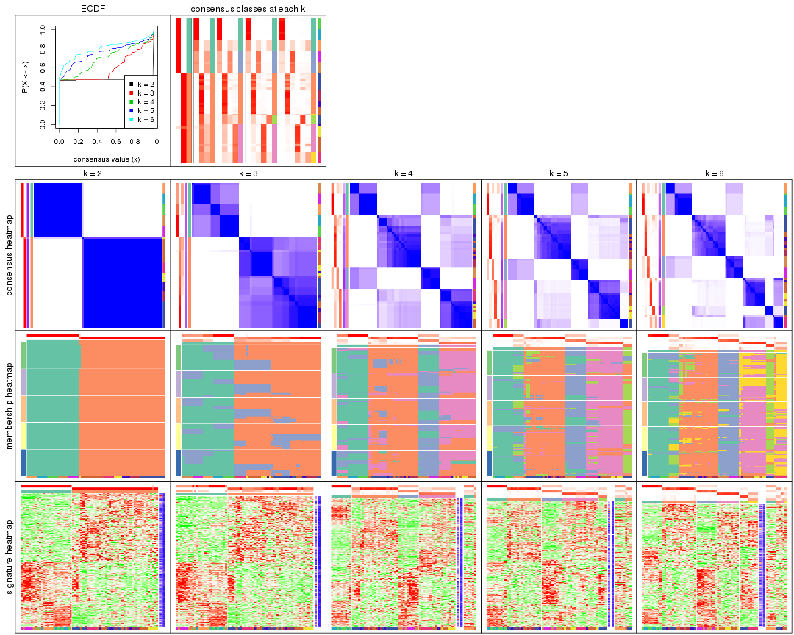

The plots are:

- The first row: a plot of the ECDF (Empirical cumulative distribution
  function) curves of the consensus matrix for each `k` and the heatmap of
  predicted classes for each `k`.
- The second row: heatmaps of the consensus matrix for each `k`.
- The third row: heatmaps of the membership matrix for each `k`.
- The fouth row: heatmaps of the signatures for each `k`.

All the plots in panels can be made by individual functions and they are
plotted later in this section.

`select_partition_number()` produces several plots showing different
statistics for choosing "optimized" `k`. There are following statistics:

- ECDF curves of the consensus matrix for each `k`;
- 1-PAC. [The PAC
  score](https://en.wikipedia.org/wiki/Consensus_clustering#Over-interpretation_potential_of_consensus_clustering)
  measures the proportion of the ambiguous subgrouping.
- Mean silhouette score.
- Concordance. The mean probability of fiting the consensus class ids in all
  partitions.
- Area increased. Denote $A_k$ as the area under the ECDF curve for current
  `k`, the area increased is defined as $A_k - A_{k-1}$.
- Rand index. The percent of pairs of samples that are both in a same cluster
  or both are not in a same cluster in the partition of k and k-1.
- Jaccard index. The ratio of pairs of samples are both in a same cluster in
  the partition of k and k-1 and the pairs of samples are both in a same
  cluster in the partition k or k-1.

The detailed explanations of these statistics can be found in [the cola
vignette](http://bioconductor.org/packages/devel/bioc/vignettes/cola/inst/doc/cola.html#toc_13).

Generally speaking, lower PAC score, higher mean silhouette score or higher
concordance corresponds to better partition. Rand index and Jaccard index
measure how similar the current partition is compared to partition with `k-1`.
If they are too similar, we won't accept `k` is better than `k-1`.

```r
select_partition_number(res)
```


The numeric values for all these statistics can be obtained by `get_stats()`.

```r
get_stats(res)
```

```
#>   k 1-PAC mean_silhouette concordance area_increased  Rand Jaccard
#> 2 2 1.000           0.994       0.997         0.4767 0.525   0.525
#> 3 3 0.640           0.812       0.797         0.2559 1.000   1.000
#> 4 4 0.614           0.786       0.757         0.1655 0.737   0.499
#> 5 5 0.691           0.785       0.808         0.0887 0.964   0.862
#> 6 6 0.763           0.754       0.773         0.0583 0.960   0.823
```

`suggest_best_k()` suggests the best $k$ based on these statistics. The rules are as follows:

- All $k$ with Jaccard index larger than 0.95 are removed because the increase of
  the partition number does not provides enough extra information. If all $k$ are removed,
  the best $k$ is assigned by `NA`.
- For $k$ with 1-PAC larger than 0.9, the maximal $k$ is taken as the "best k". Other $k$ is called "optional k".
- If it does not fit the second rule. The $k$ with the highest vote of highest
  1-PAC, mean silhouette and concordance is taken as the "best k".

```r
suggest_best_k(res)
```

```
#> [1] 2
```


Following shows the table of the partitions (You need to click the **show/hide
code output** link to see it). The membership matrix (columns with name `p*`)
is inferred by
[`clue::cl_consensus()`](https://www.rdocumentation.org/link/cl_consensus?package=clue)
function with the `SE` method. Basically the value in the membership matrix
represents the probability to belong to a certain group. The finall class
label for an item is determined with the group with highest probability it
belongs to.

In `get_classes()` function, the entropy is calculated from the membership
matrix and the silhouette score is calculated from the consensus matrix.


<script>
$( function() {
	$( '#tabs-CV-kmeans-get-classes' ).tabs();
} );
</script>
<div id='tabs-CV-kmeans-get-classes'>
<ul>
<li><a href='#tab-CV-kmeans-get-classes-1'>k = 2</a></li>
<li><a href='#tab-CV-kmeans-get-classes-2'>k = 3</a></li>
<li><a href='#tab-CV-kmeans-get-classes-3'>k = 4</a></li>
<li><a href='#tab-CV-kmeans-get-classes-4'>k = 5</a></li>
<li><a href='#tab-CV-kmeans-get-classes-5'>k = 6</a></li>
</ul>

<div id='tab-CV-kmeans-get-classes-1'>
<p><a id='tab-CV-kmeans-get-classes-1-a' style='color:#0366d6' href='#'>show/hide code output</a></p>
<pre><code class="r">cbind(get_classes(res, k = 2), get_membership(res, k = 2))
</code></pre>

<pre><code>#&gt;           class entropy silhouette   p1   p2
#&gt; GSM312811     2    0.00      0.996 0.00 1.00
#&gt; GSM312812     2    0.00      0.996 0.00 1.00
#&gt; GSM312813     2    0.00      0.996 0.00 1.00
#&gt; GSM312814     2    0.00      0.996 0.00 1.00
#&gt; GSM312815     2    0.00      0.996 0.00 1.00
#&gt; GSM312816     2    0.00      0.996 0.00 1.00
#&gt; GSM312817     2    0.00      0.996 0.00 1.00
#&gt; GSM312818     2    0.00      0.996 0.00 1.00
#&gt; GSM312819     2    0.00      0.996 0.00 1.00
#&gt; GSM312820     2    0.00      0.996 0.00 1.00
#&gt; GSM312821     2    0.00      0.996 0.00 1.00
#&gt; GSM312822     2    0.00      0.996 0.00 1.00
#&gt; GSM312823     2    0.00      0.996 0.00 1.00
#&gt; GSM312824     2    0.00      0.996 0.00 1.00
#&gt; GSM312825     2    0.00      0.996 0.00 1.00
#&gt; GSM312826     2    0.00      0.996 0.00 1.00
#&gt; GSM312839     2    0.00      0.996 0.00 1.00
#&gt; GSM312840     2    0.00      0.996 0.00 1.00
#&gt; GSM312841     2    0.00      0.996 0.00 1.00
#&gt; GSM312843     2    0.00      0.996 0.00 1.00
#&gt; GSM312844     2    0.00      0.996 0.00 1.00
#&gt; GSM312845     2    0.68      0.780 0.18 0.82
#&gt; GSM312846     2    0.00      0.996 0.00 1.00
#&gt; GSM312847     2    0.00      0.996 0.00 1.00
#&gt; GSM312848     2    0.00      0.996 0.00 1.00
#&gt; GSM312849     2    0.00      0.996 0.00 1.00
#&gt; GSM312851     2    0.00      0.996 0.00 1.00
#&gt; GSM312853     2    0.00      0.996 0.00 1.00
#&gt; GSM312854     2    0.00      0.996 0.00 1.00
#&gt; GSM312856     2    0.00      0.996 0.00 1.00
#&gt; GSM312857     2    0.00      0.996 0.00 1.00
#&gt; GSM312858     2    0.00      0.996 0.00 1.00
#&gt; GSM312859     2    0.00      0.996 0.00 1.00
#&gt; GSM312860     2    0.00      0.996 0.00 1.00
#&gt; GSM312861     2    0.00      0.996 0.00 1.00
#&gt; GSM312862     2    0.00      0.996 0.00 1.00
#&gt; GSM312863     2    0.00      0.996 0.00 1.00
#&gt; GSM312864     2    0.00      0.996 0.00 1.00
#&gt; GSM312865     2    0.00      0.996 0.00 1.00
#&gt; GSM312867     2    0.00      0.996 0.00 1.00
#&gt; GSM312868     2    0.00      0.996 0.00 1.00
#&gt; GSM312869     2    0.00      0.996 0.00 1.00
#&gt; GSM312870     1    0.00      1.000 1.00 0.00
#&gt; GSM312872     1    0.00      1.000 1.00 0.00
#&gt; GSM312874     1    0.00      1.000 1.00 0.00
#&gt; GSM312875     1    0.00      1.000 1.00 0.00
#&gt; GSM312876     1    0.00      1.000 1.00 0.00
#&gt; GSM312877     1    0.00      1.000 1.00 0.00
#&gt; GSM312879     1    0.00      1.000 1.00 0.00
#&gt; GSM312882     1    0.00      1.000 1.00 0.00
#&gt; GSM312883     1    0.00      1.000 1.00 0.00
#&gt; GSM312886     1    0.00      1.000 1.00 0.00
#&gt; GSM312887     1    0.00      1.000 1.00 0.00
#&gt; GSM312890     1    0.00      1.000 1.00 0.00
#&gt; GSM312893     1    0.00      1.000 1.00 0.00
#&gt; GSM312894     1    0.00      1.000 1.00 0.00
#&gt; GSM312895     1    0.00      1.000 1.00 0.00
#&gt; GSM312937     1    0.00      1.000 1.00 0.00
#&gt; GSM312938     1    0.00      1.000 1.00 0.00
#&gt; GSM312939     1    0.00      1.000 1.00 0.00
#&gt; GSM312940     1    0.00      1.000 1.00 0.00
#&gt; GSM312941     1    0.00      1.000 1.00 0.00
#&gt; GSM312942     1    0.00      1.000 1.00 0.00
#&gt; GSM312943     1    0.00      1.000 1.00 0.00
#&gt; GSM312944     1    0.00      1.000 1.00 0.00
#&gt; GSM312945     1    0.00      1.000 1.00 0.00
#&gt; GSM312946     1    0.00      1.000 1.00 0.00
</code></pre>

<script>
$('#tab-CV-kmeans-get-classes-1-a').parent().next().next().hide();
$('#tab-CV-kmeans-get-classes-1-a').click(function(){
  $('#tab-CV-kmeans-get-classes-1-a').parent().next().next().toggle();
  return(false);
});
</script>
</div>

<div id='tab-CV-kmeans-get-classes-2'>
<p><a id='tab-CV-kmeans-get-classes-2-a' style='color:#0366d6' href='#'>show/hide code output</a></p>
<pre><code class="r">cbind(get_classes(res, k = 3), get_membership(res, k = 3))
</code></pre>

<pre><code>#&gt;           class entropy silhouette    p1    p2    p3
#&gt; GSM312811     2   0.341      0.805 0.000 0.876 0.124
#&gt; GSM312812     2   0.116      0.826 0.000 0.972 0.028
#&gt; GSM312813     2   0.000      0.834 0.000 1.000 0.000
#&gt; GSM312814     2   0.341      0.805 0.000 0.876 0.124
#&gt; GSM312815     2   0.116      0.826 0.000 0.972 0.028
#&gt; GSM312816     2   0.424      0.784 0.000 0.824 0.176
#&gt; GSM312817     2   0.000      0.834 0.000 1.000 0.000
#&gt; GSM312818     2   0.424      0.784 0.000 0.824 0.176
#&gt; GSM312819     2   0.362      0.802 0.000 0.864 0.136
#&gt; GSM312820     2   0.424      0.784 0.000 0.824 0.176
#&gt; GSM312821     2   0.424      0.784 0.000 0.824 0.176
#&gt; GSM312822     2   0.341      0.805 0.000 0.876 0.124
#&gt; GSM312823     2   0.000      0.834 0.000 1.000 0.000
#&gt; GSM312824     2   0.000      0.834 0.000 1.000 0.000
#&gt; GSM312825     2   0.000      0.834 0.000 1.000 0.000
#&gt; GSM312826     2   0.000      0.834 0.000 1.000 0.000
#&gt; GSM312839     2   0.000      0.834 0.000 1.000 0.000
#&gt; GSM312840     2   0.000      0.834 0.000 1.000 0.000
#&gt; GSM312841     2   0.141      0.824 0.000 0.964 0.036
#&gt; GSM312843     2   0.562      0.797 0.000 0.692 0.308
#&gt; GSM312844     2   0.000      0.834 0.000 1.000 0.000
#&gt; GSM312845     2   0.795      0.737 0.084 0.608 0.308
#&gt; GSM312846     2   0.562      0.797 0.000 0.692 0.308
#&gt; GSM312847     2   0.562      0.797 0.000 0.692 0.308
#&gt; GSM312848     2   0.562      0.797 0.000 0.692 0.308
#&gt; GSM312849     2   0.562      0.797 0.000 0.692 0.308
#&gt; GSM312851     2   0.623      0.766 0.000 0.564 0.436
#&gt; GSM312853     2   0.622      0.767 0.000 0.568 0.432
#&gt; GSM312854     2   0.620      0.770 0.000 0.576 0.424
#&gt; GSM312856     2   0.620      0.770 0.000 0.576 0.424
#&gt; GSM312857     2   0.622      0.767 0.000 0.568 0.432
#&gt; GSM312858     2   0.562      0.797 0.000 0.692 0.308
#&gt; GSM312859     2   0.103      0.835 0.000 0.976 0.024
#&gt; GSM312860     2   0.116      0.836 0.000 0.972 0.028
#&gt; GSM312861     2   0.562      0.797 0.000 0.692 0.308
#&gt; GSM312862     2   0.562      0.797 0.000 0.692 0.308
#&gt; GSM312863     2   0.620      0.770 0.000 0.576 0.424
#&gt; GSM312864     2   0.450      0.817 0.000 0.804 0.196
#&gt; GSM312865     2   0.562      0.797 0.000 0.692 0.308
#&gt; GSM312867     2   0.562      0.797 0.000 0.692 0.308
#&gt; GSM312868     2   0.562      0.797 0.000 0.692 0.308
#&gt; GSM312869     2   0.000      0.834 0.000 1.000 0.000
#&gt; GSM312870     1   0.630      0.812 0.516 0.000 0.484
#&gt; GSM312872     1   0.630      0.812 0.516 0.000 0.484
#&gt; GSM312874     1   0.630      0.812 0.516 0.000 0.484
#&gt; GSM312875     1   0.630      0.812 0.516 0.000 0.484
#&gt; GSM312876     1   0.630      0.812 0.516 0.000 0.484
#&gt; GSM312877     1   0.617      0.824 0.588 0.000 0.412
#&gt; GSM312879     1   0.630      0.812 0.516 0.000 0.484
#&gt; GSM312882     1   0.630      0.812 0.516 0.000 0.484
#&gt; GSM312883     1   0.630      0.812 0.516 0.000 0.484
#&gt; GSM312886     1   0.630      0.812 0.516 0.000 0.484
#&gt; GSM312887     1   0.000      0.829 1.000 0.000 0.000
#&gt; GSM312890     1   0.000      0.829 1.000 0.000 0.000
#&gt; GSM312893     1   0.000      0.829 1.000 0.000 0.000
#&gt; GSM312894     1   0.000      0.829 1.000 0.000 0.000
#&gt; GSM312895     1   0.000      0.829 1.000 0.000 0.000
#&gt; GSM312937     1   0.000      0.829 1.000 0.000 0.000
#&gt; GSM312938     1   0.000      0.829 1.000 0.000 0.000
#&gt; GSM312939     1   0.000      0.829 1.000 0.000 0.000
#&gt; GSM312940     1   0.000      0.829 1.000 0.000 0.000
#&gt; GSM312941     1   0.000      0.829 1.000 0.000 0.000
#&gt; GSM312942     1   0.497      0.842 0.764 0.000 0.236
#&gt; GSM312943     1   0.497      0.842 0.764 0.000 0.236
#&gt; GSM312944     1   0.497      0.842 0.764 0.000 0.236
#&gt; GSM312945     1   0.497      0.842 0.764 0.000 0.236
#&gt; GSM312946     1   0.497      0.842 0.764 0.000 0.236
</code></pre>

<script>
$('#tab-CV-kmeans-get-classes-2-a').parent().next().next().hide();
$('#tab-CV-kmeans-get-classes-2-a').click(function(){
  $('#tab-CV-kmeans-get-classes-2-a').parent().next().next().toggle();
  return(false);
});
</script>
</div>

<div id='tab-CV-kmeans-get-classes-3'>
<p><a id='tab-CV-kmeans-get-classes-3-a' style='color:#0366d6' href='#'>show/hide code output</a></p>
<pre><code class="r">cbind(get_classes(res, k = 4), get_membership(res, k = 4))
</code></pre>

<pre><code>#&gt;           class entropy silhouette    p1    p2    p3    p4
#&gt; GSM312811     2  0.3764      0.771 0.000 0.852 0.072 0.076
#&gt; GSM312812     2  0.1022      0.815 0.000 0.968 0.032 0.000
#&gt; GSM312813     2  0.2131      0.819 0.000 0.932 0.032 0.036
#&gt; GSM312814     2  0.4621      0.741 0.000 0.796 0.128 0.076
#&gt; GSM312815     2  0.1398      0.812 0.000 0.956 0.040 0.004
#&gt; GSM312816     2  0.7048      0.541 0.000 0.556 0.284 0.160
#&gt; GSM312817     2  0.2565      0.818 0.000 0.912 0.032 0.056
#&gt; GSM312818     2  0.7048      0.541 0.000 0.556 0.284 0.160
#&gt; GSM312819     2  0.2654      0.785 0.000 0.888 0.004 0.108
#&gt; GSM312820     2  0.7048      0.541 0.000 0.556 0.284 0.160
#&gt; GSM312821     2  0.7048      0.541 0.000 0.556 0.284 0.160
#&gt; GSM312822     2  0.4621      0.741 0.000 0.796 0.128 0.076
#&gt; GSM312823     2  0.1118      0.821 0.000 0.964 0.000 0.036
#&gt; GSM312824     2  0.1118      0.821 0.000 0.964 0.000 0.036
#&gt; GSM312825     2  0.1118      0.821 0.000 0.964 0.000 0.036
#&gt; GSM312826     2  0.1118      0.821 0.000 0.964 0.000 0.036
#&gt; GSM312839     2  0.1022      0.822 0.000 0.968 0.000 0.032
#&gt; GSM312840     2  0.1118      0.821 0.000 0.964 0.000 0.036
#&gt; GSM312841     2  0.0188      0.819 0.000 0.996 0.004 0.000
#&gt; GSM312843     4  0.4988      0.868 0.000 0.288 0.020 0.692
#&gt; GSM312844     2  0.1022      0.822 0.000 0.968 0.000 0.032
#&gt; GSM312845     4  0.5309      0.857 0.028 0.280 0.004 0.688
#&gt; GSM312846     4  0.4632      0.878 0.000 0.308 0.004 0.688
#&gt; GSM312847     4  0.4632      0.878 0.000 0.308 0.004 0.688
#&gt; GSM312848     4  0.4632      0.878 0.000 0.308 0.004 0.688
#&gt; GSM312849     4  0.4677      0.872 0.000 0.316 0.004 0.680
#&gt; GSM312851     4  0.5637      0.765 0.000 0.168 0.112 0.720
#&gt; GSM312853     4  0.5637      0.765 0.000 0.168 0.112 0.720
#&gt; GSM312854     4  0.5582      0.768 0.000 0.168 0.108 0.724
#&gt; GSM312856     4  0.5582      0.768 0.000 0.168 0.108 0.724
#&gt; GSM312857     4  0.5637      0.765 0.000 0.168 0.112 0.720
#&gt; GSM312858     4  0.4454      0.879 0.000 0.308 0.000 0.692
#&gt; GSM312859     2  0.1637      0.801 0.000 0.940 0.000 0.060
#&gt; GSM312860     2  0.2149      0.770 0.000 0.912 0.000 0.088
#&gt; GSM312861     4  0.4677      0.872 0.000 0.316 0.004 0.680
#&gt; GSM312862     4  0.4454      0.879 0.000 0.308 0.000 0.692
#&gt; GSM312863     4  0.4789      0.796 0.000 0.172 0.056 0.772
#&gt; GSM312864     2  0.6357      0.215 0.000 0.544 0.068 0.388
#&gt; GSM312865     4  0.4454      0.879 0.000 0.308 0.000 0.692
#&gt; GSM312867     4  0.4677      0.872 0.000 0.316 0.004 0.680
#&gt; GSM312868     4  0.4454      0.879 0.000 0.308 0.000 0.692
#&gt; GSM312869     2  0.1118      0.821 0.000 0.964 0.000 0.036
#&gt; GSM312870     3  0.4804      0.978 0.384 0.000 0.616 0.000
#&gt; GSM312872     3  0.4804      0.978 0.384 0.000 0.616 0.000
#&gt; GSM312874     3  0.4804      0.978 0.384 0.000 0.616 0.000
#&gt; GSM312875     3  0.4804      0.978 0.384 0.000 0.616 0.000
#&gt; GSM312876     3  0.4804      0.978 0.384 0.000 0.616 0.000
#&gt; GSM312877     3  0.5472      0.871 0.440 0.000 0.544 0.016
#&gt; GSM312879     3  0.5339      0.976 0.384 0.000 0.600 0.016
#&gt; GSM312882     3  0.5339      0.976 0.384 0.000 0.600 0.016
#&gt; GSM312883     3  0.5339      0.976 0.384 0.000 0.600 0.016
#&gt; GSM312886     3  0.5339      0.976 0.384 0.000 0.600 0.016
#&gt; GSM312887     1  0.0000      0.803 1.000 0.000 0.000 0.000
#&gt; GSM312890     1  0.0000      0.803 1.000 0.000 0.000 0.000
#&gt; GSM312893     1  0.0000      0.803 1.000 0.000 0.000 0.000
#&gt; GSM312894     1  0.0000      0.803 1.000 0.000 0.000 0.000
#&gt; GSM312895     1  0.0000      0.803 1.000 0.000 0.000 0.000
#&gt; GSM312937     1  0.0000      0.803 1.000 0.000 0.000 0.000
#&gt; GSM312938     1  0.0000      0.803 1.000 0.000 0.000 0.000
#&gt; GSM312939     1  0.0000      0.803 1.000 0.000 0.000 0.000
#&gt; GSM312940     1  0.0000      0.803 1.000 0.000 0.000 0.000
#&gt; GSM312941     1  0.0000      0.803 1.000 0.000 0.000 0.000
#&gt; GSM312942     1  0.6449      0.440 0.636 0.000 0.232 0.132
#&gt; GSM312943     1  0.6449      0.440 0.636 0.000 0.232 0.132
#&gt; GSM312944     1  0.6449      0.440 0.636 0.000 0.232 0.132
#&gt; GSM312945     1  0.6449      0.440 0.636 0.000 0.232 0.132
#&gt; GSM312946     1  0.6449      0.440 0.636 0.000 0.232 0.132
</code></pre>

<script>
$('#tab-CV-kmeans-get-classes-3-a').parent().next().next().hide();
$('#tab-CV-kmeans-get-classes-3-a').click(function(){
  $('#tab-CV-kmeans-get-classes-3-a').parent().next().next().toggle();
  return(false);
});
</script>
</div>

<div id='tab-CV-kmeans-get-classes-4'>
<p><a id='tab-CV-kmeans-get-classes-4-a' style='color:#0366d6' href='#'>show/hide code output</a></p>
<pre><code class="r">cbind(get_classes(res, k = 5), get_membership(res, k = 5))
</code></pre>

<pre><code>#&gt;           class entropy silhouette    p1    p2    p3    p4    p5
#&gt; GSM312811     2  0.4819     0.6691 0.000 0.768 0.112 0.036 0.084
#&gt; GSM312812     2  0.2529     0.8013 0.000 0.900 0.056 0.004 0.040
#&gt; GSM312813     2  0.3709     0.7879 0.000 0.832 0.108 0.016 0.044
#&gt; GSM312814     2  0.6032     0.2948 0.000 0.624 0.084 0.036 0.256
#&gt; GSM312815     2  0.2153     0.8003 0.000 0.916 0.040 0.000 0.044
#&gt; GSM312816     5  0.4890     1.0000 0.000 0.256 0.000 0.064 0.680
#&gt; GSM312817     2  0.3809     0.7853 0.000 0.824 0.116 0.016 0.044
#&gt; GSM312818     5  0.4890     1.0000 0.000 0.256 0.000 0.064 0.680
#&gt; GSM312819     2  0.3373     0.7610 0.000 0.848 0.092 0.056 0.004
#&gt; GSM312820     5  0.4890     1.0000 0.000 0.256 0.000 0.064 0.680
#&gt; GSM312821     5  0.4890     1.0000 0.000 0.256 0.000 0.064 0.680
#&gt; GSM312822     2  0.6032     0.2948 0.000 0.624 0.084 0.036 0.256
#&gt; GSM312823     2  0.1012     0.8369 0.000 0.968 0.012 0.020 0.000
#&gt; GSM312824     2  0.0609     0.8362 0.000 0.980 0.000 0.020 0.000
#&gt; GSM312825     2  0.0609     0.8362 0.000 0.980 0.000 0.020 0.000
#&gt; GSM312826     2  0.0609     0.8362 0.000 0.980 0.000 0.020 0.000
#&gt; GSM312839     2  0.1216     0.8363 0.000 0.960 0.020 0.020 0.000
#&gt; GSM312840     2  0.1630     0.8302 0.000 0.944 0.036 0.016 0.004
#&gt; GSM312841     2  0.0955     0.8301 0.000 0.968 0.028 0.004 0.000
#&gt; GSM312843     4  0.3773     0.8625 0.000 0.108 0.060 0.824 0.008
#&gt; GSM312844     2  0.1012     0.8369 0.000 0.968 0.012 0.020 0.000
#&gt; GSM312845     4  0.2858     0.8753 0.008 0.100 0.012 0.876 0.004
#&gt; GSM312846     4  0.2733     0.8779 0.000 0.112 0.012 0.872 0.004
#&gt; GSM312847     4  0.2681     0.8788 0.000 0.108 0.012 0.876 0.004
#&gt; GSM312848     4  0.2629     0.8794 0.000 0.104 0.012 0.880 0.004
#&gt; GSM312849     4  0.2783     0.8763 0.000 0.116 0.012 0.868 0.004
#&gt; GSM312851     4  0.5371     0.7266 0.000 0.032 0.124 0.720 0.124
#&gt; GSM312853     4  0.5431     0.7356 0.000 0.040 0.124 0.720 0.116
#&gt; GSM312854     4  0.5290     0.7461 0.000 0.040 0.124 0.732 0.104
#&gt; GSM312856     4  0.5290     0.7461 0.000 0.040 0.124 0.732 0.104
#&gt; GSM312857     4  0.5431     0.7356 0.000 0.040 0.124 0.720 0.116
#&gt; GSM312858     4  0.2233     0.8797 0.000 0.104 0.000 0.892 0.004
#&gt; GSM312859     2  0.1743     0.8251 0.000 0.940 0.028 0.028 0.004
#&gt; GSM312860     2  0.1644     0.8126 0.000 0.940 0.008 0.048 0.004
#&gt; GSM312861     4  0.3107     0.8699 0.000 0.124 0.016 0.852 0.008
#&gt; GSM312862     4  0.2548     0.8770 0.000 0.116 0.004 0.876 0.004
#&gt; GSM312863     4  0.4101     0.7926 0.000 0.040 0.124 0.808 0.028
#&gt; GSM312864     2  0.7581    -0.0871 0.000 0.420 0.152 0.348 0.080
#&gt; GSM312865     4  0.2074     0.8798 0.000 0.104 0.000 0.896 0.000
#&gt; GSM312867     4  0.2783     0.8763 0.000 0.116 0.012 0.868 0.004
#&gt; GSM312868     4  0.2517     0.8788 0.000 0.104 0.008 0.884 0.004
#&gt; GSM312869     2  0.0771     0.8359 0.000 0.976 0.004 0.020 0.000
#&gt; GSM312870     3  0.3774     0.9635 0.296 0.000 0.704 0.000 0.000
#&gt; GSM312872     3  0.3774     0.9635 0.296 0.000 0.704 0.000 0.000
#&gt; GSM312874     3  0.3774     0.9635 0.296 0.000 0.704 0.000 0.000
#&gt; GSM312875     3  0.3774     0.9635 0.296 0.000 0.704 0.000 0.000
#&gt; GSM312876     3  0.3774     0.9635 0.296 0.000 0.704 0.000 0.000
#&gt; GSM312877     3  0.5396     0.8579 0.360 0.000 0.588 0.020 0.032
#&gt; GSM312879     3  0.4811     0.9596 0.296 0.000 0.668 0.016 0.020
#&gt; GSM312882     3  0.5142     0.9537 0.296 0.000 0.652 0.020 0.032
#&gt; GSM312883     3  0.5142     0.9537 0.296 0.000 0.652 0.020 0.032
#&gt; GSM312886     3  0.4901     0.9585 0.296 0.000 0.664 0.020 0.020
#&gt; GSM312887     1  0.0510     0.7747 0.984 0.000 0.000 0.000 0.016
#&gt; GSM312890     1  0.0000     0.7807 1.000 0.000 0.000 0.000 0.000
#&gt; GSM312893     1  0.0000     0.7807 1.000 0.000 0.000 0.000 0.000
#&gt; GSM312894     1  0.0000     0.7807 1.000 0.000 0.000 0.000 0.000
#&gt; GSM312895     1  0.0000     0.7807 1.000 0.000 0.000 0.000 0.000
#&gt; GSM312937     1  0.0000     0.7807 1.000 0.000 0.000 0.000 0.000
#&gt; GSM312938     1  0.0510     0.7747 0.984 0.000 0.000 0.000 0.016
#&gt; GSM312939     1  0.0000     0.7807 1.000 0.000 0.000 0.000 0.000
#&gt; GSM312940     1  0.0000     0.7807 1.000 0.000 0.000 0.000 0.000
#&gt; GSM312941     1  0.0000     0.7807 1.000 0.000 0.000 0.000 0.000
#&gt; GSM312942     1  0.6733     0.4116 0.532 0.000 0.212 0.020 0.236
#&gt; GSM312943     1  0.6733     0.4116 0.532 0.000 0.212 0.020 0.236
#&gt; GSM312944     1  0.6733     0.4116 0.532 0.000 0.212 0.020 0.236
#&gt; GSM312945     1  0.6733     0.4116 0.532 0.000 0.212 0.020 0.236
#&gt; GSM312946     1  0.6733     0.4116 0.532 0.000 0.212 0.020 0.236
</code></pre>

<script>
$('#tab-CV-kmeans-get-classes-4-a').parent().next().next().hide();
$('#tab-CV-kmeans-get-classes-4-a').click(function(){
  $('#tab-CV-kmeans-get-classes-4-a').parent().next().next().toggle();
  return(false);
});
</script>
</div>

<div id='tab-CV-kmeans-get-classes-5'>
<p><a id='tab-CV-kmeans-get-classes-5-a' style='color:#0366d6' href='#'>show/hide code output</a></p>
<pre><code class="r">cbind(get_classes(res, k = 6), get_membership(res, k = 6))
</code></pre>

<pre><code>#&gt;           class entropy silhouette    p1    p2    p3    p4    p5    p6
#&gt; GSM312811     2  0.6000      0.632 0.000 0.620 0.096 0.000 0.152 0.132
#&gt; GSM312812     2  0.3489      0.792 0.000 0.836 0.052 0.000 0.064 0.048
#&gt; GSM312813     2  0.5083      0.738 0.000 0.712 0.096 0.000 0.072 0.120
#&gt; GSM312814     2  0.6275      0.283 0.000 0.496 0.076 0.000 0.340 0.088
#&gt; GSM312815     2  0.3474      0.789 0.000 0.836 0.048 0.000 0.072 0.044
#&gt; GSM312816     5  0.1910      1.000 0.000 0.108 0.000 0.000 0.892 0.000
#&gt; GSM312817     2  0.5216      0.733 0.000 0.700 0.100 0.000 0.076 0.124
#&gt; GSM312818     5  0.1910      1.000 0.000 0.108 0.000 0.000 0.892 0.000
#&gt; GSM312819     2  0.4006      0.769 0.000 0.796 0.060 0.004 0.028 0.112
#&gt; GSM312820     5  0.1910      1.000 0.000 0.108 0.000 0.000 0.892 0.000
#&gt; GSM312821     5  0.1910      1.000 0.000 0.108 0.000 0.000 0.892 0.000
#&gt; GSM312822     2  0.6275      0.283 0.000 0.496 0.076 0.000 0.340 0.088
#&gt; GSM312823     2  0.1409      0.832 0.000 0.948 0.012 0.008 0.000 0.032
#&gt; GSM312824     2  0.0260      0.832 0.000 0.992 0.000 0.008 0.000 0.000
#&gt; GSM312825     2  0.0260      0.832 0.000 0.992 0.000 0.008 0.000 0.000
#&gt; GSM312826     2  0.0260      0.832 0.000 0.992 0.000 0.008 0.000 0.000
#&gt; GSM312839     2  0.1890      0.830 0.000 0.924 0.024 0.008 0.000 0.044
#&gt; GSM312840     2  0.1821      0.823 0.000 0.928 0.024 0.000 0.008 0.040
#&gt; GSM312841     2  0.1624      0.825 0.000 0.936 0.020 0.000 0.004 0.040
#&gt; GSM312843     4  0.5191      0.469 0.000 0.064 0.044 0.696 0.012 0.184
#&gt; GSM312844     2  0.1426      0.832 0.000 0.948 0.016 0.008 0.000 0.028
#&gt; GSM312845     4  0.1408      0.860 0.000 0.036 0.020 0.944 0.000 0.000
#&gt; GSM312846     4  0.1480      0.860 0.000 0.040 0.020 0.940 0.000 0.000
#&gt; GSM312847     4  0.1408      0.860 0.000 0.036 0.020 0.944 0.000 0.000
#&gt; GSM312848     4  0.1552      0.859 0.000 0.036 0.020 0.940 0.000 0.004
#&gt; GSM312849     4  0.1480      0.860 0.000 0.040 0.020 0.940 0.000 0.000
#&gt; GSM312851     6  0.5516      0.784 0.000 0.004 0.000 0.424 0.112 0.460
#&gt; GSM312853     6  0.5634      0.796 0.000 0.012 0.000 0.424 0.104 0.460
#&gt; GSM312854     6  0.5602      0.793 0.000 0.012 0.000 0.428 0.100 0.460
#&gt; GSM312856     6  0.5602      0.793 0.000 0.012 0.000 0.428 0.100 0.460
#&gt; GSM312857     6  0.5634      0.796 0.000 0.012 0.000 0.424 0.104 0.460
#&gt; GSM312858     4  0.1867      0.846 0.000 0.036 0.000 0.924 0.004 0.036
#&gt; GSM312859     2  0.2402      0.813 0.000 0.908 0.024 0.028 0.012 0.028
#&gt; GSM312860     2  0.1723      0.805 0.000 0.932 0.004 0.048 0.012 0.004
#&gt; GSM312861     4  0.1964      0.838 0.000 0.056 0.004 0.920 0.012 0.008
#&gt; GSM312862     4  0.2569      0.825 0.000 0.044 0.012 0.892 0.004 0.048
#&gt; GSM312863     4  0.4555     -0.593 0.000 0.012 0.000 0.532 0.016 0.440
#&gt; GSM312864     6  0.8100      0.184 0.000 0.308 0.056 0.208 0.104 0.324
#&gt; GSM312865     4  0.1572      0.848 0.000 0.036 0.000 0.936 0.000 0.028
#&gt; GSM312867     4  0.1480      0.860 0.000 0.040 0.020 0.940 0.000 0.000
#&gt; GSM312868     4  0.2224      0.839 0.000 0.036 0.004 0.912 0.012 0.036
#&gt; GSM312869     2  0.0405      0.832 0.000 0.988 0.000 0.008 0.000 0.004
#&gt; GSM312870     3  0.2491      0.952 0.164 0.000 0.836 0.000 0.000 0.000
#&gt; GSM312872     3  0.2491      0.952 0.164 0.000 0.836 0.000 0.000 0.000
#&gt; GSM312874     3  0.2491      0.952 0.164 0.000 0.836 0.000 0.000 0.000
#&gt; GSM312875     3  0.2491      0.952 0.164 0.000 0.836 0.000 0.000 0.000
#&gt; GSM312876     3  0.2491      0.952 0.164 0.000 0.836 0.000 0.000 0.000
#&gt; GSM312877     3  0.5184      0.863 0.228 0.000 0.676 0.028 0.024 0.044
#&gt; GSM312879     3  0.3846      0.948 0.164 0.000 0.784 0.008 0.012 0.032
#&gt; GSM312882     3  0.4724      0.936 0.164 0.000 0.740 0.028 0.024 0.044
#&gt; GSM312883     3  0.4724      0.936 0.164 0.000 0.740 0.028 0.024 0.044
#&gt; GSM312886     3  0.4356      0.943 0.164 0.000 0.760 0.016 0.024 0.036
#&gt; GSM312887     1  0.0806      0.761 0.972 0.000 0.000 0.000 0.020 0.008
#&gt; GSM312890     1  0.0000      0.770 1.000 0.000 0.000 0.000 0.000 0.000
#&gt; GSM312893     1  0.0000      0.770 1.000 0.000 0.000 0.000 0.000 0.000
#&gt; GSM312894     1  0.0000      0.770 1.000 0.000 0.000 0.000 0.000 0.000
#&gt; GSM312895     1  0.0000      0.770 1.000 0.000 0.000 0.000 0.000 0.000
#&gt; GSM312937     1  0.0000      0.770 1.000 0.000 0.000 0.000 0.000 0.000
#&gt; GSM312938     1  0.0806      0.761 0.972 0.000 0.000 0.000 0.020 0.008
#&gt; GSM312939     1  0.0000      0.770 1.000 0.000 0.000 0.000 0.000 0.000
#&gt; GSM312940     1  0.0000      0.770 1.000 0.000 0.000 0.000 0.000 0.000
#&gt; GSM312941     1  0.0000      0.770 1.000 0.000 0.000 0.000 0.000 0.000
#&gt; GSM312942     1  0.6739      0.393 0.420 0.000 0.204 0.000 0.052 0.324
#&gt; GSM312943     1  0.6739      0.393 0.420 0.000 0.204 0.000 0.052 0.324
#&gt; GSM312944     1  0.6739      0.393 0.420 0.000 0.204 0.000 0.052 0.324
#&gt; GSM312945     1  0.6739      0.393 0.420 0.000 0.204 0.000 0.052 0.324
#&gt; GSM312946     1  0.6739      0.393 0.420 0.000 0.204 0.000 0.052 0.324
</code></pre>

<script>
$('#tab-CV-kmeans-get-classes-5-a').parent().next().next().hide();
$('#tab-CV-kmeans-get-classes-5-a').click(function(){
  $('#tab-CV-kmeans-get-classes-5-a').parent().next().next().toggle();
  return(false);
});
</script>
</div>
</div>

Heatmaps for the consensus matrix. It visualizes the probability of two
samples to be in a same group.


<script>
$( function() {
	$( '#tabs-CV-kmeans-consensus-heatmap' ).tabs();
} );
</script>
<div id='tabs-CV-kmeans-consensus-heatmap'>
<ul>
<li><a href='#tab-CV-kmeans-consensus-heatmap-1'>k = 2</a></li>
<li><a href='#tab-CV-kmeans-consensus-heatmap-2'>k = 3</a></li>
<li><a href='#tab-CV-kmeans-consensus-heatmap-3'>k = 4</a></li>
<li><a href='#tab-CV-kmeans-consensus-heatmap-4'>k = 5</a></li>
<li><a href='#tab-CV-kmeans-consensus-heatmap-5'>k = 6</a></li>
</ul>
<div id='tab-CV-kmeans-consensus-heatmap-1'>
<pre><code class="r">consensus_heatmap(res, k = 2)
</code></pre>

<p></p>

</div>
<div id='tab-CV-kmeans-consensus-heatmap-2'>
<pre><code class="r">consensus_heatmap(res, k = 3)
</code></pre>

<p></p>

</div>
<div id='tab-CV-kmeans-consensus-heatmap-3'>
<pre><code class="r">consensus_heatmap(res, k = 4)
</code></pre>

<p></p>

</div>
<div id='tab-CV-kmeans-consensus-heatmap-4'>
<pre><code class="r">consensus_heatmap(res, k = 5)
</code></pre>

<p></p>

</div>
<div id='tab-CV-kmeans-consensus-heatmap-5'>
<pre><code class="r">consensus_heatmap(res, k = 6)
</code></pre>

<p></p>

</div>
</div>

Heatmaps for the membership of samples in all partitions to see how consistent they are:


<script>
$( function() {
	$( '#tabs-CV-kmeans-membership-heatmap' ).tabs();
} );
</script>
<div id='tabs-CV-kmeans-membership-heatmap'>
<ul>
<li><a href='#tab-CV-kmeans-membership-heatmap-1'>k = 2</a></li>
<li><a href='#tab-CV-kmeans-membership-heatmap-2'>k = 3</a></li>
<li><a href='#tab-CV-kmeans-membership-heatmap-3'>k = 4</a></li>
<li><a href='#tab-CV-kmeans-membership-heatmap-4'>k = 5</a></li>
<li><a href='#tab-CV-kmeans-membership-heatmap-5'>k = 6</a></li>
</ul>
<div id='tab-CV-kmeans-membership-heatmap-1'>
<pre><code class="r">membership_heatmap(res, k = 2)
</code></pre>

<p></p>

</div>
<div id='tab-CV-kmeans-membership-heatmap-2'>
<pre><code class="r">membership_heatmap(res, k = 3)
</code></pre>

<p></p>

</div>
<div id='tab-CV-kmeans-membership-heatmap-3'>
<pre><code class="r">membership_heatmap(res, k = 4)
</code></pre>

<p></p>

</div>
<div id='tab-CV-kmeans-membership-heatmap-4'>
<pre><code class="r">membership_heatmap(res, k = 5)
</code></pre>

<p></p>

</div>
<div id='tab-CV-kmeans-membership-heatmap-5'>
<pre><code class="r">membership_heatmap(res, k = 6)
</code></pre>

<p></p>

</div>
</div>

As soon as we have had the classes for columns, we can look for signatures
which are significantly different between classes which can be candidate marks
for certain classes. Following are the heatmaps for signatures.


Signature heatmaps where rows are scaled:


<script>
$( function() {
	$( '#tabs-CV-kmeans-get-signatures' ).tabs();
} );
</script>
<div id='tabs-CV-kmeans-get-signatures'>
<ul>
<li><a href='#tab-CV-kmeans-get-signatures-1'>k = 2</a></li>
<li><a href='#tab-CV-kmeans-get-signatures-2'>k = 3</a></li>
<li><a href='#tab-CV-kmeans-get-signatures-3'>k = 4</a></li>
<li><a href='#tab-CV-kmeans-get-signatures-4'>k = 5</a></li>
<li><a href='#tab-CV-kmeans-get-signatures-5'>k = 6</a></li>
</ul>
<div id='tab-CV-kmeans-get-signatures-1'>
<pre><code class="r">get_signatures(res, k = 2)
</code></pre>

<p></p>

</div>
<div id='tab-CV-kmeans-get-signatures-2'>
<pre><code class="r">get_signatures(res, k = 3)
</code></pre>

<p></p>

</div>
<div id='tab-CV-kmeans-get-signatures-3'>
<pre><code class="r">get_signatures(res, k = 4)
</code></pre>

<p></p>

</div>
<div id='tab-CV-kmeans-get-signatures-4'>
<pre><code class="r">get_signatures(res, k = 5)
</code></pre>

<p></p>

</div>
<div id='tab-CV-kmeans-get-signatures-5'>
<pre><code class="r">get_signatures(res, k = 6)
</code></pre>

<p></p>

</div>
</div>


Signature heatmaps where rows are not scaled:


<script>
$( function() {
	$( '#tabs-CV-kmeans-get-signatures-no-scale' ).tabs();
} );
</script>
<div id='tabs-CV-kmeans-get-signatures-no-scale'>
<ul>
<li><a href='#tab-CV-kmeans-get-signatures-no-scale-1'>k = 2</a></li>
<li><a href='#tab-CV-kmeans-get-signatures-no-scale-2'>k = 3</a></li>
<li><a href='#tab-CV-kmeans-get-signatures-no-scale-3'>k = 4</a></li>
<li><a href='#tab-CV-kmeans-get-signatures-no-scale-4'>k = 5</a></li>
<li><a href='#tab-CV-kmeans-get-signatures-no-scale-5'>k = 6</a></li>
</ul>
<div id='tab-CV-kmeans-get-signatures-no-scale-1'>
<pre><code class="r">get_signatures(res, k = 2, scale_rows = FALSE)
</code></pre>

<p></p>

</div>
<div id='tab-CV-kmeans-get-signatures-no-scale-2'>
<pre><code class="r">get_signatures(res, k = 3, scale_rows = FALSE)
</code></pre>

<p></p>

</div>
<div id='tab-CV-kmeans-get-signatures-no-scale-3'>
<pre><code class="r">get_signatures(res, k = 4, scale_rows = FALSE)
</code></pre>

<p></p>

</div>
<div id='tab-CV-kmeans-get-signatures-no-scale-4'>
<pre><code class="r">get_signatures(res, k = 5, scale_rows = FALSE)
</code></pre>

<p></p>

</div>
<div id='tab-CV-kmeans-get-signatures-no-scale-5'>
<pre><code class="r">get_signatures(res, k = 6, scale_rows = FALSE)
</code></pre>

<p></p>

</div>
</div>


Compare the overlap of signatures from different k:

```r
compare_signatures(res)
```


`get_signature()` returns a data frame invisibly. TO get the list of signatures, the function
call should be assigned to a variable explicitly. In following code, if `plot` argument is set
to `FALSE`, no heatmap is plotted while only the differential analysis is performed.

```r
# code only for demonstration
tb = get_signature(res, k = ..., plot = FALSE)
```

An example of the output of `tb` is:

```
#>   which_row         fdr    mean_1    mean_2 scaled_mean_1 scaled_mean_2 km
#> 1        38 0.042760348  8.373488  9.131774    -0.5533452     0.5164555  1
#> 2        40 0.018707592  7.106213  8.469186    -0.6173731     0.5762149  1
#> 3        55 0.019134737 10.221463 11.207825    -0.6159697     0.5749050  1
#> 4        59 0.006059896  5.921854  7.869574    -0.6899429     0.6439467  1
#> 5        60 0.018055526  8.928898 10.211722    -0.6204761     0.5791110  1
#> 6        98 0.009384629 15.714769 14.887706     0.6635654    -0.6193277  2
...
```

The columns in `tb` are:

1. `which_row`: row indices corresponding to the input matrix.
2. `fdr`: FDR for the differential test. 
3. `mean_x`: The mean value in group x.
4. `scaled_mean_x`: The mean value in group x after rows are scaled.
5. `km`: Row groups if k-means clustering is applied to rows.


UMAP plot which shows how samples are separated.


<script>
$( function() {
	$( '#tabs-CV-kmeans-dimension-reduction' ).tabs();
} );
</script>
<div id='tabs-CV-kmeans-dimension-reduction'>
<ul>
<li><a href='#tab-CV-kmeans-dimension-reduction-1'>k = 2</a></li>
<li><a href='#tab-CV-kmeans-dimension-reduction-2'>k = 3</a></li>
<li><a href='#tab-CV-kmeans-dimension-reduction-3'>k = 4</a></li>
<li><a href='#tab-CV-kmeans-dimension-reduction-4'>k = 5</a></li>
<li><a href='#tab-CV-kmeans-dimension-reduction-5'>k = 6</a></li>
</ul>
<div id='tab-CV-kmeans-dimension-reduction-1'>
<pre><code class="r">dimension_reduction(res, k = 2, method = &quot;UMAP&quot;)
</code></pre>

<p></p>

</div>
<div id='tab-CV-kmeans-dimension-reduction-2'>
<pre><code class="r">dimension_reduction(res, k = 3, method = &quot;UMAP&quot;)
</code></pre>

<p>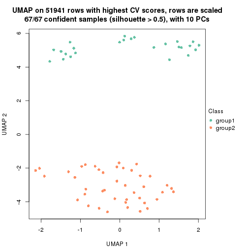</p>

</div>
<div id='tab-CV-kmeans-dimension-reduction-3'>
<pre><code class="r">dimension_reduction(res, k = 4, method = &quot;UMAP&quot;)
</code></pre>

<p></p>

</div>
<div id='tab-CV-kmeans-dimension-reduction-4'>
<pre><code class="r">dimension_reduction(res, k = 5, method = &quot;UMAP&quot;)
</code></pre>

<p></p>

</div>
<div id='tab-CV-kmeans-dimension-reduction-5'>
<pre><code class="r">dimension_reduction(res, k = 6, method = &quot;UMAP&quot;)
</code></pre>

<p></p>

</div>
</div>


Following heatmap shows how subgroups are split when increasing `k`:

```r
collect_classes(res)
```


Test correlation between subgroups and known annotations. If the known
annotation is numeric, one-way ANOVA test is applied, and if the known
annotation is discrete, chi-squared contingency table test is applied.

```r
test_to_known_factors(res)
```

```
#>            n disease.state(p) k
#> CV:kmeans 67         1.68e-10 2
#> CV:kmeans 67         1.68e-10 3
#> CV:kmeans 61         6.59e-22 4
#> CV:kmeans 59         7.92e-20 5
#> CV:kmeans 57         6.84e-26 6
```


If matrix rows can be associated to genes, consider to use `GO_Enrichment(res,
...)` to perform function enrichment for the signature genes.


 

---------------------------------------------------


### CV:skmeans**


The object with results only for a single top-value method and a single partition method 
can be extracted as:

```r
res = res_list["CV", "skmeans"]
# you can also extract it by
# res = res_list["CV:skmeans"]
```

A summary of `res` and all the functions that can be applied to it:

```r
res
```

```
#> A 'ConsensusPartition' object with k = 2, 3, 4, 5, 6.
#>   On a matrix with 51941 rows and 67 columns.
#>   Top rows (1000, 2000, 3000, 4000, 5000) are extracted by 'CV' method.
#>   Subgroups are detected by 'skmeans' method.
#>   Performed in total 1250 partitions by row resampling.
#>   Best k for subgroups seems to be 3.
#> 
#> Following methods can be applied to this 'ConsensusPartition' object:
#>  [1] "cola_report"             "collect_classes"         "collect_plots"          
#>  [4] "collect_stats"           "colnames"                "compare_signatures"     
#>  [7] "consensus_heatmap"       "dimension_reduction"     "functional_enrichment"  
#> [10] "get_anno_col"            "get_anno"                "get_classes"            
#> [13] "get_consensus"           "get_matrix"              "get_membership"         
#> [16] "get_param"               "get_signatures"          "get_stats"              
#> [19] "is_best_k"               "is_stable_k"             "membership_heatmap"     
#> [22] "ncol"                    "nrow"                    "plot_ecdf"              
#> [25] "rownames"                "select_partition_number" "show"                   
#> [28] "suggest_best_k"          "test_to_known_factors"
```

`collect_plots()` function collects all the plots made from `res` for all `k` (number of partitions)
into one single page to provide an easy and fast comparison between different `k`.

```r
collect_plots(res)
```


The plots are:

- The first row: a plot of the ECDF (Empirical cumulative distribution
  function) curves of the consensus matrix for each `k` and the heatmap of
  predicted classes for each `k`.
- The second row: heatmaps of the consensus matrix for each `k`.
- The third row: heatmaps of the membership matrix for each `k`.
- The fouth row: heatmaps of the signatures for each `k`.

All the plots in panels can be made by individual functions and they are
plotted later in this section.

`select_partition_number()` produces several plots showing different
statistics for choosing "optimized" `k`. There are following statistics:

- ECDF curves of the consensus matrix for each `k`;
- 1-PAC. [The PAC
  score](https://en.wikipedia.org/wiki/Consensus_clustering#Over-interpretation_potential_of_consensus_clustering)
  measures the proportion of the ambiguous subgrouping.
- Mean silhouette score.
- Concordance. The mean probability of fiting the consensus class ids in all
  partitions.
- Area increased. Denote $A_k$ as the area under the ECDF curve for current
  `k`, the area increased is defined as $A_k - A_{k-1}$.
- Rand index. The percent of pairs of samples that are both in a same cluster
  or both are not in a same cluster in the partition of k and k-1.
- Jaccard index. The ratio of pairs of samples are both in a same cluster in
  the partition of k and k-1 and the pairs of samples are both in a same
  cluster in the partition k or k-1.

The detailed explanations of these statistics can be found in [the cola
vignette](http://bioconductor.org/packages/devel/bioc/vignettes/cola/inst/doc/cola.html#toc_13).

Generally speaking, lower PAC score, higher mean silhouette score or higher
concordance corresponds to better partition. Rand index and Jaccard index
measure how similar the current partition is compared to partition with `k-1`.
If they are too similar, we won't accept `k` is better than `k-1`.

```r
select_partition_number(res)
```


The numeric values for all these statistics can be obtained by `get_stats()`.

```r
get_stats(res)
```

```
#>   k 1-PAC mean_silhouette concordance area_increased  Rand Jaccard
#> 2 2 1.000           0.992       0.996         0.4832 0.518   0.518
#> 3 3 1.000           0.950       0.967         0.3837 0.796   0.613
#> 4 4 0.827           0.883       0.923         0.1043 0.932   0.794
#> 5 5 0.817           0.756       0.839         0.0589 0.964   0.871
#> 6 6 0.838           0.794       0.845         0.0462 0.877   0.564
```

`suggest_best_k()` suggests the best $k$ based on these statistics. The rules are as follows:

- All $k$ with Jaccard index larger than 0.95 are removed because the increase of
  the partition number does not provides enough extra information. If all $k$ are removed,
  the best $k$ is assigned by `NA`.
- For $k$ with 1-PAC larger than 0.9, the maximal $k$ is taken as the "best k". Other $k$ is called "optional k".
- If it does not fit the second rule. The $k$ with the highest vote of highest
  1-PAC, mean silhouette and concordance is taken as the "best k".

```r
suggest_best_k(res)
```

```
#> [1] 3
#> attr(,"optional")
#> [1] 2
```

There is also optional best $k$ = 2 that is worth to check.

Following shows the table of the partitions (You need to click the **show/hide
code output** link to see it). The membership matrix (columns with name `p*`)
is inferred by
[`clue::cl_consensus()`](https://www.rdocumentation.org/link/cl_consensus?package=clue)
function with the `SE` method. Basically the value in the membership matrix
represents the probability to belong to a certain group. The finall class
label for an item is determined with the group with highest probability it
belongs to.

In `get_classes()` function, the entropy is calculated from the membership
matrix and the silhouette score is calculated from the consensus matrix.


<script>
$( function() {
	$( '#tabs-CV-skmeans-get-classes' ).tabs();
} );
</script>
<div id='tabs-CV-skmeans-get-classes'>
<ul>
<li><a href='#tab-CV-skmeans-get-classes-1'>k = 2</a></li>
<li><a href='#tab-CV-skmeans-get-classes-2'>k = 3</a></li>
<li><a href='#tab-CV-skmeans-get-classes-3'>k = 4</a></li>
<li><a href='#tab-CV-skmeans-get-classes-4'>k = 5</a></li>
<li><a href='#tab-CV-skmeans-get-classes-5'>k = 6</a></li>
</ul>

<div id='tab-CV-skmeans-get-classes-1'>
<p><a id='tab-CV-skmeans-get-classes-1-a' style='color:#0366d6' href='#'>show/hide code output</a></p>
<pre><code class="r">cbind(get_classes(res, k = 2), get_membership(res, k = 2))
</code></pre>

<pre><code>#&gt;           class entropy silhouette    p1    p2
#&gt; GSM312811     2   0.000      0.996 0.000 1.000
#&gt; GSM312812     2   0.000      0.996 0.000 1.000
#&gt; GSM312813     2   0.000      0.996 0.000 1.000
#&gt; GSM312814     2   0.000      0.996 0.000 1.000
#&gt; GSM312815     2   0.000      0.996 0.000 1.000
#&gt; GSM312816     2   0.000      0.996 0.000 1.000
#&gt; GSM312817     2   0.000      0.996 0.000 1.000
#&gt; GSM312818     2   0.000      0.996 0.000 1.000
#&gt; GSM312819     2   0.000      0.996 0.000 1.000
#&gt; GSM312820     2   0.000      0.996 0.000 1.000
#&gt; GSM312821     2   0.000      0.996 0.000 1.000
#&gt; GSM312822     2   0.000      0.996 0.000 1.000
#&gt; GSM312823     2   0.000      0.996 0.000 1.000
#&gt; GSM312824     2   0.000      0.996 0.000 1.000
#&gt; GSM312825     2   0.000      0.996 0.000 1.000
#&gt; GSM312826     2   0.000      0.996 0.000 1.000
#&gt; GSM312839     2   0.000      0.996 0.000 1.000
#&gt; GSM312840     2   0.000      0.996 0.000 1.000
#&gt; GSM312841     2   0.000      0.996 0.000 1.000
#&gt; GSM312843     2   0.000      0.996 0.000 1.000
#&gt; GSM312844     2   0.000      0.996 0.000 1.000
#&gt; GSM312845     1   0.373      0.922 0.928 0.072
#&gt; GSM312846     2   0.671      0.785 0.176 0.824
#&gt; GSM312847     2   0.000      0.996 0.000 1.000
#&gt; GSM312848     2   0.000      0.996 0.000 1.000
#&gt; GSM312849     2   0.000      0.996 0.000 1.000
#&gt; GSM312851     2   0.000      0.996 0.000 1.000
#&gt; GSM312853     2   0.000      0.996 0.000 1.000
#&gt; GSM312854     2   0.000      0.996 0.000 1.000
#&gt; GSM312856     2   0.000      0.996 0.000 1.000
#&gt; GSM312857     2   0.000      0.996 0.000 1.000
#&gt; GSM312858     2   0.000      0.996 0.000 1.000
#&gt; GSM312859     2   0.000      0.996 0.000 1.000
#&gt; GSM312860     2   0.000      0.996 0.000 1.000
#&gt; GSM312861     2   0.000      0.996 0.000 1.000
#&gt; GSM312862     2   0.000      0.996 0.000 1.000
#&gt; GSM312863     2   0.000      0.996 0.000 1.000
#&gt; GSM312864     2   0.000      0.996 0.000 1.000
#&gt; GSM312865     2   0.000      0.996 0.000 1.000
#&gt; GSM312867     2   0.000      0.996 0.000 1.000
#&gt; GSM312868     2   0.000      0.996 0.000 1.000
#&gt; GSM312869     2   0.000      0.996 0.000 1.000
#&gt; GSM312870     1   0.000      0.997 1.000 0.000
#&gt; GSM312872     1   0.000      0.997 1.000 0.000
#&gt; GSM312874     1   0.000      0.997 1.000 0.000
#&gt; GSM312875     1   0.000      0.997 1.000 0.000
#&gt; GSM312876     1   0.000      0.997 1.000 0.000
#&gt; GSM312877     1   0.000      0.997 1.000 0.000
#&gt; GSM312879     1   0.000      0.997 1.000 0.000
#&gt; GSM312882     1   0.000      0.997 1.000 0.000
#&gt; GSM312883     1   0.000      0.997 1.000 0.000
#&gt; GSM312886     1   0.000      0.997 1.000 0.000
#&gt; GSM312887     1   0.000      0.997 1.000 0.000
#&gt; GSM312890     1   0.000      0.997 1.000 0.000
#&gt; GSM312893     1   0.000      0.997 1.000 0.000
#&gt; GSM312894     1   0.000      0.997 1.000 0.000
#&gt; GSM312895     1   0.000      0.997 1.000 0.000
#&gt; GSM312937     1   0.000      0.997 1.000 0.000
#&gt; GSM312938     1   0.000      0.997 1.000 0.000
#&gt; GSM312939     1   0.000      0.997 1.000 0.000
#&gt; GSM312940     1   0.000      0.997 1.000 0.000
#&gt; GSM312941     1   0.000      0.997 1.000 0.000
#&gt; GSM312942     1   0.000      0.997 1.000 0.000
#&gt; GSM312943     1   0.000      0.997 1.000 0.000
#&gt; GSM312944     1   0.000      0.997 1.000 0.000
#&gt; GSM312945     1   0.000      0.997 1.000 0.000
#&gt; GSM312946     1   0.000      0.997 1.000 0.000
</code></pre>

<script>
$('#tab-CV-skmeans-get-classes-1-a').parent().next().next().hide();
$('#tab-CV-skmeans-get-classes-1-a').click(function(){
  $('#tab-CV-skmeans-get-classes-1-a').parent().next().next().toggle();
  return(false);
});
</script>
</div>

<div id='tab-CV-skmeans-get-classes-2'>
<p><a id='tab-CV-skmeans-get-classes-2-a' style='color:#0366d6' href='#'>show/hide code output</a></p>
<pre><code class="r">cbind(get_classes(res, k = 3), get_membership(res, k = 3))
</code></pre>

<pre><code>#&gt;           class entropy silhouette    p1    p2    p3
#&gt; GSM312811     2  0.1964      0.939 0.000 0.944 0.056
#&gt; GSM312812     2  0.0000      0.959 0.000 1.000 0.000
#&gt; GSM312813     2  0.0000      0.959 0.000 1.000 0.000
#&gt; GSM312814     2  0.1964      0.939 0.000 0.944 0.056
#&gt; GSM312815     2  0.0000      0.959 0.000 1.000 0.000
#&gt; GSM312816     2  0.1964      0.939 0.000 0.944 0.056
#&gt; GSM312817     2  0.0000      0.959 0.000 1.000 0.000
#&gt; GSM312818     2  0.1964      0.939 0.000 0.944 0.056
#&gt; GSM312819     2  0.1529      0.946 0.000 0.960 0.040
#&gt; GSM312820     2  0.1964      0.939 0.000 0.944 0.056
#&gt; GSM312821     2  0.1964      0.939 0.000 0.944 0.056
#&gt; GSM312822     2  0.1964      0.939 0.000 0.944 0.056
#&gt; GSM312823     2  0.0000      0.959 0.000 1.000 0.000
#&gt; GSM312824     2  0.0000      0.959 0.000 1.000 0.000
#&gt; GSM312825     2  0.0000      0.959 0.000 1.000 0.000
#&gt; GSM312826     2  0.0000      0.959 0.000 1.000 0.000
#&gt; GSM312839     2  0.0000      0.959 0.000 1.000 0.000
#&gt; GSM312840     2  0.0000      0.959 0.000 1.000 0.000
#&gt; GSM312841     2  0.0000      0.959 0.000 1.000 0.000
#&gt; GSM312843     3  0.3038      0.906 0.000 0.104 0.896
#&gt; GSM312844     2  0.0000      0.959 0.000 1.000 0.000
#&gt; GSM312845     3  0.1964      0.949 0.000 0.056 0.944
#&gt; GSM312846     3  0.1964      0.949 0.000 0.056 0.944
#&gt; GSM312847     3  0.2261      0.954 0.000 0.068 0.932
#&gt; GSM312848     3  0.2356      0.954 0.000 0.072 0.928
#&gt; GSM312849     3  0.2261      0.954 0.000 0.068 0.932
#&gt; GSM312851     3  0.0747      0.942 0.000 0.016 0.984
#&gt; GSM312853     3  0.0747      0.942 0.000 0.016 0.984
#&gt; GSM312854     3  0.0747      0.942 0.000 0.016 0.984
#&gt; GSM312856     3  0.0747      0.942 0.000 0.016 0.984
#&gt; GSM312857     3  0.0747      0.942 0.000 0.016 0.984
#&gt; GSM312858     3  0.2356      0.954 0.000 0.072 0.928
#&gt; GSM312859     2  0.0000      0.959 0.000 1.000 0.000
#&gt; GSM312860     2  0.0000      0.959 0.000 1.000 0.000
#&gt; GSM312861     3  0.2356      0.954 0.000 0.072 0.928
#&gt; GSM312862     3  0.5678      0.634 0.000 0.316 0.684
#&gt; GSM312863     3  0.0747      0.942 0.000 0.016 0.984
#&gt; GSM312864     2  0.6286      0.175 0.000 0.536 0.464
#&gt; GSM312865     3  0.2261      0.954 0.000 0.068 0.932
#&gt; GSM312867     3  0.2066      0.951 0.000 0.060 0.940
#&gt; GSM312868     3  0.2356      0.954 0.000 0.072 0.928
#&gt; GSM312869     2  0.0000      0.959 0.000 1.000 0.000
#&gt; GSM312870     1  0.0000      0.995 1.000 0.000 0.000
#&gt; GSM312872     1  0.0000      0.995 1.000 0.000 0.000
#&gt; GSM312874     1  0.0000      0.995 1.000 0.000 0.000
#&gt; GSM312875     1  0.0000      0.995 1.000 0.000 0.000
#&gt; GSM312876     1  0.0000      0.995 1.000 0.000 0.000
#&gt; GSM312877     1  0.0000      0.995 1.000 0.000 0.000
#&gt; GSM312879     1  0.0000      0.995 1.000 0.000 0.000
#&gt; GSM312882     1  0.0000      0.995 1.000 0.000 0.000
#&gt; GSM312883     1  0.0000      0.995 1.000 0.000 0.000
#&gt; GSM312886     1  0.0000      0.995 1.000 0.000 0.000
#&gt; GSM312887     1  0.0747      0.992 0.984 0.000 0.016
#&gt; GSM312890     1  0.0747      0.992 0.984 0.000 0.016
#&gt; GSM312893     1  0.0747      0.992 0.984 0.000 0.016
#&gt; GSM312894     1  0.0747      0.992 0.984 0.000 0.016
#&gt; GSM312895     1  0.0747      0.992 0.984 0.000 0.016
#&gt; GSM312937     1  0.0747      0.992 0.984 0.000 0.016
#&gt; GSM312938     1  0.0747      0.992 0.984 0.000 0.016
#&gt; GSM312939     1  0.0747      0.992 0.984 0.000 0.016
#&gt; GSM312940     1  0.0747      0.992 0.984 0.000 0.016
#&gt; GSM312941     1  0.0747      0.992 0.984 0.000 0.016
#&gt; GSM312942     1  0.0000      0.995 1.000 0.000 0.000
#&gt; GSM312943     1  0.0000      0.995 1.000 0.000 0.000
#&gt; GSM312944     1  0.0000      0.995 1.000 0.000 0.000
#&gt; GSM312945     1  0.0000      0.995 1.000 0.000 0.000
#&gt; GSM312946     1  0.0000      0.995 1.000 0.000 0.000
</code></pre>

<script>
$('#tab-CV-skmeans-get-classes-2-a').parent().next().next().hide();
$('#tab-CV-skmeans-get-classes-2-a').click(function(){
  $('#tab-CV-skmeans-get-classes-2-a').parent().next().next().toggle();
  return(false);
});
</script>
</div>

<div id='tab-CV-skmeans-get-classes-3'>
<p><a id='tab-CV-skmeans-get-classes-3-a' style='color:#0366d6' href='#'>show/hide code output</a></p>
<pre><code class="r">cbind(get_classes(res, k = 4), get_membership(res, k = 4))
</code></pre>

<pre><code>#&gt;           class entropy silhouette    p1    p2    p3    p4
#&gt; GSM312811     2  0.2676      0.894 0.012 0.896 0.000 0.092
#&gt; GSM312812     2  0.0000      0.938 0.000 1.000 0.000 0.000
#&gt; GSM312813     2  0.0000      0.938 0.000 1.000 0.000 0.000
#&gt; GSM312814     2  0.2676      0.894 0.012 0.896 0.000 0.092
#&gt; GSM312815     2  0.0000      0.938 0.000 1.000 0.000 0.000
#&gt; GSM312816     2  0.3404      0.875 0.032 0.864 0.000 0.104
#&gt; GSM312817     2  0.0188      0.937 0.000 0.996 0.000 0.004
#&gt; GSM312818     2  0.4975      0.833 0.032 0.804 0.060 0.104
#&gt; GSM312819     2  0.0469      0.934 0.000 0.988 0.000 0.012
#&gt; GSM312820     2  0.3404      0.875 0.032 0.864 0.000 0.104
#&gt; GSM312821     2  0.3404      0.875 0.032 0.864 0.000 0.104
#&gt; GSM312822     2  0.2676      0.894 0.012 0.896 0.000 0.092
#&gt; GSM312823     2  0.0000      0.938 0.000 1.000 0.000 0.000
#&gt; GSM312824     2  0.0000      0.938 0.000 1.000 0.000 0.000
#&gt; GSM312825     2  0.0000      0.938 0.000 1.000 0.000 0.000
#&gt; GSM312826     2  0.0000      0.938 0.000 1.000 0.000 0.000
#&gt; GSM312839     2  0.0000      0.938 0.000 1.000 0.000 0.000
#&gt; GSM312840     2  0.0000      0.938 0.000 1.000 0.000 0.000
#&gt; GSM312841     2  0.0000      0.938 0.000 1.000 0.000 0.000
#&gt; GSM312843     4  0.2775      0.883 0.020 0.084 0.000 0.896
#&gt; GSM312844     2  0.0000      0.938 0.000 1.000 0.000 0.000
#&gt; GSM312845     4  0.4008      0.703 0.244 0.000 0.000 0.756
#&gt; GSM312846     4  0.4764      0.731 0.220 0.032 0.000 0.748
#&gt; GSM312847     4  0.2466      0.897 0.004 0.096 0.000 0.900
#&gt; GSM312848     4  0.2401      0.898 0.004 0.092 0.000 0.904
#&gt; GSM312849     4  0.2593      0.894 0.004 0.104 0.000 0.892
#&gt; GSM312851     4  0.1022      0.876 0.032 0.000 0.000 0.968
#&gt; GSM312853     4  0.0921      0.878 0.028 0.000 0.000 0.972
#&gt; GSM312854     4  0.0921      0.878 0.028 0.000 0.000 0.972
#&gt; GSM312856     4  0.0921      0.878 0.028 0.000 0.000 0.972
#&gt; GSM312857     4  0.0921      0.878 0.028 0.000 0.000 0.972
#&gt; GSM312858     4  0.2281      0.898 0.000 0.096 0.000 0.904
#&gt; GSM312859     2  0.0000      0.938 0.000 1.000 0.000 0.000
#&gt; GSM312860     2  0.0000      0.938 0.000 1.000 0.000 0.000
#&gt; GSM312861     4  0.2593      0.894 0.004 0.104 0.000 0.892
#&gt; GSM312862     4  0.4950      0.521 0.004 0.376 0.000 0.620
#&gt; GSM312863     4  0.0707      0.879 0.020 0.000 0.000 0.980
#&gt; GSM312864     2  0.5695      0.159 0.024 0.500 0.000 0.476
#&gt; GSM312865     4  0.2281      0.898 0.000 0.096 0.000 0.904
#&gt; GSM312867     4  0.2593      0.894 0.004 0.104 0.000 0.892
#&gt; GSM312868     4  0.2281      0.898 0.000 0.096 0.000 0.904
#&gt; GSM312869     2  0.0000      0.938 0.000 1.000 0.000 0.000
#&gt; GSM312870     3  0.0188      0.893 0.004 0.000 0.996 0.000
#&gt; GSM312872     3  0.0188      0.893 0.004 0.000 0.996 0.000
#&gt; GSM312874     3  0.0188      0.893 0.004 0.000 0.996 0.000
#&gt; GSM312875     3  0.0188      0.893 0.004 0.000 0.996 0.000
#&gt; GSM312876     3  0.0188      0.893 0.004 0.000 0.996 0.000
#&gt; GSM312877     3  0.0188      0.893 0.004 0.000 0.996 0.000
#&gt; GSM312879     3  0.0188      0.893 0.004 0.000 0.996 0.000
#&gt; GSM312882     3  0.0188      0.893 0.004 0.000 0.996 0.000
#&gt; GSM312883     3  0.0188      0.893 0.004 0.000 0.996 0.000
#&gt; GSM312886     3  0.0188      0.893 0.004 0.000 0.996 0.000
#&gt; GSM312887     1  0.1302      1.000 0.956 0.000 0.044 0.000
#&gt; GSM312890     1  0.1302      1.000 0.956 0.000 0.044 0.000
#&gt; GSM312893     1  0.1302      1.000 0.956 0.000 0.044 0.000
#&gt; GSM312894     1  0.1302      1.000 0.956 0.000 0.044 0.000
#&gt; GSM312895     1  0.1302      1.000 0.956 0.000 0.044 0.000
#&gt; GSM312937     1  0.1302      1.000 0.956 0.000 0.044 0.000
#&gt; GSM312938     1  0.1302      1.000 0.956 0.000 0.044 0.000
#&gt; GSM312939     1  0.1302      1.000 0.956 0.000 0.044 0.000
#&gt; GSM312940     1  0.1302      1.000 0.956 0.000 0.044 0.000
#&gt; GSM312941     1  0.1302      1.000 0.956 0.000 0.044 0.000
#&gt; GSM312942     3  0.4134      0.732 0.260 0.000 0.740 0.000
#&gt; GSM312943     3  0.4134      0.732 0.260 0.000 0.740 0.000
#&gt; GSM312944     3  0.4134      0.732 0.260 0.000 0.740 0.000
#&gt; GSM312945     3  0.4134      0.732 0.260 0.000 0.740 0.000
#&gt; GSM312946     3  0.4134      0.732 0.260 0.000 0.740 0.000
</code></pre>

<script>
$('#tab-CV-skmeans-get-classes-3-a').parent().next().next().hide();
$('#tab-CV-skmeans-get-classes-3-a').click(function(){
  $('#tab-CV-skmeans-get-classes-3-a').parent().next().next().toggle();
  return(false);
});
</script>
</div>

<div id='tab-CV-skmeans-get-classes-4'>
<p><a id='tab-CV-skmeans-get-classes-4-a' style='color:#0366d6' href='#'>show/hide code output</a></p>
<pre><code class="r">cbind(get_classes(res, k = 5), get_membership(res, k = 5))
</code></pre>

<pre><code>#&gt;           class entropy silhouette    p1    p2    p3    p4    p5
#&gt; GSM312811     2  0.4243      0.708 0.000 0.712 0.000 0.024 0.264
#&gt; GSM312812     2  0.0703      0.837 0.000 0.976 0.000 0.000 0.024
#&gt; GSM312813     2  0.0703      0.837 0.000 0.976 0.000 0.000 0.024
#&gt; GSM312814     2  0.4622      0.691 0.000 0.684 0.000 0.040 0.276
#&gt; GSM312815     2  0.0703      0.837 0.000 0.976 0.000 0.000 0.024
#&gt; GSM312816     2  0.6650      0.471 0.000 0.448 0.000 0.272 0.280
#&gt; GSM312817     2  0.0703      0.837 0.000 0.976 0.000 0.000 0.024
#&gt; GSM312818     2  0.6994      0.457 0.000 0.436 0.012 0.272 0.280
#&gt; GSM312819     2  0.0510      0.837 0.000 0.984 0.000 0.016 0.000
#&gt; GSM312820     2  0.6650      0.471 0.000 0.448 0.000 0.272 0.280
#&gt; GSM312821     2  0.6650      0.471 0.000 0.448 0.000 0.272 0.280
#&gt; GSM312822     2  0.4691      0.688 0.000 0.680 0.000 0.044 0.276
#&gt; GSM312823     2  0.0000      0.840 0.000 1.000 0.000 0.000 0.000
#&gt; GSM312824     2  0.0000      0.840 0.000 1.000 0.000 0.000 0.000
#&gt; GSM312825     2  0.0000      0.840 0.000 1.000 0.000 0.000 0.000
#&gt; GSM312826     2  0.0000      0.840 0.000 1.000 0.000 0.000 0.000
#&gt; GSM312839     2  0.0000      0.840 0.000 1.000 0.000 0.000 0.000
#&gt; GSM312840     2  0.0000      0.840 0.000 1.000 0.000 0.000 0.000
#&gt; GSM312841     2  0.0000      0.840 0.000 1.000 0.000 0.000 0.000
#&gt; GSM312843     4  0.3810      0.681 0.000 0.176 0.000 0.788 0.036
#&gt; GSM312844     2  0.0000      0.840 0.000 1.000 0.000 0.000 0.000
#&gt; GSM312845     4  0.6206      0.692 0.152 0.000 0.000 0.504 0.344
#&gt; GSM312846     4  0.6400      0.698 0.144 0.008 0.000 0.504 0.344
#&gt; GSM312847     4  0.4467      0.799 0.000 0.016 0.000 0.640 0.344
#&gt; GSM312848     4  0.4467      0.799 0.000 0.016 0.000 0.640 0.344
#&gt; GSM312849     4  0.4794      0.795 0.000 0.032 0.000 0.624 0.344
#&gt; GSM312851     4  0.2891      0.602 0.000 0.000 0.000 0.824 0.176
#&gt; GSM312853     4  0.0000      0.735 0.000 0.000 0.000 1.000 0.000
#&gt; GSM312854     4  0.0000      0.735 0.000 0.000 0.000 1.000 0.000
#&gt; GSM312856     4  0.0000      0.735 0.000 0.000 0.000 1.000 0.000
#&gt; GSM312857     4  0.0000      0.735 0.000 0.000 0.000 1.000 0.000
#&gt; GSM312858     4  0.4348      0.801 0.000 0.016 0.000 0.668 0.316
#&gt; GSM312859     2  0.0000      0.840 0.000 1.000 0.000 0.000 0.000
#&gt; GSM312860     2  0.0510      0.831 0.000 0.984 0.000 0.000 0.016
#&gt; GSM312861     4  0.5099      0.791 0.000 0.052 0.000 0.612 0.336
#&gt; GSM312862     2  0.6478     -0.304 0.000 0.420 0.000 0.396 0.184
#&gt; GSM312863     4  0.2280      0.772 0.000 0.000 0.000 0.880 0.120
#&gt; GSM312864     4  0.5731     -0.276 0.000 0.436 0.000 0.480 0.084
#&gt; GSM312865     4  0.4366      0.801 0.000 0.016 0.000 0.664 0.320
#&gt; GSM312867     4  0.4467      0.799 0.000 0.016 0.000 0.640 0.344
#&gt; GSM312868     4  0.4269      0.801 0.000 0.016 0.000 0.684 0.300
#&gt; GSM312869     2  0.0000      0.840 0.000 1.000 0.000 0.000 0.000
#&gt; GSM312870     3  0.0000      0.828 0.000 0.000 1.000 0.000 0.000
#&gt; GSM312872     3  0.0000      0.828 0.000 0.000 1.000 0.000 0.000
#&gt; GSM312874     3  0.0000      0.828 0.000 0.000 1.000 0.000 0.000
#&gt; GSM312875     3  0.0000      0.828 0.000 0.000 1.000 0.000 0.000
#&gt; GSM312876     3  0.0000      0.828 0.000 0.000 1.000 0.000 0.000
#&gt; GSM312877     3  0.0000      0.828 0.000 0.000 1.000 0.000 0.000
#&gt; GSM312879     3  0.0000      0.828 0.000 0.000 1.000 0.000 0.000
#&gt; GSM312882     3  0.0000      0.828 0.000 0.000 1.000 0.000 0.000
#&gt; GSM312883     3  0.0000      0.828 0.000 0.000 1.000 0.000 0.000
#&gt; GSM312886     3  0.0000      0.828 0.000 0.000 1.000 0.000 0.000
#&gt; GSM312887     1  0.0000      1.000 1.000 0.000 0.000 0.000 0.000
#&gt; GSM312890     1  0.0000      1.000 1.000 0.000 0.000 0.000 0.000
#&gt; GSM312893     1  0.0000      1.000 1.000 0.000 0.000 0.000 0.000
#&gt; GSM312894     1  0.0000      1.000 1.000 0.000 0.000 0.000 0.000
#&gt; GSM312895     1  0.0000      1.000 1.000 0.000 0.000 0.000 0.000
#&gt; GSM312937     1  0.0000      1.000 1.000 0.000 0.000 0.000 0.000
#&gt; GSM312938     1  0.0000      1.000 1.000 0.000 0.000 0.000 0.000
#&gt; GSM312939     1  0.0000      1.000 1.000 0.000 0.000 0.000 0.000
#&gt; GSM312940     1  0.0000      1.000 1.000 0.000 0.000 0.000 0.000
#&gt; GSM312941     1  0.0000      1.000 1.000 0.000 0.000 0.000 0.000
#&gt; GSM312942     3  0.6372      0.561 0.168 0.000 0.456 0.000 0.376
#&gt; GSM312943     3  0.6372      0.561 0.168 0.000 0.456 0.000 0.376
#&gt; GSM312944     3  0.6372      0.561 0.168 0.000 0.456 0.000 0.376
#&gt; GSM312945     3  0.6372      0.561 0.168 0.000 0.456 0.000 0.376
#&gt; GSM312946     3  0.6372      0.561 0.168 0.000 0.456 0.000 0.376
</code></pre>

<script>
$('#tab-CV-skmeans-get-classes-4-a').parent().next().next().hide();
$('#tab-CV-skmeans-get-classes-4-a').click(function(){
  $('#tab-CV-skmeans-get-classes-4-a').parent().next().next().toggle();
  return(false);
});
</script>
</div>

<div id='tab-CV-skmeans-get-classes-5'>
<p><a id='tab-CV-skmeans-get-classes-5-a' style='color:#0366d6' href='#'>show/hide code output</a></p>
<pre><code class="r">cbind(get_classes(res, k = 6), get_membership(res, k = 6))
</code></pre>

<pre><code>#&gt;           class entropy silhouette    p1    p2    p3    p4    p5    p6
#&gt; GSM312811     2  0.5579      0.399 0.000 0.544 0.000 0.000 0.264 0.192
#&gt; GSM312812     2  0.1564      0.863 0.000 0.936 0.000 0.000 0.040 0.024
#&gt; GSM312813     2  0.1644      0.862 0.000 0.932 0.000 0.000 0.040 0.028
#&gt; GSM312814     2  0.5819      0.299 0.000 0.488 0.000 0.000 0.292 0.220
#&gt; GSM312815     2  0.1970      0.848 0.000 0.912 0.000 0.000 0.060 0.028
#&gt; GSM312816     5  0.5242      0.440 0.000 0.176 0.000 0.000 0.608 0.216
#&gt; GSM312817     2  0.2074      0.852 0.000 0.912 0.000 0.004 0.048 0.036
#&gt; GSM312818     5  0.5242      0.440 0.000 0.176 0.000 0.000 0.608 0.216
#&gt; GSM312819     2  0.0551      0.884 0.000 0.984 0.000 0.004 0.004 0.008
#&gt; GSM312820     5  0.5242      0.440 0.000 0.176 0.000 0.000 0.608 0.216
#&gt; GSM312821     5  0.5242      0.440 0.000 0.176 0.000 0.000 0.608 0.216
#&gt; GSM312822     2  0.5830      0.290 0.000 0.484 0.000 0.000 0.296 0.220
#&gt; GSM312823     2  0.0000      0.889 0.000 1.000 0.000 0.000 0.000 0.000
#&gt; GSM312824     2  0.0000      0.889 0.000 1.000 0.000 0.000 0.000 0.000
#&gt; GSM312825     2  0.0000      0.889 0.000 1.000 0.000 0.000 0.000 0.000
#&gt; GSM312826     2  0.0000      0.889 0.000 1.000 0.000 0.000 0.000 0.000
#&gt; GSM312839     2  0.0000      0.889 0.000 1.000 0.000 0.000 0.000 0.000
#&gt; GSM312840     2  0.0146      0.888 0.000 0.996 0.000 0.004 0.000 0.000
#&gt; GSM312841     2  0.0146      0.889 0.000 0.996 0.000 0.000 0.004 0.000
#&gt; GSM312843     5  0.5869      0.321 0.000 0.172 0.000 0.288 0.528 0.012
#&gt; GSM312844     2  0.0000      0.889 0.000 1.000 0.000 0.000 0.000 0.000
#&gt; GSM312845     4  0.1588      0.775 0.072 0.004 0.000 0.924 0.000 0.000
#&gt; GSM312846     4  0.1644      0.772 0.076 0.004 0.000 0.920 0.000 0.000
#&gt; GSM312847     4  0.0146      0.809 0.000 0.004 0.000 0.996 0.000 0.000
#&gt; GSM312848     4  0.0458      0.806 0.000 0.000 0.000 0.984 0.016 0.000
#&gt; GSM312849     4  0.0865      0.802 0.000 0.036 0.000 0.964 0.000 0.000
#&gt; GSM312851     5  0.2527      0.527 0.000 0.000 0.000 0.168 0.832 0.000
#&gt; GSM312853     5  0.3288      0.496 0.000 0.000 0.000 0.276 0.724 0.000
#&gt; GSM312854     5  0.3309      0.492 0.000 0.000 0.000 0.280 0.720 0.000
#&gt; GSM312856     5  0.3309      0.492 0.000 0.000 0.000 0.280 0.720 0.000
#&gt; GSM312857     5  0.3288      0.496 0.000 0.000 0.000 0.276 0.724 0.000
#&gt; GSM312858     4  0.2558      0.729 0.000 0.000 0.000 0.840 0.156 0.004
#&gt; GSM312859     2  0.0146      0.887 0.000 0.996 0.000 0.004 0.000 0.000
#&gt; GSM312860     2  0.0458      0.878 0.000 0.984 0.000 0.016 0.000 0.000
#&gt; GSM312861     4  0.2544      0.741 0.000 0.120 0.000 0.864 0.012 0.004
#&gt; GSM312862     4  0.5986      0.149 0.000 0.416 0.000 0.416 0.156 0.012
#&gt; GSM312863     5  0.3899      0.254 0.000 0.000 0.000 0.404 0.592 0.004
#&gt; GSM312864     5  0.5184      0.467 0.000 0.284 0.000 0.100 0.608 0.008
#&gt; GSM312865     4  0.2482      0.735 0.000 0.000 0.000 0.848 0.148 0.004
#&gt; GSM312867     4  0.0260      0.810 0.000 0.008 0.000 0.992 0.000 0.000
#&gt; GSM312868     4  0.2933      0.678 0.000 0.000 0.000 0.796 0.200 0.004
#&gt; GSM312869     2  0.0000      0.889 0.000 1.000 0.000 0.000 0.000 0.000
#&gt; GSM312870     3  0.0000      1.000 0.000 0.000 1.000 0.000 0.000 0.000
#&gt; GSM312872     3  0.0000      1.000 0.000 0.000 1.000 0.000 0.000 0.000
#&gt; GSM312874     3  0.0000      1.000 0.000 0.000 1.000 0.000 0.000 0.000
#&gt; GSM312875     3  0.0000      1.000 0.000 0.000 1.000 0.000 0.000 0.000
#&gt; GSM312876     3  0.0000      1.000 0.000 0.000 1.000 0.000 0.000 0.000
#&gt; GSM312877     3  0.0000      1.000 0.000 0.000 1.000 0.000 0.000 0.000
#&gt; GSM312879     3  0.0000      1.000 0.000 0.000 1.000 0.000 0.000 0.000
#&gt; GSM312882     3  0.0000      1.000 0.000 0.000 1.000 0.000 0.000 0.000
#&gt; GSM312883     3  0.0000      1.000 0.000 0.000 1.000 0.000 0.000 0.000
#&gt; GSM312886     3  0.0000      1.000 0.000 0.000 1.000 0.000 0.000 0.000
#&gt; GSM312887     1  0.0000      1.000 1.000 0.000 0.000 0.000 0.000 0.000
#&gt; GSM312890     1  0.0000      1.000 1.000 0.000 0.000 0.000 0.000 0.000
#&gt; GSM312893     1  0.0000      1.000 1.000 0.000 0.000 0.000 0.000 0.000
#&gt; GSM312894     1  0.0000      1.000 1.000 0.000 0.000 0.000 0.000 0.000
#&gt; GSM312895     1  0.0000      1.000 1.000 0.000 0.000 0.000 0.000 0.000
#&gt; GSM312937     1  0.0000      1.000 1.000 0.000 0.000 0.000 0.000 0.000
#&gt; GSM312938     1  0.0000      1.000 1.000 0.000 0.000 0.000 0.000 0.000
#&gt; GSM312939     1  0.0000      1.000 1.000 0.000 0.000 0.000 0.000 0.000
#&gt; GSM312940     1  0.0000      1.000 1.000 0.000 0.000 0.000 0.000 0.000
#&gt; GSM312941     1  0.0000      1.000 1.000 0.000 0.000 0.000 0.000 0.000
#&gt; GSM312942     6  0.3672      1.000 0.056 0.000 0.168 0.000 0.000 0.776
#&gt; GSM312943     6  0.3672      1.000 0.056 0.000 0.168 0.000 0.000 0.776
#&gt; GSM312944     6  0.3672      1.000 0.056 0.000 0.168 0.000 0.000 0.776
#&gt; GSM312945     6  0.3672      1.000 0.056 0.000 0.168 0.000 0.000 0.776
#&gt; GSM312946     6  0.3672      1.000 0.056 0.000 0.168 0.000 0.000 0.776
</code></pre>

<script>
$('#tab-CV-skmeans-get-classes-5-a').parent().next().next().hide();
$('#tab-CV-skmeans-get-classes-5-a').click(function(){
  $('#tab-CV-skmeans-get-classes-5-a').parent().next().next().toggle();
  return(false);
});
</script>
</div>
</div>

Heatmaps for the consensus matrix. It visualizes the probability of two
samples to be in a same group.


<script>
$( function() {
	$( '#tabs-CV-skmeans-consensus-heatmap' ).tabs();
} );
</script>
<div id='tabs-CV-skmeans-consensus-heatmap'>
<ul>
<li><a href='#tab-CV-skmeans-consensus-heatmap-1'>k = 2</a></li>
<li><a href='#tab-CV-skmeans-consensus-heatmap-2'>k = 3</a></li>
<li><a href='#tab-CV-skmeans-consensus-heatmap-3'>k = 4</a></li>
<li><a href='#tab-CV-skmeans-consensus-heatmap-4'>k = 5</a></li>
<li><a href='#tab-CV-skmeans-consensus-heatmap-5'>k = 6</a></li>
</ul>
<div id='tab-CV-skmeans-consensus-heatmap-1'>
<pre><code class="r">consensus_heatmap(res, k = 2)
</code></pre>

<p></p>

</div>
<div id='tab-CV-skmeans-consensus-heatmap-2'>
<pre><code class="r">consensus_heatmap(res, k = 3)
</code></pre>

<p></p>

</div>
<div id='tab-CV-skmeans-consensus-heatmap-3'>
<pre><code class="r">consensus_heatmap(res, k = 4)
</code></pre>

<p></p>

</div>
<div id='tab-CV-skmeans-consensus-heatmap-4'>
<pre><code class="r">consensus_heatmap(res, k = 5)
</code></pre>

<p></p>

</div>
<div id='tab-CV-skmeans-consensus-heatmap-5'>
<pre><code class="r">consensus_heatmap(res, k = 6)
</code></pre>

<p></p>

</div>
</div>

Heatmaps for the membership of samples in all partitions to see how consistent they are:


<script>
$( function() {
	$( '#tabs-CV-skmeans-membership-heatmap' ).tabs();
} );
</script>
<div id='tabs-CV-skmeans-membership-heatmap'>
<ul>
<li><a href='#tab-CV-skmeans-membership-heatmap-1'>k = 2</a></li>
<li><a href='#tab-CV-skmeans-membership-heatmap-2'>k = 3</a></li>
<li><a href='#tab-CV-skmeans-membership-heatmap-3'>k = 4</a></li>
<li><a href='#tab-CV-skmeans-membership-heatmap-4'>k = 5</a></li>
<li><a href='#tab-CV-skmeans-membership-heatmap-5'>k = 6</a></li>
</ul>
<div id='tab-CV-skmeans-membership-heatmap-1'>
<pre><code class="r">membership_heatmap(res, k = 2)
</code></pre>

<p></p>

</div>
<div id='tab-CV-skmeans-membership-heatmap-2'>
<pre><code class="r">membership_heatmap(res, k = 3)
</code></pre>

<p></p>

</div>
<div id='tab-CV-skmeans-membership-heatmap-3'>
<pre><code class="r">membership_heatmap(res, k = 4)
</code></pre>

<p></p>

</div>
<div id='tab-CV-skmeans-membership-heatmap-4'>
<pre><code class="r">membership_heatmap(res, k = 5)
</code></pre>

<p></p>

</div>
<div id='tab-CV-skmeans-membership-heatmap-5'>
<pre><code class="r">membership_heatmap(res, k = 6)
</code></pre>

<p></p>

</div>
</div>

As soon as we have had the classes for columns, we can look for signatures
which are significantly different between classes which can be candidate marks
for certain classes. Following are the heatmaps for signatures.


Signature heatmaps where rows are scaled:


<script>
$( function() {
	$( '#tabs-CV-skmeans-get-signatures' ).tabs();
} );
</script>
<div id='tabs-CV-skmeans-get-signatures'>
<ul>
<li><a href='#tab-CV-skmeans-get-signatures-1'>k = 2</a></li>
<li><a href='#tab-CV-skmeans-get-signatures-2'>k = 3</a></li>
<li><a href='#tab-CV-skmeans-get-signatures-3'>k = 4</a></li>
<li><a href='#tab-CV-skmeans-get-signatures-4'>k = 5</a></li>
<li><a href='#tab-CV-skmeans-get-signatures-5'>k = 6</a></li>
</ul>
<div id='tab-CV-skmeans-get-signatures-1'>
<pre><code class="r">get_signatures(res, k = 2)
</code></pre>

<p></p>

</div>
<div id='tab-CV-skmeans-get-signatures-2'>
<pre><code class="r">get_signatures(res, k = 3)
</code></pre>

<pre><code>#&gt; Error in mat[ceiling(1:nr/h_ratio), ceiling(1:nc/w_ratio), drop = FALSE]: subscript out of bounds
</code></pre>

<p></p>

</div>
<div id='tab-CV-skmeans-get-signatures-3'>
<pre><code class="r">get_signatures(res, k = 4)
</code></pre>

<pre><code>#&gt; Error in mat[ceiling(1:nr/h_ratio), ceiling(1:nc/w_ratio), drop = FALSE]: subscript out of bounds
</code></pre>

<p></p>

</div>
<div id='tab-CV-skmeans-get-signatures-4'>
<pre><code class="r">get_signatures(res, k = 5)
</code></pre>

<p></p>

</div>
<div id='tab-CV-skmeans-get-signatures-5'>
<pre><code class="r">get_signatures(res, k = 6)
</code></pre>

<p>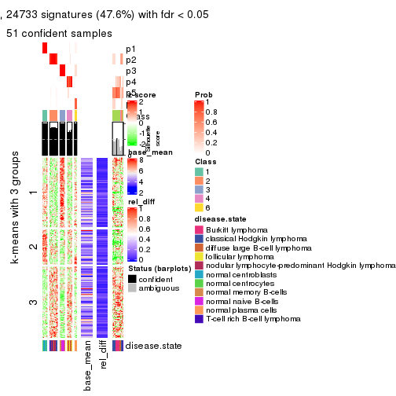</p>

</div>
</div>


Signature heatmaps where rows are not scaled:


<script>
$( function() {
	$( '#tabs-CV-skmeans-get-signatures-no-scale' ).tabs();
} );
</script>
<div id='tabs-CV-skmeans-get-signatures-no-scale'>
<ul>
<li><a href='#tab-CV-skmeans-get-signatures-no-scale-1'>k = 2</a></li>
<li><a href='#tab-CV-skmeans-get-signatures-no-scale-2'>k = 3</a></li>
<li><a href='#tab-CV-skmeans-get-signatures-no-scale-3'>k = 4</a></li>
<li><a href='#tab-CV-skmeans-get-signatures-no-scale-4'>k = 5</a></li>
<li><a href='#tab-CV-skmeans-get-signatures-no-scale-5'>k = 6</a></li>
</ul>
<div id='tab-CV-skmeans-get-signatures-no-scale-1'>
<pre><code class="r">get_signatures(res, k = 2, scale_rows = FALSE)
</code></pre>

<p></p>

</div>
<div id='tab-CV-skmeans-get-signatures-no-scale-2'>
<pre><code class="r">get_signatures(res, k = 3, scale_rows = FALSE)
</code></pre>

<p></p>

</div>
<div id='tab-CV-skmeans-get-signatures-no-scale-3'>
<pre><code class="r">get_signatures(res, k = 4, scale_rows = FALSE)
</code></pre>

<p></p>

</div>
<div id='tab-CV-skmeans-get-signatures-no-scale-4'>
<pre><code class="r">get_signatures(res, k = 5, scale_rows = FALSE)
</code></pre>

<p></p>

</div>
<div id='tab-CV-skmeans-get-signatures-no-scale-5'>
<pre><code class="r">get_signatures(res, k = 6, scale_rows = FALSE)
</code></pre>

<p></p>

</div>
</div>


Compare the overlap of signatures from different k:

```r
compare_signatures(res)
```


`get_signature()` returns a data frame invisibly. TO get the list of signatures, the function
call should be assigned to a variable explicitly. In following code, if `plot` argument is set
to `FALSE`, no heatmap is plotted while only the differential analysis is performed.

```r
# code only for demonstration
tb = get_signature(res, k = ..., plot = FALSE)
```

An example of the output of `tb` is:

```
#>   which_row         fdr    mean_1    mean_2 scaled_mean_1 scaled_mean_2 km
#> 1        38 0.042760348  8.373488  9.131774    -0.5533452     0.5164555  1
#> 2        40 0.018707592  7.106213  8.469186    -0.6173731     0.5762149  1
#> 3        55 0.019134737 10.221463 11.207825    -0.6159697     0.5749050  1
#> 4        59 0.006059896  5.921854  7.869574    -0.6899429     0.6439467  1
#> 5        60 0.018055526  8.928898 10.211722    -0.6204761     0.5791110  1
#> 6        98 0.009384629 15.714769 14.887706     0.6635654    -0.6193277  2
...
```

The columns in `tb` are:

1. `which_row`: row indices corresponding to the input matrix.
2. `fdr`: FDR for the differential test. 
3. `mean_x`: The mean value in group x.
4. `scaled_mean_x`: The mean value in group x after rows are scaled.
5. `km`: Row groups if k-means clustering is applied to rows.


UMAP plot which shows how samples are separated.


<script>
$( function() {
	$( '#tabs-CV-skmeans-dimension-reduction' ).tabs();
} );
</script>
<div id='tabs-CV-skmeans-dimension-reduction'>
<ul>
<li><a href='#tab-CV-skmeans-dimension-reduction-1'>k = 2</a></li>
<li><a href='#tab-CV-skmeans-dimension-reduction-2'>k = 3</a></li>
<li><a href='#tab-CV-skmeans-dimension-reduction-3'>k = 4</a></li>
<li><a href='#tab-CV-skmeans-dimension-reduction-4'>k = 5</a></li>
<li><a href='#tab-CV-skmeans-dimension-reduction-5'>k = 6</a></li>
</ul>
<div id='tab-CV-skmeans-dimension-reduction-1'>
<pre><code class="r">dimension_reduction(res, k = 2, method = &quot;UMAP&quot;)
</code></pre>

<p></p>

</div>
<div id='tab-CV-skmeans-dimension-reduction-2'>
<pre><code class="r">dimension_reduction(res, k = 3, method = &quot;UMAP&quot;)
</code></pre>

<p></p>

</div>
<div id='tab-CV-skmeans-dimension-reduction-3'>
<pre><code class="r">dimension_reduction(res, k = 4, method = &quot;UMAP&quot;)
</code></pre>

<p></p>

</div>
<div id='tab-CV-skmeans-dimension-reduction-4'>
<pre><code class="r">dimension_reduction(res, k = 5, method = &quot;UMAP&quot;)
</code></pre>

<p></p>

</div>
<div id='tab-CV-skmeans-dimension-reduction-5'>
<pre><code class="r">dimension_reduction(res, k = 6, method = &quot;UMAP&quot;)
</code></pre>

<p></p>

</div>
</div>


Following heatmap shows how subgroups are split when increasing `k`:

```r
collect_classes(res)
```


Test correlation between subgroups and known annotations. If the known
annotation is numeric, one-way ANOVA test is applied, and if the known
annotation is discrete, chi-squared contingency table test is applied.

```r
test_to_known_factors(res)
```

```
#>             n disease.state(p) k
#> CV:skmeans 67         7.40e-10 2
#> CV:skmeans 66         4.75e-15 3
#> CV:skmeans 66         3.31e-23 4
#> CV:skmeans 61         1.85e-20 5
#> CV:skmeans 52         2.31e-27 6
```


If matrix rows can be associated to genes, consider to use `GO_Enrichment(res,
...)` to perform function enrichment for the signature genes.


 

---------------------------------------------------


### CV:pam*


The object with results only for a single top-value method and a single partition method 
can be extracted as:

```r
res = res_list["CV", "pam"]
# you can also extract it by
# res = res_list["CV:pam"]
```

A summary of `res` and all the functions that can be applied to it:

```r
res
```

```
#> A 'ConsensusPartition' object with k = 2, 3, 4, 5, 6.
#>   On a matrix with 51941 rows and 67 columns.
#>   Top rows (1000, 2000, 3000, 4000, 5000) are extracted by 'CV' method.
#>   Subgroups are detected by 'pam' method.
#>   Performed in total 1250 partitions by row resampling.
#>   Best k for subgroups seems to be 6.
#> 
#> Following methods can be applied to this 'ConsensusPartition' object:
#>  [1] "cola_report"             "collect_classes"         "collect_plots"          
#>  [4] "collect_stats"           "colnames"                "compare_signatures"     
#>  [7] "consensus_heatmap"       "dimension_reduction"     "functional_enrichment"  
#> [10] "get_anno_col"            "get_anno"                "get_classes"            
#> [13] "get_consensus"           "get_matrix"              "get_membership"         
#> [16] "get_param"               "get_signatures"          "get_stats"              
#> [19] "is_best_k"               "is_stable_k"             "membership_heatmap"     
#> [22] "ncol"                    "nrow"                    "plot_ecdf"              
#> [25] "rownames"                "select_partition_number" "show"                   
#> [28] "suggest_best_k"          "test_to_known_factors"
```

`collect_plots()` function collects all the plots made from `res` for all `k` (number of partitions)
into one single page to provide an easy and fast comparison between different `k`.

```r
collect_plots(res)
```


The plots are:

- The first row: a plot of the ECDF (Empirical cumulative distribution
  function) curves of the consensus matrix for each `k` and the heatmap of
  predicted classes for each `k`.
- The second row: heatmaps of the consensus matrix for each `k`.
- The third row: heatmaps of the membership matrix for each `k`.
- The fouth row: heatmaps of the signatures for each `k`.

All the plots in panels can be made by individual functions and they are
plotted later in this section.

`select_partition_number()` produces several plots showing different
statistics for choosing "optimized" `k`. There are following statistics:

- ECDF curves of the consensus matrix for each `k`;
- 1-PAC. [The PAC
  score](https://en.wikipedia.org/wiki/Consensus_clustering#Over-interpretation_potential_of_consensus_clustering)
  measures the proportion of the ambiguous subgrouping.
- Mean silhouette score.
- Concordance. The mean probability of fiting the consensus class ids in all
  partitions.
- Area increased. Denote $A_k$ as the area under the ECDF curve for current
  `k`, the area increased is defined as $A_k - A_{k-1}$.
- Rand index. The percent of pairs of samples that are both in a same cluster
  or both are not in a same cluster in the partition of k and k-1.
- Jaccard index. The ratio of pairs of samples are both in a same cluster in
  the partition of k and k-1 and the pairs of samples are both in a same
  cluster in the partition k or k-1.

The detailed explanations of these statistics can be found in [the cola
vignette](http://bioconductor.org/packages/devel/bioc/vignettes/cola/inst/doc/cola.html#toc_13).

Generally speaking, lower PAC score, higher mean silhouette score or higher
concordance corresponds to better partition. Rand index and Jaccard index
measure how similar the current partition is compared to partition with `k-1`.
If they are too similar, we won't accept `k` is better than `k-1`.

```r
select_partition_number(res)
```


The numeric values for all these statistics can be obtained by `get_stats()`.

```r
get_stats(res)
```

```
#>   k 1-PAC mean_silhouette concordance area_increased  Rand Jaccard
#> 2 2 1.000           0.998       0.999         0.4758 0.525   0.525
#> 3 3 0.962           0.941       0.958         0.1582 0.935   0.876
#> 4 4 0.907           0.946       0.949         0.0682 0.973   0.941
#> 5 5 0.827           0.843       0.931         0.2856 0.801   0.540
#> 6 6 0.917           0.859       0.945         0.0607 0.919   0.681
```

`suggest_best_k()` suggests the best $k$ based on these statistics. The rules are as follows:

- All $k$ with Jaccard index larger than 0.95 are removed because the increase of
  the partition number does not provides enough extra information. If all $k$ are removed,
  the best $k$ is assigned by `NA`.
- For $k$ with 1-PAC larger than 0.9, the maximal $k$ is taken as the "best k". Other $k$ is called "optional k".
- If it does not fit the second rule. The $k$ with the highest vote of highest
  1-PAC, mean silhouette and concordance is taken as the "best k".

```r
suggest_best_k(res)
```

```
#> [1] 6
#> attr(,"optional")
#> [1] 2 3 4
```

There is also optional best $k$ = 2 3 4 that is worth to check.

Following shows the table of the partitions (You need to click the **show/hide
code output** link to see it). The membership matrix (columns with name `p*`)
is inferred by
[`clue::cl_consensus()`](https://www.rdocumentation.org/link/cl_consensus?package=clue)
function with the `SE` method. Basically the value in the membership matrix
represents the probability to belong to a certain group. The finall class
label for an item is determined with the group with highest probability it
belongs to.

In `get_classes()` function, the entropy is calculated from the membership
matrix and the silhouette score is calculated from the consensus matrix.


<script>
$( function() {
	$( '#tabs-CV-pam-get-classes' ).tabs();
} );
</script>
<div id='tabs-CV-pam-get-classes'>
<ul>
<li><a href='#tab-CV-pam-get-classes-1'>k = 2</a></li>
<li><a href='#tab-CV-pam-get-classes-2'>k = 3</a></li>
<li><a href='#tab-CV-pam-get-classes-3'>k = 4</a></li>
<li><a href='#tab-CV-pam-get-classes-4'>k = 5</a></li>
<li><a href='#tab-CV-pam-get-classes-5'>k = 6</a></li>
</ul>

<div id='tab-CV-pam-get-classes-1'>
<p><a id='tab-CV-pam-get-classes-1-a' style='color:#0366d6' href='#'>show/hide code output</a></p>
<pre><code class="r">cbind(get_classes(res, k = 2), get_membership(res, k = 2))
</code></pre>

<pre><code>#&gt;           class entropy silhouette    p1    p2
#&gt; GSM312811     2   0.000      0.999 0.000 1.000
#&gt; GSM312812     2   0.000      0.999 0.000 1.000
#&gt; GSM312813     2   0.000      0.999 0.000 1.000
#&gt; GSM312814     2   0.000      0.999 0.000 1.000
#&gt; GSM312815     2   0.000      0.999 0.000 1.000
#&gt; GSM312816     2   0.000      0.999 0.000 1.000
#&gt; GSM312817     2   0.000      0.999 0.000 1.000
#&gt; GSM312818     2   0.000      0.999 0.000 1.000
#&gt; GSM312819     2   0.000      0.999 0.000 1.000
#&gt; GSM312820     2   0.000      0.999 0.000 1.000
#&gt; GSM312821     2   0.000      0.999 0.000 1.000
#&gt; GSM312822     2   0.000      0.999 0.000 1.000
#&gt; GSM312823     2   0.000      0.999 0.000 1.000
#&gt; GSM312824     2   0.000      0.999 0.000 1.000
#&gt; GSM312825     2   0.000      0.999 0.000 1.000
#&gt; GSM312826     2   0.000      0.999 0.000 1.000
#&gt; GSM312839     2   0.000      0.999 0.000 1.000
#&gt; GSM312840     2   0.000      0.999 0.000 1.000
#&gt; GSM312841     2   0.000      0.999 0.000 1.000
#&gt; GSM312843     2   0.000      0.999 0.000 1.000
#&gt; GSM312844     2   0.000      0.999 0.000 1.000
#&gt; GSM312845     2   0.311      0.941 0.056 0.944
#&gt; GSM312846     2   0.000      0.999 0.000 1.000
#&gt; GSM312847     2   0.000      0.999 0.000 1.000
#&gt; GSM312848     2   0.000      0.999 0.000 1.000
#&gt; GSM312849     2   0.000      0.999 0.000 1.000
#&gt; GSM312851     2   0.000      0.999 0.000 1.000
#&gt; GSM312853     2   0.000      0.999 0.000 1.000
#&gt; GSM312854     2   0.000      0.999 0.000 1.000
#&gt; GSM312856     2   0.000      0.999 0.000 1.000
#&gt; GSM312857     2   0.000      0.999 0.000 1.000
#&gt; GSM312858     2   0.000      0.999 0.000 1.000
#&gt; GSM312859     2   0.000      0.999 0.000 1.000
#&gt; GSM312860     2   0.000      0.999 0.000 1.000
#&gt; GSM312861     2   0.000      0.999 0.000 1.000
#&gt; GSM312862     2   0.000      0.999 0.000 1.000
#&gt; GSM312863     2   0.000      0.999 0.000 1.000
#&gt; GSM312864     2   0.000      0.999 0.000 1.000
#&gt; GSM312865     2   0.000      0.999 0.000 1.000
#&gt; GSM312867     2   0.000      0.999 0.000 1.000
#&gt; GSM312868     2   0.000      0.999 0.000 1.000
#&gt; GSM312869     2   0.000      0.999 0.000 1.000
#&gt; GSM312870     1   0.000      1.000 1.000 0.000
#&gt; GSM312872     1   0.000      1.000 1.000 0.000
#&gt; GSM312874     1   0.000      1.000 1.000 0.000
#&gt; GSM312875     1   0.000      1.000 1.000 0.000
#&gt; GSM312876     1   0.000      1.000 1.000 0.000
#&gt; GSM312877     1   0.000      1.000 1.000 0.000
#&gt; GSM312879     1   0.000      1.000 1.000 0.000
#&gt; GSM312882     1   0.000      1.000 1.000 0.000
#&gt; GSM312883     1   0.000      1.000 1.000 0.000
#&gt; GSM312886     1   0.000      1.000 1.000 0.000
#&gt; GSM312887     1   0.000      1.000 1.000 0.000
#&gt; GSM312890     1   0.000      1.000 1.000 0.000
#&gt; GSM312893     1   0.000      1.000 1.000 0.000
#&gt; GSM312894     1   0.000      1.000 1.000 0.000
#&gt; GSM312895     1   0.000      1.000 1.000 0.000
#&gt; GSM312937     1   0.000      1.000 1.000 0.000
#&gt; GSM312938     1   0.000      1.000 1.000 0.000
#&gt; GSM312939     1   0.000      1.000 1.000 0.000
#&gt; GSM312940     1   0.000      1.000 1.000 0.000
#&gt; GSM312941     1   0.000      1.000 1.000 0.000
#&gt; GSM312942     1   0.000      1.000 1.000 0.000
#&gt; GSM312943     1   0.000      1.000 1.000 0.000
#&gt; GSM312944     1   0.000      1.000 1.000 0.000
#&gt; GSM312945     1   0.000      1.000 1.000 0.000
#&gt; GSM312946     1   0.000      1.000 1.000 0.000
</code></pre>

<script>
$('#tab-CV-pam-get-classes-1-a').parent().next().next().hide();
$('#tab-CV-pam-get-classes-1-a').click(function(){
  $('#tab-CV-pam-get-classes-1-a').parent().next().next().toggle();
  return(false);
});
</script>
</div>

<div id='tab-CV-pam-get-classes-2'>
<p><a id='tab-CV-pam-get-classes-2-a' style='color:#0366d6' href='#'>show/hide code output</a></p>
<pre><code class="r">cbind(get_classes(res, k = 3), get_membership(res, k = 3))
</code></pre>

<pre><code>#&gt;           class entropy silhouette    p1    p2    p3
#&gt; GSM312811     2  0.0892      0.973 0.000 0.980 0.020
#&gt; GSM312812     2  0.0892      0.973 0.000 0.980 0.020
#&gt; GSM312813     2  0.0892      0.973 0.000 0.980 0.020
#&gt; GSM312814     2  0.0892      0.973 0.000 0.980 0.020
#&gt; GSM312815     2  0.0892      0.973 0.000 0.980 0.020
#&gt; GSM312816     2  0.0892      0.973 0.000 0.980 0.020
#&gt; GSM312817     2  0.0892      0.973 0.000 0.980 0.020
#&gt; GSM312818     2  0.0592      0.973 0.000 0.988 0.012
#&gt; GSM312819     2  0.0892      0.973 0.000 0.980 0.020
#&gt; GSM312820     2  0.0000      0.973 0.000 1.000 0.000
#&gt; GSM312821     2  0.0592      0.973 0.000 0.988 0.012
#&gt; GSM312822     2  0.0892      0.973 0.000 0.980 0.020
#&gt; GSM312823     2  0.0892      0.973 0.000 0.980 0.020
#&gt; GSM312824     2  0.0892      0.973 0.000 0.980 0.020
#&gt; GSM312825     2  0.0892      0.973 0.000 0.980 0.020
#&gt; GSM312826     2  0.0892      0.973 0.000 0.980 0.020
#&gt; GSM312839     2  0.0892      0.973 0.000 0.980 0.020
#&gt; GSM312840     2  0.0892      0.973 0.000 0.980 0.020
#&gt; GSM312841     2  0.0892      0.973 0.000 0.980 0.020
#&gt; GSM312843     2  0.1031      0.972 0.000 0.976 0.024
#&gt; GSM312844     2  0.0892      0.973 0.000 0.980 0.020
#&gt; GSM312845     2  0.6541      0.557 0.304 0.672 0.024
#&gt; GSM312846     2  0.1031      0.972 0.000 0.976 0.024
#&gt; GSM312847     2  0.1031      0.972 0.000 0.976 0.024
#&gt; GSM312848     2  0.1031      0.972 0.000 0.976 0.024
#&gt; GSM312849     2  0.1031      0.972 0.000 0.976 0.024
#&gt; GSM312851     2  0.1031      0.972 0.000 0.976 0.024
#&gt; GSM312853     2  0.1031      0.972 0.000 0.976 0.024
#&gt; GSM312854     2  0.1031      0.972 0.000 0.976 0.024
#&gt; GSM312856     2  0.1031      0.972 0.000 0.976 0.024
#&gt; GSM312857     2  0.1031      0.972 0.000 0.976 0.024
#&gt; GSM312858     2  0.1031      0.972 0.000 0.976 0.024
#&gt; GSM312859     2  0.0892      0.973 0.000 0.980 0.020
#&gt; GSM312860     2  0.0892      0.973 0.000 0.980 0.020
#&gt; GSM312861     2  0.1031      0.972 0.000 0.976 0.024
#&gt; GSM312862     2  0.1031      0.972 0.000 0.976 0.024
#&gt; GSM312863     2  0.1031      0.972 0.000 0.976 0.024
#&gt; GSM312864     2  0.1031      0.972 0.000 0.976 0.024
#&gt; GSM312865     2  0.1031      0.972 0.000 0.976 0.024
#&gt; GSM312867     2  0.1031      0.972 0.000 0.976 0.024
#&gt; GSM312868     2  0.1031      0.972 0.000 0.976 0.024
#&gt; GSM312869     2  0.0892      0.973 0.000 0.980 0.020
#&gt; GSM312870     3  0.1643      1.000 0.044 0.000 0.956
#&gt; GSM312872     3  0.1643      1.000 0.044 0.000 0.956
#&gt; GSM312874     3  0.1643      1.000 0.044 0.000 0.956
#&gt; GSM312875     3  0.1643      1.000 0.044 0.000 0.956
#&gt; GSM312876     3  0.1643      1.000 0.044 0.000 0.956
#&gt; GSM312877     1  0.6192      0.367 0.580 0.000 0.420
#&gt; GSM312879     3  0.1643      1.000 0.044 0.000 0.956
#&gt; GSM312882     3  0.1643      1.000 0.044 0.000 0.956
#&gt; GSM312883     3  0.1643      1.000 0.044 0.000 0.956
#&gt; GSM312886     3  0.1643      1.000 0.044 0.000 0.956
#&gt; GSM312887     1  0.0000      0.907 1.000 0.000 0.000
#&gt; GSM312890     1  0.0000      0.907 1.000 0.000 0.000
#&gt; GSM312893     1  0.0000      0.907 1.000 0.000 0.000
#&gt; GSM312894     1  0.0000      0.907 1.000 0.000 0.000
#&gt; GSM312895     1  0.0000      0.907 1.000 0.000 0.000
#&gt; GSM312937     1  0.0000      0.907 1.000 0.000 0.000
#&gt; GSM312938     1  0.0000      0.907 1.000 0.000 0.000
#&gt; GSM312939     1  0.0000      0.907 1.000 0.000 0.000
#&gt; GSM312940     1  0.0000      0.907 1.000 0.000 0.000
#&gt; GSM312941     1  0.0000      0.907 1.000 0.000 0.000
#&gt; GSM312942     1  0.4178      0.829 0.828 0.000 0.172
#&gt; GSM312943     1  0.4121      0.832 0.832 0.000 0.168
#&gt; GSM312944     1  0.4121      0.832 0.832 0.000 0.168
#&gt; GSM312945     1  0.4121      0.832 0.832 0.000 0.168
#&gt; GSM312946     1  0.4121      0.832 0.832 0.000 0.168
</code></pre>

<script>
$('#tab-CV-pam-get-classes-2-a').parent().next().next().hide();
$('#tab-CV-pam-get-classes-2-a').click(function(){
  $('#tab-CV-pam-get-classes-2-a').parent().next().next().toggle();
  return(false);
});
</script>
</div>

<div id='tab-CV-pam-get-classes-3'>
<p><a id='tab-CV-pam-get-classes-3-a' style='color:#0366d6' href='#'>show/hide code output</a></p>
<pre><code class="r">cbind(get_classes(res, k = 4), get_membership(res, k = 4))
</code></pre>

<pre><code>#&gt;           class entropy silhouette    p1    p2    p3    p4
#&gt; GSM312811     2   0.000      0.953 0.000 1.000 0.000 0.000
#&gt; GSM312812     2   0.000      0.953 0.000 1.000 0.000 0.000
#&gt; GSM312813     2   0.000      0.953 0.000 1.000 0.000 0.000
#&gt; GSM312814     2   0.000      0.953 0.000 1.000 0.000 0.000
#&gt; GSM312815     2   0.000      0.953 0.000 1.000 0.000 0.000
#&gt; GSM312816     2   0.194      0.929 0.000 0.924 0.000 0.076
#&gt; GSM312817     2   0.000      0.953 0.000 1.000 0.000 0.000
#&gt; GSM312818     2   0.253      0.927 0.000 0.888 0.000 0.112
#&gt; GSM312819     2   0.000      0.953 0.000 1.000 0.000 0.000
#&gt; GSM312820     2   0.228      0.929 0.000 0.904 0.000 0.096
#&gt; GSM312821     2   0.247      0.928 0.000 0.892 0.000 0.108
#&gt; GSM312822     2   0.000      0.953 0.000 1.000 0.000 0.000
#&gt; GSM312823     2   0.000      0.953 0.000 1.000 0.000 0.000
#&gt; GSM312824     2   0.000      0.953 0.000 1.000 0.000 0.000
#&gt; GSM312825     2   0.000      0.953 0.000 1.000 0.000 0.000
#&gt; GSM312826     2   0.000      0.953 0.000 1.000 0.000 0.000
#&gt; GSM312839     2   0.000      0.953 0.000 1.000 0.000 0.000
#&gt; GSM312840     2   0.000      0.953 0.000 1.000 0.000 0.000
#&gt; GSM312841     2   0.000      0.953 0.000 1.000 0.000 0.000
#&gt; GSM312843     2   0.164      0.949 0.000 0.940 0.000 0.060
#&gt; GSM312844     2   0.000      0.953 0.000 1.000 0.000 0.000
#&gt; GSM312845     2   0.515      0.743 0.200 0.740 0.000 0.060
#&gt; GSM312846     2   0.164      0.949 0.000 0.940 0.000 0.060
#&gt; GSM312847     2   0.164      0.949 0.000 0.940 0.000 0.060
#&gt; GSM312848     2   0.164      0.949 0.000 0.940 0.000 0.060
#&gt; GSM312849     2   0.156      0.950 0.000 0.944 0.000 0.056
#&gt; GSM312851     2   0.281      0.922 0.000 0.868 0.000 0.132
#&gt; GSM312853     2   0.281      0.922 0.000 0.868 0.000 0.132
#&gt; GSM312854     2   0.281      0.922 0.000 0.868 0.000 0.132
#&gt; GSM312856     2   0.281      0.922 0.000 0.868 0.000 0.132
#&gt; GSM312857     2   0.281      0.922 0.000 0.868 0.000 0.132
#&gt; GSM312858     2   0.164      0.949 0.000 0.940 0.000 0.060
#&gt; GSM312859     2   0.000      0.953 0.000 1.000 0.000 0.000
#&gt; GSM312860     2   0.000      0.953 0.000 1.000 0.000 0.000
#&gt; GSM312861     2   0.164      0.949 0.000 0.940 0.000 0.060
#&gt; GSM312862     2   0.164      0.949 0.000 0.940 0.000 0.060
#&gt; GSM312863     2   0.281      0.922 0.000 0.868 0.000 0.132
#&gt; GSM312864     2   0.281      0.922 0.000 0.868 0.000 0.132
#&gt; GSM312865     2   0.164      0.949 0.000 0.940 0.000 0.060
#&gt; GSM312867     2   0.164      0.949 0.000 0.940 0.000 0.060
#&gt; GSM312868     2   0.164      0.949 0.000 0.940 0.000 0.060
#&gt; GSM312869     2   0.000      0.953 0.000 1.000 0.000 0.000
#&gt; GSM312870     3   0.000      1.000 0.000 0.000 1.000 0.000
#&gt; GSM312872     3   0.000      1.000 0.000 0.000 1.000 0.000
#&gt; GSM312874     3   0.000      1.000 0.000 0.000 1.000 0.000
#&gt; GSM312875     3   0.000      1.000 0.000 0.000 1.000 0.000
#&gt; GSM312876     3   0.000      1.000 0.000 0.000 1.000 0.000
#&gt; GSM312877     4   0.762      0.376 0.208 0.000 0.356 0.436
#&gt; GSM312879     3   0.000      1.000 0.000 0.000 1.000 0.000
#&gt; GSM312882     3   0.000      1.000 0.000 0.000 1.000 0.000
#&gt; GSM312883     3   0.000      1.000 0.000 0.000 1.000 0.000
#&gt; GSM312886     3   0.000      1.000 0.000 0.000 1.000 0.000
#&gt; GSM312887     1   0.000      1.000 1.000 0.000 0.000 0.000
#&gt; GSM312890     1   0.000      1.000 1.000 0.000 0.000 0.000
#&gt; GSM312893     1   0.000      1.000 1.000 0.000 0.000 0.000
#&gt; GSM312894     1   0.000      1.000 1.000 0.000 0.000 0.000
#&gt; GSM312895     1   0.000      1.000 1.000 0.000 0.000 0.000
#&gt; GSM312937     1   0.000      1.000 1.000 0.000 0.000 0.000
#&gt; GSM312938     1   0.000      1.000 1.000 0.000 0.000 0.000
#&gt; GSM312939     1   0.000      1.000 1.000 0.000 0.000 0.000
#&gt; GSM312940     1   0.000      1.000 1.000 0.000 0.000 0.000
#&gt; GSM312941     1   0.000      1.000 1.000 0.000 0.000 0.000
#&gt; GSM312942     4   0.340      0.915 0.092 0.000 0.040 0.868
#&gt; GSM312943     4   0.340      0.915 0.092 0.000 0.040 0.868
#&gt; GSM312944     4   0.340      0.915 0.092 0.000 0.040 0.868
#&gt; GSM312945     4   0.340      0.915 0.092 0.000 0.040 0.868
#&gt; GSM312946     4   0.340      0.915 0.092 0.000 0.040 0.868
</code></pre>

<script>
$('#tab-CV-pam-get-classes-3-a').parent().next().next().hide();
$('#tab-CV-pam-get-classes-3-a').click(function(){
  $('#tab-CV-pam-get-classes-3-a').parent().next().next().toggle();
  return(false);
});
</script>
</div>

<div id='tab-CV-pam-get-classes-4'>
<p><a id='tab-CV-pam-get-classes-4-a' style='color:#0366d6' href='#'>show/hide code output</a></p>
<pre><code class="r">cbind(get_classes(res, k = 5), get_membership(res, k = 5))
</code></pre>

<pre><code>#&gt;           class entropy silhouette    p1    p2    p3    p4    p5
#&gt; GSM312811     2   0.000      0.940 0.000 1.000 0.000 0.000 0.000
#&gt; GSM312812     2   0.000      0.940 0.000 1.000 0.000 0.000 0.000
#&gt; GSM312813     2   0.000      0.940 0.000 1.000 0.000 0.000 0.000
#&gt; GSM312814     2   0.000      0.940 0.000 1.000 0.000 0.000 0.000
#&gt; GSM312815     2   0.000      0.940 0.000 1.000 0.000 0.000 0.000
#&gt; GSM312816     4   0.386      0.518 0.000 0.312 0.000 0.688 0.000
#&gt; GSM312817     2   0.120      0.887 0.000 0.952 0.000 0.048 0.000
#&gt; GSM312818     4   0.148      0.764 0.000 0.064 0.000 0.936 0.000
#&gt; GSM312819     2   0.000      0.940 0.000 1.000 0.000 0.000 0.000
#&gt; GSM312820     4   0.260      0.707 0.000 0.148 0.000 0.852 0.000
#&gt; GSM312821     4   0.191      0.750 0.000 0.092 0.000 0.908 0.000
#&gt; GSM312822     2   0.000      0.940 0.000 1.000 0.000 0.000 0.000
#&gt; GSM312823     2   0.000      0.940 0.000 1.000 0.000 0.000 0.000
#&gt; GSM312824     2   0.000      0.940 0.000 1.000 0.000 0.000 0.000
#&gt; GSM312825     2   0.000      0.940 0.000 1.000 0.000 0.000 0.000
#&gt; GSM312826     2   0.000      0.940 0.000 1.000 0.000 0.000 0.000
#&gt; GSM312839     2   0.000      0.940 0.000 1.000 0.000 0.000 0.000
#&gt; GSM312840     2   0.000      0.940 0.000 1.000 0.000 0.000 0.000
#&gt; GSM312841     2   0.000      0.940 0.000 1.000 0.000 0.000 0.000
#&gt; GSM312843     4   0.318      0.762 0.000 0.208 0.000 0.792 0.000
#&gt; GSM312844     2   0.000      0.940 0.000 1.000 0.000 0.000 0.000
#&gt; GSM312845     4   0.369      0.676 0.200 0.020 0.000 0.780 0.000
#&gt; GSM312846     2   0.421      0.141 0.000 0.588 0.000 0.412 0.000
#&gt; GSM312847     4   0.318      0.762 0.000 0.208 0.000 0.792 0.000
#&gt; GSM312848     4   0.318      0.762 0.000 0.208 0.000 0.792 0.000
#&gt; GSM312849     2   0.311      0.682 0.000 0.800 0.000 0.200 0.000
#&gt; GSM312851     4   0.000      0.780 0.000 0.000 0.000 1.000 0.000
#&gt; GSM312853     4   0.000      0.780 0.000 0.000 0.000 1.000 0.000
#&gt; GSM312854     4   0.000      0.780 0.000 0.000 0.000 1.000 0.000
#&gt; GSM312856     4   0.000      0.780 0.000 0.000 0.000 1.000 0.000
#&gt; GSM312857     4   0.000      0.780 0.000 0.000 0.000 1.000 0.000
#&gt; GSM312858     4   0.318      0.762 0.000 0.208 0.000 0.792 0.000
#&gt; GSM312859     2   0.000      0.940 0.000 1.000 0.000 0.000 0.000
#&gt; GSM312860     2   0.000      0.940 0.000 1.000 0.000 0.000 0.000
#&gt; GSM312861     4   0.431      0.145 0.000 0.500 0.000 0.500 0.000
#&gt; GSM312862     2   0.400      0.366 0.000 0.656 0.000 0.344 0.000
#&gt; GSM312863     4   0.000      0.780 0.000 0.000 0.000 1.000 0.000
#&gt; GSM312864     4   0.000      0.780 0.000 0.000 0.000 1.000 0.000
#&gt; GSM312865     4   0.318      0.762 0.000 0.208 0.000 0.792 0.000
#&gt; GSM312867     4   0.430      0.201 0.000 0.484 0.000 0.516 0.000
#&gt; GSM312868     4   0.318      0.762 0.000 0.208 0.000 0.792 0.000
#&gt; GSM312869     2   0.000      0.940 0.000 1.000 0.000 0.000 0.000
#&gt; GSM312870     3   0.000      1.000 0.000 0.000 1.000 0.000 0.000
#&gt; GSM312872     3   0.000      1.000 0.000 0.000 1.000 0.000 0.000
#&gt; GSM312874     3   0.000      1.000 0.000 0.000 1.000 0.000 0.000
#&gt; GSM312875     3   0.000      1.000 0.000 0.000 1.000 0.000 0.000
#&gt; GSM312876     3   0.000      1.000 0.000 0.000 1.000 0.000 0.000
#&gt; GSM312877     5   0.654      0.221 0.204 0.000 0.352 0.000 0.444
#&gt; GSM312879     3   0.000      1.000 0.000 0.000 1.000 0.000 0.000
#&gt; GSM312882     3   0.000      1.000 0.000 0.000 1.000 0.000 0.000
#&gt; GSM312883     3   0.000      1.000 0.000 0.000 1.000 0.000 0.000
#&gt; GSM312886     3   0.000      1.000 0.000 0.000 1.000 0.000 0.000
#&gt; GSM312887     1   0.000      1.000 1.000 0.000 0.000 0.000 0.000
#&gt; GSM312890     1   0.000      1.000 1.000 0.000 0.000 0.000 0.000
#&gt; GSM312893     1   0.000      1.000 1.000 0.000 0.000 0.000 0.000
#&gt; GSM312894     1   0.000      1.000 1.000 0.000 0.000 0.000 0.000
#&gt; GSM312895     1   0.000      1.000 1.000 0.000 0.000 0.000 0.000
#&gt; GSM312937     1   0.000      1.000 1.000 0.000 0.000 0.000 0.000
#&gt; GSM312938     1   0.000      1.000 1.000 0.000 0.000 0.000 0.000
#&gt; GSM312939     1   0.000      1.000 1.000 0.000 0.000 0.000 0.000
#&gt; GSM312940     1   0.000      1.000 1.000 0.000 0.000 0.000 0.000
#&gt; GSM312941     1   0.000      1.000 1.000 0.000 0.000 0.000 0.000
#&gt; GSM312942     5   0.000      0.901 0.000 0.000 0.000 0.000 1.000
#&gt; GSM312943     5   0.000      0.901 0.000 0.000 0.000 0.000 1.000
#&gt; GSM312944     5   0.000      0.901 0.000 0.000 0.000 0.000 1.000
#&gt; GSM312945     5   0.000      0.901 0.000 0.000 0.000 0.000 1.000
#&gt; GSM312946     5   0.000      0.901 0.000 0.000 0.000 0.000 1.000
</code></pre>

<script>
$('#tab-CV-pam-get-classes-4-a').parent().next().next().hide();
$('#tab-CV-pam-get-classes-4-a').click(function(){
  $('#tab-CV-pam-get-classes-4-a').parent().next().next().toggle();
  return(false);
});
</script>
</div>

<div id='tab-CV-pam-get-classes-5'>
<p><a id='tab-CV-pam-get-classes-5-a' style='color:#0366d6' href='#'>show/hide code output</a></p>
<pre><code class="r">cbind(get_classes(res, k = 6), get_membership(res, k = 6))
</code></pre>

<pre><code>#&gt;           class entropy silhouette    p1    p2    p3    p4    p5    p6
#&gt; GSM312811     2  0.3198      0.546 0.000 0.740 0.000 0.000 0.260 0.000
#&gt; GSM312812     2  0.0000      0.856 0.000 1.000 0.000 0.000 0.000 0.000
#&gt; GSM312813     2  0.0000      0.856 0.000 1.000 0.000 0.000 0.000 0.000
#&gt; GSM312814     5  0.3782      0.300 0.000 0.412 0.000 0.000 0.588 0.000
#&gt; GSM312815     2  0.0146      0.853 0.000 0.996 0.000 0.000 0.004 0.000
#&gt; GSM312816     5  0.0000      0.775 0.000 0.000 0.000 0.000 1.000 0.000
#&gt; GSM312817     2  0.1471      0.800 0.000 0.932 0.000 0.064 0.004 0.000
#&gt; GSM312818     5  0.0000      0.775 0.000 0.000 0.000 0.000 1.000 0.000
#&gt; GSM312819     2  0.0000      0.856 0.000 1.000 0.000 0.000 0.000 0.000
#&gt; GSM312820     5  0.0000      0.775 0.000 0.000 0.000 0.000 1.000 0.000
#&gt; GSM312821     5  0.0000      0.775 0.000 0.000 0.000 0.000 1.000 0.000
#&gt; GSM312822     5  0.3221      0.608 0.000 0.264 0.000 0.000 0.736 0.000
#&gt; GSM312823     2  0.0000      0.856 0.000 1.000 0.000 0.000 0.000 0.000
#&gt; GSM312824     2  0.0000      0.856 0.000 1.000 0.000 0.000 0.000 0.000
#&gt; GSM312825     2  0.0000      0.856 0.000 1.000 0.000 0.000 0.000 0.000
#&gt; GSM312826     2  0.0000      0.856 0.000 1.000 0.000 0.000 0.000 0.000
#&gt; GSM312839     2  0.0000      0.856 0.000 1.000 0.000 0.000 0.000 0.000
#&gt; GSM312840     2  0.0000      0.856 0.000 1.000 0.000 0.000 0.000 0.000
#&gt; GSM312841     2  0.0000      0.856 0.000 1.000 0.000 0.000 0.000 0.000
#&gt; GSM312843     4  0.0000      0.984 0.000 0.000 0.000 1.000 0.000 0.000
#&gt; GSM312844     2  0.0000      0.856 0.000 1.000 0.000 0.000 0.000 0.000
#&gt; GSM312845     4  0.3037      0.763 0.176 0.016 0.000 0.808 0.000 0.000
#&gt; GSM312846     2  0.3782      0.413 0.000 0.588 0.000 0.412 0.000 0.000
#&gt; GSM312847     4  0.0000      0.984 0.000 0.000 0.000 1.000 0.000 0.000
#&gt; GSM312848     4  0.0000      0.984 0.000 0.000 0.000 1.000 0.000 0.000
#&gt; GSM312849     2  0.2793      0.684 0.000 0.800 0.000 0.200 0.000 0.000
#&gt; GSM312851     4  0.0000      0.984 0.000 0.000 0.000 1.000 0.000 0.000
#&gt; GSM312853     4  0.0000      0.984 0.000 0.000 0.000 1.000 0.000 0.000
#&gt; GSM312854     4  0.0000      0.984 0.000 0.000 0.000 1.000 0.000 0.000
#&gt; GSM312856     4  0.0000      0.984 0.000 0.000 0.000 1.000 0.000 0.000
#&gt; GSM312857     4  0.0000      0.984 0.000 0.000 0.000 1.000 0.000 0.000
#&gt; GSM312858     4  0.0000      0.984 0.000 0.000 0.000 1.000 0.000 0.000
#&gt; GSM312859     2  0.0000      0.856 0.000 1.000 0.000 0.000 0.000 0.000
#&gt; GSM312860     2  0.0000      0.856 0.000 1.000 0.000 0.000 0.000 0.000
#&gt; GSM312861     2  0.3857      0.274 0.000 0.532 0.000 0.468 0.000 0.000
#&gt; GSM312862     2  0.3592      0.524 0.000 0.656 0.000 0.344 0.000 0.000
#&gt; GSM312863     4  0.0000      0.984 0.000 0.000 0.000 1.000 0.000 0.000
#&gt; GSM312864     4  0.0000      0.984 0.000 0.000 0.000 1.000 0.000 0.000
#&gt; GSM312865     4  0.0000      0.984 0.000 0.000 0.000 1.000 0.000 0.000
#&gt; GSM312867     2  0.3866      0.228 0.000 0.516 0.000 0.484 0.000 0.000
#&gt; GSM312868     4  0.0000      0.984 0.000 0.000 0.000 1.000 0.000 0.000
#&gt; GSM312869     2  0.0000      0.856 0.000 1.000 0.000 0.000 0.000 0.000
#&gt; GSM312870     3  0.0000      1.000 0.000 0.000 1.000 0.000 0.000 0.000
#&gt; GSM312872     3  0.0000      1.000 0.000 0.000 1.000 0.000 0.000 0.000
#&gt; GSM312874     3  0.0000      1.000 0.000 0.000 1.000 0.000 0.000 0.000
#&gt; GSM312875     3  0.0000      1.000 0.000 0.000 1.000 0.000 0.000 0.000
#&gt; GSM312876     3  0.0000      1.000 0.000 0.000 1.000 0.000 0.000 0.000
#&gt; GSM312877     6  0.5873      0.221 0.204 0.000 0.352 0.000 0.000 0.444
#&gt; GSM312879     3  0.0000      1.000 0.000 0.000 1.000 0.000 0.000 0.000
#&gt; GSM312882     3  0.0000      1.000 0.000 0.000 1.000 0.000 0.000 0.000
#&gt; GSM312883     3  0.0000      1.000 0.000 0.000 1.000 0.000 0.000 0.000
#&gt; GSM312886     3  0.0000      1.000 0.000 0.000 1.000 0.000 0.000 0.000
#&gt; GSM312887     1  0.0000      1.000 1.000 0.000 0.000 0.000 0.000 0.000
#&gt; GSM312890     1  0.0000      1.000 1.000 0.000 0.000 0.000 0.000 0.000
#&gt; GSM312893     1  0.0000      1.000 1.000 0.000 0.000 0.000 0.000 0.000
#&gt; GSM312894     1  0.0000      1.000 1.000 0.000 0.000 0.000 0.000 0.000
#&gt; GSM312895     1  0.0000      1.000 1.000 0.000 0.000 0.000 0.000 0.000
#&gt; GSM312937     1  0.0000      1.000 1.000 0.000 0.000 0.000 0.000 0.000
#&gt; GSM312938     1  0.0000      1.000 1.000 0.000 0.000 0.000 0.000 0.000
#&gt; GSM312939     1  0.0000      1.000 1.000 0.000 0.000 0.000 0.000 0.000
#&gt; GSM312940     1  0.0000      1.000 1.000 0.000 0.000 0.000 0.000 0.000
#&gt; GSM312941     1  0.0000      1.000 1.000 0.000 0.000 0.000 0.000 0.000
#&gt; GSM312942     6  0.0000      0.887 0.000 0.000 0.000 0.000 0.000 1.000
#&gt; GSM312943     6  0.0000      0.887 0.000 0.000 0.000 0.000 0.000 1.000
#&gt; GSM312944     6  0.0000      0.887 0.000 0.000 0.000 0.000 0.000 1.000
#&gt; GSM312945     6  0.0000      0.887 0.000 0.000 0.000 0.000 0.000 1.000
#&gt; GSM312946     6  0.0000      0.887 0.000 0.000 0.000 0.000 0.000 1.000
</code></pre>

<script>
$('#tab-CV-pam-get-classes-5-a').parent().next().next().hide();
$('#tab-CV-pam-get-classes-5-a').click(function(){
  $('#tab-CV-pam-get-classes-5-a').parent().next().next().toggle();
  return(false);
});
</script>
</div>
</div>

Heatmaps for the consensus matrix. It visualizes the probability of two
samples to be in a same group.


<script>
$( function() {
	$( '#tabs-CV-pam-consensus-heatmap' ).tabs();
} );
</script>
<div id='tabs-CV-pam-consensus-heatmap'>
<ul>
<li><a href='#tab-CV-pam-consensus-heatmap-1'>k = 2</a></li>
<li><a href='#tab-CV-pam-consensus-heatmap-2'>k = 3</a></li>
<li><a href='#tab-CV-pam-consensus-heatmap-3'>k = 4</a></li>
<li><a href='#tab-CV-pam-consensus-heatmap-4'>k = 5</a></li>
<li><a href='#tab-CV-pam-consensus-heatmap-5'>k = 6</a></li>
</ul>
<div id='tab-CV-pam-consensus-heatmap-1'>
<pre><code class="r">consensus_heatmap(res, k = 2)
</code></pre>

<p></p>

</div>
<div id='tab-CV-pam-consensus-heatmap-2'>
<pre><code class="r">consensus_heatmap(res, k = 3)
</code></pre>

<p></p>

</div>
<div id='tab-CV-pam-consensus-heatmap-3'>
<pre><code class="r">consensus_heatmap(res, k = 4)
</code></pre>

<p></p>

</div>
<div id='tab-CV-pam-consensus-heatmap-4'>
<pre><code class="r">consensus_heatmap(res, k = 5)
</code></pre>

<p></p>

</div>
<div id='tab-CV-pam-consensus-heatmap-5'>
<pre><code class="r">consensus_heatmap(res, k = 6)
</code></pre>

<p></p>

</div>
</div>

Heatmaps for the membership of samples in all partitions to see how consistent they are:


<script>
$( function() {
	$( '#tabs-CV-pam-membership-heatmap' ).tabs();
} );
</script>
<div id='tabs-CV-pam-membership-heatmap'>
<ul>
<li><a href='#tab-CV-pam-membership-heatmap-1'>k = 2</a></li>
<li><a href='#tab-CV-pam-membership-heatmap-2'>k = 3</a></li>
<li><a href='#tab-CV-pam-membership-heatmap-3'>k = 4</a></li>
<li><a href='#tab-CV-pam-membership-heatmap-4'>k = 5</a></li>
<li><a href='#tab-CV-pam-membership-heatmap-5'>k = 6</a></li>
</ul>
<div id='tab-CV-pam-membership-heatmap-1'>
<pre><code class="r">membership_heatmap(res, k = 2)
</code></pre>

<p></p>

</div>
<div id='tab-CV-pam-membership-heatmap-2'>
<pre><code class="r">membership_heatmap(res, k = 3)
</code></pre>

<p></p>

</div>
<div id='tab-CV-pam-membership-heatmap-3'>
<pre><code class="r">membership_heatmap(res, k = 4)
</code></pre>

<p></p>

</div>
<div id='tab-CV-pam-membership-heatmap-4'>
<pre><code class="r">membership_heatmap(res, k = 5)
</code></pre>

<p></p>

</div>
<div id='tab-CV-pam-membership-heatmap-5'>
<pre><code class="r">membership_heatmap(res, k = 6)
</code></pre>

<p></p>

</div>
</div>

As soon as we have had the classes for columns, we can look for signatures
which are significantly different between classes which can be candidate marks
for certain classes. Following are the heatmaps for signatures.


Signature heatmaps where rows are scaled:


<script>
$( function() {
	$( '#tabs-CV-pam-get-signatures' ).tabs();
} );
</script>
<div id='tabs-CV-pam-get-signatures'>
<ul>
<li><a href='#tab-CV-pam-get-signatures-1'>k = 2</a></li>
<li><a href='#tab-CV-pam-get-signatures-2'>k = 3</a></li>
<li><a href='#tab-CV-pam-get-signatures-3'>k = 4</a></li>
<li><a href='#tab-CV-pam-get-signatures-4'>k = 5</a></li>
<li><a href='#tab-CV-pam-get-signatures-5'>k = 6</a></li>
</ul>
<div id='tab-CV-pam-get-signatures-1'>
<pre><code class="r">get_signatures(res, k = 2)
</code></pre>

<p></p>

</div>
<div id='tab-CV-pam-get-signatures-2'>
<pre><code class="r">get_signatures(res, k = 3)
</code></pre>

<pre><code>#&gt; Error in mat[ceiling(1:nr/h_ratio), ceiling(1:nc/w_ratio), drop = FALSE]: subscript out of bounds
</code></pre>

<p></p>

</div>
<div id='tab-CV-pam-get-signatures-3'>
<pre><code class="r">get_signatures(res, k = 4)
</code></pre>

<pre><code>#&gt; Error in mat[ceiling(1:nr/h_ratio), ceiling(1:nc/w_ratio), drop = FALSE]: subscript out of bounds
</code></pre>

<p></p>

</div>
<div id='tab-CV-pam-get-signatures-4'>
<pre><code class="r">get_signatures(res, k = 5)
</code></pre>

<p></p>

</div>
<div id='tab-CV-pam-get-signatures-5'>
<pre><code class="r">get_signatures(res, k = 6)
</code></pre>

<p></p>

</div>
</div>


Signature heatmaps where rows are not scaled:


<script>
$( function() {
	$( '#tabs-CV-pam-get-signatures-no-scale' ).tabs();
} );
</script>
<div id='tabs-CV-pam-get-signatures-no-scale'>
<ul>
<li><a href='#tab-CV-pam-get-signatures-no-scale-1'>k = 2</a></li>
<li><a href='#tab-CV-pam-get-signatures-no-scale-2'>k = 3</a></li>
<li><a href='#tab-CV-pam-get-signatures-no-scale-3'>k = 4</a></li>
<li><a href='#tab-CV-pam-get-signatures-no-scale-4'>k = 5</a></li>
<li><a href='#tab-CV-pam-get-signatures-no-scale-5'>k = 6</a></li>
</ul>
<div id='tab-CV-pam-get-signatures-no-scale-1'>
<pre><code class="r">get_signatures(res, k = 2, scale_rows = FALSE)
</code></pre>

<p></p>

</div>
<div id='tab-CV-pam-get-signatures-no-scale-2'>
<pre><code class="r">get_signatures(res, k = 3, scale_rows = FALSE)
</code></pre>

<p></p>

</div>
<div id='tab-CV-pam-get-signatures-no-scale-3'>
<pre><code class="r">get_signatures(res, k = 4, scale_rows = FALSE)
</code></pre>

<p></p>

</div>
<div id='tab-CV-pam-get-signatures-no-scale-4'>
<pre><code class="r">get_signatures(res, k = 5, scale_rows = FALSE)
</code></pre>

<p></p>

</div>
<div id='tab-CV-pam-get-signatures-no-scale-5'>
<pre><code class="r">get_signatures(res, k = 6, scale_rows = FALSE)
</code></pre>

<p></p>

</div>
</div>


Compare the overlap of signatures from different k:

```r
compare_signatures(res)
```


`get_signature()` returns a data frame invisibly. TO get the list of signatures, the function
call should be assigned to a variable explicitly. In following code, if `plot` argument is set
to `FALSE`, no heatmap is plotted while only the differential analysis is performed.

```r
# code only for demonstration
tb = get_signature(res, k = ..., plot = FALSE)
```

An example of the output of `tb` is:

```
#>   which_row         fdr    mean_1    mean_2 scaled_mean_1 scaled_mean_2 km
#> 1        38 0.042760348  8.373488  9.131774    -0.5533452     0.5164555  1
#> 2        40 0.018707592  7.106213  8.469186    -0.6173731     0.5762149  1
#> 3        55 0.019134737 10.221463 11.207825    -0.6159697     0.5749050  1
#> 4        59 0.006059896  5.921854  7.869574    -0.6899429     0.6439467  1
#> 5        60 0.018055526  8.928898 10.211722    -0.6204761     0.5791110  1
#> 6        98 0.009384629 15.714769 14.887706     0.6635654    -0.6193277  2
...
```

The columns in `tb` are:

1. `which_row`: row indices corresponding to the input matrix.
2. `fdr`: FDR for the differential test. 
3. `mean_x`: The mean value in group x.
4. `scaled_mean_x`: The mean value in group x after rows are scaled.
5. `km`: Row groups if k-means clustering is applied to rows.


UMAP plot which shows how samples are separated.


<script>
$( function() {
	$( '#tabs-CV-pam-dimension-reduction' ).tabs();
} );
</script>
<div id='tabs-CV-pam-dimension-reduction'>
<ul>
<li><a href='#tab-CV-pam-dimension-reduction-1'>k = 2</a></li>
<li><a href='#tab-CV-pam-dimension-reduction-2'>k = 3</a></li>
<li><a href='#tab-CV-pam-dimension-reduction-3'>k = 4</a></li>
<li><a href='#tab-CV-pam-dimension-reduction-4'>k = 5</a></li>
<li><a href='#tab-CV-pam-dimension-reduction-5'>k = 6</a></li>
</ul>
<div id='tab-CV-pam-dimension-reduction-1'>
<pre><code class="r">dimension_reduction(res, k = 2, method = &quot;UMAP&quot;)
</code></pre>

<p></p>

</div>
<div id='tab-CV-pam-dimension-reduction-2'>
<pre><code class="r">dimension_reduction(res, k = 3, method = &quot;UMAP&quot;)
</code></pre>

<p>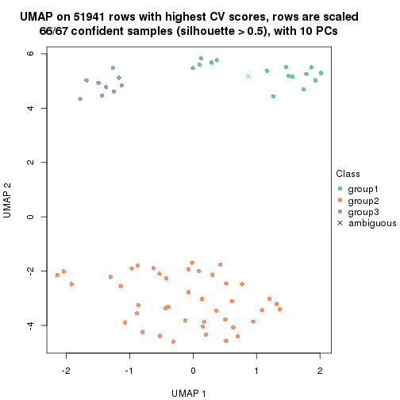</p>

</div>
<div id='tab-CV-pam-dimension-reduction-3'>
<pre><code class="r">dimension_reduction(res, k = 4, method = &quot;UMAP&quot;)
</code></pre>

<p></p>

</div>
<div id='tab-CV-pam-dimension-reduction-4'>
<pre><code class="r">dimension_reduction(res, k = 5, method = &quot;UMAP&quot;)
</code></pre>

<p></p>

</div>
<div id='tab-CV-pam-dimension-reduction-5'>
<pre><code class="r">dimension_reduction(res, k = 6, method = &quot;UMAP&quot;)
</code></pre>

<p></p>

</div>
</div>


Following heatmap shows how subgroups are split when increasing `k`:

```r
collect_classes(res)
```


Test correlation between subgroups and known annotations. If the known
annotation is numeric, one-way ANOVA test is applied, and if the known
annotation is discrete, chi-squared contingency table test is applied.

```r
test_to_known_factors(res)
```

```
#>         n disease.state(p) k
#> CV:pam 67         1.68e-10 2
#> CV:pam 66         1.64e-18 3
#> CV:pam 66         1.17e-26 4
#> CV:pam 62         1.19e-24 5
#> CV:pam 62         2.10e-26 6
```


If matrix rows can be associated to genes, consider to use `GO_Enrichment(res,
...)` to perform function enrichment for the signature genes.


 

---------------------------------------------------


### CV:mclust*


The object with results only for a single top-value method and a single partition method 
can be extracted as:

```r
res = res_list["CV", "mclust"]
# you can also extract it by
# res = res_list["CV:mclust"]
```

A summary of `res` and all the functions that can be applied to it:

```r
res
```

```
#> A 'ConsensusPartition' object with k = 2, 3, 4, 5, 6.
#>   On a matrix with 51941 rows and 67 columns.
#>   Top rows (1000, 2000, 3000, 4000, 5000) are extracted by 'CV' method.
#>   Subgroups are detected by 'mclust' method.
#>   Performed in total 1250 partitions by row resampling.
#>   Best k for subgroups seems to be 6.
#> 
#> Following methods can be applied to this 'ConsensusPartition' object:
#>  [1] "cola_report"             "collect_classes"         "collect_plots"          
#>  [4] "collect_stats"           "colnames"                "compare_signatures"     
#>  [7] "consensus_heatmap"       "dimension_reduction"     "functional_enrichment"  
#> [10] "get_anno_col"            "get_anno"                "get_classes"            
#> [13] "get_consensus"           "get_matrix"              "get_membership"         
#> [16] "get_param"               "get_signatures"          "get_stats"              
#> [19] "is_best_k"               "is_stable_k"             "membership_heatmap"     
#> [22] "ncol"                    "nrow"                    "plot_ecdf"              
#> [25] "rownames"                "select_partition_number" "show"                   
#> [28] "suggest_best_k"          "test_to_known_factors"
```

`collect_plots()` function collects all the plots made from `res` for all `k` (number of partitions)
into one single page to provide an easy and fast comparison between different `k`.

```r
collect_plots(res)
```


The plots are:

- The first row: a plot of the ECDF (Empirical cumulative distribution
  function) curves of the consensus matrix for each `k` and the heatmap of
  predicted classes for each `k`.
- The second row: heatmaps of the consensus matrix for each `k`.
- The third row: heatmaps of the membership matrix for each `k`.
- The fouth row: heatmaps of the signatures for each `k`.

All the plots in panels can be made by individual functions and they are
plotted later in this section.

`select_partition_number()` produces several plots showing different
statistics for choosing "optimized" `k`. There are following statistics:

- ECDF curves of the consensus matrix for each `k`;
- 1-PAC. [The PAC
  score](https://en.wikipedia.org/wiki/Consensus_clustering#Over-interpretation_potential_of_consensus_clustering)
  measures the proportion of the ambiguous subgrouping.
- Mean silhouette score.
- Concordance. The mean probability of fiting the consensus class ids in all
  partitions.
- Area increased. Denote $A_k$ as the area under the ECDF curve for current
  `k`, the area increased is defined as $A_k - A_{k-1}$.
- Rand index. The percent of pairs of samples that are both in a same cluster
  or both are not in a same cluster in the partition of k and k-1.
- Jaccard index. The ratio of pairs of samples are both in a same cluster in
  the partition of k and k-1 and the pairs of samples are both in a same
  cluster in the partition k or k-1.

The detailed explanations of these statistics can be found in [the cola
vignette](http://bioconductor.org/packages/devel/bioc/vignettes/cola/inst/doc/cola.html#toc_13).

Generally speaking, lower PAC score, higher mean silhouette score or higher
concordance corresponds to better partition. Rand index and Jaccard index
measure how similar the current partition is compared to partition with `k-1`.
If they are too similar, we won't accept `k` is better than `k-1`.

```r
select_partition_number(res)
```


The numeric values for all these statistics can be obtained by `get_stats()`.

```r
get_stats(res)
```

```
#>   k 1-PAC mean_silhouette concordance area_increased  Rand Jaccard
#> 2 2 1.000           0.997       0.997         0.4728 0.525   0.525
#> 3 3 0.676           0.786       0.880         0.2796 0.866   0.751
#> 4 4 0.648           0.809       0.844         0.1057 0.903   0.771
#> 5 5 0.710           0.714       0.847         0.1179 0.798   0.476
#> 6 6 0.947           0.929       0.968         0.0664 0.906   0.647
```

`suggest_best_k()` suggests the best $k$ based on these statistics. The rules are as follows:

- All $k$ with Jaccard index larger than 0.95 are removed because the increase of
  the partition number does not provides enough extra information. If all $k$ are removed,
  the best $k$ is assigned by `NA`.
- For $k$ with 1-PAC larger than 0.9, the maximal $k$ is taken as the "best k". Other $k$ is called "optional k".
- If it does not fit the second rule. The $k$ with the highest vote of highest
  1-PAC, mean silhouette and concordance is taken as the "best k".

```r
suggest_best_k(res)
```

```
#> [1] 6
#> attr(,"optional")
#> [1] 2
```

There is also optional best $k$ = 2 that is worth to check.

Following shows the table of the partitions (You need to click the **show/hide
code output** link to see it). The membership matrix (columns with name `p*`)
is inferred by
[`clue::cl_consensus()`](https://www.rdocumentation.org/link/cl_consensus?package=clue)
function with the `SE` method. Basically the value in the membership matrix
represents the probability to belong to a certain group. The finall class
label for an item is determined with the group with highest probability it
belongs to.

In `get_classes()` function, the entropy is calculated from the membership
matrix and the silhouette score is calculated from the consensus matrix.


<script>
$( function() {
	$( '#tabs-CV-mclust-get-classes' ).tabs();
} );
</script>
<div id='tabs-CV-mclust-get-classes'>
<ul>
<li><a href='#tab-CV-mclust-get-classes-1'>k = 2</a></li>
<li><a href='#tab-CV-mclust-get-classes-2'>k = 3</a></li>
<li><a href='#tab-CV-mclust-get-classes-3'>k = 4</a></li>
<li><a href='#tab-CV-mclust-get-classes-4'>k = 5</a></li>
<li><a href='#tab-CV-mclust-get-classes-5'>k = 6</a></li>
</ul>

<div id='tab-CV-mclust-get-classes-1'>
<p><a id='tab-CV-mclust-get-classes-1-a' style='color:#0366d6' href='#'>show/hide code output</a></p>
<pre><code class="r">cbind(get_classes(res, k = 2), get_membership(res, k = 2))
</code></pre>

<pre><code>#&gt;           class entropy silhouette    p1    p2
#&gt; GSM312811     2  0.0000      1.000 0.000 1.000
#&gt; GSM312812     2  0.0000      1.000 0.000 1.000
#&gt; GSM312813     2  0.0000      1.000 0.000 1.000
#&gt; GSM312814     2  0.0000      1.000 0.000 1.000
#&gt; GSM312815     2  0.0000      1.000 0.000 1.000
#&gt; GSM312816     2  0.0000      1.000 0.000 1.000
#&gt; GSM312817     2  0.0000      1.000 0.000 1.000
#&gt; GSM312818     2  0.0000      1.000 0.000 1.000
#&gt; GSM312819     2  0.0000      1.000 0.000 1.000
#&gt; GSM312820     2  0.0000      1.000 0.000 1.000
#&gt; GSM312821     2  0.0000      1.000 0.000 1.000
#&gt; GSM312822     2  0.0000      1.000 0.000 1.000
#&gt; GSM312823     2  0.0000      1.000 0.000 1.000
#&gt; GSM312824     2  0.0000      1.000 0.000 1.000
#&gt; GSM312825     2  0.0000      1.000 0.000 1.000
#&gt; GSM312826     2  0.0000      1.000 0.000 1.000
#&gt; GSM312839     2  0.0000      1.000 0.000 1.000
#&gt; GSM312840     2  0.0000      1.000 0.000 1.000
#&gt; GSM312841     2  0.0000      1.000 0.000 1.000
#&gt; GSM312843     2  0.0000      1.000 0.000 1.000
#&gt; GSM312844     2  0.0000      1.000 0.000 1.000
#&gt; GSM312845     2  0.0000      1.000 0.000 1.000
#&gt; GSM312846     2  0.0000      1.000 0.000 1.000
#&gt; GSM312847     2  0.0000      1.000 0.000 1.000
#&gt; GSM312848     2  0.0000      1.000 0.000 1.000
#&gt; GSM312849     2  0.0000      1.000 0.000 1.000
#&gt; GSM312851     2  0.0000      1.000 0.000 1.000
#&gt; GSM312853     2  0.0000      1.000 0.000 1.000
#&gt; GSM312854     2  0.0000      1.000 0.000 1.000
#&gt; GSM312856     2  0.0000      1.000 0.000 1.000
#&gt; GSM312857     2  0.0000      1.000 0.000 1.000
#&gt; GSM312858     2  0.0000      1.000 0.000 1.000
#&gt; GSM312859     2  0.0000      1.000 0.000 1.000
#&gt; GSM312860     2  0.0000      1.000 0.000 1.000
#&gt; GSM312861     2  0.0000      1.000 0.000 1.000
#&gt; GSM312862     2  0.0000      1.000 0.000 1.000
#&gt; GSM312863     2  0.0000      1.000 0.000 1.000
#&gt; GSM312864     2  0.0000      1.000 0.000 1.000
#&gt; GSM312865     2  0.0000      1.000 0.000 1.000
#&gt; GSM312867     2  0.0000      1.000 0.000 1.000
#&gt; GSM312868     2  0.0000      1.000 0.000 1.000
#&gt; GSM312869     2  0.0000      1.000 0.000 1.000
#&gt; GSM312870     1  0.0000      0.991 1.000 0.000
#&gt; GSM312872     1  0.0000      0.991 1.000 0.000
#&gt; GSM312874     1  0.0000      0.991 1.000 0.000
#&gt; GSM312875     1  0.0000      0.991 1.000 0.000
#&gt; GSM312876     1  0.0000      0.991 1.000 0.000
#&gt; GSM312877     1  0.0000      0.991 1.000 0.000
#&gt; GSM312879     1  0.0000      0.991 1.000 0.000
#&gt; GSM312882     1  0.0000      0.991 1.000 0.000
#&gt; GSM312883     1  0.0000      0.991 1.000 0.000
#&gt; GSM312886     1  0.1184      0.992 0.984 0.016
#&gt; GSM312887     1  0.1184      0.992 0.984 0.016
#&gt; GSM312890     1  0.1184      0.992 0.984 0.016
#&gt; GSM312893     1  0.1184      0.992 0.984 0.016
#&gt; GSM312894     1  0.1184      0.992 0.984 0.016
#&gt; GSM312895     1  0.1184      0.992 0.984 0.016
#&gt; GSM312937     1  0.1184      0.992 0.984 0.016
#&gt; GSM312938     1  0.1184      0.992 0.984 0.016
#&gt; GSM312939     1  0.1184      0.992 0.984 0.016
#&gt; GSM312940     1  0.1184      0.992 0.984 0.016
#&gt; GSM312941     1  0.1184      0.992 0.984 0.016
#&gt; GSM312942     1  0.0000      0.991 1.000 0.000
#&gt; GSM312943     1  0.0672      0.992 0.992 0.008
#&gt; GSM312944     1  0.0672      0.992 0.992 0.008
#&gt; GSM312945     1  0.0000      0.991 1.000 0.000
#&gt; GSM312946     1  0.1184      0.992 0.984 0.016
</code></pre>

<script>
$('#tab-CV-mclust-get-classes-1-a').parent().next().next().hide();
$('#tab-CV-mclust-get-classes-1-a').click(function(){
  $('#tab-CV-mclust-get-classes-1-a').parent().next().next().toggle();
  return(false);
});
</script>
</div>

<div id='tab-CV-mclust-get-classes-2'>
<p><a id='tab-CV-mclust-get-classes-2-a' style='color:#0366d6' href='#'>show/hide code output</a></p>
<pre><code class="r">cbind(get_classes(res, k = 3), get_membership(res, k = 3))
</code></pre>

<pre><code>#&gt;           class entropy silhouette    p1    p2    p3
#&gt; GSM312811     2  0.1860      0.821 0.000 0.948 0.052
#&gt; GSM312812     2  0.0000      0.843 0.000 1.000 0.000
#&gt; GSM312813     2  0.0000      0.843 0.000 1.000 0.000
#&gt; GSM312814     2  0.1860      0.821 0.000 0.948 0.052
#&gt; GSM312815     2  0.0000      0.843 0.000 1.000 0.000
#&gt; GSM312816     2  0.7944      0.444 0.144 0.660 0.196
#&gt; GSM312817     2  0.0000      0.843 0.000 1.000 0.000
#&gt; GSM312818     3  0.9152      0.238 0.144 0.424 0.432
#&gt; GSM312819     2  0.1163      0.825 0.028 0.972 0.000
#&gt; GSM312820     3  0.9152      0.238 0.144 0.424 0.432
#&gt; GSM312821     3  0.9152      0.238 0.144 0.424 0.432
#&gt; GSM312822     2  0.2165      0.815 0.000 0.936 0.064
#&gt; GSM312823     2  0.0000      0.843 0.000 1.000 0.000
#&gt; GSM312824     2  0.0000      0.843 0.000 1.000 0.000
#&gt; GSM312825     2  0.0000      0.843 0.000 1.000 0.000
#&gt; GSM312826     2  0.0000      0.843 0.000 1.000 0.000
#&gt; GSM312839     2  0.0000      0.843 0.000 1.000 0.000
#&gt; GSM312840     2  0.0000      0.843 0.000 1.000 0.000
#&gt; GSM312841     2  0.0000      0.843 0.000 1.000 0.000
#&gt; GSM312843     2  0.0000      0.843 0.000 1.000 0.000
#&gt; GSM312844     2  0.0000      0.843 0.000 1.000 0.000
#&gt; GSM312845     2  0.5968      0.574 0.000 0.636 0.364
#&gt; GSM312846     2  0.4931      0.740 0.000 0.768 0.232
#&gt; GSM312847     2  0.4887      0.742 0.000 0.772 0.228
#&gt; GSM312848     2  0.4842      0.745 0.000 0.776 0.224
#&gt; GSM312849     2  0.4887      0.742 0.000 0.772 0.228
#&gt; GSM312851     2  0.6111      0.583 0.000 0.604 0.396
#&gt; GSM312853     2  0.6111      0.583 0.000 0.604 0.396
#&gt; GSM312854     2  0.6111      0.583 0.000 0.604 0.396
#&gt; GSM312856     2  0.6111      0.583 0.000 0.604 0.396
#&gt; GSM312857     2  0.6111      0.583 0.000 0.604 0.396
#&gt; GSM312858     2  0.4842      0.745 0.000 0.776 0.224
#&gt; GSM312859     2  0.0000      0.843 0.000 1.000 0.000
#&gt; GSM312860     2  0.0000      0.843 0.000 1.000 0.000
#&gt; GSM312861     2  0.0000      0.843 0.000 1.000 0.000
#&gt; GSM312862     2  0.0000      0.843 0.000 1.000 0.000
#&gt; GSM312863     2  0.5650      0.692 0.000 0.688 0.312
#&gt; GSM312864     2  0.2165      0.815 0.000 0.936 0.064
#&gt; GSM312865     2  0.4887      0.742 0.000 0.772 0.228
#&gt; GSM312867     2  0.4887      0.742 0.000 0.772 0.228
#&gt; GSM312868     2  0.4842      0.745 0.000 0.776 0.224
#&gt; GSM312869     2  0.0000      0.843 0.000 1.000 0.000
#&gt; GSM312870     1  0.0000      0.951 1.000 0.000 0.000
#&gt; GSM312872     1  0.0000      0.951 1.000 0.000 0.000
#&gt; GSM312874     1  0.0000      0.951 1.000 0.000 0.000
#&gt; GSM312875     1  0.0000      0.951 1.000 0.000 0.000
#&gt; GSM312876     1  0.0000      0.951 1.000 0.000 0.000
#&gt; GSM312877     1  0.2200      0.942 0.940 0.004 0.056
#&gt; GSM312879     1  0.0000      0.951 1.000 0.000 0.000
#&gt; GSM312882     1  0.0000      0.951 1.000 0.000 0.000
#&gt; GSM312883     1  0.0237      0.951 0.996 0.000 0.004
#&gt; GSM312886     1  0.5024      0.679 0.776 0.004 0.220
#&gt; GSM312887     3  0.2400      0.820 0.064 0.004 0.932
#&gt; GSM312890     3  0.2165      0.821 0.064 0.000 0.936
#&gt; GSM312893     3  0.2165      0.821 0.064 0.000 0.936
#&gt; GSM312894     3  0.2400      0.820 0.064 0.004 0.932
#&gt; GSM312895     3  0.2165      0.821 0.064 0.000 0.936
#&gt; GSM312937     3  0.2165      0.821 0.064 0.000 0.936
#&gt; GSM312938     3  0.2400      0.820 0.064 0.004 0.932
#&gt; GSM312939     3  0.2165      0.821 0.064 0.000 0.936
#&gt; GSM312940     3  0.2165      0.821 0.064 0.000 0.936
#&gt; GSM312941     3  0.2165      0.821 0.064 0.000 0.936
#&gt; GSM312942     1  0.2301      0.940 0.936 0.004 0.060
#&gt; GSM312943     1  0.2400      0.939 0.932 0.004 0.064
#&gt; GSM312944     1  0.2400      0.939 0.932 0.004 0.064
#&gt; GSM312945     1  0.2400      0.939 0.932 0.004 0.064
#&gt; GSM312946     1  0.2400      0.939 0.932 0.004 0.064
</code></pre>

<script>
$('#tab-CV-mclust-get-classes-2-a').parent().next().next().hide();
$('#tab-CV-mclust-get-classes-2-a').click(function(){
  $('#tab-CV-mclust-get-classes-2-a').parent().next().next().toggle();
  return(false);
});
</script>
</div>

<div id='tab-CV-mclust-get-classes-3'>
<p><a id='tab-CV-mclust-get-classes-3-a' style='color:#0366d6' href='#'>show/hide code output</a></p>
<pre><code class="r">cbind(get_classes(res, k = 4), get_membership(res, k = 4))
</code></pre>

<pre><code>#&gt;           class entropy silhouette    p1    p2    p3    p4
#&gt; GSM312811     2  0.4277      0.411 0.000 0.720 0.000 0.280
#&gt; GSM312812     2  0.0000      0.834 0.000 1.000 0.000 0.000
#&gt; GSM312813     2  0.0592      0.827 0.016 0.984 0.000 0.000
#&gt; GSM312814     2  0.4250      0.422 0.000 0.724 0.000 0.276
#&gt; GSM312815     2  0.0000      0.834 0.000 1.000 0.000 0.000
#&gt; GSM312816     4  0.6009      0.835 0.040 0.312 0.012 0.636
#&gt; GSM312817     2  0.1118      0.821 0.036 0.964 0.000 0.000
#&gt; GSM312818     4  0.6397      0.855 0.072 0.280 0.012 0.636
#&gt; GSM312819     2  0.1590      0.814 0.028 0.956 0.008 0.008
#&gt; GSM312820     4  0.6397      0.855 0.072 0.280 0.012 0.636
#&gt; GSM312821     4  0.6397      0.855 0.072 0.280 0.012 0.636
#&gt; GSM312822     2  0.4456      0.408 0.004 0.716 0.000 0.280
#&gt; GSM312823     2  0.0000      0.834 0.000 1.000 0.000 0.000
#&gt; GSM312824     2  0.0000      0.834 0.000 1.000 0.000 0.000
#&gt; GSM312825     2  0.0000      0.834 0.000 1.000 0.000 0.000
#&gt; GSM312826     2  0.0000      0.834 0.000 1.000 0.000 0.000
#&gt; GSM312839     2  0.0000      0.834 0.000 1.000 0.000 0.000
#&gt; GSM312840     2  0.0000      0.834 0.000 1.000 0.000 0.000
#&gt; GSM312841     2  0.3528      0.606 0.000 0.808 0.000 0.192
#&gt; GSM312843     2  0.0817      0.829 0.000 0.976 0.000 0.024
#&gt; GSM312844     2  0.0000      0.834 0.000 1.000 0.000 0.000
#&gt; GSM312845     2  0.3999      0.741 0.140 0.824 0.000 0.036
#&gt; GSM312846     2  0.3948      0.745 0.136 0.828 0.000 0.036
#&gt; GSM312847     2  0.3435      0.767 0.100 0.864 0.000 0.036
#&gt; GSM312848     2  0.3435      0.767 0.100 0.864 0.000 0.036
#&gt; GSM312849     2  0.3842      0.752 0.128 0.836 0.000 0.036
#&gt; GSM312851     4  0.6019      0.862 0.100 0.228 0.000 0.672
#&gt; GSM312853     4  0.6019      0.862 0.100 0.228 0.000 0.672
#&gt; GSM312854     4  0.6019      0.862 0.100 0.228 0.000 0.672
#&gt; GSM312856     2  0.6553      0.260 0.100 0.584 0.000 0.316
#&gt; GSM312857     4  0.6019      0.862 0.100 0.228 0.000 0.672
#&gt; GSM312858     2  0.3435      0.767 0.100 0.864 0.000 0.036
#&gt; GSM312859     2  0.0000      0.834 0.000 1.000 0.000 0.000
#&gt; GSM312860     2  0.0188      0.834 0.004 0.996 0.000 0.000
#&gt; GSM312861     2  0.0336      0.833 0.000 0.992 0.000 0.008
#&gt; GSM312862     2  0.0921      0.820 0.028 0.972 0.000 0.000
#&gt; GSM312863     2  0.6553      0.260 0.100 0.584 0.000 0.316
#&gt; GSM312864     2  0.4509      0.388 0.004 0.708 0.000 0.288
#&gt; GSM312865     2  0.3435      0.767 0.100 0.864 0.000 0.036
#&gt; GSM312867     2  0.3842      0.752 0.128 0.836 0.000 0.036
#&gt; GSM312868     2  0.3342      0.769 0.100 0.868 0.000 0.032
#&gt; GSM312869     2  0.0000      0.834 0.000 1.000 0.000 0.000
#&gt; GSM312870     3  0.0000      0.893 0.000 0.000 1.000 0.000
#&gt; GSM312872     3  0.0000      0.893 0.000 0.000 1.000 0.000
#&gt; GSM312874     3  0.0000      0.893 0.000 0.000 1.000 0.000
#&gt; GSM312875     3  0.0000      0.893 0.000 0.000 1.000 0.000
#&gt; GSM312876     3  0.0000      0.893 0.000 0.000 1.000 0.000
#&gt; GSM312877     3  0.3634      0.855 0.048 0.000 0.856 0.096
#&gt; GSM312879     3  0.0000      0.893 0.000 0.000 1.000 0.000
#&gt; GSM312882     3  0.0000      0.893 0.000 0.000 1.000 0.000
#&gt; GSM312883     3  0.0000      0.893 0.000 0.000 1.000 0.000
#&gt; GSM312886     3  0.0188      0.892 0.004 0.000 0.996 0.000
#&gt; GSM312887     1  0.0188      0.997 0.996 0.000 0.000 0.004
#&gt; GSM312890     1  0.0000      0.999 1.000 0.000 0.000 0.000
#&gt; GSM312893     1  0.0000      0.999 1.000 0.000 0.000 0.000
#&gt; GSM312894     1  0.0188      0.997 0.996 0.000 0.000 0.004
#&gt; GSM312895     1  0.0000      0.999 1.000 0.000 0.000 0.000
#&gt; GSM312937     1  0.0000      0.999 1.000 0.000 0.000 0.000
#&gt; GSM312938     1  0.0188      0.997 0.996 0.000 0.000 0.004
#&gt; GSM312939     1  0.0000      0.999 1.000 0.000 0.000 0.000
#&gt; GSM312940     1  0.0000      0.999 1.000 0.000 0.000 0.000
#&gt; GSM312941     1  0.0000      0.999 1.000 0.000 0.000 0.000
#&gt; GSM312942     3  0.5646      0.788 0.048 0.000 0.656 0.296
#&gt; GSM312943     3  0.5110      0.795 0.016 0.000 0.656 0.328
#&gt; GSM312944     3  0.5110      0.795 0.016 0.000 0.656 0.328
#&gt; GSM312945     3  0.5110      0.795 0.016 0.000 0.656 0.328
#&gt; GSM312946     3  0.5110      0.795 0.016 0.000 0.656 0.328
</code></pre>

<script>
$('#tab-CV-mclust-get-classes-3-a').parent().next().next().hide();
$('#tab-CV-mclust-get-classes-3-a').click(function(){
  $('#tab-CV-mclust-get-classes-3-a').parent().next().next().toggle();
  return(false);
});
</script>
</div>

<div id='tab-CV-mclust-get-classes-4'>
<p><a id='tab-CV-mclust-get-classes-4-a' style='color:#0366d6' href='#'>show/hide code output</a></p>
<pre><code class="r">cbind(get_classes(res, k = 5), get_membership(res, k = 5))
</code></pre>

<pre><code>#&gt;           class entropy silhouette    p1    p2    p3    p4    p5
#&gt; GSM312811     4  0.4256     0.1087 0.000 0.436 0.000 0.564 0.000
#&gt; GSM312812     2  0.0000     0.7748 0.000 1.000 0.000 0.000 0.000
#&gt; GSM312813     2  0.1012     0.7712 0.000 0.968 0.000 0.020 0.012
#&gt; GSM312814     2  0.4262     0.2167 0.000 0.560 0.000 0.440 0.000
#&gt; GSM312815     2  0.0000     0.7748 0.000 1.000 0.000 0.000 0.000
#&gt; GSM312816     4  0.4806     0.4235 0.000 0.252 0.000 0.688 0.060
#&gt; GSM312817     2  0.4306     0.4211 0.000 0.660 0.000 0.328 0.012
#&gt; GSM312818     4  0.4728     0.4348 0.000 0.240 0.000 0.700 0.060
#&gt; GSM312819     2  0.5550     0.1244 0.000 0.528 0.000 0.400 0.072
#&gt; GSM312820     4  0.4728     0.4348 0.000 0.240 0.000 0.700 0.060
#&gt; GSM312821     4  0.4728     0.4348 0.000 0.240 0.000 0.700 0.060
#&gt; GSM312822     4  0.4304    -0.0608 0.000 0.484 0.000 0.516 0.000
#&gt; GSM312823     2  0.3752     0.5083 0.000 0.708 0.000 0.292 0.000
#&gt; GSM312824     2  0.0000     0.7748 0.000 1.000 0.000 0.000 0.000
#&gt; GSM312825     2  0.0000     0.7748 0.000 1.000 0.000 0.000 0.000
#&gt; GSM312826     2  0.0000     0.7748 0.000 1.000 0.000 0.000 0.000
#&gt; GSM312839     2  0.0000     0.7748 0.000 1.000 0.000 0.000 0.000
#&gt; GSM312840     2  0.1478     0.7583 0.000 0.936 0.000 0.064 0.000
#&gt; GSM312841     2  0.2813     0.6745 0.000 0.832 0.000 0.168 0.000
#&gt; GSM312843     2  0.5176     0.2006 0.000 0.572 0.000 0.380 0.048
#&gt; GSM312844     2  0.0000     0.7748 0.000 1.000 0.000 0.000 0.000
#&gt; GSM312845     4  0.5130     0.6236 0.000 0.220 0.000 0.680 0.100
#&gt; GSM312846     4  0.5130     0.6236 0.000 0.220 0.000 0.680 0.100
#&gt; GSM312847     4  0.5130     0.6236 0.000 0.220 0.000 0.680 0.100
#&gt; GSM312848     4  0.5130     0.6236 0.000 0.220 0.000 0.680 0.100
#&gt; GSM312849     4  0.5130     0.6236 0.000 0.220 0.000 0.680 0.100
#&gt; GSM312851     4  0.0000     0.6389 0.000 0.000 0.000 1.000 0.000
#&gt; GSM312853     4  0.0000     0.6389 0.000 0.000 0.000 1.000 0.000
#&gt; GSM312854     4  0.0609     0.6454 0.000 0.020 0.000 0.980 0.000
#&gt; GSM312856     4  0.2448     0.6499 0.000 0.020 0.000 0.892 0.088
#&gt; GSM312857     4  0.0290     0.6421 0.000 0.008 0.000 0.992 0.000
#&gt; GSM312858     4  0.5130     0.6236 0.000 0.220 0.000 0.680 0.100
#&gt; GSM312859     2  0.0693     0.7723 0.000 0.980 0.000 0.008 0.012
#&gt; GSM312860     2  0.2006     0.7519 0.000 0.916 0.000 0.072 0.012
#&gt; GSM312861     2  0.4016     0.5338 0.000 0.716 0.000 0.272 0.012
#&gt; GSM312862     2  0.3876     0.4638 0.000 0.684 0.000 0.316 0.000
#&gt; GSM312863     4  0.2540     0.6509 0.000 0.024 0.000 0.888 0.088
#&gt; GSM312864     4  0.4616     0.3940 0.000 0.288 0.000 0.676 0.036
#&gt; GSM312865     4  0.5130     0.6236 0.000 0.220 0.000 0.680 0.100
#&gt; GSM312867     4  0.5130     0.6236 0.000 0.220 0.000 0.680 0.100
#&gt; GSM312868     4  0.5425     0.5701 0.000 0.268 0.000 0.632 0.100
#&gt; GSM312869     2  0.0000     0.7748 0.000 1.000 0.000 0.000 0.000
#&gt; GSM312870     3  0.0000     1.0000 0.000 0.000 1.000 0.000 0.000
#&gt; GSM312872     3  0.0000     1.0000 0.000 0.000 1.000 0.000 0.000
#&gt; GSM312874     3  0.0000     1.0000 0.000 0.000 1.000 0.000 0.000
#&gt; GSM312875     3  0.0000     1.0000 0.000 0.000 1.000 0.000 0.000
#&gt; GSM312876     3  0.0000     1.0000 0.000 0.000 1.000 0.000 0.000
#&gt; GSM312877     5  0.4731     0.7179 0.032 0.000 0.328 0.000 0.640
#&gt; GSM312879     3  0.0000     1.0000 0.000 0.000 1.000 0.000 0.000
#&gt; GSM312882     3  0.0000     1.0000 0.000 0.000 1.000 0.000 0.000
#&gt; GSM312883     3  0.0000     1.0000 0.000 0.000 1.000 0.000 0.000
#&gt; GSM312886     3  0.0000     1.0000 0.000 0.000 1.000 0.000 0.000
#&gt; GSM312887     1  0.1671     0.8950 0.924 0.000 0.000 0.076 0.000
#&gt; GSM312890     1  0.0000     0.9744 1.000 0.000 0.000 0.000 0.000
#&gt; GSM312893     1  0.0000     0.9744 1.000 0.000 0.000 0.000 0.000
#&gt; GSM312894     1  0.0000     0.9744 1.000 0.000 0.000 0.000 0.000
#&gt; GSM312895     1  0.0000     0.9744 1.000 0.000 0.000 0.000 0.000
#&gt; GSM312937     1  0.0000     0.9744 1.000 0.000 0.000 0.000 0.000
#&gt; GSM312938     1  0.1671     0.8950 0.924 0.000 0.000 0.076 0.000
#&gt; GSM312939     1  0.0000     0.9744 1.000 0.000 0.000 0.000 0.000
#&gt; GSM312940     1  0.0000     0.9744 1.000 0.000 0.000 0.000 0.000
#&gt; GSM312941     1  0.0000     0.9744 1.000 0.000 0.000 0.000 0.000
#&gt; GSM312942     5  0.4192     0.8540 0.032 0.000 0.232 0.000 0.736
#&gt; GSM312943     5  0.3055     0.9240 0.016 0.000 0.144 0.000 0.840
#&gt; GSM312944     5  0.3055     0.9240 0.016 0.000 0.144 0.000 0.840
#&gt; GSM312945     5  0.3229     0.9121 0.032 0.000 0.128 0.000 0.840
#&gt; GSM312946     5  0.3055     0.9240 0.016 0.000 0.144 0.000 0.840
</code></pre>

<script>
$('#tab-CV-mclust-get-classes-4-a').parent().next().next().hide();
$('#tab-CV-mclust-get-classes-4-a').click(function(){
  $('#tab-CV-mclust-get-classes-4-a').parent().next().next().toggle();
  return(false);
});
</script>
</div>

<div id='tab-CV-mclust-get-classes-5'>
<p><a id='tab-CV-mclust-get-classes-5-a' style='color:#0366d6' href='#'>show/hide code output</a></p>
<pre><code class="r">cbind(get_classes(res, k = 6), get_membership(res, k = 6))
</code></pre>

<pre><code>#&gt;           class entropy silhouette    p1    p2    p3    p4    p5    p6
#&gt; GSM312811     2  0.1957     0.8977 0.000 0.888 0.000 0.000 0.112 0.000
#&gt; GSM312812     2  0.0547     0.9534 0.000 0.980 0.000 0.000 0.020 0.000
#&gt; GSM312813     2  0.0000     0.9583 0.000 1.000 0.000 0.000 0.000 0.000
#&gt; GSM312814     2  0.2135     0.8852 0.000 0.872 0.000 0.000 0.128 0.000
#&gt; GSM312815     2  0.0713     0.9512 0.000 0.972 0.000 0.000 0.028 0.000
#&gt; GSM312816     5  0.1387     0.8848 0.000 0.068 0.000 0.000 0.932 0.000
#&gt; GSM312817     2  0.1327     0.9273 0.000 0.936 0.000 0.000 0.064 0.000
#&gt; GSM312818     5  0.0000     0.9617 0.000 0.000 0.000 0.000 1.000 0.000
#&gt; GSM312819     2  0.2300     0.8511 0.000 0.856 0.000 0.000 0.144 0.000
#&gt; GSM312820     5  0.0000     0.9617 0.000 0.000 0.000 0.000 1.000 0.000
#&gt; GSM312821     5  0.0000     0.9617 0.000 0.000 0.000 0.000 1.000 0.000
#&gt; GSM312822     2  0.2092     0.8880 0.000 0.876 0.000 0.000 0.124 0.000
#&gt; GSM312823     2  0.0000     0.9583 0.000 1.000 0.000 0.000 0.000 0.000
#&gt; GSM312824     2  0.0000     0.9583 0.000 1.000 0.000 0.000 0.000 0.000
#&gt; GSM312825     2  0.0146     0.9580 0.000 0.996 0.000 0.000 0.004 0.000
#&gt; GSM312826     2  0.0000     0.9583 0.000 1.000 0.000 0.000 0.000 0.000
#&gt; GSM312839     2  0.0000     0.9583 0.000 1.000 0.000 0.000 0.000 0.000
#&gt; GSM312840     2  0.0000     0.9583 0.000 1.000 0.000 0.000 0.000 0.000
#&gt; GSM312841     2  0.1075     0.9404 0.000 0.952 0.000 0.000 0.048 0.000
#&gt; GSM312843     4  0.3868     0.0955 0.000 0.492 0.000 0.508 0.000 0.000
#&gt; GSM312844     2  0.0000     0.9583 0.000 1.000 0.000 0.000 0.000 0.000
#&gt; GSM312845     4  0.0000     0.9245 0.000 0.000 0.000 1.000 0.000 0.000
#&gt; GSM312846     4  0.0000     0.9245 0.000 0.000 0.000 1.000 0.000 0.000
#&gt; GSM312847     4  0.0000     0.9245 0.000 0.000 0.000 1.000 0.000 0.000
#&gt; GSM312848     4  0.0000     0.9245 0.000 0.000 0.000 1.000 0.000 0.000
#&gt; GSM312849     4  0.0146     0.9227 0.000 0.004 0.000 0.996 0.000 0.000
#&gt; GSM312851     4  0.0790     0.9121 0.000 0.000 0.000 0.968 0.032 0.000
#&gt; GSM312853     4  0.0790     0.9121 0.000 0.000 0.000 0.968 0.032 0.000
#&gt; GSM312854     4  0.0790     0.9121 0.000 0.000 0.000 0.968 0.032 0.000
#&gt; GSM312856     4  0.0146     0.9237 0.000 0.000 0.000 0.996 0.004 0.000
#&gt; GSM312857     4  0.0790     0.9121 0.000 0.000 0.000 0.968 0.032 0.000
#&gt; GSM312858     4  0.0000     0.9245 0.000 0.000 0.000 1.000 0.000 0.000
#&gt; GSM312859     2  0.0000     0.9583 0.000 1.000 0.000 0.000 0.000 0.000
#&gt; GSM312860     2  0.0260     0.9563 0.000 0.992 0.000 0.008 0.000 0.000
#&gt; GSM312861     2  0.0260     0.9553 0.000 0.992 0.000 0.008 0.000 0.000
#&gt; GSM312862     2  0.0458     0.9506 0.000 0.984 0.000 0.016 0.000 0.000
#&gt; GSM312863     4  0.0291     0.9228 0.000 0.004 0.000 0.992 0.004 0.000
#&gt; GSM312864     2  0.2520     0.8512 0.000 0.844 0.000 0.004 0.152 0.000
#&gt; GSM312865     4  0.0000     0.9245 0.000 0.000 0.000 1.000 0.000 0.000
#&gt; GSM312867     4  0.0000     0.9245 0.000 0.000 0.000 1.000 0.000 0.000
#&gt; GSM312868     4  0.2941     0.6423 0.000 0.220 0.000 0.780 0.000 0.000
#&gt; GSM312869     2  0.0146     0.9580 0.000 0.996 0.000 0.000 0.004 0.000
#&gt; GSM312870     3  0.0000     1.0000 0.000 0.000 1.000 0.000 0.000 0.000
#&gt; GSM312872     3  0.0000     1.0000 0.000 0.000 1.000 0.000 0.000 0.000
#&gt; GSM312874     3  0.0000     1.0000 0.000 0.000 1.000 0.000 0.000 0.000
#&gt; GSM312875     3  0.0000     1.0000 0.000 0.000 1.000 0.000 0.000 0.000
#&gt; GSM312876     3  0.0000     1.0000 0.000 0.000 1.000 0.000 0.000 0.000
#&gt; GSM312877     6  0.2793     0.7483 0.000 0.000 0.200 0.000 0.000 0.800
#&gt; GSM312879     3  0.0000     1.0000 0.000 0.000 1.000 0.000 0.000 0.000
#&gt; GSM312882     3  0.0000     1.0000 0.000 0.000 1.000 0.000 0.000 0.000
#&gt; GSM312883     3  0.0000     1.0000 0.000 0.000 1.000 0.000 0.000 0.000
#&gt; GSM312886     3  0.0000     1.0000 0.000 0.000 1.000 0.000 0.000 0.000
#&gt; GSM312887     1  0.0146     0.9952 0.996 0.000 0.004 0.000 0.000 0.000
#&gt; GSM312890     1  0.0000     0.9995 1.000 0.000 0.000 0.000 0.000 0.000
#&gt; GSM312893     1  0.0000     0.9995 1.000 0.000 0.000 0.000 0.000 0.000
#&gt; GSM312894     1  0.0000     0.9995 1.000 0.000 0.000 0.000 0.000 0.000
#&gt; GSM312895     1  0.0000     0.9995 1.000 0.000 0.000 0.000 0.000 0.000
#&gt; GSM312937     1  0.0000     0.9995 1.000 0.000 0.000 0.000 0.000 0.000
#&gt; GSM312938     1  0.0000     0.9995 1.000 0.000 0.000 0.000 0.000 0.000
#&gt; GSM312939     1  0.0000     0.9995 1.000 0.000 0.000 0.000 0.000 0.000
#&gt; GSM312940     1  0.0000     0.9995 1.000 0.000 0.000 0.000 0.000 0.000
#&gt; GSM312941     1  0.0000     0.9995 1.000 0.000 0.000 0.000 0.000 0.000
#&gt; GSM312942     6  0.2092     0.8328 0.000 0.000 0.124 0.000 0.000 0.876
#&gt; GSM312943     6  0.0000     0.9180 0.000 0.000 0.000 0.000 0.000 1.000
#&gt; GSM312944     6  0.0000     0.9180 0.000 0.000 0.000 0.000 0.000 1.000
#&gt; GSM312945     6  0.0000     0.9180 0.000 0.000 0.000 0.000 0.000 1.000
#&gt; GSM312946     6  0.0000     0.9180 0.000 0.000 0.000 0.000 0.000 1.000
</code></pre>

<script>
$('#tab-CV-mclust-get-classes-5-a').parent().next().next().hide();
$('#tab-CV-mclust-get-classes-5-a').click(function(){
  $('#tab-CV-mclust-get-classes-5-a').parent().next().next().toggle();
  return(false);
});
</script>
</div>
</div>

Heatmaps for the consensus matrix. It visualizes the probability of two
samples to be in a same group.


<script>
$( function() {
	$( '#tabs-CV-mclust-consensus-heatmap' ).tabs();
} );
</script>
<div id='tabs-CV-mclust-consensus-heatmap'>
<ul>
<li><a href='#tab-CV-mclust-consensus-heatmap-1'>k = 2</a></li>
<li><a href='#tab-CV-mclust-consensus-heatmap-2'>k = 3</a></li>
<li><a href='#tab-CV-mclust-consensus-heatmap-3'>k = 4</a></li>
<li><a href='#tab-CV-mclust-consensus-heatmap-4'>k = 5</a></li>
<li><a href='#tab-CV-mclust-consensus-heatmap-5'>k = 6</a></li>
</ul>
<div id='tab-CV-mclust-consensus-heatmap-1'>
<pre><code class="r">consensus_heatmap(res, k = 2)
</code></pre>

<p></p>

</div>
<div id='tab-CV-mclust-consensus-heatmap-2'>
<pre><code class="r">consensus_heatmap(res, k = 3)
</code></pre>

<p></p>

</div>
<div id='tab-CV-mclust-consensus-heatmap-3'>
<pre><code class="r">consensus_heatmap(res, k = 4)
</code></pre>

<p></p>

</div>
<div id='tab-CV-mclust-consensus-heatmap-4'>
<pre><code class="r">consensus_heatmap(res, k = 5)
</code></pre>

<p></p>

</div>
<div id='tab-CV-mclust-consensus-heatmap-5'>
<pre><code class="r">consensus_heatmap(res, k = 6)
</code></pre>

<p></p>

</div>
</div>

Heatmaps for the membership of samples in all partitions to see how consistent they are:


<script>
$( function() {
	$( '#tabs-CV-mclust-membership-heatmap' ).tabs();
} );
</script>
<div id='tabs-CV-mclust-membership-heatmap'>
<ul>
<li><a href='#tab-CV-mclust-membership-heatmap-1'>k = 2</a></li>
<li><a href='#tab-CV-mclust-membership-heatmap-2'>k = 3</a></li>
<li><a href='#tab-CV-mclust-membership-heatmap-3'>k = 4</a></li>
<li><a href='#tab-CV-mclust-membership-heatmap-4'>k = 5</a></li>
<li><a href='#tab-CV-mclust-membership-heatmap-5'>k = 6</a></li>
</ul>
<div id='tab-CV-mclust-membership-heatmap-1'>
<pre><code class="r">membership_heatmap(res, k = 2)
</code></pre>

<p></p>

</div>
<div id='tab-CV-mclust-membership-heatmap-2'>
<pre><code class="r">membership_heatmap(res, k = 3)
</code></pre>

<p></p>

</div>
<div id='tab-CV-mclust-membership-heatmap-3'>
<pre><code class="r">membership_heatmap(res, k = 4)
</code></pre>

<p></p>

</div>
<div id='tab-CV-mclust-membership-heatmap-4'>
<pre><code class="r">membership_heatmap(res, k = 5)
</code></pre>

<p></p>

</div>
<div id='tab-CV-mclust-membership-heatmap-5'>
<pre><code class="r">membership_heatmap(res, k = 6)
</code></pre>

<p></p>

</div>
</div>

As soon as we have had the classes for columns, we can look for signatures
which are significantly different between classes which can be candidate marks
for certain classes. Following are the heatmaps for signatures.


Signature heatmaps where rows are scaled:


<script>
$( function() {
	$( '#tabs-CV-mclust-get-signatures' ).tabs();
} );
</script>
<div id='tabs-CV-mclust-get-signatures'>
<ul>
<li><a href='#tab-CV-mclust-get-signatures-1'>k = 2</a></li>
<li><a href='#tab-CV-mclust-get-signatures-2'>k = 3</a></li>
<li><a href='#tab-CV-mclust-get-signatures-3'>k = 4</a></li>
<li><a href='#tab-CV-mclust-get-signatures-4'>k = 5</a></li>
<li><a href='#tab-CV-mclust-get-signatures-5'>k = 6</a></li>
</ul>
<div id='tab-CV-mclust-get-signatures-1'>
<pre><code class="r">get_signatures(res, k = 2)
</code></pre>

<p></p>

</div>
<div id='tab-CV-mclust-get-signatures-2'>
<pre><code class="r">get_signatures(res, k = 3)
</code></pre>

<p></p>

</div>
<div id='tab-CV-mclust-get-signatures-3'>
<pre><code class="r">get_signatures(res, k = 4)
</code></pre>

<p></p>

</div>
<div id='tab-CV-mclust-get-signatures-4'>
<pre><code class="r">get_signatures(res, k = 5)
</code></pre>

<p></p>

</div>
<div id='tab-CV-mclust-get-signatures-5'>
<pre><code class="r">get_signatures(res, k = 6)
</code></pre>

<pre><code>#&gt; Error in mat[ceiling(1:nr/h_ratio), ceiling(1:nc/w_ratio), drop = FALSE]: subscript out of bounds
</code></pre>

<p></p>

</div>
</div>


Signature heatmaps where rows are not scaled:


<script>
$( function() {
	$( '#tabs-CV-mclust-get-signatures-no-scale' ).tabs();
} );
</script>
<div id='tabs-CV-mclust-get-signatures-no-scale'>
<ul>
<li><a href='#tab-CV-mclust-get-signatures-no-scale-1'>k = 2</a></li>
<li><a href='#tab-CV-mclust-get-signatures-no-scale-2'>k = 3</a></li>
<li><a href='#tab-CV-mclust-get-signatures-no-scale-3'>k = 4</a></li>
<li><a href='#tab-CV-mclust-get-signatures-no-scale-4'>k = 5</a></li>
<li><a href='#tab-CV-mclust-get-signatures-no-scale-5'>k = 6</a></li>
</ul>
<div id='tab-CV-mclust-get-signatures-no-scale-1'>
<pre><code class="r">get_signatures(res, k = 2, scale_rows = FALSE)
</code></pre>

<p></p>

</div>
<div id='tab-CV-mclust-get-signatures-no-scale-2'>
<pre><code class="r">get_signatures(res, k = 3, scale_rows = FALSE)
</code></pre>

<p></p>

</div>
<div id='tab-CV-mclust-get-signatures-no-scale-3'>
<pre><code class="r">get_signatures(res, k = 4, scale_rows = FALSE)
</code></pre>

<p></p>

</div>
<div id='tab-CV-mclust-get-signatures-no-scale-4'>
<pre><code class="r">get_signatures(res, k = 5, scale_rows = FALSE)
</code></pre>

<p></p>

</div>
<div id='tab-CV-mclust-get-signatures-no-scale-5'>
<pre><code class="r">get_signatures(res, k = 6, scale_rows = FALSE)
</code></pre>

<p></p>

</div>
</div>


Compare the overlap of signatures from different k:

```r
compare_signatures(res)
```


`get_signature()` returns a data frame invisibly. TO get the list of signatures, the function
call should be assigned to a variable explicitly. In following code, if `plot` argument is set
to `FALSE`, no heatmap is plotted while only the differential analysis is performed.

```r
# code only for demonstration
tb = get_signature(res, k = ..., plot = FALSE)
```

An example of the output of `tb` is:

```
#>   which_row         fdr    mean_1    mean_2 scaled_mean_1 scaled_mean_2 km
#> 1        38 0.042760348  8.373488  9.131774    -0.5533452     0.5164555  1
#> 2        40 0.018707592  7.106213  8.469186    -0.6173731     0.5762149  1
#> 3        55 0.019134737 10.221463 11.207825    -0.6159697     0.5749050  1
#> 4        59 0.006059896  5.921854  7.869574    -0.6899429     0.6439467  1
#> 5        60 0.018055526  8.928898 10.211722    -0.6204761     0.5791110  1
#> 6        98 0.009384629 15.714769 14.887706     0.6635654    -0.6193277  2
...
```

The columns in `tb` are:

1. `which_row`: row indices corresponding to the input matrix.
2. `fdr`: FDR for the differential test. 
3. `mean_x`: The mean value in group x.
4. `scaled_mean_x`: The mean value in group x after rows are scaled.
5. `km`: Row groups if k-means clustering is applied to rows.


UMAP plot which shows how samples are separated.


<script>
$( function() {
	$( '#tabs-CV-mclust-dimension-reduction' ).tabs();
} );
</script>
<div id='tabs-CV-mclust-dimension-reduction'>
<ul>
<li><a href='#tab-CV-mclust-dimension-reduction-1'>k = 2</a></li>
<li><a href='#tab-CV-mclust-dimension-reduction-2'>k = 3</a></li>
<li><a href='#tab-CV-mclust-dimension-reduction-3'>k = 4</a></li>
<li><a href='#tab-CV-mclust-dimension-reduction-4'>k = 5</a></li>
<li><a href='#tab-CV-mclust-dimension-reduction-5'>k = 6</a></li>
</ul>
<div id='tab-CV-mclust-dimension-reduction-1'>
<pre><code class="r">dimension_reduction(res, k = 2, method = &quot;UMAP&quot;)
</code></pre>

<p></p>

</div>
<div id='tab-CV-mclust-dimension-reduction-2'>
<pre><code class="r">dimension_reduction(res, k = 3, method = &quot;UMAP&quot;)
</code></pre>

<p></p>

</div>
<div id='tab-CV-mclust-dimension-reduction-3'>
<pre><code class="r">dimension_reduction(res, k = 4, method = &quot;UMAP&quot;)
</code></pre>

<p></p>

</div>
<div id='tab-CV-mclust-dimension-reduction-4'>
<pre><code class="r">dimension_reduction(res, k = 5, method = &quot;UMAP&quot;)
</code></pre>

<p></p>

</div>
<div id='tab-CV-mclust-dimension-reduction-5'>
<pre><code class="r">dimension_reduction(res, k = 6, method = &quot;UMAP&quot;)
</code></pre>

<p></p>

</div>
</div>


Following heatmap shows how subgroups are split when increasing `k`:

```r
collect_classes(res)
```


Test correlation between subgroups and known annotations. If the known
annotation is numeric, one-way ANOVA test is applied, and if the known
annotation is discrete, chi-squared contingency table test is applied.

```r
test_to_known_factors(res)
```

```
#>            n disease.state(p) k
#> CV:mclust 67         1.68e-10 2
#> CV:mclust 63         2.18e-17 3
#> CV:mclust 61         6.65e-20 4
#> CV:mclust 55         1.18e-21 5
#> CV:mclust 66         3.45e-27 6
```


If matrix rows can be associated to genes, consider to use `GO_Enrichment(res,
...)` to perform function enrichment for the signature genes.


 

---------------------------------------------------


### CV:NMF**


The object with results only for a single top-value method and a single partition method 
can be extracted as:

```r
res = res_list["CV", "NMF"]
# you can also extract it by
# res = res_list["CV:NMF"]
```

A summary of `res` and all the functions that can be applied to it:

```r
res
```

```
#> A 'ConsensusPartition' object with k = 2, 3, 4, 5, 6.
#>   On a matrix with 51941 rows and 67 columns.
#>   Top rows (1000, 2000, 3000, 4000, 5000) are extracted by 'CV' method.
#>   Subgroups are detected by 'NMF' method.
#>   Performed in total 1250 partitions by row resampling.
#>   Best k for subgroups seems to be 6.
#> 
#> Following methods can be applied to this 'ConsensusPartition' object:
#>  [1] "cola_report"             "collect_classes"         "collect_plots"          
#>  [4] "collect_stats"           "colnames"                "compare_signatures"     
#>  [7] "consensus_heatmap"       "dimension_reduction"     "functional_enrichment"  
#> [10] "get_anno_col"            "get_anno"                "get_classes"            
#> [13] "get_consensus"           "get_matrix"              "get_membership"         
#> [16] "get_param"               "get_signatures"          "get_stats"              
#> [19] "is_best_k"               "is_stable_k"             "membership_heatmap"     
#> [22] "ncol"                    "nrow"                    "plot_ecdf"              
#> [25] "rownames"                "select_partition_number" "show"                   
#> [28] "suggest_best_k"          "test_to_known_factors"
```

`collect_plots()` function collects all the plots made from `res` for all `k` (number of partitions)
into one single page to provide an easy and fast comparison between different `k`.

```r
collect_plots(res)
```


The plots are:

- The first row: a plot of the ECDF (Empirical cumulative distribution
  function) curves of the consensus matrix for each `k` and the heatmap of
  predicted classes for each `k`.
- The second row: heatmaps of the consensus matrix for each `k`.
- The third row: heatmaps of the membership matrix for each `k`.
- The fouth row: heatmaps of the signatures for each `k`.

All the plots in panels can be made by individual functions and they are
plotted later in this section.

`select_partition_number()` produces several plots showing different
statistics for choosing "optimized" `k`. There are following statistics:

- ECDF curves of the consensus matrix for each `k`;
- 1-PAC. [The PAC
  score](https://en.wikipedia.org/wiki/Consensus_clustering#Over-interpretation_potential_of_consensus_clustering)
  measures the proportion of the ambiguous subgrouping.
- Mean silhouette score.
- Concordance. The mean probability of fiting the consensus class ids in all
  partitions.
- Area increased. Denote $A_k$ as the area under the ECDF curve for current
  `k`, the area increased is defined as $A_k - A_{k-1}$.
- Rand index. The percent of pairs of samples that are both in a same cluster
  or both are not in a same cluster in the partition of k and k-1.
- Jaccard index. The ratio of pairs of samples are both in a same cluster in
  the partition of k and k-1 and the pairs of samples are both in a same
  cluster in the partition k or k-1.

The detailed explanations of these statistics can be found in [the cola
vignette](http://bioconductor.org/packages/devel/bioc/vignettes/cola/inst/doc/cola.html#toc_13).

Generally speaking, lower PAC score, higher mean silhouette score or higher
concordance corresponds to better partition. Rand index and Jaccard index
measure how similar the current partition is compared to partition with `k-1`.
If they are too similar, we won't accept `k` is better than `k-1`.

```r
select_partition_number(res)
```


The numeric values for all these statistics can be obtained by `get_stats()`.

```r
get_stats(res)
```

```
#>   k 1-PAC mean_silhouette concordance area_increased  Rand Jaccard
#> 2 2 1.000           0.973       0.988         0.4838 0.518   0.518
#> 3 3 0.935           0.919       0.966         0.2748 0.810   0.656
#> 4 4 0.656           0.643       0.809         0.1383 0.857   0.654
#> 5 5 0.697           0.773       0.865         0.0889 0.878   0.615
#> 6 6 0.956           0.897       0.955         0.0536 0.949   0.786
```

`suggest_best_k()` suggests the best $k$ based on these statistics. The rules are as follows:

- All $k$ with Jaccard index larger than 0.95 are removed because the increase of
  the partition number does not provides enough extra information. If all $k$ are removed,
  the best $k$ is assigned by `NA`.
- For $k$ with 1-PAC larger than 0.9, the maximal $k$ is taken as the "best k". Other $k$ is called "optional k".
- If it does not fit the second rule. The $k$ with the highest vote of highest
  1-PAC, mean silhouette and concordance is taken as the "best k".

```r
suggest_best_k(res)
```

```
#> [1] 6
#> attr(,"optional")
#> [1] 2 3
```

There is also optional best $k$ = 2 3 that is worth to check.

Following shows the table of the partitions (You need to click the **show/hide
code output** link to see it). The membership matrix (columns with name `p*`)
is inferred by
[`clue::cl_consensus()`](https://www.rdocumentation.org/link/cl_consensus?package=clue)
function with the `SE` method. Basically the value in the membership matrix
represents the probability to belong to a certain group. The finall class
label for an item is determined with the group with highest probability it
belongs to.

In `get_classes()` function, the entropy is calculated from the membership
matrix and the silhouette score is calculated from the consensus matrix.


<script>
$( function() {
	$( '#tabs-CV-NMF-get-classes' ).tabs();
} );
</script>
<div id='tabs-CV-NMF-get-classes'>
<ul>
<li><a href='#tab-CV-NMF-get-classes-1'>k = 2</a></li>
<li><a href='#tab-CV-NMF-get-classes-2'>k = 3</a></li>
<li><a href='#tab-CV-NMF-get-classes-3'>k = 4</a></li>
<li><a href='#tab-CV-NMF-get-classes-4'>k = 5</a></li>
<li><a href='#tab-CV-NMF-get-classes-5'>k = 6</a></li>
</ul>

<div id='tab-CV-NMF-get-classes-1'>
<p><a id='tab-CV-NMF-get-classes-1-a' style='color:#0366d6' href='#'>show/hide code output</a></p>
<pre><code class="r">cbind(get_classes(res, k = 2), get_membership(res, k = 2))
</code></pre>

<pre><code>#&gt;           class entropy silhouette    p1    p2
#&gt; GSM312811     2  0.0000      0.987 0.000 1.000
#&gt; GSM312812     2  0.0000      0.987 0.000 1.000
#&gt; GSM312813     2  0.0000      0.987 0.000 1.000
#&gt; GSM312814     2  0.0000      0.987 0.000 1.000
#&gt; GSM312815     2  0.0000      0.987 0.000 1.000
#&gt; GSM312816     2  0.0000      0.987 0.000 1.000
#&gt; GSM312817     2  0.0000      0.987 0.000 1.000
#&gt; GSM312818     2  0.5629      0.846 0.132 0.868
#&gt; GSM312819     2  0.0000      0.987 0.000 1.000
#&gt; GSM312820     2  0.0000      0.987 0.000 1.000
#&gt; GSM312821     2  0.0000      0.987 0.000 1.000
#&gt; GSM312822     2  0.0000      0.987 0.000 1.000
#&gt; GSM312823     2  0.0000      0.987 0.000 1.000
#&gt; GSM312824     2  0.0000      0.987 0.000 1.000
#&gt; GSM312825     2  0.0000      0.987 0.000 1.000
#&gt; GSM312826     2  0.0000      0.987 0.000 1.000
#&gt; GSM312839     2  0.0000      0.987 0.000 1.000
#&gt; GSM312840     2  0.0000      0.987 0.000 1.000
#&gt; GSM312841     2  0.0000      0.987 0.000 1.000
#&gt; GSM312843     2  0.0000      0.987 0.000 1.000
#&gt; GSM312844     2  0.0000      0.987 0.000 1.000
#&gt; GSM312845     1  0.8555      0.603 0.720 0.280
#&gt; GSM312846     2  0.8499      0.619 0.276 0.724
#&gt; GSM312847     2  0.0376      0.984 0.004 0.996
#&gt; GSM312848     2  0.0000      0.987 0.000 1.000
#&gt; GSM312849     2  0.0000      0.987 0.000 1.000
#&gt; GSM312851     2  0.0000      0.987 0.000 1.000
#&gt; GSM312853     2  0.0000      0.987 0.000 1.000
#&gt; GSM312854     2  0.0000      0.987 0.000 1.000
#&gt; GSM312856     2  0.0000      0.987 0.000 1.000
#&gt; GSM312857     2  0.0000      0.987 0.000 1.000
#&gt; GSM312858     2  0.0000      0.987 0.000 1.000
#&gt; GSM312859     2  0.0000      0.987 0.000 1.000
#&gt; GSM312860     2  0.0000      0.987 0.000 1.000
#&gt; GSM312861     2  0.0000      0.987 0.000 1.000
#&gt; GSM312862     2  0.0000      0.987 0.000 1.000
#&gt; GSM312863     2  0.0000      0.987 0.000 1.000
#&gt; GSM312864     2  0.0000      0.987 0.000 1.000
#&gt; GSM312865     2  0.0000      0.987 0.000 1.000
#&gt; GSM312867     2  0.4431      0.894 0.092 0.908
#&gt; GSM312868     2  0.0000      0.987 0.000 1.000
#&gt; GSM312869     2  0.0000      0.987 0.000 1.000
#&gt; GSM312870     1  0.0000      0.989 1.000 0.000
#&gt; GSM312872     1  0.0000      0.989 1.000 0.000
#&gt; GSM312874     1  0.0000      0.989 1.000 0.000
#&gt; GSM312875     1  0.0000      0.989 1.000 0.000
#&gt; GSM312876     1  0.0000      0.989 1.000 0.000
#&gt; GSM312877     1  0.0000      0.989 1.000 0.000
#&gt; GSM312879     1  0.0000      0.989 1.000 0.000
#&gt; GSM312882     1  0.0000      0.989 1.000 0.000
#&gt; GSM312883     1  0.0000      0.989 1.000 0.000
#&gt; GSM312886     1  0.0000      0.989 1.000 0.000
#&gt; GSM312887     1  0.0000      0.989 1.000 0.000
#&gt; GSM312890     1  0.0000      0.989 1.000 0.000
#&gt; GSM312893     1  0.0000      0.989 1.000 0.000
#&gt; GSM312894     1  0.0000      0.989 1.000 0.000
#&gt; GSM312895     1  0.0000      0.989 1.000 0.000
#&gt; GSM312937     1  0.0000      0.989 1.000 0.000
#&gt; GSM312938     1  0.0000      0.989 1.000 0.000
#&gt; GSM312939     1  0.0000      0.989 1.000 0.000
#&gt; GSM312940     1  0.0000      0.989 1.000 0.000
#&gt; GSM312941     1  0.0000      0.989 1.000 0.000
#&gt; GSM312942     1  0.0000      0.989 1.000 0.000
#&gt; GSM312943     1  0.0000      0.989 1.000 0.000
#&gt; GSM312944     1  0.0000      0.989 1.000 0.000
#&gt; GSM312945     1  0.0000      0.989 1.000 0.000
#&gt; GSM312946     1  0.0000      0.989 1.000 0.000
</code></pre>

<script>
$('#tab-CV-NMF-get-classes-1-a').parent().next().next().hide();
$('#tab-CV-NMF-get-classes-1-a').click(function(){
  $('#tab-CV-NMF-get-classes-1-a').parent().next().next().toggle();
  return(false);
});
</script>
</div>

<div id='tab-CV-NMF-get-classes-2'>
<p><a id='tab-CV-NMF-get-classes-2-a' style='color:#0366d6' href='#'>show/hide code output</a></p>
<pre><code class="r">cbind(get_classes(res, k = 3), get_membership(res, k = 3))
</code></pre>

<pre><code>#&gt;           class entropy silhouette    p1    p2    p3
#&gt; GSM312811     2  0.0000      0.964 0.000 1.000 0.000
#&gt; GSM312812     2  0.0000      0.964 0.000 1.000 0.000
#&gt; GSM312813     2  0.0000      0.964 0.000 1.000 0.000
#&gt; GSM312814     2  0.0000      0.964 0.000 1.000 0.000
#&gt; GSM312815     2  0.0000      0.964 0.000 1.000 0.000
#&gt; GSM312816     2  0.0000      0.964 0.000 1.000 0.000
#&gt; GSM312817     2  0.0000      0.964 0.000 1.000 0.000
#&gt; GSM312818     2  0.5988      0.421 0.000 0.632 0.368
#&gt; GSM312819     2  0.0000      0.964 0.000 1.000 0.000
#&gt; GSM312820     2  0.0237      0.961 0.000 0.996 0.004
#&gt; GSM312821     2  0.0747      0.952 0.000 0.984 0.016
#&gt; GSM312822     2  0.0000      0.964 0.000 1.000 0.000
#&gt; GSM312823     2  0.0000      0.964 0.000 1.000 0.000
#&gt; GSM312824     2  0.0000      0.964 0.000 1.000 0.000
#&gt; GSM312825     2  0.0000      0.964 0.000 1.000 0.000
#&gt; GSM312826     2  0.0000      0.964 0.000 1.000 0.000
#&gt; GSM312839     2  0.0000      0.964 0.000 1.000 0.000
#&gt; GSM312840     2  0.0000      0.964 0.000 1.000 0.000
#&gt; GSM312841     2  0.0000      0.964 0.000 1.000 0.000
#&gt; GSM312843     2  0.0000      0.964 0.000 1.000 0.000
#&gt; GSM312844     2  0.0000      0.964 0.000 1.000 0.000
#&gt; GSM312845     1  0.0000      0.946 1.000 0.000 0.000
#&gt; GSM312846     1  0.0000      0.946 1.000 0.000 0.000
#&gt; GSM312847     1  0.0000      0.946 1.000 0.000 0.000
#&gt; GSM312848     2  0.5216      0.667 0.260 0.740 0.000
#&gt; GSM312849     1  0.0000      0.946 1.000 0.000 0.000
#&gt; GSM312851     2  0.0000      0.964 0.000 1.000 0.000
#&gt; GSM312853     2  0.0237      0.961 0.004 0.996 0.000
#&gt; GSM312854     2  0.3879      0.819 0.152 0.848 0.000
#&gt; GSM312856     2  0.0000      0.964 0.000 1.000 0.000
#&gt; GSM312857     2  0.2356      0.901 0.072 0.928 0.000
#&gt; GSM312858     2  0.5650      0.571 0.312 0.688 0.000
#&gt; GSM312859     2  0.0000      0.964 0.000 1.000 0.000
#&gt; GSM312860     2  0.0000      0.964 0.000 1.000 0.000
#&gt; GSM312861     2  0.0000      0.964 0.000 1.000 0.000
#&gt; GSM312862     2  0.0000      0.964 0.000 1.000 0.000
#&gt; GSM312863     2  0.0424      0.958 0.008 0.992 0.000
#&gt; GSM312864     2  0.0000      0.964 0.000 1.000 0.000
#&gt; GSM312865     1  0.0000      0.946 1.000 0.000 0.000
#&gt; GSM312867     1  0.0000      0.946 1.000 0.000 0.000
#&gt; GSM312868     2  0.0000      0.964 0.000 1.000 0.000
#&gt; GSM312869     2  0.0000      0.964 0.000 1.000 0.000
#&gt; GSM312870     3  0.0000      0.990 0.000 0.000 1.000
#&gt; GSM312872     3  0.0000      0.990 0.000 0.000 1.000
#&gt; GSM312874     3  0.0000      0.990 0.000 0.000 1.000
#&gt; GSM312875     3  0.0000      0.990 0.000 0.000 1.000
#&gt; GSM312876     3  0.0000      0.990 0.000 0.000 1.000
#&gt; GSM312877     3  0.1289      0.964 0.032 0.000 0.968
#&gt; GSM312879     3  0.0000      0.990 0.000 0.000 1.000
#&gt; GSM312882     3  0.0000      0.990 0.000 0.000 1.000
#&gt; GSM312883     3  0.0000      0.990 0.000 0.000 1.000
#&gt; GSM312886     3  0.0000      0.990 0.000 0.000 1.000
#&gt; GSM312887     1  0.6235      0.232 0.564 0.000 0.436
#&gt; GSM312890     1  0.0000      0.946 1.000 0.000 0.000
#&gt; GSM312893     1  0.0000      0.946 1.000 0.000 0.000
#&gt; GSM312894     1  0.0000      0.946 1.000 0.000 0.000
#&gt; GSM312895     1  0.0000      0.946 1.000 0.000 0.000
#&gt; GSM312937     1  0.0000      0.946 1.000 0.000 0.000
#&gt; GSM312938     1  0.0000      0.946 1.000 0.000 0.000
#&gt; GSM312939     1  0.0000      0.946 1.000 0.000 0.000
#&gt; GSM312940     1  0.0000      0.946 1.000 0.000 0.000
#&gt; GSM312941     1  0.0000      0.946 1.000 0.000 0.000
#&gt; GSM312942     3  0.1964      0.938 0.056 0.000 0.944
#&gt; GSM312943     1  0.2959      0.861 0.900 0.000 0.100
#&gt; GSM312944     1  0.0592      0.938 0.988 0.000 0.012
#&gt; GSM312945     1  0.1643      0.914 0.956 0.000 0.044
#&gt; GSM312946     1  0.6126      0.361 0.600 0.000 0.400
</code></pre>

<script>
$('#tab-CV-NMF-get-classes-2-a').parent().next().next().hide();
$('#tab-CV-NMF-get-classes-2-a').click(function(){
  $('#tab-CV-NMF-get-classes-2-a').parent().next().next().toggle();
  return(false);
});
</script>
</div>

<div id='tab-CV-NMF-get-classes-3'>
<p><a id='tab-CV-NMF-get-classes-3-a' style='color:#0366d6' href='#'>show/hide code output</a></p>
<pre><code class="r">cbind(get_classes(res, k = 4), get_membership(res, k = 4))
</code></pre>

<pre><code>#&gt;           class entropy silhouette    p1    p2    p3    p4
#&gt; GSM312811     2  0.1118     0.8328 0.000 0.964 0.000 0.036
#&gt; GSM312812     2  0.0000     0.8492 0.000 1.000 0.000 0.000
#&gt; GSM312813     2  0.0000     0.8492 0.000 1.000 0.000 0.000
#&gt; GSM312814     2  0.1557     0.8213 0.000 0.944 0.000 0.056
#&gt; GSM312815     2  0.0336     0.8461 0.000 0.992 0.000 0.008
#&gt; GSM312816     2  0.3311     0.7249 0.000 0.828 0.000 0.172
#&gt; GSM312817     2  0.0000     0.8492 0.000 1.000 0.000 0.000
#&gt; GSM312818     2  0.7569     0.1004 0.000 0.436 0.368 0.196
#&gt; GSM312819     2  0.0000     0.8492 0.000 1.000 0.000 0.000
#&gt; GSM312820     2  0.4716     0.6662 0.000 0.764 0.040 0.196
#&gt; GSM312821     2  0.6205     0.5298 0.000 0.668 0.136 0.196
#&gt; GSM312822     2  0.3074     0.7453 0.000 0.848 0.000 0.152
#&gt; GSM312823     2  0.0000     0.8492 0.000 1.000 0.000 0.000
#&gt; GSM312824     2  0.0000     0.8492 0.000 1.000 0.000 0.000
#&gt; GSM312825     2  0.0469     0.8419 0.000 0.988 0.000 0.012
#&gt; GSM312826     2  0.0000     0.8492 0.000 1.000 0.000 0.000
#&gt; GSM312839     2  0.0000     0.8492 0.000 1.000 0.000 0.000
#&gt; GSM312840     2  0.0000     0.8492 0.000 1.000 0.000 0.000
#&gt; GSM312841     2  0.0000     0.8492 0.000 1.000 0.000 0.000
#&gt; GSM312843     2  0.3907     0.6452 0.000 0.768 0.000 0.232
#&gt; GSM312844     2  0.0000     0.8492 0.000 1.000 0.000 0.000
#&gt; GSM312845     1  0.2647     0.8065 0.880 0.000 0.000 0.120
#&gt; GSM312846     1  0.1867     0.8340 0.928 0.000 0.000 0.072
#&gt; GSM312847     1  0.4741     0.5718 0.668 0.004 0.000 0.328
#&gt; GSM312848     4  0.7921     0.1722 0.320 0.332 0.000 0.348
#&gt; GSM312849     1  0.5495     0.6022 0.728 0.176 0.000 0.096
#&gt; GSM312851     4  0.5500    -0.0425 0.016 0.464 0.000 0.520
#&gt; GSM312853     4  0.5917     0.0186 0.036 0.444 0.000 0.520
#&gt; GSM312854     4  0.7285     0.1244 0.308 0.176 0.000 0.516
#&gt; GSM312856     4  0.6242     0.0649 0.056 0.424 0.000 0.520
#&gt; GSM312857     4  0.6554     0.1102 0.080 0.400 0.000 0.520
#&gt; GSM312858     2  0.7272    -0.0460 0.160 0.496 0.000 0.344
#&gt; GSM312859     2  0.0000     0.8492 0.000 1.000 0.000 0.000
#&gt; GSM312860     2  0.0188     0.8471 0.000 0.996 0.000 0.004
#&gt; GSM312861     2  0.2589     0.7492 0.000 0.884 0.000 0.116
#&gt; GSM312862     2  0.4103     0.5253 0.000 0.744 0.000 0.256
#&gt; GSM312863     4  0.5696    -0.0607 0.024 0.480 0.000 0.496
#&gt; GSM312864     2  0.4522     0.5185 0.000 0.680 0.000 0.320
#&gt; GSM312865     1  0.4837     0.5411 0.648 0.004 0.000 0.348
#&gt; GSM312867     1  0.2888     0.8090 0.872 0.004 0.000 0.124
#&gt; GSM312868     2  0.4072     0.5584 0.000 0.748 0.000 0.252
#&gt; GSM312869     2  0.0000     0.8492 0.000 1.000 0.000 0.000
#&gt; GSM312870     3  0.0188     0.9475 0.000 0.000 0.996 0.004
#&gt; GSM312872     3  0.0188     0.9475 0.000 0.000 0.996 0.004
#&gt; GSM312874     3  0.0188     0.9475 0.000 0.000 0.996 0.004
#&gt; GSM312875     3  0.0188     0.9482 0.000 0.000 0.996 0.004
#&gt; GSM312876     3  0.0188     0.9482 0.000 0.000 0.996 0.004
#&gt; GSM312877     3  0.6885     0.4558 0.164 0.000 0.588 0.248
#&gt; GSM312879     3  0.0000     0.9484 0.000 0.000 1.000 0.000
#&gt; GSM312882     3  0.0188     0.9482 0.000 0.000 0.996 0.004
#&gt; GSM312883     3  0.0592     0.9403 0.000 0.000 0.984 0.016
#&gt; GSM312886     3  0.0000     0.9484 0.000 0.000 1.000 0.000
#&gt; GSM312887     1  0.4509     0.5732 0.708 0.000 0.288 0.004
#&gt; GSM312890     1  0.0592     0.8506 0.984 0.000 0.000 0.016
#&gt; GSM312893     1  0.0336     0.8464 0.992 0.000 0.000 0.008
#&gt; GSM312894     1  0.1297     0.8285 0.964 0.000 0.020 0.016
#&gt; GSM312895     1  0.0336     0.8464 0.992 0.000 0.000 0.008
#&gt; GSM312937     1  0.0000     0.8496 1.000 0.000 0.000 0.000
#&gt; GSM312938     1  0.2530     0.8004 0.888 0.000 0.000 0.112
#&gt; GSM312939     1  0.0188     0.8503 0.996 0.000 0.000 0.004
#&gt; GSM312940     1  0.0592     0.8506 0.984 0.000 0.000 0.016
#&gt; GSM312941     1  0.0000     0.8496 1.000 0.000 0.000 0.000
#&gt; GSM312942     4  0.7660     0.0676 0.324 0.000 0.228 0.448
#&gt; GSM312943     4  0.7478     0.1025 0.344 0.000 0.188 0.468
#&gt; GSM312944     4  0.7460     0.0966 0.348 0.000 0.184 0.468
#&gt; GSM312945     4  0.7478     0.1025 0.344 0.000 0.188 0.468
#&gt; GSM312946     4  0.7478     0.1025 0.344 0.000 0.188 0.468
</code></pre>

<script>
$('#tab-CV-NMF-get-classes-3-a').parent().next().next().hide();
$('#tab-CV-NMF-get-classes-3-a').click(function(){
  $('#tab-CV-NMF-get-classes-3-a').parent().next().next().toggle();
  return(false);
});
</script>
</div>

<div id='tab-CV-NMF-get-classes-4'>
<p><a id='tab-CV-NMF-get-classes-4-a' style='color:#0366d6' href='#'>show/hide code output</a></p>
<pre><code class="r">cbind(get_classes(res, k = 5), get_membership(res, k = 5))
</code></pre>

<pre><code>#&gt;           class entropy silhouette    p1    p2    p3    p4    p5
#&gt; GSM312811     2  0.1364     0.8595 0.000 0.952 0.000 0.036 0.012
#&gt; GSM312812     2  0.0000     0.8896 0.000 1.000 0.000 0.000 0.000
#&gt; GSM312813     2  0.0000     0.8896 0.000 1.000 0.000 0.000 0.000
#&gt; GSM312814     2  0.2694     0.8102 0.000 0.884 0.000 0.076 0.040
#&gt; GSM312815     2  0.0000     0.8896 0.000 1.000 0.000 0.000 0.000
#&gt; GSM312816     2  0.4696     0.6699 0.000 0.736 0.000 0.156 0.108
#&gt; GSM312817     2  0.0000     0.8896 0.000 1.000 0.000 0.000 0.000
#&gt; GSM312818     2  0.8495     0.0971 0.000 0.328 0.192 0.248 0.232
#&gt; GSM312819     2  0.0000     0.8896 0.000 1.000 0.000 0.000 0.000
#&gt; GSM312820     2  0.7037     0.4517 0.000 0.536 0.048 0.196 0.220
#&gt; GSM312821     2  0.7832     0.3066 0.000 0.440 0.092 0.236 0.232
#&gt; GSM312822     2  0.3670     0.7551 0.000 0.820 0.000 0.112 0.068
#&gt; GSM312823     2  0.0000     0.8896 0.000 1.000 0.000 0.000 0.000
#&gt; GSM312824     2  0.0000     0.8896 0.000 1.000 0.000 0.000 0.000
#&gt; GSM312825     2  0.0000     0.8896 0.000 1.000 0.000 0.000 0.000
#&gt; GSM312826     2  0.0000     0.8896 0.000 1.000 0.000 0.000 0.000
#&gt; GSM312839     2  0.0000     0.8896 0.000 1.000 0.000 0.000 0.000
#&gt; GSM312840     2  0.0000     0.8896 0.000 1.000 0.000 0.000 0.000
#&gt; GSM312841     2  0.0000     0.8896 0.000 1.000 0.000 0.000 0.000
#&gt; GSM312843     4  0.3461     0.7976 0.000 0.224 0.000 0.772 0.004
#&gt; GSM312844     2  0.0000     0.8896 0.000 1.000 0.000 0.000 0.000
#&gt; GSM312845     1  0.4816    -0.0470 0.496 0.000 0.008 0.488 0.008
#&gt; GSM312846     1  0.0955     0.8394 0.968 0.004 0.000 0.028 0.000
#&gt; GSM312847     4  0.4235     0.2087 0.424 0.000 0.000 0.576 0.000
#&gt; GSM312848     4  0.4734     0.7934 0.088 0.188 0.000 0.724 0.000
#&gt; GSM312849     1  0.5447     0.4791 0.672 0.244 0.000 0.048 0.036
#&gt; GSM312851     4  0.3616     0.8011 0.004 0.116 0.000 0.828 0.052
#&gt; GSM312853     4  0.2886     0.8162 0.004 0.116 0.000 0.864 0.016
#&gt; GSM312854     4  0.2754     0.8020 0.040 0.080 0.000 0.880 0.000
#&gt; GSM312856     4  0.2672     0.8180 0.004 0.116 0.000 0.872 0.008
#&gt; GSM312857     4  0.3113     0.8136 0.020 0.100 0.000 0.864 0.016
#&gt; GSM312858     4  0.4871     0.7849 0.084 0.212 0.000 0.704 0.000
#&gt; GSM312859     2  0.0000     0.8896 0.000 1.000 0.000 0.000 0.000
#&gt; GSM312860     2  0.0162     0.8866 0.000 0.996 0.000 0.000 0.004
#&gt; GSM312861     4  0.4249     0.5382 0.000 0.432 0.000 0.568 0.000
#&gt; GSM312862     5  0.4680     0.1575 0.000 0.448 0.004 0.008 0.540
#&gt; GSM312863     4  0.3106     0.8246 0.020 0.140 0.000 0.840 0.000
#&gt; GSM312864     4  0.3789     0.7968 0.000 0.224 0.000 0.760 0.016
#&gt; GSM312865     4  0.3636     0.5421 0.272 0.000 0.000 0.728 0.000
#&gt; GSM312867     1  0.4201     0.2390 0.592 0.000 0.000 0.408 0.000
#&gt; GSM312868     4  0.3752     0.7525 0.000 0.292 0.000 0.708 0.000
#&gt; GSM312869     2  0.0000     0.8896 0.000 1.000 0.000 0.000 0.000
#&gt; GSM312870     3  0.0510     0.9465 0.000 0.000 0.984 0.016 0.000
#&gt; GSM312872     3  0.0162     0.9495 0.000 0.000 0.996 0.004 0.000
#&gt; GSM312874     3  0.0609     0.9449 0.000 0.000 0.980 0.020 0.000
#&gt; GSM312875     3  0.0703     0.9510 0.000 0.000 0.976 0.000 0.024
#&gt; GSM312876     3  0.0703     0.9510 0.000 0.000 0.976 0.000 0.024
#&gt; GSM312877     3  0.3944     0.6777 0.016 0.000 0.756 0.004 0.224
#&gt; GSM312879     3  0.0566     0.9520 0.000 0.000 0.984 0.004 0.012
#&gt; GSM312882     3  0.0794     0.9495 0.000 0.000 0.972 0.000 0.028
#&gt; GSM312883     3  0.1205     0.9401 0.000 0.000 0.956 0.004 0.040
#&gt; GSM312886     3  0.0671     0.9486 0.000 0.000 0.980 0.016 0.004
#&gt; GSM312887     1  0.2833     0.7308 0.864 0.000 0.120 0.004 0.012
#&gt; GSM312890     1  0.0000     0.8560 1.000 0.000 0.000 0.000 0.000
#&gt; GSM312893     1  0.0000     0.8560 1.000 0.000 0.000 0.000 0.000
#&gt; GSM312894     1  0.0771     0.8408 0.976 0.000 0.020 0.004 0.000
#&gt; GSM312895     1  0.0000     0.8560 1.000 0.000 0.000 0.000 0.000
#&gt; GSM312937     1  0.0000     0.8560 1.000 0.000 0.000 0.000 0.000
#&gt; GSM312938     1  0.0290     0.8524 0.992 0.000 0.000 0.008 0.000
#&gt; GSM312939     1  0.0000     0.8560 1.000 0.000 0.000 0.000 0.000
#&gt; GSM312940     1  0.0000     0.8560 1.000 0.000 0.000 0.000 0.000
#&gt; GSM312941     1  0.0000     0.8560 1.000 0.000 0.000 0.000 0.000
#&gt; GSM312942     5  0.4069     0.8353 0.096 0.000 0.112 0.000 0.792
#&gt; GSM312943     5  0.4123     0.8453 0.108 0.000 0.104 0.000 0.788
#&gt; GSM312944     5  0.4169     0.8438 0.116 0.000 0.100 0.000 0.784
#&gt; GSM312945     5  0.4262     0.8382 0.124 0.000 0.100 0.000 0.776
#&gt; GSM312946     5  0.4073     0.8443 0.104 0.000 0.104 0.000 0.792
</code></pre>

<script>
$('#tab-CV-NMF-get-classes-4-a').parent().next().next().hide();
$('#tab-CV-NMF-get-classes-4-a').click(function(){
  $('#tab-CV-NMF-get-classes-4-a').parent().next().next().toggle();
  return(false);
});
</script>
</div>

<div id='tab-CV-NMF-get-classes-5'>
<p><a id='tab-CV-NMF-get-classes-5-a' style='color:#0366d6' href='#'>show/hide code output</a></p>
<pre><code class="r">cbind(get_classes(res, k = 6), get_membership(res, k = 6))
</code></pre>

<pre><code>#&gt;           class entropy silhouette    p1    p2    p3    p4    p5    p6
#&gt; GSM312811     2  0.1444      0.872 0.000 0.928 0.000 0.000 0.072 0.000
#&gt; GSM312812     2  0.0000      0.936 0.000 1.000 0.000 0.000 0.000 0.000
#&gt; GSM312813     2  0.0000      0.936 0.000 1.000 0.000 0.000 0.000 0.000
#&gt; GSM312814     2  0.2730      0.722 0.000 0.808 0.000 0.000 0.192 0.000
#&gt; GSM312815     2  0.0000      0.936 0.000 1.000 0.000 0.000 0.000 0.000
#&gt; GSM312816     2  0.3765      0.225 0.000 0.596 0.000 0.000 0.404 0.000
#&gt; GSM312817     2  0.0000      0.936 0.000 1.000 0.000 0.000 0.000 0.000
#&gt; GSM312818     5  0.1333      0.806 0.000 0.048 0.008 0.000 0.944 0.000
#&gt; GSM312819     2  0.0000      0.936 0.000 1.000 0.000 0.000 0.000 0.000
#&gt; GSM312820     5  0.2762      0.844 0.000 0.196 0.000 0.000 0.804 0.000
#&gt; GSM312821     5  0.2260      0.883 0.000 0.140 0.000 0.000 0.860 0.000
#&gt; GSM312822     2  0.3244      0.590 0.000 0.732 0.000 0.000 0.268 0.000
#&gt; GSM312823     2  0.0363      0.932 0.000 0.988 0.000 0.000 0.012 0.000
#&gt; GSM312824     2  0.0146      0.935 0.000 0.996 0.000 0.000 0.004 0.000
#&gt; GSM312825     2  0.0363      0.932 0.000 0.988 0.000 0.000 0.012 0.000
#&gt; GSM312826     2  0.0363      0.932 0.000 0.988 0.000 0.000 0.012 0.000
#&gt; GSM312839     2  0.0000      0.936 0.000 1.000 0.000 0.000 0.000 0.000
#&gt; GSM312840     2  0.0000      0.936 0.000 1.000 0.000 0.000 0.000 0.000
#&gt; GSM312841     2  0.0000      0.936 0.000 1.000 0.000 0.000 0.000 0.000
#&gt; GSM312843     4  0.0000      0.918 0.000 0.000 0.000 1.000 0.000 0.000
#&gt; GSM312844     2  0.0000      0.936 0.000 1.000 0.000 0.000 0.000 0.000
#&gt; GSM312845     4  0.5231      0.495 0.260 0.000 0.116 0.616 0.008 0.000
#&gt; GSM312846     1  0.0363      0.965 0.988 0.000 0.000 0.000 0.012 0.000
#&gt; GSM312847     4  0.0891      0.902 0.024 0.000 0.000 0.968 0.008 0.000
#&gt; GSM312848     4  0.0260      0.916 0.000 0.000 0.000 0.992 0.008 0.000
#&gt; GSM312849     1  0.3507      0.715 0.800 0.164 0.012 0.004 0.020 0.000
#&gt; GSM312851     4  0.1501      0.856 0.000 0.000 0.000 0.924 0.076 0.000
#&gt; GSM312853     4  0.0000      0.918 0.000 0.000 0.000 1.000 0.000 0.000
#&gt; GSM312854     4  0.0000      0.918 0.000 0.000 0.000 1.000 0.000 0.000
#&gt; GSM312856     4  0.0000      0.918 0.000 0.000 0.000 1.000 0.000 0.000
#&gt; GSM312857     4  0.0000      0.918 0.000 0.000 0.000 1.000 0.000 0.000
#&gt; GSM312858     4  0.0146      0.918 0.000 0.000 0.000 0.996 0.004 0.000
#&gt; GSM312859     2  0.0363      0.932 0.000 0.988 0.000 0.000 0.012 0.000
#&gt; GSM312860     2  0.0363      0.932 0.000 0.988 0.000 0.000 0.012 0.000
#&gt; GSM312861     4  0.0820      0.905 0.000 0.016 0.000 0.972 0.012 0.000
#&gt; GSM312862     6  0.1714      0.838 0.000 0.092 0.000 0.000 0.000 0.908
#&gt; GSM312863     4  0.0000      0.918 0.000 0.000 0.000 1.000 0.000 0.000
#&gt; GSM312864     4  0.0937      0.886 0.000 0.040 0.000 0.960 0.000 0.000
#&gt; GSM312865     4  0.0146      0.918 0.000 0.000 0.000 0.996 0.004 0.000
#&gt; GSM312867     4  0.4091      0.133 0.472 0.000 0.000 0.520 0.008 0.000
#&gt; GSM312868     4  0.0146      0.918 0.000 0.000 0.000 0.996 0.004 0.000
#&gt; GSM312869     2  0.0146      0.935 0.000 0.996 0.000 0.000 0.004 0.000
#&gt; GSM312870     3  0.0865      0.978 0.000 0.000 0.964 0.000 0.036 0.000
#&gt; GSM312872     3  0.0790      0.979 0.000 0.000 0.968 0.000 0.032 0.000
#&gt; GSM312874     3  0.0865      0.978 0.000 0.000 0.964 0.000 0.036 0.000
#&gt; GSM312875     3  0.0146      0.978 0.000 0.000 0.996 0.000 0.004 0.000
#&gt; GSM312876     3  0.0146      0.979 0.000 0.000 0.996 0.000 0.004 0.000
#&gt; GSM312877     3  0.0260      0.977 0.000 0.000 0.992 0.000 0.008 0.000
#&gt; GSM312879     3  0.0790      0.979 0.000 0.000 0.968 0.000 0.032 0.000
#&gt; GSM312882     3  0.0260      0.977 0.000 0.000 0.992 0.000 0.008 0.000
#&gt; GSM312883     3  0.0260      0.977 0.000 0.000 0.992 0.000 0.008 0.000
#&gt; GSM312886     3  0.1007      0.974 0.000 0.000 0.956 0.000 0.044 0.000
#&gt; GSM312887     1  0.0458      0.962 0.984 0.000 0.000 0.000 0.016 0.000
#&gt; GSM312890     1  0.0000      0.975 1.000 0.000 0.000 0.000 0.000 0.000
#&gt; GSM312893     1  0.0000      0.975 1.000 0.000 0.000 0.000 0.000 0.000
#&gt; GSM312894     1  0.0000      0.975 1.000 0.000 0.000 0.000 0.000 0.000
#&gt; GSM312895     1  0.0000      0.975 1.000 0.000 0.000 0.000 0.000 0.000
#&gt; GSM312937     1  0.0000      0.975 1.000 0.000 0.000 0.000 0.000 0.000
#&gt; GSM312938     1  0.0000      0.975 1.000 0.000 0.000 0.000 0.000 0.000
#&gt; GSM312939     1  0.0000      0.975 1.000 0.000 0.000 0.000 0.000 0.000
#&gt; GSM312940     1  0.0000      0.975 1.000 0.000 0.000 0.000 0.000 0.000
#&gt; GSM312941     1  0.0000      0.975 1.000 0.000 0.000 0.000 0.000 0.000
#&gt; GSM312942     6  0.0000      0.970 0.000 0.000 0.000 0.000 0.000 1.000
#&gt; GSM312943     6  0.0000      0.970 0.000 0.000 0.000 0.000 0.000 1.000
#&gt; GSM312944     6  0.0000      0.970 0.000 0.000 0.000 0.000 0.000 1.000
#&gt; GSM312945     6  0.0000      0.970 0.000 0.000 0.000 0.000 0.000 1.000
#&gt; GSM312946     6  0.0000      0.970 0.000 0.000 0.000 0.000 0.000 1.000
</code></pre>

<script>
$('#tab-CV-NMF-get-classes-5-a').parent().next().next().hide();
$('#tab-CV-NMF-get-classes-5-a').click(function(){
  $('#tab-CV-NMF-get-classes-5-a').parent().next().next().toggle();
  return(false);
});
</script>
</div>
</div>

Heatmaps for the consensus matrix. It visualizes the probability of two
samples to be in a same group.


<script>
$( function() {
	$( '#tabs-CV-NMF-consensus-heatmap' ).tabs();
} );
</script>
<div id='tabs-CV-NMF-consensus-heatmap'>
<ul>
<li><a href='#tab-CV-NMF-consensus-heatmap-1'>k = 2</a></li>
<li><a href='#tab-CV-NMF-consensus-heatmap-2'>k = 3</a></li>
<li><a href='#tab-CV-NMF-consensus-heatmap-3'>k = 4</a></li>
<li><a href='#tab-CV-NMF-consensus-heatmap-4'>k = 5</a></li>
<li><a href='#tab-CV-NMF-consensus-heatmap-5'>k = 6</a></li>
</ul>
<div id='tab-CV-NMF-consensus-heatmap-1'>
<pre><code class="r">consensus_heatmap(res, k = 2)
</code></pre>

<p></p>

</div>
<div id='tab-CV-NMF-consensus-heatmap-2'>
<pre><code class="r">consensus_heatmap(res, k = 3)
</code></pre>

<p></p>

</div>
<div id='tab-CV-NMF-consensus-heatmap-3'>
<pre><code class="r">consensus_heatmap(res, k = 4)
</code></pre>

<p></p>

</div>
<div id='tab-CV-NMF-consensus-heatmap-4'>
<pre><code class="r">consensus_heatmap(res, k = 5)
</code></pre>

<p></p>

</div>
<div id='tab-CV-NMF-consensus-heatmap-5'>
<pre><code class="r">consensus_heatmap(res, k = 6)
</code></pre>

<p></p>

</div>
</div>

Heatmaps for the membership of samples in all partitions to see how consistent they are:


<script>
$( function() {
	$( '#tabs-CV-NMF-membership-heatmap' ).tabs();
} );
</script>
<div id='tabs-CV-NMF-membership-heatmap'>
<ul>
<li><a href='#tab-CV-NMF-membership-heatmap-1'>k = 2</a></li>
<li><a href='#tab-CV-NMF-membership-heatmap-2'>k = 3</a></li>
<li><a href='#tab-CV-NMF-membership-heatmap-3'>k = 4</a></li>
<li><a href='#tab-CV-NMF-membership-heatmap-4'>k = 5</a></li>
<li><a href='#tab-CV-NMF-membership-heatmap-5'>k = 6</a></li>
</ul>
<div id='tab-CV-NMF-membership-heatmap-1'>
<pre><code class="r">membership_heatmap(res, k = 2)
</code></pre>

<p></p>

</div>
<div id='tab-CV-NMF-membership-heatmap-2'>
<pre><code class="r">membership_heatmap(res, k = 3)
</code></pre>

<p></p>

</div>
<div id='tab-CV-NMF-membership-heatmap-3'>
<pre><code class="r">membership_heatmap(res, k = 4)
</code></pre>

<p></p>

</div>
<div id='tab-CV-NMF-membership-heatmap-4'>
<pre><code class="r">membership_heatmap(res, k = 5)
</code></pre>

<p></p>

</div>
<div id='tab-CV-NMF-membership-heatmap-5'>
<pre><code class="r">membership_heatmap(res, k = 6)
</code></pre>

<p></p>

</div>
</div>

As soon as we have had the classes for columns, we can look for signatures
which are significantly different between classes which can be candidate marks
for certain classes. Following are the heatmaps for signatures.


Signature heatmaps where rows are scaled:


<script>
$( function() {
	$( '#tabs-CV-NMF-get-signatures' ).tabs();
} );
</script>
<div id='tabs-CV-NMF-get-signatures'>
<ul>
<li><a href='#tab-CV-NMF-get-signatures-1'>k = 2</a></li>
<li><a href='#tab-CV-NMF-get-signatures-2'>k = 3</a></li>
<li><a href='#tab-CV-NMF-get-signatures-3'>k = 4</a></li>
<li><a href='#tab-CV-NMF-get-signatures-4'>k = 5</a></li>
<li><a href='#tab-CV-NMF-get-signatures-5'>k = 6</a></li>
</ul>
<div id='tab-CV-NMF-get-signatures-1'>
<pre><code class="r">get_signatures(res, k = 2)
</code></pre>

<p></p>

</div>
<div id='tab-CV-NMF-get-signatures-2'>
<pre><code class="r">get_signatures(res, k = 3)
</code></pre>

<p></p>

</div>
<div id='tab-CV-NMF-get-signatures-3'>
<pre><code class="r">get_signatures(res, k = 4)
</code></pre>

<p></p>

</div>
<div id='tab-CV-NMF-get-signatures-4'>
<pre><code class="r">get_signatures(res, k = 5)
</code></pre>

<p></p>

</div>
<div id='tab-CV-NMF-get-signatures-5'>
<pre><code class="r">get_signatures(res, k = 6)
</code></pre>

<p></p>

</div>
</div>


Signature heatmaps where rows are not scaled:


<script>
$( function() {
	$( '#tabs-CV-NMF-get-signatures-no-scale' ).tabs();
} );
</script>
<div id='tabs-CV-NMF-get-signatures-no-scale'>
<ul>
<li><a href='#tab-CV-NMF-get-signatures-no-scale-1'>k = 2</a></li>
<li><a href='#tab-CV-NMF-get-signatures-no-scale-2'>k = 3</a></li>
<li><a href='#tab-CV-NMF-get-signatures-no-scale-3'>k = 4</a></li>
<li><a href='#tab-CV-NMF-get-signatures-no-scale-4'>k = 5</a></li>
<li><a href='#tab-CV-NMF-get-signatures-no-scale-5'>k = 6</a></li>
</ul>
<div id='tab-CV-NMF-get-signatures-no-scale-1'>
<pre><code class="r">get_signatures(res, k = 2, scale_rows = FALSE)
</code></pre>

<p></p>

</div>
<div id='tab-CV-NMF-get-signatures-no-scale-2'>
<pre><code class="r">get_signatures(res, k = 3, scale_rows = FALSE)
</code></pre>

<p></p>

</div>
<div id='tab-CV-NMF-get-signatures-no-scale-3'>
<pre><code class="r">get_signatures(res, k = 4, scale_rows = FALSE)
</code></pre>

<p></p>

</div>
<div id='tab-CV-NMF-get-signatures-no-scale-4'>
<pre><code class="r">get_signatures(res, k = 5, scale_rows = FALSE)
</code></pre>

<p></p>

</div>
<div id='tab-CV-NMF-get-signatures-no-scale-5'>
<pre><code class="r">get_signatures(res, k = 6, scale_rows = FALSE)
</code></pre>

<p></p>

</div>
</div>


Compare the overlap of signatures from different k:

```r
compare_signatures(res)
```


`get_signature()` returns a data frame invisibly. TO get the list of signatures, the function
call should be assigned to a variable explicitly. In following code, if `plot` argument is set
to `FALSE`, no heatmap is plotted while only the differential analysis is performed.

```r
# code only for demonstration
tb = get_signature(res, k = ..., plot = FALSE)
```

An example of the output of `tb` is:

```
#>   which_row         fdr    mean_1    mean_2 scaled_mean_1 scaled_mean_2 km
#> 1        38 0.042760348  8.373488  9.131774    -0.5533452     0.5164555  1
#> 2        40 0.018707592  7.106213  8.469186    -0.6173731     0.5762149  1
#> 3        55 0.019134737 10.221463 11.207825    -0.6159697     0.5749050  1
#> 4        59 0.006059896  5.921854  7.869574    -0.6899429     0.6439467  1
#> 5        60 0.018055526  8.928898 10.211722    -0.6204761     0.5791110  1
#> 6        98 0.009384629 15.714769 14.887706     0.6635654    -0.6193277  2
...
```

The columns in `tb` are:

1. `which_row`: row indices corresponding to the input matrix.
2. `fdr`: FDR for the differential test. 
3. `mean_x`: The mean value in group x.
4. `scaled_mean_x`: The mean value in group x after rows are scaled.
5. `km`: Row groups if k-means clustering is applied to rows.


UMAP plot which shows how samples are separated.


<script>
$( function() {
	$( '#tabs-CV-NMF-dimension-reduction' ).tabs();
} );
</script>
<div id='tabs-CV-NMF-dimension-reduction'>
<ul>
<li><a href='#tab-CV-NMF-dimension-reduction-1'>k = 2</a></li>
<li><a href='#tab-CV-NMF-dimension-reduction-2'>k = 3</a></li>
<li><a href='#tab-CV-NMF-dimension-reduction-3'>k = 4</a></li>
<li><a href='#tab-CV-NMF-dimension-reduction-4'>k = 5</a></li>
<li><a href='#tab-CV-NMF-dimension-reduction-5'>k = 6</a></li>
</ul>
<div id='tab-CV-NMF-dimension-reduction-1'>
<pre><code class="r">dimension_reduction(res, k = 2, method = &quot;UMAP&quot;)
</code></pre>

<p></p>

</div>
<div id='tab-CV-NMF-dimension-reduction-2'>
<pre><code class="r">dimension_reduction(res, k = 3, method = &quot;UMAP&quot;)
</code></pre>

<p></p>

</div>
<div id='tab-CV-NMF-dimension-reduction-3'>
<pre><code class="r">dimension_reduction(res, k = 4, method = &quot;UMAP&quot;)
</code></pre>

<p></p>

</div>
<div id='tab-CV-NMF-dimension-reduction-4'>
<pre><code class="r">dimension_reduction(res, k = 5, method = &quot;UMAP&quot;)
</code></pre>

<p></p>

</div>
<div id='tab-CV-NMF-dimension-reduction-5'>
<pre><code class="r">dimension_reduction(res, k = 6, method = &quot;UMAP&quot;)
</code></pre>

<p></p>

</div>
</div>


Following heatmap shows how subgroups are split when increasing `k`:

```r
collect_classes(res)
```


Test correlation between subgroups and known annotations. If the known
annotation is numeric, one-way ANOVA test is applied, and if the known
annotation is discrete, chi-squared contingency table test is applied.

```r
test_to_known_factors(res)
```

```
#>         n disease.state(p) k
#> CV:NMF 67         7.40e-10 2
#> CV:NMF 64         4.83e-14 3
#> CV:NMF 52         1.98e-13 4
#> CV:NMF 59         5.26e-25 5
#> CV:NMF 64         1.23e-23 6
```


If matrix rows can be associated to genes, consider to use `GO_Enrichment(res,
...)` to perform function enrichment for the signature genes.


 

---------------------------------------------------


### MAD:hclust**


The object with results only for a single top-value method and a single partition method 
can be extracted as:

```r
res = res_list["MAD", "hclust"]
# you can also extract it by
# res = res_list["MAD:hclust"]
```

A summary of `res` and all the functions that can be applied to it:

```r
res
```

```
#> A 'ConsensusPartition' object with k = 2, 3, 4, 5, 6.
#>   On a matrix with 51941 rows and 67 columns.
#>   Top rows (1000, 2000, 3000, 4000, 5000) are extracted by 'MAD' method.
#>   Subgroups are detected by 'hclust' method.
#>   Performed in total 1250 partitions by row resampling.
#>   Best k for subgroups seems to be 5.
#> 
#> Following methods can be applied to this 'ConsensusPartition' object:
#>  [1] "cola_report"             "collect_classes"         "collect_plots"          
#>  [4] "collect_stats"           "colnames"                "compare_signatures"     
#>  [7] "consensus_heatmap"       "dimension_reduction"     "functional_enrichment"  
#> [10] "get_anno_col"            "get_anno"                "get_classes"            
#> [13] "get_consensus"           "get_matrix"              "get_membership"         
#> [16] "get_param"               "get_signatures"          "get_stats"              
#> [19] "is_best_k"               "is_stable_k"             "membership_heatmap"     
#> [22] "ncol"                    "nrow"                    "plot_ecdf"              
#> [25] "rownames"                "select_partition_number" "show"                   
#> [28] "suggest_best_k"          "test_to_known_factors"
```

`collect_plots()` function collects all the plots made from `res` for all `k` (number of partitions)
into one single page to provide an easy and fast comparison between different `k`.

```r
collect_plots(res)
```


The plots are:

- The first row: a plot of the ECDF (Empirical cumulative distribution
  function) curves of the consensus matrix for each `k` and the heatmap of
  predicted classes for each `k`.
- The second row: heatmaps of the consensus matrix for each `k`.
- The third row: heatmaps of the membership matrix for each `k`.
- The fouth row: heatmaps of the signatures for each `k`.

All the plots in panels can be made by individual functions and they are
plotted later in this section.

`select_partition_number()` produces several plots showing different
statistics for choosing "optimized" `k`. There are following statistics:

- ECDF curves of the consensus matrix for each `k`;
- 1-PAC. [The PAC
  score](https://en.wikipedia.org/wiki/Consensus_clustering#Over-interpretation_potential_of_consensus_clustering)
  measures the proportion of the ambiguous subgrouping.
- Mean silhouette score.
- Concordance. The mean probability of fiting the consensus class ids in all
  partitions.
- Area increased. Denote $A_k$ as the area under the ECDF curve for current
  `k`, the area increased is defined as $A_k - A_{k-1}$.
- Rand index. The percent of pairs of samples that are both in a same cluster
  or both are not in a same cluster in the partition of k and k-1.
- Jaccard index. The ratio of pairs of samples are both in a same cluster in
  the partition of k and k-1 and the pairs of samples are both in a same
  cluster in the partition k or k-1.

The detailed explanations of these statistics can be found in [the cola
vignette](http://bioconductor.org/packages/devel/bioc/vignettes/cola/inst/doc/cola.html#toc_13).

Generally speaking, lower PAC score, higher mean silhouette score or higher
concordance corresponds to better partition. Rand index and Jaccard index
measure how similar the current partition is compared to partition with `k-1`.
If they are too similar, we won't accept `k` is better than `k-1`.

```r
select_partition_number(res)
```


The numeric values for all these statistics can be obtained by `get_stats()`.

```r
get_stats(res)
```

```
#>   k 1-PAC mean_silhouette concordance area_increased  Rand Jaccard
#> 2 2 1.000           1.000       1.000         0.4754 0.525   0.525
#> 3 3 0.801           0.927       0.935         0.1996 0.931   0.869
#> 4 4 0.732           0.911       0.905         0.1197 0.935   0.857
#> 5 5 1.000           0.962       0.977         0.2037 0.841   0.593
#> 6 6 0.884           0.859       0.900         0.0396 1.000   1.000
```

`suggest_best_k()` suggests the best $k$ based on these statistics. The rules are as follows:

- All $k$ with Jaccard index larger than 0.95 are removed because the increase of
  the partition number does not provides enough extra information. If all $k$ are removed,
  the best $k$ is assigned by `NA`.
- For $k$ with 1-PAC larger than 0.9, the maximal $k$ is taken as the "best k". Other $k$ is called "optional k".
- If it does not fit the second rule. The $k$ with the highest vote of highest
  1-PAC, mean silhouette and concordance is taken as the "best k".

```r
suggest_best_k(res)
```

```
#> [1] 5
#> attr(,"optional")
#> [1] 2
```

There is also optional best $k$ = 2 that is worth to check.

Following shows the table of the partitions (You need to click the **show/hide
code output** link to see it). The membership matrix (columns with name `p*`)
is inferred by
[`clue::cl_consensus()`](https://www.rdocumentation.org/link/cl_consensus?package=clue)
function with the `SE` method. Basically the value in the membership matrix
represents the probability to belong to a certain group. The finall class
label for an item is determined with the group with highest probability it
belongs to.

In `get_classes()` function, the entropy is calculated from the membership
matrix and the silhouette score is calculated from the consensus matrix.


<script>
$( function() {
	$( '#tabs-MAD-hclust-get-classes' ).tabs();
} );
</script>
<div id='tabs-MAD-hclust-get-classes'>
<ul>
<li><a href='#tab-MAD-hclust-get-classes-1'>k = 2</a></li>
<li><a href='#tab-MAD-hclust-get-classes-2'>k = 3</a></li>
<li><a href='#tab-MAD-hclust-get-classes-3'>k = 4</a></li>
<li><a href='#tab-MAD-hclust-get-classes-4'>k = 5</a></li>
<li><a href='#tab-MAD-hclust-get-classes-5'>k = 6</a></li>
</ul>

<div id='tab-MAD-hclust-get-classes-1'>
<p><a id='tab-MAD-hclust-get-classes-1-a' style='color:#0366d6' href='#'>show/hide code output</a></p>
<pre><code class="r">cbind(get_classes(res, k = 2), get_membership(res, k = 2))
</code></pre>

<pre><code>#&gt;           class entropy silhouette p1 p2
#&gt; GSM312811     2       0          1  0  1
#&gt; GSM312812     2       0          1  0  1
#&gt; GSM312813     2       0          1  0  1
#&gt; GSM312814     2       0          1  0  1
#&gt; GSM312815     2       0          1  0  1
#&gt; GSM312816     2       0          1  0  1
#&gt; GSM312817     2       0          1  0  1
#&gt; GSM312818     2       0          1  0  1
#&gt; GSM312819     2       0          1  0  1
#&gt; GSM312820     2       0          1  0  1
#&gt; GSM312821     2       0          1  0  1
#&gt; GSM312822     2       0          1  0  1
#&gt; GSM312823     2       0          1  0  1
#&gt; GSM312824     2       0          1  0  1
#&gt; GSM312825     2       0          1  0  1
#&gt; GSM312826     2       0          1  0  1
#&gt; GSM312839     2       0          1  0  1
#&gt; GSM312840     2       0          1  0  1
#&gt; GSM312841     2       0          1  0  1
#&gt; GSM312843     2       0          1  0  1
#&gt; GSM312844     2       0          1  0  1
#&gt; GSM312845     2       0          1  0  1
#&gt; GSM312846     2       0          1  0  1
#&gt; GSM312847     2       0          1  0  1
#&gt; GSM312848     2       0          1  0  1
#&gt; GSM312849     2       0          1  0  1
#&gt; GSM312851     2       0          1  0  1
#&gt; GSM312853     2       0          1  0  1
#&gt; GSM312854     2       0          1  0  1
#&gt; GSM312856     2       0          1  0  1
#&gt; GSM312857     2       0          1  0  1
#&gt; GSM312858     2       0          1  0  1
#&gt; GSM312859     2       0          1  0  1
#&gt; GSM312860     2       0          1  0  1
#&gt; GSM312861     2       0          1  0  1
#&gt; GSM312862     2       0          1  0  1
#&gt; GSM312863     2       0          1  0  1
#&gt; GSM312864     2       0          1  0  1
#&gt; GSM312865     2       0          1  0  1
#&gt; GSM312867     2       0          1  0  1
#&gt; GSM312868     2       0          1  0  1
#&gt; GSM312869     2       0          1  0  1
#&gt; GSM312870     1       0          1  1  0
#&gt; GSM312872     1       0          1  1  0
#&gt; GSM312874     1       0          1  1  0
#&gt; GSM312875     1       0          1  1  0
#&gt; GSM312876     1       0          1  1  0
#&gt; GSM312877     1       0          1  1  0
#&gt; GSM312879     1       0          1  1  0
#&gt; GSM312882     1       0          1  1  0
#&gt; GSM312883     1       0          1  1  0
#&gt; GSM312886     1       0          1  1  0
#&gt; GSM312887     1       0          1  1  0
#&gt; GSM312890     1       0          1  1  0
#&gt; GSM312893     1       0          1  1  0
#&gt; GSM312894     1       0          1  1  0
#&gt; GSM312895     1       0          1  1  0
#&gt; GSM312937     1       0          1  1  0
#&gt; GSM312938     1       0          1  1  0
#&gt; GSM312939     1       0          1  1  0
#&gt; GSM312940     1       0          1  1  0
#&gt; GSM312941     1       0          1  1  0
#&gt; GSM312942     1       0          1  1  0
#&gt; GSM312943     1       0          1  1  0
#&gt; GSM312944     1       0          1  1  0
#&gt; GSM312945     1       0          1  1  0
#&gt; GSM312946     1       0          1  1  0
</code></pre>

<script>
$('#tab-MAD-hclust-get-classes-1-a').parent().next().next().hide();
$('#tab-MAD-hclust-get-classes-1-a').click(function(){
  $('#tab-MAD-hclust-get-classes-1-a').parent().next().next().toggle();
  return(false);
});
</script>
</div>

<div id='tab-MAD-hclust-get-classes-2'>
<p><a id='tab-MAD-hclust-get-classes-2-a' style='color:#0366d6' href='#'>show/hide code output</a></p>
<pre><code class="r">cbind(get_classes(res, k = 3), get_membership(res, k = 3))
</code></pre>

<pre><code>#&gt;           class entropy silhouette p1    p2    p3
#&gt; GSM312811     2   0.460      0.882  0 0.796 0.204
#&gt; GSM312812     2   0.470      0.879  0 0.788 0.212
#&gt; GSM312813     2   0.470      0.879  0 0.788 0.212
#&gt; GSM312814     2   0.445      0.885  0 0.808 0.192
#&gt; GSM312815     2   0.470      0.879  0 0.788 0.212
#&gt; GSM312816     3   0.000      1.000  0 0.000 1.000
#&gt; GSM312817     2   0.470      0.879  0 0.788 0.212
#&gt; GSM312818     3   0.000      1.000  0 0.000 1.000
#&gt; GSM312819     2   0.484      0.871  0 0.776 0.224
#&gt; GSM312820     3   0.000      1.000  0 0.000 1.000
#&gt; GSM312821     3   0.000      1.000  0 0.000 1.000
#&gt; GSM312822     2   0.445      0.885  0 0.808 0.192
#&gt; GSM312823     2   0.445      0.885  0 0.808 0.192
#&gt; GSM312824     2   0.470      0.879  0 0.788 0.212
#&gt; GSM312825     2   0.470      0.879  0 0.788 0.212
#&gt; GSM312826     2   0.470      0.879  0 0.788 0.212
#&gt; GSM312839     2   0.470      0.879  0 0.788 0.212
#&gt; GSM312840     2   0.484      0.871  0 0.776 0.224
#&gt; GSM312841     2   0.484      0.871  0 0.776 0.224
#&gt; GSM312843     2   0.400      0.885  0 0.840 0.160
#&gt; GSM312844     2   0.445      0.885  0 0.808 0.192
#&gt; GSM312845     2   0.000      0.859  0 1.000 0.000
#&gt; GSM312846     2   0.000      0.859  0 1.000 0.000
#&gt; GSM312847     2   0.000      0.859  0 1.000 0.000
#&gt; GSM312848     2   0.000      0.859  0 1.000 0.000
#&gt; GSM312849     2   0.000      0.859  0 1.000 0.000
#&gt; GSM312851     2   0.000      0.859  0 1.000 0.000
#&gt; GSM312853     2   0.000      0.859  0 1.000 0.000
#&gt; GSM312854     2   0.000      0.859  0 1.000 0.000
#&gt; GSM312856     2   0.000      0.859  0 1.000 0.000
#&gt; GSM312857     2   0.000      0.859  0 1.000 0.000
#&gt; GSM312858     2   0.000      0.859  0 1.000 0.000
#&gt; GSM312859     2   0.440      0.885  0 0.812 0.188
#&gt; GSM312860     2   0.435      0.885  0 0.816 0.184
#&gt; GSM312861     2   0.000      0.859  0 1.000 0.000
#&gt; GSM312862     2   0.400      0.885  0 0.840 0.160
#&gt; GSM312863     2   0.000      0.859  0 1.000 0.000
#&gt; GSM312864     2   0.465      0.879  0 0.792 0.208
#&gt; GSM312865     2   0.000      0.859  0 1.000 0.000
#&gt; GSM312867     2   0.000      0.859  0 1.000 0.000
#&gt; GSM312868     2   0.000      0.859  0 1.000 0.000
#&gt; GSM312869     2   0.470      0.879  0 0.788 0.212
#&gt; GSM312870     1   0.000      1.000  1 0.000 0.000
#&gt; GSM312872     1   0.000      1.000  1 0.000 0.000
#&gt; GSM312874     1   0.000      1.000  1 0.000 0.000
#&gt; GSM312875     1   0.000      1.000  1 0.000 0.000
#&gt; GSM312876     1   0.000      1.000  1 0.000 0.000
#&gt; GSM312877     1   0.000      1.000  1 0.000 0.000
#&gt; GSM312879     1   0.000      1.000  1 0.000 0.000
#&gt; GSM312882     1   0.000      1.000  1 0.000 0.000
#&gt; GSM312883     1   0.000      1.000  1 0.000 0.000
#&gt; GSM312886     1   0.000      1.000  1 0.000 0.000
#&gt; GSM312887     1   0.000      1.000  1 0.000 0.000
#&gt; GSM312890     1   0.000      1.000  1 0.000 0.000
#&gt; GSM312893     1   0.000      1.000  1 0.000 0.000
#&gt; GSM312894     1   0.000      1.000  1 0.000 0.000
#&gt; GSM312895     1   0.000      1.000  1 0.000 0.000
#&gt; GSM312937     1   0.000      1.000  1 0.000 0.000
#&gt; GSM312938     1   0.000      1.000  1 0.000 0.000
#&gt; GSM312939     1   0.000      1.000  1 0.000 0.000
#&gt; GSM312940     1   0.000      1.000  1 0.000 0.000
#&gt; GSM312941     1   0.000      1.000  1 0.000 0.000
#&gt; GSM312942     1   0.000      1.000  1 0.000 0.000
#&gt; GSM312943     1   0.000      1.000  1 0.000 0.000
#&gt; GSM312944     1   0.000      1.000  1 0.000 0.000
#&gt; GSM312945     1   0.000      1.000  1 0.000 0.000
#&gt; GSM312946     1   0.000      1.000  1 0.000 0.000
</code></pre>

<script>
$('#tab-MAD-hclust-get-classes-2-a').parent().next().next().hide();
$('#tab-MAD-hclust-get-classes-2-a').click(function(){
  $('#tab-MAD-hclust-get-classes-2-a').parent().next().next().toggle();
  return(false);
});
</script>
</div>

<div id='tab-MAD-hclust-get-classes-3'>
<p><a id='tab-MAD-hclust-get-classes-3-a' style='color:#0366d6' href='#'>show/hide code output</a></p>
<pre><code class="r">cbind(get_classes(res, k = 4), get_membership(res, k = 4))
</code></pre>

<pre><code>#&gt;           class entropy silhouette    p1    p2    p3    p4
#&gt; GSM312811     2  0.0707      0.865 0.000 0.980 0.000 0.020
#&gt; GSM312812     2  0.0921      0.864 0.000 0.972 0.000 0.028
#&gt; GSM312813     2  0.0921      0.864 0.000 0.972 0.000 0.028
#&gt; GSM312814     2  0.0469      0.868 0.000 0.988 0.000 0.012
#&gt; GSM312815     2  0.1022      0.864 0.000 0.968 0.000 0.032
#&gt; GSM312816     4  0.2704      1.000 0.000 0.124 0.000 0.876
#&gt; GSM312817     2  0.0817      0.864 0.000 0.976 0.000 0.024
#&gt; GSM312818     4  0.2704      1.000 0.000 0.124 0.000 0.876
#&gt; GSM312819     2  0.1118      0.857 0.000 0.964 0.000 0.036
#&gt; GSM312820     4  0.2704      1.000 0.000 0.124 0.000 0.876
#&gt; GSM312821     4  0.2704      1.000 0.000 0.124 0.000 0.876
#&gt; GSM312822     2  0.0469      0.868 0.000 0.988 0.000 0.012
#&gt; GSM312823     2  0.0469      0.868 0.000 0.988 0.000 0.012
#&gt; GSM312824     2  0.0817      0.864 0.000 0.976 0.000 0.024
#&gt; GSM312825     2  0.0817      0.864 0.000 0.976 0.000 0.024
#&gt; GSM312826     2  0.0817      0.864 0.000 0.976 0.000 0.024
#&gt; GSM312839     2  0.1022      0.864 0.000 0.968 0.000 0.032
#&gt; GSM312840     2  0.1118      0.857 0.000 0.964 0.000 0.036
#&gt; GSM312841     2  0.1118      0.857 0.000 0.964 0.000 0.036
#&gt; GSM312843     2  0.1388      0.868 0.000 0.960 0.012 0.028
#&gt; GSM312844     2  0.0469      0.868 0.000 0.988 0.000 0.012
#&gt; GSM312845     2  0.5174      0.834 0.000 0.760 0.116 0.124
#&gt; GSM312846     2  0.5174      0.834 0.000 0.760 0.116 0.124
#&gt; GSM312847     2  0.5174      0.834 0.000 0.760 0.116 0.124
#&gt; GSM312848     2  0.5174      0.834 0.000 0.760 0.116 0.124
#&gt; GSM312849     2  0.5174      0.834 0.000 0.760 0.116 0.124
#&gt; GSM312851     2  0.5063      0.835 0.000 0.768 0.108 0.124
#&gt; GSM312853     2  0.5063      0.835 0.000 0.768 0.108 0.124
#&gt; GSM312854     2  0.5063      0.835 0.000 0.768 0.108 0.124
#&gt; GSM312856     2  0.5063      0.835 0.000 0.768 0.108 0.124
#&gt; GSM312857     2  0.5063      0.835 0.000 0.768 0.108 0.124
#&gt; GSM312858     2  0.5174      0.834 0.000 0.760 0.116 0.124
#&gt; GSM312859     2  0.0000      0.869 0.000 1.000 0.000 0.000
#&gt; GSM312860     2  0.0188      0.869 0.000 0.996 0.000 0.004
#&gt; GSM312861     2  0.5174      0.834 0.000 0.760 0.116 0.124
#&gt; GSM312862     2  0.1388      0.868 0.000 0.960 0.012 0.028
#&gt; GSM312863     2  0.5174      0.834 0.000 0.760 0.116 0.124
#&gt; GSM312864     2  0.1545      0.864 0.000 0.952 0.008 0.040
#&gt; GSM312865     2  0.5174      0.834 0.000 0.760 0.116 0.124
#&gt; GSM312867     2  0.5174      0.834 0.000 0.760 0.116 0.124
#&gt; GSM312868     2  0.5174      0.834 0.000 0.760 0.116 0.124
#&gt; GSM312869     2  0.0817      0.864 0.000 0.976 0.000 0.024
#&gt; GSM312870     3  0.2589      1.000 0.116 0.000 0.884 0.000
#&gt; GSM312872     3  0.2589      1.000 0.116 0.000 0.884 0.000
#&gt; GSM312874     3  0.2589      1.000 0.116 0.000 0.884 0.000
#&gt; GSM312875     3  0.2589      1.000 0.116 0.000 0.884 0.000
#&gt; GSM312876     3  0.2589      1.000 0.116 0.000 0.884 0.000
#&gt; GSM312877     1  0.2814      0.824 0.868 0.000 0.132 0.000
#&gt; GSM312879     3  0.2589      1.000 0.116 0.000 0.884 0.000
#&gt; GSM312882     3  0.2589      1.000 0.116 0.000 0.884 0.000
#&gt; GSM312883     3  0.2589      1.000 0.116 0.000 0.884 0.000
#&gt; GSM312886     3  0.2589      1.000 0.116 0.000 0.884 0.000
#&gt; GSM312887     1  0.0000      0.990 1.000 0.000 0.000 0.000
#&gt; GSM312890     1  0.0000      0.990 1.000 0.000 0.000 0.000
#&gt; GSM312893     1  0.0000      0.990 1.000 0.000 0.000 0.000
#&gt; GSM312894     1  0.0000      0.990 1.000 0.000 0.000 0.000
#&gt; GSM312895     1  0.0000      0.990 1.000 0.000 0.000 0.000
#&gt; GSM312937     1  0.0000      0.990 1.000 0.000 0.000 0.000
#&gt; GSM312938     1  0.0000      0.990 1.000 0.000 0.000 0.000
#&gt; GSM312939     1  0.0000      0.990 1.000 0.000 0.000 0.000
#&gt; GSM312940     1  0.0000      0.990 1.000 0.000 0.000 0.000
#&gt; GSM312941     1  0.0000      0.990 1.000 0.000 0.000 0.000
#&gt; GSM312942     1  0.0000      0.990 1.000 0.000 0.000 0.000
#&gt; GSM312943     1  0.0000      0.990 1.000 0.000 0.000 0.000
#&gt; GSM312944     1  0.0000      0.990 1.000 0.000 0.000 0.000
#&gt; GSM312945     1  0.0000      0.990 1.000 0.000 0.000 0.000
#&gt; GSM312946     1  0.0000      0.990 1.000 0.000 0.000 0.000
</code></pre>

<script>
$('#tab-MAD-hclust-get-classes-3-a').parent().next().next().hide();
$('#tab-MAD-hclust-get-classes-3-a').click(function(){
  $('#tab-MAD-hclust-get-classes-3-a').parent().next().next().toggle();
  return(false);
});
</script>
</div>

<div id='tab-MAD-hclust-get-classes-4'>
<p><a id='tab-MAD-hclust-get-classes-4-a' style='color:#0366d6' href='#'>show/hide code output</a></p>
<pre><code class="r">cbind(get_classes(res, k = 5), get_membership(res, k = 5))
</code></pre>

<pre><code>#&gt;           class entropy silhouette    p1    p2    p3    p4    p5
#&gt; GSM312811     2  0.0807      0.945 0.000 0.976 0.000 0.012 0.012
#&gt; GSM312812     2  0.0566      0.944 0.000 0.984 0.000 0.012 0.004
#&gt; GSM312813     2  0.0566      0.944 0.000 0.984 0.000 0.012 0.004
#&gt; GSM312814     2  0.1469      0.941 0.000 0.948 0.000 0.036 0.016
#&gt; GSM312815     2  0.0992      0.946 0.000 0.968 0.000 0.024 0.008
#&gt; GSM312816     5  0.0290      1.000 0.000 0.008 0.000 0.000 0.992
#&gt; GSM312817     2  0.0404      0.944 0.000 0.988 0.000 0.012 0.000
#&gt; GSM312818     5  0.0290      1.000 0.000 0.008 0.000 0.000 0.992
#&gt; GSM312819     2  0.0000      0.936 0.000 1.000 0.000 0.000 0.000
#&gt; GSM312820     5  0.0290      1.000 0.000 0.008 0.000 0.000 0.992
#&gt; GSM312821     5  0.0290      1.000 0.000 0.008 0.000 0.000 0.992
#&gt; GSM312822     2  0.1469      0.941 0.000 0.948 0.000 0.036 0.016
#&gt; GSM312823     2  0.1701      0.934 0.000 0.936 0.000 0.048 0.016
#&gt; GSM312824     2  0.0703      0.946 0.000 0.976 0.000 0.024 0.000
#&gt; GSM312825     2  0.0703      0.946 0.000 0.976 0.000 0.024 0.000
#&gt; GSM312826     2  0.0703      0.946 0.000 0.976 0.000 0.024 0.000
#&gt; GSM312839     2  0.0992      0.946 0.000 0.968 0.000 0.024 0.008
#&gt; GSM312840     2  0.0000      0.936 0.000 1.000 0.000 0.000 0.000
#&gt; GSM312841     2  0.0000      0.936 0.000 1.000 0.000 0.000 0.000
#&gt; GSM312843     2  0.4309      0.605 0.000 0.676 0.000 0.308 0.016
#&gt; GSM312844     2  0.1469      0.941 0.000 0.948 0.000 0.036 0.016
#&gt; GSM312845     4  0.0000      0.997 0.000 0.000 0.000 1.000 0.000
#&gt; GSM312846     4  0.0000      0.997 0.000 0.000 0.000 1.000 0.000
#&gt; GSM312847     4  0.0000      0.997 0.000 0.000 0.000 1.000 0.000
#&gt; GSM312848     4  0.0000      0.997 0.000 0.000 0.000 1.000 0.000
#&gt; GSM312849     4  0.0000      0.997 0.000 0.000 0.000 1.000 0.000
#&gt; GSM312851     4  0.0290      0.993 0.000 0.000 0.000 0.992 0.008
#&gt; GSM312853     4  0.0290      0.993 0.000 0.000 0.000 0.992 0.008
#&gt; GSM312854     4  0.0290      0.993 0.000 0.000 0.000 0.992 0.008
#&gt; GSM312856     4  0.0290      0.993 0.000 0.000 0.000 0.992 0.008
#&gt; GSM312857     4  0.0290      0.993 0.000 0.000 0.000 0.992 0.008
#&gt; GSM312858     4  0.0000      0.997 0.000 0.000 0.000 1.000 0.000
#&gt; GSM312859     2  0.1408      0.938 0.000 0.948 0.000 0.044 0.008
#&gt; GSM312860     2  0.1557      0.933 0.000 0.940 0.000 0.052 0.008
#&gt; GSM312861     4  0.0000      0.997 0.000 0.000 0.000 1.000 0.000
#&gt; GSM312862     2  0.4309      0.605 0.000 0.676 0.000 0.308 0.016
#&gt; GSM312863     4  0.0000      0.997 0.000 0.000 0.000 1.000 0.000
#&gt; GSM312864     2  0.0963      0.923 0.000 0.964 0.000 0.036 0.000
#&gt; GSM312865     4  0.0000      0.997 0.000 0.000 0.000 1.000 0.000
#&gt; GSM312867     4  0.0000      0.997 0.000 0.000 0.000 1.000 0.000
#&gt; GSM312868     4  0.0000      0.997 0.000 0.000 0.000 1.000 0.000
#&gt; GSM312869     2  0.0404      0.944 0.000 0.988 0.000 0.012 0.000
#&gt; GSM312870     3  0.0000      1.000 0.000 0.000 1.000 0.000 0.000
#&gt; GSM312872     3  0.0000      1.000 0.000 0.000 1.000 0.000 0.000
#&gt; GSM312874     3  0.0000      1.000 0.000 0.000 1.000 0.000 0.000
#&gt; GSM312875     3  0.0000      1.000 0.000 0.000 1.000 0.000 0.000
#&gt; GSM312876     3  0.0000      1.000 0.000 0.000 1.000 0.000 0.000
#&gt; GSM312877     1  0.3177      0.730 0.792 0.000 0.208 0.000 0.000
#&gt; GSM312879     3  0.0000      1.000 0.000 0.000 1.000 0.000 0.000
#&gt; GSM312882     3  0.0000      1.000 0.000 0.000 1.000 0.000 0.000
#&gt; GSM312883     3  0.0000      1.000 0.000 0.000 1.000 0.000 0.000
#&gt; GSM312886     3  0.0000      1.000 0.000 0.000 1.000 0.000 0.000
#&gt; GSM312887     1  0.0000      0.984 1.000 0.000 0.000 0.000 0.000
#&gt; GSM312890     1  0.0000      0.984 1.000 0.000 0.000 0.000 0.000
#&gt; GSM312893     1  0.0000      0.984 1.000 0.000 0.000 0.000 0.000
#&gt; GSM312894     1  0.0000      0.984 1.000 0.000 0.000 0.000 0.000
#&gt; GSM312895     1  0.0000      0.984 1.000 0.000 0.000 0.000 0.000
#&gt; GSM312937     1  0.0000      0.984 1.000 0.000 0.000 0.000 0.000
#&gt; GSM312938     1  0.0000      0.984 1.000 0.000 0.000 0.000 0.000
#&gt; GSM312939     1  0.0000      0.984 1.000 0.000 0.000 0.000 0.000
#&gt; GSM312940     1  0.0000      0.984 1.000 0.000 0.000 0.000 0.000
#&gt; GSM312941     1  0.0000      0.984 1.000 0.000 0.000 0.000 0.000
#&gt; GSM312942     1  0.0000      0.984 1.000 0.000 0.000 0.000 0.000
#&gt; GSM312943     1  0.0000      0.984 1.000 0.000 0.000 0.000 0.000
#&gt; GSM312944     1  0.0000      0.984 1.000 0.000 0.000 0.000 0.000
#&gt; GSM312945     1  0.0000      0.984 1.000 0.000 0.000 0.000 0.000
#&gt; GSM312946     1  0.0000      0.984 1.000 0.000 0.000 0.000 0.000
</code></pre>

<script>
$('#tab-MAD-hclust-get-classes-4-a').parent().next().next().hide();
$('#tab-MAD-hclust-get-classes-4-a').click(function(){
  $('#tab-MAD-hclust-get-classes-4-a').parent().next().next().toggle();
  return(false);
});
</script>
</div>

<div id='tab-MAD-hclust-get-classes-5'>
<p><a id='tab-MAD-hclust-get-classes-5-a' style='color:#0366d6' href='#'>show/hide code output</a></p>
<pre><code class="r">cbind(get_classes(res, k = 6), get_membership(res, k = 6))
</code></pre>

<pre><code>#&gt;           class entropy silhouette    p1    p2    p3    p4    p5 p6
#&gt; GSM312811     2  0.0858      0.867 0.000 0.968 0.000 0.000 0.004 NA
#&gt; GSM312812     2  0.0692      0.866 0.000 0.976 0.000 0.000 0.004 NA
#&gt; GSM312813     2  0.0692      0.866 0.000 0.976 0.000 0.000 0.004 NA
#&gt; GSM312814     2  0.0862      0.865 0.000 0.972 0.000 0.004 0.008 NA
#&gt; GSM312815     2  0.0260      0.868 0.000 0.992 0.000 0.000 0.008 NA
#&gt; GSM312816     5  0.0000      1.000 0.000 0.000 0.000 0.000 1.000 NA
#&gt; GSM312817     2  0.0547      0.865 0.000 0.980 0.000 0.000 0.000 NA
#&gt; GSM312818     5  0.0000      1.000 0.000 0.000 0.000 0.000 1.000 NA
#&gt; GSM312819     2  0.3851      0.506 0.000 0.540 0.000 0.000 0.000 NA
#&gt; GSM312820     5  0.0000      1.000 0.000 0.000 0.000 0.000 1.000 NA
#&gt; GSM312821     5  0.0000      1.000 0.000 0.000 0.000 0.000 1.000 NA
#&gt; GSM312822     2  0.0862      0.865 0.000 0.972 0.000 0.004 0.008 NA
#&gt; GSM312823     2  0.1173      0.861 0.000 0.960 0.000 0.016 0.008 NA
#&gt; GSM312824     2  0.0000      0.868 0.000 1.000 0.000 0.000 0.000 NA
#&gt; GSM312825     2  0.0000      0.868 0.000 1.000 0.000 0.000 0.000 NA
#&gt; GSM312826     2  0.0000      0.868 0.000 1.000 0.000 0.000 0.000 NA
#&gt; GSM312839     2  0.0260      0.868 0.000 0.992 0.000 0.000 0.008 NA
#&gt; GSM312840     2  0.3843      0.513 0.000 0.548 0.000 0.000 0.000 NA
#&gt; GSM312841     2  0.3847      0.508 0.000 0.544 0.000 0.000 0.000 NA
#&gt; GSM312843     2  0.4130      0.602 0.000 0.700 0.000 0.264 0.008 NA
#&gt; GSM312844     2  0.0862      0.865 0.000 0.972 0.000 0.004 0.008 NA
#&gt; GSM312845     4  0.2662      0.820 0.000 0.024 0.000 0.856 0.000 NA
#&gt; GSM312846     4  0.2662      0.820 0.000 0.024 0.000 0.856 0.000 NA
#&gt; GSM312847     4  0.2662      0.820 0.000 0.024 0.000 0.856 0.000 NA
#&gt; GSM312848     4  0.0547      0.837 0.000 0.020 0.000 0.980 0.000 NA
#&gt; GSM312849     4  0.2662      0.820 0.000 0.024 0.000 0.856 0.000 NA
#&gt; GSM312851     4  0.3351      0.743 0.000 0.000 0.000 0.712 0.000 NA
#&gt; GSM312853     4  0.3351      0.743 0.000 0.000 0.000 0.712 0.000 NA
#&gt; GSM312854     4  0.3351      0.743 0.000 0.000 0.000 0.712 0.000 NA
#&gt; GSM312856     4  0.3351      0.743 0.000 0.000 0.000 0.712 0.000 NA
#&gt; GSM312857     4  0.3351      0.743 0.000 0.000 0.000 0.712 0.000 NA
#&gt; GSM312858     4  0.0547      0.837 0.000 0.020 0.000 0.980 0.000 NA
#&gt; GSM312859     2  0.0806      0.865 0.000 0.972 0.000 0.008 0.000 NA
#&gt; GSM312860     2  0.1003      0.861 0.000 0.964 0.000 0.016 0.000 NA
#&gt; GSM312861     4  0.2662      0.820 0.000 0.024 0.000 0.856 0.000 NA
#&gt; GSM312862     2  0.4130      0.602 0.000 0.700 0.000 0.264 0.008 NA
#&gt; GSM312863     4  0.2743      0.795 0.000 0.008 0.000 0.828 0.000 NA
#&gt; GSM312864     2  0.3998      0.462 0.000 0.504 0.000 0.004 0.000 NA
#&gt; GSM312865     4  0.0547      0.837 0.000 0.020 0.000 0.980 0.000 NA
#&gt; GSM312867     4  0.2662      0.820 0.000 0.024 0.000 0.856 0.000 NA
#&gt; GSM312868     4  0.0547      0.837 0.000 0.020 0.000 0.980 0.000 NA
#&gt; GSM312869     2  0.0547      0.865 0.000 0.980 0.000 0.000 0.000 NA
#&gt; GSM312870     3  0.0000      1.000 0.000 0.000 1.000 0.000 0.000 NA
#&gt; GSM312872     3  0.0000      1.000 0.000 0.000 1.000 0.000 0.000 NA
#&gt; GSM312874     3  0.0000      1.000 0.000 0.000 1.000 0.000 0.000 NA
#&gt; GSM312875     3  0.0000      1.000 0.000 0.000 1.000 0.000 0.000 NA
#&gt; GSM312876     3  0.0000      1.000 0.000 0.000 1.000 0.000 0.000 NA
#&gt; GSM312877     1  0.3103      0.758 0.784 0.000 0.208 0.000 0.000 NA
#&gt; GSM312879     3  0.0000      1.000 0.000 0.000 1.000 0.000 0.000 NA
#&gt; GSM312882     3  0.0000      1.000 0.000 0.000 1.000 0.000 0.000 NA
#&gt; GSM312883     3  0.0000      1.000 0.000 0.000 1.000 0.000 0.000 NA
#&gt; GSM312886     3  0.0000      1.000 0.000 0.000 1.000 0.000 0.000 NA
#&gt; GSM312887     1  0.0000      0.945 1.000 0.000 0.000 0.000 0.000 NA
#&gt; GSM312890     1  0.0000      0.945 1.000 0.000 0.000 0.000 0.000 NA
#&gt; GSM312893     1  0.0000      0.945 1.000 0.000 0.000 0.000 0.000 NA
#&gt; GSM312894     1  0.0000      0.945 1.000 0.000 0.000 0.000 0.000 NA
#&gt; GSM312895     1  0.0000      0.945 1.000 0.000 0.000 0.000 0.000 NA
#&gt; GSM312937     1  0.0000      0.945 1.000 0.000 0.000 0.000 0.000 NA
#&gt; GSM312938     1  0.0000      0.945 1.000 0.000 0.000 0.000 0.000 NA
#&gt; GSM312939     1  0.0000      0.945 1.000 0.000 0.000 0.000 0.000 NA
#&gt; GSM312940     1  0.0000      0.945 1.000 0.000 0.000 0.000 0.000 NA
#&gt; GSM312941     1  0.0000      0.945 1.000 0.000 0.000 0.000 0.000 NA
#&gt; GSM312942     1  0.2178      0.904 0.868 0.000 0.000 0.000 0.000 NA
#&gt; GSM312943     1  0.2178      0.904 0.868 0.000 0.000 0.000 0.000 NA
#&gt; GSM312944     1  0.2178      0.904 0.868 0.000 0.000 0.000 0.000 NA
#&gt; GSM312945     1  0.2178      0.904 0.868 0.000 0.000 0.000 0.000 NA
#&gt; GSM312946     1  0.2178      0.904 0.868 0.000 0.000 0.000 0.000 NA
</code></pre>

<script>
$('#tab-MAD-hclust-get-classes-5-a').parent().next().next().hide();
$('#tab-MAD-hclust-get-classes-5-a').click(function(){
  $('#tab-MAD-hclust-get-classes-5-a').parent().next().next().toggle();
  return(false);
});
</script>
</div>
</div>

Heatmaps for the consensus matrix. It visualizes the probability of two
samples to be in a same group.


<script>
$( function() {
	$( '#tabs-MAD-hclust-consensus-heatmap' ).tabs();
} );
</script>
<div id='tabs-MAD-hclust-consensus-heatmap'>
<ul>
<li><a href='#tab-MAD-hclust-consensus-heatmap-1'>k = 2</a></li>
<li><a href='#tab-MAD-hclust-consensus-heatmap-2'>k = 3</a></li>
<li><a href='#tab-MAD-hclust-consensus-heatmap-3'>k = 4</a></li>
<li><a href='#tab-MAD-hclust-consensus-heatmap-4'>k = 5</a></li>
<li><a href='#tab-MAD-hclust-consensus-heatmap-5'>k = 6</a></li>
</ul>
<div id='tab-MAD-hclust-consensus-heatmap-1'>
<pre><code class="r">consensus_heatmap(res, k = 2)
</code></pre>

<p></p>

</div>
<div id='tab-MAD-hclust-consensus-heatmap-2'>
<pre><code class="r">consensus_heatmap(res, k = 3)
</code></pre>

<p></p>

</div>
<div id='tab-MAD-hclust-consensus-heatmap-3'>
<pre><code class="r">consensus_heatmap(res, k = 4)
</code></pre>

<p></p>

</div>
<div id='tab-MAD-hclust-consensus-heatmap-4'>
<pre><code class="r">consensus_heatmap(res, k = 5)
</code></pre>

<p></p>

</div>
<div id='tab-MAD-hclust-consensus-heatmap-5'>
<pre><code class="r">consensus_heatmap(res, k = 6)
</code></pre>

<p></p>

</div>
</div>

Heatmaps for the membership of samples in all partitions to see how consistent they are:


<script>
$( function() {
	$( '#tabs-MAD-hclust-membership-heatmap' ).tabs();
} );
</script>
<div id='tabs-MAD-hclust-membership-heatmap'>
<ul>
<li><a href='#tab-MAD-hclust-membership-heatmap-1'>k = 2</a></li>
<li><a href='#tab-MAD-hclust-membership-heatmap-2'>k = 3</a></li>
<li><a href='#tab-MAD-hclust-membership-heatmap-3'>k = 4</a></li>
<li><a href='#tab-MAD-hclust-membership-heatmap-4'>k = 5</a></li>
<li><a href='#tab-MAD-hclust-membership-heatmap-5'>k = 6</a></li>
</ul>
<div id='tab-MAD-hclust-membership-heatmap-1'>
<pre><code class="r">membership_heatmap(res, k = 2)
</code></pre>

<p></p>

</div>
<div id='tab-MAD-hclust-membership-heatmap-2'>
<pre><code class="r">membership_heatmap(res, k = 3)
</code></pre>

<p></p>

</div>
<div id='tab-MAD-hclust-membership-heatmap-3'>
<pre><code class="r">membership_heatmap(res, k = 4)
</code></pre>

<p></p>

</div>
<div id='tab-MAD-hclust-membership-heatmap-4'>
<pre><code class="r">membership_heatmap(res, k = 5)
</code></pre>

<p>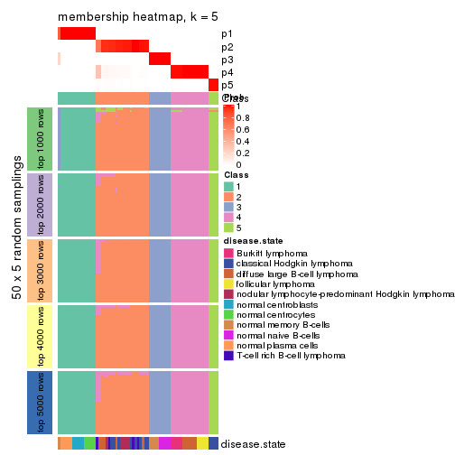</p>

</div>
<div id='tab-MAD-hclust-membership-heatmap-5'>
<pre><code class="r">membership_heatmap(res, k = 6)
</code></pre>

<p></p>

</div>
</div>

As soon as we have had the classes for columns, we can look for signatures
which are significantly different between classes which can be candidate marks
for certain classes. Following are the heatmaps for signatures.


Signature heatmaps where rows are scaled:


<script>
$( function() {
	$( '#tabs-MAD-hclust-get-signatures' ).tabs();
} );
</script>
<div id='tabs-MAD-hclust-get-signatures'>
<ul>
<li><a href='#tab-MAD-hclust-get-signatures-1'>k = 2</a></li>
<li><a href='#tab-MAD-hclust-get-signatures-2'>k = 3</a></li>
<li><a href='#tab-MAD-hclust-get-signatures-3'>k = 4</a></li>
<li><a href='#tab-MAD-hclust-get-signatures-4'>k = 5</a></li>
<li><a href='#tab-MAD-hclust-get-signatures-5'>k = 6</a></li>
</ul>
<div id='tab-MAD-hclust-get-signatures-1'>
<pre><code class="r">get_signatures(res, k = 2)
</code></pre>

<p></p>

</div>
<div id='tab-MAD-hclust-get-signatures-2'>
<pre><code class="r">get_signatures(res, k = 3)
</code></pre>

<p></p>

</div>
<div id='tab-MAD-hclust-get-signatures-3'>
<pre><code class="r">get_signatures(res, k = 4)
</code></pre>

<p></p>

</div>
<div id='tab-MAD-hclust-get-signatures-4'>
<pre><code class="r">get_signatures(res, k = 5)
</code></pre>

<p></p>

</div>
<div id='tab-MAD-hclust-get-signatures-5'>
<pre><code class="r">get_signatures(res, k = 6)
</code></pre>

<pre><code>#&gt; Error in mat[ceiling(1:nr/h_ratio), ceiling(1:nc/w_ratio), drop = FALSE]: subscript out of bounds
</code></pre>

<p></p>

</div>
</div>


Signature heatmaps where rows are not scaled:


<script>
$( function() {
	$( '#tabs-MAD-hclust-get-signatures-no-scale' ).tabs();
} );
</script>
<div id='tabs-MAD-hclust-get-signatures-no-scale'>
<ul>
<li><a href='#tab-MAD-hclust-get-signatures-no-scale-1'>k = 2</a></li>
<li><a href='#tab-MAD-hclust-get-signatures-no-scale-2'>k = 3</a></li>
<li><a href='#tab-MAD-hclust-get-signatures-no-scale-3'>k = 4</a></li>
<li><a href='#tab-MAD-hclust-get-signatures-no-scale-4'>k = 5</a></li>
<li><a href='#tab-MAD-hclust-get-signatures-no-scale-5'>k = 6</a></li>
</ul>
<div id='tab-MAD-hclust-get-signatures-no-scale-1'>
<pre><code class="r">get_signatures(res, k = 2, scale_rows = FALSE)
</code></pre>

<p></p>

</div>
<div id='tab-MAD-hclust-get-signatures-no-scale-2'>
<pre><code class="r">get_signatures(res, k = 3, scale_rows = FALSE)
</code></pre>

<p></p>

</div>
<div id='tab-MAD-hclust-get-signatures-no-scale-3'>
<pre><code class="r">get_signatures(res, k = 4, scale_rows = FALSE)
</code></pre>

<p></p>

</div>
<div id='tab-MAD-hclust-get-signatures-no-scale-4'>
<pre><code class="r">get_signatures(res, k = 5, scale_rows = FALSE)
</code></pre>

<p></p>

</div>
<div id='tab-MAD-hclust-get-signatures-no-scale-5'>
<pre><code class="r">get_signatures(res, k = 6, scale_rows = FALSE)
</code></pre>

<p></p>

</div>
</div>


Compare the overlap of signatures from different k:

```r
compare_signatures(res)
```


`get_signature()` returns a data frame invisibly. TO get the list of signatures, the function
call should be assigned to a variable explicitly. In following code, if `plot` argument is set
to `FALSE`, no heatmap is plotted while only the differential analysis is performed.

```r
# code only for demonstration
tb = get_signature(res, k = ..., plot = FALSE)
```

An example of the output of `tb` is:

```
#>   which_row         fdr    mean_1    mean_2 scaled_mean_1 scaled_mean_2 km
#> 1        38 0.042760348  8.373488  9.131774    -0.5533452     0.5164555  1
#> 2        40 0.018707592  7.106213  8.469186    -0.6173731     0.5762149  1
#> 3        55 0.019134737 10.221463 11.207825    -0.6159697     0.5749050  1
#> 4        59 0.006059896  5.921854  7.869574    -0.6899429     0.6439467  1
#> 5        60 0.018055526  8.928898 10.211722    -0.6204761     0.5791110  1
#> 6        98 0.009384629 15.714769 14.887706     0.6635654    -0.6193277  2
...
```

The columns in `tb` are:

1. `which_row`: row indices corresponding to the input matrix.
2. `fdr`: FDR for the differential test. 
3. `mean_x`: The mean value in group x.
4. `scaled_mean_x`: The mean value in group x after rows are scaled.
5. `km`: Row groups if k-means clustering is applied to rows.


UMAP plot which shows how samples are separated.


<script>
$( function() {
	$( '#tabs-MAD-hclust-dimension-reduction' ).tabs();
} );
</script>
<div id='tabs-MAD-hclust-dimension-reduction'>
<ul>
<li><a href='#tab-MAD-hclust-dimension-reduction-1'>k = 2</a></li>
<li><a href='#tab-MAD-hclust-dimension-reduction-2'>k = 3</a></li>
<li><a href='#tab-MAD-hclust-dimension-reduction-3'>k = 4</a></li>
<li><a href='#tab-MAD-hclust-dimension-reduction-4'>k = 5</a></li>
<li><a href='#tab-MAD-hclust-dimension-reduction-5'>k = 6</a></li>
</ul>
<div id='tab-MAD-hclust-dimension-reduction-1'>
<pre><code class="r">dimension_reduction(res, k = 2, method = &quot;UMAP&quot;)
</code></pre>

<p></p>

</div>
<div id='tab-MAD-hclust-dimension-reduction-2'>
<pre><code class="r">dimension_reduction(res, k = 3, method = &quot;UMAP&quot;)
</code></pre>

<p></p>

</div>
<div id='tab-MAD-hclust-dimension-reduction-3'>
<pre><code class="r">dimension_reduction(res, k = 4, method = &quot;UMAP&quot;)
</code></pre>

<p></p>

</div>
<div id='tab-MAD-hclust-dimension-reduction-4'>
<pre><code class="r">dimension_reduction(res, k = 5, method = &quot;UMAP&quot;)
</code></pre>

<p></p>

</div>
<div id='tab-MAD-hclust-dimension-reduction-5'>
<pre><code class="r">dimension_reduction(res, k = 6, method = &quot;UMAP&quot;)
</code></pre>

<p></p>

</div>
</div>


Following heatmap shows how subgroups are split when increasing `k`:

```r
collect_classes(res)
```


Test correlation between subgroups and known annotations. If the known
annotation is numeric, one-way ANOVA test is applied, and if the known
annotation is discrete, chi-squared contingency table test is applied.

```r
test_to_known_factors(res)
```

```
#>             n disease.state(p) k
#> MAD:hclust 67         1.68e-10 2
#> MAD:hclust 67         6.34e-10 3
#> MAD:hclust 67         1.51e-16 4
#> MAD:hclust 67         9.85e-21 5
#> MAD:hclust 66         1.57e-20 6
```


If matrix rows can be associated to genes, consider to use `GO_Enrichment(res,
...)` to perform function enrichment for the signature genes.


 

---------------------------------------------------


### MAD:kmeans**


The object with results only for a single top-value method and a single partition method 
can be extracted as:

```r
res = res_list["MAD", "kmeans"]
# you can also extract it by
# res = res_list["MAD:kmeans"]
```

A summary of `res` and all the functions that can be applied to it:

```r
res
```

```
#> A 'ConsensusPartition' object with k = 2, 3, 4, 5, 6.
#>   On a matrix with 51941 rows and 67 columns.
#>   Top rows (1000, 2000, 3000, 4000, 5000) are extracted by 'MAD' method.
#>   Subgroups are detected by 'kmeans' method.
#>   Performed in total 1250 partitions by row resampling.
#>   Best k for subgroups seems to be 2.
#> 
#> Following methods can be applied to this 'ConsensusPartition' object:
#>  [1] "cola_report"             "collect_classes"         "collect_plots"          
#>  [4] "collect_stats"           "colnames"                "compare_signatures"     
#>  [7] "consensus_heatmap"       "dimension_reduction"     "functional_enrichment"  
#> [10] "get_anno_col"            "get_anno"                "get_classes"            
#> [13] "get_consensus"           "get_matrix"              "get_membership"         
#> [16] "get_param"               "get_signatures"          "get_stats"              
#> [19] "is_best_k"               "is_stable_k"             "membership_heatmap"     
#> [22] "ncol"                    "nrow"                    "plot_ecdf"              
#> [25] "rownames"                "select_partition_number" "show"                   
#> [28] "suggest_best_k"          "test_to_known_factors"
```

`collect_plots()` function collects all the plots made from `res` for all `k` (number of partitions)
into one single page to provide an easy and fast comparison between different `k`.

```r
collect_plots(res)
```


The plots are:

- The first row: a plot of the ECDF (Empirical cumulative distribution
  function) curves of the consensus matrix for each `k` and the heatmap of
  predicted classes for each `k`.
- The second row: heatmaps of the consensus matrix for each `k`.
- The third row: heatmaps of the membership matrix for each `k`.
- The fouth row: heatmaps of the signatures for each `k`.

All the plots in panels can be made by individual functions and they are
plotted later in this section.

`select_partition_number()` produces several plots showing different
statistics for choosing "optimized" `k`. There are following statistics:

- ECDF curves of the consensus matrix for each `k`;
- 1-PAC. [The PAC
  score](https://en.wikipedia.org/wiki/Consensus_clustering#Over-interpretation_potential_of_consensus_clustering)
  measures the proportion of the ambiguous subgrouping.
- Mean silhouette score.
- Concordance. The mean probability of fiting the consensus class ids in all
  partitions.
- Area increased. Denote $A_k$ as the area under the ECDF curve for current
  `k`, the area increased is defined as $A_k - A_{k-1}$.
- Rand index. The percent of pairs of samples that are both in a same cluster
  or both are not in a same cluster in the partition of k and k-1.
- Jaccard index. The ratio of pairs of samples are both in a same cluster in
  the partition of k and k-1 and the pairs of samples are both in a same
  cluster in the partition k or k-1.

The detailed explanations of these statistics can be found in [the cola
vignette](http://bioconductor.org/packages/devel/bioc/vignettes/cola/inst/doc/cola.html#toc_13).

Generally speaking, lower PAC score, higher mean silhouette score or higher
concordance corresponds to better partition. Rand index and Jaccard index
measure how similar the current partition is compared to partition with `k-1`.
If they are too similar, we won't accept `k` is better than `k-1`.

```r
select_partition_number(res)
```

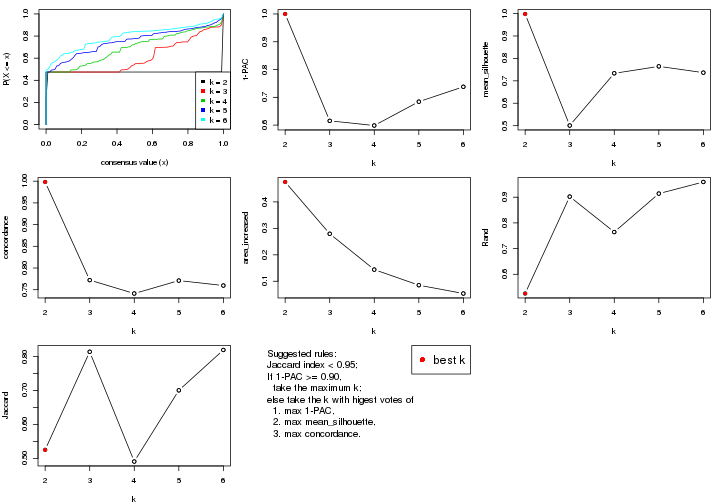

The numeric values for all these statistics can be obtained by `get_stats()`.

```r
get_stats(res)
```

```
#>   k 1-PAC mean_silhouette concordance area_increased  Rand Jaccard
#> 2 2 1.000           0.998       0.998         0.4754 0.525   0.525
#> 3 3 0.615           0.501       0.772         0.2796 0.902   0.814
#> 4 4 0.599           0.734       0.741         0.1441 0.764   0.491
#> 5 5 0.684           0.764       0.771         0.0851 0.914   0.700
#> 6 6 0.738           0.736       0.760         0.0536 0.959   0.819
```

`suggest_best_k()` suggests the best $k$ based on these statistics. The rules are as follows:

- All $k$ with Jaccard index larger than 0.95 are removed because the increase of
  the partition number does not provides enough extra information. If all $k$ are removed,
  the best $k$ is assigned by `NA`.
- For $k$ with 1-PAC larger than 0.9, the maximal $k$ is taken as the "best k". Other $k$ is called "optional k".
- If it does not fit the second rule. The $k$ with the highest vote of highest
  1-PAC, mean silhouette and concordance is taken as the "best k".

```r
suggest_best_k(res)
```

```
#> [1] 2
```


Following shows the table of the partitions (You need to click the **show/hide
code output** link to see it). The membership matrix (columns with name `p*`)
is inferred by
[`clue::cl_consensus()`](https://www.rdocumentation.org/link/cl_consensus?package=clue)
function with the `SE` method. Basically the value in the membership matrix
represents the probability to belong to a certain group. The finall class
label for an item is determined with the group with highest probability it
belongs to.

In `get_classes()` function, the entropy is calculated from the membership
matrix and the silhouette score is calculated from the consensus matrix.


<script>
$( function() {
	$( '#tabs-MAD-kmeans-get-classes' ).tabs();
} );
</script>
<div id='tabs-MAD-kmeans-get-classes'>
<ul>
<li><a href='#tab-MAD-kmeans-get-classes-1'>k = 2</a></li>
<li><a href='#tab-MAD-kmeans-get-classes-2'>k = 3</a></li>
<li><a href='#tab-MAD-kmeans-get-classes-3'>k = 4</a></li>
<li><a href='#tab-MAD-kmeans-get-classes-4'>k = 5</a></li>
<li><a href='#tab-MAD-kmeans-get-classes-5'>k = 6</a></li>
</ul>

<div id='tab-MAD-kmeans-get-classes-1'>
<p><a id='tab-MAD-kmeans-get-classes-1-a' style='color:#0366d6' href='#'>show/hide code output</a></p>
<pre><code class="r">cbind(get_classes(res, k = 2), get_membership(res, k = 2))
</code></pre>

<pre><code>#&gt;           class entropy silhouette    p1    p2
#&gt; GSM312811     2  0.0000      0.998 0.000 1.000
#&gt; GSM312812     2  0.0000      0.998 0.000 1.000
#&gt; GSM312813     2  0.0000      0.998 0.000 1.000
#&gt; GSM312814     2  0.0000      0.998 0.000 1.000
#&gt; GSM312815     2  0.0000      0.998 0.000 1.000
#&gt; GSM312816     2  0.0000      0.998 0.000 1.000
#&gt; GSM312817     2  0.0000      0.998 0.000 1.000
#&gt; GSM312818     2  0.0000      0.998 0.000 1.000
#&gt; GSM312819     2  0.0000      0.998 0.000 1.000
#&gt; GSM312820     2  0.0000      0.998 0.000 1.000
#&gt; GSM312821     2  0.0000      0.998 0.000 1.000
#&gt; GSM312822     2  0.0000      0.998 0.000 1.000
#&gt; GSM312823     2  0.0000      0.998 0.000 1.000
#&gt; GSM312824     2  0.0000      0.998 0.000 1.000
#&gt; GSM312825     2  0.0000      0.998 0.000 1.000
#&gt; GSM312826     2  0.0000      0.998 0.000 1.000
#&gt; GSM312839     2  0.0000      0.998 0.000 1.000
#&gt; GSM312840     2  0.0000      0.998 0.000 1.000
#&gt; GSM312841     2  0.0000      0.998 0.000 1.000
#&gt; GSM312843     2  0.0000      0.998 0.000 1.000
#&gt; GSM312844     2  0.0000      0.998 0.000 1.000
#&gt; GSM312845     2  0.0376      0.997 0.004 0.996
#&gt; GSM312846     2  0.0376      0.997 0.004 0.996
#&gt; GSM312847     2  0.0376      0.997 0.004 0.996
#&gt; GSM312848     2  0.0376      0.997 0.004 0.996
#&gt; GSM312849     2  0.0376      0.997 0.004 0.996
#&gt; GSM312851     2  0.0376      0.997 0.004 0.996
#&gt; GSM312853     2  0.0376      0.997 0.004 0.996
#&gt; GSM312854     2  0.0376      0.997 0.004 0.996
#&gt; GSM312856     2  0.0376      0.997 0.004 0.996
#&gt; GSM312857     2  0.0376      0.997 0.004 0.996
#&gt; GSM312858     2  0.0376      0.997 0.004 0.996
#&gt; GSM312859     2  0.0000      0.998 0.000 1.000
#&gt; GSM312860     2  0.0000      0.998 0.000 1.000
#&gt; GSM312861     2  0.0376      0.997 0.004 0.996
#&gt; GSM312862     2  0.0000      0.998 0.000 1.000
#&gt; GSM312863     2  0.0376      0.997 0.004 0.996
#&gt; GSM312864     2  0.0000      0.998 0.000 1.000
#&gt; GSM312865     2  0.0376      0.997 0.004 0.996
#&gt; GSM312867     2  0.0376      0.997 0.004 0.996
#&gt; GSM312868     2  0.0376      0.997 0.004 0.996
#&gt; GSM312869     2  0.0000      0.998 0.000 1.000
#&gt; GSM312870     1  0.0376      0.998 0.996 0.004
#&gt; GSM312872     1  0.0376      0.998 0.996 0.004
#&gt; GSM312874     1  0.0376      0.998 0.996 0.004
#&gt; GSM312875     1  0.0376      0.998 0.996 0.004
#&gt; GSM312876     1  0.0376      0.998 0.996 0.004
#&gt; GSM312877     1  0.0376      0.998 0.996 0.004
#&gt; GSM312879     1  0.0376      0.998 0.996 0.004
#&gt; GSM312882     1  0.0376      0.998 0.996 0.004
#&gt; GSM312883     1  0.0376      0.998 0.996 0.004
#&gt; GSM312886     1  0.0376      0.998 0.996 0.004
#&gt; GSM312887     1  0.0000      0.997 1.000 0.000
#&gt; GSM312890     1  0.0000      0.997 1.000 0.000
#&gt; GSM312893     1  0.0000      0.997 1.000 0.000
#&gt; GSM312894     1  0.0000      0.997 1.000 0.000
#&gt; GSM312895     1  0.0000      0.997 1.000 0.000
#&gt; GSM312937     1  0.0000      0.997 1.000 0.000
#&gt; GSM312938     1  0.0000      0.997 1.000 0.000
#&gt; GSM312939     1  0.0000      0.997 1.000 0.000
#&gt; GSM312940     1  0.0000      0.997 1.000 0.000
#&gt; GSM312941     1  0.0000      0.997 1.000 0.000
#&gt; GSM312942     1  0.0376      0.998 0.996 0.004
#&gt; GSM312943     1  0.0376      0.998 0.996 0.004
#&gt; GSM312944     1  0.0376      0.998 0.996 0.004
#&gt; GSM312945     1  0.0376      0.998 0.996 0.004
#&gt; GSM312946     1  0.0376      0.998 0.996 0.004
</code></pre>

<script>
$('#tab-MAD-kmeans-get-classes-1-a').parent().next().next().hide();
$('#tab-MAD-kmeans-get-classes-1-a').click(function(){
  $('#tab-MAD-kmeans-get-classes-1-a').parent().next().next().toggle();
  return(false);
});
</script>
</div>

<div id='tab-MAD-kmeans-get-classes-2'>
<p><a id='tab-MAD-kmeans-get-classes-2-a' style='color:#0366d6' href='#'>show/hide code output</a></p>
<pre><code class="r">cbind(get_classes(res, k = 3), get_membership(res, k = 3))
</code></pre>

<pre><code>#&gt;           class entropy silhouette    p1    p2    p3
#&gt; GSM312811     2  0.3267      0.492 0.000 0.884 0.116
#&gt; GSM312812     2  0.0592      0.566 0.000 0.988 0.012
#&gt; GSM312813     2  0.0000      0.568 0.000 1.000 0.000
#&gt; GSM312814     2  0.3267      0.492 0.000 0.884 0.116
#&gt; GSM312815     2  0.0592      0.566 0.000 0.988 0.012
#&gt; GSM312816     2  0.4452      0.415 0.000 0.808 0.192
#&gt; GSM312817     2  0.0747      0.563 0.000 0.984 0.016
#&gt; GSM312818     2  0.4452      0.415 0.000 0.808 0.192
#&gt; GSM312819     2  0.3619      0.469 0.000 0.864 0.136
#&gt; GSM312820     2  0.4452      0.415 0.000 0.808 0.192
#&gt; GSM312821     2  0.4452      0.415 0.000 0.808 0.192
#&gt; GSM312822     2  0.3267      0.492 0.000 0.884 0.116
#&gt; GSM312823     2  0.0000      0.568 0.000 1.000 0.000
#&gt; GSM312824     2  0.0000      0.568 0.000 1.000 0.000
#&gt; GSM312825     2  0.0000      0.568 0.000 1.000 0.000
#&gt; GSM312826     2  0.0000      0.568 0.000 1.000 0.000
#&gt; GSM312839     2  0.0000      0.568 0.000 1.000 0.000
#&gt; GSM312840     2  0.0424      0.567 0.000 0.992 0.008
#&gt; GSM312841     2  0.0747      0.565 0.000 0.984 0.016
#&gt; GSM312843     2  0.6140     -0.549 0.000 0.596 0.404
#&gt; GSM312844     2  0.0000      0.568 0.000 1.000 0.000
#&gt; GSM312845     2  0.6451     -0.485 0.008 0.608 0.384
#&gt; GSM312846     2  0.6062     -0.471 0.000 0.616 0.384
#&gt; GSM312847     2  0.6062     -0.471 0.000 0.616 0.384
#&gt; GSM312848     2  0.6062     -0.471 0.000 0.616 0.384
#&gt; GSM312849     2  0.6062     -0.471 0.000 0.616 0.384
#&gt; GSM312851     3  0.6291      0.980 0.000 0.468 0.532
#&gt; GSM312853     3  0.6295      0.989 0.000 0.472 0.528
#&gt; GSM312854     3  0.6299      0.990 0.000 0.476 0.524
#&gt; GSM312856     3  0.6299      0.990 0.000 0.476 0.524
#&gt; GSM312857     3  0.6295      0.989 0.000 0.472 0.528
#&gt; GSM312858     2  0.6062     -0.471 0.000 0.616 0.384
#&gt; GSM312859     2  0.2448      0.475 0.000 0.924 0.076
#&gt; GSM312860     2  0.3816      0.317 0.000 0.852 0.148
#&gt; GSM312861     2  0.6062     -0.471 0.000 0.616 0.384
#&gt; GSM312862     2  0.6062     -0.471 0.000 0.616 0.384
#&gt; GSM312863     3  0.6299      0.990 0.000 0.476 0.524
#&gt; GSM312864     2  0.5291      0.218 0.000 0.732 0.268
#&gt; GSM312865     2  0.6062     -0.471 0.000 0.616 0.384
#&gt; GSM312867     2  0.6062     -0.471 0.000 0.616 0.384
#&gt; GSM312868     2  0.6062     -0.471 0.000 0.616 0.384
#&gt; GSM312869     2  0.0000      0.568 0.000 1.000 0.000
#&gt; GSM312870     1  0.6062      0.840 0.616 0.000 0.384
#&gt; GSM312872     1  0.6062      0.840 0.616 0.000 0.384
#&gt; GSM312874     1  0.6062      0.840 0.616 0.000 0.384
#&gt; GSM312875     1  0.6062      0.840 0.616 0.000 0.384
#&gt; GSM312876     1  0.6062      0.840 0.616 0.000 0.384
#&gt; GSM312877     1  0.5529      0.856 0.704 0.000 0.296
#&gt; GSM312879     1  0.6062      0.840 0.616 0.000 0.384
#&gt; GSM312882     1  0.6062      0.840 0.616 0.000 0.384
#&gt; GSM312883     1  0.6062      0.840 0.616 0.000 0.384
#&gt; GSM312886     1  0.6062      0.840 0.616 0.000 0.384
#&gt; GSM312887     1  0.0000      0.862 1.000 0.000 0.000
#&gt; GSM312890     1  0.0000      0.862 1.000 0.000 0.000
#&gt; GSM312893     1  0.0000      0.862 1.000 0.000 0.000
#&gt; GSM312894     1  0.0000      0.862 1.000 0.000 0.000
#&gt; GSM312895     1  0.0000      0.862 1.000 0.000 0.000
#&gt; GSM312937     1  0.0000      0.862 1.000 0.000 0.000
#&gt; GSM312938     1  0.0000      0.862 1.000 0.000 0.000
#&gt; GSM312939     1  0.0000      0.862 1.000 0.000 0.000
#&gt; GSM312940     1  0.0000      0.862 1.000 0.000 0.000
#&gt; GSM312941     1  0.0000      0.862 1.000 0.000 0.000
#&gt; GSM312942     1  0.4346      0.867 0.816 0.000 0.184
#&gt; GSM312943     1  0.4346      0.867 0.816 0.000 0.184
#&gt; GSM312944     1  0.4346      0.867 0.816 0.000 0.184
#&gt; GSM312945     1  0.4346      0.867 0.816 0.000 0.184
#&gt; GSM312946     1  0.4346      0.867 0.816 0.000 0.184
</code></pre>

<script>
$('#tab-MAD-kmeans-get-classes-2-a').parent().next().next().hide();
$('#tab-MAD-kmeans-get-classes-2-a').click(function(){
  $('#tab-MAD-kmeans-get-classes-2-a').parent().next().next().toggle();
  return(false);
});
</script>
</div>

<div id='tab-MAD-kmeans-get-classes-3'>
<p><a id='tab-MAD-kmeans-get-classes-3-a' style='color:#0366d6' href='#'>show/hide code output</a></p>
<pre><code class="r">cbind(get_classes(res, k = 4), get_membership(res, k = 4))
</code></pre>

<pre><code>#&gt;           class entropy silhouette    p1    p2    p3    p4
#&gt; GSM312811     2  0.5935      0.744 0.000 0.664 0.080 0.256
#&gt; GSM312812     2  0.3356      0.812 0.000 0.824 0.000 0.176
#&gt; GSM312813     2  0.3486      0.811 0.000 0.812 0.000 0.188
#&gt; GSM312814     2  0.6326      0.730 0.000 0.636 0.108 0.256
#&gt; GSM312815     2  0.3356      0.812 0.000 0.824 0.000 0.176
#&gt; GSM312816     2  0.7830      0.465 0.000 0.404 0.324 0.272
#&gt; GSM312817     2  0.3801      0.804 0.000 0.780 0.000 0.220
#&gt; GSM312818     2  0.7830      0.465 0.000 0.404 0.324 0.272
#&gt; GSM312819     2  0.5207      0.741 0.000 0.680 0.028 0.292
#&gt; GSM312820     2  0.7830      0.465 0.000 0.404 0.324 0.272
#&gt; GSM312821     2  0.7830      0.465 0.000 0.404 0.324 0.272
#&gt; GSM312822     2  0.6326      0.730 0.000 0.636 0.108 0.256
#&gt; GSM312823     2  0.3569      0.810 0.000 0.804 0.000 0.196
#&gt; GSM312824     2  0.3569      0.810 0.000 0.804 0.000 0.196
#&gt; GSM312825     2  0.3569      0.810 0.000 0.804 0.000 0.196
#&gt; GSM312826     2  0.3569      0.810 0.000 0.804 0.000 0.196
#&gt; GSM312839     2  0.3569      0.810 0.000 0.804 0.000 0.196
#&gt; GSM312840     2  0.3356      0.812 0.000 0.824 0.000 0.176
#&gt; GSM312841     2  0.4238      0.805 0.000 0.796 0.028 0.176
#&gt; GSM312843     4  0.3606      0.831 0.000 0.140 0.020 0.840
#&gt; GSM312844     2  0.3569      0.810 0.000 0.804 0.000 0.196
#&gt; GSM312845     4  0.3311      0.837 0.000 0.172 0.000 0.828
#&gt; GSM312846     4  0.3311      0.837 0.000 0.172 0.000 0.828
#&gt; GSM312847     4  0.3172      0.842 0.000 0.160 0.000 0.840
#&gt; GSM312848     4  0.3074      0.844 0.000 0.152 0.000 0.848
#&gt; GSM312849     4  0.3311      0.837 0.000 0.172 0.000 0.828
#&gt; GSM312851     4  0.2216      0.754 0.000 0.000 0.092 0.908
#&gt; GSM312853     4  0.2216      0.754 0.000 0.000 0.092 0.908
#&gt; GSM312854     4  0.2216      0.754 0.000 0.000 0.092 0.908
#&gt; GSM312856     4  0.2216      0.754 0.000 0.000 0.092 0.908
#&gt; GSM312857     4  0.2216      0.754 0.000 0.000 0.092 0.908
#&gt; GSM312858     4  0.3074      0.844 0.000 0.152 0.000 0.848
#&gt; GSM312859     2  0.4454      0.657 0.000 0.692 0.000 0.308
#&gt; GSM312860     2  0.4697      0.555 0.000 0.644 0.000 0.356
#&gt; GSM312861     4  0.3311      0.837 0.000 0.172 0.000 0.828
#&gt; GSM312862     4  0.3356      0.834 0.000 0.176 0.000 0.824
#&gt; GSM312863     4  0.1792      0.763 0.000 0.000 0.068 0.932
#&gt; GSM312864     4  0.5815      0.158 0.000 0.288 0.060 0.652
#&gt; GSM312865     4  0.3401      0.844 0.000 0.152 0.008 0.840
#&gt; GSM312867     4  0.3311      0.837 0.000 0.172 0.000 0.828
#&gt; GSM312868     4  0.3529      0.843 0.000 0.152 0.012 0.836
#&gt; GSM312869     2  0.3569      0.810 0.000 0.804 0.000 0.196
#&gt; GSM312870     3  0.4907      0.995 0.420 0.000 0.580 0.000
#&gt; GSM312872     3  0.4907      0.995 0.420 0.000 0.580 0.000
#&gt; GSM312874     3  0.4907      0.995 0.420 0.000 0.580 0.000
#&gt; GSM312875     3  0.4907      0.995 0.420 0.000 0.580 0.000
#&gt; GSM312876     3  0.4907      0.995 0.420 0.000 0.580 0.000
#&gt; GSM312877     1  0.5288     -0.728 0.520 0.008 0.472 0.000
#&gt; GSM312879     3  0.5080      0.994 0.420 0.004 0.576 0.000
#&gt; GSM312882     3  0.5212      0.992 0.420 0.008 0.572 0.000
#&gt; GSM312883     3  0.5212      0.992 0.420 0.008 0.572 0.000
#&gt; GSM312886     3  0.5212      0.992 0.420 0.008 0.572 0.000
#&gt; GSM312887     1  0.0336      0.755 0.992 0.008 0.000 0.000
#&gt; GSM312890     1  0.0000      0.758 1.000 0.000 0.000 0.000
#&gt; GSM312893     1  0.0000      0.758 1.000 0.000 0.000 0.000
#&gt; GSM312894     1  0.0000      0.758 1.000 0.000 0.000 0.000
#&gt; GSM312895     1  0.0000      0.758 1.000 0.000 0.000 0.000
#&gt; GSM312937     1  0.0000      0.758 1.000 0.000 0.000 0.000
#&gt; GSM312938     1  0.0336      0.755 0.992 0.008 0.000 0.000
#&gt; GSM312939     1  0.0000      0.758 1.000 0.000 0.000 0.000
#&gt; GSM312940     1  0.0000      0.758 1.000 0.000 0.000 0.000
#&gt; GSM312941     1  0.0000      0.758 1.000 0.000 0.000 0.000
#&gt; GSM312942     1  0.6216      0.409 0.660 0.120 0.220 0.000
#&gt; GSM312943     1  0.6216      0.409 0.660 0.120 0.220 0.000
#&gt; GSM312944     1  0.6216      0.409 0.660 0.120 0.220 0.000
#&gt; GSM312945     1  0.6216      0.409 0.660 0.120 0.220 0.000
#&gt; GSM312946     1  0.6216      0.409 0.660 0.120 0.220 0.000
</code></pre>

<script>
$('#tab-MAD-kmeans-get-classes-3-a').parent().next().next().hide();
$('#tab-MAD-kmeans-get-classes-3-a').click(function(){
  $('#tab-MAD-kmeans-get-classes-3-a').parent().next().next().toggle();
  return(false);
});
</script>
</div>

<div id='tab-MAD-kmeans-get-classes-4'>
<p><a id='tab-MAD-kmeans-get-classes-4-a' style='color:#0366d6' href='#'>show/hide code output</a></p>
<pre><code class="r">cbind(get_classes(res, k = 5), get_membership(res, k = 5))
</code></pre>

<pre><code>#&gt;           class entropy silhouette    p1    p2    p3    p4    p5
#&gt; GSM312811     2  0.4723      0.654 0.076 0.772 0.000 0.032 0.120
#&gt; GSM312812     2  0.0486      0.877 0.004 0.988 0.000 0.004 0.004
#&gt; GSM312813     2  0.1731      0.870 0.040 0.940 0.000 0.012 0.008
#&gt; GSM312814     2  0.4615      0.620 0.052 0.772 0.000 0.032 0.144
#&gt; GSM312815     2  0.1059      0.875 0.020 0.968 0.000 0.004 0.008
#&gt; GSM312816     5  0.5139      1.000 0.000 0.316 0.000 0.060 0.624
#&gt; GSM312817     2  0.2569      0.854 0.076 0.896 0.000 0.016 0.012
#&gt; GSM312818     5  0.5139      1.000 0.000 0.316 0.000 0.060 0.624
#&gt; GSM312819     2  0.3595      0.754 0.064 0.852 0.000 0.044 0.040
#&gt; GSM312820     5  0.5139      1.000 0.000 0.316 0.000 0.060 0.624
#&gt; GSM312821     5  0.5139      1.000 0.000 0.316 0.000 0.060 0.624
#&gt; GSM312822     2  0.4615      0.620 0.052 0.772 0.000 0.032 0.144
#&gt; GSM312823     2  0.1267      0.875 0.024 0.960 0.000 0.012 0.004
#&gt; GSM312824     2  0.0404      0.879 0.000 0.988 0.000 0.012 0.000
#&gt; GSM312825     2  0.0404      0.879 0.000 0.988 0.000 0.012 0.000
#&gt; GSM312826     2  0.0404      0.879 0.000 0.988 0.000 0.012 0.000
#&gt; GSM312839     2  0.1012      0.877 0.020 0.968 0.000 0.012 0.000
#&gt; GSM312840     2  0.1116      0.871 0.028 0.964 0.000 0.004 0.004
#&gt; GSM312841     2  0.1750      0.844 0.028 0.936 0.000 0.000 0.036
#&gt; GSM312843     4  0.6178      0.718 0.128 0.212 0.000 0.628 0.032
#&gt; GSM312844     2  0.1012      0.877 0.020 0.968 0.000 0.012 0.000
#&gt; GSM312845     4  0.2648      0.809 0.000 0.152 0.000 0.848 0.000
#&gt; GSM312846     4  0.2648      0.809 0.000 0.152 0.000 0.848 0.000
#&gt; GSM312847     4  0.2605      0.809 0.000 0.148 0.000 0.852 0.000
#&gt; GSM312848     4  0.2516      0.810 0.000 0.140 0.000 0.860 0.000
#&gt; GSM312849     4  0.2648      0.809 0.000 0.152 0.000 0.848 0.000
#&gt; GSM312851     4  0.6191      0.677 0.164 0.052 0.000 0.652 0.132
#&gt; GSM312853     4  0.6191      0.677 0.164 0.052 0.000 0.652 0.132
#&gt; GSM312854     4  0.6127      0.681 0.164 0.048 0.000 0.656 0.132
#&gt; GSM312856     4  0.6127      0.681 0.164 0.048 0.000 0.656 0.132
#&gt; GSM312857     4  0.6191      0.677 0.164 0.052 0.000 0.652 0.132
#&gt; GSM312858     4  0.3099      0.810 0.012 0.132 0.000 0.848 0.008
#&gt; GSM312859     2  0.2828      0.759 0.020 0.872 0.000 0.104 0.004
#&gt; GSM312860     2  0.3128      0.660 0.004 0.824 0.000 0.168 0.004
#&gt; GSM312861     4  0.2648      0.809 0.000 0.152 0.000 0.848 0.000
#&gt; GSM312862     4  0.3850      0.776 0.032 0.172 0.000 0.792 0.004
#&gt; GSM312863     4  0.5576      0.706 0.164 0.048 0.000 0.704 0.084
#&gt; GSM312864     4  0.7876      0.153 0.188 0.308 0.000 0.408 0.096
#&gt; GSM312865     4  0.2865      0.810 0.008 0.132 0.000 0.856 0.004
#&gt; GSM312867     4  0.2648      0.809 0.000 0.152 0.000 0.848 0.000
#&gt; GSM312868     4  0.4268      0.802 0.060 0.132 0.000 0.792 0.016
#&gt; GSM312869     2  0.0404      0.879 0.000 0.988 0.000 0.012 0.000
#&gt; GSM312870     3  0.0000      0.723 0.000 0.000 1.000 0.000 0.000
#&gt; GSM312872     3  0.0000      0.723 0.000 0.000 1.000 0.000 0.000
#&gt; GSM312874     3  0.0000      0.723 0.000 0.000 1.000 0.000 0.000
#&gt; GSM312875     3  0.0000      0.723 0.000 0.000 1.000 0.000 0.000
#&gt; GSM312876     3  0.0000      0.723 0.000 0.000 1.000 0.000 0.000
#&gt; GSM312877     3  0.3696      0.647 0.092 0.000 0.840 0.028 0.040
#&gt; GSM312879     3  0.1117      0.720 0.000 0.000 0.964 0.020 0.016
#&gt; GSM312882     3  0.1830      0.715 0.000 0.000 0.932 0.028 0.040
#&gt; GSM312883     3  0.1830      0.715 0.000 0.000 0.932 0.028 0.040
#&gt; GSM312886     3  0.1493      0.718 0.000 0.000 0.948 0.024 0.028
#&gt; GSM312887     1  0.4442      0.969 0.688 0.000 0.284 0.000 0.028
#&gt; GSM312890     1  0.3707      0.992 0.716 0.000 0.284 0.000 0.000
#&gt; GSM312893     1  0.3707      0.992 0.716 0.000 0.284 0.000 0.000
#&gt; GSM312894     1  0.3707      0.992 0.716 0.000 0.284 0.000 0.000
#&gt; GSM312895     1  0.3707      0.992 0.716 0.000 0.284 0.000 0.000
#&gt; GSM312937     1  0.3707      0.992 0.716 0.000 0.284 0.000 0.000
#&gt; GSM312938     1  0.4442      0.969 0.688 0.000 0.284 0.000 0.028
#&gt; GSM312939     1  0.3707      0.992 0.716 0.000 0.284 0.000 0.000
#&gt; GSM312940     1  0.3707      0.992 0.716 0.000 0.284 0.000 0.000
#&gt; GSM312941     1  0.3707      0.992 0.716 0.000 0.284 0.000 0.000
#&gt; GSM312942     3  0.7031      0.195 0.312 0.000 0.452 0.020 0.216
#&gt; GSM312943     3  0.7031      0.195 0.312 0.000 0.452 0.020 0.216
#&gt; GSM312944     3  0.7031      0.195 0.312 0.000 0.452 0.020 0.216
#&gt; GSM312945     3  0.7031      0.195 0.312 0.000 0.452 0.020 0.216
#&gt; GSM312946     3  0.7031      0.195 0.312 0.000 0.452 0.020 0.216
</code></pre>

<script>
$('#tab-MAD-kmeans-get-classes-4-a').parent().next().next().hide();
$('#tab-MAD-kmeans-get-classes-4-a').click(function(){
  $('#tab-MAD-kmeans-get-classes-4-a').parent().next().next().toggle();
  return(false);
});
</script>
</div>

<div id='tab-MAD-kmeans-get-classes-5'>
<p><a id='tab-MAD-kmeans-get-classes-5-a' style='color:#0366d6' href='#'>show/hide code output</a></p>
<pre><code class="r">cbind(get_classes(res, k = 6), get_membership(res, k = 6))
</code></pre>

<pre><code>#&gt;           class entropy silhouette    p1    p2    p3    p4    p5    p6
#&gt; GSM312811     2  0.6260     0.6191 0.136 0.632 0.000 0.024 0.104 0.104
#&gt; GSM312812     2  0.0777     0.8457 0.024 0.972 0.000 0.000 0.000 0.004
#&gt; GSM312813     2  0.3647     0.7929 0.100 0.820 0.000 0.008 0.012 0.060
#&gt; GSM312814     2  0.6056     0.5982 0.096 0.652 0.000 0.028 0.144 0.080
#&gt; GSM312815     2  0.1649     0.8411 0.032 0.932 0.000 0.000 0.000 0.036
#&gt; GSM312816     5  0.3841     1.0000 0.000 0.168 0.000 0.068 0.764 0.000
#&gt; GSM312817     2  0.4937     0.7497 0.144 0.720 0.000 0.008 0.028 0.100
#&gt; GSM312818     5  0.3841     1.0000 0.000 0.168 0.000 0.068 0.764 0.000
#&gt; GSM312819     2  0.4945     0.7221 0.116 0.744 0.000 0.032 0.032 0.076
#&gt; GSM312820     5  0.3841     1.0000 0.000 0.168 0.000 0.068 0.764 0.000
#&gt; GSM312821     5  0.3841     1.0000 0.000 0.168 0.000 0.068 0.764 0.000
#&gt; GSM312822     2  0.6056     0.5982 0.096 0.652 0.000 0.028 0.144 0.080
#&gt; GSM312823     2  0.2562     0.8383 0.032 0.896 0.000 0.008 0.016 0.048
#&gt; GSM312824     2  0.0622     0.8443 0.000 0.980 0.000 0.008 0.000 0.012
#&gt; GSM312825     2  0.0622     0.8443 0.000 0.980 0.000 0.008 0.000 0.012
#&gt; GSM312826     2  0.0622     0.8443 0.000 0.980 0.000 0.008 0.000 0.012
#&gt; GSM312839     2  0.1933     0.8414 0.032 0.920 0.000 0.004 0.000 0.044
#&gt; GSM312840     2  0.1485     0.8347 0.028 0.944 0.000 0.004 0.000 0.024
#&gt; GSM312841     2  0.1882     0.8246 0.028 0.928 0.000 0.000 0.020 0.024
#&gt; GSM312843     4  0.7446     0.0826 0.112 0.252 0.000 0.452 0.024 0.160
#&gt; GSM312844     2  0.2000     0.8410 0.032 0.916 0.000 0.004 0.000 0.048
#&gt; GSM312845     6  0.5128     0.9347 0.008 0.072 0.000 0.356 0.000 0.564
#&gt; GSM312846     6  0.5128     0.9347 0.008 0.072 0.000 0.356 0.000 0.564
#&gt; GSM312847     6  0.5081     0.9340 0.008 0.068 0.000 0.356 0.000 0.568
#&gt; GSM312848     6  0.5014     0.9238 0.008 0.060 0.000 0.368 0.000 0.564
#&gt; GSM312849     6  0.5128     0.9347 0.008 0.072 0.000 0.356 0.000 0.564
#&gt; GSM312851     4  0.0547     0.6889 0.000 0.020 0.000 0.980 0.000 0.000
#&gt; GSM312853     4  0.0458     0.6927 0.000 0.016 0.000 0.984 0.000 0.000
#&gt; GSM312854     4  0.0458     0.6927 0.000 0.016 0.000 0.984 0.000 0.000
#&gt; GSM312856     4  0.0458     0.6927 0.000 0.016 0.000 0.984 0.000 0.000
#&gt; GSM312857     4  0.0458     0.6927 0.000 0.016 0.000 0.984 0.000 0.000
#&gt; GSM312858     6  0.5598     0.8582 0.016 0.056 0.000 0.400 0.016 0.512
#&gt; GSM312859     2  0.2562     0.8048 0.008 0.892 0.000 0.012 0.024 0.064
#&gt; GSM312860     2  0.3433     0.6894 0.000 0.808 0.000 0.020 0.020 0.152
#&gt; GSM312861     6  0.5026     0.9327 0.000 0.072 0.000 0.356 0.004 0.568
#&gt; GSM312862     6  0.6357     0.7248 0.044 0.100 0.000 0.296 0.020 0.540
#&gt; GSM312863     4  0.1536     0.6407 0.004 0.016 0.000 0.940 0.000 0.040
#&gt; GSM312864     4  0.7080     0.2584 0.128 0.236 0.000 0.520 0.040 0.076
#&gt; GSM312865     6  0.5034     0.8731 0.008 0.056 0.000 0.404 0.000 0.532
#&gt; GSM312867     6  0.4893     0.9342 0.000 0.072 0.000 0.356 0.000 0.572
#&gt; GSM312868     4  0.5707    -0.7591 0.016 0.056 0.000 0.464 0.020 0.444
#&gt; GSM312869     2  0.0622     0.8443 0.000 0.980 0.000 0.008 0.000 0.012
#&gt; GSM312870     3  0.0000     0.7011 0.000 0.000 1.000 0.000 0.000 0.000
#&gt; GSM312872     3  0.0000     0.7011 0.000 0.000 1.000 0.000 0.000 0.000
#&gt; GSM312874     3  0.0000     0.7011 0.000 0.000 1.000 0.000 0.000 0.000
#&gt; GSM312875     3  0.0000     0.7011 0.000 0.000 1.000 0.000 0.000 0.000
#&gt; GSM312876     3  0.0000     0.7011 0.000 0.000 1.000 0.000 0.000 0.000
#&gt; GSM312877     3  0.4082     0.6422 0.072 0.000 0.792 0.008 0.020 0.108
#&gt; GSM312879     3  0.1333     0.6983 0.000 0.000 0.944 0.000 0.008 0.048
#&gt; GSM312882     3  0.2699     0.6847 0.000 0.000 0.864 0.008 0.020 0.108
#&gt; GSM312883     3  0.2699     0.6847 0.000 0.000 0.864 0.008 0.020 0.108
#&gt; GSM312886     3  0.2095     0.6933 0.000 0.000 0.904 0.004 0.016 0.076
#&gt; GSM312887     1  0.4317     0.9462 0.728 0.000 0.216 0.008 0.012 0.036
#&gt; GSM312890     1  0.2912     0.9852 0.784 0.000 0.216 0.000 0.000 0.000
#&gt; GSM312893     1  0.3052     0.9852 0.780 0.000 0.216 0.000 0.004 0.000
#&gt; GSM312894     1  0.3052     0.9852 0.780 0.000 0.216 0.000 0.004 0.000
#&gt; GSM312895     1  0.2912     0.9852 0.784 0.000 0.216 0.000 0.000 0.000
#&gt; GSM312937     1  0.2912     0.9852 0.784 0.000 0.216 0.000 0.000 0.000
#&gt; GSM312938     1  0.4317     0.9462 0.728 0.000 0.216 0.008 0.012 0.036
#&gt; GSM312939     1  0.2912     0.9852 0.784 0.000 0.216 0.000 0.000 0.000
#&gt; GSM312940     1  0.3052     0.9852 0.780 0.000 0.216 0.000 0.004 0.000
#&gt; GSM312941     1  0.3052     0.9852 0.780 0.000 0.216 0.000 0.004 0.000
#&gt; GSM312942     3  0.7417     0.2351 0.304 0.000 0.360 0.000 0.172 0.164
#&gt; GSM312943     3  0.7417     0.2351 0.304 0.000 0.360 0.000 0.172 0.164
#&gt; GSM312944     3  0.7417     0.2351 0.304 0.000 0.360 0.000 0.172 0.164
#&gt; GSM312945     3  0.7417     0.2351 0.304 0.000 0.360 0.000 0.172 0.164
#&gt; GSM312946     3  0.7417     0.2351 0.304 0.000 0.360 0.000 0.172 0.164
</code></pre>

<script>
$('#tab-MAD-kmeans-get-classes-5-a').parent().next().next().hide();
$('#tab-MAD-kmeans-get-classes-5-a').click(function(){
  $('#tab-MAD-kmeans-get-classes-5-a').parent().next().next().toggle();
  return(false);
});
</script>
</div>
</div>

Heatmaps for the consensus matrix. It visualizes the probability of two
samples to be in a same group.


<script>
$( function() {
	$( '#tabs-MAD-kmeans-consensus-heatmap' ).tabs();
} );
</script>
<div id='tabs-MAD-kmeans-consensus-heatmap'>
<ul>
<li><a href='#tab-MAD-kmeans-consensus-heatmap-1'>k = 2</a></li>
<li><a href='#tab-MAD-kmeans-consensus-heatmap-2'>k = 3</a></li>
<li><a href='#tab-MAD-kmeans-consensus-heatmap-3'>k = 4</a></li>
<li><a href='#tab-MAD-kmeans-consensus-heatmap-4'>k = 5</a></li>
<li><a href='#tab-MAD-kmeans-consensus-heatmap-5'>k = 6</a></li>
</ul>
<div id='tab-MAD-kmeans-consensus-heatmap-1'>
<pre><code class="r">consensus_heatmap(res, k = 2)
</code></pre>

<p></p>

</div>
<div id='tab-MAD-kmeans-consensus-heatmap-2'>
<pre><code class="r">consensus_heatmap(res, k = 3)
</code></pre>

<p></p>

</div>
<div id='tab-MAD-kmeans-consensus-heatmap-3'>
<pre><code class="r">consensus_heatmap(res, k = 4)
</code></pre>

<p></p>

</div>
<div id='tab-MAD-kmeans-consensus-heatmap-4'>
<pre><code class="r">consensus_heatmap(res, k = 5)
</code></pre>

<p></p>

</div>
<div id='tab-MAD-kmeans-consensus-heatmap-5'>
<pre><code class="r">consensus_heatmap(res, k = 6)
</code></pre>

<p></p>

</div>
</div>

Heatmaps for the membership of samples in all partitions to see how consistent they are:


<script>
$( function() {
	$( '#tabs-MAD-kmeans-membership-heatmap' ).tabs();
} );
</script>
<div id='tabs-MAD-kmeans-membership-heatmap'>
<ul>
<li><a href='#tab-MAD-kmeans-membership-heatmap-1'>k = 2</a></li>
<li><a href='#tab-MAD-kmeans-membership-heatmap-2'>k = 3</a></li>
<li><a href='#tab-MAD-kmeans-membership-heatmap-3'>k = 4</a></li>
<li><a href='#tab-MAD-kmeans-membership-heatmap-4'>k = 5</a></li>
<li><a href='#tab-MAD-kmeans-membership-heatmap-5'>k = 6</a></li>
</ul>
<div id='tab-MAD-kmeans-membership-heatmap-1'>
<pre><code class="r">membership_heatmap(res, k = 2)
</code></pre>

<p></p>

</div>
<div id='tab-MAD-kmeans-membership-heatmap-2'>
<pre><code class="r">membership_heatmap(res, k = 3)
</code></pre>

<p></p>

</div>
<div id='tab-MAD-kmeans-membership-heatmap-3'>
<pre><code class="r">membership_heatmap(res, k = 4)
</code></pre>

<p></p>

</div>
<div id='tab-MAD-kmeans-membership-heatmap-4'>
<pre><code class="r">membership_heatmap(res, k = 5)
</code></pre>

<p></p>

</div>
<div id='tab-MAD-kmeans-membership-heatmap-5'>
<pre><code class="r">membership_heatmap(res, k = 6)
</code></pre>

<p></p>

</div>
</div>

As soon as we have had the classes for columns, we can look for signatures
which are significantly different between classes which can be candidate marks
for certain classes. Following are the heatmaps for signatures.


Signature heatmaps where rows are scaled:


<script>
$( function() {
	$( '#tabs-MAD-kmeans-get-signatures' ).tabs();
} );
</script>
<div id='tabs-MAD-kmeans-get-signatures'>
<ul>
<li><a href='#tab-MAD-kmeans-get-signatures-1'>k = 2</a></li>
<li><a href='#tab-MAD-kmeans-get-signatures-2'>k = 3</a></li>
<li><a href='#tab-MAD-kmeans-get-signatures-3'>k = 4</a></li>
<li><a href='#tab-MAD-kmeans-get-signatures-4'>k = 5</a></li>
<li><a href='#tab-MAD-kmeans-get-signatures-5'>k = 6</a></li>
</ul>
<div id='tab-MAD-kmeans-get-signatures-1'>
<pre><code class="r">get_signatures(res, k = 2)
</code></pre>

<p></p>

</div>
<div id='tab-MAD-kmeans-get-signatures-2'>
<pre><code class="r">get_signatures(res, k = 3)
</code></pre>

<p></p>

</div>
<div id='tab-MAD-kmeans-get-signatures-3'>
<pre><code class="r">get_signatures(res, k = 4)
</code></pre>

<p></p>

</div>
<div id='tab-MAD-kmeans-get-signatures-4'>
<pre><code class="r">get_signatures(res, k = 5)
</code></pre>

<p></p>

</div>
<div id='tab-MAD-kmeans-get-signatures-5'>
<pre><code class="r">get_signatures(res, k = 6)
</code></pre>

<p></p>

</div>
</div>


Signature heatmaps where rows are not scaled:


<script>
$( function() {
	$( '#tabs-MAD-kmeans-get-signatures-no-scale' ).tabs();
} );
</script>
<div id='tabs-MAD-kmeans-get-signatures-no-scale'>
<ul>
<li><a href='#tab-MAD-kmeans-get-signatures-no-scale-1'>k = 2</a></li>
<li><a href='#tab-MAD-kmeans-get-signatures-no-scale-2'>k = 3</a></li>
<li><a href='#tab-MAD-kmeans-get-signatures-no-scale-3'>k = 4</a></li>
<li><a href='#tab-MAD-kmeans-get-signatures-no-scale-4'>k = 5</a></li>
<li><a href='#tab-MAD-kmeans-get-signatures-no-scale-5'>k = 6</a></li>
</ul>
<div id='tab-MAD-kmeans-get-signatures-no-scale-1'>
<pre><code class="r">get_signatures(res, k = 2, scale_rows = FALSE)
</code></pre>

<p></p>

</div>
<div id='tab-MAD-kmeans-get-signatures-no-scale-2'>
<pre><code class="r">get_signatures(res, k = 3, scale_rows = FALSE)
</code></pre>

<p></p>

</div>
<div id='tab-MAD-kmeans-get-signatures-no-scale-3'>
<pre><code class="r">get_signatures(res, k = 4, scale_rows = FALSE)
</code></pre>

<p></p>

</div>
<div id='tab-MAD-kmeans-get-signatures-no-scale-4'>
<pre><code class="r">get_signatures(res, k = 5, scale_rows = FALSE)
</code></pre>

<p></p>

</div>
<div id='tab-MAD-kmeans-get-signatures-no-scale-5'>
<pre><code class="r">get_signatures(res, k = 6, scale_rows = FALSE)
</code></pre>

<p></p>

</div>
</div>


Compare the overlap of signatures from different k:

```r
compare_signatures(res)
```


`get_signature()` returns a data frame invisibly. TO get the list of signatures, the function
call should be assigned to a variable explicitly. In following code, if `plot` argument is set
to `FALSE`, no heatmap is plotted while only the differential analysis is performed.

```r
# code only for demonstration
tb = get_signature(res, k = ..., plot = FALSE)
```

An example of the output of `tb` is:

```
#>   which_row         fdr    mean_1    mean_2 scaled_mean_1 scaled_mean_2 km
#> 1        38 0.042760348  8.373488  9.131774    -0.5533452     0.5164555  1
#> 2        40 0.018707592  7.106213  8.469186    -0.6173731     0.5762149  1
#> 3        55 0.019134737 10.221463 11.207825    -0.6159697     0.5749050  1
#> 4        59 0.006059896  5.921854  7.869574    -0.6899429     0.6439467  1
#> 5        60 0.018055526  8.928898 10.211722    -0.6204761     0.5791110  1
#> 6        98 0.009384629 15.714769 14.887706     0.6635654    -0.6193277  2
...
```

The columns in `tb` are:

1. `which_row`: row indices corresponding to the input matrix.
2. `fdr`: FDR for the differential test. 
3. `mean_x`: The mean value in group x.
4. `scaled_mean_x`: The mean value in group x after rows are scaled.
5. `km`: Row groups if k-means clustering is applied to rows.


UMAP plot which shows how samples are separated.


<script>
$( function() {
	$( '#tabs-MAD-kmeans-dimension-reduction' ).tabs();
} );
</script>
<div id='tabs-MAD-kmeans-dimension-reduction'>
<ul>
<li><a href='#tab-MAD-kmeans-dimension-reduction-1'>k = 2</a></li>
<li><a href='#tab-MAD-kmeans-dimension-reduction-2'>k = 3</a></li>
<li><a href='#tab-MAD-kmeans-dimension-reduction-3'>k = 4</a></li>
<li><a href='#tab-MAD-kmeans-dimension-reduction-4'>k = 5</a></li>
<li><a href='#tab-MAD-kmeans-dimension-reduction-5'>k = 6</a></li>
</ul>
<div id='tab-MAD-kmeans-dimension-reduction-1'>
<pre><code class="r">dimension_reduction(res, k = 2, method = &quot;UMAP&quot;)
</code></pre>

<p></p>

</div>
<div id='tab-MAD-kmeans-dimension-reduction-2'>
<pre><code class="r">dimension_reduction(res, k = 3, method = &quot;UMAP&quot;)
</code></pre>

<p></p>

</div>
<div id='tab-MAD-kmeans-dimension-reduction-3'>
<pre><code class="r">dimension_reduction(res, k = 4, method = &quot;UMAP&quot;)
</code></pre>

<p></p>

</div>
<div id='tab-MAD-kmeans-dimension-reduction-4'>
<pre><code class="r">dimension_reduction(res, k = 5, method = &quot;UMAP&quot;)
</code></pre>

<p></p>

</div>
<div id='tab-MAD-kmeans-dimension-reduction-5'>
<pre><code class="r">dimension_reduction(res, k = 6, method = &quot;UMAP&quot;)
</code></pre>

<p></p>

</div>
</div>


Following heatmap shows how subgroups are split when increasing `k`:

```r
collect_classes(res)
```


Test correlation between subgroups and known annotations. If the known
annotation is numeric, one-way ANOVA test is applied, and if the known
annotation is discrete, chi-squared contingency table test is applied.

```r
test_to_known_factors(res)
```

```
#>             n disease.state(p) k
#> MAD:kmeans 67         1.68e-10 2
#> MAD:kmeans 44         2.94e-10 3
#> MAD:kmeans 56         3.78e-19 4
#> MAD:kmeans 61         2.43e-20 5
#> MAD:kmeans 59         8.96e-25 6
```


If matrix rows can be associated to genes, consider to use `GO_Enrichment(res,
...)` to perform function enrichment for the signature genes.


 

---------------------------------------------------


### MAD:skmeans*


The object with results only for a single top-value method and a single partition method 
can be extracted as:

```r
res = res_list["MAD", "skmeans"]
# you can also extract it by
# res = res_list["MAD:skmeans"]
```

A summary of `res` and all the functions that can be applied to it:

```r
res
```

```
#> A 'ConsensusPartition' object with k = 2, 3, 4, 5, 6.
#>   On a matrix with 51941 rows and 67 columns.
#>   Top rows (1000, 2000, 3000, 4000, 5000) are extracted by 'MAD' method.
#>   Subgroups are detected by 'skmeans' method.
#>   Performed in total 1250 partitions by row resampling.
#>   Best k for subgroups seems to be 4.
#> 
#> Following methods can be applied to this 'ConsensusPartition' object:
#>  [1] "cola_report"             "collect_classes"         "collect_plots"          
#>  [4] "collect_stats"           "colnames"                "compare_signatures"     
#>  [7] "consensus_heatmap"       "dimension_reduction"     "functional_enrichment"  
#> [10] "get_anno_col"            "get_anno"                "get_classes"            
#> [13] "get_consensus"           "get_matrix"              "get_membership"         
#> [16] "get_param"               "get_signatures"          "get_stats"              
#> [19] "is_best_k"               "is_stable_k"             "membership_heatmap"     
#> [22] "ncol"                    "nrow"                    "plot_ecdf"              
#> [25] "rownames"                "select_partition_number" "show"                   
#> [28] "suggest_best_k"          "test_to_known_factors"
```

`collect_plots()` function collects all the plots made from `res` for all `k` (number of partitions)
into one single page to provide an easy and fast comparison between different `k`.

```r
collect_plots(res)
```


The plots are:

- The first row: a plot of the ECDF (Empirical cumulative distribution
  function) curves of the consensus matrix for each `k` and the heatmap of
  predicted classes for each `k`.
- The second row: heatmaps of the consensus matrix for each `k`.
- The third row: heatmaps of the membership matrix for each `k`.
- The fouth row: heatmaps of the signatures for each `k`.

All the plots in panels can be made by individual functions and they are
plotted later in this section.

`select_partition_number()` produces several plots showing different
statistics for choosing "optimized" `k`. There are following statistics:

- ECDF curves of the consensus matrix for each `k`;
- 1-PAC. [The PAC
  score](https://en.wikipedia.org/wiki/Consensus_clustering#Over-interpretation_potential_of_consensus_clustering)
  measures the proportion of the ambiguous subgrouping.
- Mean silhouette score.
- Concordance. The mean probability of fiting the consensus class ids in all
  partitions.
- Area increased. Denote $A_k$ as the area under the ECDF curve for current
  `k`, the area increased is defined as $A_k - A_{k-1}$.
- Rand index. The percent of pairs of samples that are both in a same cluster
  or both are not in a same cluster in the partition of k and k-1.
- Jaccard index. The ratio of pairs of samples are both in a same cluster in
  the partition of k and k-1 and the pairs of samples are both in a same
  cluster in the partition k or k-1.

The detailed explanations of these statistics can be found in [the cola
vignette](http://bioconductor.org/packages/devel/bioc/vignettes/cola/inst/doc/cola.html#toc_13).

Generally speaking, lower PAC score, higher mean silhouette score or higher
concordance corresponds to better partition. Rand index and Jaccard index
measure how similar the current partition is compared to partition with `k-1`.
If they are too similar, we won't accept `k` is better than `k-1`.

```r
select_partition_number(res)
```


The numeric values for all these statistics can be obtained by `get_stats()`.

```r
get_stats(res)
```

```
#>   k 1-PAC mean_silhouette concordance area_increased  Rand Jaccard
#> 2 2 1.000           0.990       0.996         0.4808 0.518   0.518
#> 3 3 1.000           0.939       0.970         0.3905 0.801   0.620
#> 4 4 0.904           0.898       0.929         0.1001 0.932   0.796
#> 5 5 0.802           0.668       0.845         0.0685 0.971   0.894
#> 6 6 0.849           0.811       0.838         0.0427 0.907   0.642
```

`suggest_best_k()` suggests the best $k$ based on these statistics. The rules are as follows:

- All $k$ with Jaccard index larger than 0.95 are removed because the increase of
  the partition number does not provides enough extra information. If all $k$ are removed,
  the best $k$ is assigned by `NA`.
- For $k$ with 1-PAC larger than 0.9, the maximal $k$ is taken as the "best k". Other $k$ is called "optional k".
- If it does not fit the second rule. The $k$ with the highest vote of highest
  1-PAC, mean silhouette and concordance is taken as the "best k".

```r
suggest_best_k(res)
```

```
#> [1] 4
#> attr(,"optional")
#> [1] 2 3
```

There is also optional best $k$ = 2 3 that is worth to check.

Following shows the table of the partitions (You need to click the **show/hide
code output** link to see it). The membership matrix (columns with name `p*`)
is inferred by
[`clue::cl_consensus()`](https://www.rdocumentation.org/link/cl_consensus?package=clue)
function with the `SE` method. Basically the value in the membership matrix
represents the probability to belong to a certain group. The finall class
label for an item is determined with the group with highest probability it
belongs to.

In `get_classes()` function, the entropy is calculated from the membership
matrix and the silhouette score is calculated from the consensus matrix.


<script>
$( function() {
	$( '#tabs-MAD-skmeans-get-classes' ).tabs();
} );
</script>
<div id='tabs-MAD-skmeans-get-classes'>
<ul>
<li><a href='#tab-MAD-skmeans-get-classes-1'>k = 2</a></li>
<li><a href='#tab-MAD-skmeans-get-classes-2'>k = 3</a></li>
<li><a href='#tab-MAD-skmeans-get-classes-3'>k = 4</a></li>
<li><a href='#tab-MAD-skmeans-get-classes-4'>k = 5</a></li>
<li><a href='#tab-MAD-skmeans-get-classes-5'>k = 6</a></li>
</ul>

<div id='tab-MAD-skmeans-get-classes-1'>
<p><a id='tab-MAD-skmeans-get-classes-1-a' style='color:#0366d6' href='#'>show/hide code output</a></p>
<pre><code class="r">cbind(get_classes(res, k = 2), get_membership(res, k = 2))
</code></pre>

<pre><code>#&gt;           class entropy silhouette    p1    p2
#&gt; GSM312811     2   0.000      0.999 0.000 1.000
#&gt; GSM312812     2   0.000      0.999 0.000 1.000
#&gt; GSM312813     2   0.000      0.999 0.000 1.000
#&gt; GSM312814     2   0.000      0.999 0.000 1.000
#&gt; GSM312815     2   0.000      0.999 0.000 1.000
#&gt; GSM312816     2   0.000      0.999 0.000 1.000
#&gt; GSM312817     2   0.000      0.999 0.000 1.000
#&gt; GSM312818     2   0.000      0.999 0.000 1.000
#&gt; GSM312819     2   0.000      0.999 0.000 1.000
#&gt; GSM312820     2   0.000      0.999 0.000 1.000
#&gt; GSM312821     2   0.000      0.999 0.000 1.000
#&gt; GSM312822     2   0.000      0.999 0.000 1.000
#&gt; GSM312823     2   0.000      0.999 0.000 1.000
#&gt; GSM312824     2   0.000      0.999 0.000 1.000
#&gt; GSM312825     2   0.000      0.999 0.000 1.000
#&gt; GSM312826     2   0.000      0.999 0.000 1.000
#&gt; GSM312839     2   0.000      0.999 0.000 1.000
#&gt; GSM312840     2   0.000      0.999 0.000 1.000
#&gt; GSM312841     2   0.000      0.999 0.000 1.000
#&gt; GSM312843     2   0.000      0.999 0.000 1.000
#&gt; GSM312844     2   0.000      0.999 0.000 1.000
#&gt; GSM312845     1   0.844      0.626 0.728 0.272
#&gt; GSM312846     2   0.141      0.979 0.020 0.980
#&gt; GSM312847     2   0.000      0.999 0.000 1.000
#&gt; GSM312848     2   0.000      0.999 0.000 1.000
#&gt; GSM312849     2   0.000      0.999 0.000 1.000
#&gt; GSM312851     2   0.000      0.999 0.000 1.000
#&gt; GSM312853     2   0.000      0.999 0.000 1.000
#&gt; GSM312854     2   0.000      0.999 0.000 1.000
#&gt; GSM312856     2   0.000      0.999 0.000 1.000
#&gt; GSM312857     2   0.000      0.999 0.000 1.000
#&gt; GSM312858     2   0.000      0.999 0.000 1.000
#&gt; GSM312859     2   0.000      0.999 0.000 1.000
#&gt; GSM312860     2   0.000      0.999 0.000 1.000
#&gt; GSM312861     2   0.000      0.999 0.000 1.000
#&gt; GSM312862     2   0.000      0.999 0.000 1.000
#&gt; GSM312863     2   0.000      0.999 0.000 1.000
#&gt; GSM312864     2   0.000      0.999 0.000 1.000
#&gt; GSM312865     2   0.000      0.999 0.000 1.000
#&gt; GSM312867     2   0.000      0.999 0.000 1.000
#&gt; GSM312868     2   0.000      0.999 0.000 1.000
#&gt; GSM312869     2   0.000      0.999 0.000 1.000
#&gt; GSM312870     1   0.000      0.989 1.000 0.000
#&gt; GSM312872     1   0.000      0.989 1.000 0.000
#&gt; GSM312874     1   0.000      0.989 1.000 0.000
#&gt; GSM312875     1   0.000      0.989 1.000 0.000
#&gt; GSM312876     1   0.000      0.989 1.000 0.000
#&gt; GSM312877     1   0.000      0.989 1.000 0.000
#&gt; GSM312879     1   0.000      0.989 1.000 0.000
#&gt; GSM312882     1   0.000      0.989 1.000 0.000
#&gt; GSM312883     1   0.000      0.989 1.000 0.000
#&gt; GSM312886     1   0.000      0.989 1.000 0.000
#&gt; GSM312887     1   0.000      0.989 1.000 0.000
#&gt; GSM312890     1   0.000      0.989 1.000 0.000
#&gt; GSM312893     1   0.000      0.989 1.000 0.000
#&gt; GSM312894     1   0.000      0.989 1.000 0.000
#&gt; GSM312895     1   0.000      0.989 1.000 0.000
#&gt; GSM312937     1   0.000      0.989 1.000 0.000
#&gt; GSM312938     1   0.000      0.989 1.000 0.000
#&gt; GSM312939     1   0.000      0.989 1.000 0.000
#&gt; GSM312940     1   0.000      0.989 1.000 0.000
#&gt; GSM312941     1   0.000      0.989 1.000 0.000
#&gt; GSM312942     1   0.000      0.989 1.000 0.000
#&gt; GSM312943     1   0.000      0.989 1.000 0.000
#&gt; GSM312944     1   0.000      0.989 1.000 0.000
#&gt; GSM312945     1   0.000      0.989 1.000 0.000
#&gt; GSM312946     1   0.000      0.989 1.000 0.000
</code></pre>

<script>
$('#tab-MAD-skmeans-get-classes-1-a').parent().next().next().hide();
$('#tab-MAD-skmeans-get-classes-1-a').click(function(){
  $('#tab-MAD-skmeans-get-classes-1-a').parent().next().next().toggle();
  return(false);
});
</script>
</div>

<div id='tab-MAD-skmeans-get-classes-2'>
<p><a id='tab-MAD-skmeans-get-classes-2-a' style='color:#0366d6' href='#'>show/hide code output</a></p>
<pre><code class="r">cbind(get_classes(res, k = 3), get_membership(res, k = 3))
</code></pre>

<pre><code>#&gt;           class entropy silhouette p1    p2    p3
#&gt; GSM312811     2  0.1529      0.931  0 0.960 0.040
#&gt; GSM312812     2  0.0000      0.942  0 1.000 0.000
#&gt; GSM312813     2  0.0000      0.942  0 1.000 0.000
#&gt; GSM312814     2  0.1529      0.931  0 0.960 0.040
#&gt; GSM312815     2  0.0000      0.942  0 1.000 0.000
#&gt; GSM312816     2  0.1529      0.931  0 0.960 0.040
#&gt; GSM312817     2  0.0237      0.940  0 0.996 0.004
#&gt; GSM312818     2  0.1529      0.931  0 0.960 0.040
#&gt; GSM312819     2  0.1031      0.936  0 0.976 0.024
#&gt; GSM312820     2  0.1529      0.931  0 0.960 0.040
#&gt; GSM312821     2  0.1529      0.931  0 0.960 0.040
#&gt; GSM312822     2  0.1529      0.931  0 0.960 0.040
#&gt; GSM312823     2  0.0000      0.942  0 1.000 0.000
#&gt; GSM312824     2  0.0000      0.942  0 1.000 0.000
#&gt; GSM312825     2  0.0000      0.942  0 1.000 0.000
#&gt; GSM312826     2  0.0000      0.942  0 1.000 0.000
#&gt; GSM312839     2  0.0000      0.942  0 1.000 0.000
#&gt; GSM312840     2  0.0000      0.942  0 1.000 0.000
#&gt; GSM312841     2  0.0000      0.942  0 1.000 0.000
#&gt; GSM312843     3  0.5291      0.578  0 0.268 0.732
#&gt; GSM312844     2  0.0000      0.942  0 1.000 0.000
#&gt; GSM312845     3  0.1529      0.964  0 0.040 0.960
#&gt; GSM312846     3  0.1529      0.964  0 0.040 0.960
#&gt; GSM312847     3  0.1529      0.964  0 0.040 0.960
#&gt; GSM312848     3  0.1529      0.964  0 0.040 0.960
#&gt; GSM312849     3  0.1529      0.964  0 0.040 0.960
#&gt; GSM312851     3  0.0000      0.953  0 0.000 1.000
#&gt; GSM312853     3  0.0000      0.953  0 0.000 1.000
#&gt; GSM312854     3  0.0000      0.953  0 0.000 1.000
#&gt; GSM312856     3  0.0000      0.953  0 0.000 1.000
#&gt; GSM312857     3  0.0000      0.953  0 0.000 1.000
#&gt; GSM312858     3  0.1529      0.964  0 0.040 0.960
#&gt; GSM312859     2  0.1289      0.922  0 0.968 0.032
#&gt; GSM312860     2  0.3340      0.834  0 0.880 0.120
#&gt; GSM312861     3  0.1529      0.964  0 0.040 0.960
#&gt; GSM312862     2  0.6204      0.235  0 0.576 0.424
#&gt; GSM312863     3  0.0000      0.953  0 0.000 1.000
#&gt; GSM312864     2  0.6235      0.307  0 0.564 0.436
#&gt; GSM312865     3  0.1529      0.964  0 0.040 0.960
#&gt; GSM312867     3  0.1529      0.964  0 0.040 0.960
#&gt; GSM312868     3  0.1529      0.964  0 0.040 0.960
#&gt; GSM312869     2  0.0000      0.942  0 1.000 0.000
#&gt; GSM312870     1  0.0000      1.000  1 0.000 0.000
#&gt; GSM312872     1  0.0000      1.000  1 0.000 0.000
#&gt; GSM312874     1  0.0000      1.000  1 0.000 0.000
#&gt; GSM312875     1  0.0000      1.000  1 0.000 0.000
#&gt; GSM312876     1  0.0000      1.000  1 0.000 0.000
#&gt; GSM312877     1  0.0000      1.000  1 0.000 0.000
#&gt; GSM312879     1  0.0000      1.000  1 0.000 0.000
#&gt; GSM312882     1  0.0000      1.000  1 0.000 0.000
#&gt; GSM312883     1  0.0000      1.000  1 0.000 0.000
#&gt; GSM312886     1  0.0000      1.000  1 0.000 0.000
#&gt; GSM312887     1  0.0000      1.000  1 0.000 0.000
#&gt; GSM312890     1  0.0000      1.000  1 0.000 0.000
#&gt; GSM312893     1  0.0000      1.000  1 0.000 0.000
#&gt; GSM312894     1  0.0000      1.000  1 0.000 0.000
#&gt; GSM312895     1  0.0000      1.000  1 0.000 0.000
#&gt; GSM312937     1  0.0000      1.000  1 0.000 0.000
#&gt; GSM312938     1  0.0000      1.000  1 0.000 0.000
#&gt; GSM312939     1  0.0000      1.000  1 0.000 0.000
#&gt; GSM312940     1  0.0000      1.000  1 0.000 0.000
#&gt; GSM312941     1  0.0000      1.000  1 0.000 0.000
#&gt; GSM312942     1  0.0000      1.000  1 0.000 0.000
#&gt; GSM312943     1  0.0000      1.000  1 0.000 0.000
#&gt; GSM312944     1  0.0000      1.000  1 0.000 0.000
#&gt; GSM312945     1  0.0000      1.000  1 0.000 0.000
#&gt; GSM312946     1  0.0000      1.000  1 0.000 0.000
</code></pre>

<script>
$('#tab-MAD-skmeans-get-classes-2-a').parent().next().next().hide();
$('#tab-MAD-skmeans-get-classes-2-a').click(function(){
  $('#tab-MAD-skmeans-get-classes-2-a').parent().next().next().toggle();
  return(false);
});
</script>
</div>

<div id='tab-MAD-skmeans-get-classes-3'>
<p><a id='tab-MAD-skmeans-get-classes-3-a' style='color:#0366d6' href='#'>show/hide code output</a></p>
<pre><code class="r">cbind(get_classes(res, k = 4), get_membership(res, k = 4))
</code></pre>

<pre><code>#&gt;           class entropy silhouette    p1    p2    p3    p4
#&gt; GSM312811     2  0.2500      0.902 0.044 0.916 0.000 0.040
#&gt; GSM312812     2  0.0000      0.926 0.000 1.000 0.000 0.000
#&gt; GSM312813     2  0.0000      0.926 0.000 1.000 0.000 0.000
#&gt; GSM312814     2  0.2675      0.899 0.048 0.908 0.000 0.044
#&gt; GSM312815     2  0.0000      0.926 0.000 1.000 0.000 0.000
#&gt; GSM312816     2  0.3398      0.881 0.068 0.872 0.000 0.060
#&gt; GSM312817     2  0.0657      0.923 0.004 0.984 0.000 0.012
#&gt; GSM312818     2  0.4387      0.862 0.068 0.840 0.032 0.060
#&gt; GSM312819     2  0.0469      0.923 0.000 0.988 0.000 0.012
#&gt; GSM312820     2  0.3398      0.881 0.068 0.872 0.000 0.060
#&gt; GSM312821     2  0.3398      0.881 0.068 0.872 0.000 0.060
#&gt; GSM312822     2  0.2761      0.897 0.048 0.904 0.000 0.048
#&gt; GSM312823     2  0.0000      0.926 0.000 1.000 0.000 0.000
#&gt; GSM312824     2  0.0000      0.926 0.000 1.000 0.000 0.000
#&gt; GSM312825     2  0.0000      0.926 0.000 1.000 0.000 0.000
#&gt; GSM312826     2  0.0000      0.926 0.000 1.000 0.000 0.000
#&gt; GSM312839     2  0.0000      0.926 0.000 1.000 0.000 0.000
#&gt; GSM312840     2  0.0000      0.926 0.000 1.000 0.000 0.000
#&gt; GSM312841     2  0.0000      0.926 0.000 1.000 0.000 0.000
#&gt; GSM312843     4  0.4722      0.521 0.008 0.300 0.000 0.692
#&gt; GSM312844     2  0.0000      0.926 0.000 1.000 0.000 0.000
#&gt; GSM312845     4  0.2125      0.907 0.076 0.004 0.000 0.920
#&gt; GSM312846     4  0.2255      0.912 0.068 0.012 0.000 0.920
#&gt; GSM312847     4  0.1938      0.935 0.012 0.052 0.000 0.936
#&gt; GSM312848     4  0.1854      0.936 0.012 0.048 0.000 0.940
#&gt; GSM312849     4  0.2101      0.932 0.012 0.060 0.000 0.928
#&gt; GSM312851     4  0.1118      0.918 0.036 0.000 0.000 0.964
#&gt; GSM312853     4  0.0707      0.926 0.020 0.000 0.000 0.980
#&gt; GSM312854     4  0.0707      0.926 0.020 0.000 0.000 0.980
#&gt; GSM312856     4  0.0707      0.926 0.020 0.000 0.000 0.980
#&gt; GSM312857     4  0.0707      0.926 0.020 0.000 0.000 0.980
#&gt; GSM312858     4  0.1474      0.936 0.000 0.052 0.000 0.948
#&gt; GSM312859     2  0.0921      0.911 0.000 0.972 0.000 0.028
#&gt; GSM312860     2  0.2149      0.861 0.000 0.912 0.000 0.088
#&gt; GSM312861     4  0.2101      0.932 0.012 0.060 0.000 0.928
#&gt; GSM312862     2  0.5060      0.280 0.004 0.584 0.000 0.412
#&gt; GSM312863     4  0.0592      0.927 0.016 0.000 0.000 0.984
#&gt; GSM312864     2  0.6005      0.194 0.040 0.500 0.000 0.460
#&gt; GSM312865     4  0.1389      0.937 0.000 0.048 0.000 0.952
#&gt; GSM312867     4  0.2101      0.932 0.012 0.060 0.000 0.928
#&gt; GSM312868     4  0.1389      0.937 0.000 0.048 0.000 0.952
#&gt; GSM312869     2  0.0000      0.926 0.000 1.000 0.000 0.000
#&gt; GSM312870     3  0.0336      0.926 0.008 0.000 0.992 0.000
#&gt; GSM312872     3  0.0336      0.926 0.008 0.000 0.992 0.000
#&gt; GSM312874     3  0.0336      0.926 0.008 0.000 0.992 0.000
#&gt; GSM312875     3  0.0336      0.926 0.008 0.000 0.992 0.000
#&gt; GSM312876     3  0.0336      0.926 0.008 0.000 0.992 0.000
#&gt; GSM312877     3  0.0336      0.926 0.008 0.000 0.992 0.000
#&gt; GSM312879     3  0.0336      0.926 0.008 0.000 0.992 0.000
#&gt; GSM312882     3  0.0336      0.926 0.008 0.000 0.992 0.000
#&gt; GSM312883     3  0.0336      0.926 0.008 0.000 0.992 0.000
#&gt; GSM312886     3  0.0336      0.926 0.008 0.000 0.992 0.000
#&gt; GSM312887     1  0.2011      1.000 0.920 0.000 0.080 0.000
#&gt; GSM312890     1  0.2011      1.000 0.920 0.000 0.080 0.000
#&gt; GSM312893     1  0.2011      1.000 0.920 0.000 0.080 0.000
#&gt; GSM312894     1  0.2011      1.000 0.920 0.000 0.080 0.000
#&gt; GSM312895     1  0.2011      1.000 0.920 0.000 0.080 0.000
#&gt; GSM312937     1  0.2011      1.000 0.920 0.000 0.080 0.000
#&gt; GSM312938     1  0.2011      1.000 0.920 0.000 0.080 0.000
#&gt; GSM312939     1  0.2011      1.000 0.920 0.000 0.080 0.000
#&gt; GSM312940     1  0.2011      1.000 0.920 0.000 0.080 0.000
#&gt; GSM312941     1  0.2011      1.000 0.920 0.000 0.080 0.000
#&gt; GSM312942     3  0.3356      0.828 0.176 0.000 0.824 0.000
#&gt; GSM312943     3  0.3356      0.828 0.176 0.000 0.824 0.000
#&gt; GSM312944     3  0.3356      0.828 0.176 0.000 0.824 0.000
#&gt; GSM312945     3  0.3356      0.828 0.176 0.000 0.824 0.000
#&gt; GSM312946     3  0.3356      0.828 0.176 0.000 0.824 0.000
</code></pre>

<script>
$('#tab-MAD-skmeans-get-classes-3-a').parent().next().next().hide();
$('#tab-MAD-skmeans-get-classes-3-a').click(function(){
  $('#tab-MAD-skmeans-get-classes-3-a').parent().next().next().toggle();
  return(false);
});
</script>
</div>

<div id='tab-MAD-skmeans-get-classes-4'>
<p><a id='tab-MAD-skmeans-get-classes-4-a' style='color:#0366d6' href='#'>show/hide code output</a></p>
<pre><code class="r">cbind(get_classes(res, k = 5), get_membership(res, k = 5))
</code></pre>

<pre><code>#&gt;           class entropy silhouette    p1    p2    p3    p4    p5
#&gt; GSM312811     2   0.029     0.2604 0.000 0.992 0.000 0.008 0.000
#&gt; GSM312812     2   0.395     0.6311 0.000 0.668 0.000 0.000 0.332
#&gt; GSM312813     2   0.395     0.6311 0.000 0.668 0.000 0.000 0.332
#&gt; GSM312814     2   0.184     0.2142 0.000 0.932 0.000 0.036 0.032
#&gt; GSM312815     2   0.395     0.6311 0.000 0.668 0.000 0.000 0.332
#&gt; GSM312816     2   0.454     0.0347 0.000 0.712 0.000 0.240 0.048
#&gt; GSM312817     2   0.407     0.6195 0.000 0.672 0.000 0.004 0.324
#&gt; GSM312818     2   0.501     0.0180 0.000 0.696 0.016 0.240 0.048
#&gt; GSM312819     2   0.393     0.6281 0.000 0.672 0.000 0.000 0.328
#&gt; GSM312820     2   0.454     0.0347 0.000 0.712 0.000 0.240 0.048
#&gt; GSM312821     2   0.454     0.0347 0.000 0.712 0.000 0.240 0.048
#&gt; GSM312822     2   0.200     0.2076 0.000 0.924 0.000 0.036 0.040
#&gt; GSM312823     2   0.395     0.6311 0.000 0.668 0.000 0.000 0.332
#&gt; GSM312824     2   0.395     0.6311 0.000 0.668 0.000 0.000 0.332
#&gt; GSM312825     2   0.395     0.6311 0.000 0.668 0.000 0.000 0.332
#&gt; GSM312826     2   0.395     0.6311 0.000 0.668 0.000 0.000 0.332
#&gt; GSM312839     2   0.395     0.6311 0.000 0.668 0.000 0.000 0.332
#&gt; GSM312840     2   0.395     0.6311 0.000 0.668 0.000 0.000 0.332
#&gt; GSM312841     2   0.395     0.6311 0.000 0.668 0.000 0.000 0.332
#&gt; GSM312843     4   0.316     0.3777 0.000 0.188 0.000 0.808 0.004
#&gt; GSM312844     2   0.395     0.6311 0.000 0.668 0.000 0.000 0.332
#&gt; GSM312845     4   0.475     0.6474 0.016 0.000 0.000 0.500 0.484
#&gt; GSM312846     4   0.491     0.6414 0.024 0.000 0.000 0.492 0.484
#&gt; GSM312847     4   0.430     0.6569 0.000 0.000 0.000 0.516 0.484
#&gt; GSM312848     4   0.430     0.6569 0.000 0.000 0.000 0.516 0.484
#&gt; GSM312849     4   0.431     0.6496 0.000 0.000 0.000 0.508 0.492
#&gt; GSM312851     4   0.281     0.5212 0.000 0.108 0.000 0.868 0.024
#&gt; GSM312853     4   0.000     0.6365 0.000 0.000 0.000 1.000 0.000
#&gt; GSM312854     4   0.000     0.6365 0.000 0.000 0.000 1.000 0.000
#&gt; GSM312856     4   0.000     0.6365 0.000 0.000 0.000 1.000 0.000
#&gt; GSM312857     4   0.000     0.6365 0.000 0.000 0.000 1.000 0.000
#&gt; GSM312858     4   0.393     0.6847 0.000 0.000 0.000 0.672 0.328
#&gt; GSM312859     2   0.403     0.5887 0.000 0.648 0.000 0.000 0.352
#&gt; GSM312860     2   0.425     0.3480 0.000 0.568 0.000 0.000 0.432
#&gt; GSM312861     4   0.425     0.6712 0.000 0.000 0.000 0.568 0.432
#&gt; GSM312862     5   0.641     0.0000 0.000 0.396 0.000 0.172 0.432
#&gt; GSM312863     4   0.112     0.6491 0.000 0.000 0.000 0.956 0.044
#&gt; GSM312864     4   0.404     0.2081 0.000 0.276 0.000 0.712 0.012
#&gt; GSM312865     4   0.391     0.6853 0.000 0.000 0.000 0.676 0.324
#&gt; GSM312867     4   0.430     0.6585 0.000 0.000 0.000 0.520 0.480
#&gt; GSM312868     4   0.388     0.6850 0.000 0.000 0.000 0.684 0.316
#&gt; GSM312869     2   0.395     0.6311 0.000 0.668 0.000 0.000 0.332
#&gt; GSM312870     3   0.000     0.9191 0.000 0.000 1.000 0.000 0.000
#&gt; GSM312872     3   0.000     0.9191 0.000 0.000 1.000 0.000 0.000
#&gt; GSM312874     3   0.000     0.9191 0.000 0.000 1.000 0.000 0.000
#&gt; GSM312875     3   0.000     0.9191 0.000 0.000 1.000 0.000 0.000
#&gt; GSM312876     3   0.000     0.9191 0.000 0.000 1.000 0.000 0.000
#&gt; GSM312877     3   0.000     0.9191 0.000 0.000 1.000 0.000 0.000
#&gt; GSM312879     3   0.000     0.9191 0.000 0.000 1.000 0.000 0.000
#&gt; GSM312882     3   0.000     0.9191 0.000 0.000 1.000 0.000 0.000
#&gt; GSM312883     3   0.000     0.9191 0.000 0.000 1.000 0.000 0.000
#&gt; GSM312886     3   0.000     0.9191 0.000 0.000 1.000 0.000 0.000
#&gt; GSM312887     1   0.000     1.0000 1.000 0.000 0.000 0.000 0.000
#&gt; GSM312890     1   0.000     1.0000 1.000 0.000 0.000 0.000 0.000
#&gt; GSM312893     1   0.000     1.0000 1.000 0.000 0.000 0.000 0.000
#&gt; GSM312894     1   0.000     1.0000 1.000 0.000 0.000 0.000 0.000
#&gt; GSM312895     1   0.000     1.0000 1.000 0.000 0.000 0.000 0.000
#&gt; GSM312937     1   0.000     1.0000 1.000 0.000 0.000 0.000 0.000
#&gt; GSM312938     1   0.000     1.0000 1.000 0.000 0.000 0.000 0.000
#&gt; GSM312939     1   0.000     1.0000 1.000 0.000 0.000 0.000 0.000
#&gt; GSM312940     1   0.000     1.0000 1.000 0.000 0.000 0.000 0.000
#&gt; GSM312941     1   0.000     1.0000 1.000 0.000 0.000 0.000 0.000
#&gt; GSM312942     3   0.463     0.8169 0.120 0.000 0.744 0.000 0.136
#&gt; GSM312943     3   0.463     0.8169 0.120 0.000 0.744 0.000 0.136
#&gt; GSM312944     3   0.463     0.8169 0.120 0.000 0.744 0.000 0.136
#&gt; GSM312945     3   0.463     0.8169 0.120 0.000 0.744 0.000 0.136
#&gt; GSM312946     3   0.463     0.8169 0.120 0.000 0.744 0.000 0.136
</code></pre>

<script>
$('#tab-MAD-skmeans-get-classes-4-a').parent().next().next().hide();
$('#tab-MAD-skmeans-get-classes-4-a').click(function(){
  $('#tab-MAD-skmeans-get-classes-4-a').parent().next().next().toggle();
  return(false);
});
</script>
</div>

<div id='tab-MAD-skmeans-get-classes-5'>
<p><a id='tab-MAD-skmeans-get-classes-5-a' style='color:#0366d6' href='#'>show/hide code output</a></p>
<pre><code class="r">cbind(get_classes(res, k = 6), get_membership(res, k = 6))
</code></pre>

<pre><code>#&gt;           class entropy silhouette    p1    p2   p3    p4    p5    p6
#&gt; GSM312811     5  0.3804     0.6539 0.000 0.424 0.00 0.000 0.576 0.000
#&gt; GSM312812     2  0.0000     0.9415 0.000 1.000 0.00 0.000 0.000 0.000
#&gt; GSM312813     2  0.0000     0.9415 0.000 1.000 0.00 0.000 0.000 0.000
#&gt; GSM312814     5  0.4039     0.7713 0.000 0.352 0.00 0.016 0.632 0.000
#&gt; GSM312815     2  0.1007     0.8949 0.000 0.956 0.00 0.000 0.044 0.000
#&gt; GSM312816     5  0.5039     0.8460 0.000 0.180 0.00 0.180 0.640 0.000
#&gt; GSM312817     2  0.0891     0.9146 0.000 0.968 0.00 0.008 0.024 0.000
#&gt; GSM312818     5  0.5039     0.8460 0.000 0.180 0.00 0.180 0.640 0.000
#&gt; GSM312819     2  0.0260     0.9367 0.000 0.992 0.00 0.000 0.008 0.000
#&gt; GSM312820     5  0.5039     0.8460 0.000 0.180 0.00 0.180 0.640 0.000
#&gt; GSM312821     5  0.5039     0.8460 0.000 0.180 0.00 0.180 0.640 0.000
#&gt; GSM312822     5  0.3927     0.7776 0.000 0.344 0.00 0.012 0.644 0.000
#&gt; GSM312823     2  0.0000     0.9415 0.000 1.000 0.00 0.000 0.000 0.000
#&gt; GSM312824     2  0.0000     0.9415 0.000 1.000 0.00 0.000 0.000 0.000
#&gt; GSM312825     2  0.0000     0.9415 0.000 1.000 0.00 0.000 0.000 0.000
#&gt; GSM312826     2  0.0000     0.9415 0.000 1.000 0.00 0.000 0.000 0.000
#&gt; GSM312839     2  0.0146     0.9398 0.000 0.996 0.00 0.000 0.004 0.000
#&gt; GSM312840     2  0.0000     0.9415 0.000 1.000 0.00 0.000 0.000 0.000
#&gt; GSM312841     2  0.0146     0.9395 0.000 0.996 0.00 0.000 0.004 0.000
#&gt; GSM312843     4  0.2771     0.6719 0.000 0.116 0.00 0.852 0.032 0.000
#&gt; GSM312844     2  0.0146     0.9398 0.000 0.996 0.00 0.000 0.004 0.000
#&gt; GSM312845     6  0.2597     0.9676 0.000 0.000 0.00 0.176 0.000 0.824
#&gt; GSM312846     6  0.2597     0.9676 0.000 0.000 0.00 0.176 0.000 0.824
#&gt; GSM312847     6  0.2597     0.9676 0.000 0.000 0.00 0.176 0.000 0.824
#&gt; GSM312848     6  0.2912     0.9265 0.000 0.000 0.00 0.216 0.000 0.784
#&gt; GSM312849     6  0.2703     0.9630 0.000 0.004 0.00 0.172 0.000 0.824
#&gt; GSM312851     4  0.1327     0.7300 0.000 0.000 0.00 0.936 0.064 0.000
#&gt; GSM312853     4  0.0000     0.7698 0.000 0.000 0.00 1.000 0.000 0.000
#&gt; GSM312854     4  0.0000     0.7698 0.000 0.000 0.00 1.000 0.000 0.000
#&gt; GSM312856     4  0.0000     0.7698 0.000 0.000 0.00 1.000 0.000 0.000
#&gt; GSM312857     4  0.0000     0.7698 0.000 0.000 0.00 1.000 0.000 0.000
#&gt; GSM312858     4  0.3961    -0.0176 0.000 0.000 0.00 0.556 0.004 0.440
#&gt; GSM312859     2  0.0405     0.9317 0.000 0.988 0.00 0.000 0.004 0.008
#&gt; GSM312860     2  0.1531     0.8564 0.000 0.928 0.00 0.000 0.004 0.068
#&gt; GSM312861     6  0.4024     0.8702 0.000 0.044 0.00 0.220 0.004 0.732
#&gt; GSM312862     2  0.6150     0.1277 0.000 0.520 0.00 0.160 0.032 0.288
#&gt; GSM312863     4  0.0547     0.7597 0.000 0.000 0.00 0.980 0.000 0.020
#&gt; GSM312864     4  0.3227     0.6331 0.000 0.088 0.00 0.828 0.084 0.000
#&gt; GSM312865     4  0.3930     0.0644 0.000 0.000 0.00 0.576 0.004 0.420
#&gt; GSM312867     6  0.2597     0.9676 0.000 0.000 0.00 0.176 0.000 0.824
#&gt; GSM312868     4  0.3807     0.2300 0.000 0.000 0.00 0.628 0.004 0.368
#&gt; GSM312869     2  0.0000     0.9415 0.000 1.000 0.00 0.000 0.000 0.000
#&gt; GSM312870     3  0.0000     0.8109 0.000 0.000 1.00 0.000 0.000 0.000
#&gt; GSM312872     3  0.0000     0.8109 0.000 0.000 1.00 0.000 0.000 0.000
#&gt; GSM312874     3  0.0000     0.8109 0.000 0.000 1.00 0.000 0.000 0.000
#&gt; GSM312875     3  0.0000     0.8109 0.000 0.000 1.00 0.000 0.000 0.000
#&gt; GSM312876     3  0.0000     0.8109 0.000 0.000 1.00 0.000 0.000 0.000
#&gt; GSM312877     3  0.0000     0.8109 0.000 0.000 1.00 0.000 0.000 0.000
#&gt; GSM312879     3  0.0000     0.8109 0.000 0.000 1.00 0.000 0.000 0.000
#&gt; GSM312882     3  0.0000     0.8109 0.000 0.000 1.00 0.000 0.000 0.000
#&gt; GSM312883     3  0.0000     0.8109 0.000 0.000 1.00 0.000 0.000 0.000
#&gt; GSM312886     3  0.0000     0.8109 0.000 0.000 1.00 0.000 0.000 0.000
#&gt; GSM312887     1  0.0000     1.0000 1.000 0.000 0.00 0.000 0.000 0.000
#&gt; GSM312890     1  0.0000     1.0000 1.000 0.000 0.00 0.000 0.000 0.000
#&gt; GSM312893     1  0.0000     1.0000 1.000 0.000 0.00 0.000 0.000 0.000
#&gt; GSM312894     1  0.0000     1.0000 1.000 0.000 0.00 0.000 0.000 0.000
#&gt; GSM312895     1  0.0000     1.0000 1.000 0.000 0.00 0.000 0.000 0.000
#&gt; GSM312937     1  0.0000     1.0000 1.000 0.000 0.00 0.000 0.000 0.000
#&gt; GSM312938     1  0.0000     1.0000 1.000 0.000 0.00 0.000 0.000 0.000
#&gt; GSM312939     1  0.0000     1.0000 1.000 0.000 0.00 0.000 0.000 0.000
#&gt; GSM312940     1  0.0000     1.0000 1.000 0.000 0.00 0.000 0.000 0.000
#&gt; GSM312941     1  0.0000     1.0000 1.000 0.000 0.00 0.000 0.000 0.000
#&gt; GSM312942     3  0.6649     0.5700 0.052 0.000 0.42 0.000 0.352 0.176
#&gt; GSM312943     3  0.6649     0.5700 0.052 0.000 0.42 0.000 0.352 0.176
#&gt; GSM312944     3  0.6649     0.5700 0.052 0.000 0.42 0.000 0.352 0.176
#&gt; GSM312945     3  0.6649     0.5700 0.052 0.000 0.42 0.000 0.352 0.176
#&gt; GSM312946     3  0.6649     0.5700 0.052 0.000 0.42 0.000 0.352 0.176
</code></pre>

<script>
$('#tab-MAD-skmeans-get-classes-5-a').parent().next().next().hide();
$('#tab-MAD-skmeans-get-classes-5-a').click(function(){
  $('#tab-MAD-skmeans-get-classes-5-a').parent().next().next().toggle();
  return(false);
});
</script>
</div>
</div>

Heatmaps for the consensus matrix. It visualizes the probability of two
samples to be in a same group.


<script>
$( function() {
	$( '#tabs-MAD-skmeans-consensus-heatmap' ).tabs();
} );
</script>
<div id='tabs-MAD-skmeans-consensus-heatmap'>
<ul>
<li><a href='#tab-MAD-skmeans-consensus-heatmap-1'>k = 2</a></li>
<li><a href='#tab-MAD-skmeans-consensus-heatmap-2'>k = 3</a></li>
<li><a href='#tab-MAD-skmeans-consensus-heatmap-3'>k = 4</a></li>
<li><a href='#tab-MAD-skmeans-consensus-heatmap-4'>k = 5</a></li>
<li><a href='#tab-MAD-skmeans-consensus-heatmap-5'>k = 6</a></li>
</ul>
<div id='tab-MAD-skmeans-consensus-heatmap-1'>
<pre><code class="r">consensus_heatmap(res, k = 2)
</code></pre>

<p></p>

</div>
<div id='tab-MAD-skmeans-consensus-heatmap-2'>
<pre><code class="r">consensus_heatmap(res, k = 3)
</code></pre>

<p></p>

</div>
<div id='tab-MAD-skmeans-consensus-heatmap-3'>
<pre><code class="r">consensus_heatmap(res, k = 4)
</code></pre>

<p></p>

</div>
<div id='tab-MAD-skmeans-consensus-heatmap-4'>
<pre><code class="r">consensus_heatmap(res, k = 5)
</code></pre>

<p></p>

</div>
<div id='tab-MAD-skmeans-consensus-heatmap-5'>
<pre><code class="r">consensus_heatmap(res, k = 6)
</code></pre>

<p></p>

</div>
</div>

Heatmaps for the membership of samples in all partitions to see how consistent they are:


<script>
$( function() {
	$( '#tabs-MAD-skmeans-membership-heatmap' ).tabs();
} );
</script>
<div id='tabs-MAD-skmeans-membership-heatmap'>
<ul>
<li><a href='#tab-MAD-skmeans-membership-heatmap-1'>k = 2</a></li>
<li><a href='#tab-MAD-skmeans-membership-heatmap-2'>k = 3</a></li>
<li><a href='#tab-MAD-skmeans-membership-heatmap-3'>k = 4</a></li>
<li><a href='#tab-MAD-skmeans-membership-heatmap-4'>k = 5</a></li>
<li><a href='#tab-MAD-skmeans-membership-heatmap-5'>k = 6</a></li>
</ul>
<div id='tab-MAD-skmeans-membership-heatmap-1'>
<pre><code class="r">membership_heatmap(res, k = 2)
</code></pre>

<p></p>

</div>
<div id='tab-MAD-skmeans-membership-heatmap-2'>
<pre><code class="r">membership_heatmap(res, k = 3)
</code></pre>

<p></p>

</div>
<div id='tab-MAD-skmeans-membership-heatmap-3'>
<pre><code class="r">membership_heatmap(res, k = 4)
</code></pre>

<p></p>

</div>
<div id='tab-MAD-skmeans-membership-heatmap-4'>
<pre><code class="r">membership_heatmap(res, k = 5)
</code></pre>

<p></p>

</div>
<div id='tab-MAD-skmeans-membership-heatmap-5'>
<pre><code class="r">membership_heatmap(res, k = 6)
</code></pre>

<p></p>

</div>
</div>

As soon as we have had the classes for columns, we can look for signatures
which are significantly different between classes which can be candidate marks
for certain classes. Following are the heatmaps for signatures.


Signature heatmaps where rows are scaled:


<script>
$( function() {
	$( '#tabs-MAD-skmeans-get-signatures' ).tabs();
} );
</script>
<div id='tabs-MAD-skmeans-get-signatures'>
<ul>
<li><a href='#tab-MAD-skmeans-get-signatures-1'>k = 2</a></li>
<li><a href='#tab-MAD-skmeans-get-signatures-2'>k = 3</a></li>
<li><a href='#tab-MAD-skmeans-get-signatures-3'>k = 4</a></li>
<li><a href='#tab-MAD-skmeans-get-signatures-4'>k = 5</a></li>
<li><a href='#tab-MAD-skmeans-get-signatures-5'>k = 6</a></li>
</ul>
<div id='tab-MAD-skmeans-get-signatures-1'>
<pre><code class="r">get_signatures(res, k = 2)
</code></pre>

<p></p>

</div>
<div id='tab-MAD-skmeans-get-signatures-2'>
<pre><code class="r">get_signatures(res, k = 3)
</code></pre>

<p></p>

</div>
<div id='tab-MAD-skmeans-get-signatures-3'>
<pre><code class="r">get_signatures(res, k = 4)
</code></pre>

<p></p>

</div>
<div id='tab-MAD-skmeans-get-signatures-4'>
<pre><code class="r">get_signatures(res, k = 5)
</code></pre>

<p></p>

</div>
<div id='tab-MAD-skmeans-get-signatures-5'>
<pre><code class="r">get_signatures(res, k = 6)
</code></pre>

<p></p>

</div>
</div>


Signature heatmaps where rows are not scaled:


<script>
$( function() {
	$( '#tabs-MAD-skmeans-get-signatures-no-scale' ).tabs();
} );
</script>
<div id='tabs-MAD-skmeans-get-signatures-no-scale'>
<ul>
<li><a href='#tab-MAD-skmeans-get-signatures-no-scale-1'>k = 2</a></li>
<li><a href='#tab-MAD-skmeans-get-signatures-no-scale-2'>k = 3</a></li>
<li><a href='#tab-MAD-skmeans-get-signatures-no-scale-3'>k = 4</a></li>
<li><a href='#tab-MAD-skmeans-get-signatures-no-scale-4'>k = 5</a></li>
<li><a href='#tab-MAD-skmeans-get-signatures-no-scale-5'>k = 6</a></li>
</ul>
<div id='tab-MAD-skmeans-get-signatures-no-scale-1'>
<pre><code class="r">get_signatures(res, k = 2, scale_rows = FALSE)
</code></pre>

<p></p>

</div>
<div id='tab-MAD-skmeans-get-signatures-no-scale-2'>
<pre><code class="r">get_signatures(res, k = 3, scale_rows = FALSE)
</code></pre>

<p></p>

</div>
<div id='tab-MAD-skmeans-get-signatures-no-scale-3'>
<pre><code class="r">get_signatures(res, k = 4, scale_rows = FALSE)
</code></pre>

<p></p>

</div>
<div id='tab-MAD-skmeans-get-signatures-no-scale-4'>
<pre><code class="r">get_signatures(res, k = 5, scale_rows = FALSE)
</code></pre>

<p></p>

</div>
<div id='tab-MAD-skmeans-get-signatures-no-scale-5'>
<pre><code class="r">get_signatures(res, k = 6, scale_rows = FALSE)
</code></pre>

<p></p>

</div>
</div>


Compare the overlap of signatures from different k:

```r
compare_signatures(res)
```


`get_signature()` returns a data frame invisibly. TO get the list of signatures, the function
call should be assigned to a variable explicitly. In following code, if `plot` argument is set
to `FALSE`, no heatmap is plotted while only the differential analysis is performed.

```r
# code only for demonstration
tb = get_signature(res, k = ..., plot = FALSE)
```

An example of the output of `tb` is:

```
#>   which_row         fdr    mean_1    mean_2 scaled_mean_1 scaled_mean_2 km
#> 1        38 0.042760348  8.373488  9.131774    -0.5533452     0.5164555  1
#> 2        40 0.018707592  7.106213  8.469186    -0.6173731     0.5762149  1
#> 3        55 0.019134737 10.221463 11.207825    -0.6159697     0.5749050  1
#> 4        59 0.006059896  5.921854  7.869574    -0.6899429     0.6439467  1
#> 5        60 0.018055526  8.928898 10.211722    -0.6204761     0.5791110  1
#> 6        98 0.009384629 15.714769 14.887706     0.6635654    -0.6193277  2
...
```

The columns in `tb` are:

1. `which_row`: row indices corresponding to the input matrix.
2. `fdr`: FDR for the differential test. 
3. `mean_x`: The mean value in group x.
4. `scaled_mean_x`: The mean value in group x after rows are scaled.
5. `km`: Row groups if k-means clustering is applied to rows.


UMAP plot which shows how samples are separated.


<script>
$( function() {
	$( '#tabs-MAD-skmeans-dimension-reduction' ).tabs();
} );
</script>
<div id='tabs-MAD-skmeans-dimension-reduction'>
<ul>
<li><a href='#tab-MAD-skmeans-dimension-reduction-1'>k = 2</a></li>
<li><a href='#tab-MAD-skmeans-dimension-reduction-2'>k = 3</a></li>
<li><a href='#tab-MAD-skmeans-dimension-reduction-3'>k = 4</a></li>
<li><a href='#tab-MAD-skmeans-dimension-reduction-4'>k = 5</a></li>
<li><a href='#tab-MAD-skmeans-dimension-reduction-5'>k = 6</a></li>
</ul>
<div id='tab-MAD-skmeans-dimension-reduction-1'>
<pre><code class="r">dimension_reduction(res, k = 2, method = &quot;UMAP&quot;)
</code></pre>

<p></p>

</div>
<div id='tab-MAD-skmeans-dimension-reduction-2'>
<pre><code class="r">dimension_reduction(res, k = 3, method = &quot;UMAP&quot;)
</code></pre>

<p></p>

</div>
<div id='tab-MAD-skmeans-dimension-reduction-3'>
<pre><code class="r">dimension_reduction(res, k = 4, method = &quot;UMAP&quot;)
</code></pre>

<p></p>

</div>
<div id='tab-MAD-skmeans-dimension-reduction-4'>
<pre><code class="r">dimension_reduction(res, k = 5, method = &quot;UMAP&quot;)
</code></pre>

<p></p>

</div>
<div id='tab-MAD-skmeans-dimension-reduction-5'>
<pre><code class="r">dimension_reduction(res, k = 6, method = &quot;UMAP&quot;)
</code></pre>

<p></p>

</div>
</div>


Following heatmap shows how subgroups are split when increasing `k`:

```r
collect_classes(res)
```


Test correlation between subgroups and known annotations. If the known
annotation is numeric, one-way ANOVA test is applied, and if the known
annotation is discrete, chi-squared contingency table test is applied.

```r
test_to_known_factors(res)
```

```
#>              n disease.state(p) k
#> MAD:skmeans 67         7.40e-10 2
#> MAD:skmeans 65         9.56e-15 3
#> MAD:skmeans 65         1.02e-22 4
#> MAD:skmeans 56         3.57e-19 5
#> MAD:skmeans 63         3.27e-26 6
```


If matrix rows can be associated to genes, consider to use `GO_Enrichment(res,
...)` to perform function enrichment for the signature genes.


 

---------------------------------------------------


### MAD:pam**


The object with results only for a single top-value method and a single partition method 
can be extracted as:

```r
res = res_list["MAD", "pam"]
# you can also extract it by
# res = res_list["MAD:pam"]
```

A summary of `res` and all the functions that can be applied to it:

```r
res
```

```
#> A 'ConsensusPartition' object with k = 2, 3, 4, 5, 6.
#>   On a matrix with 51941 rows and 67 columns.
#>   Top rows (1000, 2000, 3000, 4000, 5000) are extracted by 'MAD' method.
#>   Subgroups are detected by 'pam' method.
#>   Performed in total 1250 partitions by row resampling.
#>   Best k for subgroups seems to be 6.
#> 
#> Following methods can be applied to this 'ConsensusPartition' object:
#>  [1] "cola_report"             "collect_classes"         "collect_plots"          
#>  [4] "collect_stats"           "colnames"                "compare_signatures"     
#>  [7] "consensus_heatmap"       "dimension_reduction"     "functional_enrichment"  
#> [10] "get_anno_col"            "get_anno"                "get_classes"            
#> [13] "get_consensus"           "get_matrix"              "get_membership"         
#> [16] "get_param"               "get_signatures"          "get_stats"              
#> [19] "is_best_k"               "is_stable_k"             "membership_heatmap"     
#> [22] "ncol"                    "nrow"                    "plot_ecdf"              
#> [25] "rownames"                "select_partition_number" "show"                   
#> [28] "suggest_best_k"          "test_to_known_factors"
```

`collect_plots()` function collects all the plots made from `res` for all `k` (number of partitions)
into one single page to provide an easy and fast comparison between different `k`.

```r
collect_plots(res)
```


The plots are:

- The first row: a plot of the ECDF (Empirical cumulative distribution
  function) curves of the consensus matrix for each `k` and the heatmap of
  predicted classes for each `k`.
- The second row: heatmaps of the consensus matrix for each `k`.
- The third row: heatmaps of the membership matrix for each `k`.
- The fouth row: heatmaps of the signatures for each `k`.

All the plots in panels can be made by individual functions and they are
plotted later in this section.

`select_partition_number()` produces several plots showing different
statistics for choosing "optimized" `k`. There are following statistics:

- ECDF curves of the consensus matrix for each `k`;
- 1-PAC. [The PAC
  score](https://en.wikipedia.org/wiki/Consensus_clustering#Over-interpretation_potential_of_consensus_clustering)
  measures the proportion of the ambiguous subgrouping.
- Mean silhouette score.
- Concordance. The mean probability of fiting the consensus class ids in all
  partitions.
- Area increased. Denote $A_k$ as the area under the ECDF curve for current
  `k`, the area increased is defined as $A_k - A_{k-1}$.
- Rand index. The percent of pairs of samples that are both in a same cluster
  or both are not in a same cluster in the partition of k and k-1.
- Jaccard index. The ratio of pairs of samples are both in a same cluster in
  the partition of k and k-1 and the pairs of samples are both in a same
  cluster in the partition k or k-1.

The detailed explanations of these statistics can be found in [the cola
vignette](http://bioconductor.org/packages/devel/bioc/vignettes/cola/inst/doc/cola.html#toc_13).

Generally speaking, lower PAC score, higher mean silhouette score or higher
concordance corresponds to better partition. Rand index and Jaccard index
measure how similar the current partition is compared to partition with `k-1`.
If they are too similar, we won't accept `k` is better than `k-1`.

```r
select_partition_number(res)
```


The numeric values for all these statistics can be obtained by `get_stats()`.

```r
get_stats(res)
```

```
#>   k 1-PAC mean_silhouette concordance area_increased  Rand Jaccard
#> 2 2 1.000           1.000       1.000         0.4754 0.525   0.525
#> 3 3 0.954           0.955       0.974         0.1434 0.935   0.876
#> 4 4 0.717           0.904       0.895         0.1333 0.973   0.941
#> 5 5 0.835           0.877       0.938         0.2170 0.801   0.544
#> 6 6 0.959           0.907       0.967         0.0671 0.953   0.804
```

`suggest_best_k()` suggests the best $k$ based on these statistics. The rules are as follows:

- All $k$ with Jaccard index larger than 0.95 are removed because the increase of
  the partition number does not provides enough extra information. If all $k$ are removed,
  the best $k$ is assigned by `NA`.
- For $k$ with 1-PAC larger than 0.9, the maximal $k$ is taken as the "best k". Other $k$ is called "optional k".
- If it does not fit the second rule. The $k$ with the highest vote of highest
  1-PAC, mean silhouette and concordance is taken as the "best k".

```r
suggest_best_k(res)
```

```
#> [1] 6
#> attr(,"optional")
#> [1] 2 3
```

There is also optional best $k$ = 2 3 that is worth to check.

Following shows the table of the partitions (You need to click the **show/hide
code output** link to see it). The membership matrix (columns with name `p*`)
is inferred by
[`clue::cl_consensus()`](https://www.rdocumentation.org/link/cl_consensus?package=clue)
function with the `SE` method. Basically the value in the membership matrix
represents the probability to belong to a certain group. The finall class
label for an item is determined with the group with highest probability it
belongs to.

In `get_classes()` function, the entropy is calculated from the membership
matrix and the silhouette score is calculated from the consensus matrix.


<script>
$( function() {
	$( '#tabs-MAD-pam-get-classes' ).tabs();
} );
</script>
<div id='tabs-MAD-pam-get-classes'>
<ul>
<li><a href='#tab-MAD-pam-get-classes-1'>k = 2</a></li>
<li><a href='#tab-MAD-pam-get-classes-2'>k = 3</a></li>
<li><a href='#tab-MAD-pam-get-classes-3'>k = 4</a></li>
<li><a href='#tab-MAD-pam-get-classes-4'>k = 5</a></li>
<li><a href='#tab-MAD-pam-get-classes-5'>k = 6</a></li>
</ul>

<div id='tab-MAD-pam-get-classes-1'>
<p><a id='tab-MAD-pam-get-classes-1-a' style='color:#0366d6' href='#'>show/hide code output</a></p>
<pre><code class="r">cbind(get_classes(res, k = 2), get_membership(res, k = 2))
</code></pre>

<pre><code>#&gt;           class entropy silhouette p1 p2
#&gt; GSM312811     2       0          1  0  1
#&gt; GSM312812     2       0          1  0  1
#&gt; GSM312813     2       0          1  0  1
#&gt; GSM312814     2       0          1  0  1
#&gt; GSM312815     2       0          1  0  1
#&gt; GSM312816     2       0          1  0  1
#&gt; GSM312817     2       0          1  0  1
#&gt; GSM312818     2       0          1  0  1
#&gt; GSM312819     2       0          1  0  1
#&gt; GSM312820     2       0          1  0  1
#&gt; GSM312821     2       0          1  0  1
#&gt; GSM312822     2       0          1  0  1
#&gt; GSM312823     2       0          1  0  1
#&gt; GSM312824     2       0          1  0  1
#&gt; GSM312825     2       0          1  0  1
#&gt; GSM312826     2       0          1  0  1
#&gt; GSM312839     2       0          1  0  1
#&gt; GSM312840     2       0          1  0  1
#&gt; GSM312841     2       0          1  0  1
#&gt; GSM312843     2       0          1  0  1
#&gt; GSM312844     2       0          1  0  1
#&gt; GSM312845     2       0          1  0  1
#&gt; GSM312846     2       0          1  0  1
#&gt; GSM312847     2       0          1  0  1
#&gt; GSM312848     2       0          1  0  1
#&gt; GSM312849     2       0          1  0  1
#&gt; GSM312851     2       0          1  0  1
#&gt; GSM312853     2       0          1  0  1
#&gt; GSM312854     2       0          1  0  1
#&gt; GSM312856     2       0          1  0  1
#&gt; GSM312857     2       0          1  0  1
#&gt; GSM312858     2       0          1  0  1
#&gt; GSM312859     2       0          1  0  1
#&gt; GSM312860     2       0          1  0  1
#&gt; GSM312861     2       0          1  0  1
#&gt; GSM312862     2       0          1  0  1
#&gt; GSM312863     2       0          1  0  1
#&gt; GSM312864     2       0          1  0  1
#&gt; GSM312865     2       0          1  0  1
#&gt; GSM312867     2       0          1  0  1
#&gt; GSM312868     2       0          1  0  1
#&gt; GSM312869     2       0          1  0  1
#&gt; GSM312870     1       0          1  1  0
#&gt; GSM312872     1       0          1  1  0
#&gt; GSM312874     1       0          1  1  0
#&gt; GSM312875     1       0          1  1  0
#&gt; GSM312876     1       0          1  1  0
#&gt; GSM312877     1       0          1  1  0
#&gt; GSM312879     1       0          1  1  0
#&gt; GSM312882     1       0          1  1  0
#&gt; GSM312883     1       0          1  1  0
#&gt; GSM312886     1       0          1  1  0
#&gt; GSM312887     1       0          1  1  0
#&gt; GSM312890     1       0          1  1  0
#&gt; GSM312893     1       0          1  1  0
#&gt; GSM312894     1       0          1  1  0
#&gt; GSM312895     1       0          1  1  0
#&gt; GSM312937     1       0          1  1  0
#&gt; GSM312938     1       0          1  1  0
#&gt; GSM312939     1       0          1  1  0
#&gt; GSM312940     1       0          1  1  0
#&gt; GSM312941     1       0          1  1  0
#&gt; GSM312942     1       0          1  1  0
#&gt; GSM312943     1       0          1  1  0
#&gt; GSM312944     1       0          1  1  0
#&gt; GSM312945     1       0          1  1  0
#&gt; GSM312946     1       0          1  1  0
</code></pre>

<script>
$('#tab-MAD-pam-get-classes-1-a').parent().next().next().hide();
$('#tab-MAD-pam-get-classes-1-a').click(function(){
  $('#tab-MAD-pam-get-classes-1-a').parent().next().next().toggle();
  return(false);
});
</script>
</div>

<div id='tab-MAD-pam-get-classes-2'>
<p><a id='tab-MAD-pam-get-classes-2-a' style='color:#0366d6' href='#'>show/hide code output</a></p>
<pre><code class="r">cbind(get_classes(res, k = 3), get_membership(res, k = 3))
</code></pre>

<pre><code>#&gt;           class entropy silhouette    p1    p2    p3
#&gt; GSM312811     2   0.000      0.996 0.000 1.000 0.000
#&gt; GSM312812     2   0.000      0.996 0.000 1.000 0.000
#&gt; GSM312813     2   0.000      0.996 0.000 1.000 0.000
#&gt; GSM312814     2   0.000      0.996 0.000 1.000 0.000
#&gt; GSM312815     2   0.000      0.996 0.000 1.000 0.000
#&gt; GSM312816     2   0.000      0.996 0.000 1.000 0.000
#&gt; GSM312817     2   0.000      0.996 0.000 1.000 0.000
#&gt; GSM312818     2   0.000      0.996 0.000 1.000 0.000
#&gt; GSM312819     2   0.000      0.996 0.000 1.000 0.000
#&gt; GSM312820     2   0.000      0.996 0.000 1.000 0.000
#&gt; GSM312821     2   0.000      0.996 0.000 1.000 0.000
#&gt; GSM312822     2   0.000      0.996 0.000 1.000 0.000
#&gt; GSM312823     2   0.000      0.996 0.000 1.000 0.000
#&gt; GSM312824     2   0.000      0.996 0.000 1.000 0.000
#&gt; GSM312825     2   0.000      0.996 0.000 1.000 0.000
#&gt; GSM312826     2   0.000      0.996 0.000 1.000 0.000
#&gt; GSM312839     2   0.000      0.996 0.000 1.000 0.000
#&gt; GSM312840     2   0.000      0.996 0.000 1.000 0.000
#&gt; GSM312841     2   0.000      0.996 0.000 1.000 0.000
#&gt; GSM312843     2   0.000      0.996 0.000 1.000 0.000
#&gt; GSM312844     2   0.000      0.996 0.000 1.000 0.000
#&gt; GSM312845     2   0.412      0.802 0.168 0.832 0.000
#&gt; GSM312846     2   0.000      0.996 0.000 1.000 0.000
#&gt; GSM312847     2   0.000      0.996 0.000 1.000 0.000
#&gt; GSM312848     2   0.000      0.996 0.000 1.000 0.000
#&gt; GSM312849     2   0.000      0.996 0.000 1.000 0.000
#&gt; GSM312851     2   0.000      0.996 0.000 1.000 0.000
#&gt; GSM312853     2   0.000      0.996 0.000 1.000 0.000
#&gt; GSM312854     2   0.000      0.996 0.000 1.000 0.000
#&gt; GSM312856     2   0.000      0.996 0.000 1.000 0.000
#&gt; GSM312857     2   0.000      0.996 0.000 1.000 0.000
#&gt; GSM312858     2   0.000      0.996 0.000 1.000 0.000
#&gt; GSM312859     2   0.000      0.996 0.000 1.000 0.000
#&gt; GSM312860     2   0.000      0.996 0.000 1.000 0.000
#&gt; GSM312861     2   0.000      0.996 0.000 1.000 0.000
#&gt; GSM312862     2   0.000      0.996 0.000 1.000 0.000
#&gt; GSM312863     2   0.000      0.996 0.000 1.000 0.000
#&gt; GSM312864     2   0.000      0.996 0.000 1.000 0.000
#&gt; GSM312865     2   0.000      0.996 0.000 1.000 0.000
#&gt; GSM312867     2   0.000      0.996 0.000 1.000 0.000
#&gt; GSM312868     2   0.000      0.996 0.000 1.000 0.000
#&gt; GSM312869     2   0.000      0.996 0.000 1.000 0.000
#&gt; GSM312870     3   0.000      1.000 0.000 0.000 1.000
#&gt; GSM312872     3   0.000      1.000 0.000 0.000 1.000
#&gt; GSM312874     3   0.000      1.000 0.000 0.000 1.000
#&gt; GSM312875     3   0.000      1.000 0.000 0.000 1.000
#&gt; GSM312876     3   0.000      1.000 0.000 0.000 1.000
#&gt; GSM312877     1   0.576      0.660 0.672 0.000 0.328
#&gt; GSM312879     3   0.000      1.000 0.000 0.000 1.000
#&gt; GSM312882     3   0.000      1.000 0.000 0.000 1.000
#&gt; GSM312883     3   0.000      1.000 0.000 0.000 1.000
#&gt; GSM312886     3   0.000      1.000 0.000 0.000 1.000
#&gt; GSM312887     1   0.000      0.885 1.000 0.000 0.000
#&gt; GSM312890     1   0.000      0.885 1.000 0.000 0.000
#&gt; GSM312893     1   0.000      0.885 1.000 0.000 0.000
#&gt; GSM312894     1   0.000      0.885 1.000 0.000 0.000
#&gt; GSM312895     1   0.000      0.885 1.000 0.000 0.000
#&gt; GSM312937     1   0.000      0.885 1.000 0.000 0.000
#&gt; GSM312938     1   0.000      0.885 1.000 0.000 0.000
#&gt; GSM312939     1   0.000      0.885 1.000 0.000 0.000
#&gt; GSM312940     1   0.000      0.885 1.000 0.000 0.000
#&gt; GSM312941     1   0.000      0.885 1.000 0.000 0.000
#&gt; GSM312942     1   0.525      0.751 0.736 0.000 0.264
#&gt; GSM312943     1   0.514      0.763 0.748 0.000 0.252
#&gt; GSM312944     1   0.502      0.773 0.760 0.000 0.240
#&gt; GSM312945     1   0.502      0.773 0.760 0.000 0.240
#&gt; GSM312946     1   0.525      0.751 0.736 0.000 0.264
</code></pre>

<script>
$('#tab-MAD-pam-get-classes-2-a').parent().next().next().hide();
$('#tab-MAD-pam-get-classes-2-a').click(function(){
  $('#tab-MAD-pam-get-classes-2-a').parent().next().next().toggle();
  return(false);
});
</script>
</div>

<div id='tab-MAD-pam-get-classes-3'>
<p><a id='tab-MAD-pam-get-classes-3-a' style='color:#0366d6' href='#'>show/hide code output</a></p>
<pre><code class="r">cbind(get_classes(res, k = 4), get_membership(res, k = 4))
</code></pre>

<pre><code>#&gt;           class entropy silhouette    p1    p2    p3    p4
#&gt; GSM312811     2   0.000      0.900 0.000 1.000 0.000 0.000
#&gt; GSM312812     2   0.000      0.900 0.000 1.000 0.000 0.000
#&gt; GSM312813     2   0.000      0.900 0.000 1.000 0.000 0.000
#&gt; GSM312814     2   0.000      0.900 0.000 1.000 0.000 0.000
#&gt; GSM312815     2   0.000      0.900 0.000 1.000 0.000 0.000
#&gt; GSM312816     2   0.340      0.821 0.000 0.820 0.000 0.180
#&gt; GSM312817     2   0.000      0.900 0.000 1.000 0.000 0.000
#&gt; GSM312818     2   0.344      0.821 0.000 0.816 0.000 0.184
#&gt; GSM312819     2   0.000      0.900 0.000 1.000 0.000 0.000
#&gt; GSM312820     2   0.357      0.817 0.000 0.804 0.000 0.196
#&gt; GSM312821     2   0.361      0.816 0.000 0.800 0.000 0.200
#&gt; GSM312822     2   0.000      0.900 0.000 1.000 0.000 0.000
#&gt; GSM312823     2   0.000      0.900 0.000 1.000 0.000 0.000
#&gt; GSM312824     2   0.000      0.900 0.000 1.000 0.000 0.000
#&gt; GSM312825     2   0.000      0.900 0.000 1.000 0.000 0.000
#&gt; GSM312826     2   0.000      0.900 0.000 1.000 0.000 0.000
#&gt; GSM312839     2   0.000      0.900 0.000 1.000 0.000 0.000
#&gt; GSM312840     2   0.000      0.900 0.000 1.000 0.000 0.000
#&gt; GSM312841     2   0.000      0.900 0.000 1.000 0.000 0.000
#&gt; GSM312843     2   0.302      0.861 0.000 0.852 0.000 0.148
#&gt; GSM312844     2   0.000      0.900 0.000 1.000 0.000 0.000
#&gt; GSM312845     2   0.520      0.690 0.232 0.720 0.000 0.048
#&gt; GSM312846     2   0.000      0.900 0.000 1.000 0.000 0.000
#&gt; GSM312847     2   0.302      0.861 0.000 0.852 0.000 0.148
#&gt; GSM312848     2   0.302      0.861 0.000 0.852 0.000 0.148
#&gt; GSM312849     2   0.000      0.900 0.000 1.000 0.000 0.000
#&gt; GSM312851     2   0.456      0.767 0.000 0.672 0.000 0.328
#&gt; GSM312853     2   0.456      0.767 0.000 0.672 0.000 0.328
#&gt; GSM312854     2   0.456      0.767 0.000 0.672 0.000 0.328
#&gt; GSM312856     2   0.456      0.767 0.000 0.672 0.000 0.328
#&gt; GSM312857     2   0.456      0.767 0.000 0.672 0.000 0.328
#&gt; GSM312858     2   0.302      0.861 0.000 0.852 0.000 0.148
#&gt; GSM312859     2   0.000      0.900 0.000 1.000 0.000 0.000
#&gt; GSM312860     2   0.000      0.900 0.000 1.000 0.000 0.000
#&gt; GSM312861     2   0.253      0.873 0.000 0.888 0.000 0.112
#&gt; GSM312862     2   0.000      0.900 0.000 1.000 0.000 0.000
#&gt; GSM312863     2   0.456      0.767 0.000 0.672 0.000 0.328
#&gt; GSM312864     2   0.454      0.769 0.000 0.676 0.000 0.324
#&gt; GSM312865     2   0.302      0.861 0.000 0.852 0.000 0.148
#&gt; GSM312867     2   0.276      0.868 0.000 0.872 0.000 0.128
#&gt; GSM312868     2   0.302      0.861 0.000 0.852 0.000 0.148
#&gt; GSM312869     2   0.000      0.900 0.000 1.000 0.000 0.000
#&gt; GSM312870     3   0.000      1.000 0.000 0.000 1.000 0.000
#&gt; GSM312872     3   0.000      1.000 0.000 0.000 1.000 0.000
#&gt; GSM312874     3   0.000      1.000 0.000 0.000 1.000 0.000
#&gt; GSM312875     3   0.000      1.000 0.000 0.000 1.000 0.000
#&gt; GSM312876     3   0.000      1.000 0.000 0.000 1.000 0.000
#&gt; GSM312877     4   0.740      0.793 0.300 0.000 0.196 0.504
#&gt; GSM312879     3   0.000      1.000 0.000 0.000 1.000 0.000
#&gt; GSM312882     3   0.000      1.000 0.000 0.000 1.000 0.000
#&gt; GSM312883     3   0.000      1.000 0.000 0.000 1.000 0.000
#&gt; GSM312886     3   0.000      1.000 0.000 0.000 1.000 0.000
#&gt; GSM312887     1   0.000      1.000 1.000 0.000 0.000 0.000
#&gt; GSM312890     1   0.000      1.000 1.000 0.000 0.000 0.000
#&gt; GSM312893     1   0.000      1.000 1.000 0.000 0.000 0.000
#&gt; GSM312894     1   0.000      1.000 1.000 0.000 0.000 0.000
#&gt; GSM312895     1   0.000      1.000 1.000 0.000 0.000 0.000
#&gt; GSM312937     1   0.000      1.000 1.000 0.000 0.000 0.000
#&gt; GSM312938     1   0.000      1.000 1.000 0.000 0.000 0.000
#&gt; GSM312939     1   0.000      1.000 1.000 0.000 0.000 0.000
#&gt; GSM312940     1   0.000      1.000 1.000 0.000 0.000 0.000
#&gt; GSM312941     1   0.000      1.000 1.000 0.000 0.000 0.000
#&gt; GSM312942     4   0.594      0.951 0.240 0.000 0.088 0.672
#&gt; GSM312943     4   0.591      0.951 0.244 0.000 0.084 0.672
#&gt; GSM312944     4   0.581      0.946 0.256 0.000 0.072 0.672
#&gt; GSM312945     4   0.581      0.946 0.256 0.000 0.072 0.672
#&gt; GSM312946     4   0.594      0.951 0.240 0.000 0.088 0.672
</code></pre>

<script>
$('#tab-MAD-pam-get-classes-3-a').parent().next().next().hide();
$('#tab-MAD-pam-get-classes-3-a').click(function(){
  $('#tab-MAD-pam-get-classes-3-a').parent().next().next().toggle();
  return(false);
});
</script>
</div>

<div id='tab-MAD-pam-get-classes-4'>
<p><a id='tab-MAD-pam-get-classes-4-a' style='color:#0366d6' href='#'>show/hide code output</a></p>
<pre><code class="r">cbind(get_classes(res, k = 5), get_membership(res, k = 5))
</code></pre>

<pre><code>#&gt;           class entropy silhouette    p1    p2    p3    p4    p5
#&gt; GSM312811     2   0.000      0.933 0.000 1.000 0.000 0.000 0.000
#&gt; GSM312812     2   0.000      0.933 0.000 1.000 0.000 0.000 0.000
#&gt; GSM312813     2   0.000      0.933 0.000 1.000 0.000 0.000 0.000
#&gt; GSM312814     2   0.000      0.933 0.000 1.000 0.000 0.000 0.000
#&gt; GSM312815     2   0.000      0.933 0.000 1.000 0.000 0.000 0.000
#&gt; GSM312816     2   0.340      0.679 0.000 0.764 0.000 0.236 0.000
#&gt; GSM312817     2   0.000      0.933 0.000 1.000 0.000 0.000 0.000
#&gt; GSM312818     2   0.342      0.675 0.000 0.760 0.000 0.240 0.000
#&gt; GSM312819     2   0.000      0.933 0.000 1.000 0.000 0.000 0.000
#&gt; GSM312820     2   0.402      0.518 0.000 0.652 0.000 0.348 0.000
#&gt; GSM312821     2   0.397      0.538 0.000 0.664 0.000 0.336 0.000
#&gt; GSM312822     2   0.000      0.933 0.000 1.000 0.000 0.000 0.000
#&gt; GSM312823     2   0.000      0.933 0.000 1.000 0.000 0.000 0.000
#&gt; GSM312824     2   0.000      0.933 0.000 1.000 0.000 0.000 0.000
#&gt; GSM312825     2   0.000      0.933 0.000 1.000 0.000 0.000 0.000
#&gt; GSM312826     2   0.000      0.933 0.000 1.000 0.000 0.000 0.000
#&gt; GSM312839     2   0.000      0.933 0.000 1.000 0.000 0.000 0.000
#&gt; GSM312840     2   0.000      0.933 0.000 1.000 0.000 0.000 0.000
#&gt; GSM312841     2   0.000      0.933 0.000 1.000 0.000 0.000 0.000
#&gt; GSM312843     4   0.359      0.781 0.000 0.264 0.000 0.736 0.000
#&gt; GSM312844     2   0.000      0.933 0.000 1.000 0.000 0.000 0.000
#&gt; GSM312845     1   0.297      0.754 0.828 0.004 0.000 0.168 0.000
#&gt; GSM312846     2   0.260      0.746 0.000 0.852 0.000 0.148 0.000
#&gt; GSM312847     4   0.359      0.781 0.000 0.264 0.000 0.736 0.000
#&gt; GSM312848     4   0.359      0.781 0.000 0.264 0.000 0.736 0.000
#&gt; GSM312849     2   0.000      0.933 0.000 1.000 0.000 0.000 0.000
#&gt; GSM312851     4   0.000      0.757 0.000 0.000 0.000 1.000 0.000
#&gt; GSM312853     4   0.000      0.757 0.000 0.000 0.000 1.000 0.000
#&gt; GSM312854     4   0.000      0.757 0.000 0.000 0.000 1.000 0.000
#&gt; GSM312856     4   0.000      0.757 0.000 0.000 0.000 1.000 0.000
#&gt; GSM312857     4   0.000      0.757 0.000 0.000 0.000 1.000 0.000
#&gt; GSM312858     4   0.359      0.781 0.000 0.264 0.000 0.736 0.000
#&gt; GSM312859     2   0.000      0.933 0.000 1.000 0.000 0.000 0.000
#&gt; GSM312860     2   0.000      0.933 0.000 1.000 0.000 0.000 0.000
#&gt; GSM312861     4   0.414      0.607 0.000 0.384 0.000 0.616 0.000
#&gt; GSM312862     2   0.134      0.875 0.000 0.944 0.000 0.056 0.000
#&gt; GSM312863     4   0.000      0.757 0.000 0.000 0.000 1.000 0.000
#&gt; GSM312864     4   0.088      0.754 0.000 0.032 0.000 0.968 0.000
#&gt; GSM312865     4   0.340      0.784 0.000 0.236 0.000 0.764 0.000
#&gt; GSM312867     4   0.402      0.671 0.000 0.348 0.000 0.652 0.000
#&gt; GSM312868     4   0.340      0.784 0.000 0.236 0.000 0.764 0.000
#&gt; GSM312869     2   0.000      0.933 0.000 1.000 0.000 0.000 0.000
#&gt; GSM312870     3   0.000      1.000 0.000 0.000 1.000 0.000 0.000
#&gt; GSM312872     3   0.000      1.000 0.000 0.000 1.000 0.000 0.000
#&gt; GSM312874     3   0.000      1.000 0.000 0.000 1.000 0.000 0.000
#&gt; GSM312875     3   0.000      1.000 0.000 0.000 1.000 0.000 0.000
#&gt; GSM312876     3   0.000      1.000 0.000 0.000 1.000 0.000 0.000
#&gt; GSM312877     5   0.530      0.618 0.224 0.000 0.112 0.000 0.664
#&gt; GSM312879     3   0.000      1.000 0.000 0.000 1.000 0.000 0.000
#&gt; GSM312882     3   0.000      1.000 0.000 0.000 1.000 0.000 0.000
#&gt; GSM312883     3   0.000      1.000 0.000 0.000 1.000 0.000 0.000
#&gt; GSM312886     3   0.000      1.000 0.000 0.000 1.000 0.000 0.000
#&gt; GSM312887     1   0.000      0.977 1.000 0.000 0.000 0.000 0.000
#&gt; GSM312890     1   0.000      0.977 1.000 0.000 0.000 0.000 0.000
#&gt; GSM312893     1   0.000      0.977 1.000 0.000 0.000 0.000 0.000
#&gt; GSM312894     1   0.000      0.977 1.000 0.000 0.000 0.000 0.000
#&gt; GSM312895     1   0.000      0.977 1.000 0.000 0.000 0.000 0.000
#&gt; GSM312937     1   0.000      0.977 1.000 0.000 0.000 0.000 0.000
#&gt; GSM312938     1   0.000      0.977 1.000 0.000 0.000 0.000 0.000
#&gt; GSM312939     1   0.000      0.977 1.000 0.000 0.000 0.000 0.000
#&gt; GSM312940     1   0.000      0.977 1.000 0.000 0.000 0.000 0.000
#&gt; GSM312941     1   0.000      0.977 1.000 0.000 0.000 0.000 0.000
#&gt; GSM312942     5   0.000      0.939 0.000 0.000 0.000 0.000 1.000
#&gt; GSM312943     5   0.000      0.939 0.000 0.000 0.000 0.000 1.000
#&gt; GSM312944     5   0.000      0.939 0.000 0.000 0.000 0.000 1.000
#&gt; GSM312945     5   0.000      0.939 0.000 0.000 0.000 0.000 1.000
#&gt; GSM312946     5   0.000      0.939 0.000 0.000 0.000 0.000 1.000
</code></pre>

<script>
$('#tab-MAD-pam-get-classes-4-a').parent().next().next().hide();
$('#tab-MAD-pam-get-classes-4-a').click(function(){
  $('#tab-MAD-pam-get-classes-4-a').parent().next().next().toggle();
  return(false);
});
</script>
</div>

<div id='tab-MAD-pam-get-classes-5'>
<p><a id='tab-MAD-pam-get-classes-5-a' style='color:#0366d6' href='#'>show/hide code output</a></p>
<pre><code class="r">cbind(get_classes(res, k = 6), get_membership(res, k = 6))
</code></pre>

<pre><code>#&gt;           class entropy silhouette    p1    p2    p3    p4    p5    p6
#&gt; GSM312811     2  0.1007      0.932 0.000 0.956 0.000 0.000 0.044 0.000
#&gt; GSM312812     2  0.0000      0.970 0.000 1.000 0.000 0.000 0.000 0.000
#&gt; GSM312813     2  0.0000      0.970 0.000 1.000 0.000 0.000 0.000 0.000
#&gt; GSM312814     2  0.3023      0.679 0.000 0.768 0.000 0.000 0.232 0.000
#&gt; GSM312815     2  0.0000      0.970 0.000 1.000 0.000 0.000 0.000 0.000
#&gt; GSM312816     5  0.0000      0.832 0.000 0.000 0.000 0.000 1.000 0.000
#&gt; GSM312817     2  0.0000      0.970 0.000 1.000 0.000 0.000 0.000 0.000
#&gt; GSM312818     5  0.0000      0.832 0.000 0.000 0.000 0.000 1.000 0.000
#&gt; GSM312819     2  0.0000      0.970 0.000 1.000 0.000 0.000 0.000 0.000
#&gt; GSM312820     5  0.0000      0.832 0.000 0.000 0.000 0.000 1.000 0.000
#&gt; GSM312821     5  0.0000      0.832 0.000 0.000 0.000 0.000 1.000 0.000
#&gt; GSM312822     5  0.3756      0.270 0.000 0.400 0.000 0.000 0.600 0.000
#&gt; GSM312823     2  0.0000      0.970 0.000 1.000 0.000 0.000 0.000 0.000
#&gt; GSM312824     2  0.0000      0.970 0.000 1.000 0.000 0.000 0.000 0.000
#&gt; GSM312825     2  0.0000      0.970 0.000 1.000 0.000 0.000 0.000 0.000
#&gt; GSM312826     2  0.0000      0.970 0.000 1.000 0.000 0.000 0.000 0.000
#&gt; GSM312839     2  0.0000      0.970 0.000 1.000 0.000 0.000 0.000 0.000
#&gt; GSM312840     2  0.0000      0.970 0.000 1.000 0.000 0.000 0.000 0.000
#&gt; GSM312841     2  0.0000      0.970 0.000 1.000 0.000 0.000 0.000 0.000
#&gt; GSM312843     4  0.0000      0.921 0.000 0.000 0.000 1.000 0.000 0.000
#&gt; GSM312844     2  0.0000      0.970 0.000 1.000 0.000 0.000 0.000 0.000
#&gt; GSM312845     1  0.2668      0.751 0.828 0.004 0.000 0.168 0.000 0.000
#&gt; GSM312846     2  0.2562      0.755 0.000 0.828 0.000 0.172 0.000 0.000
#&gt; GSM312847     4  0.0000      0.921 0.000 0.000 0.000 1.000 0.000 0.000
#&gt; GSM312848     4  0.0000      0.921 0.000 0.000 0.000 1.000 0.000 0.000
#&gt; GSM312849     2  0.0000      0.970 0.000 1.000 0.000 0.000 0.000 0.000
#&gt; GSM312851     4  0.0000      0.921 0.000 0.000 0.000 1.000 0.000 0.000
#&gt; GSM312853     4  0.0000      0.921 0.000 0.000 0.000 1.000 0.000 0.000
#&gt; GSM312854     4  0.0000      0.921 0.000 0.000 0.000 1.000 0.000 0.000
#&gt; GSM312856     4  0.0000      0.921 0.000 0.000 0.000 1.000 0.000 0.000
#&gt; GSM312857     4  0.0000      0.921 0.000 0.000 0.000 1.000 0.000 0.000
#&gt; GSM312858     4  0.0000      0.921 0.000 0.000 0.000 1.000 0.000 0.000
#&gt; GSM312859     2  0.0000      0.970 0.000 1.000 0.000 0.000 0.000 0.000
#&gt; GSM312860     2  0.0000      0.970 0.000 1.000 0.000 0.000 0.000 0.000
#&gt; GSM312861     4  0.3782      0.309 0.000 0.412 0.000 0.588 0.000 0.000
#&gt; GSM312862     2  0.1267      0.907 0.000 0.940 0.000 0.060 0.000 0.000
#&gt; GSM312863     4  0.0000      0.921 0.000 0.000 0.000 1.000 0.000 0.000
#&gt; GSM312864     4  0.0146      0.917 0.000 0.004 0.000 0.996 0.000 0.000
#&gt; GSM312865     4  0.0000      0.921 0.000 0.000 0.000 1.000 0.000 0.000
#&gt; GSM312867     4  0.3695      0.401 0.000 0.376 0.000 0.624 0.000 0.000
#&gt; GSM312868     4  0.0000      0.921 0.000 0.000 0.000 1.000 0.000 0.000
#&gt; GSM312869     2  0.0000      0.970 0.000 1.000 0.000 0.000 0.000 0.000
#&gt; GSM312870     3  0.0000      1.000 0.000 0.000 1.000 0.000 0.000 0.000
#&gt; GSM312872     3  0.0000      1.000 0.000 0.000 1.000 0.000 0.000 0.000
#&gt; GSM312874     3  0.0000      1.000 0.000 0.000 1.000 0.000 0.000 0.000
#&gt; GSM312875     3  0.0000      1.000 0.000 0.000 1.000 0.000 0.000 0.000
#&gt; GSM312876     3  0.0000      1.000 0.000 0.000 1.000 0.000 0.000 0.000
#&gt; GSM312877     6  0.4756      0.607 0.224 0.000 0.112 0.000 0.000 0.664
#&gt; GSM312879     3  0.0000      1.000 0.000 0.000 1.000 0.000 0.000 0.000
#&gt; GSM312882     3  0.0000      1.000 0.000 0.000 1.000 0.000 0.000 0.000
#&gt; GSM312883     3  0.0000      1.000 0.000 0.000 1.000 0.000 0.000 0.000
#&gt; GSM312886     3  0.0000      1.000 0.000 0.000 1.000 0.000 0.000 0.000
#&gt; GSM312887     1  0.0000      0.977 1.000 0.000 0.000 0.000 0.000 0.000
#&gt; GSM312890     1  0.0000      0.977 1.000 0.000 0.000 0.000 0.000 0.000
#&gt; GSM312893     1  0.0000      0.977 1.000 0.000 0.000 0.000 0.000 0.000
#&gt; GSM312894     1  0.0000      0.977 1.000 0.000 0.000 0.000 0.000 0.000
#&gt; GSM312895     1  0.0000      0.977 1.000 0.000 0.000 0.000 0.000 0.000
#&gt; GSM312937     1  0.0000      0.977 1.000 0.000 0.000 0.000 0.000 0.000
#&gt; GSM312938     1  0.0000      0.977 1.000 0.000 0.000 0.000 0.000 0.000
#&gt; GSM312939     1  0.0000      0.977 1.000 0.000 0.000 0.000 0.000 0.000
#&gt; GSM312940     1  0.0000      0.977 1.000 0.000 0.000 0.000 0.000 0.000
#&gt; GSM312941     1  0.0000      0.977 1.000 0.000 0.000 0.000 0.000 0.000
#&gt; GSM312942     6  0.0000      0.928 0.000 0.000 0.000 0.000 0.000 1.000
#&gt; GSM312943     6  0.0000      0.928 0.000 0.000 0.000 0.000 0.000 1.000
#&gt; GSM312944     6  0.0000      0.928 0.000 0.000 0.000 0.000 0.000 1.000
#&gt; GSM312945     6  0.0000      0.928 0.000 0.000 0.000 0.000 0.000 1.000
#&gt; GSM312946     6  0.0000      0.928 0.000 0.000 0.000 0.000 0.000 1.000
</code></pre>

<script>
$('#tab-MAD-pam-get-classes-5-a').parent().next().next().hide();
$('#tab-MAD-pam-get-classes-5-a').click(function(){
  $('#tab-MAD-pam-get-classes-5-a').parent().next().next().toggle();
  return(false);
});
</script>
</div>
</div>

Heatmaps for the consensus matrix. It visualizes the probability of two
samples to be in a same group.


<script>
$( function() {
	$( '#tabs-MAD-pam-consensus-heatmap' ).tabs();
} );
</script>
<div id='tabs-MAD-pam-consensus-heatmap'>
<ul>
<li><a href='#tab-MAD-pam-consensus-heatmap-1'>k = 2</a></li>
<li><a href='#tab-MAD-pam-consensus-heatmap-2'>k = 3</a></li>
<li><a href='#tab-MAD-pam-consensus-heatmap-3'>k = 4</a></li>
<li><a href='#tab-MAD-pam-consensus-heatmap-4'>k = 5</a></li>
<li><a href='#tab-MAD-pam-consensus-heatmap-5'>k = 6</a></li>
</ul>
<div id='tab-MAD-pam-consensus-heatmap-1'>
<pre><code class="r">consensus_heatmap(res, k = 2)
</code></pre>

<p></p>

</div>
<div id='tab-MAD-pam-consensus-heatmap-2'>
<pre><code class="r">consensus_heatmap(res, k = 3)
</code></pre>

<p></p>

</div>
<div id='tab-MAD-pam-consensus-heatmap-3'>
<pre><code class="r">consensus_heatmap(res, k = 4)
</code></pre>

<p></p>

</div>
<div id='tab-MAD-pam-consensus-heatmap-4'>
<pre><code class="r">consensus_heatmap(res, k = 5)
</code></pre>

<p></p>

</div>
<div id='tab-MAD-pam-consensus-heatmap-5'>
<pre><code class="r">consensus_heatmap(res, k = 6)
</code></pre>

<p></p>

</div>
</div>

Heatmaps for the membership of samples in all partitions to see how consistent they are:


<script>
$( function() {
	$( '#tabs-MAD-pam-membership-heatmap' ).tabs();
} );
</script>
<div id='tabs-MAD-pam-membership-heatmap'>
<ul>
<li><a href='#tab-MAD-pam-membership-heatmap-1'>k = 2</a></li>
<li><a href='#tab-MAD-pam-membership-heatmap-2'>k = 3</a></li>
<li><a href='#tab-MAD-pam-membership-heatmap-3'>k = 4</a></li>
<li><a href='#tab-MAD-pam-membership-heatmap-4'>k = 5</a></li>
<li><a href='#tab-MAD-pam-membership-heatmap-5'>k = 6</a></li>
</ul>
<div id='tab-MAD-pam-membership-heatmap-1'>
<pre><code class="r">membership_heatmap(res, k = 2)
</code></pre>

<p></p>

</div>
<div id='tab-MAD-pam-membership-heatmap-2'>
<pre><code class="r">membership_heatmap(res, k = 3)
</code></pre>

<p></p>

</div>
<div id='tab-MAD-pam-membership-heatmap-3'>
<pre><code class="r">membership_heatmap(res, k = 4)
</code></pre>

<p></p>

</div>
<div id='tab-MAD-pam-membership-heatmap-4'>
<pre><code class="r">membership_heatmap(res, k = 5)
</code></pre>

<p></p>

</div>
<div id='tab-MAD-pam-membership-heatmap-5'>
<pre><code class="r">membership_heatmap(res, k = 6)
</code></pre>

<p></p>

</div>
</div>

As soon as we have had the classes for columns, we can look for signatures
which are significantly different between classes which can be candidate marks
for certain classes. Following are the heatmaps for signatures.


Signature heatmaps where rows are scaled:


<script>
$( function() {
	$( '#tabs-MAD-pam-get-signatures' ).tabs();
} );
</script>
<div id='tabs-MAD-pam-get-signatures'>
<ul>
<li><a href='#tab-MAD-pam-get-signatures-1'>k = 2</a></li>
<li><a href='#tab-MAD-pam-get-signatures-2'>k = 3</a></li>
<li><a href='#tab-MAD-pam-get-signatures-3'>k = 4</a></li>
<li><a href='#tab-MAD-pam-get-signatures-4'>k = 5</a></li>
<li><a href='#tab-MAD-pam-get-signatures-5'>k = 6</a></li>
</ul>
<div id='tab-MAD-pam-get-signatures-1'>
<pre><code class="r">get_signatures(res, k = 2)
</code></pre>

<p></p>

</div>
<div id='tab-MAD-pam-get-signatures-2'>
<pre><code class="r">get_signatures(res, k = 3)
</code></pre>

<p></p>

</div>
<div id='tab-MAD-pam-get-signatures-3'>
<pre><code class="r">get_signatures(res, k = 4)
</code></pre>

<p></p>

</div>
<div id='tab-MAD-pam-get-signatures-4'>
<pre><code class="r">get_signatures(res, k = 5)
</code></pre>

<p></p>

</div>
<div id='tab-MAD-pam-get-signatures-5'>
<pre><code class="r">get_signatures(res, k = 6)
</code></pre>

<p></p>

</div>
</div>


Signature heatmaps where rows are not scaled:


<script>
$( function() {
	$( '#tabs-MAD-pam-get-signatures-no-scale' ).tabs();
} );
</script>
<div id='tabs-MAD-pam-get-signatures-no-scale'>
<ul>
<li><a href='#tab-MAD-pam-get-signatures-no-scale-1'>k = 2</a></li>
<li><a href='#tab-MAD-pam-get-signatures-no-scale-2'>k = 3</a></li>
<li><a href='#tab-MAD-pam-get-signatures-no-scale-3'>k = 4</a></li>
<li><a href='#tab-MAD-pam-get-signatures-no-scale-4'>k = 5</a></li>
<li><a href='#tab-MAD-pam-get-signatures-no-scale-5'>k = 6</a></li>
</ul>
<div id='tab-MAD-pam-get-signatures-no-scale-1'>
<pre><code class="r">get_signatures(res, k = 2, scale_rows = FALSE)
</code></pre>

<p></p>

</div>
<div id='tab-MAD-pam-get-signatures-no-scale-2'>
<pre><code class="r">get_signatures(res, k = 3, scale_rows = FALSE)
</code></pre>

<p></p>

</div>
<div id='tab-MAD-pam-get-signatures-no-scale-3'>
<pre><code class="r">get_signatures(res, k = 4, scale_rows = FALSE)
</code></pre>

<p></p>

</div>
<div id='tab-MAD-pam-get-signatures-no-scale-4'>
<pre><code class="r">get_signatures(res, k = 5, scale_rows = FALSE)
</code></pre>

<p></p>

</div>
<div id='tab-MAD-pam-get-signatures-no-scale-5'>
<pre><code class="r">get_signatures(res, k = 6, scale_rows = FALSE)
</code></pre>

<p></p>

</div>
</div>


Compare the overlap of signatures from different k:

```r
compare_signatures(res)
```


`get_signature()` returns a data frame invisibly. TO get the list of signatures, the function
call should be assigned to a variable explicitly. In following code, if `plot` argument is set
to `FALSE`, no heatmap is plotted while only the differential analysis is performed.

```r
# code only for demonstration
tb = get_signature(res, k = ..., plot = FALSE)
```

An example of the output of `tb` is:

```
#>   which_row         fdr    mean_1    mean_2 scaled_mean_1 scaled_mean_2 km
#> 1        38 0.042760348  8.373488  9.131774    -0.5533452     0.5164555  1
#> 2        40 0.018707592  7.106213  8.469186    -0.6173731     0.5762149  1
#> 3        55 0.019134737 10.221463 11.207825    -0.6159697     0.5749050  1
#> 4        59 0.006059896  5.921854  7.869574    -0.6899429     0.6439467  1
#> 5        60 0.018055526  8.928898 10.211722    -0.6204761     0.5791110  1
#> 6        98 0.009384629 15.714769 14.887706     0.6635654    -0.6193277  2
...
```

The columns in `tb` are:

1. `which_row`: row indices corresponding to the input matrix.
2. `fdr`: FDR for the differential test. 
3. `mean_x`: The mean value in group x.
4. `scaled_mean_x`: The mean value in group x after rows are scaled.
5. `km`: Row groups if k-means clustering is applied to rows.


UMAP plot which shows how samples are separated.


<script>
$( function() {
	$( '#tabs-MAD-pam-dimension-reduction' ).tabs();
} );
</script>
<div id='tabs-MAD-pam-dimension-reduction'>
<ul>
<li><a href='#tab-MAD-pam-dimension-reduction-1'>k = 2</a></li>
<li><a href='#tab-MAD-pam-dimension-reduction-2'>k = 3</a></li>
<li><a href='#tab-MAD-pam-dimension-reduction-3'>k = 4</a></li>
<li><a href='#tab-MAD-pam-dimension-reduction-4'>k = 5</a></li>
<li><a href='#tab-MAD-pam-dimension-reduction-5'>k = 6</a></li>
</ul>
<div id='tab-MAD-pam-dimension-reduction-1'>
<pre><code class="r">dimension_reduction(res, k = 2, method = &quot;UMAP&quot;)
</code></pre>

<p></p>

</div>
<div id='tab-MAD-pam-dimension-reduction-2'>
<pre><code class="r">dimension_reduction(res, k = 3, method = &quot;UMAP&quot;)
</code></pre>

<p></p>

</div>
<div id='tab-MAD-pam-dimension-reduction-3'>
<pre><code class="r">dimension_reduction(res, k = 4, method = &quot;UMAP&quot;)
</code></pre>

<p></p>

</div>
<div id='tab-MAD-pam-dimension-reduction-4'>
<pre><code class="r">dimension_reduction(res, k = 5, method = &quot;UMAP&quot;)
</code></pre>

<p></p>

</div>
<div id='tab-MAD-pam-dimension-reduction-5'>
<pre><code class="r">dimension_reduction(res, k = 6, method = &quot;UMAP&quot;)
</code></pre>

<p></p>

</div>
</div>


Following heatmap shows how subgroups are split when increasing `k`:

```r
collect_classes(res)
```


Test correlation between subgroups and known annotations. If the known
annotation is numeric, one-way ANOVA test is applied, and if the known
annotation is discrete, chi-squared contingency table test is applied.

```r
test_to_known_factors(res)
```

```
#>          n disease.state(p) k
#> MAD:pam 67         1.68e-10 2
#> MAD:pam 67         3.83e-17 3
#> MAD:pam 67         1.90e-24 4
#> MAD:pam 67         4.23e-26 5
#> MAD:pam 64         4.35e-23 6
```


If matrix rows can be associated to genes, consider to use `GO_Enrichment(res,
...)` to perform function enrichment for the signature genes.


 

---------------------------------------------------


### MAD:mclust**


The object with results only for a single top-value method and a single partition method 
can be extracted as:

```r
res = res_list["MAD", "mclust"]
# you can also extract it by
# res = res_list["MAD:mclust"]
```

A summary of `res` and all the functions that can be applied to it:

```r
res
```

```
#> A 'ConsensusPartition' object with k = 2, 3, 4, 5, 6.
#>   On a matrix with 51941 rows and 67 columns.
#>   Top rows (1000, 2000, 3000, 4000, 5000) are extracted by 'MAD' method.
#>   Subgroups are detected by 'mclust' method.
#>   Performed in total 1250 partitions by row resampling.
#>   Best k for subgroups seems to be 2.
#> 
#> Following methods can be applied to this 'ConsensusPartition' object:
#>  [1] "cola_report"             "collect_classes"         "collect_plots"          
#>  [4] "collect_stats"           "colnames"                "compare_signatures"     
#>  [7] "consensus_heatmap"       "dimension_reduction"     "functional_enrichment"  
#> [10] "get_anno_col"            "get_anno"                "get_classes"            
#> [13] "get_consensus"           "get_matrix"              "get_membership"         
#> [16] "get_param"               "get_signatures"          "get_stats"              
#> [19] "is_best_k"               "is_stable_k"             "membership_heatmap"     
#> [22] "ncol"                    "nrow"                    "plot_ecdf"              
#> [25] "rownames"                "select_partition_number" "show"                   
#> [28] "suggest_best_k"          "test_to_known_factors"
```

`collect_plots()` function collects all the plots made from `res` for all `k` (number of partitions)
into one single page to provide an easy and fast comparison between different `k`.

```r
collect_plots(res)
```


The plots are:

- The first row: a plot of the ECDF (Empirical cumulative distribution
  function) curves of the consensus matrix for each `k` and the heatmap of
  predicted classes for each `k`.
- The second row: heatmaps of the consensus matrix for each `k`.
- The third row: heatmaps of the membership matrix for each `k`.
- The fouth row: heatmaps of the signatures for each `k`.

All the plots in panels can be made by individual functions and they are
plotted later in this section.

`select_partition_number()` produces several plots showing different
statistics for choosing "optimized" `k`. There are following statistics:

- ECDF curves of the consensus matrix for each `k`;
- 1-PAC. [The PAC
  score](https://en.wikipedia.org/wiki/Consensus_clustering#Over-interpretation_potential_of_consensus_clustering)
  measures the proportion of the ambiguous subgrouping.
- Mean silhouette score.
- Concordance. The mean probability of fiting the consensus class ids in all
  partitions.
- Area increased. Denote $A_k$ as the area under the ECDF curve for current
  `k`, the area increased is defined as $A_k - A_{k-1}$.
- Rand index. The percent of pairs of samples that are both in a same cluster
  or both are not in a same cluster in the partition of k and k-1.
- Jaccard index. The ratio of pairs of samples are both in a same cluster in
  the partition of k and k-1 and the pairs of samples are both in a same
  cluster in the partition k or k-1.

The detailed explanations of these statistics can be found in [the cola
vignette](http://bioconductor.org/packages/devel/bioc/vignettes/cola/inst/doc/cola.html#toc_13).

Generally speaking, lower PAC score, higher mean silhouette score or higher
concordance corresponds to better partition. Rand index and Jaccard index
measure how similar the current partition is compared to partition with `k-1`.
If they are too similar, we won't accept `k` is better than `k-1`.

```r
select_partition_number(res)
```


The numeric values for all these statistics can be obtained by `get_stats()`.

```r
get_stats(res)
```

```
#>   k 1-PAC mean_silhouette concordance area_increased  Rand Jaccard
#> 2 2 1.000           0.999       0.999         0.4747 0.525   0.525
#> 3 3 0.715           0.769       0.879         0.2563 0.826   0.682
#> 4 4 0.720           0.746       0.870         0.1631 0.867   0.683
#> 5 5 0.707           0.794       0.849         0.1030 0.871   0.604
#> 6 6 0.771           0.754       0.859         0.0438 0.918   0.667
```

`suggest_best_k()` suggests the best $k$ based on these statistics. The rules are as follows:

- All $k$ with Jaccard index larger than 0.95 are removed because the increase of
  the partition number does not provides enough extra information. If all $k$ are removed,
  the best $k$ is assigned by `NA`.
- For $k$ with 1-PAC larger than 0.9, the maximal $k$ is taken as the "best k". Other $k$ is called "optional k".
- If it does not fit the second rule. The $k$ with the highest vote of highest
  1-PAC, mean silhouette and concordance is taken as the "best k".

```r
suggest_best_k(res)
```

```
#> [1] 2
```


Following shows the table of the partitions (You need to click the **show/hide
code output** link to see it). The membership matrix (columns with name `p*`)
is inferred by
[`clue::cl_consensus()`](https://www.rdocumentation.org/link/cl_consensus?package=clue)
function with the `SE` method. Basically the value in the membership matrix
represents the probability to belong to a certain group. The finall class
label for an item is determined with the group with highest probability it
belongs to.

In `get_classes()` function, the entropy is calculated from the membership
matrix and the silhouette score is calculated from the consensus matrix.


<script>
$( function() {
	$( '#tabs-MAD-mclust-get-classes' ).tabs();
} );
</script>
<div id='tabs-MAD-mclust-get-classes'>
<ul>
<li><a href='#tab-MAD-mclust-get-classes-1'>k = 2</a></li>
<li><a href='#tab-MAD-mclust-get-classes-2'>k = 3</a></li>
<li><a href='#tab-MAD-mclust-get-classes-3'>k = 4</a></li>
<li><a href='#tab-MAD-mclust-get-classes-4'>k = 5</a></li>
<li><a href='#tab-MAD-mclust-get-classes-5'>k = 6</a></li>
</ul>

<div id='tab-MAD-mclust-get-classes-1'>
<p><a id='tab-MAD-mclust-get-classes-1-a' style='color:#0366d6' href='#'>show/hide code output</a></p>
<pre><code class="r">cbind(get_classes(res, k = 2), get_membership(res, k = 2))
</code></pre>

<pre><code>#&gt;           class entropy silhouette    p1    p2
#&gt; GSM312811     2  0.0000      1.000 0.000 1.000
#&gt; GSM312812     2  0.0000      1.000 0.000 1.000
#&gt; GSM312813     2  0.0000      1.000 0.000 1.000
#&gt; GSM312814     2  0.0000      1.000 0.000 1.000
#&gt; GSM312815     2  0.0000      1.000 0.000 1.000
#&gt; GSM312816     2  0.0000      1.000 0.000 1.000
#&gt; GSM312817     2  0.0000      1.000 0.000 1.000
#&gt; GSM312818     2  0.0000      1.000 0.000 1.000
#&gt; GSM312819     2  0.0000      1.000 0.000 1.000
#&gt; GSM312820     2  0.0000      1.000 0.000 1.000
#&gt; GSM312821     2  0.0000      1.000 0.000 1.000
#&gt; GSM312822     2  0.0000      1.000 0.000 1.000
#&gt; GSM312823     2  0.0000      1.000 0.000 1.000
#&gt; GSM312824     2  0.0000      1.000 0.000 1.000
#&gt; GSM312825     2  0.0000      1.000 0.000 1.000
#&gt; GSM312826     2  0.0000      1.000 0.000 1.000
#&gt; GSM312839     2  0.0000      1.000 0.000 1.000
#&gt; GSM312840     2  0.0000      1.000 0.000 1.000
#&gt; GSM312841     2  0.0000      1.000 0.000 1.000
#&gt; GSM312843     2  0.0000      1.000 0.000 1.000
#&gt; GSM312844     2  0.0000      1.000 0.000 1.000
#&gt; GSM312845     2  0.0000      1.000 0.000 1.000
#&gt; GSM312846     2  0.0000      1.000 0.000 1.000
#&gt; GSM312847     2  0.0000      1.000 0.000 1.000
#&gt; GSM312848     2  0.0000      1.000 0.000 1.000
#&gt; GSM312849     2  0.0000      1.000 0.000 1.000
#&gt; GSM312851     2  0.0000      1.000 0.000 1.000
#&gt; GSM312853     2  0.0000      1.000 0.000 1.000
#&gt; GSM312854     2  0.0000      1.000 0.000 1.000
#&gt; GSM312856     2  0.0000      1.000 0.000 1.000
#&gt; GSM312857     2  0.0000      1.000 0.000 1.000
#&gt; GSM312858     2  0.0000      1.000 0.000 1.000
#&gt; GSM312859     2  0.0000      1.000 0.000 1.000
#&gt; GSM312860     2  0.0000      1.000 0.000 1.000
#&gt; GSM312861     2  0.0000      1.000 0.000 1.000
#&gt; GSM312862     2  0.0000      1.000 0.000 1.000
#&gt; GSM312863     2  0.0000      1.000 0.000 1.000
#&gt; GSM312864     2  0.0000      1.000 0.000 1.000
#&gt; GSM312865     2  0.0000      1.000 0.000 1.000
#&gt; GSM312867     2  0.0000      1.000 0.000 1.000
#&gt; GSM312868     2  0.0000      1.000 0.000 1.000
#&gt; GSM312869     2  0.0000      1.000 0.000 1.000
#&gt; GSM312870     1  0.0000      0.997 1.000 0.000
#&gt; GSM312872     1  0.0000      0.997 1.000 0.000
#&gt; GSM312874     1  0.0000      0.997 1.000 0.000
#&gt; GSM312875     1  0.0000      0.997 1.000 0.000
#&gt; GSM312876     1  0.0000      0.997 1.000 0.000
#&gt; GSM312877     1  0.0376      0.998 0.996 0.004
#&gt; GSM312879     1  0.0000      0.997 1.000 0.000
#&gt; GSM312882     1  0.0000      0.997 1.000 0.000
#&gt; GSM312883     1  0.0000      0.997 1.000 0.000
#&gt; GSM312886     1  0.0376      0.998 0.996 0.004
#&gt; GSM312887     1  0.0376      0.998 0.996 0.004
#&gt; GSM312890     1  0.0376      0.998 0.996 0.004
#&gt; GSM312893     1  0.0376      0.998 0.996 0.004
#&gt; GSM312894     1  0.0376      0.998 0.996 0.004
#&gt; GSM312895     1  0.0376      0.998 0.996 0.004
#&gt; GSM312937     1  0.0376      0.998 0.996 0.004
#&gt; GSM312938     1  0.0376      0.998 0.996 0.004
#&gt; GSM312939     1  0.0376      0.998 0.996 0.004
#&gt; GSM312940     1  0.0376      0.998 0.996 0.004
#&gt; GSM312941     1  0.0376      0.998 0.996 0.004
#&gt; GSM312942     1  0.0376      0.998 0.996 0.004
#&gt; GSM312943     1  0.0376      0.998 0.996 0.004
#&gt; GSM312944     1  0.0376      0.998 0.996 0.004
#&gt; GSM312945     1  0.0376      0.998 0.996 0.004
#&gt; GSM312946     1  0.0000      0.997 1.000 0.000
</code></pre>

<script>
$('#tab-MAD-mclust-get-classes-1-a').parent().next().next().hide();
$('#tab-MAD-mclust-get-classes-1-a').click(function(){
  $('#tab-MAD-mclust-get-classes-1-a').parent().next().next().toggle();
  return(false);
});
</script>
</div>

<div id='tab-MAD-mclust-get-classes-2'>
<p><a id='tab-MAD-mclust-get-classes-2-a' style='color:#0366d6' href='#'>show/hide code output</a></p>
<pre><code class="r">cbind(get_classes(res, k = 3), get_membership(res, k = 3))
</code></pre>

<pre><code>#&gt;           class entropy silhouette    p1    p2    p3
#&gt; GSM312811     2  0.0661      0.919 0.004 0.988 0.008
#&gt; GSM312812     2  0.0000      0.921 0.000 1.000 0.000
#&gt; GSM312813     2  0.4121      0.776 0.000 0.832 0.168
#&gt; GSM312814     2  0.0424      0.920 0.000 0.992 0.008
#&gt; GSM312815     2  0.0000      0.921 0.000 1.000 0.000
#&gt; GSM312816     3  0.8361      0.416 0.092 0.364 0.544
#&gt; GSM312817     2  0.4178      0.775 0.000 0.828 0.172
#&gt; GSM312818     3  0.8330      0.434 0.092 0.356 0.552
#&gt; GSM312819     2  0.5412      0.741 0.032 0.796 0.172
#&gt; GSM312820     3  0.8330      0.434 0.092 0.356 0.552
#&gt; GSM312821     3  0.8330      0.434 0.092 0.356 0.552
#&gt; GSM312822     2  0.1031      0.915 0.000 0.976 0.024
#&gt; GSM312823     2  0.1411      0.909 0.000 0.964 0.036
#&gt; GSM312824     2  0.0000      0.921 0.000 1.000 0.000
#&gt; GSM312825     2  0.0000      0.921 0.000 1.000 0.000
#&gt; GSM312826     2  0.0000      0.921 0.000 1.000 0.000
#&gt; GSM312839     2  0.0000      0.921 0.000 1.000 0.000
#&gt; GSM312840     2  0.0000      0.921 0.000 1.000 0.000
#&gt; GSM312841     2  0.0424      0.920 0.000 0.992 0.008
#&gt; GSM312843     2  0.0237      0.920 0.000 0.996 0.004
#&gt; GSM312844     2  0.0000      0.921 0.000 1.000 0.000
#&gt; GSM312845     3  0.6274      0.198 0.000 0.456 0.544
#&gt; GSM312846     2  0.6309     -0.100 0.000 0.504 0.496
#&gt; GSM312847     2  0.1411      0.913 0.000 0.964 0.036
#&gt; GSM312848     2  0.1289      0.913 0.000 0.968 0.032
#&gt; GSM312849     2  0.4555      0.761 0.000 0.800 0.200
#&gt; GSM312851     2  0.3267      0.870 0.000 0.884 0.116
#&gt; GSM312853     2  0.3267      0.870 0.000 0.884 0.116
#&gt; GSM312854     2  0.2448      0.900 0.000 0.924 0.076
#&gt; GSM312856     2  0.2448      0.900 0.000 0.924 0.076
#&gt; GSM312857     2  0.3267      0.870 0.000 0.884 0.116
#&gt; GSM312858     2  0.1289      0.913 0.000 0.968 0.032
#&gt; GSM312859     2  0.0000      0.921 0.000 1.000 0.000
#&gt; GSM312860     2  0.0000      0.921 0.000 1.000 0.000
#&gt; GSM312861     2  0.0237      0.920 0.000 0.996 0.004
#&gt; GSM312862     2  0.4178      0.775 0.000 0.828 0.172
#&gt; GSM312863     2  0.2625      0.895 0.000 0.916 0.084
#&gt; GSM312864     2  0.1753      0.910 0.000 0.952 0.048
#&gt; GSM312865     2  0.1289      0.913 0.000 0.968 0.032
#&gt; GSM312867     2  0.4605      0.756 0.000 0.796 0.204
#&gt; GSM312868     2  0.1643      0.911 0.000 0.956 0.044
#&gt; GSM312869     2  0.0000      0.921 0.000 1.000 0.000
#&gt; GSM312870     1  0.0000      0.792 1.000 0.000 0.000
#&gt; GSM312872     1  0.0000      0.792 1.000 0.000 0.000
#&gt; GSM312874     1  0.0000      0.792 1.000 0.000 0.000
#&gt; GSM312875     1  0.0000      0.792 1.000 0.000 0.000
#&gt; GSM312876     1  0.0000      0.792 1.000 0.000 0.000
#&gt; GSM312877     1  0.5810      0.723 0.664 0.000 0.336
#&gt; GSM312879     1  0.0000      0.792 1.000 0.000 0.000
#&gt; GSM312882     1  0.0237      0.792 0.996 0.000 0.004
#&gt; GSM312883     1  0.3752      0.776 0.856 0.000 0.144
#&gt; GSM312886     1  0.6252      0.244 0.556 0.000 0.444
#&gt; GSM312887     3  0.2537      0.675 0.080 0.000 0.920
#&gt; GSM312890     3  0.1643      0.698 0.044 0.000 0.956
#&gt; GSM312893     3  0.1860      0.694 0.052 0.000 0.948
#&gt; GSM312894     3  0.2537      0.675 0.080 0.000 0.920
#&gt; GSM312895     3  0.1643      0.698 0.044 0.000 0.956
#&gt; GSM312937     3  0.1643      0.698 0.044 0.000 0.956
#&gt; GSM312938     3  0.2537      0.675 0.080 0.000 0.920
#&gt; GSM312939     3  0.1643      0.698 0.044 0.000 0.956
#&gt; GSM312940     3  0.1643      0.698 0.044 0.000 0.956
#&gt; GSM312941     3  0.1643      0.698 0.044 0.000 0.956
#&gt; GSM312942     1  0.5810      0.723 0.664 0.000 0.336
#&gt; GSM312943     1  0.5810      0.723 0.664 0.000 0.336
#&gt; GSM312944     1  0.5810      0.723 0.664 0.000 0.336
#&gt; GSM312945     1  0.5810      0.723 0.664 0.000 0.336
#&gt; GSM312946     1  0.5810      0.723 0.664 0.000 0.336
</code></pre>

<script>
$('#tab-MAD-mclust-get-classes-2-a').parent().next().next().hide();
$('#tab-MAD-mclust-get-classes-2-a').click(function(){
  $('#tab-MAD-mclust-get-classes-2-a').parent().next().next().toggle();
  return(false);
});
</script>
</div>

<div id='tab-MAD-mclust-get-classes-3'>
<p><a id='tab-MAD-mclust-get-classes-3-a' style='color:#0366d6' href='#'>show/hide code output</a></p>
<pre><code class="r">cbind(get_classes(res, k = 4), get_membership(res, k = 4))
</code></pre>

<pre><code>#&gt;           class entropy silhouette    p1    p2    p3    p4
#&gt; GSM312811     2  0.3610      0.698 0.000 0.800 0.000 0.200
#&gt; GSM312812     2  0.0000      0.803 0.000 1.000 0.000 0.000
#&gt; GSM312813     2  0.0592      0.805 0.000 0.984 0.000 0.016
#&gt; GSM312814     2  0.3311      0.733 0.000 0.828 0.000 0.172
#&gt; GSM312815     2  0.0000      0.803 0.000 1.000 0.000 0.000
#&gt; GSM312816     4  0.4642      0.656 0.000 0.240 0.020 0.740
#&gt; GSM312817     2  0.2081      0.796 0.000 0.916 0.000 0.084
#&gt; GSM312818     4  0.4610      0.660 0.000 0.236 0.020 0.744
#&gt; GSM312819     2  0.2909      0.789 0.000 0.888 0.020 0.092
#&gt; GSM312820     4  0.4610      0.660 0.000 0.236 0.020 0.744
#&gt; GSM312821     4  0.4610      0.660 0.000 0.236 0.020 0.744
#&gt; GSM312822     2  0.3649      0.691 0.000 0.796 0.000 0.204
#&gt; GSM312823     2  0.2216      0.795 0.000 0.908 0.000 0.092
#&gt; GSM312824     2  0.0000      0.803 0.000 1.000 0.000 0.000
#&gt; GSM312825     2  0.0000      0.803 0.000 1.000 0.000 0.000
#&gt; GSM312826     2  0.0000      0.803 0.000 1.000 0.000 0.000
#&gt; GSM312839     2  0.0000      0.803 0.000 1.000 0.000 0.000
#&gt; GSM312840     2  0.0336      0.802 0.000 0.992 0.000 0.008
#&gt; GSM312841     2  0.1022      0.794 0.000 0.968 0.000 0.032
#&gt; GSM312843     2  0.3172      0.776 0.000 0.840 0.000 0.160
#&gt; GSM312844     2  0.0000      0.803 0.000 1.000 0.000 0.000
#&gt; GSM312845     2  0.4605      0.632 0.000 0.664 0.000 0.336
#&gt; GSM312846     2  0.4605      0.632 0.000 0.664 0.000 0.336
#&gt; GSM312847     2  0.4605      0.632 0.000 0.664 0.000 0.336
#&gt; GSM312848     2  0.4643      0.625 0.000 0.656 0.000 0.344
#&gt; GSM312849     2  0.4564      0.640 0.000 0.672 0.000 0.328
#&gt; GSM312851     4  0.0000      0.686 0.000 0.000 0.000 1.000
#&gt; GSM312853     4  0.0000      0.686 0.000 0.000 0.000 1.000
#&gt; GSM312854     4  0.0188      0.686 0.000 0.004 0.000 0.996
#&gt; GSM312856     4  0.4961     -0.223 0.000 0.448 0.000 0.552
#&gt; GSM312857     4  0.0000      0.686 0.000 0.000 0.000 1.000
#&gt; GSM312858     2  0.4605      0.632 0.000 0.664 0.000 0.336
#&gt; GSM312859     2  0.0188      0.804 0.000 0.996 0.000 0.004
#&gt; GSM312860     2  0.0188      0.804 0.000 0.996 0.000 0.004
#&gt; GSM312861     2  0.3123      0.775 0.000 0.844 0.000 0.156
#&gt; GSM312862     2  0.2216      0.795 0.000 0.908 0.000 0.092
#&gt; GSM312863     4  0.4998     -0.341 0.000 0.488 0.000 0.512
#&gt; GSM312864     2  0.4040      0.619 0.000 0.752 0.000 0.248
#&gt; GSM312865     2  0.4605      0.632 0.000 0.664 0.000 0.336
#&gt; GSM312867     2  0.4605      0.632 0.000 0.664 0.000 0.336
#&gt; GSM312868     2  0.4605      0.632 0.000 0.664 0.000 0.336
#&gt; GSM312869     2  0.0000      0.803 0.000 1.000 0.000 0.000
#&gt; GSM312870     3  0.0000      0.832 0.000 0.000 1.000 0.000
#&gt; GSM312872     3  0.0000      0.832 0.000 0.000 1.000 0.000
#&gt; GSM312874     3  0.0000      0.832 0.000 0.000 1.000 0.000
#&gt; GSM312875     3  0.0000      0.832 0.000 0.000 1.000 0.000
#&gt; GSM312876     3  0.0000      0.832 0.000 0.000 1.000 0.000
#&gt; GSM312877     3  0.4605      0.686 0.336 0.000 0.664 0.000
#&gt; GSM312879     3  0.0000      0.832 0.000 0.000 1.000 0.000
#&gt; GSM312882     3  0.0000      0.832 0.000 0.000 1.000 0.000
#&gt; GSM312883     3  0.1474      0.823 0.052 0.000 0.948 0.000
#&gt; GSM312886     3  0.0817      0.830 0.024 0.000 0.976 0.000
#&gt; GSM312887     1  0.0188      0.996 0.996 0.000 0.004 0.000
#&gt; GSM312890     1  0.0000      0.998 1.000 0.000 0.000 0.000
#&gt; GSM312893     1  0.0000      0.998 1.000 0.000 0.000 0.000
#&gt; GSM312894     1  0.0188      0.996 0.996 0.000 0.004 0.000
#&gt; GSM312895     1  0.0000      0.998 1.000 0.000 0.000 0.000
#&gt; GSM312937     1  0.0000      0.998 1.000 0.000 0.000 0.000
#&gt; GSM312938     1  0.0188      0.996 0.996 0.000 0.004 0.000
#&gt; GSM312939     1  0.0000      0.998 1.000 0.000 0.000 0.000
#&gt; GSM312940     1  0.0000      0.998 1.000 0.000 0.000 0.000
#&gt; GSM312941     1  0.0000      0.998 1.000 0.000 0.000 0.000
#&gt; GSM312942     3  0.4605      0.686 0.336 0.000 0.664 0.000
#&gt; GSM312943     3  0.4605      0.686 0.336 0.000 0.664 0.000
#&gt; GSM312944     3  0.4605      0.686 0.336 0.000 0.664 0.000
#&gt; GSM312945     3  0.4605      0.686 0.336 0.000 0.664 0.000
#&gt; GSM312946     3  0.4605      0.686 0.336 0.000 0.664 0.000
</code></pre>

<script>
$('#tab-MAD-mclust-get-classes-3-a').parent().next().next().hide();
$('#tab-MAD-mclust-get-classes-3-a').click(function(){
  $('#tab-MAD-mclust-get-classes-3-a').parent().next().next().toggle();
  return(false);
});
</script>
</div>

<div id='tab-MAD-mclust-get-classes-4'>
<p><a id='tab-MAD-mclust-get-classes-4-a' style='color:#0366d6' href='#'>show/hide code output</a></p>
<pre><code class="r">cbind(get_classes(res, k = 5), get_membership(res, k = 5))
</code></pre>

<pre><code>#&gt;           class entropy silhouette    p1    p2    p3    p4    p5
#&gt; GSM312811     2  0.3888      0.791 0.000 0.796 0.000 0.148 0.056
#&gt; GSM312812     2  0.0290      0.820 0.000 0.992 0.000 0.000 0.008
#&gt; GSM312813     2  0.3327      0.809 0.000 0.828 0.000 0.144 0.028
#&gt; GSM312814     2  0.3888      0.791 0.000 0.796 0.000 0.148 0.056
#&gt; GSM312815     2  0.0000      0.819 0.000 1.000 0.000 0.000 0.000
#&gt; GSM312816     5  0.6215      0.584 0.000 0.336 0.000 0.156 0.508
#&gt; GSM312817     2  0.3983      0.782 0.000 0.784 0.000 0.164 0.052
#&gt; GSM312818     5  0.6205      0.590 0.000 0.332 0.000 0.156 0.512
#&gt; GSM312819     2  0.4772      0.711 0.000 0.728 0.000 0.164 0.108
#&gt; GSM312820     5  0.6205      0.590 0.000 0.332 0.000 0.156 0.512
#&gt; GSM312821     5  0.6205      0.590 0.000 0.332 0.000 0.156 0.512
#&gt; GSM312822     2  0.3888      0.791 0.000 0.796 0.000 0.148 0.056
#&gt; GSM312823     2  0.3141      0.801 0.000 0.832 0.000 0.152 0.016
#&gt; GSM312824     2  0.0000      0.819 0.000 1.000 0.000 0.000 0.000
#&gt; GSM312825     2  0.0290      0.820 0.000 0.992 0.000 0.000 0.008
#&gt; GSM312826     2  0.0000      0.819 0.000 1.000 0.000 0.000 0.000
#&gt; GSM312839     2  0.0000      0.819 0.000 1.000 0.000 0.000 0.000
#&gt; GSM312840     2  0.1082      0.830 0.000 0.964 0.000 0.028 0.008
#&gt; GSM312841     2  0.3098      0.804 0.000 0.836 0.000 0.148 0.016
#&gt; GSM312843     4  0.3630      0.658 0.000 0.204 0.000 0.780 0.016
#&gt; GSM312844     2  0.0898      0.828 0.000 0.972 0.000 0.020 0.008
#&gt; GSM312845     4  0.1341      0.907 0.000 0.056 0.000 0.944 0.000
#&gt; GSM312846     4  0.1341      0.907 0.000 0.056 0.000 0.944 0.000
#&gt; GSM312847     4  0.1341      0.907 0.000 0.056 0.000 0.944 0.000
#&gt; GSM312848     4  0.1697      0.902 0.000 0.060 0.000 0.932 0.008
#&gt; GSM312849     4  0.1410      0.904 0.000 0.060 0.000 0.940 0.000
#&gt; GSM312851     5  0.3990      0.506 0.000 0.004 0.000 0.308 0.688
#&gt; GSM312853     5  0.3990      0.506 0.000 0.004 0.000 0.308 0.688
#&gt; GSM312854     5  0.4108      0.505 0.000 0.008 0.000 0.308 0.684
#&gt; GSM312856     4  0.4088      0.484 0.000 0.008 0.000 0.688 0.304
#&gt; GSM312857     5  0.4108      0.505 0.000 0.008 0.000 0.308 0.684
#&gt; GSM312858     4  0.1341      0.905 0.000 0.056 0.000 0.944 0.000
#&gt; GSM312859     2  0.1197      0.831 0.000 0.952 0.000 0.048 0.000
#&gt; GSM312860     2  0.2605      0.810 0.000 0.852 0.000 0.148 0.000
#&gt; GSM312861     2  0.4410      0.317 0.000 0.556 0.000 0.440 0.004
#&gt; GSM312862     2  0.3053      0.797 0.000 0.828 0.000 0.164 0.008
#&gt; GSM312863     4  0.2612      0.763 0.000 0.008 0.000 0.868 0.124
#&gt; GSM312864     5  0.6557      0.539 0.000 0.368 0.000 0.204 0.428
#&gt; GSM312865     4  0.1557      0.904 0.000 0.052 0.000 0.940 0.008
#&gt; GSM312867     4  0.1341      0.907 0.000 0.056 0.000 0.944 0.000
#&gt; GSM312868     4  0.1043      0.868 0.000 0.040 0.000 0.960 0.000
#&gt; GSM312869     2  0.0000      0.819 0.000 1.000 0.000 0.000 0.000
#&gt; GSM312870     3  0.0000      0.856 0.000 0.000 1.000 0.000 0.000
#&gt; GSM312872     3  0.0000      0.856 0.000 0.000 1.000 0.000 0.000
#&gt; GSM312874     3  0.0000      0.856 0.000 0.000 1.000 0.000 0.000
#&gt; GSM312875     3  0.0000      0.856 0.000 0.000 1.000 0.000 0.000
#&gt; GSM312876     3  0.0000      0.856 0.000 0.000 1.000 0.000 0.000
#&gt; GSM312877     3  0.5772      0.750 0.148 0.000 0.652 0.012 0.188
#&gt; GSM312879     3  0.0000      0.856 0.000 0.000 1.000 0.000 0.000
#&gt; GSM312882     3  0.0000      0.856 0.000 0.000 1.000 0.000 0.000
#&gt; GSM312883     3  0.0404      0.854 0.000 0.000 0.988 0.000 0.012
#&gt; GSM312886     3  0.0000      0.856 0.000 0.000 1.000 0.000 0.000
#&gt; GSM312887     1  0.1845      0.932 0.928 0.000 0.056 0.000 0.016
#&gt; GSM312890     1  0.0000      0.979 1.000 0.000 0.000 0.000 0.000
#&gt; GSM312893     1  0.0000      0.979 1.000 0.000 0.000 0.000 0.000
#&gt; GSM312894     1  0.1701      0.939 0.936 0.000 0.048 0.000 0.016
#&gt; GSM312895     1  0.0000      0.979 1.000 0.000 0.000 0.000 0.000
#&gt; GSM312937     1  0.0000      0.979 1.000 0.000 0.000 0.000 0.000
#&gt; GSM312938     1  0.1403      0.956 0.952 0.000 0.024 0.000 0.024
#&gt; GSM312939     1  0.0000      0.979 1.000 0.000 0.000 0.000 0.000
#&gt; GSM312940     1  0.0000      0.979 1.000 0.000 0.000 0.000 0.000
#&gt; GSM312941     1  0.0000      0.979 1.000 0.000 0.000 0.000 0.000
#&gt; GSM312942     3  0.5497      0.756 0.136 0.000 0.664 0.004 0.196
#&gt; GSM312943     3  0.5972      0.735 0.164 0.000 0.628 0.012 0.196
#&gt; GSM312944     3  0.5972      0.735 0.164 0.000 0.628 0.012 0.196
#&gt; GSM312945     3  0.5972      0.735 0.164 0.000 0.628 0.012 0.196
#&gt; GSM312946     3  0.5972      0.735 0.164 0.000 0.628 0.012 0.196
</code></pre>

<script>
$('#tab-MAD-mclust-get-classes-4-a').parent().next().next().hide();
$('#tab-MAD-mclust-get-classes-4-a').click(function(){
  $('#tab-MAD-mclust-get-classes-4-a').parent().next().next().toggle();
  return(false);
});
</script>
</div>

<div id='tab-MAD-mclust-get-classes-5'>
<p><a id='tab-MAD-mclust-get-classes-5-a' style='color:#0366d6' href='#'>show/hide code output</a></p>
<pre><code class="r">cbind(get_classes(res, k = 6), get_membership(res, k = 6))
</code></pre>

<pre><code>#&gt;           class entropy silhouette    p1    p2    p3    p4    p5    p6
#&gt; GSM312811     2  0.2631     0.7679 0.000 0.820 0.000 0.000 0.180 0.000
#&gt; GSM312812     2  0.0000     0.8596 0.000 1.000 0.000 0.000 0.000 0.000
#&gt; GSM312813     2  0.0260     0.8595 0.000 0.992 0.000 0.000 0.008 0.000
#&gt; GSM312814     2  0.2562     0.7742 0.000 0.828 0.000 0.000 0.172 0.000
#&gt; GSM312815     2  0.0000     0.8596 0.000 1.000 0.000 0.000 0.000 0.000
#&gt; GSM312816     5  0.3151     0.8114 0.000 0.252 0.000 0.000 0.748 0.000
#&gt; GSM312817     2  0.2823     0.7376 0.000 0.796 0.000 0.000 0.204 0.000
#&gt; GSM312818     5  0.2260     0.9407 0.000 0.140 0.000 0.000 0.860 0.000
#&gt; GSM312819     2  0.3578     0.4814 0.000 0.660 0.000 0.000 0.340 0.000
#&gt; GSM312820     5  0.2260     0.9407 0.000 0.140 0.000 0.000 0.860 0.000
#&gt; GSM312821     5  0.2260     0.9407 0.000 0.140 0.000 0.000 0.860 0.000
#&gt; GSM312822     2  0.2562     0.7742 0.000 0.828 0.000 0.000 0.172 0.000
#&gt; GSM312823     2  0.2070     0.8194 0.000 0.892 0.000 0.008 0.100 0.000
#&gt; GSM312824     2  0.0000     0.8596 0.000 1.000 0.000 0.000 0.000 0.000
#&gt; GSM312825     2  0.0000     0.8596 0.000 1.000 0.000 0.000 0.000 0.000
#&gt; GSM312826     2  0.0000     0.8596 0.000 1.000 0.000 0.000 0.000 0.000
#&gt; GSM312839     2  0.0000     0.8596 0.000 1.000 0.000 0.000 0.000 0.000
#&gt; GSM312840     2  0.0260     0.8595 0.000 0.992 0.000 0.000 0.008 0.000
#&gt; GSM312841     2  0.3428     0.5467 0.000 0.696 0.000 0.000 0.304 0.000
#&gt; GSM312843     4  0.5599     0.3056 0.000 0.276 0.000 0.572 0.140 0.012
#&gt; GSM312844     2  0.0260     0.8595 0.000 0.992 0.000 0.000 0.008 0.000
#&gt; GSM312845     4  0.0806     0.6679 0.000 0.020 0.000 0.972 0.000 0.008
#&gt; GSM312846     4  0.0806     0.6679 0.000 0.020 0.000 0.972 0.000 0.008
#&gt; GSM312847     4  0.0547     0.6680 0.000 0.020 0.000 0.980 0.000 0.000
#&gt; GSM312848     4  0.0865     0.6659 0.000 0.036 0.000 0.964 0.000 0.000
#&gt; GSM312849     4  0.1714     0.6303 0.000 0.092 0.000 0.908 0.000 0.000
#&gt; GSM312851     4  0.5031     0.4086 0.000 0.000 0.000 0.480 0.448 0.072
#&gt; GSM312853     4  0.5031     0.4086 0.000 0.000 0.000 0.480 0.448 0.072
#&gt; GSM312854     4  0.5031     0.4086 0.000 0.000 0.000 0.480 0.448 0.072
#&gt; GSM312856     4  0.5031     0.4086 0.000 0.000 0.000 0.480 0.448 0.072
#&gt; GSM312857     4  0.5031     0.4086 0.000 0.000 0.000 0.480 0.448 0.072
#&gt; GSM312858     4  0.1265     0.6608 0.000 0.044 0.000 0.948 0.000 0.008
#&gt; GSM312859     2  0.0260     0.8595 0.000 0.992 0.000 0.000 0.008 0.000
#&gt; GSM312860     2  0.0363     0.8555 0.000 0.988 0.000 0.012 0.000 0.000
#&gt; GSM312861     4  0.4320    -0.0324 0.000 0.468 0.000 0.516 0.008 0.008
#&gt; GSM312862     2  0.3252     0.7735 0.000 0.824 0.000 0.068 0.108 0.000
#&gt; GSM312863     4  0.5007     0.4239 0.000 0.000 0.000 0.512 0.416 0.072
#&gt; GSM312864     2  0.3922     0.4871 0.000 0.664 0.000 0.000 0.320 0.016
#&gt; GSM312865     4  0.0547     0.6680 0.000 0.020 0.000 0.980 0.000 0.000
#&gt; GSM312867     4  0.0806     0.6679 0.000 0.020 0.000 0.972 0.000 0.008
#&gt; GSM312868     4  0.4332     0.5546 0.000 0.128 0.000 0.744 0.120 0.008
#&gt; GSM312869     2  0.0000     0.8596 0.000 1.000 0.000 0.000 0.000 0.000
#&gt; GSM312870     3  0.0000     0.9595 0.000 0.000 1.000 0.000 0.000 0.000
#&gt; GSM312872     3  0.0000     0.9595 0.000 0.000 1.000 0.000 0.000 0.000
#&gt; GSM312874     3  0.0000     0.9595 0.000 0.000 1.000 0.000 0.000 0.000
#&gt; GSM312875     3  0.0000     0.9595 0.000 0.000 1.000 0.000 0.000 0.000
#&gt; GSM312876     3  0.0000     0.9595 0.000 0.000 1.000 0.000 0.000 0.000
#&gt; GSM312877     6  0.2039     0.9090 0.076 0.000 0.020 0.000 0.000 0.904
#&gt; GSM312879     3  0.0000     0.9595 0.000 0.000 1.000 0.000 0.000 0.000
#&gt; GSM312882     3  0.0000     0.9595 0.000 0.000 1.000 0.000 0.000 0.000
#&gt; GSM312883     3  0.3330     0.5460 0.000 0.000 0.716 0.000 0.000 0.284
#&gt; GSM312886     3  0.0000     0.9595 0.000 0.000 1.000 0.000 0.000 0.000
#&gt; GSM312887     1  0.4781     0.5728 0.672 0.000 0.188 0.000 0.000 0.140
#&gt; GSM312890     1  0.0000     0.9209 1.000 0.000 0.000 0.000 0.000 0.000
#&gt; GSM312893     1  0.0000     0.9209 1.000 0.000 0.000 0.000 0.000 0.000
#&gt; GSM312894     1  0.2164     0.8542 0.900 0.000 0.032 0.000 0.000 0.068
#&gt; GSM312895     1  0.0000     0.9209 1.000 0.000 0.000 0.000 0.000 0.000
#&gt; GSM312937     1  0.0000     0.9209 1.000 0.000 0.000 0.000 0.000 0.000
#&gt; GSM312938     1  0.4281     0.7196 0.764 0.000 0.032 0.000 0.140 0.064
#&gt; GSM312939     1  0.0000     0.9209 1.000 0.000 0.000 0.000 0.000 0.000
#&gt; GSM312940     1  0.0000     0.9209 1.000 0.000 0.000 0.000 0.000 0.000
#&gt; GSM312941     1  0.0000     0.9209 1.000 0.000 0.000 0.000 0.000 0.000
#&gt; GSM312942     6  0.4763     0.4543 0.064 0.000 0.344 0.000 0.000 0.592
#&gt; GSM312943     6  0.1745     0.9186 0.068 0.000 0.012 0.000 0.000 0.920
#&gt; GSM312944     6  0.1745     0.9186 0.068 0.000 0.012 0.000 0.000 0.920
#&gt; GSM312945     6  0.1745     0.9186 0.068 0.000 0.012 0.000 0.000 0.920
#&gt; GSM312946     6  0.1745     0.9186 0.068 0.000 0.012 0.000 0.000 0.920
</code></pre>

<script>
$('#tab-MAD-mclust-get-classes-5-a').parent().next().next().hide();
$('#tab-MAD-mclust-get-classes-5-a').click(function(){
  $('#tab-MAD-mclust-get-classes-5-a').parent().next().next().toggle();
  return(false);
});
</script>
</div>
</div>

Heatmaps for the consensus matrix. It visualizes the probability of two
samples to be in a same group.


<script>
$( function() {
	$( '#tabs-MAD-mclust-consensus-heatmap' ).tabs();
} );
</script>
<div id='tabs-MAD-mclust-consensus-heatmap'>
<ul>
<li><a href='#tab-MAD-mclust-consensus-heatmap-1'>k = 2</a></li>
<li><a href='#tab-MAD-mclust-consensus-heatmap-2'>k = 3</a></li>
<li><a href='#tab-MAD-mclust-consensus-heatmap-3'>k = 4</a></li>
<li><a href='#tab-MAD-mclust-consensus-heatmap-4'>k = 5</a></li>
<li><a href='#tab-MAD-mclust-consensus-heatmap-5'>k = 6</a></li>
</ul>
<div id='tab-MAD-mclust-consensus-heatmap-1'>
<pre><code class="r">consensus_heatmap(res, k = 2)
</code></pre>

<p></p>

</div>
<div id='tab-MAD-mclust-consensus-heatmap-2'>
<pre><code class="r">consensus_heatmap(res, k = 3)
</code></pre>

<p></p>

</div>
<div id='tab-MAD-mclust-consensus-heatmap-3'>
<pre><code class="r">consensus_heatmap(res, k = 4)
</code></pre>

<p>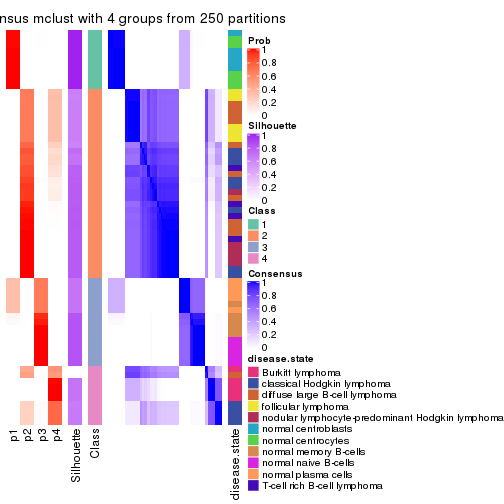</p>

</div>
<div id='tab-MAD-mclust-consensus-heatmap-4'>
<pre><code class="r">consensus_heatmap(res, k = 5)
</code></pre>

<p>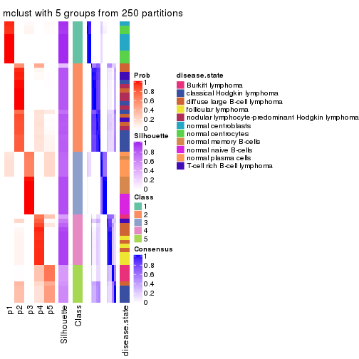</p>

</div>
<div id='tab-MAD-mclust-consensus-heatmap-5'>
<pre><code class="r">consensus_heatmap(res, k = 6)
</code></pre>

<p></p>

</div>
</div>

Heatmaps for the membership of samples in all partitions to see how consistent they are:


<script>
$( function() {
	$( '#tabs-MAD-mclust-membership-heatmap' ).tabs();
} );
</script>
<div id='tabs-MAD-mclust-membership-heatmap'>
<ul>
<li><a href='#tab-MAD-mclust-membership-heatmap-1'>k = 2</a></li>
<li><a href='#tab-MAD-mclust-membership-heatmap-2'>k = 3</a></li>
<li><a href='#tab-MAD-mclust-membership-heatmap-3'>k = 4</a></li>
<li><a href='#tab-MAD-mclust-membership-heatmap-4'>k = 5</a></li>
<li><a href='#tab-MAD-mclust-membership-heatmap-5'>k = 6</a></li>
</ul>
<div id='tab-MAD-mclust-membership-heatmap-1'>
<pre><code class="r">membership_heatmap(res, k = 2)
</code></pre>

<p></p>

</div>
<div id='tab-MAD-mclust-membership-heatmap-2'>
<pre><code class="r">membership_heatmap(res, k = 3)
</code></pre>

<p></p>

</div>
<div id='tab-MAD-mclust-membership-heatmap-3'>
<pre><code class="r">membership_heatmap(res, k = 4)
</code></pre>

<p></p>

</div>
<div id='tab-MAD-mclust-membership-heatmap-4'>
<pre><code class="r">membership_heatmap(res, k = 5)
</code></pre>

<p></p>

</div>
<div id='tab-MAD-mclust-membership-heatmap-5'>
<pre><code class="r">membership_heatmap(res, k = 6)
</code></pre>

<p></p>

</div>
</div>

As soon as we have had the classes for columns, we can look for signatures
which are significantly different between classes which can be candidate marks
for certain classes. Following are the heatmaps for signatures.


Signature heatmaps where rows are scaled:


<script>
$( function() {
	$( '#tabs-MAD-mclust-get-signatures' ).tabs();
} );
</script>
<div id='tabs-MAD-mclust-get-signatures'>
<ul>
<li><a href='#tab-MAD-mclust-get-signatures-1'>k = 2</a></li>
<li><a href='#tab-MAD-mclust-get-signatures-2'>k = 3</a></li>
<li><a href='#tab-MAD-mclust-get-signatures-3'>k = 4</a></li>
<li><a href='#tab-MAD-mclust-get-signatures-4'>k = 5</a></li>
<li><a href='#tab-MAD-mclust-get-signatures-5'>k = 6</a></li>
</ul>
<div id='tab-MAD-mclust-get-signatures-1'>
<pre><code class="r">get_signatures(res, k = 2)
</code></pre>

<p></p>

</div>
<div id='tab-MAD-mclust-get-signatures-2'>
<pre><code class="r">get_signatures(res, k = 3)
</code></pre>

<p></p>

</div>
<div id='tab-MAD-mclust-get-signatures-3'>
<pre><code class="r">get_signatures(res, k = 4)
</code></pre>

<p></p>

</div>
<div id='tab-MAD-mclust-get-signatures-4'>
<pre><code class="r">get_signatures(res, k = 5)
</code></pre>

<p></p>

</div>
<div id='tab-MAD-mclust-get-signatures-5'>
<pre><code class="r">get_signatures(res, k = 6)
</code></pre>

<p></p>

</div>
</div>


Signature heatmaps where rows are not scaled:


<script>
$( function() {
	$( '#tabs-MAD-mclust-get-signatures-no-scale' ).tabs();
} );
</script>
<div id='tabs-MAD-mclust-get-signatures-no-scale'>
<ul>
<li><a href='#tab-MAD-mclust-get-signatures-no-scale-1'>k = 2</a></li>
<li><a href='#tab-MAD-mclust-get-signatures-no-scale-2'>k = 3</a></li>
<li><a href='#tab-MAD-mclust-get-signatures-no-scale-3'>k = 4</a></li>
<li><a href='#tab-MAD-mclust-get-signatures-no-scale-4'>k = 5</a></li>
<li><a href='#tab-MAD-mclust-get-signatures-no-scale-5'>k = 6</a></li>
</ul>
<div id='tab-MAD-mclust-get-signatures-no-scale-1'>
<pre><code class="r">get_signatures(res, k = 2, scale_rows = FALSE)
</code></pre>

<p></p>

</div>
<div id='tab-MAD-mclust-get-signatures-no-scale-2'>
<pre><code class="r">get_signatures(res, k = 3, scale_rows = FALSE)
</code></pre>

<p></p>

</div>
<div id='tab-MAD-mclust-get-signatures-no-scale-3'>
<pre><code class="r">get_signatures(res, k = 4, scale_rows = FALSE)
</code></pre>

<p></p>

</div>
<div id='tab-MAD-mclust-get-signatures-no-scale-4'>
<pre><code class="r">get_signatures(res, k = 5, scale_rows = FALSE)
</code></pre>

<p></p>

</div>
<div id='tab-MAD-mclust-get-signatures-no-scale-5'>
<pre><code class="r">get_signatures(res, k = 6, scale_rows = FALSE)
</code></pre>

<p></p>

</div>
</div>


Compare the overlap of signatures from different k:

```r
compare_signatures(res)
```


`get_signature()` returns a data frame invisibly. TO get the list of signatures, the function
call should be assigned to a variable explicitly. In following code, if `plot` argument is set
to `FALSE`, no heatmap is plotted while only the differential analysis is performed.

```r
# code only for demonstration
tb = get_signature(res, k = ..., plot = FALSE)
```

An example of the output of `tb` is:

```
#>   which_row         fdr    mean_1    mean_2 scaled_mean_1 scaled_mean_2 km
#> 1        38 0.042760348  8.373488  9.131774    -0.5533452     0.5164555  1
#> 2        40 0.018707592  7.106213  8.469186    -0.6173731     0.5762149  1
#> 3        55 0.019134737 10.221463 11.207825    -0.6159697     0.5749050  1
#> 4        59 0.006059896  5.921854  7.869574    -0.6899429     0.6439467  1
#> 5        60 0.018055526  8.928898 10.211722    -0.6204761     0.5791110  1
#> 6        98 0.009384629 15.714769 14.887706     0.6635654    -0.6193277  2
...
```

The columns in `tb` are:

1. `which_row`: row indices corresponding to the input matrix.
2. `fdr`: FDR for the differential test. 
3. `mean_x`: The mean value in group x.
4. `scaled_mean_x`: The mean value in group x after rows are scaled.
5. `km`: Row groups if k-means clustering is applied to rows.


UMAP plot which shows how samples are separated.


<script>
$( function() {
	$( '#tabs-MAD-mclust-dimension-reduction' ).tabs();
} );
</script>
<div id='tabs-MAD-mclust-dimension-reduction'>
<ul>
<li><a href='#tab-MAD-mclust-dimension-reduction-1'>k = 2</a></li>
<li><a href='#tab-MAD-mclust-dimension-reduction-2'>k = 3</a></li>
<li><a href='#tab-MAD-mclust-dimension-reduction-3'>k = 4</a></li>
<li><a href='#tab-MAD-mclust-dimension-reduction-4'>k = 5</a></li>
<li><a href='#tab-MAD-mclust-dimension-reduction-5'>k = 6</a></li>
</ul>
<div id='tab-MAD-mclust-dimension-reduction-1'>
<pre><code class="r">dimension_reduction(res, k = 2, method = &quot;UMAP&quot;)
</code></pre>

<p></p>

</div>
<div id='tab-MAD-mclust-dimension-reduction-2'>
<pre><code class="r">dimension_reduction(res, k = 3, method = &quot;UMAP&quot;)
</code></pre>

<p></p>

</div>
<div id='tab-MAD-mclust-dimension-reduction-3'>
<pre><code class="r">dimension_reduction(res, k = 4, method = &quot;UMAP&quot;)
</code></pre>

<p></p>

</div>
<div id='tab-MAD-mclust-dimension-reduction-4'>
<pre><code class="r">dimension_reduction(res, k = 5, method = &quot;UMAP&quot;)
</code></pre>

<p></p>

</div>
<div id='tab-MAD-mclust-dimension-reduction-5'>
<pre><code class="r">dimension_reduction(res, k = 6, method = &quot;UMAP&quot;)
</code></pre>

<p></p>

</div>
</div>


Following heatmap shows how subgroups are split when increasing `k`:

```r
collect_classes(res)
```


Test correlation between subgroups and known annotations. If the known
annotation is numeric, one-way ANOVA test is applied, and if the known
annotation is discrete, chi-squared contingency table test is applied.

```r
test_to_known_factors(res)
```

```
#>             n disease.state(p) k
#> MAD:mclust 67         1.68e-10 2
#> MAD:mclust 60         2.85e-16 3
#> MAD:mclust 65         4.09e-21 4
#> MAD:mclust 65         1.81e-22 5
#> MAD:mclust 56         3.24e-22 6
```


If matrix rows can be associated to genes, consider to use `GO_Enrichment(res,
...)` to perform function enrichment for the signature genes.


 

---------------------------------------------------


### MAD:NMF*


The object with results only for a single top-value method and a single partition method 
can be extracted as:

```r
res = res_list["MAD", "NMF"]
# you can also extract it by
# res = res_list["MAD:NMF"]
```

A summary of `res` and all the functions that can be applied to it:

```r
res
```

```
#> A 'ConsensusPartition' object with k = 2, 3, 4, 5, 6.
#>   On a matrix with 51941 rows and 67 columns.
#>   Top rows (1000, 2000, 3000, 4000, 5000) are extracted by 'MAD' method.
#>   Subgroups are detected by 'NMF' method.
#>   Performed in total 1250 partitions by row resampling.
#>   Best k for subgroups seems to be 6.
#> 
#> Following methods can be applied to this 'ConsensusPartition' object:
#>  [1] "cola_report"             "collect_classes"         "collect_plots"          
#>  [4] "collect_stats"           "colnames"                "compare_signatures"     
#>  [7] "consensus_heatmap"       "dimension_reduction"     "functional_enrichment"  
#> [10] "get_anno_col"            "get_anno"                "get_classes"            
#> [13] "get_consensus"           "get_matrix"              "get_membership"         
#> [16] "get_param"               "get_signatures"          "get_stats"              
#> [19] "is_best_k"               "is_stable_k"             "membership_heatmap"     
#> [22] "ncol"                    "nrow"                    "plot_ecdf"              
#> [25] "rownames"                "select_partition_number" "show"                   
#> [28] "suggest_best_k"          "test_to_known_factors"
```

`collect_plots()` function collects all the plots made from `res` for all `k` (number of partitions)
into one single page to provide an easy and fast comparison between different `k`.

```r
collect_plots(res)
```


The plots are:

- The first row: a plot of the ECDF (Empirical cumulative distribution
  function) curves of the consensus matrix for each `k` and the heatmap of
  predicted classes for each `k`.
- The second row: heatmaps of the consensus matrix for each `k`.
- The third row: heatmaps of the membership matrix for each `k`.
- The fouth row: heatmaps of the signatures for each `k`.

All the plots in panels can be made by individual functions and they are
plotted later in this section.

`select_partition_number()` produces several plots showing different
statistics for choosing "optimized" `k`. There are following statistics:

- ECDF curves of the consensus matrix for each `k`;
- 1-PAC. [The PAC
  score](https://en.wikipedia.org/wiki/Consensus_clustering#Over-interpretation_potential_of_consensus_clustering)
  measures the proportion of the ambiguous subgrouping.
- Mean silhouette score.
- Concordance. The mean probability of fiting the consensus class ids in all
  partitions.
- Area increased. Denote $A_k$ as the area under the ECDF curve for current
  `k`, the area increased is defined as $A_k - A_{k-1}$.
- Rand index. The percent of pairs of samples that are both in a same cluster
  or both are not in a same cluster in the partition of k and k-1.
- Jaccard index. The ratio of pairs of samples are both in a same cluster in
  the partition of k and k-1 and the pairs of samples are both in a same
  cluster in the partition k or k-1.

The detailed explanations of these statistics can be found in [the cola
vignette](http://bioconductor.org/packages/devel/bioc/vignettes/cola/inst/doc/cola.html#toc_13).

Generally speaking, lower PAC score, higher mean silhouette score or higher
concordance corresponds to better partition. Rand index and Jaccard index
measure how similar the current partition is compared to partition with `k-1`.
If they are too similar, we won't accept `k` is better than `k-1`.

```r
select_partition_number(res)
```


The numeric values for all these statistics can be obtained by `get_stats()`.

```r
get_stats(res)
```

```
#>   k 1-PAC mean_silhouette concordance area_increased  Rand Jaccard
#> 2 2 1.000           0.974       0.990         0.4807 0.518   0.518
#> 3 3 0.948           0.911       0.964         0.2824 0.819   0.667
#> 4 4 0.667           0.702       0.839         0.1577 0.817   0.563
#> 5 5 0.800           0.786       0.872         0.0791 0.860   0.550
#> 6 6 0.950           0.891       0.950         0.0388 0.970   0.862
```

`suggest_best_k()` suggests the best $k$ based on these statistics. The rules are as follows:

- All $k$ with Jaccard index larger than 0.95 are removed because the increase of
  the partition number does not provides enough extra information. If all $k$ are removed,
  the best $k$ is assigned by `NA`.
- For $k$ with 1-PAC larger than 0.9, the maximal $k$ is taken as the "best k". Other $k$ is called "optional k".
- If it does not fit the second rule. The $k$ with the highest vote of highest
  1-PAC, mean silhouette and concordance is taken as the "best k".

```r
suggest_best_k(res)
```

```
#> [1] 6
#> attr(,"optional")
#> [1] 2 3
```

There is also optional best $k$ = 2 3 that is worth to check.

Following shows the table of the partitions (You need to click the **show/hide
code output** link to see it). The membership matrix (columns with name `p*`)
is inferred by
[`clue::cl_consensus()`](https://www.rdocumentation.org/link/cl_consensus?package=clue)
function with the `SE` method. Basically the value in the membership matrix
represents the probability to belong to a certain group. The finall class
label for an item is determined with the group with highest probability it
belongs to.

In `get_classes()` function, the entropy is calculated from the membership
matrix and the silhouette score is calculated from the consensus matrix.


<script>
$( function() {
	$( '#tabs-MAD-NMF-get-classes' ).tabs();
} );
</script>
<div id='tabs-MAD-NMF-get-classes'>
<ul>
<li><a href='#tab-MAD-NMF-get-classes-1'>k = 2</a></li>
<li><a href='#tab-MAD-NMF-get-classes-2'>k = 3</a></li>
<li><a href='#tab-MAD-NMF-get-classes-3'>k = 4</a></li>
<li><a href='#tab-MAD-NMF-get-classes-4'>k = 5</a></li>
<li><a href='#tab-MAD-NMF-get-classes-5'>k = 6</a></li>
</ul>

<div id='tab-MAD-NMF-get-classes-1'>
<p><a id='tab-MAD-NMF-get-classes-1-a' style='color:#0366d6' href='#'>show/hide code output</a></p>
<pre><code class="r">cbind(get_classes(res, k = 2), get_membership(res, k = 2))
</code></pre>

<pre><code>#&gt;           class entropy silhouette    p1    p2
#&gt; GSM312811     2   0.000      0.995 0.000 1.000
#&gt; GSM312812     2   0.000      0.995 0.000 1.000
#&gt; GSM312813     2   0.000      0.995 0.000 1.000
#&gt; GSM312814     2   0.000      0.995 0.000 1.000
#&gt; GSM312815     2   0.000      0.995 0.000 1.000
#&gt; GSM312816     2   0.000      0.995 0.000 1.000
#&gt; GSM312817     2   0.000      0.995 0.000 1.000
#&gt; GSM312818     2   0.430      0.902 0.088 0.912
#&gt; GSM312819     2   0.000      0.995 0.000 1.000
#&gt; GSM312820     2   0.000      0.995 0.000 1.000
#&gt; GSM312821     2   0.000      0.995 0.000 1.000
#&gt; GSM312822     2   0.000      0.995 0.000 1.000
#&gt; GSM312823     2   0.000      0.995 0.000 1.000
#&gt; GSM312824     2   0.000      0.995 0.000 1.000
#&gt; GSM312825     2   0.000      0.995 0.000 1.000
#&gt; GSM312826     2   0.000      0.995 0.000 1.000
#&gt; GSM312839     2   0.000      0.995 0.000 1.000
#&gt; GSM312840     2   0.000      0.995 0.000 1.000
#&gt; GSM312841     2   0.000      0.995 0.000 1.000
#&gt; GSM312843     2   0.000      0.995 0.000 1.000
#&gt; GSM312844     2   0.000      0.995 0.000 1.000
#&gt; GSM312845     1   0.994      0.151 0.544 0.456
#&gt; GSM312846     2   0.541      0.856 0.124 0.876
#&gt; GSM312847     2   0.000      0.995 0.000 1.000
#&gt; GSM312848     2   0.000      0.995 0.000 1.000
#&gt; GSM312849     2   0.000      0.995 0.000 1.000
#&gt; GSM312851     2   0.000      0.995 0.000 1.000
#&gt; GSM312853     2   0.000      0.995 0.000 1.000
#&gt; GSM312854     2   0.000      0.995 0.000 1.000
#&gt; GSM312856     2   0.000      0.995 0.000 1.000
#&gt; GSM312857     2   0.000      0.995 0.000 1.000
#&gt; GSM312858     2   0.000      0.995 0.000 1.000
#&gt; GSM312859     2   0.000      0.995 0.000 1.000
#&gt; GSM312860     2   0.000      0.995 0.000 1.000
#&gt; GSM312861     2   0.000      0.995 0.000 1.000
#&gt; GSM312862     2   0.000      0.995 0.000 1.000
#&gt; GSM312863     2   0.000      0.995 0.000 1.000
#&gt; GSM312864     2   0.000      0.995 0.000 1.000
#&gt; GSM312865     2   0.000      0.995 0.000 1.000
#&gt; GSM312867     2   0.000      0.995 0.000 1.000
#&gt; GSM312868     2   0.000      0.995 0.000 1.000
#&gt; GSM312869     2   0.000      0.995 0.000 1.000
#&gt; GSM312870     1   0.000      0.981 1.000 0.000
#&gt; GSM312872     1   0.000      0.981 1.000 0.000
#&gt; GSM312874     1   0.000      0.981 1.000 0.000
#&gt; GSM312875     1   0.000      0.981 1.000 0.000
#&gt; GSM312876     1   0.000      0.981 1.000 0.000
#&gt; GSM312877     1   0.000      0.981 1.000 0.000
#&gt; GSM312879     1   0.000      0.981 1.000 0.000
#&gt; GSM312882     1   0.000      0.981 1.000 0.000
#&gt; GSM312883     1   0.000      0.981 1.000 0.000
#&gt; GSM312886     1   0.000      0.981 1.000 0.000
#&gt; GSM312887     1   0.000      0.981 1.000 0.000
#&gt; GSM312890     1   0.000      0.981 1.000 0.000
#&gt; GSM312893     1   0.000      0.981 1.000 0.000
#&gt; GSM312894     1   0.000      0.981 1.000 0.000
#&gt; GSM312895     1   0.000      0.981 1.000 0.000
#&gt; GSM312937     1   0.000      0.981 1.000 0.000
#&gt; GSM312938     1   0.000      0.981 1.000 0.000
#&gt; GSM312939     1   0.000      0.981 1.000 0.000
#&gt; GSM312940     1   0.000      0.981 1.000 0.000
#&gt; GSM312941     1   0.000      0.981 1.000 0.000
#&gt; GSM312942     1   0.000      0.981 1.000 0.000
#&gt; GSM312943     1   0.000      0.981 1.000 0.000
#&gt; GSM312944     1   0.000      0.981 1.000 0.000
#&gt; GSM312945     1   0.000      0.981 1.000 0.000
#&gt; GSM312946     1   0.000      0.981 1.000 0.000
</code></pre>

<script>
$('#tab-MAD-NMF-get-classes-1-a').parent().next().next().hide();
$('#tab-MAD-NMF-get-classes-1-a').click(function(){
  $('#tab-MAD-NMF-get-classes-1-a').parent().next().next().toggle();
  return(false);
});
</script>
</div>

<div id='tab-MAD-NMF-get-classes-2'>
<p><a id='tab-MAD-NMF-get-classes-2-a' style='color:#0366d6' href='#'>show/hide code output</a></p>
<pre><code class="r">cbind(get_classes(res, k = 3), get_membership(res, k = 3))
</code></pre>

<pre><code>#&gt;           class entropy silhouette    p1    p2    p3
#&gt; GSM312811     2  0.0000      0.983 0.000 1.000 0.000
#&gt; GSM312812     2  0.0000      0.983 0.000 1.000 0.000
#&gt; GSM312813     2  0.0000      0.983 0.000 1.000 0.000
#&gt; GSM312814     2  0.0000      0.983 0.000 1.000 0.000
#&gt; GSM312815     2  0.0000      0.983 0.000 1.000 0.000
#&gt; GSM312816     2  0.0000      0.983 0.000 1.000 0.000
#&gt; GSM312817     2  0.0000      0.983 0.000 1.000 0.000
#&gt; GSM312818     2  0.5327      0.638 0.272 0.728 0.000
#&gt; GSM312819     2  0.0000      0.983 0.000 1.000 0.000
#&gt; GSM312820     2  0.0000      0.983 0.000 1.000 0.000
#&gt; GSM312821     2  0.0237      0.980 0.004 0.996 0.000
#&gt; GSM312822     2  0.0000      0.983 0.000 1.000 0.000
#&gt; GSM312823     2  0.0000      0.983 0.000 1.000 0.000
#&gt; GSM312824     2  0.0000      0.983 0.000 1.000 0.000
#&gt; GSM312825     2  0.0000      0.983 0.000 1.000 0.000
#&gt; GSM312826     2  0.0000      0.983 0.000 1.000 0.000
#&gt; GSM312839     2  0.0000      0.983 0.000 1.000 0.000
#&gt; GSM312840     2  0.0000      0.983 0.000 1.000 0.000
#&gt; GSM312841     2  0.0000      0.983 0.000 1.000 0.000
#&gt; GSM312843     2  0.0000      0.983 0.000 1.000 0.000
#&gt; GSM312844     2  0.0000      0.983 0.000 1.000 0.000
#&gt; GSM312845     3  0.0000      0.960 0.000 0.000 1.000
#&gt; GSM312846     3  0.0000      0.960 0.000 0.000 1.000
#&gt; GSM312847     3  0.0000      0.960 0.000 0.000 1.000
#&gt; GSM312848     2  0.2165      0.924 0.000 0.936 0.064
#&gt; GSM312849     3  0.0237      0.956 0.000 0.004 0.996
#&gt; GSM312851     2  0.0000      0.983 0.000 1.000 0.000
#&gt; GSM312853     2  0.0000      0.983 0.000 1.000 0.000
#&gt; GSM312854     2  0.0424      0.977 0.000 0.992 0.008
#&gt; GSM312856     2  0.0000      0.983 0.000 1.000 0.000
#&gt; GSM312857     2  0.0237      0.980 0.000 0.996 0.004
#&gt; GSM312858     2  0.4842      0.716 0.000 0.776 0.224
#&gt; GSM312859     2  0.0000      0.983 0.000 1.000 0.000
#&gt; GSM312860     2  0.0000      0.983 0.000 1.000 0.000
#&gt; GSM312861     2  0.0000      0.983 0.000 1.000 0.000
#&gt; GSM312862     2  0.0000      0.983 0.000 1.000 0.000
#&gt; GSM312863     2  0.0000      0.983 0.000 1.000 0.000
#&gt; GSM312864     2  0.0000      0.983 0.000 1.000 0.000
#&gt; GSM312865     3  0.0424      0.951 0.000 0.008 0.992
#&gt; GSM312867     3  0.0000      0.960 0.000 0.000 1.000
#&gt; GSM312868     2  0.0000      0.983 0.000 1.000 0.000
#&gt; GSM312869     2  0.0000      0.983 0.000 1.000 0.000
#&gt; GSM312870     1  0.0000      0.900 1.000 0.000 0.000
#&gt; GSM312872     1  0.0000      0.900 1.000 0.000 0.000
#&gt; GSM312874     1  0.0000      0.900 1.000 0.000 0.000
#&gt; GSM312875     1  0.0000      0.900 1.000 0.000 0.000
#&gt; GSM312876     1  0.0000      0.900 1.000 0.000 0.000
#&gt; GSM312877     1  0.2165      0.865 0.936 0.000 0.064
#&gt; GSM312879     1  0.0000      0.900 1.000 0.000 0.000
#&gt; GSM312882     1  0.0000      0.900 1.000 0.000 0.000
#&gt; GSM312883     1  0.0000      0.900 1.000 0.000 0.000
#&gt; GSM312886     1  0.0000      0.900 1.000 0.000 0.000
#&gt; GSM312887     1  0.2959      0.839 0.900 0.000 0.100
#&gt; GSM312890     3  0.0000      0.960 0.000 0.000 1.000
#&gt; GSM312893     3  0.0000      0.960 0.000 0.000 1.000
#&gt; GSM312894     3  0.2625      0.870 0.084 0.000 0.916
#&gt; GSM312895     3  0.0000      0.960 0.000 0.000 1.000
#&gt; GSM312937     3  0.0000      0.960 0.000 0.000 1.000
#&gt; GSM312938     3  0.0000      0.960 0.000 0.000 1.000
#&gt; GSM312939     3  0.0000      0.960 0.000 0.000 1.000
#&gt; GSM312940     3  0.0000      0.960 0.000 0.000 1.000
#&gt; GSM312941     3  0.0000      0.960 0.000 0.000 1.000
#&gt; GSM312942     1  0.0424      0.897 0.992 0.000 0.008
#&gt; GSM312943     1  0.6180      0.341 0.584 0.000 0.416
#&gt; GSM312944     3  0.6192      0.135 0.420 0.000 0.580
#&gt; GSM312945     1  0.6291      0.187 0.532 0.000 0.468
#&gt; GSM312946     1  0.4931      0.690 0.768 0.000 0.232
</code></pre>

<script>
$('#tab-MAD-NMF-get-classes-2-a').parent().next().next().hide();
$('#tab-MAD-NMF-get-classes-2-a').click(function(){
  $('#tab-MAD-NMF-get-classes-2-a').parent().next().next().toggle();
  return(false);
});
</script>
</div>

<div id='tab-MAD-NMF-get-classes-3'>
<p><a id='tab-MAD-NMF-get-classes-3-a' style='color:#0366d6' href='#'>show/hide code output</a></p>
<pre><code class="r">cbind(get_classes(res, k = 4), get_membership(res, k = 4))
</code></pre>

<pre><code>#&gt;           class entropy silhouette    p1    p2    p3    p4
#&gt; GSM312811     2  0.0000     0.8904 0.000 1.000 0.000 0.000
#&gt; GSM312812     2  0.0469     0.8860 0.000 0.988 0.000 0.012
#&gt; GSM312813     2  0.0000     0.8904 0.000 1.000 0.000 0.000
#&gt; GSM312814     2  0.1302     0.8626 0.000 0.956 0.000 0.044
#&gt; GSM312815     2  0.0817     0.8791 0.000 0.976 0.000 0.024
#&gt; GSM312816     2  0.3266     0.7298 0.000 0.832 0.000 0.168
#&gt; GSM312817     2  0.0188     0.8893 0.000 0.996 0.000 0.004
#&gt; GSM312818     3  0.7626    -0.0308 0.000 0.384 0.412 0.204
#&gt; GSM312819     2  0.0188     0.8893 0.000 0.996 0.000 0.004
#&gt; GSM312820     2  0.4692     0.6544 0.000 0.756 0.032 0.212
#&gt; GSM312821     2  0.5288     0.6215 0.000 0.732 0.068 0.200
#&gt; GSM312822     2  0.2408     0.8051 0.000 0.896 0.000 0.104
#&gt; GSM312823     2  0.0000     0.8904 0.000 1.000 0.000 0.000
#&gt; GSM312824     2  0.0000     0.8904 0.000 1.000 0.000 0.000
#&gt; GSM312825     2  0.2011     0.8194 0.000 0.920 0.000 0.080
#&gt; GSM312826     2  0.0188     0.8894 0.000 0.996 0.000 0.004
#&gt; GSM312839     2  0.0817     0.8791 0.000 0.976 0.000 0.024
#&gt; GSM312840     2  0.0000     0.8904 0.000 1.000 0.000 0.000
#&gt; GSM312841     2  0.0000     0.8904 0.000 1.000 0.000 0.000
#&gt; GSM312843     2  0.4981    -0.1713 0.000 0.536 0.000 0.464
#&gt; GSM312844     2  0.0000     0.8904 0.000 1.000 0.000 0.000
#&gt; GSM312845     1  0.2589     0.7365 0.884 0.000 0.000 0.116
#&gt; GSM312846     1  0.0592     0.8129 0.984 0.000 0.000 0.016
#&gt; GSM312847     4  0.5161     0.1662 0.476 0.004 0.000 0.520
#&gt; GSM312848     4  0.6970     0.7308 0.168 0.256 0.000 0.576
#&gt; GSM312849     1  0.4222     0.5022 0.728 0.272 0.000 0.000
#&gt; GSM312851     4  0.4770     0.7630 0.012 0.288 0.000 0.700
#&gt; GSM312853     4  0.4883     0.7659 0.016 0.288 0.000 0.696
#&gt; GSM312854     4  0.5478     0.7687 0.056 0.248 0.000 0.696
#&gt; GSM312856     4  0.4963     0.7688 0.020 0.284 0.000 0.696
#&gt; GSM312857     4  0.4963     0.7690 0.020 0.284 0.000 0.696
#&gt; GSM312858     4  0.7146     0.7246 0.176 0.276 0.000 0.548
#&gt; GSM312859     2  0.0000     0.8904 0.000 1.000 0.000 0.000
#&gt; GSM312860     2  0.0895     0.8805 0.004 0.976 0.000 0.020
#&gt; GSM312861     2  0.2530     0.7677 0.000 0.888 0.000 0.112
#&gt; GSM312862     2  0.0188     0.8893 0.000 0.996 0.000 0.004
#&gt; GSM312863     4  0.4795     0.7610 0.012 0.292 0.000 0.696
#&gt; GSM312864     2  0.4961    -0.0978 0.000 0.552 0.000 0.448
#&gt; GSM312865     4  0.5126     0.2420 0.444 0.004 0.000 0.552
#&gt; GSM312867     1  0.2408     0.7548 0.896 0.000 0.000 0.104
#&gt; GSM312868     4  0.4996     0.4563 0.000 0.484 0.000 0.516
#&gt; GSM312869     2  0.0707     0.8817 0.000 0.980 0.000 0.020
#&gt; GSM312870     3  0.0336     0.8221 0.000 0.000 0.992 0.008
#&gt; GSM312872     3  0.0188     0.8228 0.000 0.000 0.996 0.004
#&gt; GSM312874     3  0.0336     0.8221 0.000 0.000 0.992 0.008
#&gt; GSM312875     3  0.0524     0.8222 0.004 0.000 0.988 0.008
#&gt; GSM312876     3  0.0524     0.8222 0.004 0.000 0.988 0.008
#&gt; GSM312877     3  0.7133     0.1789 0.344 0.000 0.512 0.144
#&gt; GSM312879     3  0.0000     0.8230 0.000 0.000 1.000 0.000
#&gt; GSM312882     3  0.1151     0.8163 0.008 0.000 0.968 0.024
#&gt; GSM312883     3  0.1510     0.8106 0.016 0.000 0.956 0.028
#&gt; GSM312886     3  0.0336     0.8221 0.000 0.000 0.992 0.008
#&gt; GSM312887     3  0.5150     0.2829 0.396 0.000 0.596 0.008
#&gt; GSM312890     1  0.0469     0.8146 0.988 0.000 0.000 0.012
#&gt; GSM312893     1  0.0336     0.8110 0.992 0.000 0.000 0.008
#&gt; GSM312894     1  0.3105     0.7287 0.868 0.000 0.120 0.012
#&gt; GSM312895     1  0.0336     0.8147 0.992 0.000 0.000 0.008
#&gt; GSM312937     1  0.0469     0.8146 0.988 0.000 0.000 0.012
#&gt; GSM312938     1  0.2654     0.7414 0.888 0.000 0.004 0.108
#&gt; GSM312939     1  0.0469     0.8146 0.988 0.000 0.000 0.012
#&gt; GSM312940     1  0.0469     0.8146 0.988 0.000 0.000 0.012
#&gt; GSM312941     1  0.0000     0.8136 1.000 0.000 0.000 0.000
#&gt; GSM312942     3  0.6613     0.5110 0.200 0.000 0.628 0.172
#&gt; GSM312943     1  0.7198     0.4526 0.540 0.000 0.180 0.280
#&gt; GSM312944     1  0.7133     0.4650 0.548 0.000 0.172 0.280
#&gt; GSM312945     1  0.7179     0.4571 0.544 0.000 0.180 0.276
#&gt; GSM312946     1  0.7497     0.3710 0.496 0.000 0.224 0.280
</code></pre>

<script>
$('#tab-MAD-NMF-get-classes-3-a').parent().next().next().hide();
$('#tab-MAD-NMF-get-classes-3-a').click(function(){
  $('#tab-MAD-NMF-get-classes-3-a').parent().next().next().toggle();
  return(false);
});
</script>
</div>

<div id='tab-MAD-NMF-get-classes-4'>
<p><a id='tab-MAD-NMF-get-classes-4-a' style='color:#0366d6' href='#'>show/hide code output</a></p>
<pre><code class="r">cbind(get_classes(res, k = 5), get_membership(res, k = 5))
</code></pre>

<pre><code>#&gt;           class entropy silhouette    p1    p2    p3    p4    p5
#&gt; GSM312811     2  0.0880     0.9237 0.000 0.968 0.000 0.000 0.032
#&gt; GSM312812     2  0.0162     0.9418 0.000 0.996 0.000 0.000 0.004
#&gt; GSM312813     2  0.0162     0.9414 0.000 0.996 0.000 0.004 0.000
#&gt; GSM312814     2  0.2462     0.8419 0.000 0.880 0.000 0.008 0.112
#&gt; GSM312815     2  0.0609     0.9297 0.000 0.980 0.000 0.000 0.020
#&gt; GSM312816     2  0.4206     0.6059 0.000 0.708 0.000 0.020 0.272
#&gt; GSM312817     2  0.0162     0.9414 0.000 0.996 0.000 0.004 0.000
#&gt; GSM312818     5  0.6227     0.1765 0.000 0.288 0.076 0.044 0.592
#&gt; GSM312819     2  0.0290     0.9399 0.000 0.992 0.000 0.008 0.000
#&gt; GSM312820     5  0.5229    -0.0970 0.000 0.432 0.004 0.036 0.528
#&gt; GSM312821     5  0.5477    -0.0468 0.000 0.412 0.012 0.040 0.536
#&gt; GSM312822     2  0.3081     0.7874 0.000 0.832 0.000 0.012 0.156
#&gt; GSM312823     2  0.0000     0.9427 0.000 1.000 0.000 0.000 0.000
#&gt; GSM312824     2  0.0000     0.9427 0.000 1.000 0.000 0.000 0.000
#&gt; GSM312825     2  0.0290     0.9397 0.000 0.992 0.000 0.000 0.008
#&gt; GSM312826     2  0.0000     0.9427 0.000 1.000 0.000 0.000 0.000
#&gt; GSM312839     2  0.0404     0.9369 0.000 0.988 0.000 0.000 0.012
#&gt; GSM312840     2  0.0000     0.9427 0.000 1.000 0.000 0.000 0.000
#&gt; GSM312841     2  0.0000     0.9427 0.000 1.000 0.000 0.000 0.000
#&gt; GSM312843     4  0.2818     0.8246 0.000 0.132 0.000 0.856 0.012
#&gt; GSM312844     2  0.0000     0.9427 0.000 1.000 0.000 0.000 0.000
#&gt; GSM312845     4  0.3846     0.7288 0.200 0.000 0.020 0.776 0.004
#&gt; GSM312846     1  0.1830     0.8579 0.932 0.012 0.000 0.052 0.004
#&gt; GSM312847     4  0.2389     0.8202 0.116 0.000 0.000 0.880 0.004
#&gt; GSM312848     4  0.1934     0.8815 0.016 0.052 0.000 0.928 0.004
#&gt; GSM312849     1  0.5689     0.3501 0.604 0.316 0.000 0.060 0.020
#&gt; GSM312851     4  0.2871     0.8409 0.000 0.040 0.000 0.872 0.088
#&gt; GSM312853     4  0.1043     0.8834 0.000 0.040 0.000 0.960 0.000
#&gt; GSM312854     4  0.1043     0.8834 0.000 0.040 0.000 0.960 0.000
#&gt; GSM312856     4  0.1043     0.8834 0.000 0.040 0.000 0.960 0.000
#&gt; GSM312857     4  0.1043     0.8834 0.000 0.040 0.000 0.960 0.000
#&gt; GSM312858     4  0.1978     0.8809 0.024 0.044 0.000 0.928 0.004
#&gt; GSM312859     2  0.0324     0.9398 0.000 0.992 0.000 0.004 0.004
#&gt; GSM312860     2  0.0566     0.9357 0.000 0.984 0.000 0.004 0.012
#&gt; GSM312861     4  0.3990     0.6150 0.000 0.308 0.000 0.688 0.004
#&gt; GSM312862     2  0.3835     0.5778 0.000 0.732 0.000 0.008 0.260
#&gt; GSM312863     4  0.1043     0.8834 0.000 0.040 0.000 0.960 0.000
#&gt; GSM312864     4  0.3061     0.8167 0.000 0.136 0.000 0.844 0.020
#&gt; GSM312865     4  0.1430     0.8568 0.052 0.004 0.000 0.944 0.000
#&gt; GSM312867     4  0.4446     0.1454 0.476 0.000 0.000 0.520 0.004
#&gt; GSM312868     4  0.1478     0.8782 0.000 0.064 0.000 0.936 0.000
#&gt; GSM312869     2  0.0162     0.9418 0.000 0.996 0.000 0.000 0.004
#&gt; GSM312870     3  0.0510     0.9489 0.000 0.000 0.984 0.000 0.016
#&gt; GSM312872     3  0.0510     0.9489 0.000 0.000 0.984 0.000 0.016
#&gt; GSM312874     3  0.0510     0.9489 0.000 0.000 0.984 0.000 0.016
#&gt; GSM312875     3  0.0451     0.9469 0.000 0.000 0.988 0.004 0.008
#&gt; GSM312876     3  0.0324     0.9483 0.000 0.000 0.992 0.004 0.004
#&gt; GSM312877     3  0.3846     0.6804 0.020 0.000 0.776 0.004 0.200
#&gt; GSM312879     3  0.0290     0.9499 0.000 0.000 0.992 0.000 0.008
#&gt; GSM312882     3  0.0671     0.9432 0.000 0.000 0.980 0.004 0.016
#&gt; GSM312883     3  0.1365     0.9218 0.004 0.000 0.952 0.004 0.040
#&gt; GSM312886     3  0.0609     0.9470 0.000 0.000 0.980 0.000 0.020
#&gt; GSM312887     1  0.4155     0.6895 0.780 0.000 0.076 0.000 0.144
#&gt; GSM312890     1  0.0162     0.9140 0.996 0.000 0.000 0.004 0.000
#&gt; GSM312893     1  0.0000     0.9143 1.000 0.000 0.000 0.000 0.000
#&gt; GSM312894     1  0.0404     0.9056 0.988 0.000 0.012 0.000 0.000
#&gt; GSM312895     1  0.0000     0.9143 1.000 0.000 0.000 0.000 0.000
#&gt; GSM312937     1  0.0000     0.9143 1.000 0.000 0.000 0.000 0.000
#&gt; GSM312938     1  0.0566     0.9088 0.984 0.000 0.000 0.012 0.004
#&gt; GSM312939     1  0.0162     0.9140 0.996 0.000 0.000 0.004 0.000
#&gt; GSM312940     1  0.0162     0.9140 0.996 0.000 0.000 0.004 0.000
#&gt; GSM312941     1  0.0000     0.9143 1.000 0.000 0.000 0.000 0.000
#&gt; GSM312942     5  0.6705     0.3441 0.244 0.000 0.364 0.000 0.392
#&gt; GSM312943     5  0.6709     0.3652 0.248 0.000 0.352 0.000 0.400
#&gt; GSM312944     5  0.6732     0.3733 0.260 0.000 0.340 0.000 0.400
#&gt; GSM312945     5  0.6758     0.3702 0.272 0.000 0.336 0.000 0.392
#&gt; GSM312946     5  0.6709     0.3652 0.248 0.000 0.352 0.000 0.400
</code></pre>

<script>
$('#tab-MAD-NMF-get-classes-4-a').parent().next().next().hide();
$('#tab-MAD-NMF-get-classes-4-a').click(function(){
  $('#tab-MAD-NMF-get-classes-4-a').parent().next().next().toggle();
  return(false);
});
</script>
</div>

<div id='tab-MAD-NMF-get-classes-5'>
<p><a id='tab-MAD-NMF-get-classes-5-a' style='color:#0366d6' href='#'>show/hide code output</a></p>
<pre><code class="r">cbind(get_classes(res, k = 6), get_membership(res, k = 6))
</code></pre>

<pre><code>#&gt;           class entropy silhouette    p1    p2    p3    p4    p5    p6
#&gt; GSM312811     2  0.0713     0.9327 0.000 0.972 0.000 0.000 0.028 0.000
#&gt; GSM312812     2  0.0363     0.9484 0.000 0.988 0.000 0.000 0.000 0.012
#&gt; GSM312813     2  0.0547     0.9467 0.000 0.980 0.000 0.000 0.000 0.020
#&gt; GSM312814     2  0.2147     0.8685 0.000 0.896 0.000 0.000 0.084 0.020
#&gt; GSM312815     2  0.0547     0.9467 0.000 0.980 0.000 0.000 0.000 0.020
#&gt; GSM312816     2  0.3653     0.4179 0.000 0.692 0.000 0.000 0.300 0.008
#&gt; GSM312817     2  0.0692     0.9449 0.000 0.976 0.000 0.004 0.000 0.020
#&gt; GSM312818     5  0.2070     0.7171 0.000 0.092 0.012 0.000 0.896 0.000
#&gt; GSM312819     2  0.0260     0.9479 0.000 0.992 0.000 0.000 0.000 0.008
#&gt; GSM312820     5  0.3244     0.8452 0.000 0.268 0.000 0.000 0.732 0.000
#&gt; GSM312821     5  0.3126     0.8585 0.000 0.248 0.000 0.000 0.752 0.000
#&gt; GSM312822     2  0.2581     0.8196 0.000 0.860 0.000 0.000 0.120 0.020
#&gt; GSM312823     2  0.0458     0.9478 0.000 0.984 0.000 0.000 0.000 0.016
#&gt; GSM312824     2  0.0260     0.9479 0.000 0.992 0.000 0.000 0.000 0.008
#&gt; GSM312825     2  0.0260     0.9479 0.000 0.992 0.000 0.000 0.000 0.008
#&gt; GSM312826     2  0.0260     0.9479 0.000 0.992 0.000 0.000 0.000 0.008
#&gt; GSM312839     2  0.0547     0.9467 0.000 0.980 0.000 0.000 0.000 0.020
#&gt; GSM312840     2  0.0260     0.9479 0.000 0.992 0.000 0.000 0.000 0.008
#&gt; GSM312841     2  0.0260     0.9479 0.000 0.992 0.000 0.000 0.000 0.008
#&gt; GSM312843     4  0.0622     0.9411 0.000 0.008 0.000 0.980 0.000 0.012
#&gt; GSM312844     2  0.0692     0.9460 0.000 0.976 0.000 0.000 0.004 0.020
#&gt; GSM312845     4  0.6044     0.3271 0.268 0.004 0.184 0.532 0.004 0.008
#&gt; GSM312846     1  0.0146     0.9122 0.996 0.000 0.000 0.000 0.004 0.000
#&gt; GSM312847     4  0.0717     0.9389 0.016 0.000 0.000 0.976 0.000 0.008
#&gt; GSM312848     4  0.0146     0.9503 0.000 0.004 0.000 0.996 0.000 0.000
#&gt; GSM312849     1  0.3909     0.5920 0.760 0.200 0.008 0.000 0.012 0.020
#&gt; GSM312851     4  0.1007     0.9193 0.000 0.000 0.000 0.956 0.044 0.000
#&gt; GSM312853     4  0.0000     0.9516 0.000 0.000 0.000 1.000 0.000 0.000
#&gt; GSM312854     4  0.0000     0.9516 0.000 0.000 0.000 1.000 0.000 0.000
#&gt; GSM312856     4  0.0000     0.9516 0.000 0.000 0.000 1.000 0.000 0.000
#&gt; GSM312857     4  0.0000     0.9516 0.000 0.000 0.000 1.000 0.000 0.000
#&gt; GSM312858     4  0.0291     0.9488 0.000 0.004 0.000 0.992 0.000 0.004
#&gt; GSM312859     2  0.0000     0.9484 0.000 1.000 0.000 0.000 0.000 0.000
#&gt; GSM312860     2  0.0692     0.9452 0.000 0.976 0.000 0.000 0.004 0.020
#&gt; GSM312861     4  0.1075     0.9065 0.000 0.048 0.000 0.952 0.000 0.000
#&gt; GSM312862     6  0.3622     0.4920 0.000 0.236 0.000 0.016 0.004 0.744
#&gt; GSM312863     4  0.0000     0.9516 0.000 0.000 0.000 1.000 0.000 0.000
#&gt; GSM312864     4  0.0146     0.9503 0.000 0.004 0.000 0.996 0.000 0.000
#&gt; GSM312865     4  0.0000     0.9516 0.000 0.000 0.000 1.000 0.000 0.000
#&gt; GSM312867     1  0.3993     0.0461 0.520 0.000 0.000 0.476 0.004 0.000
#&gt; GSM312868     4  0.0000     0.9516 0.000 0.000 0.000 1.000 0.000 0.000
#&gt; GSM312869     2  0.0260     0.9479 0.000 0.992 0.000 0.000 0.000 0.008
#&gt; GSM312870     3  0.0632     0.9857 0.000 0.000 0.976 0.000 0.024 0.000
#&gt; GSM312872     3  0.0458     0.9879 0.000 0.000 0.984 0.000 0.016 0.000
#&gt; GSM312874     3  0.0632     0.9857 0.000 0.000 0.976 0.000 0.024 0.000
#&gt; GSM312875     3  0.0000     0.9880 0.000 0.000 1.000 0.000 0.000 0.000
#&gt; GSM312876     3  0.0000     0.9880 0.000 0.000 1.000 0.000 0.000 0.000
#&gt; GSM312877     3  0.0363     0.9824 0.000 0.000 0.988 0.000 0.012 0.000
#&gt; GSM312879     3  0.0458     0.9879 0.000 0.000 0.984 0.000 0.016 0.000
#&gt; GSM312882     3  0.0146     0.9869 0.000 0.000 0.996 0.000 0.004 0.000
#&gt; GSM312883     3  0.0146     0.9869 0.000 0.000 0.996 0.000 0.004 0.000
#&gt; GSM312886     3  0.0632     0.9857 0.000 0.000 0.976 0.000 0.024 0.000
#&gt; GSM312887     1  0.1556     0.8476 0.920 0.000 0.000 0.000 0.080 0.000
#&gt; GSM312890     1  0.0000     0.9147 1.000 0.000 0.000 0.000 0.000 0.000
#&gt; GSM312893     1  0.0000     0.9147 1.000 0.000 0.000 0.000 0.000 0.000
#&gt; GSM312894     1  0.0000     0.9147 1.000 0.000 0.000 0.000 0.000 0.000
#&gt; GSM312895     1  0.0000     0.9147 1.000 0.000 0.000 0.000 0.000 0.000
#&gt; GSM312937     1  0.0000     0.9147 1.000 0.000 0.000 0.000 0.000 0.000
#&gt; GSM312938     1  0.0000     0.9147 1.000 0.000 0.000 0.000 0.000 0.000
#&gt; GSM312939     1  0.0000     0.9147 1.000 0.000 0.000 0.000 0.000 0.000
#&gt; GSM312940     1  0.0000     0.9147 1.000 0.000 0.000 0.000 0.000 0.000
#&gt; GSM312941     1  0.0000     0.9147 1.000 0.000 0.000 0.000 0.000 0.000
#&gt; GSM312942     6  0.0713     0.9076 0.000 0.000 0.028 0.000 0.000 0.972
#&gt; GSM312943     6  0.0777     0.9089 0.004 0.000 0.024 0.000 0.000 0.972
#&gt; GSM312944     6  0.0820     0.8998 0.016 0.000 0.012 0.000 0.000 0.972
#&gt; GSM312945     6  0.0806     0.9076 0.008 0.000 0.020 0.000 0.000 0.972
#&gt; GSM312946     6  0.0713     0.9076 0.000 0.000 0.028 0.000 0.000 0.972
</code></pre>

<script>
$('#tab-MAD-NMF-get-classes-5-a').parent().next().next().hide();
$('#tab-MAD-NMF-get-classes-5-a').click(function(){
  $('#tab-MAD-NMF-get-classes-5-a').parent().next().next().toggle();
  return(false);
});
</script>
</div>
</div>

Heatmaps for the consensus matrix. It visualizes the probability of two
samples to be in a same group.


<script>
$( function() {
	$( '#tabs-MAD-NMF-consensus-heatmap' ).tabs();
} );
</script>
<div id='tabs-MAD-NMF-consensus-heatmap'>
<ul>
<li><a href='#tab-MAD-NMF-consensus-heatmap-1'>k = 2</a></li>
<li><a href='#tab-MAD-NMF-consensus-heatmap-2'>k = 3</a></li>
<li><a href='#tab-MAD-NMF-consensus-heatmap-3'>k = 4</a></li>
<li><a href='#tab-MAD-NMF-consensus-heatmap-4'>k = 5</a></li>
<li><a href='#tab-MAD-NMF-consensus-heatmap-5'>k = 6</a></li>
</ul>
<div id='tab-MAD-NMF-consensus-heatmap-1'>
<pre><code class="r">consensus_heatmap(res, k = 2)
</code></pre>

<p></p>

</div>
<div id='tab-MAD-NMF-consensus-heatmap-2'>
<pre><code class="r">consensus_heatmap(res, k = 3)
</code></pre>

<p></p>

</div>
<div id='tab-MAD-NMF-consensus-heatmap-3'>
<pre><code class="r">consensus_heatmap(res, k = 4)
</code></pre>

<p></p>

</div>
<div id='tab-MAD-NMF-consensus-heatmap-4'>
<pre><code class="r">consensus_heatmap(res, k = 5)
</code></pre>

<p></p>

</div>
<div id='tab-MAD-NMF-consensus-heatmap-5'>
<pre><code class="r">consensus_heatmap(res, k = 6)
</code></pre>

<p></p>

</div>
</div>

Heatmaps for the membership of samples in all partitions to see how consistent they are:


<script>
$( function() {
	$( '#tabs-MAD-NMF-membership-heatmap' ).tabs();
} );
</script>
<div id='tabs-MAD-NMF-membership-heatmap'>
<ul>
<li><a href='#tab-MAD-NMF-membership-heatmap-1'>k = 2</a></li>
<li><a href='#tab-MAD-NMF-membership-heatmap-2'>k = 3</a></li>
<li><a href='#tab-MAD-NMF-membership-heatmap-3'>k = 4</a></li>
<li><a href='#tab-MAD-NMF-membership-heatmap-4'>k = 5</a></li>
<li><a href='#tab-MAD-NMF-membership-heatmap-5'>k = 6</a></li>
</ul>
<div id='tab-MAD-NMF-membership-heatmap-1'>
<pre><code class="r">membership_heatmap(res, k = 2)
</code></pre>

<p></p>

</div>
<div id='tab-MAD-NMF-membership-heatmap-2'>
<pre><code class="r">membership_heatmap(res, k = 3)
</code></pre>

<p></p>

</div>
<div id='tab-MAD-NMF-membership-heatmap-3'>
<pre><code class="r">membership_heatmap(res, k = 4)
</code></pre>

<p></p>

</div>
<div id='tab-MAD-NMF-membership-heatmap-4'>
<pre><code class="r">membership_heatmap(res, k = 5)
</code></pre>

<p></p>

</div>
<div id='tab-MAD-NMF-membership-heatmap-5'>
<pre><code class="r">membership_heatmap(res, k = 6)
</code></pre>

<p></p>

</div>
</div>

As soon as we have had the classes for columns, we can look for signatures
which are significantly different between classes which can be candidate marks
for certain classes. Following are the heatmaps for signatures.


Signature heatmaps where rows are scaled:


<script>
$( function() {
	$( '#tabs-MAD-NMF-get-signatures' ).tabs();
} );
</script>
<div id='tabs-MAD-NMF-get-signatures'>
<ul>
<li><a href='#tab-MAD-NMF-get-signatures-1'>k = 2</a></li>
<li><a href='#tab-MAD-NMF-get-signatures-2'>k = 3</a></li>
<li><a href='#tab-MAD-NMF-get-signatures-3'>k = 4</a></li>
<li><a href='#tab-MAD-NMF-get-signatures-4'>k = 5</a></li>
<li><a href='#tab-MAD-NMF-get-signatures-5'>k = 6</a></li>
</ul>
<div id='tab-MAD-NMF-get-signatures-1'>
<pre><code class="r">get_signatures(res, k = 2)
</code></pre>

<pre><code>#&gt; Error in mat[ceiling(1:nr/h_ratio), ceiling(1:nc/w_ratio), drop = FALSE]: subscript out of bounds
</code></pre>

<p></p>

</div>
<div id='tab-MAD-NMF-get-signatures-2'>
<pre><code class="r">get_signatures(res, k = 3)
</code></pre>

<p></p>

</div>
<div id='tab-MAD-NMF-get-signatures-3'>
<pre><code class="r">get_signatures(res, k = 4)
</code></pre>

<p></p>

</div>
<div id='tab-MAD-NMF-get-signatures-4'>
<pre><code class="r">get_signatures(res, k = 5)
</code></pre>

<p></p>

</div>
<div id='tab-MAD-NMF-get-signatures-5'>
<pre><code class="r">get_signatures(res, k = 6)
</code></pre>

<p></p>

</div>
</div>


Signature heatmaps where rows are not scaled:


<script>
$( function() {
	$( '#tabs-MAD-NMF-get-signatures-no-scale' ).tabs();
} );
</script>
<div id='tabs-MAD-NMF-get-signatures-no-scale'>
<ul>
<li><a href='#tab-MAD-NMF-get-signatures-no-scale-1'>k = 2</a></li>
<li><a href='#tab-MAD-NMF-get-signatures-no-scale-2'>k = 3</a></li>
<li><a href='#tab-MAD-NMF-get-signatures-no-scale-3'>k = 4</a></li>
<li><a href='#tab-MAD-NMF-get-signatures-no-scale-4'>k = 5</a></li>
<li><a href='#tab-MAD-NMF-get-signatures-no-scale-5'>k = 6</a></li>
</ul>
<div id='tab-MAD-NMF-get-signatures-no-scale-1'>
<pre><code class="r">get_signatures(res, k = 2, scale_rows = FALSE)
</code></pre>

<p></p>

</div>
<div id='tab-MAD-NMF-get-signatures-no-scale-2'>
<pre><code class="r">get_signatures(res, k = 3, scale_rows = FALSE)
</code></pre>

<p></p>

</div>
<div id='tab-MAD-NMF-get-signatures-no-scale-3'>
<pre><code class="r">get_signatures(res, k = 4, scale_rows = FALSE)
</code></pre>

<p></p>

</div>
<div id='tab-MAD-NMF-get-signatures-no-scale-4'>
<pre><code class="r">get_signatures(res, k = 5, scale_rows = FALSE)
</code></pre>

<p></p>

</div>
<div id='tab-MAD-NMF-get-signatures-no-scale-5'>
<pre><code class="r">get_signatures(res, k = 6, scale_rows = FALSE)
</code></pre>

<p></p>

</div>
</div>


Compare the overlap of signatures from different k:

```r
compare_signatures(res)
```


`get_signature()` returns a data frame invisibly. TO get the list of signatures, the function
call should be assigned to a variable explicitly. In following code, if `plot` argument is set
to `FALSE`, no heatmap is plotted while only the differential analysis is performed.

```r
# code only for demonstration
tb = get_signature(res, k = ..., plot = FALSE)
```

An example of the output of `tb` is:

```
#>   which_row         fdr    mean_1    mean_2 scaled_mean_1 scaled_mean_2 km
#> 1        38 0.042760348  8.373488  9.131774    -0.5533452     0.5164555  1
#> 2        40 0.018707592  7.106213  8.469186    -0.6173731     0.5762149  1
#> 3        55 0.019134737 10.221463 11.207825    -0.6159697     0.5749050  1
#> 4        59 0.006059896  5.921854  7.869574    -0.6899429     0.6439467  1
#> 5        60 0.018055526  8.928898 10.211722    -0.6204761     0.5791110  1
#> 6        98 0.009384629 15.714769 14.887706     0.6635654    -0.6193277  2
...
```

The columns in `tb` are:

1. `which_row`: row indices corresponding to the input matrix.
2. `fdr`: FDR for the differential test. 
3. `mean_x`: The mean value in group x.
4. `scaled_mean_x`: The mean value in group x after rows are scaled.
5. `km`: Row groups if k-means clustering is applied to rows.


UMAP plot which shows how samples are separated.


<script>
$( function() {
	$( '#tabs-MAD-NMF-dimension-reduction' ).tabs();
} );
</script>
<div id='tabs-MAD-NMF-dimension-reduction'>
<ul>
<li><a href='#tab-MAD-NMF-dimension-reduction-1'>k = 2</a></li>
<li><a href='#tab-MAD-NMF-dimension-reduction-2'>k = 3</a></li>
<li><a href='#tab-MAD-NMF-dimension-reduction-3'>k = 4</a></li>
<li><a href='#tab-MAD-NMF-dimension-reduction-4'>k = 5</a></li>
<li><a href='#tab-MAD-NMF-dimension-reduction-5'>k = 6</a></li>
</ul>
<div id='tab-MAD-NMF-dimension-reduction-1'>
<pre><code class="r">dimension_reduction(res, k = 2, method = &quot;UMAP&quot;)
</code></pre>

<p></p>

</div>
<div id='tab-MAD-NMF-dimension-reduction-2'>
<pre><code class="r">dimension_reduction(res, k = 3, method = &quot;UMAP&quot;)
</code></pre>

<p></p>

</div>
<div id='tab-MAD-NMF-dimension-reduction-3'>
<pre><code class="r">dimension_reduction(res, k = 4, method = &quot;UMAP&quot;)
</code></pre>

<p></p>

</div>
<div id='tab-MAD-NMF-dimension-reduction-4'>
<pre><code class="r">dimension_reduction(res, k = 5, method = &quot;UMAP&quot;)
</code></pre>

<p></p>

</div>
<div id='tab-MAD-NMF-dimension-reduction-5'>
<pre><code class="r">dimension_reduction(res, k = 6, method = &quot;UMAP&quot;)
</code></pre>

<p></p>

</div>
</div>


Following heatmap shows how subgroups are split when increasing `k`:

```r
collect_classes(res)
```


Test correlation between subgroups and known annotations. If the known
annotation is numeric, one-way ANOVA test is applied, and if the known
annotation is discrete, chi-squared contingency table test is applied.

```r
test_to_known_factors(res)
```

```
#>          n disease.state(p) k
#> MAD:NMF 66         2.61e-10 2
#> MAD:NMF 64         1.08e-13 3
#> MAD:NMF 55         7.43e-16 4
#> MAD:NMF 57         6.95e-18 5
#> MAD:NMF 63         5.00e-25 6
```


If matrix rows can be associated to genes, consider to use `GO_Enrichment(res,
...)` to perform function enrichment for the signature genes.


 

---------------------------------------------------


### ATC:hclust**


The object with results only for a single top-value method and a single partition method 
can be extracted as:

```r
res = res_list["ATC", "hclust"]
# you can also extract it by
# res = res_list["ATC:hclust"]
```

A summary of `res` and all the functions that can be applied to it:

```r
res
```

```
#> A 'ConsensusPartition' object with k = 2, 3, 4, 5, 6.
#>   On a matrix with 51941 rows and 67 columns.
#>   Top rows (1000, 2000, 3000, 4000, 5000) are extracted by 'ATC' method.
#>   Subgroups are detected by 'hclust' method.
#>   Performed in total 1250 partitions by row resampling.
#>   Best k for subgroups seems to be 4.
#> 
#> Following methods can be applied to this 'ConsensusPartition' object:
#>  [1] "cola_report"             "collect_classes"         "collect_plots"          
#>  [4] "collect_stats"           "colnames"                "compare_signatures"     
#>  [7] "consensus_heatmap"       "dimension_reduction"     "functional_enrichment"  
#> [10] "get_anno_col"            "get_anno"                "get_classes"            
#> [13] "get_consensus"           "get_matrix"              "get_membership"         
#> [16] "get_param"               "get_signatures"          "get_stats"              
#> [19] "is_best_k"               "is_stable_k"             "membership_heatmap"     
#> [22] "ncol"                    "nrow"                    "plot_ecdf"              
#> [25] "rownames"                "select_partition_number" "show"                   
#> [28] "suggest_best_k"          "test_to_known_factors"
```

`collect_plots()` function collects all the plots made from `res` for all `k` (number of partitions)
into one single page to provide an easy and fast comparison between different `k`.

```r
collect_plots(res)
```

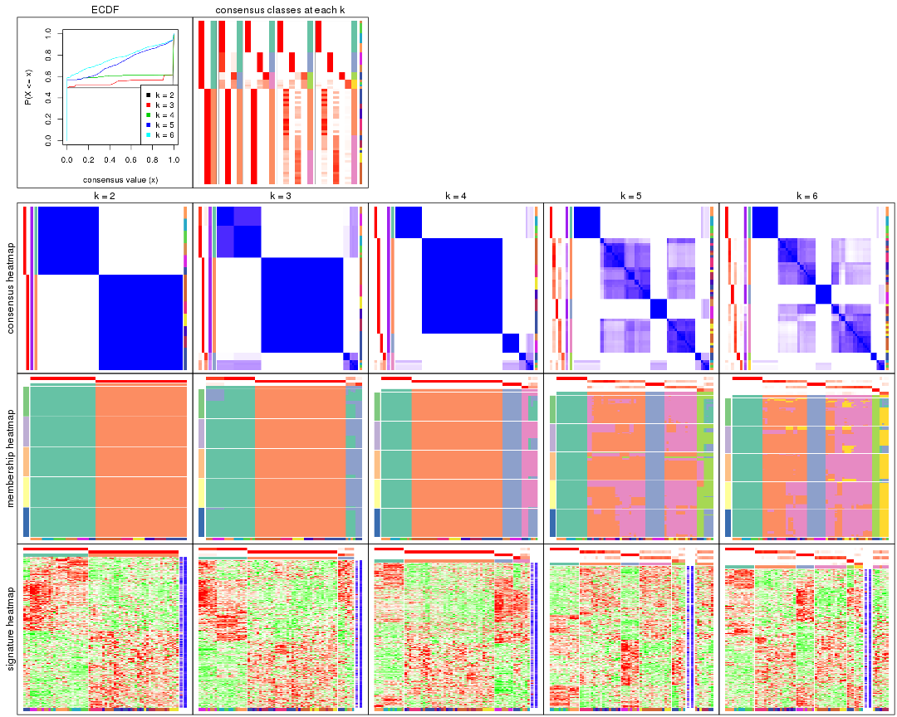

The plots are:

- The first row: a plot of the ECDF (Empirical cumulative distribution
  function) curves of the consensus matrix for each `k` and the heatmap of
  predicted classes for each `k`.
- The second row: heatmaps of the consensus matrix for each `k`.
- The third row: heatmaps of the membership matrix for each `k`.
- The fouth row: heatmaps of the signatures for each `k`.

All the plots in panels can be made by individual functions and they are
plotted later in this section.

`select_partition_number()` produces several plots showing different
statistics for choosing "optimized" `k`. There are following statistics:

- ECDF curves of the consensus matrix for each `k`;
- 1-PAC. [The PAC
  score](https://en.wikipedia.org/wiki/Consensus_clustering#Over-interpretation_potential_of_consensus_clustering)
  measures the proportion of the ambiguous subgrouping.
- Mean silhouette score.
- Concordance. The mean probability of fiting the consensus class ids in all
  partitions.
- Area increased. Denote $A_k$ as the area under the ECDF curve for current
  `k`, the area increased is defined as $A_k - A_{k-1}$.
- Rand index. The percent of pairs of samples that are both in a same cluster
  or both are not in a same cluster in the partition of k and k-1.
- Jaccard index. The ratio of pairs of samples are both in a same cluster in
  the partition of k and k-1 and the pairs of samples are both in a same
  cluster in the partition k or k-1.

The detailed explanations of these statistics can be found in [the cola
vignette](http://bioconductor.org/packages/devel/bioc/vignettes/cola/inst/doc/cola.html#toc_13).

Generally speaking, lower PAC score, higher mean silhouette score or higher
concordance corresponds to better partition. Rand index and Jaccard index
measure how similar the current partition is compared to partition with `k-1`.
If they are too similar, we won't accept `k` is better than `k-1`.

```r
select_partition_number(res)
```


The numeric values for all these statistics can be obtained by `get_stats()`.

```r
get_stats(res)
```

```
#>   k 1-PAC mean_silhouette concordance area_increased  Rand Jaccard
#> 2 2 1.000           1.000       1.000         0.4944 0.506   0.506
#> 3 3 1.000           0.942       0.958         0.1104 0.934   0.869
#> 4 4 1.000           0.961       0.971         0.0969 0.953   0.893
#> 5 5 0.687           0.708       0.792         0.2204 0.842   0.597
#> 6 6 0.756           0.759       0.867         0.0604 0.905   0.651
```

`suggest_best_k()` suggests the best $k$ based on these statistics. The rules are as follows:

- All $k$ with Jaccard index larger than 0.95 are removed because the increase of
  the partition number does not provides enough extra information. If all $k$ are removed,
  the best $k$ is assigned by `NA`.
- For $k$ with 1-PAC larger than 0.9, the maximal $k$ is taken as the "best k". Other $k$ is called "optional k".
- If it does not fit the second rule. The $k$ with the highest vote of highest
  1-PAC, mean silhouette and concordance is taken as the "best k".

```r
suggest_best_k(res)
```

```
#> [1] 4
#> attr(,"optional")
#> [1] 2 3
```

There is also optional best $k$ = 2 3 that is worth to check.

Following shows the table of the partitions (You need to click the **show/hide
code output** link to see it). The membership matrix (columns with name `p*`)
is inferred by
[`clue::cl_consensus()`](https://www.rdocumentation.org/link/cl_consensus?package=clue)
function with the `SE` method. Basically the value in the membership matrix
represents the probability to belong to a certain group. The finall class
label for an item is determined with the group with highest probability it
belongs to.

In `get_classes()` function, the entropy is calculated from the membership
matrix and the silhouette score is calculated from the consensus matrix.


<script>
$( function() {
	$( '#tabs-ATC-hclust-get-classes' ).tabs();
} );
</script>
<div id='tabs-ATC-hclust-get-classes'>
<ul>
<li><a href='#tab-ATC-hclust-get-classes-1'>k = 2</a></li>
<li><a href='#tab-ATC-hclust-get-classes-2'>k = 3</a></li>
<li><a href='#tab-ATC-hclust-get-classes-3'>k = 4</a></li>
<li><a href='#tab-ATC-hclust-get-classes-4'>k = 5</a></li>
<li><a href='#tab-ATC-hclust-get-classes-5'>k = 6</a></li>
</ul>

<div id='tab-ATC-hclust-get-classes-1'>
<p><a id='tab-ATC-hclust-get-classes-1-a' style='color:#0366d6' href='#'>show/hide code output</a></p>
<pre><code class="r">cbind(get_classes(res, k = 2), get_membership(res, k = 2))
</code></pre>

<pre><code>#&gt;           class entropy silhouette p1 p2
#&gt; GSM312811     2       0          1  0  1
#&gt; GSM312812     2       0          1  0  1
#&gt; GSM312813     2       0          1  0  1
#&gt; GSM312814     2       0          1  0  1
#&gt; GSM312815     2       0          1  0  1
#&gt; GSM312816     2       0          1  0  1
#&gt; GSM312817     2       0          1  0  1
#&gt; GSM312818     1       0          1  1  0
#&gt; GSM312819     2       0          1  0  1
#&gt; GSM312820     1       0          1  1  0
#&gt; GSM312821     1       0          1  1  0
#&gt; GSM312822     2       0          1  0  1
#&gt; GSM312823     2       0          1  0  1
#&gt; GSM312824     2       0          1  0  1
#&gt; GSM312825     2       0          1  0  1
#&gt; GSM312826     2       0          1  0  1
#&gt; GSM312839     2       0          1  0  1
#&gt; GSM312840     2       0          1  0  1
#&gt; GSM312841     2       0          1  0  1
#&gt; GSM312843     2       0          1  0  1
#&gt; GSM312844     2       0          1  0  1
#&gt; GSM312845     2       0          1  0  1
#&gt; GSM312846     2       0          1  0  1
#&gt; GSM312847     2       0          1  0  1
#&gt; GSM312848     2       0          1  0  1
#&gt; GSM312849     2       0          1  0  1
#&gt; GSM312851     2       0          1  0  1
#&gt; GSM312853     2       0          1  0  1
#&gt; GSM312854     2       0          1  0  1
#&gt; GSM312856     2       0          1  0  1
#&gt; GSM312857     2       0          1  0  1
#&gt; GSM312858     2       0          1  0  1
#&gt; GSM312859     2       0          1  0  1
#&gt; GSM312860     2       0          1  0  1
#&gt; GSM312861     2       0          1  0  1
#&gt; GSM312862     2       0          1  0  1
#&gt; GSM312863     2       0          1  0  1
#&gt; GSM312864     2       0          1  0  1
#&gt; GSM312865     2       0          1  0  1
#&gt; GSM312867     2       0          1  0  1
#&gt; GSM312868     2       0          1  0  1
#&gt; GSM312869     2       0          1  0  1
#&gt; GSM312870     1       0          1  1  0
#&gt; GSM312872     1       0          1  1  0
#&gt; GSM312874     1       0          1  1  0
#&gt; GSM312875     1       0          1  1  0
#&gt; GSM312876     1       0          1  1  0
#&gt; GSM312877     1       0          1  1  0
#&gt; GSM312879     1       0          1  1  0
#&gt; GSM312882     1       0          1  1  0
#&gt; GSM312883     1       0          1  1  0
#&gt; GSM312886     1       0          1  1  0
#&gt; GSM312887     1       0          1  1  0
#&gt; GSM312890     1       0          1  1  0
#&gt; GSM312893     1       0          1  1  0
#&gt; GSM312894     1       0          1  1  0
#&gt; GSM312895     1       0          1  1  0
#&gt; GSM312937     1       0          1  1  0
#&gt; GSM312938     1       0          1  1  0
#&gt; GSM312939     1       0          1  1  0
#&gt; GSM312940     1       0          1  1  0
#&gt; GSM312941     1       0          1  1  0
#&gt; GSM312942     1       0          1  1  0
#&gt; GSM312943     1       0          1  1  0
#&gt; GSM312944     1       0          1  1  0
#&gt; GSM312945     1       0          1  1  0
#&gt; GSM312946     1       0          1  1  0
</code></pre>

<script>
$('#tab-ATC-hclust-get-classes-1-a').parent().next().next().hide();
$('#tab-ATC-hclust-get-classes-1-a').click(function(){
  $('#tab-ATC-hclust-get-classes-1-a').parent().next().next().toggle();
  return(false);
});
</script>
</div>

<div id='tab-ATC-hclust-get-classes-2'>
<p><a id='tab-ATC-hclust-get-classes-2-a' style='color:#0366d6' href='#'>show/hide code output</a></p>
<pre><code class="r">cbind(get_classes(res, k = 3), get_membership(res, k = 3))
</code></pre>

<pre><code>#&gt;           class entropy silhouette    p1 p2    p3
#&gt; GSM312811     2   0.000      1.000 0.000  1 0.000
#&gt; GSM312812     2   0.000      1.000 0.000  1 0.000
#&gt; GSM312813     2   0.000      1.000 0.000  1 0.000
#&gt; GSM312814     2   0.000      1.000 0.000  1 0.000
#&gt; GSM312815     2   0.000      1.000 0.000  1 0.000
#&gt; GSM312816     2   0.000      1.000 0.000  1 0.000
#&gt; GSM312817     2   0.000      1.000 0.000  1 0.000
#&gt; GSM312818     3   0.254      0.687 0.080  0 0.920
#&gt; GSM312819     2   0.000      1.000 0.000  1 0.000
#&gt; GSM312820     3   0.254      0.687 0.080  0 0.920
#&gt; GSM312821     3   0.254      0.687 0.080  0 0.920
#&gt; GSM312822     2   0.000      1.000 0.000  1 0.000
#&gt; GSM312823     2   0.000      1.000 0.000  1 0.000
#&gt; GSM312824     2   0.000      1.000 0.000  1 0.000
#&gt; GSM312825     2   0.000      1.000 0.000  1 0.000
#&gt; GSM312826     2   0.000      1.000 0.000  1 0.000
#&gt; GSM312839     2   0.000      1.000 0.000  1 0.000
#&gt; GSM312840     2   0.000      1.000 0.000  1 0.000
#&gt; GSM312841     2   0.000      1.000 0.000  1 0.000
#&gt; GSM312843     2   0.000      1.000 0.000  1 0.000
#&gt; GSM312844     2   0.000      1.000 0.000  1 0.000
#&gt; GSM312845     2   0.000      1.000 0.000  1 0.000
#&gt; GSM312846     2   0.000      1.000 0.000  1 0.000
#&gt; GSM312847     2   0.000      1.000 0.000  1 0.000
#&gt; GSM312848     2   0.000      1.000 0.000  1 0.000
#&gt; GSM312849     2   0.000      1.000 0.000  1 0.000
#&gt; GSM312851     2   0.000      1.000 0.000  1 0.000
#&gt; GSM312853     2   0.000      1.000 0.000  1 0.000
#&gt; GSM312854     2   0.000      1.000 0.000  1 0.000
#&gt; GSM312856     2   0.000      1.000 0.000  1 0.000
#&gt; GSM312857     2   0.000      1.000 0.000  1 0.000
#&gt; GSM312858     2   0.000      1.000 0.000  1 0.000
#&gt; GSM312859     2   0.000      1.000 0.000  1 0.000
#&gt; GSM312860     2   0.000      1.000 0.000  1 0.000
#&gt; GSM312861     2   0.000      1.000 0.000  1 0.000
#&gt; GSM312862     2   0.000      1.000 0.000  1 0.000
#&gt; GSM312863     2   0.000      1.000 0.000  1 0.000
#&gt; GSM312864     2   0.000      1.000 0.000  1 0.000
#&gt; GSM312865     2   0.000      1.000 0.000  1 0.000
#&gt; GSM312867     2   0.000      1.000 0.000  1 0.000
#&gt; GSM312868     2   0.000      1.000 0.000  1 0.000
#&gt; GSM312869     2   0.000      1.000 0.000  1 0.000
#&gt; GSM312870     1   0.280      0.917 0.908  0 0.092
#&gt; GSM312872     1   0.280      0.917 0.908  0 0.092
#&gt; GSM312874     1   0.280      0.917 0.908  0 0.092
#&gt; GSM312875     1   0.280      0.917 0.908  0 0.092
#&gt; GSM312876     1   0.280      0.917 0.908  0 0.092
#&gt; GSM312877     1   0.000      0.949 1.000  0 0.000
#&gt; GSM312879     1   0.280      0.917 0.908  0 0.092
#&gt; GSM312882     1   0.280      0.917 0.908  0 0.092
#&gt; GSM312883     1   0.280      0.917 0.908  0 0.092
#&gt; GSM312886     3   0.623      0.594 0.436  0 0.564
#&gt; GSM312887     3   0.627      0.605 0.456  0 0.544
#&gt; GSM312890     1   0.000      0.949 1.000  0 0.000
#&gt; GSM312893     1   0.000      0.949 1.000  0 0.000
#&gt; GSM312894     1   0.000      0.949 1.000  0 0.000
#&gt; GSM312895     1   0.000      0.949 1.000  0 0.000
#&gt; GSM312937     1   0.000      0.949 1.000  0 0.000
#&gt; GSM312938     3   0.630      0.593 0.476  0 0.524
#&gt; GSM312939     1   0.000      0.949 1.000  0 0.000
#&gt; GSM312940     1   0.000      0.949 1.000  0 0.000
#&gt; GSM312941     1   0.000      0.949 1.000  0 0.000
#&gt; GSM312942     3   0.628      0.604 0.460  0 0.540
#&gt; GSM312943     1   0.000      0.949 1.000  0 0.000
#&gt; GSM312944     1   0.000      0.949 1.000  0 0.000
#&gt; GSM312945     1   0.000      0.949 1.000  0 0.000
#&gt; GSM312946     1   0.000      0.949 1.000  0 0.000
</code></pre>

<script>
$('#tab-ATC-hclust-get-classes-2-a').parent().next().next().hide();
$('#tab-ATC-hclust-get-classes-2-a').click(function(){
  $('#tab-ATC-hclust-get-classes-2-a').parent().next().next().toggle();
  return(false);
});
</script>
</div>

<div id='tab-ATC-hclust-get-classes-3'>
<p><a id='tab-ATC-hclust-get-classes-3-a' style='color:#0366d6' href='#'>show/hide code output</a></p>
<pre><code class="r">cbind(get_classes(res, k = 4), get_membership(res, k = 4))
</code></pre>

<pre><code>#&gt;           class entropy silhouette    p1 p2    p3    p4
#&gt; GSM312811     2   0.000      1.000 0.000  1 0.000 0.000
#&gt; GSM312812     2   0.000      1.000 0.000  1 0.000 0.000
#&gt; GSM312813     2   0.000      1.000 0.000  1 0.000 0.000
#&gt; GSM312814     2   0.000      1.000 0.000  1 0.000 0.000
#&gt; GSM312815     2   0.000      1.000 0.000  1 0.000 0.000
#&gt; GSM312816     2   0.000      1.000 0.000  1 0.000 0.000
#&gt; GSM312817     2   0.000      1.000 0.000  1 0.000 0.000
#&gt; GSM312818     4   0.000      0.674 0.000  0 0.000 1.000
#&gt; GSM312819     2   0.000      1.000 0.000  1 0.000 0.000
#&gt; GSM312820     4   0.000      0.674 0.000  0 0.000 1.000
#&gt; GSM312821     4   0.000      0.674 0.000  0 0.000 1.000
#&gt; GSM312822     2   0.000      1.000 0.000  1 0.000 0.000
#&gt; GSM312823     2   0.000      1.000 0.000  1 0.000 0.000
#&gt; GSM312824     2   0.000      1.000 0.000  1 0.000 0.000
#&gt; GSM312825     2   0.000      1.000 0.000  1 0.000 0.000
#&gt; GSM312826     2   0.000      1.000 0.000  1 0.000 0.000
#&gt; GSM312839     2   0.000      1.000 0.000  1 0.000 0.000
#&gt; GSM312840     2   0.000      1.000 0.000  1 0.000 0.000
#&gt; GSM312841     2   0.000      1.000 0.000  1 0.000 0.000
#&gt; GSM312843     2   0.000      1.000 0.000  1 0.000 0.000
#&gt; GSM312844     2   0.000      1.000 0.000  1 0.000 0.000
#&gt; GSM312845     2   0.000      1.000 0.000  1 0.000 0.000
#&gt; GSM312846     2   0.000      1.000 0.000  1 0.000 0.000
#&gt; GSM312847     2   0.000      1.000 0.000  1 0.000 0.000
#&gt; GSM312848     2   0.000      1.000 0.000  1 0.000 0.000
#&gt; GSM312849     2   0.000      1.000 0.000  1 0.000 0.000
#&gt; GSM312851     2   0.000      1.000 0.000  1 0.000 0.000
#&gt; GSM312853     2   0.000      1.000 0.000  1 0.000 0.000
#&gt; GSM312854     2   0.000      1.000 0.000  1 0.000 0.000
#&gt; GSM312856     2   0.000      1.000 0.000  1 0.000 0.000
#&gt; GSM312857     2   0.000      1.000 0.000  1 0.000 0.000
#&gt; GSM312858     2   0.000      1.000 0.000  1 0.000 0.000
#&gt; GSM312859     2   0.000      1.000 0.000  1 0.000 0.000
#&gt; GSM312860     2   0.000      1.000 0.000  1 0.000 0.000
#&gt; GSM312861     2   0.000      1.000 0.000  1 0.000 0.000
#&gt; GSM312862     2   0.000      1.000 0.000  1 0.000 0.000
#&gt; GSM312863     2   0.000      1.000 0.000  1 0.000 0.000
#&gt; GSM312864     2   0.000      1.000 0.000  1 0.000 0.000
#&gt; GSM312865     2   0.000      1.000 0.000  1 0.000 0.000
#&gt; GSM312867     2   0.000      1.000 0.000  1 0.000 0.000
#&gt; GSM312868     2   0.000      1.000 0.000  1 0.000 0.000
#&gt; GSM312869     2   0.000      1.000 0.000  1 0.000 0.000
#&gt; GSM312870     3   0.000      1.000 0.000  0 1.000 0.000
#&gt; GSM312872     3   0.000      1.000 0.000  0 1.000 0.000
#&gt; GSM312874     3   0.000      1.000 0.000  0 1.000 0.000
#&gt; GSM312875     3   0.000      1.000 0.000  0 1.000 0.000
#&gt; GSM312876     3   0.000      1.000 0.000  0 1.000 0.000
#&gt; GSM312877     1   0.000      1.000 1.000  0 0.000 0.000
#&gt; GSM312879     3   0.000      1.000 0.000  0 1.000 0.000
#&gt; GSM312882     3   0.000      1.000 0.000  0 1.000 0.000
#&gt; GSM312883     3   0.000      1.000 0.000  0 1.000 0.000
#&gt; GSM312886     4   0.677      0.553 0.100  0 0.384 0.516
#&gt; GSM312887     4   0.710      0.605 0.140  0 0.344 0.516
#&gt; GSM312890     1   0.000      1.000 1.000  0 0.000 0.000
#&gt; GSM312893     1   0.000      1.000 1.000  0 0.000 0.000
#&gt; GSM312894     1   0.000      1.000 1.000  0 0.000 0.000
#&gt; GSM312895     1   0.000      1.000 1.000  0 0.000 0.000
#&gt; GSM312937     1   0.000      1.000 1.000  0 0.000 0.000
#&gt; GSM312938     4   0.735      0.583 0.288  0 0.196 0.516
#&gt; GSM312939     1   0.000      1.000 1.000  0 0.000 0.000
#&gt; GSM312940     1   0.000      1.000 1.000  0 0.000 0.000
#&gt; GSM312941     1   0.000      1.000 1.000  0 0.000 0.000
#&gt; GSM312942     4   0.712      0.607 0.144  0 0.340 0.516
#&gt; GSM312943     1   0.000      1.000 1.000  0 0.000 0.000
#&gt; GSM312944     1   0.000      1.000 1.000  0 0.000 0.000
#&gt; GSM312945     1   0.000      1.000 1.000  0 0.000 0.000
#&gt; GSM312946     1   0.000      1.000 1.000  0 0.000 0.000
</code></pre>

<script>
$('#tab-ATC-hclust-get-classes-3-a').parent().next().next().hide();
$('#tab-ATC-hclust-get-classes-3-a').click(function(){
  $('#tab-ATC-hclust-get-classes-3-a').parent().next().next().toggle();
  return(false);
});
</script>
</div>

<div id='tab-ATC-hclust-get-classes-4'>
<p><a id='tab-ATC-hclust-get-classes-4-a' style='color:#0366d6' href='#'>show/hide code output</a></p>
<pre><code class="r">cbind(get_classes(res, k = 5), get_membership(res, k = 5))
</code></pre>

<pre><code>#&gt;           class entropy silhouette    p1    p2    p3    p4    p5
#&gt; GSM312811     2  0.1043      0.622 0.000 0.960 0.000 0.040 0.000
#&gt; GSM312812     2  0.4101      0.517 0.000 0.628 0.000 0.372 0.000
#&gt; GSM312813     4  0.3730      0.868 0.000 0.288 0.000 0.712 0.000
#&gt; GSM312814     2  0.0963      0.622 0.000 0.964 0.000 0.036 0.000
#&gt; GSM312815     2  0.4060      0.531 0.000 0.640 0.000 0.360 0.000
#&gt; GSM312816     2  0.0000      0.609 0.000 1.000 0.000 0.000 0.000
#&gt; GSM312817     2  0.4283     -0.385 0.000 0.544 0.000 0.456 0.000
#&gt; GSM312818     5  0.2966      0.596 0.000 0.000 0.000 0.184 0.816
#&gt; GSM312819     2  0.4283     -0.385 0.000 0.544 0.000 0.456 0.000
#&gt; GSM312820     5  0.2966      0.596 0.000 0.000 0.000 0.184 0.816
#&gt; GSM312821     5  0.2966      0.596 0.000 0.000 0.000 0.184 0.816
#&gt; GSM312822     2  0.3796      0.540 0.000 0.700 0.000 0.300 0.000
#&gt; GSM312823     2  0.0963      0.622 0.000 0.964 0.000 0.036 0.000
#&gt; GSM312824     2  0.4307      0.237 0.000 0.504 0.000 0.496 0.000
#&gt; GSM312825     2  0.4307      0.237 0.000 0.504 0.000 0.496 0.000
#&gt; GSM312826     2  0.4307      0.237 0.000 0.504 0.000 0.496 0.000
#&gt; GSM312839     2  0.4060      0.531 0.000 0.640 0.000 0.360 0.000
#&gt; GSM312840     2  0.3774      0.574 0.000 0.704 0.000 0.296 0.000
#&gt; GSM312841     2  0.3636      0.588 0.000 0.728 0.000 0.272 0.000
#&gt; GSM312843     2  0.3932      0.432 0.000 0.672 0.000 0.328 0.000
#&gt; GSM312844     2  0.4060      0.531 0.000 0.640 0.000 0.360 0.000
#&gt; GSM312845     4  0.3336      0.761 0.000 0.228 0.000 0.772 0.000
#&gt; GSM312846     2  0.4256      0.418 0.000 0.564 0.000 0.436 0.000
#&gt; GSM312847     4  0.3612      0.867 0.000 0.268 0.000 0.732 0.000
#&gt; GSM312848     4  0.3966      0.840 0.000 0.336 0.000 0.664 0.000
#&gt; GSM312849     4  0.3074      0.797 0.000 0.196 0.000 0.804 0.000
#&gt; GSM312851     2  0.0000      0.609 0.000 1.000 0.000 0.000 0.000
#&gt; GSM312853     2  0.0609      0.610 0.000 0.980 0.000 0.020 0.000
#&gt; GSM312854     2  0.1908      0.545 0.000 0.908 0.000 0.092 0.000
#&gt; GSM312856     2  0.0510      0.610 0.000 0.984 0.000 0.016 0.000
#&gt; GSM312857     2  0.0510      0.610 0.000 0.984 0.000 0.016 0.000
#&gt; GSM312858     4  0.3857      0.855 0.000 0.312 0.000 0.688 0.000
#&gt; GSM312859     4  0.3636      0.872 0.000 0.272 0.000 0.728 0.000
#&gt; GSM312860     4  0.3636      0.872 0.000 0.272 0.000 0.728 0.000
#&gt; GSM312861     4  0.3452      0.860 0.000 0.244 0.000 0.756 0.000
#&gt; GSM312862     2  0.4074      0.527 0.000 0.636 0.000 0.364 0.000
#&gt; GSM312863     4  0.4278      0.596 0.000 0.452 0.000 0.548 0.000
#&gt; GSM312864     2  0.0963      0.603 0.000 0.964 0.000 0.036 0.000
#&gt; GSM312865     4  0.3895      0.854 0.000 0.320 0.000 0.680 0.000
#&gt; GSM312867     4  0.2966      0.800 0.000 0.184 0.000 0.816 0.000
#&gt; GSM312868     4  0.3857      0.855 0.000 0.312 0.000 0.688 0.000
#&gt; GSM312869     4  0.3452      0.754 0.000 0.244 0.000 0.756 0.000
#&gt; GSM312870     3  0.0000      1.000 0.000 0.000 1.000 0.000 0.000
#&gt; GSM312872     3  0.0000      1.000 0.000 0.000 1.000 0.000 0.000
#&gt; GSM312874     3  0.0000      1.000 0.000 0.000 1.000 0.000 0.000
#&gt; GSM312875     3  0.0000      1.000 0.000 0.000 1.000 0.000 0.000
#&gt; GSM312876     3  0.0000      1.000 0.000 0.000 1.000 0.000 0.000
#&gt; GSM312877     1  0.0000      1.000 1.000 0.000 0.000 0.000 0.000
#&gt; GSM312879     3  0.0000      1.000 0.000 0.000 1.000 0.000 0.000
#&gt; GSM312882     3  0.0000      1.000 0.000 0.000 1.000 0.000 0.000
#&gt; GSM312883     3  0.0000      1.000 0.000 0.000 1.000 0.000 0.000
#&gt; GSM312886     5  0.5836      0.448 0.100 0.000 0.384 0.000 0.516
#&gt; GSM312887     5  0.6112      0.507 0.140 0.000 0.344 0.000 0.516
#&gt; GSM312890     1  0.0000      1.000 1.000 0.000 0.000 0.000 0.000
#&gt; GSM312893     1  0.0000      1.000 1.000 0.000 0.000 0.000 0.000
#&gt; GSM312894     1  0.0000      1.000 1.000 0.000 0.000 0.000 0.000
#&gt; GSM312895     1  0.0000      1.000 1.000 0.000 0.000 0.000 0.000
#&gt; GSM312937     1  0.0000      1.000 1.000 0.000 0.000 0.000 0.000
#&gt; GSM312938     5  0.6333      0.507 0.288 0.000 0.196 0.000 0.516
#&gt; GSM312939     1  0.0000      1.000 1.000 0.000 0.000 0.000 0.000
#&gt; GSM312940     1  0.0000      1.000 1.000 0.000 0.000 0.000 0.000
#&gt; GSM312941     1  0.0000      1.000 1.000 0.000 0.000 0.000 0.000
#&gt; GSM312942     5  0.6134      0.510 0.144 0.000 0.340 0.000 0.516
#&gt; GSM312943     1  0.0000      1.000 1.000 0.000 0.000 0.000 0.000
#&gt; GSM312944     1  0.0000      1.000 1.000 0.000 0.000 0.000 0.000
#&gt; GSM312945     1  0.0000      1.000 1.000 0.000 0.000 0.000 0.000
#&gt; GSM312946     1  0.0000      1.000 1.000 0.000 0.000 0.000 0.000
</code></pre>

<script>
$('#tab-ATC-hclust-get-classes-4-a').parent().next().next().hide();
$('#tab-ATC-hclust-get-classes-4-a').click(function(){
  $('#tab-ATC-hclust-get-classes-4-a').parent().next().next().toggle();
  return(false);
});
</script>
</div>

<div id='tab-ATC-hclust-get-classes-5'>
<p><a id='tab-ATC-hclust-get-classes-5-a' style='color:#0366d6' href='#'>show/hide code output</a></p>
<pre><code class="r">cbind(get_classes(res, k = 6), get_membership(res, k = 6))
</code></pre>

<pre><code>#&gt;           class entropy silhouette    p1    p2    p3    p4 p5    p6
#&gt; GSM312811     2  0.1124      0.736 0.000 0.956 0.000 0.036  0 0.008
#&gt; GSM312812     2  0.4409      0.541 0.000 0.588 0.000 0.380  0 0.032
#&gt; GSM312813     4  0.1970      0.735 0.000 0.092 0.000 0.900  0 0.008
#&gt; GSM312814     2  0.1124      0.737 0.000 0.956 0.000 0.036  0 0.008
#&gt; GSM312815     2  0.4443      0.569 0.000 0.596 0.000 0.368  0 0.036
#&gt; GSM312816     2  0.0363      0.726 0.000 0.988 0.000 0.000  0 0.012
#&gt; GSM312817     4  0.4155      0.445 0.000 0.364 0.000 0.616  0 0.020
#&gt; GSM312818     5  0.0000      1.000 0.000 0.000 0.000 0.000  1 0.000
#&gt; GSM312819     4  0.4155      0.445 0.000 0.364 0.000 0.616  0 0.020
#&gt; GSM312820     5  0.0000      1.000 0.000 0.000 0.000 0.000  1 0.000
#&gt; GSM312821     5  0.0000      1.000 0.000 0.000 0.000 0.000  1 0.000
#&gt; GSM312822     2  0.3898      0.603 0.000 0.652 0.000 0.336  0 0.012
#&gt; GSM312823     2  0.1124      0.737 0.000 0.956 0.000 0.036  0 0.008
#&gt; GSM312824     4  0.4575      0.188 0.000 0.352 0.000 0.600  0 0.048
#&gt; GSM312825     4  0.4575      0.188 0.000 0.352 0.000 0.600  0 0.048
#&gt; GSM312826     4  0.4575      0.188 0.000 0.352 0.000 0.600  0 0.048
#&gt; GSM312839     2  0.4443      0.569 0.000 0.596 0.000 0.368  0 0.036
#&gt; GSM312840     2  0.4152      0.628 0.000 0.664 0.000 0.304  0 0.032
#&gt; GSM312841     2  0.4020      0.649 0.000 0.692 0.000 0.276  0 0.032
#&gt; GSM312843     2  0.3819      0.456 0.000 0.624 0.000 0.372  0 0.004
#&gt; GSM312844     2  0.4443      0.569 0.000 0.596 0.000 0.368  0 0.036
#&gt; GSM312845     4  0.3172      0.662 0.000 0.036 0.000 0.816  0 0.148
#&gt; GSM312846     4  0.4666     -0.158 0.000 0.420 0.000 0.536  0 0.044
#&gt; GSM312847     4  0.2745      0.732 0.000 0.068 0.000 0.864  0 0.068
#&gt; GSM312848     4  0.2260      0.726 0.000 0.140 0.000 0.860  0 0.000
#&gt; GSM312849     4  0.2613      0.680 0.000 0.012 0.000 0.848  0 0.140
#&gt; GSM312851     2  0.0363      0.726 0.000 0.988 0.000 0.000  0 0.012
#&gt; GSM312853     2  0.0820      0.724 0.000 0.972 0.000 0.016  0 0.012
#&gt; GSM312854     2  0.1806      0.668 0.000 0.908 0.000 0.088  0 0.004
#&gt; GSM312856     2  0.0725      0.725 0.000 0.976 0.000 0.012  0 0.012
#&gt; GSM312857     2  0.0725      0.725 0.000 0.976 0.000 0.012  0 0.012
#&gt; GSM312858     4  0.1957      0.729 0.000 0.112 0.000 0.888  0 0.000
#&gt; GSM312859     4  0.1387      0.738 0.000 0.068 0.000 0.932  0 0.000
#&gt; GSM312860     4  0.1531      0.737 0.000 0.068 0.000 0.928  0 0.004
#&gt; GSM312861     4  0.1649      0.729 0.000 0.032 0.000 0.932  0 0.036
#&gt; GSM312862     2  0.4482      0.543 0.000 0.580 0.000 0.384  0 0.036
#&gt; GSM312863     4  0.3175      0.621 0.000 0.256 0.000 0.744  0 0.000
#&gt; GSM312864     2  0.1010      0.718 0.000 0.960 0.000 0.036  0 0.004
#&gt; GSM312865     4  0.2402      0.732 0.000 0.120 0.000 0.868  0 0.012
#&gt; GSM312867     4  0.2300      0.683 0.000 0.000 0.000 0.856  0 0.144
#&gt; GSM312868     4  0.2357      0.726 0.000 0.116 0.000 0.872  0 0.012
#&gt; GSM312869     4  0.3439      0.667 0.000 0.072 0.000 0.808  0 0.120
#&gt; GSM312870     3  0.0000      1.000 0.000 0.000 1.000 0.000  0 0.000
#&gt; GSM312872     3  0.0000      1.000 0.000 0.000 1.000 0.000  0 0.000
#&gt; GSM312874     3  0.0000      1.000 0.000 0.000 1.000 0.000  0 0.000
#&gt; GSM312875     3  0.0000      1.000 0.000 0.000 1.000 0.000  0 0.000
#&gt; GSM312876     3  0.0000      1.000 0.000 0.000 1.000 0.000  0 0.000
#&gt; GSM312877     1  0.0000      1.000 1.000 0.000 0.000 0.000  0 0.000
#&gt; GSM312879     3  0.0000      1.000 0.000 0.000 1.000 0.000  0 0.000
#&gt; GSM312882     3  0.0000      1.000 0.000 0.000 1.000 0.000  0 0.000
#&gt; GSM312883     3  0.0000      1.000 0.000 0.000 1.000 0.000  0 0.000
#&gt; GSM312886     6  0.2697      0.837 0.000 0.000 0.188 0.000  0 0.812
#&gt; GSM312887     6  0.3101      0.880 0.032 0.000 0.148 0.000  0 0.820
#&gt; GSM312890     1  0.0000      1.000 1.000 0.000 0.000 0.000  0 0.000
#&gt; GSM312893     1  0.0000      1.000 1.000 0.000 0.000 0.000  0 0.000
#&gt; GSM312894     1  0.0000      1.000 1.000 0.000 0.000 0.000  0 0.000
#&gt; GSM312895     1  0.0000      1.000 1.000 0.000 0.000 0.000  0 0.000
#&gt; GSM312937     1  0.0000      1.000 1.000 0.000 0.000 0.000  0 0.000
#&gt; GSM312938     6  0.2631      0.694 0.180 0.000 0.000 0.000  0 0.820
#&gt; GSM312939     1  0.0000      1.000 1.000 0.000 0.000 0.000  0 0.000
#&gt; GSM312940     1  0.0000      1.000 1.000 0.000 0.000 0.000  0 0.000
#&gt; GSM312941     1  0.0000      1.000 1.000 0.000 0.000 0.000  0 0.000
#&gt; GSM312942     6  0.3134      0.880 0.036 0.000 0.144 0.000  0 0.820
#&gt; GSM312943     1  0.0000      1.000 1.000 0.000 0.000 0.000  0 0.000
#&gt; GSM312944     1  0.0000      1.000 1.000 0.000 0.000 0.000  0 0.000
#&gt; GSM312945     1  0.0000      1.000 1.000 0.000 0.000 0.000  0 0.000
#&gt; GSM312946     1  0.0000      1.000 1.000 0.000 0.000 0.000  0 0.000
</code></pre>

<script>
$('#tab-ATC-hclust-get-classes-5-a').parent().next().next().hide();
$('#tab-ATC-hclust-get-classes-5-a').click(function(){
  $('#tab-ATC-hclust-get-classes-5-a').parent().next().next().toggle();
  return(false);
});
</script>
</div>
</div>

Heatmaps for the consensus matrix. It visualizes the probability of two
samples to be in a same group.


<script>
$( function() {
	$( '#tabs-ATC-hclust-consensus-heatmap' ).tabs();
} );
</script>
<div id='tabs-ATC-hclust-consensus-heatmap'>
<ul>
<li><a href='#tab-ATC-hclust-consensus-heatmap-1'>k = 2</a></li>
<li><a href='#tab-ATC-hclust-consensus-heatmap-2'>k = 3</a></li>
<li><a href='#tab-ATC-hclust-consensus-heatmap-3'>k = 4</a></li>
<li><a href='#tab-ATC-hclust-consensus-heatmap-4'>k = 5</a></li>
<li><a href='#tab-ATC-hclust-consensus-heatmap-5'>k = 6</a></li>
</ul>
<div id='tab-ATC-hclust-consensus-heatmap-1'>
<pre><code class="r">consensus_heatmap(res, k = 2)
</code></pre>

<p></p>

</div>
<div id='tab-ATC-hclust-consensus-heatmap-2'>
<pre><code class="r">consensus_heatmap(res, k = 3)
</code></pre>

<p></p>

</div>
<div id='tab-ATC-hclust-consensus-heatmap-3'>
<pre><code class="r">consensus_heatmap(res, k = 4)
</code></pre>

<p></p>

</div>
<div id='tab-ATC-hclust-consensus-heatmap-4'>
<pre><code class="r">consensus_heatmap(res, k = 5)
</code></pre>

<p></p>

</div>
<div id='tab-ATC-hclust-consensus-heatmap-5'>
<pre><code class="r">consensus_heatmap(res, k = 6)
</code></pre>

<p></p>

</div>
</div>

Heatmaps for the membership of samples in all partitions to see how consistent they are:


<script>
$( function() {
	$( '#tabs-ATC-hclust-membership-heatmap' ).tabs();
} );
</script>
<div id='tabs-ATC-hclust-membership-heatmap'>
<ul>
<li><a href='#tab-ATC-hclust-membership-heatmap-1'>k = 2</a></li>
<li><a href='#tab-ATC-hclust-membership-heatmap-2'>k = 3</a></li>
<li><a href='#tab-ATC-hclust-membership-heatmap-3'>k = 4</a></li>
<li><a href='#tab-ATC-hclust-membership-heatmap-4'>k = 5</a></li>
<li><a href='#tab-ATC-hclust-membership-heatmap-5'>k = 6</a></li>
</ul>
<div id='tab-ATC-hclust-membership-heatmap-1'>
<pre><code class="r">membership_heatmap(res, k = 2)
</code></pre>

<p></p>

</div>
<div id='tab-ATC-hclust-membership-heatmap-2'>
<pre><code class="r">membership_heatmap(res, k = 3)
</code></pre>

<p></p>

</div>
<div id='tab-ATC-hclust-membership-heatmap-3'>
<pre><code class="r">membership_heatmap(res, k = 4)
</code></pre>

<p></p>

</div>
<div id='tab-ATC-hclust-membership-heatmap-4'>
<pre><code class="r">membership_heatmap(res, k = 5)
</code></pre>

<p></p>

</div>
<div id='tab-ATC-hclust-membership-heatmap-5'>
<pre><code class="r">membership_heatmap(res, k = 6)
</code></pre>

<p></p>

</div>
</div>

As soon as we have had the classes for columns, we can look for signatures
which are significantly different between classes which can be candidate marks
for certain classes. Following are the heatmaps for signatures.


Signature heatmaps where rows are scaled:


<script>
$( function() {
	$( '#tabs-ATC-hclust-get-signatures' ).tabs();
} );
</script>
<div id='tabs-ATC-hclust-get-signatures'>
<ul>
<li><a href='#tab-ATC-hclust-get-signatures-1'>k = 2</a></li>
<li><a href='#tab-ATC-hclust-get-signatures-2'>k = 3</a></li>
<li><a href='#tab-ATC-hclust-get-signatures-3'>k = 4</a></li>
<li><a href='#tab-ATC-hclust-get-signatures-4'>k = 5</a></li>
<li><a href='#tab-ATC-hclust-get-signatures-5'>k = 6</a></li>
</ul>
<div id='tab-ATC-hclust-get-signatures-1'>
<pre><code class="r">get_signatures(res, k = 2)
</code></pre>

<p></p>

</div>
<div id='tab-ATC-hclust-get-signatures-2'>
<pre><code class="r">get_signatures(res, k = 3)
</code></pre>

<p></p>

</div>
<div id='tab-ATC-hclust-get-signatures-3'>
<pre><code class="r">get_signatures(res, k = 4)
</code></pre>

<p></p>

</div>
<div id='tab-ATC-hclust-get-signatures-4'>
<pre><code class="r">get_signatures(res, k = 5)
</code></pre>

<p></p>

</div>
<div id='tab-ATC-hclust-get-signatures-5'>
<pre><code class="r">get_signatures(res, k = 6)
</code></pre>

<p></p>

</div>
</div>


Signature heatmaps where rows are not scaled:


<script>
$( function() {
	$( '#tabs-ATC-hclust-get-signatures-no-scale' ).tabs();
} );
</script>
<div id='tabs-ATC-hclust-get-signatures-no-scale'>
<ul>
<li><a href='#tab-ATC-hclust-get-signatures-no-scale-1'>k = 2</a></li>
<li><a href='#tab-ATC-hclust-get-signatures-no-scale-2'>k = 3</a></li>
<li><a href='#tab-ATC-hclust-get-signatures-no-scale-3'>k = 4</a></li>
<li><a href='#tab-ATC-hclust-get-signatures-no-scale-4'>k = 5</a></li>
<li><a href='#tab-ATC-hclust-get-signatures-no-scale-5'>k = 6</a></li>
</ul>
<div id='tab-ATC-hclust-get-signatures-no-scale-1'>
<pre><code class="r">get_signatures(res, k = 2, scale_rows = FALSE)
</code></pre>

<p></p>

</div>
<div id='tab-ATC-hclust-get-signatures-no-scale-2'>
<pre><code class="r">get_signatures(res, k = 3, scale_rows = FALSE)
</code></pre>

<p></p>

</div>
<div id='tab-ATC-hclust-get-signatures-no-scale-3'>
<pre><code class="r">get_signatures(res, k = 4, scale_rows = FALSE)
</code></pre>

<p></p>

</div>
<div id='tab-ATC-hclust-get-signatures-no-scale-4'>
<pre><code class="r">get_signatures(res, k = 5, scale_rows = FALSE)
</code></pre>

<p></p>

</div>
<div id='tab-ATC-hclust-get-signatures-no-scale-5'>
<pre><code class="r">get_signatures(res, k = 6, scale_rows = FALSE)
</code></pre>

<p></p>

</div>
</div>


Compare the overlap of signatures from different k:

```r
compare_signatures(res)
```


`get_signature()` returns a data frame invisibly. TO get the list of signatures, the function
call should be assigned to a variable explicitly. In following code, if `plot` argument is set
to `FALSE`, no heatmap is plotted while only the differential analysis is performed.

```r
# code only for demonstration
tb = get_signature(res, k = ..., plot = FALSE)
```

An example of the output of `tb` is:

```
#>   which_row         fdr    mean_1    mean_2 scaled_mean_1 scaled_mean_2 km
#> 1        38 0.042760348  8.373488  9.131774    -0.5533452     0.5164555  1
#> 2        40 0.018707592  7.106213  8.469186    -0.6173731     0.5762149  1
#> 3        55 0.019134737 10.221463 11.207825    -0.6159697     0.5749050  1
#> 4        59 0.006059896  5.921854  7.869574    -0.6899429     0.6439467  1
#> 5        60 0.018055526  8.928898 10.211722    -0.6204761     0.5791110  1
#> 6        98 0.009384629 15.714769 14.887706     0.6635654    -0.6193277  2
...
```

The columns in `tb` are:

1. `which_row`: row indices corresponding to the input matrix.
2. `fdr`: FDR for the differential test. 
3. `mean_x`: The mean value in group x.
4. `scaled_mean_x`: The mean value in group x after rows are scaled.
5. `km`: Row groups if k-means clustering is applied to rows.


UMAP plot which shows how samples are separated.


<script>
$( function() {
	$( '#tabs-ATC-hclust-dimension-reduction' ).tabs();
} );
</script>
<div id='tabs-ATC-hclust-dimension-reduction'>
<ul>
<li><a href='#tab-ATC-hclust-dimension-reduction-1'>k = 2</a></li>
<li><a href='#tab-ATC-hclust-dimension-reduction-2'>k = 3</a></li>
<li><a href='#tab-ATC-hclust-dimension-reduction-3'>k = 4</a></li>
<li><a href='#tab-ATC-hclust-dimension-reduction-4'>k = 5</a></li>
<li><a href='#tab-ATC-hclust-dimension-reduction-5'>k = 6</a></li>
</ul>
<div id='tab-ATC-hclust-dimension-reduction-1'>
<pre><code class="r">dimension_reduction(res, k = 2, method = &quot;UMAP&quot;)
</code></pre>

<p></p>

</div>
<div id='tab-ATC-hclust-dimension-reduction-2'>
<pre><code class="r">dimension_reduction(res, k = 3, method = &quot;UMAP&quot;)
</code></pre>

<p></p>

</div>
<div id='tab-ATC-hclust-dimension-reduction-3'>
<pre><code class="r">dimension_reduction(res, k = 4, method = &quot;UMAP&quot;)
</code></pre>

<p></p>

</div>
<div id='tab-ATC-hclust-dimension-reduction-4'>
<pre><code class="r">dimension_reduction(res, k = 5, method = &quot;UMAP&quot;)
</code></pre>

<p></p>

</div>
<div id='tab-ATC-hclust-dimension-reduction-5'>
<pre><code class="r">dimension_reduction(res, k = 6, method = &quot;UMAP&quot;)
</code></pre>

<p></p>

</div>
</div>


Following heatmap shows how subgroups are split when increasing `k`:

```r
collect_classes(res)
```


Test correlation between subgroups and known annotations. If the known
annotation is numeric, one-way ANOVA test is applied, and if the known
annotation is discrete, chi-squared contingency table test is applied.

```r
test_to_known_factors(res)
```

```
#>             n disease.state(p) k
#> ATC:hclust 67         9.63e-09 2
#> ATC:hclust 67         4.21e-07 3
#> ATC:hclust 67         1.87e-12 4
#> ATC:hclust 59         2.62e-14 5
#> ATC:hclust 60         9.93e-14 6
```


If matrix rows can be associated to genes, consider to use `GO_Enrichment(res,
...)` to perform function enrichment for the signature genes.


 

---------------------------------------------------


### ATC:kmeans**


The object with results only for a single top-value method and a single partition method 
can be extracted as:

```r
res = res_list["ATC", "kmeans"]
# you can also extract it by
# res = res_list["ATC:kmeans"]
```

A summary of `res` and all the functions that can be applied to it:

```r
res
```

```
#> A 'ConsensusPartition' object with k = 2, 3, 4, 5, 6.
#>   On a matrix with 51941 rows and 67 columns.
#>   Top rows (1000, 2000, 3000, 4000, 5000) are extracted by 'ATC' method.
#>   Subgroups are detected by 'kmeans' method.
#>   Performed in total 1250 partitions by row resampling.
#>   Best k for subgroups seems to be 2.
#> 
#> Following methods can be applied to this 'ConsensusPartition' object:
#>  [1] "cola_report"             "collect_classes"         "collect_plots"          
#>  [4] "collect_stats"           "colnames"                "compare_signatures"     
#>  [7] "consensus_heatmap"       "dimension_reduction"     "functional_enrichment"  
#> [10] "get_anno_col"            "get_anno"                "get_classes"            
#> [13] "get_consensus"           "get_matrix"              "get_membership"         
#> [16] "get_param"               "get_signatures"          "get_stats"              
#> [19] "is_best_k"               "is_stable_k"             "membership_heatmap"     
#> [22] "ncol"                    "nrow"                    "plot_ecdf"              
#> [25] "rownames"                "select_partition_number" "show"                   
#> [28] "suggest_best_k"          "test_to_known_factors"
```

`collect_plots()` function collects all the plots made from `res` for all `k` (number of partitions)
into one single page to provide an easy and fast comparison between different `k`.

```r
collect_plots(res)
```


The plots are:

- The first row: a plot of the ECDF (Empirical cumulative distribution
  function) curves of the consensus matrix for each `k` and the heatmap of
  predicted classes for each `k`.
- The second row: heatmaps of the consensus matrix for each `k`.
- The third row: heatmaps of the membership matrix for each `k`.
- The fouth row: heatmaps of the signatures for each `k`.

All the plots in panels can be made by individual functions and they are
plotted later in this section.

`select_partition_number()` produces several plots showing different
statistics for choosing "optimized" `k`. There are following statistics:

- ECDF curves of the consensus matrix for each `k`;
- 1-PAC. [The PAC
  score](https://en.wikipedia.org/wiki/Consensus_clustering#Over-interpretation_potential_of_consensus_clustering)
  measures the proportion of the ambiguous subgrouping.
- Mean silhouette score.
- Concordance. The mean probability of fiting the consensus class ids in all
  partitions.
- Area increased. Denote $A_k$ as the area under the ECDF curve for current
  `k`, the area increased is defined as $A_k - A_{k-1}$.
- Rand index. The percent of pairs of samples that are both in a same cluster
  or both are not in a same cluster in the partition of k and k-1.
- Jaccard index. The ratio of pairs of samples are both in a same cluster in
  the partition of k and k-1 and the pairs of samples are both in a same
  cluster in the partition k or k-1.

The detailed explanations of these statistics can be found in [the cola
vignette](http://bioconductor.org/packages/devel/bioc/vignettes/cola/inst/doc/cola.html#toc_13).

Generally speaking, lower PAC score, higher mean silhouette score or higher
concordance corresponds to better partition. Rand index and Jaccard index
measure how similar the current partition is compared to partition with `k-1`.
If they are too similar, we won't accept `k` is better than `k-1`.

```r
select_partition_number(res)
```


The numeric values for all these statistics can be obtained by `get_stats()`.

```r
get_stats(res)
```

```
#>   k 1-PAC mean_silhouette concordance area_increased  Rand Jaccard
#> 2 2 1.000           0.991       0.996         0.4904 0.512   0.512
#> 3 3 0.750           0.783       0.885         0.2143 0.924   0.853
#> 4 4 0.696           0.816       0.792         0.1342 0.930   0.842
#> 5 5 0.666           0.738       0.775         0.1166 0.834   0.570
#> 6 6 0.664           0.677       0.745         0.0592 0.941   0.756
```

`suggest_best_k()` suggests the best $k$ based on these statistics. The rules are as follows:

- All $k$ with Jaccard index larger than 0.95 are removed because the increase of
  the partition number does not provides enough extra information. If all $k$ are removed,
  the best $k$ is assigned by `NA`.
- For $k$ with 1-PAC larger than 0.9, the maximal $k$ is taken as the "best k". Other $k$ is called "optional k".
- If it does not fit the second rule. The $k$ with the highest vote of highest
  1-PAC, mean silhouette and concordance is taken as the "best k".

```r
suggest_best_k(res)
```

```
#> [1] 2
```


Following shows the table of the partitions (You need to click the **show/hide
code output** link to see it). The membership matrix (columns with name `p*`)
is inferred by
[`clue::cl_consensus()`](https://www.rdocumentation.org/link/cl_consensus?package=clue)
function with the `SE` method. Basically the value in the membership matrix
represents the probability to belong to a certain group. The finall class
label for an item is determined with the group with highest probability it
belongs to.

In `get_classes()` function, the entropy is calculated from the membership
matrix and the silhouette score is calculated from the consensus matrix.


<script>
$( function() {
	$( '#tabs-ATC-kmeans-get-classes' ).tabs();
} );
</script>
<div id='tabs-ATC-kmeans-get-classes'>
<ul>
<li><a href='#tab-ATC-kmeans-get-classes-1'>k = 2</a></li>
<li><a href='#tab-ATC-kmeans-get-classes-2'>k = 3</a></li>
<li><a href='#tab-ATC-kmeans-get-classes-3'>k = 4</a></li>
<li><a href='#tab-ATC-kmeans-get-classes-4'>k = 5</a></li>
<li><a href='#tab-ATC-kmeans-get-classes-5'>k = 6</a></li>
</ul>

<div id='tab-ATC-kmeans-get-classes-1'>
<p><a id='tab-ATC-kmeans-get-classes-1-a' style='color:#0366d6' href='#'>show/hide code output</a></p>
<pre><code class="r">cbind(get_classes(res, k = 2), get_membership(res, k = 2))
</code></pre>

<pre><code>#&gt;           class entropy silhouette    p1    p2
#&gt; GSM312811     2   0.000      0.993 0.000 1.000
#&gt; GSM312812     2   0.000      0.993 0.000 1.000
#&gt; GSM312813     2   0.000      0.993 0.000 1.000
#&gt; GSM312814     2   0.000      0.993 0.000 1.000
#&gt; GSM312815     2   0.000      0.993 0.000 1.000
#&gt; GSM312816     2   0.000      0.993 0.000 1.000
#&gt; GSM312817     2   0.000      0.993 0.000 1.000
#&gt; GSM312818     1   0.000      1.000 1.000 0.000
#&gt; GSM312819     2   0.000      0.993 0.000 1.000
#&gt; GSM312820     2   0.821      0.656 0.256 0.744
#&gt; GSM312821     1   0.000      1.000 1.000 0.000
#&gt; GSM312822     2   0.000      0.993 0.000 1.000
#&gt; GSM312823     2   0.000      0.993 0.000 1.000
#&gt; GSM312824     2   0.000      0.993 0.000 1.000
#&gt; GSM312825     2   0.000      0.993 0.000 1.000
#&gt; GSM312826     2   0.000      0.993 0.000 1.000
#&gt; GSM312839     2   0.000      0.993 0.000 1.000
#&gt; GSM312840     2   0.000      0.993 0.000 1.000
#&gt; GSM312841     2   0.000      0.993 0.000 1.000
#&gt; GSM312843     2   0.000      0.993 0.000 1.000
#&gt; GSM312844     2   0.000      0.993 0.000 1.000
#&gt; GSM312845     2   0.000      0.993 0.000 1.000
#&gt; GSM312846     2   0.000      0.993 0.000 1.000
#&gt; GSM312847     2   0.000      0.993 0.000 1.000
#&gt; GSM312848     2   0.000      0.993 0.000 1.000
#&gt; GSM312849     2   0.000      0.993 0.000 1.000
#&gt; GSM312851     2   0.000      0.993 0.000 1.000
#&gt; GSM312853     2   0.000      0.993 0.000 1.000
#&gt; GSM312854     2   0.000      0.993 0.000 1.000
#&gt; GSM312856     2   0.000      0.993 0.000 1.000
#&gt; GSM312857     2   0.000      0.993 0.000 1.000
#&gt; GSM312858     2   0.000      0.993 0.000 1.000
#&gt; GSM312859     2   0.000      0.993 0.000 1.000
#&gt; GSM312860     2   0.000      0.993 0.000 1.000
#&gt; GSM312861     2   0.000      0.993 0.000 1.000
#&gt; GSM312862     2   0.000      0.993 0.000 1.000
#&gt; GSM312863     2   0.000      0.993 0.000 1.000
#&gt; GSM312864     2   0.000      0.993 0.000 1.000
#&gt; GSM312865     2   0.000      0.993 0.000 1.000
#&gt; GSM312867     2   0.000      0.993 0.000 1.000
#&gt; GSM312868     2   0.000      0.993 0.000 1.000
#&gt; GSM312869     2   0.000      0.993 0.000 1.000
#&gt; GSM312870     1   0.000      1.000 1.000 0.000
#&gt; GSM312872     1   0.000      1.000 1.000 0.000
#&gt; GSM312874     1   0.000      1.000 1.000 0.000
#&gt; GSM312875     1   0.000      1.000 1.000 0.000
#&gt; GSM312876     1   0.000      1.000 1.000 0.000
#&gt; GSM312877     1   0.000      1.000 1.000 0.000
#&gt; GSM312879     1   0.000      1.000 1.000 0.000
#&gt; GSM312882     1   0.000      1.000 1.000 0.000
#&gt; GSM312883     1   0.000      1.000 1.000 0.000
#&gt; GSM312886     1   0.000      1.000 1.000 0.000
#&gt; GSM312887     1   0.000      1.000 1.000 0.000
#&gt; GSM312890     1   0.000      1.000 1.000 0.000
#&gt; GSM312893     1   0.000      1.000 1.000 0.000
#&gt; GSM312894     1   0.000      1.000 1.000 0.000
#&gt; GSM312895     1   0.000      1.000 1.000 0.000
#&gt; GSM312937     1   0.000      1.000 1.000 0.000
#&gt; GSM312938     1   0.000      1.000 1.000 0.000
#&gt; GSM312939     1   0.000      1.000 1.000 0.000
#&gt; GSM312940     1   0.000      1.000 1.000 0.000
#&gt; GSM312941     1   0.000      1.000 1.000 0.000
#&gt; GSM312942     1   0.000      1.000 1.000 0.000
#&gt; GSM312943     1   0.000      1.000 1.000 0.000
#&gt; GSM312944     1   0.000      1.000 1.000 0.000
#&gt; GSM312945     1   0.000      1.000 1.000 0.000
#&gt; GSM312946     1   0.000      1.000 1.000 0.000
</code></pre>

<script>
$('#tab-ATC-kmeans-get-classes-1-a').parent().next().next().hide();
$('#tab-ATC-kmeans-get-classes-1-a').click(function(){
  $('#tab-ATC-kmeans-get-classes-1-a').parent().next().next().toggle();
  return(false);
});
</script>
</div>

<div id='tab-ATC-kmeans-get-classes-2'>
<p><a id='tab-ATC-kmeans-get-classes-2-a' style='color:#0366d6' href='#'>show/hide code output</a></p>
<pre><code class="r">cbind(get_classes(res, k = 3), get_membership(res, k = 3))
</code></pre>

<pre><code>#&gt;           class entropy silhouette    p1    p2    p3
#&gt; GSM312811     2  0.5988      0.404 0.000 0.632 0.368
#&gt; GSM312812     2  0.0000      0.914 0.000 1.000 0.000
#&gt; GSM312813     2  0.0000      0.914 0.000 1.000 0.000
#&gt; GSM312814     2  0.5988      0.404 0.000 0.632 0.368
#&gt; GSM312815     2  0.4121      0.776 0.000 0.832 0.168
#&gt; GSM312816     3  0.6095      0.322 0.000 0.392 0.608
#&gt; GSM312817     2  0.0000      0.914 0.000 1.000 0.000
#&gt; GSM312818     3  0.6095      0.610 0.392 0.000 0.608
#&gt; GSM312819     2  0.0000      0.914 0.000 1.000 0.000
#&gt; GSM312820     3  0.6587      0.629 0.352 0.016 0.632
#&gt; GSM312821     3  0.5988      0.616 0.368 0.000 0.632
#&gt; GSM312822     2  0.6008      0.394 0.000 0.628 0.372
#&gt; GSM312823     2  0.3752      0.803 0.000 0.856 0.144
#&gt; GSM312824     2  0.0000      0.914 0.000 1.000 0.000
#&gt; GSM312825     2  0.0000      0.914 0.000 1.000 0.000
#&gt; GSM312826     2  0.0000      0.914 0.000 1.000 0.000
#&gt; GSM312839     2  0.3192      0.831 0.000 0.888 0.112
#&gt; GSM312840     2  0.0000      0.914 0.000 1.000 0.000
#&gt; GSM312841     2  0.0892      0.902 0.000 0.980 0.020
#&gt; GSM312843     2  0.0000      0.914 0.000 1.000 0.000
#&gt; GSM312844     2  0.4121      0.776 0.000 0.832 0.168
#&gt; GSM312845     2  0.0000      0.914 0.000 1.000 0.000
#&gt; GSM312846     2  0.3192      0.831 0.000 0.888 0.112
#&gt; GSM312847     2  0.0000      0.914 0.000 1.000 0.000
#&gt; GSM312848     2  0.0000      0.914 0.000 1.000 0.000
#&gt; GSM312849     2  0.0000      0.914 0.000 1.000 0.000
#&gt; GSM312851     3  0.6168      0.269 0.000 0.412 0.588
#&gt; GSM312853     2  0.5178      0.610 0.000 0.744 0.256
#&gt; GSM312854     2  0.0000      0.914 0.000 1.000 0.000
#&gt; GSM312856     2  0.0237      0.911 0.000 0.996 0.004
#&gt; GSM312857     2  0.5178      0.610 0.000 0.744 0.256
#&gt; GSM312858     2  0.0000      0.914 0.000 1.000 0.000
#&gt; GSM312859     2  0.0000      0.914 0.000 1.000 0.000
#&gt; GSM312860     2  0.0000      0.914 0.000 1.000 0.000
#&gt; GSM312861     2  0.0000      0.914 0.000 1.000 0.000
#&gt; GSM312862     2  0.3816      0.799 0.000 0.852 0.148
#&gt; GSM312863     2  0.0000      0.914 0.000 1.000 0.000
#&gt; GSM312864     2  0.0237      0.911 0.000 0.996 0.004
#&gt; GSM312865     2  0.0000      0.914 0.000 1.000 0.000
#&gt; GSM312867     2  0.0000      0.914 0.000 1.000 0.000
#&gt; GSM312868     2  0.0000      0.914 0.000 1.000 0.000
#&gt; GSM312869     2  0.0000      0.914 0.000 1.000 0.000
#&gt; GSM312870     1  0.0000      0.710 1.000 0.000 0.000
#&gt; GSM312872     1  0.0000      0.710 1.000 0.000 0.000
#&gt; GSM312874     1  0.0000      0.710 1.000 0.000 0.000
#&gt; GSM312875     1  0.0000      0.710 1.000 0.000 0.000
#&gt; GSM312876     1  0.0000      0.710 1.000 0.000 0.000
#&gt; GSM312877     1  0.6095      0.802 0.608 0.000 0.392
#&gt; GSM312879     1  0.0000      0.710 1.000 0.000 0.000
#&gt; GSM312882     1  0.0000      0.710 1.000 0.000 0.000
#&gt; GSM312883     1  0.0000      0.710 1.000 0.000 0.000
#&gt; GSM312886     1  0.0000      0.710 1.000 0.000 0.000
#&gt; GSM312887     1  0.0000      0.710 1.000 0.000 0.000
#&gt; GSM312890     1  0.6095      0.802 0.608 0.000 0.392
#&gt; GSM312893     1  0.6095      0.802 0.608 0.000 0.392
#&gt; GSM312894     1  0.6095      0.802 0.608 0.000 0.392
#&gt; GSM312895     1  0.6095      0.802 0.608 0.000 0.392
#&gt; GSM312937     1  0.6095      0.802 0.608 0.000 0.392
#&gt; GSM312938     1  0.6095      0.802 0.608 0.000 0.392
#&gt; GSM312939     1  0.6095      0.802 0.608 0.000 0.392
#&gt; GSM312940     1  0.6095      0.802 0.608 0.000 0.392
#&gt; GSM312941     1  0.6095      0.802 0.608 0.000 0.392
#&gt; GSM312942     1  0.0000      0.710 1.000 0.000 0.000
#&gt; GSM312943     1  0.6095      0.802 0.608 0.000 0.392
#&gt; GSM312944     1  0.6095      0.802 0.608 0.000 0.392
#&gt; GSM312945     1  0.6095      0.802 0.608 0.000 0.392
#&gt; GSM312946     1  0.6095      0.802 0.608 0.000 0.392
</code></pre>

<script>
$('#tab-ATC-kmeans-get-classes-2-a').parent().next().next().hide();
$('#tab-ATC-kmeans-get-classes-2-a').click(function(){
  $('#tab-ATC-kmeans-get-classes-2-a').parent().next().next().toggle();
  return(false);
});
</script>
</div>

<div id='tab-ATC-kmeans-get-classes-3'>
<p><a id='tab-ATC-kmeans-get-classes-3-a' style='color:#0366d6' href='#'>show/hide code output</a></p>
<pre><code class="r">cbind(get_classes(res, k = 4), get_membership(res, k = 4))
</code></pre>

<pre><code>#&gt;           class entropy silhouette    p1    p2    p3    p4
#&gt; GSM312811     2  0.7855      0.250 0.000 0.396 0.284 0.320
#&gt; GSM312812     2  0.2647      0.791 0.000 0.880 0.120 0.000
#&gt; GSM312813     2  0.0000      0.797 0.000 1.000 0.000 0.000
#&gt; GSM312814     2  0.7916      0.221 0.000 0.356 0.316 0.328
#&gt; GSM312815     2  0.6731      0.633 0.000 0.604 0.248 0.148
#&gt; GSM312816     4  0.4502      0.794 0.000 0.016 0.236 0.748
#&gt; GSM312817     2  0.1867      0.784 0.000 0.928 0.072 0.000
#&gt; GSM312818     4  0.1118      0.833 0.000 0.000 0.036 0.964
#&gt; GSM312819     2  0.1867      0.784 0.000 0.928 0.072 0.000
#&gt; GSM312820     4  0.0592      0.851 0.000 0.000 0.016 0.984
#&gt; GSM312821     4  0.0592      0.851 0.000 0.000 0.016 0.984
#&gt; GSM312822     2  0.7916      0.221 0.000 0.356 0.316 0.328
#&gt; GSM312823     2  0.6422      0.664 0.000 0.632 0.248 0.120
#&gt; GSM312824     2  0.2647      0.791 0.000 0.880 0.120 0.000
#&gt; GSM312825     2  0.2647      0.791 0.000 0.880 0.120 0.000
#&gt; GSM312826     2  0.2647      0.791 0.000 0.880 0.120 0.000
#&gt; GSM312839     2  0.5998      0.692 0.000 0.664 0.248 0.088
#&gt; GSM312840     2  0.2408      0.793 0.000 0.896 0.104 0.000
#&gt; GSM312841     2  0.5496      0.713 0.000 0.652 0.312 0.036
#&gt; GSM312843     2  0.4319      0.742 0.000 0.760 0.228 0.012
#&gt; GSM312844     2  0.6731      0.633 0.000 0.604 0.248 0.148
#&gt; GSM312845     2  0.1716      0.795 0.000 0.936 0.064 0.000
#&gt; GSM312846     2  0.5998      0.692 0.000 0.664 0.248 0.088
#&gt; GSM312847     2  0.0000      0.797 0.000 1.000 0.000 0.000
#&gt; GSM312848     2  0.1118      0.794 0.000 0.964 0.036 0.000
#&gt; GSM312849     2  0.1118      0.798 0.000 0.964 0.036 0.000
#&gt; GSM312851     4  0.5312      0.750 0.000 0.052 0.236 0.712
#&gt; GSM312853     2  0.7347      0.440 0.000 0.528 0.228 0.244
#&gt; GSM312854     2  0.2081      0.785 0.000 0.916 0.084 0.000
#&gt; GSM312856     2  0.4644      0.734 0.000 0.748 0.228 0.024
#&gt; GSM312857     2  0.7347      0.440 0.000 0.528 0.228 0.244
#&gt; GSM312858     2  0.0000      0.797 0.000 1.000 0.000 0.000
#&gt; GSM312859     2  0.0000      0.797 0.000 1.000 0.000 0.000
#&gt; GSM312860     2  0.1022      0.798 0.000 0.968 0.032 0.000
#&gt; GSM312861     2  0.0000      0.797 0.000 1.000 0.000 0.000
#&gt; GSM312862     2  0.6422      0.664 0.000 0.632 0.248 0.120
#&gt; GSM312863     2  0.1867      0.784 0.000 0.928 0.072 0.000
#&gt; GSM312864     2  0.4319      0.742 0.000 0.760 0.228 0.012
#&gt; GSM312865     2  0.0000      0.797 0.000 1.000 0.000 0.000
#&gt; GSM312867     2  0.1118      0.798 0.000 0.964 0.036 0.000
#&gt; GSM312868     2  0.0188      0.797 0.000 0.996 0.004 0.000
#&gt; GSM312869     2  0.2647      0.791 0.000 0.880 0.120 0.000
#&gt; GSM312870     3  0.4522      0.989 0.320 0.000 0.680 0.000
#&gt; GSM312872     3  0.4522      0.989 0.320 0.000 0.680 0.000
#&gt; GSM312874     3  0.4522      0.989 0.320 0.000 0.680 0.000
#&gt; GSM312875     3  0.4522      0.989 0.320 0.000 0.680 0.000
#&gt; GSM312876     3  0.4522      0.989 0.320 0.000 0.680 0.000
#&gt; GSM312877     1  0.0000      0.993 1.000 0.000 0.000 0.000
#&gt; GSM312879     3  0.4522      0.989 0.320 0.000 0.680 0.000
#&gt; GSM312882     3  0.4522      0.989 0.320 0.000 0.680 0.000
#&gt; GSM312883     3  0.5069      0.978 0.320 0.000 0.664 0.016
#&gt; GSM312886     3  0.5334      0.942 0.284 0.000 0.680 0.036
#&gt; GSM312887     3  0.4836      0.984 0.320 0.000 0.672 0.008
#&gt; GSM312890     1  0.0000      0.993 1.000 0.000 0.000 0.000
#&gt; GSM312893     1  0.0000      0.993 1.000 0.000 0.000 0.000
#&gt; GSM312894     1  0.0000      0.993 1.000 0.000 0.000 0.000
#&gt; GSM312895     1  0.0000      0.993 1.000 0.000 0.000 0.000
#&gt; GSM312937     1  0.0000      0.993 1.000 0.000 0.000 0.000
#&gt; GSM312938     1  0.0592      0.987 0.984 0.000 0.000 0.016
#&gt; GSM312939     1  0.0000      0.993 1.000 0.000 0.000 0.000
#&gt; GSM312940     1  0.0000      0.993 1.000 0.000 0.000 0.000
#&gt; GSM312941     1  0.0000      0.993 1.000 0.000 0.000 0.000
#&gt; GSM312942     3  0.5090      0.974 0.324 0.000 0.660 0.016
#&gt; GSM312943     1  0.0592      0.987 0.984 0.000 0.000 0.016
#&gt; GSM312944     1  0.0592      0.987 0.984 0.000 0.000 0.016
#&gt; GSM312945     1  0.0592      0.987 0.984 0.000 0.000 0.016
#&gt; GSM312946     1  0.0592      0.987 0.984 0.000 0.000 0.016
</code></pre>

<script>
$('#tab-ATC-kmeans-get-classes-3-a').parent().next().next().hide();
$('#tab-ATC-kmeans-get-classes-3-a').click(function(){
  $('#tab-ATC-kmeans-get-classes-3-a').parent().next().next().toggle();
  return(false);
});
</script>
</div>

<div id='tab-ATC-kmeans-get-classes-4'>
<p><a id='tab-ATC-kmeans-get-classes-4-a' style='color:#0366d6' href='#'>show/hide code output</a></p>
<pre><code class="r">cbind(get_classes(res, k = 5), get_membership(res, k = 5))
</code></pre>

<pre><code>#&gt;           class entropy silhouette    p1    p2    p3    p4    p5
#&gt; GSM312811     2  0.2488      0.633 0.000 0.872 0.000 0.124 0.004
#&gt; GSM312812     4  0.5984      0.426 0.000 0.208 0.204 0.588 0.000
#&gt; GSM312813     4  0.0162      0.750 0.000 0.000 0.004 0.996 0.000
#&gt; GSM312814     2  0.3796      0.660 0.000 0.820 0.100 0.076 0.004
#&gt; GSM312815     2  0.6256      0.581 0.000 0.564 0.224 0.208 0.004
#&gt; GSM312816     2  0.3274      0.391 0.000 0.780 0.000 0.000 0.220
#&gt; GSM312817     4  0.3374      0.641 0.000 0.108 0.044 0.844 0.004
#&gt; GSM312818     5  0.0880      1.000 0.000 0.032 0.000 0.000 0.968
#&gt; GSM312819     4  0.4114      0.576 0.000 0.176 0.044 0.776 0.004
#&gt; GSM312820     5  0.0880      1.000 0.000 0.032 0.000 0.000 0.968
#&gt; GSM312821     5  0.0880      1.000 0.000 0.032 0.000 0.000 0.968
#&gt; GSM312822     2  0.3796      0.660 0.000 0.820 0.100 0.076 0.004
#&gt; GSM312823     2  0.6233      0.584 0.000 0.568 0.216 0.212 0.004
#&gt; GSM312824     4  0.5984      0.426 0.000 0.208 0.204 0.588 0.000
#&gt; GSM312825     4  0.5984      0.426 0.000 0.208 0.204 0.588 0.000
#&gt; GSM312826     4  0.5984      0.426 0.000 0.208 0.204 0.588 0.000
#&gt; GSM312839     2  0.6309      0.541 0.000 0.532 0.228 0.240 0.000
#&gt; GSM312840     4  0.5375      0.528 0.000 0.156 0.176 0.668 0.000
#&gt; GSM312841     2  0.5538      0.621 0.000 0.644 0.212 0.144 0.000
#&gt; GSM312843     2  0.5638      0.402 0.000 0.532 0.068 0.396 0.004
#&gt; GSM312844     2  0.6159      0.591 0.000 0.580 0.208 0.208 0.004
#&gt; GSM312845     4  0.4169      0.645 0.000 0.100 0.116 0.784 0.000
#&gt; GSM312846     2  0.6309      0.541 0.000 0.532 0.228 0.240 0.000
#&gt; GSM312847     4  0.0000      0.750 0.000 0.000 0.000 1.000 0.000
#&gt; GSM312848     4  0.1568      0.728 0.000 0.036 0.020 0.944 0.000
#&gt; GSM312849     4  0.2300      0.726 0.000 0.052 0.040 0.908 0.000
#&gt; GSM312851     2  0.3611      0.405 0.000 0.780 0.008 0.004 0.208
#&gt; GSM312853     2  0.4756      0.554 0.000 0.704 0.052 0.240 0.004
#&gt; GSM312854     4  0.5469      0.149 0.000 0.392 0.056 0.548 0.004
#&gt; GSM312856     2  0.4883      0.545 0.000 0.684 0.052 0.260 0.004
#&gt; GSM312857     2  0.4756      0.554 0.000 0.704 0.052 0.240 0.004
#&gt; GSM312858     4  0.0162      0.750 0.000 0.000 0.004 0.996 0.000
#&gt; GSM312859     4  0.0000      0.750 0.000 0.000 0.000 1.000 0.000
#&gt; GSM312860     4  0.1197      0.739 0.000 0.048 0.000 0.952 0.000
#&gt; GSM312861     4  0.0162      0.750 0.000 0.000 0.004 0.996 0.000
#&gt; GSM312862     2  0.6209      0.587 0.000 0.572 0.212 0.212 0.004
#&gt; GSM312863     4  0.3595      0.628 0.000 0.120 0.048 0.828 0.004
#&gt; GSM312864     2  0.4969      0.536 0.000 0.676 0.056 0.264 0.004
#&gt; GSM312865     4  0.0000      0.750 0.000 0.000 0.000 1.000 0.000
#&gt; GSM312867     4  0.2221      0.727 0.000 0.052 0.036 0.912 0.000
#&gt; GSM312868     4  0.1443      0.730 0.000 0.004 0.044 0.948 0.004
#&gt; GSM312869     4  0.6084      0.397 0.000 0.208 0.220 0.572 0.000
#&gt; GSM312870     3  0.3752      0.957 0.292 0.000 0.708 0.000 0.000
#&gt; GSM312872     3  0.3752      0.957 0.292 0.000 0.708 0.000 0.000
#&gt; GSM312874     3  0.3752      0.957 0.292 0.000 0.708 0.000 0.000
#&gt; GSM312875     3  0.3752      0.957 0.292 0.000 0.708 0.000 0.000
#&gt; GSM312876     3  0.3752      0.957 0.292 0.000 0.708 0.000 0.000
#&gt; GSM312877     1  0.0000      0.964 1.000 0.000 0.000 0.000 0.000
#&gt; GSM312879     3  0.3752      0.957 0.292 0.000 0.708 0.000 0.000
#&gt; GSM312882     3  0.4380      0.951 0.292 0.016 0.688 0.000 0.004
#&gt; GSM312883     3  0.5641      0.921 0.292 0.064 0.624 0.000 0.020
#&gt; GSM312886     3  0.5472      0.876 0.220 0.024 0.680 0.000 0.076
#&gt; GSM312887     3  0.5834      0.912 0.292 0.072 0.612 0.000 0.024
#&gt; GSM312890     1  0.0000      0.964 1.000 0.000 0.000 0.000 0.000
#&gt; GSM312893     1  0.0000      0.964 1.000 0.000 0.000 0.000 0.000
#&gt; GSM312894     1  0.0000      0.964 1.000 0.000 0.000 0.000 0.000
#&gt; GSM312895     1  0.0000      0.964 1.000 0.000 0.000 0.000 0.000
#&gt; GSM312937     1  0.0000      0.964 1.000 0.000 0.000 0.000 0.000
#&gt; GSM312938     1  0.2104      0.927 0.916 0.060 0.000 0.000 0.024
#&gt; GSM312939     1  0.0000      0.964 1.000 0.000 0.000 0.000 0.000
#&gt; GSM312940     1  0.0000      0.964 1.000 0.000 0.000 0.000 0.000
#&gt; GSM312941     1  0.0000      0.964 1.000 0.000 0.000 0.000 0.000
#&gt; GSM312942     3  0.5982      0.900 0.296 0.076 0.600 0.000 0.028
#&gt; GSM312943     1  0.1965      0.934 0.924 0.052 0.000 0.000 0.024
#&gt; GSM312944     1  0.1965      0.934 0.924 0.052 0.000 0.000 0.024
#&gt; GSM312945     1  0.1965      0.934 0.924 0.052 0.000 0.000 0.024
#&gt; GSM312946     1  0.1965      0.934 0.924 0.052 0.000 0.000 0.024
</code></pre>

<script>
$('#tab-ATC-kmeans-get-classes-4-a').parent().next().next().hide();
$('#tab-ATC-kmeans-get-classes-4-a').click(function(){
  $('#tab-ATC-kmeans-get-classes-4-a').parent().next().next().toggle();
  return(false);
});
</script>
</div>

<div id='tab-ATC-kmeans-get-classes-5'>
<p><a id='tab-ATC-kmeans-get-classes-5-a' style='color:#0366d6' href='#'>show/hide code output</a></p>
<pre><code class="r">cbind(get_classes(res, k = 6), get_membership(res, k = 6))
</code></pre>

<pre><code>#&gt;           class entropy silhouette    p1    p2    p3    p4    p5    p6
#&gt; GSM312811     6  0.5317    0.54974 0.024 0.376 0.000 0.040 0.008 0.552
#&gt; GSM312812     4  0.5260    0.07820 0.072 0.456 0.000 0.464 0.000 0.008
#&gt; GSM312813     4  0.1492    0.71298 0.036 0.000 0.000 0.940 0.000 0.024
#&gt; GSM312814     2  0.4945    0.01493 0.020 0.608 0.000 0.028 0.008 0.336
#&gt; GSM312815     2  0.2006    0.74633 0.004 0.892 0.000 0.104 0.000 0.000
#&gt; GSM312816     6  0.5638    0.56493 0.024 0.332 0.000 0.000 0.096 0.548
#&gt; GSM312817     4  0.3821    0.52628 0.040 0.000 0.000 0.740 0.000 0.220
#&gt; GSM312818     5  0.0146    0.99400 0.000 0.004 0.000 0.000 0.996 0.000
#&gt; GSM312819     4  0.4348    0.36592 0.040 0.000 0.000 0.640 0.000 0.320
#&gt; GSM312820     5  0.0260    0.99699 0.000 0.008 0.000 0.000 0.992 0.000
#&gt; GSM312821     5  0.0260    0.99699 0.000 0.008 0.000 0.000 0.992 0.000
#&gt; GSM312822     2  0.5089    0.00658 0.028 0.600 0.000 0.028 0.008 0.336
#&gt; GSM312823     2  0.2527    0.74646 0.000 0.868 0.000 0.108 0.000 0.024
#&gt; GSM312824     4  0.5260    0.07820 0.072 0.456 0.000 0.464 0.000 0.008
#&gt; GSM312825     4  0.5260    0.07820 0.072 0.456 0.000 0.464 0.000 0.008
#&gt; GSM312826     4  0.5260    0.07820 0.072 0.456 0.000 0.464 0.000 0.008
#&gt; GSM312839     2  0.2389    0.73720 0.008 0.864 0.000 0.128 0.000 0.000
#&gt; GSM312840     4  0.6182    0.33137 0.068 0.296 0.000 0.536 0.000 0.100
#&gt; GSM312841     2  0.4180    0.63474 0.076 0.784 0.000 0.044 0.000 0.096
#&gt; GSM312843     6  0.6088    0.48346 0.004 0.244 0.000 0.312 0.000 0.440
#&gt; GSM312844     2  0.2622    0.74476 0.004 0.868 0.000 0.104 0.000 0.024
#&gt; GSM312845     4  0.4601    0.53389 0.076 0.224 0.000 0.692 0.000 0.008
#&gt; GSM312846     2  0.2581    0.73474 0.016 0.856 0.000 0.128 0.000 0.000
#&gt; GSM312847     4  0.1285    0.71669 0.052 0.004 0.000 0.944 0.000 0.000
#&gt; GSM312848     4  0.1700    0.68403 0.004 0.000 0.000 0.916 0.000 0.080
#&gt; GSM312849     4  0.3161    0.67424 0.076 0.080 0.000 0.840 0.000 0.004
#&gt; GSM312851     6  0.5343    0.63865 0.020 0.280 0.000 0.004 0.080 0.616
#&gt; GSM312853     6  0.4510    0.77043 0.000 0.172 0.000 0.100 0.008 0.720
#&gt; GSM312854     6  0.4365    0.54601 0.004 0.040 0.000 0.292 0.000 0.664
#&gt; GSM312856     6  0.4351    0.76805 0.000 0.172 0.000 0.108 0.000 0.720
#&gt; GSM312857     6  0.4510    0.77043 0.000 0.172 0.000 0.100 0.008 0.720
#&gt; GSM312858     4  0.0260    0.72102 0.000 0.000 0.000 0.992 0.000 0.008
#&gt; GSM312859     4  0.0405    0.72294 0.008 0.004 0.000 0.988 0.000 0.000
#&gt; GSM312860     4  0.1914    0.71328 0.056 0.016 0.000 0.920 0.000 0.008
#&gt; GSM312861     4  0.0363    0.72049 0.000 0.000 0.000 0.988 0.000 0.012
#&gt; GSM312862     2  0.2480    0.74518 0.000 0.872 0.000 0.104 0.000 0.024
#&gt; GSM312863     4  0.3189    0.51693 0.004 0.000 0.000 0.760 0.000 0.236
#&gt; GSM312864     6  0.4425    0.76479 0.004 0.164 0.000 0.108 0.000 0.724
#&gt; GSM312865     4  0.0260    0.72243 0.008 0.000 0.000 0.992 0.000 0.000
#&gt; GSM312867     4  0.2886    0.68335 0.064 0.072 0.000 0.860 0.000 0.004
#&gt; GSM312868     4  0.2680    0.65732 0.032 0.000 0.000 0.860 0.000 0.108
#&gt; GSM312869     2  0.5333   -0.11280 0.080 0.480 0.000 0.432 0.000 0.008
#&gt; GSM312870     3  0.0291    0.89521 0.000 0.000 0.992 0.000 0.004 0.004
#&gt; GSM312872     3  0.0291    0.89521 0.000 0.000 0.992 0.000 0.004 0.004
#&gt; GSM312874     3  0.0291    0.89521 0.000 0.000 0.992 0.000 0.004 0.004
#&gt; GSM312875     3  0.0146    0.89518 0.000 0.000 0.996 0.000 0.000 0.004
#&gt; GSM312876     3  0.0000    0.89531 0.000 0.000 1.000 0.000 0.000 0.000
#&gt; GSM312877     1  0.2838    0.88768 0.808 0.004 0.188 0.000 0.000 0.000
#&gt; GSM312879     3  0.0291    0.89521 0.000 0.000 0.992 0.000 0.004 0.004
#&gt; GSM312882     3  0.1334    0.88506 0.000 0.020 0.948 0.000 0.000 0.032
#&gt; GSM312883     3  0.4223    0.76492 0.000 0.072 0.732 0.000 0.004 0.192
#&gt; GSM312886     3  0.2838    0.85671 0.000 0.024 0.872 0.000 0.032 0.072
#&gt; GSM312887     3  0.4518    0.73236 0.000 0.080 0.696 0.000 0.004 0.220
#&gt; GSM312890     1  0.2838    0.88768 0.808 0.004 0.188 0.000 0.000 0.000
#&gt; GSM312893     1  0.2697    0.88786 0.812 0.000 0.188 0.000 0.000 0.000
#&gt; GSM312894     1  0.2697    0.88786 0.812 0.000 0.188 0.000 0.000 0.000
#&gt; GSM312895     1  0.2838    0.88768 0.808 0.004 0.188 0.000 0.000 0.000
#&gt; GSM312937     1  0.2697    0.88786 0.812 0.000 0.188 0.000 0.000 0.000
#&gt; GSM312938     1  0.6540    0.74691 0.532 0.060 0.188 0.000 0.004 0.216
#&gt; GSM312939     1  0.2838    0.88768 0.808 0.004 0.188 0.000 0.000 0.000
#&gt; GSM312940     1  0.2697    0.88786 0.812 0.000 0.188 0.000 0.000 0.000
#&gt; GSM312941     1  0.2697    0.88786 0.812 0.000 0.188 0.000 0.000 0.000
#&gt; GSM312942     3  0.4753    0.70939 0.004 0.080 0.676 0.000 0.004 0.236
#&gt; GSM312943     1  0.6498    0.77732 0.556 0.076 0.188 0.000 0.004 0.176
#&gt; GSM312944     1  0.6365    0.77981 0.560 0.076 0.188 0.000 0.000 0.176
#&gt; GSM312945     1  0.6498    0.77732 0.556 0.076 0.188 0.000 0.004 0.176
#&gt; GSM312946     1  0.6498    0.77732 0.556 0.076 0.188 0.000 0.004 0.176
</code></pre>

<script>
$('#tab-ATC-kmeans-get-classes-5-a').parent().next().next().hide();
$('#tab-ATC-kmeans-get-classes-5-a').click(function(){
  $('#tab-ATC-kmeans-get-classes-5-a').parent().next().next().toggle();
  return(false);
});
</script>
</div>
</div>

Heatmaps for the consensus matrix. It visualizes the probability of two
samples to be in a same group.


<script>
$( function() {
	$( '#tabs-ATC-kmeans-consensus-heatmap' ).tabs();
} );
</script>
<div id='tabs-ATC-kmeans-consensus-heatmap'>
<ul>
<li><a href='#tab-ATC-kmeans-consensus-heatmap-1'>k = 2</a></li>
<li><a href='#tab-ATC-kmeans-consensus-heatmap-2'>k = 3</a></li>
<li><a href='#tab-ATC-kmeans-consensus-heatmap-3'>k = 4</a></li>
<li><a href='#tab-ATC-kmeans-consensus-heatmap-4'>k = 5</a></li>
<li><a href='#tab-ATC-kmeans-consensus-heatmap-5'>k = 6</a></li>
</ul>
<div id='tab-ATC-kmeans-consensus-heatmap-1'>
<pre><code class="r">consensus_heatmap(res, k = 2)
</code></pre>

<p></p>

</div>
<div id='tab-ATC-kmeans-consensus-heatmap-2'>
<pre><code class="r">consensus_heatmap(res, k = 3)
</code></pre>

<p></p>

</div>
<div id='tab-ATC-kmeans-consensus-heatmap-3'>
<pre><code class="r">consensus_heatmap(res, k = 4)
</code></pre>

<p></p>

</div>
<div id='tab-ATC-kmeans-consensus-heatmap-4'>
<pre><code class="r">consensus_heatmap(res, k = 5)
</code></pre>

<p>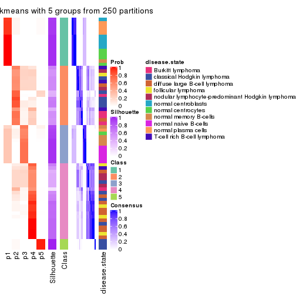</p>

</div>
<div id='tab-ATC-kmeans-consensus-heatmap-5'>
<pre><code class="r">consensus_heatmap(res, k = 6)
</code></pre>

<p></p>

</div>
</div>

Heatmaps for the membership of samples in all partitions to see how consistent they are:


<script>
$( function() {
	$( '#tabs-ATC-kmeans-membership-heatmap' ).tabs();
} );
</script>
<div id='tabs-ATC-kmeans-membership-heatmap'>
<ul>
<li><a href='#tab-ATC-kmeans-membership-heatmap-1'>k = 2</a></li>
<li><a href='#tab-ATC-kmeans-membership-heatmap-2'>k = 3</a></li>
<li><a href='#tab-ATC-kmeans-membership-heatmap-3'>k = 4</a></li>
<li><a href='#tab-ATC-kmeans-membership-heatmap-4'>k = 5</a></li>
<li><a href='#tab-ATC-kmeans-membership-heatmap-5'>k = 6</a></li>
</ul>
<div id='tab-ATC-kmeans-membership-heatmap-1'>
<pre><code class="r">membership_heatmap(res, k = 2)
</code></pre>

<p></p>

</div>
<div id='tab-ATC-kmeans-membership-heatmap-2'>
<pre><code class="r">membership_heatmap(res, k = 3)
</code></pre>

<p></p>

</div>
<div id='tab-ATC-kmeans-membership-heatmap-3'>
<pre><code class="r">membership_heatmap(res, k = 4)
</code></pre>

<p></p>

</div>
<div id='tab-ATC-kmeans-membership-heatmap-4'>
<pre><code class="r">membership_heatmap(res, k = 5)
</code></pre>

<p></p>

</div>
<div id='tab-ATC-kmeans-membership-heatmap-5'>
<pre><code class="r">membership_heatmap(res, k = 6)
</code></pre>

<p></p>

</div>
</div>

As soon as we have had the classes for columns, we can look for signatures
which are significantly different between classes which can be candidate marks
for certain classes. Following are the heatmaps for signatures.


Signature heatmaps where rows are scaled:


<script>
$( function() {
	$( '#tabs-ATC-kmeans-get-signatures' ).tabs();
} );
</script>
<div id='tabs-ATC-kmeans-get-signatures'>
<ul>
<li><a href='#tab-ATC-kmeans-get-signatures-1'>k = 2</a></li>
<li><a href='#tab-ATC-kmeans-get-signatures-2'>k = 3</a></li>
<li><a href='#tab-ATC-kmeans-get-signatures-3'>k = 4</a></li>
<li><a href='#tab-ATC-kmeans-get-signatures-4'>k = 5</a></li>
<li><a href='#tab-ATC-kmeans-get-signatures-5'>k = 6</a></li>
</ul>
<div id='tab-ATC-kmeans-get-signatures-1'>
<pre><code class="r">get_signatures(res, k = 2)
</code></pre>

<p></p>

</div>
<div id='tab-ATC-kmeans-get-signatures-2'>
<pre><code class="r">get_signatures(res, k = 3)
</code></pre>

<p></p>

</div>
<div id='tab-ATC-kmeans-get-signatures-3'>
<pre><code class="r">get_signatures(res, k = 4)
</code></pre>

<p></p>

</div>
<div id='tab-ATC-kmeans-get-signatures-4'>
<pre><code class="r">get_signatures(res, k = 5)
</code></pre>

<p></p>

</div>
<div id='tab-ATC-kmeans-get-signatures-5'>
<pre><code class="r">get_signatures(res, k = 6)
</code></pre>

<p></p>

</div>
</div>


Signature heatmaps where rows are not scaled:


<script>
$( function() {
	$( '#tabs-ATC-kmeans-get-signatures-no-scale' ).tabs();
} );
</script>
<div id='tabs-ATC-kmeans-get-signatures-no-scale'>
<ul>
<li><a href='#tab-ATC-kmeans-get-signatures-no-scale-1'>k = 2</a></li>
<li><a href='#tab-ATC-kmeans-get-signatures-no-scale-2'>k = 3</a></li>
<li><a href='#tab-ATC-kmeans-get-signatures-no-scale-3'>k = 4</a></li>
<li><a href='#tab-ATC-kmeans-get-signatures-no-scale-4'>k = 5</a></li>
<li><a href='#tab-ATC-kmeans-get-signatures-no-scale-5'>k = 6</a></li>
</ul>
<div id='tab-ATC-kmeans-get-signatures-no-scale-1'>
<pre><code class="r">get_signatures(res, k = 2, scale_rows = FALSE)
</code></pre>

<p></p>

</div>
<div id='tab-ATC-kmeans-get-signatures-no-scale-2'>
<pre><code class="r">get_signatures(res, k = 3, scale_rows = FALSE)
</code></pre>

<p></p>

</div>
<div id='tab-ATC-kmeans-get-signatures-no-scale-3'>
<pre><code class="r">get_signatures(res, k = 4, scale_rows = FALSE)
</code></pre>

<p></p>

</div>
<div id='tab-ATC-kmeans-get-signatures-no-scale-4'>
<pre><code class="r">get_signatures(res, k = 5, scale_rows = FALSE)
</code></pre>

<p></p>

</div>
<div id='tab-ATC-kmeans-get-signatures-no-scale-5'>
<pre><code class="r">get_signatures(res, k = 6, scale_rows = FALSE)
</code></pre>

<p></p>

</div>
</div>


Compare the overlap of signatures from different k:

```r
compare_signatures(res)
```


`get_signature()` returns a data frame invisibly. TO get the list of signatures, the function
call should be assigned to a variable explicitly. In following code, if `plot` argument is set
to `FALSE`, no heatmap is plotted while only the differential analysis is performed.

```r
# code only for demonstration
tb = get_signature(res, k = ..., plot = FALSE)
```

An example of the output of `tb` is:

```
#>   which_row         fdr    mean_1    mean_2 scaled_mean_1 scaled_mean_2 km
#> 1        38 0.042760348  8.373488  9.131774    -0.5533452     0.5164555  1
#> 2        40 0.018707592  7.106213  8.469186    -0.6173731     0.5762149  1
#> 3        55 0.019134737 10.221463 11.207825    -0.6159697     0.5749050  1
#> 4        59 0.006059896  5.921854  7.869574    -0.6899429     0.6439467  1
#> 5        60 0.018055526  8.928898 10.211722    -0.6204761     0.5791110  1
#> 6        98 0.009384629 15.714769 14.887706     0.6635654    -0.6193277  2
...
```

The columns in `tb` are:

1. `which_row`: row indices corresponding to the input matrix.
2. `fdr`: FDR for the differential test. 
3. `mean_x`: The mean value in group x.
4. `scaled_mean_x`: The mean value in group x after rows are scaled.
5. `km`: Row groups if k-means clustering is applied to rows.


UMAP plot which shows how samples are separated.


<script>
$( function() {
	$( '#tabs-ATC-kmeans-dimension-reduction' ).tabs();
} );
</script>
<div id='tabs-ATC-kmeans-dimension-reduction'>
<ul>
<li><a href='#tab-ATC-kmeans-dimension-reduction-1'>k = 2</a></li>
<li><a href='#tab-ATC-kmeans-dimension-reduction-2'>k = 3</a></li>
<li><a href='#tab-ATC-kmeans-dimension-reduction-3'>k = 4</a></li>
<li><a href='#tab-ATC-kmeans-dimension-reduction-4'>k = 5</a></li>
<li><a href='#tab-ATC-kmeans-dimension-reduction-5'>k = 6</a></li>
</ul>
<div id='tab-ATC-kmeans-dimension-reduction-1'>
<pre><code class="r">dimension_reduction(res, k = 2, method = &quot;UMAP&quot;)
</code></pre>

<p></p>

</div>
<div id='tab-ATC-kmeans-dimension-reduction-2'>
<pre><code class="r">dimension_reduction(res, k = 3, method = &quot;UMAP&quot;)
</code></pre>

<p></p>

</div>
<div id='tab-ATC-kmeans-dimension-reduction-3'>
<pre><code class="r">dimension_reduction(res, k = 4, method = &quot;UMAP&quot;)
</code></pre>

<p></p>

</div>
<div id='tab-ATC-kmeans-dimension-reduction-4'>
<pre><code class="r">dimension_reduction(res, k = 5, method = &quot;UMAP&quot;)
</code></pre>

<p></p>

</div>
<div id='tab-ATC-kmeans-dimension-reduction-5'>
<pre><code class="r">dimension_reduction(res, k = 6, method = &quot;UMAP&quot;)
</code></pre>

<p></p>

</div>
</div>


Following heatmap shows how subgroups are split when increasing `k`:

```r
collect_classes(res)
```


Test correlation between subgroups and known annotations. If the known
annotation is numeric, one-way ANOVA test is applied, and if the known
annotation is discrete, chi-squared contingency table test is applied.

```r
test_to_known_factors(res)
```

```
#>             n disease.state(p) k
#> ATC:kmeans 67         3.51e-09 2
#> ATC:kmeans 62         1.92e-09 3
#> ATC:kmeans 62         8.66e-13 4
#> ATC:kmeans 58         4.73e-11 5
#> ATC:kmeans 57         1.71e-15 6
```


If matrix rows can be associated to genes, consider to use `GO_Enrichment(res,
...)` to perform function enrichment for the signature genes.


 

---------------------------------------------------


### ATC:skmeans*


The object with results only for a single top-value method and a single partition method 
can be extracted as:

```r
res = res_list["ATC", "skmeans"]
# you can also extract it by
# res = res_list["ATC:skmeans"]
```

A summary of `res` and all the functions that can be applied to it:

```r
res
```

```
#> A 'ConsensusPartition' object with k = 2, 3, 4, 5, 6.
#>   On a matrix with 51941 rows and 67 columns.
#>   Top rows (1000, 2000, 3000, 4000, 5000) are extracted by 'ATC' method.
#>   Subgroups are detected by 'skmeans' method.
#>   Performed in total 1250 partitions by row resampling.
#>   Best k for subgroups seems to be 3.
#> 
#> Following methods can be applied to this 'ConsensusPartition' object:
#>  [1] "cola_report"             "collect_classes"         "collect_plots"          
#>  [4] "collect_stats"           "colnames"                "compare_signatures"     
#>  [7] "consensus_heatmap"       "dimension_reduction"     "functional_enrichment"  
#> [10] "get_anno_col"            "get_anno"                "get_classes"            
#> [13] "get_consensus"           "get_matrix"              "get_membership"         
#> [16] "get_param"               "get_signatures"          "get_stats"              
#> [19] "is_best_k"               "is_stable_k"             "membership_heatmap"     
#> [22] "ncol"                    "nrow"                    "plot_ecdf"              
#> [25] "rownames"                "select_partition_number" "show"                   
#> [28] "suggest_best_k"          "test_to_known_factors"
```

`collect_plots()` function collects all the plots made from `res` for all `k` (number of partitions)
into one single page to provide an easy and fast comparison between different `k`.

```r
collect_plots(res)
```


The plots are:

- The first row: a plot of the ECDF (Empirical cumulative distribution
  function) curves of the consensus matrix for each `k` and the heatmap of
  predicted classes for each `k`.
- The second row: heatmaps of the consensus matrix for each `k`.
- The third row: heatmaps of the membership matrix for each `k`.
- The fouth row: heatmaps of the signatures for each `k`.

All the plots in panels can be made by individual functions and they are
plotted later in this section.

`select_partition_number()` produces several plots showing different
statistics for choosing "optimized" `k`. There are following statistics:

- ECDF curves of the consensus matrix for each `k`;
- 1-PAC. [The PAC
  score](https://en.wikipedia.org/wiki/Consensus_clustering#Over-interpretation_potential_of_consensus_clustering)
  measures the proportion of the ambiguous subgrouping.
- Mean silhouette score.
- Concordance. The mean probability of fiting the consensus class ids in all
  partitions.
- Area increased. Denote $A_k$ as the area under the ECDF curve for current
  `k`, the area increased is defined as $A_k - A_{k-1}$.
- Rand index. The percent of pairs of samples that are both in a same cluster
  or both are not in a same cluster in the partition of k and k-1.
- Jaccard index. The ratio of pairs of samples are both in a same cluster in
  the partition of k and k-1 and the pairs of samples are both in a same
  cluster in the partition k or k-1.

The detailed explanations of these statistics can be found in [the cola
vignette](http://bioconductor.org/packages/devel/bioc/vignettes/cola/inst/doc/cola.html#toc_13).

Generally speaking, lower PAC score, higher mean silhouette score or higher
concordance corresponds to better partition. Rand index and Jaccard index
measure how similar the current partition is compared to partition with `k-1`.
If they are too similar, we won't accept `k` is better than `k-1`.

```r
select_partition_number(res)
```


The numeric values for all these statistics can be obtained by `get_stats()`.

```r
get_stats(res)
```

```
#>   k 1-PAC mean_silhouette concordance area_increased  Rand Jaccard
#> 2 2 1.000           0.999       0.999         0.4942 0.506   0.506
#> 3 3 0.912           0.927       0.965         0.2398 0.855   0.719
#> 4 4 0.846           0.832       0.923         0.2006 0.802   0.528
#> 5 5 0.800           0.764       0.875         0.0464 0.976   0.910
#> 6 6 0.856           0.816       0.913         0.0369 0.943   0.773
```

`suggest_best_k()` suggests the best $k$ based on these statistics. The rules are as follows:

- All $k$ with Jaccard index larger than 0.95 are removed because the increase of
  the partition number does not provides enough extra information. If all $k$ are removed,
  the best $k$ is assigned by `NA`.
- For $k$ with 1-PAC larger than 0.9, the maximal $k$ is taken as the "best k". Other $k$ is called "optional k".
- If it does not fit the second rule. The $k$ with the highest vote of highest
  1-PAC, mean silhouette and concordance is taken as the "best k".

```r
suggest_best_k(res)
```

```
#> [1] 3
#> attr(,"optional")
#> [1] 2
```

There is also optional best $k$ = 2 that is worth to check.

Following shows the table of the partitions (You need to click the **show/hide
code output** link to see it). The membership matrix (columns with name `p*`)
is inferred by
[`clue::cl_consensus()`](https://www.rdocumentation.org/link/cl_consensus?package=clue)
function with the `SE` method. Basically the value in the membership matrix
represents the probability to belong to a certain group. The finall class
label for an item is determined with the group with highest probability it
belongs to.

In `get_classes()` function, the entropy is calculated from the membership
matrix and the silhouette score is calculated from the consensus matrix.


<script>
$( function() {
	$( '#tabs-ATC-skmeans-get-classes' ).tabs();
} );
</script>
<div id='tabs-ATC-skmeans-get-classes'>
<ul>
<li><a href='#tab-ATC-skmeans-get-classes-1'>k = 2</a></li>
<li><a href='#tab-ATC-skmeans-get-classes-2'>k = 3</a></li>
<li><a href='#tab-ATC-skmeans-get-classes-3'>k = 4</a></li>
<li><a href='#tab-ATC-skmeans-get-classes-4'>k = 5</a></li>
<li><a href='#tab-ATC-skmeans-get-classes-5'>k = 6</a></li>
</ul>

<div id='tab-ATC-skmeans-get-classes-1'>
<p><a id='tab-ATC-skmeans-get-classes-1-a' style='color:#0366d6' href='#'>show/hide code output</a></p>
<pre><code class="r">cbind(get_classes(res, k = 2), get_membership(res, k = 2))
</code></pre>

<pre><code>#&gt;           class entropy silhouette    p1    p2
#&gt; GSM312811     2    0.00      1.000 0.000 1.000
#&gt; GSM312812     2    0.00      1.000 0.000 1.000
#&gt; GSM312813     2    0.00      1.000 0.000 1.000
#&gt; GSM312814     2    0.00      1.000 0.000 1.000
#&gt; GSM312815     2    0.00      1.000 0.000 1.000
#&gt; GSM312816     2    0.00      1.000 0.000 1.000
#&gt; GSM312817     2    0.00      1.000 0.000 1.000
#&gt; GSM312818     1    0.00      0.998 1.000 0.000
#&gt; GSM312819     2    0.00      1.000 0.000 1.000
#&gt; GSM312820     1    0.26      0.954 0.956 0.044
#&gt; GSM312821     1    0.00      0.998 1.000 0.000
#&gt; GSM312822     2    0.00      1.000 0.000 1.000
#&gt; GSM312823     2    0.00      1.000 0.000 1.000
#&gt; GSM312824     2    0.00      1.000 0.000 1.000
#&gt; GSM312825     2    0.00      1.000 0.000 1.000
#&gt; GSM312826     2    0.00      1.000 0.000 1.000
#&gt; GSM312839     2    0.00      1.000 0.000 1.000
#&gt; GSM312840     2    0.00      1.000 0.000 1.000
#&gt; GSM312841     2    0.00      1.000 0.000 1.000
#&gt; GSM312843     2    0.00      1.000 0.000 1.000
#&gt; GSM312844     2    0.00      1.000 0.000 1.000
#&gt; GSM312845     2    0.00      1.000 0.000 1.000
#&gt; GSM312846     2    0.00      1.000 0.000 1.000
#&gt; GSM312847     2    0.00      1.000 0.000 1.000
#&gt; GSM312848     2    0.00      1.000 0.000 1.000
#&gt; GSM312849     2    0.00      1.000 0.000 1.000
#&gt; GSM312851     2    0.00      1.000 0.000 1.000
#&gt; GSM312853     2    0.00      1.000 0.000 1.000
#&gt; GSM312854     2    0.00      1.000 0.000 1.000
#&gt; GSM312856     2    0.00      1.000 0.000 1.000
#&gt; GSM312857     2    0.00      1.000 0.000 1.000
#&gt; GSM312858     2    0.00      1.000 0.000 1.000
#&gt; GSM312859     2    0.00      1.000 0.000 1.000
#&gt; GSM312860     2    0.00      1.000 0.000 1.000
#&gt; GSM312861     2    0.00      1.000 0.000 1.000
#&gt; GSM312862     2    0.00      1.000 0.000 1.000
#&gt; GSM312863     2    0.00      1.000 0.000 1.000
#&gt; GSM312864     2    0.00      1.000 0.000 1.000
#&gt; GSM312865     2    0.00      1.000 0.000 1.000
#&gt; GSM312867     2    0.00      1.000 0.000 1.000
#&gt; GSM312868     2    0.00      1.000 0.000 1.000
#&gt; GSM312869     2    0.00      1.000 0.000 1.000
#&gt; GSM312870     1    0.00      0.998 1.000 0.000
#&gt; GSM312872     1    0.00      0.998 1.000 0.000
#&gt; GSM312874     1    0.00      0.998 1.000 0.000
#&gt; GSM312875     1    0.00      0.998 1.000 0.000
#&gt; GSM312876     1    0.00      0.998 1.000 0.000
#&gt; GSM312877     1    0.00      0.998 1.000 0.000
#&gt; GSM312879     1    0.00      0.998 1.000 0.000
#&gt; GSM312882     1    0.00      0.998 1.000 0.000
#&gt; GSM312883     1    0.00      0.998 1.000 0.000
#&gt; GSM312886     1    0.00      0.998 1.000 0.000
#&gt; GSM312887     1    0.00      0.998 1.000 0.000
#&gt; GSM312890     1    0.00      0.998 1.000 0.000
#&gt; GSM312893     1    0.00      0.998 1.000 0.000
#&gt; GSM312894     1    0.00      0.998 1.000 0.000
#&gt; GSM312895     1    0.00      0.998 1.000 0.000
#&gt; GSM312937     1    0.00      0.998 1.000 0.000
#&gt; GSM312938     1    0.00      0.998 1.000 0.000
#&gt; GSM312939     1    0.00      0.998 1.000 0.000
#&gt; GSM312940     1    0.00      0.998 1.000 0.000
#&gt; GSM312941     1    0.00      0.998 1.000 0.000
#&gt; GSM312942     1    0.00      0.998 1.000 0.000
#&gt; GSM312943     1    0.00      0.998 1.000 0.000
#&gt; GSM312944     1    0.00      0.998 1.000 0.000
#&gt; GSM312945     1    0.00      0.998 1.000 0.000
#&gt; GSM312946     1    0.00      0.998 1.000 0.000
</code></pre>

<script>
$('#tab-ATC-skmeans-get-classes-1-a').parent().next().next().hide();
$('#tab-ATC-skmeans-get-classes-1-a').click(function(){
  $('#tab-ATC-skmeans-get-classes-1-a').parent().next().next().toggle();
  return(false);
});
</script>
</div>

<div id='tab-ATC-skmeans-get-classes-2'>
<p><a id='tab-ATC-skmeans-get-classes-2-a' style='color:#0366d6' href='#'>show/hide code output</a></p>
<pre><code class="r">cbind(get_classes(res, k = 3), get_membership(res, k = 3))
</code></pre>

<pre><code>#&gt;           class entropy silhouette    p1    p2    p3
#&gt; GSM312811     3  0.5431      0.683 0.000 0.284 0.716
#&gt; GSM312812     2  0.0000      0.964 0.000 1.000 0.000
#&gt; GSM312813     2  0.0000      0.964 0.000 1.000 0.000
#&gt; GSM312814     3  0.5465      0.680 0.000 0.288 0.712
#&gt; GSM312815     2  0.3192      0.844 0.000 0.888 0.112
#&gt; GSM312816     3  0.0424      0.835 0.000 0.008 0.992
#&gt; GSM312817     2  0.0000      0.964 0.000 1.000 0.000
#&gt; GSM312818     3  0.0237      0.830 0.004 0.000 0.996
#&gt; GSM312819     2  0.0000      0.964 0.000 1.000 0.000
#&gt; GSM312820     3  0.0000      0.831 0.000 0.000 1.000
#&gt; GSM312821     3  0.0237      0.830 0.004 0.000 0.996
#&gt; GSM312822     3  0.0747      0.836 0.000 0.016 0.984
#&gt; GSM312823     2  0.0237      0.962 0.000 0.996 0.004
#&gt; GSM312824     2  0.0000      0.964 0.000 1.000 0.000
#&gt; GSM312825     2  0.0000      0.964 0.000 1.000 0.000
#&gt; GSM312826     2  0.0000      0.964 0.000 1.000 0.000
#&gt; GSM312839     2  0.0000      0.964 0.000 1.000 0.000
#&gt; GSM312840     2  0.0000      0.964 0.000 1.000 0.000
#&gt; GSM312841     2  0.0424      0.958 0.000 0.992 0.008
#&gt; GSM312843     2  0.0237      0.962 0.000 0.996 0.004
#&gt; GSM312844     2  0.3816      0.797 0.000 0.852 0.148
#&gt; GSM312845     2  0.0000      0.964 0.000 1.000 0.000
#&gt; GSM312846     2  0.0000      0.964 0.000 1.000 0.000
#&gt; GSM312847     2  0.0000      0.964 0.000 1.000 0.000
#&gt; GSM312848     2  0.0000      0.964 0.000 1.000 0.000
#&gt; GSM312849     2  0.0000      0.964 0.000 1.000 0.000
#&gt; GSM312851     3  0.0424      0.835 0.000 0.008 0.992
#&gt; GSM312853     3  0.6045      0.545 0.000 0.380 0.620
#&gt; GSM312854     2  0.4605      0.702 0.000 0.796 0.204
#&gt; GSM312856     2  0.4654      0.697 0.000 0.792 0.208
#&gt; GSM312857     3  0.6045      0.545 0.000 0.380 0.620
#&gt; GSM312858     2  0.0000      0.964 0.000 1.000 0.000
#&gt; GSM312859     2  0.0000      0.964 0.000 1.000 0.000
#&gt; GSM312860     2  0.0000      0.964 0.000 1.000 0.000
#&gt; GSM312861     2  0.0000      0.964 0.000 1.000 0.000
#&gt; GSM312862     2  0.0237      0.962 0.000 0.996 0.004
#&gt; GSM312863     2  0.0000      0.964 0.000 1.000 0.000
#&gt; GSM312864     2  0.4654      0.697 0.000 0.792 0.208
#&gt; GSM312865     2  0.0000      0.964 0.000 1.000 0.000
#&gt; GSM312867     2  0.0000      0.964 0.000 1.000 0.000
#&gt; GSM312868     2  0.0000      0.964 0.000 1.000 0.000
#&gt; GSM312869     2  0.0000      0.964 0.000 1.000 0.000
#&gt; GSM312870     1  0.0424      0.996 0.992 0.000 0.008
#&gt; GSM312872     1  0.0424      0.996 0.992 0.000 0.008
#&gt; GSM312874     1  0.0424      0.996 0.992 0.000 0.008
#&gt; GSM312875     1  0.0424      0.996 0.992 0.000 0.008
#&gt; GSM312876     1  0.0424      0.996 0.992 0.000 0.008
#&gt; GSM312877     1  0.0000      0.997 1.000 0.000 0.000
#&gt; GSM312879     1  0.0424      0.996 0.992 0.000 0.008
#&gt; GSM312882     1  0.0424      0.996 0.992 0.000 0.008
#&gt; GSM312883     1  0.0424      0.996 0.992 0.000 0.008
#&gt; GSM312886     1  0.0424      0.996 0.992 0.000 0.008
#&gt; GSM312887     1  0.0424      0.996 0.992 0.000 0.008
#&gt; GSM312890     1  0.0000      0.997 1.000 0.000 0.000
#&gt; GSM312893     1  0.0000      0.997 1.000 0.000 0.000
#&gt; GSM312894     1  0.0000      0.997 1.000 0.000 0.000
#&gt; GSM312895     1  0.0000      0.997 1.000 0.000 0.000
#&gt; GSM312937     1  0.0000      0.997 1.000 0.000 0.000
#&gt; GSM312938     1  0.0000      0.997 1.000 0.000 0.000
#&gt; GSM312939     1  0.0000      0.997 1.000 0.000 0.000
#&gt; GSM312940     1  0.0000      0.997 1.000 0.000 0.000
#&gt; GSM312941     1  0.0000      0.997 1.000 0.000 0.000
#&gt; GSM312942     1  0.0424      0.996 0.992 0.000 0.008
#&gt; GSM312943     1  0.0000      0.997 1.000 0.000 0.000
#&gt; GSM312944     1  0.0000      0.997 1.000 0.000 0.000
#&gt; GSM312945     1  0.0000      0.997 1.000 0.000 0.000
#&gt; GSM312946     1  0.0000      0.997 1.000 0.000 0.000
</code></pre>

<script>
$('#tab-ATC-skmeans-get-classes-2-a').parent().next().next().hide();
$('#tab-ATC-skmeans-get-classes-2-a').click(function(){
  $('#tab-ATC-skmeans-get-classes-2-a').parent().next().next().toggle();
  return(false);
});
</script>
</div>

<div id='tab-ATC-skmeans-get-classes-3'>
<p><a id='tab-ATC-skmeans-get-classes-3-a' style='color:#0366d6' href='#'>show/hide code output</a></p>
<pre><code class="r">cbind(get_classes(res, k = 4), get_membership(res, k = 4))
</code></pre>

<pre><code>#&gt;           class entropy silhouette    p1    p2    p3    p4
#&gt; GSM312811     4  0.0336      0.835 0.000 0.008 0.000 0.992
#&gt; GSM312812     2  0.0000      0.889 0.000 1.000 0.000 0.000
#&gt; GSM312813     2  0.0000      0.889 0.000 1.000 0.000 0.000
#&gt; GSM312814     4  0.0336      0.835 0.000 0.008 0.000 0.992
#&gt; GSM312815     2  0.4730      0.266 0.000 0.636 0.000 0.364
#&gt; GSM312816     4  0.1302      0.810 0.000 0.000 0.044 0.956
#&gt; GSM312817     2  0.3907      0.673 0.000 0.768 0.000 0.232
#&gt; GSM312818     3  0.0707      0.898 0.000 0.000 0.980 0.020
#&gt; GSM312819     2  0.4277      0.600 0.000 0.720 0.000 0.280
#&gt; GSM312820     3  0.4564      0.529 0.000 0.000 0.672 0.328
#&gt; GSM312821     3  0.1716      0.869 0.000 0.000 0.936 0.064
#&gt; GSM312822     4  0.0336      0.827 0.000 0.000 0.008 0.992
#&gt; GSM312823     4  0.4522      0.543 0.000 0.320 0.000 0.680
#&gt; GSM312824     2  0.0000      0.889 0.000 1.000 0.000 0.000
#&gt; GSM312825     2  0.0000      0.889 0.000 1.000 0.000 0.000
#&gt; GSM312826     2  0.0000      0.889 0.000 1.000 0.000 0.000
#&gt; GSM312839     2  0.1389      0.850 0.000 0.952 0.000 0.048
#&gt; GSM312840     2  0.4008      0.657 0.000 0.756 0.000 0.244
#&gt; GSM312841     2  0.4888      0.282 0.000 0.588 0.000 0.412
#&gt; GSM312843     4  0.4500      0.551 0.000 0.316 0.000 0.684
#&gt; GSM312844     4  0.4989      0.220 0.000 0.472 0.000 0.528
#&gt; GSM312845     2  0.0000      0.889 0.000 1.000 0.000 0.000
#&gt; GSM312846     2  0.0000      0.889 0.000 1.000 0.000 0.000
#&gt; GSM312847     2  0.0000      0.889 0.000 1.000 0.000 0.000
#&gt; GSM312848     2  0.3907      0.673 0.000 0.768 0.000 0.232
#&gt; GSM312849     2  0.0000      0.889 0.000 1.000 0.000 0.000
#&gt; GSM312851     4  0.0336      0.827 0.000 0.000 0.008 0.992
#&gt; GSM312853     4  0.0469      0.836 0.000 0.012 0.000 0.988
#&gt; GSM312854     4  0.3975      0.629 0.000 0.240 0.000 0.760
#&gt; GSM312856     4  0.0817      0.836 0.000 0.024 0.000 0.976
#&gt; GSM312857     4  0.0469      0.836 0.000 0.012 0.000 0.988
#&gt; GSM312858     2  0.0000      0.889 0.000 1.000 0.000 0.000
#&gt; GSM312859     2  0.0000      0.889 0.000 1.000 0.000 0.000
#&gt; GSM312860     2  0.0000      0.889 0.000 1.000 0.000 0.000
#&gt; GSM312861     2  0.0000      0.889 0.000 1.000 0.000 0.000
#&gt; GSM312862     4  0.4643      0.497 0.000 0.344 0.000 0.656
#&gt; GSM312863     2  0.4103      0.641 0.000 0.744 0.000 0.256
#&gt; GSM312864     4  0.0817      0.836 0.000 0.024 0.000 0.976
#&gt; GSM312865     2  0.0188      0.888 0.000 0.996 0.000 0.004
#&gt; GSM312867     2  0.0000      0.889 0.000 1.000 0.000 0.000
#&gt; GSM312868     2  0.0336      0.885 0.000 0.992 0.000 0.008
#&gt; GSM312869     2  0.0000      0.889 0.000 1.000 0.000 0.000
#&gt; GSM312870     3  0.1302      0.938 0.044 0.000 0.956 0.000
#&gt; GSM312872     3  0.1302      0.938 0.044 0.000 0.956 0.000
#&gt; GSM312874     3  0.1302      0.938 0.044 0.000 0.956 0.000
#&gt; GSM312875     3  0.1302      0.938 0.044 0.000 0.956 0.000
#&gt; GSM312876     3  0.1302      0.938 0.044 0.000 0.956 0.000
#&gt; GSM312877     1  0.0000      1.000 1.000 0.000 0.000 0.000
#&gt; GSM312879     3  0.1302      0.938 0.044 0.000 0.956 0.000
#&gt; GSM312882     3  0.1302      0.938 0.044 0.000 0.956 0.000
#&gt; GSM312883     3  0.1302      0.938 0.044 0.000 0.956 0.000
#&gt; GSM312886     3  0.1302      0.938 0.044 0.000 0.956 0.000
#&gt; GSM312887     3  0.1302      0.938 0.044 0.000 0.956 0.000
#&gt; GSM312890     1  0.0000      1.000 1.000 0.000 0.000 0.000
#&gt; GSM312893     1  0.0000      1.000 1.000 0.000 0.000 0.000
#&gt; GSM312894     1  0.0000      1.000 1.000 0.000 0.000 0.000
#&gt; GSM312895     1  0.0000      1.000 1.000 0.000 0.000 0.000
#&gt; GSM312937     1  0.0000      1.000 1.000 0.000 0.000 0.000
#&gt; GSM312938     3  0.4776      0.456 0.376 0.000 0.624 0.000
#&gt; GSM312939     1  0.0000      1.000 1.000 0.000 0.000 0.000
#&gt; GSM312940     1  0.0000      1.000 1.000 0.000 0.000 0.000
#&gt; GSM312941     1  0.0000      1.000 1.000 0.000 0.000 0.000
#&gt; GSM312942     3  0.1302      0.938 0.044 0.000 0.956 0.000
#&gt; GSM312943     1  0.0000      1.000 1.000 0.000 0.000 0.000
#&gt; GSM312944     1  0.0000      1.000 1.000 0.000 0.000 0.000
#&gt; GSM312945     1  0.0000      1.000 1.000 0.000 0.000 0.000
#&gt; GSM312946     1  0.0000      1.000 1.000 0.000 0.000 0.000
</code></pre>

<script>
$('#tab-ATC-skmeans-get-classes-3-a').parent().next().next().hide();
$('#tab-ATC-skmeans-get-classes-3-a').click(function(){
  $('#tab-ATC-skmeans-get-classes-3-a').parent().next().next().toggle();
  return(false);
});
</script>
</div>

<div id='tab-ATC-skmeans-get-classes-4'>
<p><a id='tab-ATC-skmeans-get-classes-4-a' style='color:#0366d6' href='#'>show/hide code output</a></p>
<pre><code class="r">cbind(get_classes(res, k = 5), get_membership(res, k = 5))
</code></pre>

<pre><code>#&gt;           class entropy silhouette    p1    p2    p3    p4    p5
#&gt; GSM312811     4  0.1310     0.7032 0.000 0.020 0.000 0.956 0.024
#&gt; GSM312812     2  0.1399     0.7814 0.000 0.952 0.000 0.028 0.020
#&gt; GSM312813     2  0.0290     0.7933 0.000 0.992 0.000 0.008 0.000
#&gt; GSM312814     4  0.0794     0.6804 0.000 0.000 0.000 0.972 0.028
#&gt; GSM312815     2  0.6845    -0.0833 0.000 0.420 0.008 0.356 0.216
#&gt; GSM312816     5  0.3452     0.7300 0.000 0.000 0.000 0.244 0.756
#&gt; GSM312817     2  0.4030     0.4704 0.000 0.648 0.000 0.352 0.000
#&gt; GSM312818     5  0.3958     0.8449 0.000 0.000 0.184 0.040 0.776
#&gt; GSM312819     2  0.4150     0.3990 0.000 0.612 0.000 0.388 0.000
#&gt; GSM312820     5  0.4197     0.8435 0.000 0.000 0.076 0.148 0.776
#&gt; GSM312821     5  0.4059     0.8565 0.000 0.000 0.172 0.052 0.776
#&gt; GSM312822     4  0.3857     0.2230 0.000 0.000 0.000 0.688 0.312
#&gt; GSM312823     4  0.3427     0.6669 0.000 0.192 0.000 0.796 0.012
#&gt; GSM312824     2  0.1310     0.7802 0.000 0.956 0.000 0.024 0.020
#&gt; GSM312825     2  0.1310     0.7802 0.000 0.956 0.000 0.024 0.020
#&gt; GSM312826     2  0.1310     0.7802 0.000 0.956 0.000 0.024 0.020
#&gt; GSM312839     2  0.6272     0.3156 0.000 0.576 0.008 0.204 0.212
#&gt; GSM312840     2  0.4505     0.4479 0.000 0.604 0.000 0.384 0.012
#&gt; GSM312841     2  0.4821     0.2488 0.000 0.516 0.000 0.464 0.020
#&gt; GSM312843     4  0.3305     0.6640 0.000 0.224 0.000 0.776 0.000
#&gt; GSM312844     4  0.6692     0.2501 0.000 0.292 0.008 0.488 0.212
#&gt; GSM312845     2  0.0000     0.7939 0.000 1.000 0.000 0.000 0.000
#&gt; GSM312846     2  0.0162     0.7928 0.000 0.996 0.000 0.000 0.004
#&gt; GSM312847     2  0.0162     0.7938 0.000 0.996 0.000 0.004 0.000
#&gt; GSM312848     2  0.3895     0.5200 0.000 0.680 0.000 0.320 0.000
#&gt; GSM312849     2  0.0000     0.7939 0.000 1.000 0.000 0.000 0.000
#&gt; GSM312851     4  0.4088     0.1026 0.000 0.000 0.000 0.632 0.368
#&gt; GSM312853     4  0.1661     0.7135 0.000 0.036 0.000 0.940 0.024
#&gt; GSM312854     4  0.3774     0.5066 0.000 0.296 0.000 0.704 0.000
#&gt; GSM312856     4  0.2020     0.7271 0.000 0.100 0.000 0.900 0.000
#&gt; GSM312857     4  0.1661     0.7135 0.000 0.036 0.000 0.940 0.024
#&gt; GSM312858     2  0.0510     0.7909 0.000 0.984 0.000 0.016 0.000
#&gt; GSM312859     2  0.0290     0.7933 0.000 0.992 0.000 0.008 0.000
#&gt; GSM312860     2  0.0000     0.7939 0.000 1.000 0.000 0.000 0.000
#&gt; GSM312861     2  0.0000     0.7939 0.000 1.000 0.000 0.000 0.000
#&gt; GSM312862     4  0.4016     0.5906 0.000 0.272 0.000 0.716 0.012
#&gt; GSM312863     2  0.4045     0.4640 0.000 0.644 0.000 0.356 0.000
#&gt; GSM312864     4  0.2020     0.7271 0.000 0.100 0.000 0.900 0.000
#&gt; GSM312865     2  0.2648     0.7038 0.000 0.848 0.000 0.152 0.000
#&gt; GSM312867     2  0.0000     0.7939 0.000 1.000 0.000 0.000 0.000
#&gt; GSM312868     2  0.3336     0.6330 0.000 0.772 0.000 0.228 0.000
#&gt; GSM312869     2  0.1893     0.7625 0.000 0.928 0.000 0.024 0.048
#&gt; GSM312870     3  0.0290     0.9930 0.008 0.000 0.992 0.000 0.000
#&gt; GSM312872     3  0.0290     0.9930 0.008 0.000 0.992 0.000 0.000
#&gt; GSM312874     3  0.0290     0.9930 0.008 0.000 0.992 0.000 0.000
#&gt; GSM312875     3  0.0290     0.9930 0.008 0.000 0.992 0.000 0.000
#&gt; GSM312876     3  0.0290     0.9930 0.008 0.000 0.992 0.000 0.000
#&gt; GSM312877     1  0.0000     0.9940 1.000 0.000 0.000 0.000 0.000
#&gt; GSM312879     3  0.0290     0.9930 0.008 0.000 0.992 0.000 0.000
#&gt; GSM312882     3  0.0290     0.9930 0.008 0.000 0.992 0.000 0.000
#&gt; GSM312883     3  0.0290     0.9930 0.008 0.000 0.992 0.000 0.000
#&gt; GSM312886     3  0.0290     0.9930 0.008 0.000 0.992 0.000 0.000
#&gt; GSM312887     3  0.0290     0.9930 0.008 0.000 0.992 0.000 0.000
#&gt; GSM312890     1  0.0000     0.9940 1.000 0.000 0.000 0.000 0.000
#&gt; GSM312893     1  0.0000     0.9940 1.000 0.000 0.000 0.000 0.000
#&gt; GSM312894     1  0.0000     0.9940 1.000 0.000 0.000 0.000 0.000
#&gt; GSM312895     1  0.0000     0.9940 1.000 0.000 0.000 0.000 0.000
#&gt; GSM312937     1  0.0000     0.9940 1.000 0.000 0.000 0.000 0.000
#&gt; GSM312938     3  0.1478     0.9205 0.064 0.000 0.936 0.000 0.000
#&gt; GSM312939     1  0.0000     0.9940 1.000 0.000 0.000 0.000 0.000
#&gt; GSM312940     1  0.0000     0.9940 1.000 0.000 0.000 0.000 0.000
#&gt; GSM312941     1  0.0000     0.9940 1.000 0.000 0.000 0.000 0.000
#&gt; GSM312942     3  0.0290     0.9930 0.008 0.000 0.992 0.000 0.000
#&gt; GSM312943     1  0.0912     0.9773 0.972 0.000 0.016 0.000 0.012
#&gt; GSM312944     1  0.0404     0.9887 0.988 0.000 0.000 0.000 0.012
#&gt; GSM312945     1  0.0807     0.9811 0.976 0.000 0.012 0.000 0.012
#&gt; GSM312946     1  0.0566     0.9870 0.984 0.000 0.004 0.000 0.012
</code></pre>

<script>
$('#tab-ATC-skmeans-get-classes-4-a').parent().next().next().hide();
$('#tab-ATC-skmeans-get-classes-4-a').click(function(){
  $('#tab-ATC-skmeans-get-classes-4-a').parent().next().next().toggle();
  return(false);
});
</script>
</div>

<div id='tab-ATC-skmeans-get-classes-5'>
<p><a id='tab-ATC-skmeans-get-classes-5-a' style='color:#0366d6' href='#'>show/hide code output</a></p>
<pre><code class="r">cbind(get_classes(res, k = 6), get_membership(res, k = 6))
</code></pre>

<pre><code>#&gt;           class entropy silhouette    p1    p2    p3    p4    p5    p6
#&gt; GSM312811     2  0.0291     0.7627 0.000 0.992 0.000 0.004 0.004 0.000
#&gt; GSM312812     4  0.1858     0.8263 0.000 0.004 0.000 0.904 0.000 0.092
#&gt; GSM312813     4  0.0405     0.8533 0.000 0.004 0.000 0.988 0.000 0.008
#&gt; GSM312814     2  0.0291     0.7600 0.000 0.992 0.000 0.000 0.004 0.004
#&gt; GSM312815     6  0.2122     0.9489 0.000 0.024 0.000 0.076 0.000 0.900
#&gt; GSM312816     5  0.1501     0.9074 0.000 0.076 0.000 0.000 0.924 0.000
#&gt; GSM312817     4  0.3647     0.4093 0.000 0.360 0.000 0.640 0.000 0.000
#&gt; GSM312818     5  0.0717     0.9635 0.000 0.008 0.016 0.000 0.976 0.000
#&gt; GSM312819     2  0.3869    -0.0874 0.000 0.500 0.000 0.500 0.000 0.000
#&gt; GSM312820     5  0.0717     0.9620 0.000 0.016 0.008 0.000 0.976 0.000
#&gt; GSM312821     5  0.0717     0.9635 0.000 0.008 0.016 0.000 0.976 0.000
#&gt; GSM312822     2  0.5013     0.3234 0.000 0.636 0.000 0.000 0.140 0.224
#&gt; GSM312823     2  0.2949     0.6971 0.000 0.832 0.000 0.140 0.000 0.028
#&gt; GSM312824     4  0.2003     0.8200 0.000 0.000 0.000 0.884 0.000 0.116
#&gt; GSM312825     4  0.2003     0.8200 0.000 0.000 0.000 0.884 0.000 0.116
#&gt; GSM312826     4  0.2003     0.8200 0.000 0.000 0.000 0.884 0.000 0.116
#&gt; GSM312839     6  0.2163     0.9373 0.000 0.016 0.000 0.092 0.000 0.892
#&gt; GSM312840     4  0.4417     0.2407 0.000 0.416 0.000 0.556 0.000 0.028
#&gt; GSM312841     2  0.4895     0.0239 0.000 0.496 0.000 0.444 0.000 0.060
#&gt; GSM312843     2  0.1910     0.7352 0.000 0.892 0.000 0.108 0.000 0.000
#&gt; GSM312844     6  0.2591     0.9156 0.000 0.064 0.000 0.052 0.004 0.880
#&gt; GSM312845     4  0.1225     0.8443 0.000 0.000 0.000 0.952 0.012 0.036
#&gt; GSM312846     4  0.1434     0.8378 0.000 0.000 0.000 0.940 0.012 0.048
#&gt; GSM312847     4  0.0665     0.8520 0.000 0.004 0.000 0.980 0.008 0.008
#&gt; GSM312848     4  0.2912     0.6725 0.000 0.216 0.000 0.784 0.000 0.000
#&gt; GSM312849     4  0.1074     0.8468 0.000 0.000 0.000 0.960 0.012 0.028
#&gt; GSM312851     2  0.3221     0.4504 0.000 0.736 0.000 0.000 0.264 0.000
#&gt; GSM312853     2  0.0000     0.7625 0.000 1.000 0.000 0.000 0.000 0.000
#&gt; GSM312854     2  0.1204     0.7525 0.000 0.944 0.000 0.056 0.000 0.000
#&gt; GSM312856     2  0.0260     0.7641 0.000 0.992 0.000 0.008 0.000 0.000
#&gt; GSM312857     2  0.0000     0.7625 0.000 1.000 0.000 0.000 0.000 0.000
#&gt; GSM312858     4  0.0260     0.8518 0.000 0.008 0.000 0.992 0.000 0.000
#&gt; GSM312859     4  0.0405     0.8533 0.000 0.004 0.000 0.988 0.000 0.008
#&gt; GSM312860     4  0.0692     0.8508 0.000 0.000 0.000 0.976 0.004 0.020
#&gt; GSM312861     4  0.0363     0.8527 0.000 0.000 0.000 0.988 0.000 0.012
#&gt; GSM312862     2  0.3997     0.6196 0.000 0.736 0.000 0.216 0.004 0.044
#&gt; GSM312863     4  0.3804     0.2447 0.000 0.424 0.000 0.576 0.000 0.000
#&gt; GSM312864     2  0.0458     0.7642 0.000 0.984 0.000 0.016 0.000 0.000
#&gt; GSM312865     4  0.1204     0.8327 0.000 0.056 0.000 0.944 0.000 0.000
#&gt; GSM312867     4  0.1074     0.8468 0.000 0.000 0.000 0.960 0.012 0.028
#&gt; GSM312868     4  0.1765     0.8070 0.000 0.096 0.000 0.904 0.000 0.000
#&gt; GSM312869     4  0.2219     0.8064 0.000 0.000 0.000 0.864 0.000 0.136
#&gt; GSM312870     3  0.0000     0.9941 0.000 0.000 1.000 0.000 0.000 0.000
#&gt; GSM312872     3  0.0000     0.9941 0.000 0.000 1.000 0.000 0.000 0.000
#&gt; GSM312874     3  0.0000     0.9941 0.000 0.000 1.000 0.000 0.000 0.000
#&gt; GSM312875     3  0.0000     0.9941 0.000 0.000 1.000 0.000 0.000 0.000
#&gt; GSM312876     3  0.0000     0.9941 0.000 0.000 1.000 0.000 0.000 0.000
#&gt; GSM312877     1  0.0000     0.9645 1.000 0.000 0.000 0.000 0.000 0.000
#&gt; GSM312879     3  0.0000     0.9941 0.000 0.000 1.000 0.000 0.000 0.000
#&gt; GSM312882     3  0.0000     0.9941 0.000 0.000 1.000 0.000 0.000 0.000
#&gt; GSM312883     3  0.0000     0.9941 0.000 0.000 1.000 0.000 0.000 0.000
#&gt; GSM312886     3  0.0000     0.9941 0.000 0.000 1.000 0.000 0.000 0.000
#&gt; GSM312887     3  0.0000     0.9941 0.000 0.000 1.000 0.000 0.000 0.000
#&gt; GSM312890     1  0.0000     0.9645 1.000 0.000 0.000 0.000 0.000 0.000
#&gt; GSM312893     1  0.0000     0.9645 1.000 0.000 0.000 0.000 0.000 0.000
#&gt; GSM312894     1  0.0000     0.9645 1.000 0.000 0.000 0.000 0.000 0.000
#&gt; GSM312895     1  0.0000     0.9645 1.000 0.000 0.000 0.000 0.000 0.000
#&gt; GSM312937     1  0.0000     0.9645 1.000 0.000 0.000 0.000 0.000 0.000
#&gt; GSM312938     3  0.1141     0.9324 0.052 0.000 0.948 0.000 0.000 0.000
#&gt; GSM312939     1  0.0000     0.9645 1.000 0.000 0.000 0.000 0.000 0.000
#&gt; GSM312940     1  0.0000     0.9645 1.000 0.000 0.000 0.000 0.000 0.000
#&gt; GSM312941     1  0.0000     0.9645 1.000 0.000 0.000 0.000 0.000 0.000
#&gt; GSM312942     3  0.0000     0.9941 0.000 0.000 1.000 0.000 0.000 0.000
#&gt; GSM312943     1  0.2605     0.9092 0.876 0.000 0.020 0.000 0.012 0.092
#&gt; GSM312944     1  0.2070     0.9201 0.896 0.000 0.000 0.000 0.012 0.092
#&gt; GSM312945     1  0.2605     0.9092 0.876 0.000 0.020 0.000 0.012 0.092
#&gt; GSM312946     1  0.2426     0.9145 0.884 0.000 0.012 0.000 0.012 0.092
</code></pre>

<script>
$('#tab-ATC-skmeans-get-classes-5-a').parent().next().next().hide();
$('#tab-ATC-skmeans-get-classes-5-a').click(function(){
  $('#tab-ATC-skmeans-get-classes-5-a').parent().next().next().toggle();
  return(false);
});
</script>
</div>
</div>

Heatmaps for the consensus matrix. It visualizes the probability of two
samples to be in a same group.


<script>
$( function() {
	$( '#tabs-ATC-skmeans-consensus-heatmap' ).tabs();
} );
</script>
<div id='tabs-ATC-skmeans-consensus-heatmap'>
<ul>
<li><a href='#tab-ATC-skmeans-consensus-heatmap-1'>k = 2</a></li>
<li><a href='#tab-ATC-skmeans-consensus-heatmap-2'>k = 3</a></li>
<li><a href='#tab-ATC-skmeans-consensus-heatmap-3'>k = 4</a></li>
<li><a href='#tab-ATC-skmeans-consensus-heatmap-4'>k = 5</a></li>
<li><a href='#tab-ATC-skmeans-consensus-heatmap-5'>k = 6</a></li>
</ul>
<div id='tab-ATC-skmeans-consensus-heatmap-1'>
<pre><code class="r">consensus_heatmap(res, k = 2)
</code></pre>

<p></p>

</div>
<div id='tab-ATC-skmeans-consensus-heatmap-2'>
<pre><code class="r">consensus_heatmap(res, k = 3)
</code></pre>

<p></p>

</div>
<div id='tab-ATC-skmeans-consensus-heatmap-3'>
<pre><code class="r">consensus_heatmap(res, k = 4)
</code></pre>

<p></p>

</div>
<div id='tab-ATC-skmeans-consensus-heatmap-4'>
<pre><code class="r">consensus_heatmap(res, k = 5)
</code></pre>

<p></p>

</div>
<div id='tab-ATC-skmeans-consensus-heatmap-5'>
<pre><code class="r">consensus_heatmap(res, k = 6)
</code></pre>

<p></p>

</div>
</div>

Heatmaps for the membership of samples in all partitions to see how consistent they are:


<script>
$( function() {
	$( '#tabs-ATC-skmeans-membership-heatmap' ).tabs();
} );
</script>
<div id='tabs-ATC-skmeans-membership-heatmap'>
<ul>
<li><a href='#tab-ATC-skmeans-membership-heatmap-1'>k = 2</a></li>
<li><a href='#tab-ATC-skmeans-membership-heatmap-2'>k = 3</a></li>
<li><a href='#tab-ATC-skmeans-membership-heatmap-3'>k = 4</a></li>
<li><a href='#tab-ATC-skmeans-membership-heatmap-4'>k = 5</a></li>
<li><a href='#tab-ATC-skmeans-membership-heatmap-5'>k = 6</a></li>
</ul>
<div id='tab-ATC-skmeans-membership-heatmap-1'>
<pre><code class="r">membership_heatmap(res, k = 2)
</code></pre>

<p></p>

</div>
<div id='tab-ATC-skmeans-membership-heatmap-2'>
<pre><code class="r">membership_heatmap(res, k = 3)
</code></pre>

<p>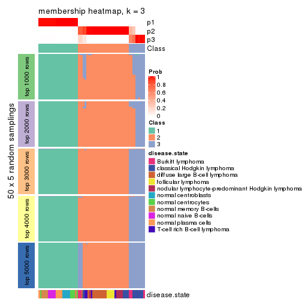</p>

</div>
<div id='tab-ATC-skmeans-membership-heatmap-3'>
<pre><code class="r">membership_heatmap(res, k = 4)
</code></pre>

<p></p>

</div>
<div id='tab-ATC-skmeans-membership-heatmap-4'>
<pre><code class="r">membership_heatmap(res, k = 5)
</code></pre>

<p></p>

</div>
<div id='tab-ATC-skmeans-membership-heatmap-5'>
<pre><code class="r">membership_heatmap(res, k = 6)
</code></pre>

<p></p>

</div>
</div>

As soon as we have had the classes for columns, we can look for signatures
which are significantly different between classes which can be candidate marks
for certain classes. Following are the heatmaps for signatures.


Signature heatmaps where rows are scaled:


<script>
$( function() {
	$( '#tabs-ATC-skmeans-get-signatures' ).tabs();
} );
</script>
<div id='tabs-ATC-skmeans-get-signatures'>
<ul>
<li><a href='#tab-ATC-skmeans-get-signatures-1'>k = 2</a></li>
<li><a href='#tab-ATC-skmeans-get-signatures-2'>k = 3</a></li>
<li><a href='#tab-ATC-skmeans-get-signatures-3'>k = 4</a></li>
<li><a href='#tab-ATC-skmeans-get-signatures-4'>k = 5</a></li>
<li><a href='#tab-ATC-skmeans-get-signatures-5'>k = 6</a></li>
</ul>
<div id='tab-ATC-skmeans-get-signatures-1'>
<pre><code class="r">get_signatures(res, k = 2)
</code></pre>

<p></p>

</div>
<div id='tab-ATC-skmeans-get-signatures-2'>
<pre><code class="r">get_signatures(res, k = 3)
</code></pre>

<p></p>

</div>
<div id='tab-ATC-skmeans-get-signatures-3'>
<pre><code class="r">get_signatures(res, k = 4)
</code></pre>

<p></p>

</div>
<div id='tab-ATC-skmeans-get-signatures-4'>
<pre><code class="r">get_signatures(res, k = 5)
</code></pre>

<p></p>

</div>
<div id='tab-ATC-skmeans-get-signatures-5'>
<pre><code class="r">get_signatures(res, k = 6)
</code></pre>

<p></p>

</div>
</div>


Signature heatmaps where rows are not scaled:


<script>
$( function() {
	$( '#tabs-ATC-skmeans-get-signatures-no-scale' ).tabs();
} );
</script>
<div id='tabs-ATC-skmeans-get-signatures-no-scale'>
<ul>
<li><a href='#tab-ATC-skmeans-get-signatures-no-scale-1'>k = 2</a></li>
<li><a href='#tab-ATC-skmeans-get-signatures-no-scale-2'>k = 3</a></li>
<li><a href='#tab-ATC-skmeans-get-signatures-no-scale-3'>k = 4</a></li>
<li><a href='#tab-ATC-skmeans-get-signatures-no-scale-4'>k = 5</a></li>
<li><a href='#tab-ATC-skmeans-get-signatures-no-scale-5'>k = 6</a></li>
</ul>
<div id='tab-ATC-skmeans-get-signatures-no-scale-1'>
<pre><code class="r">get_signatures(res, k = 2, scale_rows = FALSE)
</code></pre>

<p></p>

</div>
<div id='tab-ATC-skmeans-get-signatures-no-scale-2'>
<pre><code class="r">get_signatures(res, k = 3, scale_rows = FALSE)
</code></pre>

<p></p>

</div>
<div id='tab-ATC-skmeans-get-signatures-no-scale-3'>
<pre><code class="r">get_signatures(res, k = 4, scale_rows = FALSE)
</code></pre>

<p></p>

</div>
<div id='tab-ATC-skmeans-get-signatures-no-scale-4'>
<pre><code class="r">get_signatures(res, k = 5, scale_rows = FALSE)
</code></pre>

<p></p>

</div>
<div id='tab-ATC-skmeans-get-signatures-no-scale-5'>
<pre><code class="r">get_signatures(res, k = 6, scale_rows = FALSE)
</code></pre>

<p></p>

</div>
</div>


Compare the overlap of signatures from different k:

```r
compare_signatures(res)
```

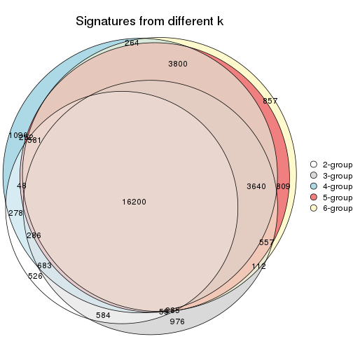

`get_signature()` returns a data frame invisibly. TO get the list of signatures, the function
call should be assigned to a variable explicitly. In following code, if `plot` argument is set
to `FALSE`, no heatmap is plotted while only the differential analysis is performed.

```r
# code only for demonstration
tb = get_signature(res, k = ..., plot = FALSE)
```

An example of the output of `tb` is:

```
#>   which_row         fdr    mean_1    mean_2 scaled_mean_1 scaled_mean_2 km
#> 1        38 0.042760348  8.373488  9.131774    -0.5533452     0.5164555  1
#> 2        40 0.018707592  7.106213  8.469186    -0.6173731     0.5762149  1
#> 3        55 0.019134737 10.221463 11.207825    -0.6159697     0.5749050  1
#> 4        59 0.006059896  5.921854  7.869574    -0.6899429     0.6439467  1
#> 5        60 0.018055526  8.928898 10.211722    -0.6204761     0.5791110  1
#> 6        98 0.009384629 15.714769 14.887706     0.6635654    -0.6193277  2
...
```

The columns in `tb` are:

1. `which_row`: row indices corresponding to the input matrix.
2. `fdr`: FDR for the differential test. 
3. `mean_x`: The mean value in group x.
4. `scaled_mean_x`: The mean value in group x after rows are scaled.
5. `km`: Row groups if k-means clustering is applied to rows.


UMAP plot which shows how samples are separated.


<script>
$( function() {
	$( '#tabs-ATC-skmeans-dimension-reduction' ).tabs();
} );
</script>
<div id='tabs-ATC-skmeans-dimension-reduction'>
<ul>
<li><a href='#tab-ATC-skmeans-dimension-reduction-1'>k = 2</a></li>
<li><a href='#tab-ATC-skmeans-dimension-reduction-2'>k = 3</a></li>
<li><a href='#tab-ATC-skmeans-dimension-reduction-3'>k = 4</a></li>
<li><a href='#tab-ATC-skmeans-dimension-reduction-4'>k = 5</a></li>
<li><a href='#tab-ATC-skmeans-dimension-reduction-5'>k = 6</a></li>
</ul>
<div id='tab-ATC-skmeans-dimension-reduction-1'>
<pre><code class="r">dimension_reduction(res, k = 2, method = &quot;UMAP&quot;)
</code></pre>

<p></p>

</div>
<div id='tab-ATC-skmeans-dimension-reduction-2'>
<pre><code class="r">dimension_reduction(res, k = 3, method = &quot;UMAP&quot;)
</code></pre>

<p></p>

</div>
<div id='tab-ATC-skmeans-dimension-reduction-3'>
<pre><code class="r">dimension_reduction(res, k = 4, method = &quot;UMAP&quot;)
</code></pre>

<p></p>

</div>
<div id='tab-ATC-skmeans-dimension-reduction-4'>
<pre><code class="r">dimension_reduction(res, k = 5, method = &quot;UMAP&quot;)
</code></pre>

<p></p>

</div>
<div id='tab-ATC-skmeans-dimension-reduction-5'>
<pre><code class="r">dimension_reduction(res, k = 6, method = &quot;UMAP&quot;)
</code></pre>

<p></p>

</div>
</div>


Following heatmap shows how subgroups are split when increasing `k`:

```r
collect_classes(res)
```


Test correlation between subgroups and known annotations. If the known
annotation is numeric, one-way ANOVA test is applied, and if the known
annotation is discrete, chi-squared contingency table test is applied.

```r
test_to_known_factors(res)
```

```
#>              n disease.state(p) k
#> ATC:skmeans 67         9.63e-09 2
#> ATC:skmeans 67         3.11e-12 3
#> ATC:skmeans 62         3.29e-12 4
#> ATC:skmeans 57         2.08e-12 5
#> ATC:skmeans 60         4.69e-12 6
```


If matrix rows can be associated to genes, consider to use `GO_Enrichment(res,
...)` to perform function enrichment for the signature genes.


 

---------------------------------------------------


### ATC:pam**


The object with results only for a single top-value method and a single partition method 
can be extracted as:

```r
res = res_list["ATC", "pam"]
# you can also extract it by
# res = res_list["ATC:pam"]
```

A summary of `res` and all the functions that can be applied to it:

```r
res
```

```
#> A 'ConsensusPartition' object with k = 2, 3, 4, 5, 6.
#>   On a matrix with 51941 rows and 67 columns.
#>   Top rows (1000, 2000, 3000, 4000, 5000) are extracted by 'ATC' method.
#>   Subgroups are detected by 'pam' method.
#>   Performed in total 1250 partitions by row resampling.
#>   Best k for subgroups seems to be 2.
#> 
#> Following methods can be applied to this 'ConsensusPartition' object:
#>  [1] "cola_report"             "collect_classes"         "collect_plots"          
#>  [4] "collect_stats"           "colnames"                "compare_signatures"     
#>  [7] "consensus_heatmap"       "dimension_reduction"     "functional_enrichment"  
#> [10] "get_anno_col"            "get_anno"                "get_classes"            
#> [13] "get_consensus"           "get_matrix"              "get_membership"         
#> [16] "get_param"               "get_signatures"          "get_stats"              
#> [19] "is_best_k"               "is_stable_k"             "membership_heatmap"     
#> [22] "ncol"                    "nrow"                    "plot_ecdf"              
#> [25] "rownames"                "select_partition_number" "show"                   
#> [28] "suggest_best_k"          "test_to_known_factors"
```

`collect_plots()` function collects all the plots made from `res` for all `k` (number of partitions)
into one single page to provide an easy and fast comparison between different `k`.

```r
collect_plots(res)
```


The plots are:

- The first row: a plot of the ECDF (Empirical cumulative distribution
  function) curves of the consensus matrix for each `k` and the heatmap of
  predicted classes for each `k`.
- The second row: heatmaps of the consensus matrix for each `k`.
- The third row: heatmaps of the membership matrix for each `k`.
- The fouth row: heatmaps of the signatures for each `k`.

All the plots in panels can be made by individual functions and they are
plotted later in this section.

`select_partition_number()` produces several plots showing different
statistics for choosing "optimized" `k`. There are following statistics:

- ECDF curves of the consensus matrix for each `k`;
- 1-PAC. [The PAC
  score](https://en.wikipedia.org/wiki/Consensus_clustering#Over-interpretation_potential_of_consensus_clustering)
  measures the proportion of the ambiguous subgrouping.
- Mean silhouette score.
- Concordance. The mean probability of fiting the consensus class ids in all
  partitions.
- Area increased. Denote $A_k$ as the area under the ECDF curve for current
  `k`, the area increased is defined as $A_k - A_{k-1}$.
- Rand index. The percent of pairs of samples that are both in a same cluster
  or both are not in a same cluster in the partition of k and k-1.
- Jaccard index. The ratio of pairs of samples are both in a same cluster in
  the partition of k and k-1 and the pairs of samples are both in a same
  cluster in the partition k or k-1.

The detailed explanations of these statistics can be found in [the cola
vignette](http://bioconductor.org/packages/devel/bioc/vignettes/cola/inst/doc/cola.html#toc_13).

Generally speaking, lower PAC score, higher mean silhouette score or higher
concordance corresponds to better partition. Rand index and Jaccard index
measure how similar the current partition is compared to partition with `k-1`.
If they are too similar, we won't accept `k` is better than `k-1`.

```r
select_partition_number(res)
```


The numeric values for all these statistics can be obtained by `get_stats()`.

```r
get_stats(res)
```

```
#>   k 1-PAC mean_silhouette concordance area_increased  Rand Jaccard
#> 2 2 1.000           0.974       0.990         0.4830 0.518   0.518
#> 3 3 0.744           0.886       0.876         0.2207 0.931   0.866
#> 4 4 0.792           0.781       0.896         0.2137 0.852   0.673
#> 5 5 0.805           0.847       0.906         0.0652 0.888   0.665
#> 6 6 0.806           0.805       0.830         0.0516 0.967   0.869
```

`suggest_best_k()` suggests the best $k$ based on these statistics. The rules are as follows:

- All $k$ with Jaccard index larger than 0.95 are removed because the increase of
  the partition number does not provides enough extra information. If all $k$ are removed,
  the best $k$ is assigned by `NA`.
- For $k$ with 1-PAC larger than 0.9, the maximal $k$ is taken as the "best k". Other $k$ is called "optional k".
- If it does not fit the second rule. The $k$ with the highest vote of highest
  1-PAC, mean silhouette and concordance is taken as the "best k".

```r
suggest_best_k(res)
```

```
#> [1] 2
```


Following shows the table of the partitions (You need to click the **show/hide
code output** link to see it). The membership matrix (columns with name `p*`)
is inferred by
[`clue::cl_consensus()`](https://www.rdocumentation.org/link/cl_consensus?package=clue)
function with the `SE` method. Basically the value in the membership matrix
represents the probability to belong to a certain group. The finall class
label for an item is determined with the group with highest probability it
belongs to.

In `get_classes()` function, the entropy is calculated from the membership
matrix and the silhouette score is calculated from the consensus matrix.


<script>
$( function() {
	$( '#tabs-ATC-pam-get-classes' ).tabs();
} );
</script>
<div id='tabs-ATC-pam-get-classes'>
<ul>
<li><a href='#tab-ATC-pam-get-classes-1'>k = 2</a></li>
<li><a href='#tab-ATC-pam-get-classes-2'>k = 3</a></li>
<li><a href='#tab-ATC-pam-get-classes-3'>k = 4</a></li>
<li><a href='#tab-ATC-pam-get-classes-4'>k = 5</a></li>
<li><a href='#tab-ATC-pam-get-classes-5'>k = 6</a></li>
</ul>

<div id='tab-ATC-pam-get-classes-1'>
<p><a id='tab-ATC-pam-get-classes-1-a' style='color:#0366d6' href='#'>show/hide code output</a></p>
<pre><code class="r">cbind(get_classes(res, k = 2), get_membership(res, k = 2))
</code></pre>

<pre><code>#&gt;           class entropy silhouette    p1    p2
#&gt; GSM312811     2   0.000      0.990 0.000 1.000
#&gt; GSM312812     2   0.000      0.990 0.000 1.000
#&gt; GSM312813     2   0.000      0.990 0.000 1.000
#&gt; GSM312814     2   0.000      0.990 0.000 1.000
#&gt; GSM312815     2   0.000      0.990 0.000 1.000
#&gt; GSM312816     2   0.000      0.990 0.000 1.000
#&gt; GSM312817     2   0.000      0.990 0.000 1.000
#&gt; GSM312818     1   0.871      0.579 0.708 0.292
#&gt; GSM312819     2   0.000      0.990 0.000 1.000
#&gt; GSM312820     2   0.000      0.990 0.000 1.000
#&gt; GSM312821     2   0.961      0.360 0.384 0.616
#&gt; GSM312822     2   0.000      0.990 0.000 1.000
#&gt; GSM312823     2   0.000      0.990 0.000 1.000
#&gt; GSM312824     2   0.000      0.990 0.000 1.000
#&gt; GSM312825     2   0.000      0.990 0.000 1.000
#&gt; GSM312826     2   0.000      0.990 0.000 1.000
#&gt; GSM312839     2   0.000      0.990 0.000 1.000
#&gt; GSM312840     2   0.000      0.990 0.000 1.000
#&gt; GSM312841     2   0.000      0.990 0.000 1.000
#&gt; GSM312843     2   0.000      0.990 0.000 1.000
#&gt; GSM312844     2   0.000      0.990 0.000 1.000
#&gt; GSM312845     2   0.000      0.990 0.000 1.000
#&gt; GSM312846     2   0.000      0.990 0.000 1.000
#&gt; GSM312847     2   0.000      0.990 0.000 1.000
#&gt; GSM312848     2   0.000      0.990 0.000 1.000
#&gt; GSM312849     2   0.000      0.990 0.000 1.000
#&gt; GSM312851     2   0.000      0.990 0.000 1.000
#&gt; GSM312853     2   0.000      0.990 0.000 1.000
#&gt; GSM312854     2   0.000      0.990 0.000 1.000
#&gt; GSM312856     2   0.000      0.990 0.000 1.000
#&gt; GSM312857     2   0.000      0.990 0.000 1.000
#&gt; GSM312858     2   0.000      0.990 0.000 1.000
#&gt; GSM312859     2   0.000      0.990 0.000 1.000
#&gt; GSM312860     2   0.000      0.990 0.000 1.000
#&gt; GSM312861     2   0.000      0.990 0.000 1.000
#&gt; GSM312862     2   0.000      0.990 0.000 1.000
#&gt; GSM312863     2   0.000      0.990 0.000 1.000
#&gt; GSM312864     2   0.000      0.990 0.000 1.000
#&gt; GSM312865     2   0.000      0.990 0.000 1.000
#&gt; GSM312867     2   0.000      0.990 0.000 1.000
#&gt; GSM312868     2   0.000      0.990 0.000 1.000
#&gt; GSM312869     2   0.000      0.990 0.000 1.000
#&gt; GSM312870     1   0.000      0.988 1.000 0.000
#&gt; GSM312872     1   0.000      0.988 1.000 0.000
#&gt; GSM312874     1   0.000      0.988 1.000 0.000
#&gt; GSM312875     1   0.000      0.988 1.000 0.000
#&gt; GSM312876     1   0.000      0.988 1.000 0.000
#&gt; GSM312877     1   0.000      0.988 1.000 0.000
#&gt; GSM312879     1   0.000      0.988 1.000 0.000
#&gt; GSM312882     1   0.000      0.988 1.000 0.000
#&gt; GSM312883     1   0.000      0.988 1.000 0.000
#&gt; GSM312886     1   0.000      0.988 1.000 0.000
#&gt; GSM312887     1   0.000      0.988 1.000 0.000
#&gt; GSM312890     1   0.000      0.988 1.000 0.000
#&gt; GSM312893     1   0.000      0.988 1.000 0.000
#&gt; GSM312894     1   0.000      0.988 1.000 0.000
#&gt; GSM312895     1   0.000      0.988 1.000 0.000
#&gt; GSM312937     1   0.000      0.988 1.000 0.000
#&gt; GSM312938     1   0.000      0.988 1.000 0.000
#&gt; GSM312939     1   0.000      0.988 1.000 0.000
#&gt; GSM312940     1   0.000      0.988 1.000 0.000
#&gt; GSM312941     1   0.000      0.988 1.000 0.000
#&gt; GSM312942     1   0.000      0.988 1.000 0.000
#&gt; GSM312943     1   0.000      0.988 1.000 0.000
#&gt; GSM312944     1   0.000      0.988 1.000 0.000
#&gt; GSM312945     1   0.000      0.988 1.000 0.000
#&gt; GSM312946     1   0.000      0.988 1.000 0.000
</code></pre>

<script>
$('#tab-ATC-pam-get-classes-1-a').parent().next().next().hide();
$('#tab-ATC-pam-get-classes-1-a').click(function(){
  $('#tab-ATC-pam-get-classes-1-a').parent().next().next().toggle();
  return(false);
});
</script>
</div>

<div id='tab-ATC-pam-get-classes-2'>
<p><a id='tab-ATC-pam-get-classes-2-a' style='color:#0366d6' href='#'>show/hide code output</a></p>
<pre><code class="r">cbind(get_classes(res, k = 3), get_membership(res, k = 3))
</code></pre>

<pre><code>#&gt;           class entropy silhouette    p1    p2    p3
#&gt; GSM312811     2   0.553      0.834 0.296 0.704 0.000
#&gt; GSM312812     2   0.186      0.857 0.052 0.948 0.000
#&gt; GSM312813     2   0.000      0.856 0.000 1.000 0.000
#&gt; GSM312814     2   0.553      0.834 0.296 0.704 0.000
#&gt; GSM312815     2   0.553      0.834 0.296 0.704 0.000
#&gt; GSM312816     2   0.553      0.834 0.296 0.704 0.000
#&gt; GSM312817     2   0.000      0.856 0.000 1.000 0.000
#&gt; GSM312818     3   0.553      0.562 0.296 0.000 0.704
#&gt; GSM312819     2   0.000      0.856 0.000 1.000 0.000
#&gt; GSM312820     2   0.553      0.834 0.296 0.704 0.000
#&gt; GSM312821     2   0.821      0.735 0.296 0.600 0.104
#&gt; GSM312822     2   0.553      0.834 0.296 0.704 0.000
#&gt; GSM312823     2   0.553      0.834 0.296 0.704 0.000
#&gt; GSM312824     2   0.543      0.837 0.284 0.716 0.000
#&gt; GSM312825     2   0.175      0.857 0.048 0.952 0.000
#&gt; GSM312826     2   0.000      0.856 0.000 1.000 0.000
#&gt; GSM312839     2   0.553      0.834 0.296 0.704 0.000
#&gt; GSM312840     2   0.141      0.857 0.036 0.964 0.000
#&gt; GSM312841     2   0.553      0.834 0.296 0.704 0.000
#&gt; GSM312843     2   0.553      0.834 0.296 0.704 0.000
#&gt; GSM312844     2   0.553      0.834 0.296 0.704 0.000
#&gt; GSM312845     2   0.000      0.856 0.000 1.000 0.000
#&gt; GSM312846     2   0.553      0.834 0.296 0.704 0.000
#&gt; GSM312847     2   0.000      0.856 0.000 1.000 0.000
#&gt; GSM312848     2   0.000      0.856 0.000 1.000 0.000
#&gt; GSM312849     2   0.000      0.856 0.000 1.000 0.000
#&gt; GSM312851     2   0.553      0.834 0.296 0.704 0.000
#&gt; GSM312853     2   0.553      0.834 0.296 0.704 0.000
#&gt; GSM312854     2   0.000      0.856 0.000 1.000 0.000
#&gt; GSM312856     2   0.510      0.838 0.248 0.752 0.000
#&gt; GSM312857     2   0.543      0.836 0.284 0.716 0.000
#&gt; GSM312858     2   0.000      0.856 0.000 1.000 0.000
#&gt; GSM312859     2   0.000      0.856 0.000 1.000 0.000
#&gt; GSM312860     2   0.000      0.856 0.000 1.000 0.000
#&gt; GSM312861     2   0.000      0.856 0.000 1.000 0.000
#&gt; GSM312862     2   0.553      0.834 0.296 0.704 0.000
#&gt; GSM312863     2   0.000      0.856 0.000 1.000 0.000
#&gt; GSM312864     2   0.245      0.857 0.076 0.924 0.000
#&gt; GSM312865     2   0.000      0.856 0.000 1.000 0.000
#&gt; GSM312867     2   0.000      0.856 0.000 1.000 0.000
#&gt; GSM312868     2   0.000      0.856 0.000 1.000 0.000
#&gt; GSM312869     2   0.000      0.856 0.000 1.000 0.000
#&gt; GSM312870     3   0.000      0.930 0.000 0.000 1.000
#&gt; GSM312872     3   0.000      0.930 0.000 0.000 1.000
#&gt; GSM312874     3   0.000      0.930 0.000 0.000 1.000
#&gt; GSM312875     3   0.000      0.930 0.000 0.000 1.000
#&gt; GSM312876     3   0.000      0.930 0.000 0.000 1.000
#&gt; GSM312877     1   0.553      0.991 0.704 0.000 0.296
#&gt; GSM312879     3   0.000      0.930 0.000 0.000 1.000
#&gt; GSM312882     3   0.000      0.930 0.000 0.000 1.000
#&gt; GSM312883     1   0.573      0.962 0.676 0.000 0.324
#&gt; GSM312886     3   0.000      0.930 0.000 0.000 1.000
#&gt; GSM312887     1   0.586      0.935 0.656 0.000 0.344
#&gt; GSM312890     1   0.553      0.991 0.704 0.000 0.296
#&gt; GSM312893     1   0.553      0.991 0.704 0.000 0.296
#&gt; GSM312894     1   0.553      0.991 0.704 0.000 0.296
#&gt; GSM312895     1   0.553      0.991 0.704 0.000 0.296
#&gt; GSM312937     1   0.553      0.991 0.704 0.000 0.296
#&gt; GSM312938     1   0.553      0.991 0.704 0.000 0.296
#&gt; GSM312939     1   0.553      0.991 0.704 0.000 0.296
#&gt; GSM312940     1   0.553      0.991 0.704 0.000 0.296
#&gt; GSM312941     1   0.553      0.991 0.704 0.000 0.296
#&gt; GSM312942     1   0.573      0.962 0.676 0.000 0.324
#&gt; GSM312943     1   0.553      0.991 0.704 0.000 0.296
#&gt; GSM312944     1   0.553      0.991 0.704 0.000 0.296
#&gt; GSM312945     1   0.553      0.991 0.704 0.000 0.296
#&gt; GSM312946     1   0.553      0.991 0.704 0.000 0.296
</code></pre>

<script>
$('#tab-ATC-pam-get-classes-2-a').parent().next().next().hide();
$('#tab-ATC-pam-get-classes-2-a').click(function(){
  $('#tab-ATC-pam-get-classes-2-a').parent().next().next().toggle();
  return(false);
});
</script>
</div>

<div id='tab-ATC-pam-get-classes-3'>
<p><a id='tab-ATC-pam-get-classes-3-a' style='color:#0366d6' href='#'>show/hide code output</a></p>
<pre><code class="r">cbind(get_classes(res, k = 4), get_membership(res, k = 4))
</code></pre>

<pre><code>#&gt;           class entropy silhouette p1    p2    p3    p4
#&gt; GSM312811     4  0.4916      0.860  0 0.424 0.000 0.576
#&gt; GSM312812     2  0.3688      0.674  0 0.792 0.000 0.208
#&gt; GSM312813     2  0.4916      0.762  0 0.576 0.000 0.424
#&gt; GSM312814     2  0.4972     -0.726  0 0.544 0.000 0.456
#&gt; GSM312815     2  0.0000      0.521  0 1.000 0.000 0.000
#&gt; GSM312816     4  0.4916      0.860  0 0.424 0.000 0.576
#&gt; GSM312817     2  0.4916      0.762  0 0.576 0.000 0.424
#&gt; GSM312818     4  0.5080      0.858  0 0.420 0.004 0.576
#&gt; GSM312819     2  0.4916      0.762  0 0.576 0.000 0.424
#&gt; GSM312820     4  0.4916      0.860  0 0.424 0.000 0.576
#&gt; GSM312821     4  0.4916      0.860  0 0.424 0.000 0.576
#&gt; GSM312822     2  0.3837     -0.137  0 0.776 0.000 0.224
#&gt; GSM312823     2  0.0000      0.521  0 1.000 0.000 0.000
#&gt; GSM312824     2  0.0469      0.532  0 0.988 0.000 0.012
#&gt; GSM312825     2  0.3837      0.683  0 0.776 0.000 0.224
#&gt; GSM312826     2  0.4916      0.762  0 0.576 0.000 0.424
#&gt; GSM312839     2  0.0000      0.521  0 1.000 0.000 0.000
#&gt; GSM312840     2  0.3801      0.681  0 0.780 0.000 0.220
#&gt; GSM312841     2  0.0000      0.521  0 1.000 0.000 0.000
#&gt; GSM312843     2  0.0000      0.521  0 1.000 0.000 0.000
#&gt; GSM312844     2  0.0000      0.521  0 1.000 0.000 0.000
#&gt; GSM312845     2  0.4916      0.762  0 0.576 0.000 0.424
#&gt; GSM312846     2  0.0000      0.521  0 1.000 0.000 0.000
#&gt; GSM312847     2  0.4916      0.762  0 0.576 0.000 0.424
#&gt; GSM312848     2  0.4916      0.762  0 0.576 0.000 0.424
#&gt; GSM312849     2  0.4916      0.762  0 0.576 0.000 0.424
#&gt; GSM312851     4  0.4916      0.860  0 0.424 0.000 0.576
#&gt; GSM312853     4  0.4916      0.860  0 0.424 0.000 0.576
#&gt; GSM312854     4  0.0000      0.379  0 0.000 0.000 1.000
#&gt; GSM312856     4  0.3726      0.701  0 0.212 0.000 0.788
#&gt; GSM312857     4  0.4406      0.787  0 0.300 0.000 0.700
#&gt; GSM312858     2  0.4916      0.762  0 0.576 0.000 0.424
#&gt; GSM312859     2  0.4916      0.762  0 0.576 0.000 0.424
#&gt; GSM312860     2  0.4916      0.762  0 0.576 0.000 0.424
#&gt; GSM312861     2  0.4916      0.762  0 0.576 0.000 0.424
#&gt; GSM312862     2  0.0000      0.521  0 1.000 0.000 0.000
#&gt; GSM312863     2  0.4916      0.762  0 0.576 0.000 0.424
#&gt; GSM312864     4  0.3311      0.642  0 0.172 0.000 0.828
#&gt; GSM312865     2  0.4916      0.762  0 0.576 0.000 0.424
#&gt; GSM312867     2  0.4916      0.762  0 0.576 0.000 0.424
#&gt; GSM312868     2  0.4916      0.762  0 0.576 0.000 0.424
#&gt; GSM312869     2  0.4916      0.762  0 0.576 0.000 0.424
#&gt; GSM312870     3  0.0000      1.000  0 0.000 1.000 0.000
#&gt; GSM312872     3  0.0000      1.000  0 0.000 1.000 0.000
#&gt; GSM312874     3  0.0000      1.000  0 0.000 1.000 0.000
#&gt; GSM312875     3  0.0000      1.000  0 0.000 1.000 0.000
#&gt; GSM312876     3  0.0000      1.000  0 0.000 1.000 0.000
#&gt; GSM312877     1  0.0000      1.000  1 0.000 0.000 0.000
#&gt; GSM312879     3  0.0000      1.000  0 0.000 1.000 0.000
#&gt; GSM312882     3  0.0000      1.000  0 0.000 1.000 0.000
#&gt; GSM312883     1  0.0000      1.000  1 0.000 0.000 0.000
#&gt; GSM312886     3  0.0000      1.000  0 0.000 1.000 0.000
#&gt; GSM312887     1  0.0000      1.000  1 0.000 0.000 0.000
#&gt; GSM312890     1  0.0000      1.000  1 0.000 0.000 0.000
#&gt; GSM312893     1  0.0000      1.000  1 0.000 0.000 0.000
#&gt; GSM312894     1  0.0000      1.000  1 0.000 0.000 0.000
#&gt; GSM312895     1  0.0000      1.000  1 0.000 0.000 0.000
#&gt; GSM312937     1  0.0000      1.000  1 0.000 0.000 0.000
#&gt; GSM312938     1  0.0000      1.000  1 0.000 0.000 0.000
#&gt; GSM312939     1  0.0000      1.000  1 0.000 0.000 0.000
#&gt; GSM312940     1  0.0000      1.000  1 0.000 0.000 0.000
#&gt; GSM312941     1  0.0000      1.000  1 0.000 0.000 0.000
#&gt; GSM312942     1  0.0000      1.000  1 0.000 0.000 0.000
#&gt; GSM312943     1  0.0000      1.000  1 0.000 0.000 0.000
#&gt; GSM312944     1  0.0000      1.000  1 0.000 0.000 0.000
#&gt; GSM312945     1  0.0000      1.000  1 0.000 0.000 0.000
#&gt; GSM312946     1  0.0000      1.000  1 0.000 0.000 0.000
</code></pre>

<script>
$('#tab-ATC-pam-get-classes-3-a').parent().next().next().hide();
$('#tab-ATC-pam-get-classes-3-a').click(function(){
  $('#tab-ATC-pam-get-classes-3-a').parent().next().next().toggle();
  return(false);
});
</script>
</div>

<div id='tab-ATC-pam-get-classes-4'>
<p><a id='tab-ATC-pam-get-classes-4-a' style='color:#0366d6' href='#'>show/hide code output</a></p>
<pre><code class="r">cbind(get_classes(res, k = 5), get_membership(res, k = 5))
</code></pre>

<pre><code>#&gt;           class entropy silhouette    p1    p2 p3    p4    p5
#&gt; GSM312811     4  0.0000      0.735 0.000 0.000  0 1.000 0.000
#&gt; GSM312812     2  0.3209      0.832 0.000 0.812  0 0.008 0.180
#&gt; GSM312813     2  0.0000      0.811 0.000 1.000  0 0.000 0.000
#&gt; GSM312814     4  0.3882      0.592 0.000 0.168  0 0.788 0.044
#&gt; GSM312815     2  0.5218      0.775 0.000 0.684  0 0.136 0.180
#&gt; GSM312816     4  0.2891      0.546 0.000 0.000  0 0.824 0.176
#&gt; GSM312817     4  0.3949      0.612 0.000 0.332  0 0.668 0.000
#&gt; GSM312818     5  0.3039      1.000 0.000 0.000  0 0.192 0.808
#&gt; GSM312819     4  0.3932      0.614 0.000 0.328  0 0.672 0.000
#&gt; GSM312820     5  0.3039      1.000 0.000 0.000  0 0.192 0.808
#&gt; GSM312821     5  0.3039      1.000 0.000 0.000  0 0.192 0.808
#&gt; GSM312822     4  0.5610      0.494 0.000 0.180  0 0.640 0.180
#&gt; GSM312823     2  0.5218      0.775 0.000 0.684  0 0.136 0.180
#&gt; GSM312824     2  0.4325      0.814 0.000 0.756  0 0.064 0.180
#&gt; GSM312825     2  0.3209      0.832 0.000 0.812  0 0.008 0.180
#&gt; GSM312826     2  0.2929      0.833 0.000 0.820  0 0.000 0.180
#&gt; GSM312839     2  0.5218      0.775 0.000 0.684  0 0.136 0.180
#&gt; GSM312840     2  0.3209      0.832 0.000 0.812  0 0.008 0.180
#&gt; GSM312841     2  0.5218      0.775 0.000 0.684  0 0.136 0.180
#&gt; GSM312843     4  0.3381      0.664 0.000 0.016  0 0.808 0.176
#&gt; GSM312844     2  0.5941      0.667 0.000 0.592  0 0.228 0.180
#&gt; GSM312845     2  0.2605      0.834 0.000 0.852  0 0.000 0.148
#&gt; GSM312846     2  0.5218      0.775 0.000 0.684  0 0.136 0.180
#&gt; GSM312847     2  0.0000      0.811 0.000 1.000  0 0.000 0.000
#&gt; GSM312848     2  0.2813      0.595 0.000 0.832  0 0.168 0.000
#&gt; GSM312849     2  0.0000      0.811 0.000 1.000  0 0.000 0.000
#&gt; GSM312851     4  0.0000      0.735 0.000 0.000  0 1.000 0.000
#&gt; GSM312853     4  0.0000      0.735 0.000 0.000  0 1.000 0.000
#&gt; GSM312854     4  0.0609      0.735 0.000 0.020  0 0.980 0.000
#&gt; GSM312856     4  0.3003      0.710 0.000 0.188  0 0.812 0.000
#&gt; GSM312857     4  0.0000      0.735 0.000 0.000  0 1.000 0.000
#&gt; GSM312858     2  0.0000      0.811 0.000 1.000  0 0.000 0.000
#&gt; GSM312859     2  0.0000      0.811 0.000 1.000  0 0.000 0.000
#&gt; GSM312860     2  0.0000      0.811 0.000 1.000  0 0.000 0.000
#&gt; GSM312861     2  0.0000      0.811 0.000 1.000  0 0.000 0.000
#&gt; GSM312862     2  0.5759      0.707 0.000 0.620  0 0.200 0.180
#&gt; GSM312863     4  0.3336      0.696 0.000 0.228  0 0.772 0.000
#&gt; GSM312864     4  0.0404      0.736 0.000 0.012  0 0.988 0.000
#&gt; GSM312865     2  0.0404      0.802 0.000 0.988  0 0.012 0.000
#&gt; GSM312867     2  0.0000      0.811 0.000 1.000  0 0.000 0.000
#&gt; GSM312868     4  0.4030      0.592 0.000 0.352  0 0.648 0.000
#&gt; GSM312869     2  0.2929      0.833 0.000 0.820  0 0.000 0.180
#&gt; GSM312870     3  0.0000      1.000 0.000 0.000  1 0.000 0.000
#&gt; GSM312872     3  0.0000      1.000 0.000 0.000  1 0.000 0.000
#&gt; GSM312874     3  0.0000      1.000 0.000 0.000  1 0.000 0.000
#&gt; GSM312875     3  0.0000      1.000 0.000 0.000  1 0.000 0.000
#&gt; GSM312876     3  0.0000      1.000 0.000 0.000  1 0.000 0.000
#&gt; GSM312877     1  0.0000      0.994 1.000 0.000  0 0.000 0.000
#&gt; GSM312879     3  0.0000      1.000 0.000 0.000  1 0.000 0.000
#&gt; GSM312882     3  0.0000      1.000 0.000 0.000  1 0.000 0.000
#&gt; GSM312883     1  0.0404      0.994 0.988 0.000  0 0.000 0.012
#&gt; GSM312886     3  0.0000      1.000 0.000 0.000  1 0.000 0.000
#&gt; GSM312887     1  0.0404      0.994 0.988 0.000  0 0.000 0.012
#&gt; GSM312890     1  0.0000      0.994 1.000 0.000  0 0.000 0.000
#&gt; GSM312893     1  0.0000      0.994 1.000 0.000  0 0.000 0.000
#&gt; GSM312894     1  0.0000      0.994 1.000 0.000  0 0.000 0.000
#&gt; GSM312895     1  0.0000      0.994 1.000 0.000  0 0.000 0.000
#&gt; GSM312937     1  0.0000      0.994 1.000 0.000  0 0.000 0.000
#&gt; GSM312938     1  0.0404      0.994 0.988 0.000  0 0.000 0.012
#&gt; GSM312939     1  0.0000      0.994 1.000 0.000  0 0.000 0.000
#&gt; GSM312940     1  0.0000      0.994 1.000 0.000  0 0.000 0.000
#&gt; GSM312941     1  0.0000      0.994 1.000 0.000  0 0.000 0.000
#&gt; GSM312942     1  0.0404      0.994 0.988 0.000  0 0.000 0.012
#&gt; GSM312943     1  0.0404      0.994 0.988 0.000  0 0.000 0.012
#&gt; GSM312944     1  0.0404      0.994 0.988 0.000  0 0.000 0.012
#&gt; GSM312945     1  0.0404      0.994 0.988 0.000  0 0.000 0.012
#&gt; GSM312946     1  0.0404      0.994 0.988 0.000  0 0.000 0.012
</code></pre>

<script>
$('#tab-ATC-pam-get-classes-4-a').parent().next().next().hide();
$('#tab-ATC-pam-get-classes-4-a').click(function(){
  $('#tab-ATC-pam-get-classes-4-a').parent().next().next().toggle();
  return(false);
});
</script>
</div>

<div id='tab-ATC-pam-get-classes-5'>
<p><a id='tab-ATC-pam-get-classes-5-a' style='color:#0366d6' href='#'>show/hide code output</a></p>
<pre><code class="r">cbind(get_classes(res, k = 6), get_membership(res, k = 6))
</code></pre>

<pre><code>#&gt;           class entropy silhouette    p1    p2    p3    p4    p5    p6
#&gt; GSM312811     4  0.0000      0.731 0.000 0.000 0.000 1.000 0.000 0.000
#&gt; GSM312812     2  0.0000      0.776 0.000 1.000 0.000 0.000 0.000 0.000
#&gt; GSM312813     2  0.3851      0.632 0.000 0.540 0.000 0.000 0.460 0.000
#&gt; GSM312814     4  0.3309      0.493 0.000 0.280 0.000 0.720 0.000 0.000
#&gt; GSM312815     2  0.0000      0.776 0.000 1.000 0.000 0.000 0.000 0.000
#&gt; GSM312816     4  0.3221      0.418 0.000 0.000 0.000 0.736 0.264 0.000
#&gt; GSM312817     4  0.3982      0.455 0.000 0.004 0.000 0.536 0.460 0.000
#&gt; GSM312818     5  0.5195      1.000 0.000 0.000 0.000 0.100 0.540 0.360
#&gt; GSM312819     4  0.3851      0.458 0.000 0.000 0.000 0.540 0.460 0.000
#&gt; GSM312820     5  0.5195      1.000 0.000 0.000 0.000 0.100 0.540 0.360
#&gt; GSM312821     5  0.5195      1.000 0.000 0.000 0.000 0.100 0.540 0.360
#&gt; GSM312822     4  0.3592      0.451 0.000 0.344 0.000 0.656 0.000 0.000
#&gt; GSM312823     2  0.0000      0.776 0.000 1.000 0.000 0.000 0.000 0.000
#&gt; GSM312824     2  0.0000      0.776 0.000 1.000 0.000 0.000 0.000 0.000
#&gt; GSM312825     2  0.0000      0.776 0.000 1.000 0.000 0.000 0.000 0.000
#&gt; GSM312826     2  0.0000      0.776 0.000 1.000 0.000 0.000 0.000 0.000
#&gt; GSM312839     2  0.0000      0.776 0.000 1.000 0.000 0.000 0.000 0.000
#&gt; GSM312840     2  0.0000      0.776 0.000 1.000 0.000 0.000 0.000 0.000
#&gt; GSM312841     2  0.0000      0.776 0.000 1.000 0.000 0.000 0.000 0.000
#&gt; GSM312843     4  0.1908      0.695 0.000 0.096 0.000 0.900 0.004 0.000
#&gt; GSM312844     2  0.2941      0.623 0.000 0.780 0.000 0.220 0.000 0.000
#&gt; GSM312845     2  0.0632      0.773 0.000 0.976 0.000 0.000 0.024 0.000
#&gt; GSM312846     2  0.0000      0.776 0.000 1.000 0.000 0.000 0.000 0.000
#&gt; GSM312847     2  0.3851      0.632 0.000 0.540 0.000 0.000 0.460 0.000
#&gt; GSM312848     2  0.5858      0.348 0.000 0.484 0.000 0.244 0.272 0.000
#&gt; GSM312849     2  0.2527      0.738 0.000 0.832 0.000 0.000 0.168 0.000
#&gt; GSM312851     4  0.0000      0.731 0.000 0.000 0.000 1.000 0.000 0.000
#&gt; GSM312853     4  0.0000      0.731 0.000 0.000 0.000 1.000 0.000 0.000
#&gt; GSM312854     4  0.0000      0.731 0.000 0.000 0.000 1.000 0.000 0.000
#&gt; GSM312856     4  0.1814      0.714 0.000 0.000 0.000 0.900 0.100 0.000
#&gt; GSM312857     4  0.0000      0.731 0.000 0.000 0.000 1.000 0.000 0.000
#&gt; GSM312858     2  0.3851      0.632 0.000 0.540 0.000 0.000 0.460 0.000
#&gt; GSM312859     2  0.3851      0.632 0.000 0.540 0.000 0.000 0.460 0.000
#&gt; GSM312860     2  0.3851      0.632 0.000 0.540 0.000 0.000 0.460 0.000
#&gt; GSM312861     2  0.3851      0.632 0.000 0.540 0.000 0.000 0.460 0.000
#&gt; GSM312862     2  0.2378      0.691 0.000 0.848 0.000 0.152 0.000 0.000
#&gt; GSM312863     4  0.2697      0.673 0.000 0.000 0.000 0.812 0.188 0.000
#&gt; GSM312864     4  0.0000      0.731 0.000 0.000 0.000 1.000 0.000 0.000
#&gt; GSM312865     2  0.4589      0.589 0.000 0.504 0.000 0.036 0.460 0.000
#&gt; GSM312867     2  0.3782      0.652 0.000 0.588 0.000 0.000 0.412 0.000
#&gt; GSM312868     4  0.3982      0.455 0.000 0.004 0.000 0.536 0.460 0.000
#&gt; GSM312869     2  0.0000      0.776 0.000 1.000 0.000 0.000 0.000 0.000
#&gt; GSM312870     3  0.0000      0.999 0.000 0.000 1.000 0.000 0.000 0.000
#&gt; GSM312872     3  0.0000      0.999 0.000 0.000 1.000 0.000 0.000 0.000
#&gt; GSM312874     3  0.0000      0.999 0.000 0.000 1.000 0.000 0.000 0.000
#&gt; GSM312875     3  0.0000      0.999 0.000 0.000 1.000 0.000 0.000 0.000
#&gt; GSM312876     3  0.0000      0.999 0.000 0.000 1.000 0.000 0.000 0.000
#&gt; GSM312877     1  0.0000      1.000 1.000 0.000 0.000 0.000 0.000 0.000
#&gt; GSM312879     3  0.0000      0.999 0.000 0.000 1.000 0.000 0.000 0.000
#&gt; GSM312882     3  0.0000      0.999 0.000 0.000 1.000 0.000 0.000 0.000
#&gt; GSM312883     6  0.3647      0.999 0.360 0.000 0.000 0.000 0.000 0.640
#&gt; GSM312886     3  0.0146      0.995 0.000 0.000 0.996 0.000 0.000 0.004
#&gt; GSM312887     6  0.3647      0.999 0.360 0.000 0.000 0.000 0.000 0.640
#&gt; GSM312890     1  0.0000      1.000 1.000 0.000 0.000 0.000 0.000 0.000
#&gt; GSM312893     1  0.0000      1.000 1.000 0.000 0.000 0.000 0.000 0.000
#&gt; GSM312894     1  0.0000      1.000 1.000 0.000 0.000 0.000 0.000 0.000
#&gt; GSM312895     1  0.0000      1.000 1.000 0.000 0.000 0.000 0.000 0.000
#&gt; GSM312937     1  0.0000      1.000 1.000 0.000 0.000 0.000 0.000 0.000
#&gt; GSM312938     6  0.3659      0.994 0.364 0.000 0.000 0.000 0.000 0.636
#&gt; GSM312939     1  0.0000      1.000 1.000 0.000 0.000 0.000 0.000 0.000
#&gt; GSM312940     1  0.0000      1.000 1.000 0.000 0.000 0.000 0.000 0.000
#&gt; GSM312941     1  0.0000      1.000 1.000 0.000 0.000 0.000 0.000 0.000
#&gt; GSM312942     6  0.3647      0.999 0.360 0.000 0.000 0.000 0.000 0.640
#&gt; GSM312943     6  0.3647      0.999 0.360 0.000 0.000 0.000 0.000 0.640
#&gt; GSM312944     6  0.3647      0.999 0.360 0.000 0.000 0.000 0.000 0.640
#&gt; GSM312945     6  0.3647      0.999 0.360 0.000 0.000 0.000 0.000 0.640
#&gt; GSM312946     6  0.3647      0.999 0.360 0.000 0.000 0.000 0.000 0.640
</code></pre>

<script>
$('#tab-ATC-pam-get-classes-5-a').parent().next().next().hide();
$('#tab-ATC-pam-get-classes-5-a').click(function(){
  $('#tab-ATC-pam-get-classes-5-a').parent().next().next().toggle();
  return(false);
});
</script>
</div>
</div>

Heatmaps for the consensus matrix. It visualizes the probability of two
samples to be in a same group.


<script>
$( function() {
	$( '#tabs-ATC-pam-consensus-heatmap' ).tabs();
} );
</script>
<div id='tabs-ATC-pam-consensus-heatmap'>
<ul>
<li><a href='#tab-ATC-pam-consensus-heatmap-1'>k = 2</a></li>
<li><a href='#tab-ATC-pam-consensus-heatmap-2'>k = 3</a></li>
<li><a href='#tab-ATC-pam-consensus-heatmap-3'>k = 4</a></li>
<li><a href='#tab-ATC-pam-consensus-heatmap-4'>k = 5</a></li>
<li><a href='#tab-ATC-pam-consensus-heatmap-5'>k = 6</a></li>
</ul>
<div id='tab-ATC-pam-consensus-heatmap-1'>
<pre><code class="r">consensus_heatmap(res, k = 2)
</code></pre>

<p></p>

</div>
<div id='tab-ATC-pam-consensus-heatmap-2'>
<pre><code class="r">consensus_heatmap(res, k = 3)
</code></pre>

<p></p>

</div>
<div id='tab-ATC-pam-consensus-heatmap-3'>
<pre><code class="r">consensus_heatmap(res, k = 4)
</code></pre>

<p></p>

</div>
<div id='tab-ATC-pam-consensus-heatmap-4'>
<pre><code class="r">consensus_heatmap(res, k = 5)
</code></pre>

<p></p>

</div>
<div id='tab-ATC-pam-consensus-heatmap-5'>
<pre><code class="r">consensus_heatmap(res, k = 6)
</code></pre>

<p></p>

</div>
</div>

Heatmaps for the membership of samples in all partitions to see how consistent they are:


<script>
$( function() {
	$( '#tabs-ATC-pam-membership-heatmap' ).tabs();
} );
</script>
<div id='tabs-ATC-pam-membership-heatmap'>
<ul>
<li><a href='#tab-ATC-pam-membership-heatmap-1'>k = 2</a></li>
<li><a href='#tab-ATC-pam-membership-heatmap-2'>k = 3</a></li>
<li><a href='#tab-ATC-pam-membership-heatmap-3'>k = 4</a></li>
<li><a href='#tab-ATC-pam-membership-heatmap-4'>k = 5</a></li>
<li><a href='#tab-ATC-pam-membership-heatmap-5'>k = 6</a></li>
</ul>
<div id='tab-ATC-pam-membership-heatmap-1'>
<pre><code class="r">membership_heatmap(res, k = 2)
</code></pre>

<p></p>

</div>
<div id='tab-ATC-pam-membership-heatmap-2'>
<pre><code class="r">membership_heatmap(res, k = 3)
</code></pre>

<p></p>

</div>
<div id='tab-ATC-pam-membership-heatmap-3'>
<pre><code class="r">membership_heatmap(res, k = 4)
</code></pre>

<p></p>

</div>
<div id='tab-ATC-pam-membership-heatmap-4'>
<pre><code class="r">membership_heatmap(res, k = 5)
</code></pre>

<p></p>

</div>
<div id='tab-ATC-pam-membership-heatmap-5'>
<pre><code class="r">membership_heatmap(res, k = 6)
</code></pre>

<p></p>

</div>
</div>

As soon as we have had the classes for columns, we can look for signatures
which are significantly different between classes which can be candidate marks
for certain classes. Following are the heatmaps for signatures.


Signature heatmaps where rows are scaled:


<script>
$( function() {
	$( '#tabs-ATC-pam-get-signatures' ).tabs();
} );
</script>
<div id='tabs-ATC-pam-get-signatures'>
<ul>
<li><a href='#tab-ATC-pam-get-signatures-1'>k = 2</a></li>
<li><a href='#tab-ATC-pam-get-signatures-2'>k = 3</a></li>
<li><a href='#tab-ATC-pam-get-signatures-3'>k = 4</a></li>
<li><a href='#tab-ATC-pam-get-signatures-4'>k = 5</a></li>
<li><a href='#tab-ATC-pam-get-signatures-5'>k = 6</a></li>
</ul>
<div id='tab-ATC-pam-get-signatures-1'>
<pre><code class="r">get_signatures(res, k = 2)
</code></pre>

<pre><code>#&gt; Error in mat[ceiling(1:nr/h_ratio), ceiling(1:nc/w_ratio), drop = FALSE]: subscript out of bounds
</code></pre>

<p></p>

</div>
<div id='tab-ATC-pam-get-signatures-2'>
<pre><code class="r">get_signatures(res, k = 3)
</code></pre>

<p></p>

</div>
<div id='tab-ATC-pam-get-signatures-3'>
<pre><code class="r">get_signatures(res, k = 4)
</code></pre>

<p></p>

</div>
<div id='tab-ATC-pam-get-signatures-4'>
<pre><code class="r">get_signatures(res, k = 5)
</code></pre>

<pre><code>#&gt; Error in mat[ceiling(1:nr/h_ratio), ceiling(1:nc/w_ratio), drop = FALSE]: subscript out of bounds
</code></pre>

<p></p>

</div>
<div id='tab-ATC-pam-get-signatures-5'>
<pre><code class="r">get_signatures(res, k = 6)
</code></pre>

<p></p>

</div>
</div>


Signature heatmaps where rows are not scaled:


<script>
$( function() {
	$( '#tabs-ATC-pam-get-signatures-no-scale' ).tabs();
} );
</script>
<div id='tabs-ATC-pam-get-signatures-no-scale'>
<ul>
<li><a href='#tab-ATC-pam-get-signatures-no-scale-1'>k = 2</a></li>
<li><a href='#tab-ATC-pam-get-signatures-no-scale-2'>k = 3</a></li>
<li><a href='#tab-ATC-pam-get-signatures-no-scale-3'>k = 4</a></li>
<li><a href='#tab-ATC-pam-get-signatures-no-scale-4'>k = 5</a></li>
<li><a href='#tab-ATC-pam-get-signatures-no-scale-5'>k = 6</a></li>
</ul>
<div id='tab-ATC-pam-get-signatures-no-scale-1'>
<pre><code class="r">get_signatures(res, k = 2, scale_rows = FALSE)
</code></pre>

<p></p>

</div>
<div id='tab-ATC-pam-get-signatures-no-scale-2'>
<pre><code class="r">get_signatures(res, k = 3, scale_rows = FALSE)
</code></pre>

<p></p>

</div>
<div id='tab-ATC-pam-get-signatures-no-scale-3'>
<pre><code class="r">get_signatures(res, k = 4, scale_rows = FALSE)
</code></pre>

<p></p>

</div>
<div id='tab-ATC-pam-get-signatures-no-scale-4'>
<pre><code class="r">get_signatures(res, k = 5, scale_rows = FALSE)
</code></pre>

<p></p>

</div>
<div id='tab-ATC-pam-get-signatures-no-scale-5'>
<pre><code class="r">get_signatures(res, k = 6, scale_rows = FALSE)
</code></pre>

<p></p>

</div>
</div>


Compare the overlap of signatures from different k:

```r
compare_signatures(res)
```


`get_signature()` returns a data frame invisibly. TO get the list of signatures, the function
call should be assigned to a variable explicitly. In following code, if `plot` argument is set
to `FALSE`, no heatmap is plotted while only the differential analysis is performed.

```r
# code only for demonstration
tb = get_signature(res, k = ..., plot = FALSE)
```

An example of the output of `tb` is:

```
#>   which_row         fdr    mean_1    mean_2 scaled_mean_1 scaled_mean_2 km
#> 1        38 0.042760348  8.373488  9.131774    -0.5533452     0.5164555  1
#> 2        40 0.018707592  7.106213  8.469186    -0.6173731     0.5762149  1
#> 3        55 0.019134737 10.221463 11.207825    -0.6159697     0.5749050  1
#> 4        59 0.006059896  5.921854  7.869574    -0.6899429     0.6439467  1
#> 5        60 0.018055526  8.928898 10.211722    -0.6204761     0.5791110  1
#> 6        98 0.009384629 15.714769 14.887706     0.6635654    -0.6193277  2
...
```

The columns in `tb` are:

1. `which_row`: row indices corresponding to the input matrix.
2. `fdr`: FDR for the differential test. 
3. `mean_x`: The mean value in group x.
4. `scaled_mean_x`: The mean value in group x after rows are scaled.
5. `km`: Row groups if k-means clustering is applied to rows.


UMAP plot which shows how samples are separated.


<script>
$( function() {
	$( '#tabs-ATC-pam-dimension-reduction' ).tabs();
} );
</script>
<div id='tabs-ATC-pam-dimension-reduction'>
<ul>
<li><a href='#tab-ATC-pam-dimension-reduction-1'>k = 2</a></li>
<li><a href='#tab-ATC-pam-dimension-reduction-2'>k = 3</a></li>
<li><a href='#tab-ATC-pam-dimension-reduction-3'>k = 4</a></li>
<li><a href='#tab-ATC-pam-dimension-reduction-4'>k = 5</a></li>
<li><a href='#tab-ATC-pam-dimension-reduction-5'>k = 6</a></li>
</ul>
<div id='tab-ATC-pam-dimension-reduction-1'>
<pre><code class="r">dimension_reduction(res, k = 2, method = &quot;UMAP&quot;)
</code></pre>

<p></p>

</div>
<div id='tab-ATC-pam-dimension-reduction-2'>
<pre><code class="r">dimension_reduction(res, k = 3, method = &quot;UMAP&quot;)
</code></pre>

<p></p>

</div>
<div id='tab-ATC-pam-dimension-reduction-3'>
<pre><code class="r">dimension_reduction(res, k = 4, method = &quot;UMAP&quot;)
</code></pre>

<p></p>

</div>
<div id='tab-ATC-pam-dimension-reduction-4'>
<pre><code class="r">dimension_reduction(res, k = 5, method = &quot;UMAP&quot;)
</code></pre>

<p></p>

</div>
<div id='tab-ATC-pam-dimension-reduction-5'>
<pre><code class="r">dimension_reduction(res, k = 6, method = &quot;UMAP&quot;)
</code></pre>

<p></p>

</div>
</div>


Following heatmap shows how subgroups are split when increasing `k`:

```r
collect_classes(res)
```

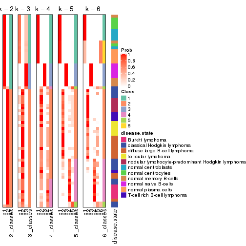


Test correlation between subgroups and known annotations. If the known
annotation is numeric, one-way ANOVA test is applied, and if the known
annotation is discrete, chi-squared contingency table test is applied.

```r
test_to_known_factors(res)
```

```
#>          n disease.state(p) k
#> ATC:pam 66         1.39e-09 2
#> ATC:pam 67         8.42e-15 3
#> ATC:pam 64         1.22e-17 4
#> ATC:pam 66         2.13e-16 5
#> ATC:pam 60         2.63e-18 6
```


If matrix rows can be associated to genes, consider to use `GO_Enrichment(res,
...)` to perform function enrichment for the signature genes.


 

---------------------------------------------------


### ATC:mclust**


The object with results only for a single top-value method and a single partition method 
can be extracted as:

```r
res = res_list["ATC", "mclust"]
# you can also extract it by
# res = res_list["ATC:mclust"]
```

A summary of `res` and all the functions that can be applied to it:

```r
res
```

```
#> A 'ConsensusPartition' object with k = 2, 3, 4, 5, 6.
#>   On a matrix with 51941 rows and 67 columns.
#>   Top rows (1000, 2000, 3000, 4000, 5000) are extracted by 'ATC' method.
#>   Subgroups are detected by 'mclust' method.
#>   Performed in total 1250 partitions by row resampling.
#>   Best k for subgroups seems to be 2.
#> 
#> Following methods can be applied to this 'ConsensusPartition' object:
#>  [1] "cola_report"             "collect_classes"         "collect_plots"          
#>  [4] "collect_stats"           "colnames"                "compare_signatures"     
#>  [7] "consensus_heatmap"       "dimension_reduction"     "functional_enrichment"  
#> [10] "get_anno_col"            "get_anno"                "get_classes"            
#> [13] "get_consensus"           "get_matrix"              "get_membership"         
#> [16] "get_param"               "get_signatures"          "get_stats"              
#> [19] "is_best_k"               "is_stable_k"             "membership_heatmap"     
#> [22] "ncol"                    "nrow"                    "plot_ecdf"              
#> [25] "rownames"                "select_partition_number" "show"                   
#> [28] "suggest_best_k"          "test_to_known_factors"
```

`collect_plots()` function collects all the plots made from `res` for all `k` (number of partitions)
into one single page to provide an easy and fast comparison between different `k`.

```r
collect_plots(res)
```


The plots are:

- The first row: a plot of the ECDF (Empirical cumulative distribution
  function) curves of the consensus matrix for each `k` and the heatmap of
  predicted classes for each `k`.
- The second row: heatmaps of the consensus matrix for each `k`.
- The third row: heatmaps of the membership matrix for each `k`.
- The fouth row: heatmaps of the signatures for each `k`.

All the plots in panels can be made by individual functions and they are
plotted later in this section.

`select_partition_number()` produces several plots showing different
statistics for choosing "optimized" `k`. There are following statistics:

- ECDF curves of the consensus matrix for each `k`;
- 1-PAC. [The PAC
  score](https://en.wikipedia.org/wiki/Consensus_clustering#Over-interpretation_potential_of_consensus_clustering)
  measures the proportion of the ambiguous subgrouping.
- Mean silhouette score.
- Concordance. The mean probability of fiting the consensus class ids in all
  partitions.
- Area increased. Denote $A_k$ as the area under the ECDF curve for current
  `k`, the area increased is defined as $A_k - A_{k-1}$.
- Rand index. The percent of pairs of samples that are both in a same cluster
  or both are not in a same cluster in the partition of k and k-1.
- Jaccard index. The ratio of pairs of samples are both in a same cluster in
  the partition of k and k-1 and the pairs of samples are both in a same
  cluster in the partition k or k-1.

The detailed explanations of these statistics can be found in [the cola
vignette](http://bioconductor.org/packages/devel/bioc/vignettes/cola/inst/doc/cola.html#toc_13).

Generally speaking, lower PAC score, higher mean silhouette score or higher
concordance corresponds to better partition. Rand index and Jaccard index
measure how similar the current partition is compared to partition with `k-1`.
If they are too similar, we won't accept `k` is better than `k-1`.

```r
select_partition_number(res)
```


The numeric values for all these statistics can be obtained by `get_stats()`.

```r
get_stats(res)
```

```
#>   k 1-PAC mean_silhouette concordance area_increased  Rand Jaccard
#> 2 2 1.000           1.000       1.000         0.4755 0.525   0.525
#> 3 3 0.667           0.733       0.794         0.2284 0.912   0.834
#> 4 4 0.659           0.759       0.881         0.1577 0.828   0.633
#> 5 5 0.716           0.660       0.790         0.1081 0.958   0.873
#> 6 6 0.698           0.271       0.681         0.0652 0.828   0.506
```

`suggest_best_k()` suggests the best $k$ based on these statistics. The rules are as follows:

- All $k$ with Jaccard index larger than 0.95 are removed because the increase of
  the partition number does not provides enough extra information. If all $k$ are removed,
  the best $k$ is assigned by `NA`.
- For $k$ with 1-PAC larger than 0.9, the maximal $k$ is taken as the "best k". Other $k$ is called "optional k".
- If it does not fit the second rule. The $k$ with the highest vote of highest
  1-PAC, mean silhouette and concordance is taken as the "best k".

```r
suggest_best_k(res)
```

```
#> [1] 2
```


Following shows the table of the partitions (You need to click the **show/hide
code output** link to see it). The membership matrix (columns with name `p*`)
is inferred by
[`clue::cl_consensus()`](https://www.rdocumentation.org/link/cl_consensus?package=clue)
function with the `SE` method. Basically the value in the membership matrix
represents the probability to belong to a certain group. The finall class
label for an item is determined with the group with highest probability it
belongs to.

In `get_classes()` function, the entropy is calculated from the membership
matrix and the silhouette score is calculated from the consensus matrix.


<script>
$( function() {
	$( '#tabs-ATC-mclust-get-classes' ).tabs();
} );
</script>
<div id='tabs-ATC-mclust-get-classes'>
<ul>
<li><a href='#tab-ATC-mclust-get-classes-1'>k = 2</a></li>
<li><a href='#tab-ATC-mclust-get-classes-2'>k = 3</a></li>
<li><a href='#tab-ATC-mclust-get-classes-3'>k = 4</a></li>
<li><a href='#tab-ATC-mclust-get-classes-4'>k = 5</a></li>
<li><a href='#tab-ATC-mclust-get-classes-5'>k = 6</a></li>
</ul>

<div id='tab-ATC-mclust-get-classes-1'>
<p><a id='tab-ATC-mclust-get-classes-1-a' style='color:#0366d6' href='#'>show/hide code output</a></p>
<pre><code class="r">cbind(get_classes(res, k = 2), get_membership(res, k = 2))
</code></pre>

<pre><code>#&gt;           class entropy silhouette    p1    p2
#&gt; GSM312811     2  0.0000      1.000 0.000 1.000
#&gt; GSM312812     2  0.0000      1.000 0.000 1.000
#&gt; GSM312813     2  0.0000      1.000 0.000 1.000
#&gt; GSM312814     2  0.0000      1.000 0.000 1.000
#&gt; GSM312815     2  0.0000      1.000 0.000 1.000
#&gt; GSM312816     2  0.0000      1.000 0.000 1.000
#&gt; GSM312817     2  0.0000      1.000 0.000 1.000
#&gt; GSM312818     2  0.0000      1.000 0.000 1.000
#&gt; GSM312819     2  0.0000      1.000 0.000 1.000
#&gt; GSM312820     2  0.0000      1.000 0.000 1.000
#&gt; GSM312821     2  0.0000      1.000 0.000 1.000
#&gt; GSM312822     2  0.0000      1.000 0.000 1.000
#&gt; GSM312823     2  0.0000      1.000 0.000 1.000
#&gt; GSM312824     2  0.0000      1.000 0.000 1.000
#&gt; GSM312825     2  0.0000      1.000 0.000 1.000
#&gt; GSM312826     2  0.0000      1.000 0.000 1.000
#&gt; GSM312839     2  0.0000      1.000 0.000 1.000
#&gt; GSM312840     2  0.0000      1.000 0.000 1.000
#&gt; GSM312841     2  0.0000      1.000 0.000 1.000
#&gt; GSM312843     2  0.0000      1.000 0.000 1.000
#&gt; GSM312844     2  0.0000      1.000 0.000 1.000
#&gt; GSM312845     2  0.0938      0.988 0.012 0.988
#&gt; GSM312846     2  0.0000      1.000 0.000 1.000
#&gt; GSM312847     2  0.0000      1.000 0.000 1.000
#&gt; GSM312848     2  0.0000      1.000 0.000 1.000
#&gt; GSM312849     2  0.0000      1.000 0.000 1.000
#&gt; GSM312851     2  0.0000      1.000 0.000 1.000
#&gt; GSM312853     2  0.0000      1.000 0.000 1.000
#&gt; GSM312854     2  0.0000      1.000 0.000 1.000
#&gt; GSM312856     2  0.0000      1.000 0.000 1.000
#&gt; GSM312857     2  0.0000      1.000 0.000 1.000
#&gt; GSM312858     2  0.0000      1.000 0.000 1.000
#&gt; GSM312859     2  0.0000      1.000 0.000 1.000
#&gt; GSM312860     2  0.0000      1.000 0.000 1.000
#&gt; GSM312861     2  0.0000      1.000 0.000 1.000
#&gt; GSM312862     2  0.0000      1.000 0.000 1.000
#&gt; GSM312863     2  0.0000      1.000 0.000 1.000
#&gt; GSM312864     2  0.0000      1.000 0.000 1.000
#&gt; GSM312865     2  0.0000      1.000 0.000 1.000
#&gt; GSM312867     2  0.0000      1.000 0.000 1.000
#&gt; GSM312868     2  0.0000      1.000 0.000 1.000
#&gt; GSM312869     2  0.0000      1.000 0.000 1.000
#&gt; GSM312870     1  0.0000      1.000 1.000 0.000
#&gt; GSM312872     1  0.0000      1.000 1.000 0.000
#&gt; GSM312874     1  0.0000      1.000 1.000 0.000
#&gt; GSM312875     1  0.0000      1.000 1.000 0.000
#&gt; GSM312876     1  0.0000      1.000 1.000 0.000
#&gt; GSM312877     1  0.0000      1.000 1.000 0.000
#&gt; GSM312879     1  0.0000      1.000 1.000 0.000
#&gt; GSM312882     1  0.0000      1.000 1.000 0.000
#&gt; GSM312883     1  0.0000      1.000 1.000 0.000
#&gt; GSM312886     1  0.0000      1.000 1.000 0.000
#&gt; GSM312887     1  0.0000      1.000 1.000 0.000
#&gt; GSM312890     1  0.0000      1.000 1.000 0.000
#&gt; GSM312893     1  0.0000      1.000 1.000 0.000
#&gt; GSM312894     1  0.0000      1.000 1.000 0.000
#&gt; GSM312895     1  0.0000      1.000 1.000 0.000
#&gt; GSM312937     1  0.0000      1.000 1.000 0.000
#&gt; GSM312938     1  0.0000      1.000 1.000 0.000
#&gt; GSM312939     1  0.0000      1.000 1.000 0.000
#&gt; GSM312940     1  0.0000      1.000 1.000 0.000
#&gt; GSM312941     1  0.0000      1.000 1.000 0.000
#&gt; GSM312942     1  0.0000      1.000 1.000 0.000
#&gt; GSM312943     1  0.0000      1.000 1.000 0.000
#&gt; GSM312944     1  0.0000      1.000 1.000 0.000
#&gt; GSM312945     1  0.0000      1.000 1.000 0.000
#&gt; GSM312946     1  0.0000      1.000 1.000 0.000
</code></pre>

<script>
$('#tab-ATC-mclust-get-classes-1-a').parent().next().next().hide();
$('#tab-ATC-mclust-get-classes-1-a').click(function(){
  $('#tab-ATC-mclust-get-classes-1-a').parent().next().next().toggle();
  return(false);
});
</script>
</div>

<div id='tab-ATC-mclust-get-classes-2'>
<p><a id='tab-ATC-mclust-get-classes-2-a' style='color:#0366d6' href='#'>show/hide code output</a></p>
<pre><code class="r">cbind(get_classes(res, k = 3), get_membership(res, k = 3))
</code></pre>

<pre><code>#&gt;           class entropy silhouette    p1    p2    p3
#&gt; GSM312811     2  0.4110      0.856 0.004 0.844 0.152
#&gt; GSM312812     2  0.3686      0.858 0.000 0.860 0.140
#&gt; GSM312813     2  0.0747      0.890 0.000 0.984 0.016
#&gt; GSM312814     2  0.5815      0.769 0.004 0.692 0.304
#&gt; GSM312815     2  0.6345      0.685 0.004 0.596 0.400
#&gt; GSM312816     2  0.5158      0.813 0.004 0.764 0.232
#&gt; GSM312817     2  0.1289      0.888 0.000 0.968 0.032
#&gt; GSM312818     2  0.7410      0.641 0.040 0.576 0.384
#&gt; GSM312819     2  0.1289      0.888 0.000 0.968 0.032
#&gt; GSM312820     2  0.7397      0.543 0.032 0.484 0.484
#&gt; GSM312821     3  0.7397     -0.599 0.032 0.484 0.484
#&gt; GSM312822     2  0.6410      0.667 0.004 0.576 0.420
#&gt; GSM312823     2  0.1267      0.892 0.004 0.972 0.024
#&gt; GSM312824     2  0.4062      0.848 0.000 0.836 0.164
#&gt; GSM312825     2  0.4062      0.849 0.000 0.836 0.164
#&gt; GSM312826     2  0.3267      0.869 0.000 0.884 0.116
#&gt; GSM312839     2  0.6345      0.685 0.004 0.596 0.400
#&gt; GSM312840     2  0.0592      0.891 0.000 0.988 0.012
#&gt; GSM312841     2  0.4002      0.848 0.000 0.840 0.160
#&gt; GSM312843     2  0.0892      0.891 0.000 0.980 0.020
#&gt; GSM312844     2  0.6345      0.685 0.004 0.596 0.400
#&gt; GSM312845     2  0.2681      0.870 0.028 0.932 0.040
#&gt; GSM312846     2  0.1163      0.887 0.000 0.972 0.028
#&gt; GSM312847     2  0.1031      0.888 0.000 0.976 0.024
#&gt; GSM312848     2  0.1267      0.891 0.004 0.972 0.024
#&gt; GSM312849     2  0.1031      0.886 0.000 0.976 0.024
#&gt; GSM312851     2  0.1878      0.886 0.004 0.952 0.044
#&gt; GSM312853     2  0.1399      0.890 0.004 0.968 0.028
#&gt; GSM312854     2  0.0424      0.891 0.000 0.992 0.008
#&gt; GSM312856     2  0.3112      0.871 0.004 0.900 0.096
#&gt; GSM312857     2  0.1878      0.887 0.004 0.952 0.044
#&gt; GSM312858     2  0.1031      0.886 0.000 0.976 0.024
#&gt; GSM312859     2  0.0747      0.890 0.000 0.984 0.016
#&gt; GSM312860     2  0.0892      0.891 0.000 0.980 0.020
#&gt; GSM312861     2  0.0424      0.890 0.000 0.992 0.008
#&gt; GSM312862     2  0.1031      0.888 0.000 0.976 0.024
#&gt; GSM312863     2  0.0424      0.891 0.000 0.992 0.008
#&gt; GSM312864     2  0.2096      0.890 0.004 0.944 0.052
#&gt; GSM312865     2  0.1031      0.888 0.000 0.976 0.024
#&gt; GSM312867     2  0.4233      0.842 0.004 0.836 0.160
#&gt; GSM312868     2  0.0892      0.887 0.000 0.980 0.020
#&gt; GSM312869     2  0.5929      0.752 0.004 0.676 0.320
#&gt; GSM312870     1  0.1753      0.733 0.952 0.000 0.048
#&gt; GSM312872     1  0.1753      0.733 0.952 0.000 0.048
#&gt; GSM312874     1  0.1753      0.733 0.952 0.000 0.048
#&gt; GSM312875     1  0.0000      0.766 1.000 0.000 0.000
#&gt; GSM312876     1  0.0000      0.766 1.000 0.000 0.000
#&gt; GSM312877     1  0.6286     -0.519 0.536 0.000 0.464
#&gt; GSM312879     1  0.0592      0.760 0.988 0.000 0.012
#&gt; GSM312882     1  0.0000      0.766 1.000 0.000 0.000
#&gt; GSM312883     1  0.0747      0.765 0.984 0.000 0.016
#&gt; GSM312886     1  0.1860      0.755 0.948 0.000 0.052
#&gt; GSM312887     1  0.3116      0.697 0.892 0.000 0.108
#&gt; GSM312890     3  0.6291      0.677 0.468 0.000 0.532
#&gt; GSM312893     3  0.6291      0.677 0.468 0.000 0.532
#&gt; GSM312894     3  0.6291      0.677 0.468 0.000 0.532
#&gt; GSM312895     3  0.6291      0.677 0.468 0.000 0.532
#&gt; GSM312937     3  0.6291      0.677 0.468 0.000 0.532
#&gt; GSM312938     1  0.5327      0.405 0.728 0.000 0.272
#&gt; GSM312939     3  0.6291      0.677 0.468 0.000 0.532
#&gt; GSM312940     3  0.6291      0.677 0.468 0.000 0.532
#&gt; GSM312941     3  0.6291      0.677 0.468 0.000 0.532
#&gt; GSM312942     1  0.1753      0.753 0.952 0.000 0.048
#&gt; GSM312943     1  0.5327      0.405 0.728 0.000 0.272
#&gt; GSM312944     1  0.5397      0.381 0.720 0.000 0.280
#&gt; GSM312945     1  0.5397      0.381 0.720 0.000 0.280
#&gt; GSM312946     3  0.6309      0.584 0.500 0.000 0.500
</code></pre>

<script>
$('#tab-ATC-mclust-get-classes-2-a').parent().next().next().hide();
$('#tab-ATC-mclust-get-classes-2-a').click(function(){
  $('#tab-ATC-mclust-get-classes-2-a').parent().next().next().toggle();
  return(false);
});
</script>
</div>

<div id='tab-ATC-mclust-get-classes-3'>
<p><a id='tab-ATC-mclust-get-classes-3-a' style='color:#0366d6' href='#'>show/hide code output</a></p>
<pre><code class="r">cbind(get_classes(res, k = 4), get_membership(res, k = 4))
</code></pre>

<pre><code>#&gt;           class entropy silhouette    p1    p2    p3    p4
#&gt; GSM312811     2  0.4624     0.5654 0.000 0.660 0.000 0.340
#&gt; GSM312812     2  0.3528     0.7910 0.000 0.808 0.000 0.192
#&gt; GSM312813     2  0.3311     0.8035 0.000 0.828 0.000 0.172
#&gt; GSM312814     4  0.4999    -0.0595 0.000 0.492 0.000 0.508
#&gt; GSM312815     4  0.3074     0.7925 0.000 0.152 0.000 0.848
#&gt; GSM312816     4  0.4898     0.2751 0.000 0.416 0.000 0.584
#&gt; GSM312817     2  0.3444     0.8002 0.000 0.816 0.000 0.184
#&gt; GSM312818     4  0.0336     0.7176 0.000 0.008 0.000 0.992
#&gt; GSM312819     2  0.3444     0.8002 0.000 0.816 0.000 0.184
#&gt; GSM312820     4  0.0336     0.7176 0.000 0.008 0.000 0.992
#&gt; GSM312821     4  0.0336     0.7176 0.000 0.008 0.000 0.992
#&gt; GSM312822     4  0.3172     0.7875 0.000 0.160 0.000 0.840
#&gt; GSM312823     2  0.3356     0.8030 0.000 0.824 0.000 0.176
#&gt; GSM312824     2  0.3688     0.7749 0.000 0.792 0.000 0.208
#&gt; GSM312825     2  0.3801     0.7609 0.000 0.780 0.000 0.220
#&gt; GSM312826     2  0.3486     0.7943 0.000 0.812 0.000 0.188
#&gt; GSM312839     4  0.3074     0.7925 0.000 0.152 0.000 0.848
#&gt; GSM312840     2  0.3311     0.8035 0.000 0.828 0.000 0.172
#&gt; GSM312841     2  0.3942     0.7356 0.000 0.764 0.000 0.236
#&gt; GSM312843     2  0.0921     0.8466 0.000 0.972 0.000 0.028
#&gt; GSM312844     4  0.3074     0.7925 0.000 0.152 0.000 0.848
#&gt; GSM312845     2  0.0000     0.8458 0.000 1.000 0.000 0.000
#&gt; GSM312846     2  0.0000     0.8458 0.000 1.000 0.000 0.000
#&gt; GSM312847     2  0.0000     0.8458 0.000 1.000 0.000 0.000
#&gt; GSM312848     2  0.0188     0.8453 0.000 0.996 0.000 0.004
#&gt; GSM312849     2  0.0000     0.8458 0.000 1.000 0.000 0.000
#&gt; GSM312851     2  0.3172     0.7044 0.000 0.840 0.000 0.160
#&gt; GSM312853     2  0.2973     0.7269 0.000 0.856 0.000 0.144
#&gt; GSM312854     2  0.0188     0.8455 0.000 0.996 0.000 0.004
#&gt; GSM312856     2  0.3172     0.7111 0.000 0.840 0.000 0.160
#&gt; GSM312857     2  0.3123     0.7103 0.000 0.844 0.000 0.156
#&gt; GSM312858     2  0.0000     0.8458 0.000 1.000 0.000 0.000
#&gt; GSM312859     2  0.2760     0.8243 0.000 0.872 0.000 0.128
#&gt; GSM312860     2  0.1474     0.8442 0.000 0.948 0.000 0.052
#&gt; GSM312861     2  0.0592     0.8472 0.000 0.984 0.000 0.016
#&gt; GSM312862     2  0.0000     0.8458 0.000 1.000 0.000 0.000
#&gt; GSM312863     2  0.0000     0.8458 0.000 1.000 0.000 0.000
#&gt; GSM312864     2  0.3444     0.8002 0.000 0.816 0.000 0.184
#&gt; GSM312865     2  0.0000     0.8458 0.000 1.000 0.000 0.000
#&gt; GSM312867     2  0.0188     0.8453 0.000 0.996 0.000 0.004
#&gt; GSM312868     2  0.0188     0.8455 0.000 0.996 0.000 0.004
#&gt; GSM312869     2  0.4040     0.7243 0.000 0.752 0.000 0.248
#&gt; GSM312870     3  0.0000     0.9534 0.000 0.000 1.000 0.000
#&gt; GSM312872     3  0.0000     0.9534 0.000 0.000 1.000 0.000
#&gt; GSM312874     3  0.0000     0.9534 0.000 0.000 1.000 0.000
#&gt; GSM312875     3  0.0000     0.9534 0.000 0.000 1.000 0.000
#&gt; GSM312876     3  0.0000     0.9534 0.000 0.000 1.000 0.000
#&gt; GSM312877     1  0.4343     0.6238 0.732 0.000 0.264 0.004
#&gt; GSM312879     3  0.0000     0.9534 0.000 0.000 1.000 0.000
#&gt; GSM312882     3  0.0000     0.9534 0.000 0.000 1.000 0.000
#&gt; GSM312883     3  0.0000     0.9534 0.000 0.000 1.000 0.000
#&gt; GSM312886     3  0.0000     0.9534 0.000 0.000 1.000 0.000
#&gt; GSM312887     3  0.3356     0.7246 0.176 0.000 0.824 0.000
#&gt; GSM312890     1  0.1022     0.7750 0.968 0.000 0.032 0.000
#&gt; GSM312893     1  0.0188     0.7788 0.996 0.000 0.004 0.000
#&gt; GSM312894     1  0.0000     0.7781 1.000 0.000 0.000 0.000
#&gt; GSM312895     1  0.0000     0.7781 1.000 0.000 0.000 0.000
#&gt; GSM312937     1  0.0000     0.7781 1.000 0.000 0.000 0.000
#&gt; GSM312938     1  0.5163     0.3462 0.516 0.000 0.480 0.004
#&gt; GSM312939     1  0.0188     0.7788 0.996 0.000 0.004 0.000
#&gt; GSM312940     1  0.2593     0.7514 0.892 0.000 0.104 0.004
#&gt; GSM312941     1  0.0000     0.7781 1.000 0.000 0.000 0.000
#&gt; GSM312942     3  0.3172     0.7535 0.160 0.000 0.840 0.000
#&gt; GSM312943     1  0.5163     0.3462 0.516 0.000 0.480 0.004
#&gt; GSM312944     1  0.5163     0.3462 0.516 0.000 0.480 0.004
#&gt; GSM312945     1  0.5163     0.3462 0.516 0.000 0.480 0.004
#&gt; GSM312946     1  0.3219     0.7192 0.836 0.000 0.164 0.000
</code></pre>

<script>
$('#tab-ATC-mclust-get-classes-3-a').parent().next().next().hide();
$('#tab-ATC-mclust-get-classes-3-a').click(function(){
  $('#tab-ATC-mclust-get-classes-3-a').parent().next().next().toggle();
  return(false);
});
</script>
</div>

<div id='tab-ATC-mclust-get-classes-4'>
<p><a id='tab-ATC-mclust-get-classes-4-a' style='color:#0366d6' href='#'>show/hide code output</a></p>
<pre><code class="r">cbind(get_classes(res, k = 5), get_membership(res, k = 5))
</code></pre>

<pre><code>#&gt;           class entropy silhouette    p1    p2    p3    p4    p5
#&gt; GSM312811     2  0.4420      0.275 0.000 0.548 0.000 0.448 0.004
#&gt; GSM312812     4  0.3910      0.485 0.000 0.272 0.000 0.720 0.008
#&gt; GSM312813     4  0.2852      0.598 0.000 0.172 0.000 0.828 0.000
#&gt; GSM312814     2  0.3790      0.609 0.000 0.724 0.000 0.272 0.004
#&gt; GSM312815     2  0.0324      0.456 0.000 0.992 0.000 0.004 0.004
#&gt; GSM312816     2  0.3766      0.612 0.000 0.728 0.000 0.268 0.004
#&gt; GSM312817     4  0.2930      0.606 0.000 0.164 0.000 0.832 0.004
#&gt; GSM312818     5  0.4273      1.000 0.000 0.448 0.000 0.000 0.552
#&gt; GSM312819     4  0.2930      0.606 0.000 0.164 0.000 0.832 0.004
#&gt; GSM312820     5  0.4273      1.000 0.000 0.448 0.000 0.000 0.552
#&gt; GSM312821     5  0.4273      1.000 0.000 0.448 0.000 0.000 0.552
#&gt; GSM312822     2  0.0324      0.456 0.000 0.992 0.000 0.004 0.004
#&gt; GSM312823     2  0.4560      0.153 0.000 0.508 0.000 0.484 0.008
#&gt; GSM312824     4  0.3910      0.485 0.000 0.272 0.000 0.720 0.008
#&gt; GSM312825     4  0.3910      0.485 0.000 0.272 0.000 0.720 0.008
#&gt; GSM312826     4  0.3910      0.485 0.000 0.272 0.000 0.720 0.008
#&gt; GSM312839     2  0.0324      0.456 0.000 0.992 0.000 0.004 0.004
#&gt; GSM312840     4  0.3109      0.573 0.000 0.200 0.000 0.800 0.000
#&gt; GSM312841     4  0.3636      0.483 0.000 0.272 0.000 0.728 0.000
#&gt; GSM312843     4  0.1965      0.610 0.000 0.096 0.000 0.904 0.000
#&gt; GSM312844     2  0.0324      0.456 0.000 0.992 0.000 0.004 0.004
#&gt; GSM312845     4  0.3636      0.593 0.000 0.000 0.000 0.728 0.272
#&gt; GSM312846     4  0.3612      0.593 0.000 0.000 0.000 0.732 0.268
#&gt; GSM312847     4  0.3636      0.593 0.000 0.000 0.000 0.728 0.272
#&gt; GSM312848     4  0.3586      0.593 0.000 0.000 0.000 0.736 0.264
#&gt; GSM312849     4  0.3636      0.593 0.000 0.000 0.000 0.728 0.272
#&gt; GSM312851     4  0.4288     -0.106 0.000 0.384 0.000 0.612 0.004
#&gt; GSM312853     4  0.5074      0.486 0.000 0.168 0.000 0.700 0.132
#&gt; GSM312854     4  0.2929      0.621 0.000 0.008 0.000 0.840 0.152
#&gt; GSM312856     4  0.3990      0.145 0.000 0.308 0.000 0.688 0.004
#&gt; GSM312857     4  0.4066      0.097 0.000 0.324 0.000 0.672 0.004
#&gt; GSM312858     4  0.2424      0.626 0.000 0.000 0.000 0.868 0.132
#&gt; GSM312859     4  0.3081      0.609 0.000 0.156 0.000 0.832 0.012
#&gt; GSM312860     4  0.2971      0.608 0.000 0.156 0.000 0.836 0.008
#&gt; GSM312861     4  0.3039      0.612 0.000 0.152 0.000 0.836 0.012
#&gt; GSM312862     4  0.5425      0.509 0.000 0.100 0.000 0.632 0.268
#&gt; GSM312863     4  0.3586      0.593 0.000 0.000 0.000 0.736 0.264
#&gt; GSM312864     4  0.2970      0.604 0.000 0.168 0.000 0.828 0.004
#&gt; GSM312865     4  0.3636      0.593 0.000 0.000 0.000 0.728 0.272
#&gt; GSM312867     4  0.3766      0.591 0.000 0.004 0.000 0.728 0.268
#&gt; GSM312868     4  0.0324      0.626 0.000 0.004 0.000 0.992 0.004
#&gt; GSM312869     4  0.4047      0.397 0.000 0.320 0.000 0.676 0.004
#&gt; GSM312870     3  0.0000      0.899 0.000 0.000 1.000 0.000 0.000
#&gt; GSM312872     3  0.0000      0.899 0.000 0.000 1.000 0.000 0.000
#&gt; GSM312874     3  0.0000      0.899 0.000 0.000 1.000 0.000 0.000
#&gt; GSM312875     3  0.0000      0.899 0.000 0.000 1.000 0.000 0.000
#&gt; GSM312876     3  0.0000      0.899 0.000 0.000 1.000 0.000 0.000
#&gt; GSM312877     1  0.3242      0.880 0.816 0.000 0.012 0.000 0.172
#&gt; GSM312879     3  0.0000      0.899 0.000 0.000 1.000 0.000 0.000
#&gt; GSM312882     3  0.0000      0.899 0.000 0.000 1.000 0.000 0.000
#&gt; GSM312883     3  0.0290      0.896 0.000 0.000 0.992 0.000 0.008
#&gt; GSM312886     3  0.0290      0.896 0.000 0.000 0.992 0.000 0.008
#&gt; GSM312887     3  0.4626      0.414 0.364 0.000 0.616 0.000 0.020
#&gt; GSM312890     1  0.0000      0.934 1.000 0.000 0.000 0.000 0.000
#&gt; GSM312893     1  0.0000      0.934 1.000 0.000 0.000 0.000 0.000
#&gt; GSM312894     1  0.0162      0.934 0.996 0.000 0.000 0.000 0.004
#&gt; GSM312895     1  0.0000      0.934 1.000 0.000 0.000 0.000 0.000
#&gt; GSM312937     1  0.0000      0.934 1.000 0.000 0.000 0.000 0.000
#&gt; GSM312938     1  0.3242      0.880 0.816 0.000 0.012 0.000 0.172
#&gt; GSM312939     1  0.0000      0.934 1.000 0.000 0.000 0.000 0.000
#&gt; GSM312940     1  0.0000      0.934 1.000 0.000 0.000 0.000 0.000
#&gt; GSM312941     1  0.0000      0.934 1.000 0.000 0.000 0.000 0.000
#&gt; GSM312942     3  0.4555      0.460 0.344 0.000 0.636 0.000 0.020
#&gt; GSM312943     1  0.3242      0.880 0.816 0.000 0.012 0.000 0.172
#&gt; GSM312944     1  0.3242      0.880 0.816 0.000 0.012 0.000 0.172
#&gt; GSM312945     1  0.3242      0.880 0.816 0.000 0.012 0.000 0.172
#&gt; GSM312946     1  0.0404      0.932 0.988 0.000 0.000 0.000 0.012
</code></pre>

<script>
$('#tab-ATC-mclust-get-classes-4-a').parent().next().next().hide();
$('#tab-ATC-mclust-get-classes-4-a').click(function(){
  $('#tab-ATC-mclust-get-classes-4-a').parent().next().next().toggle();
  return(false);
});
</script>
</div>

<div id='tab-ATC-mclust-get-classes-5'>
<p><a id='tab-ATC-mclust-get-classes-5-a' style='color:#0366d6' href='#'>show/hide code output</a></p>
<pre><code class="r">cbind(get_classes(res, k = 6), get_membership(res, k = 6))
</code></pre>

<pre><code>#&gt;           class entropy silhouette    p1    p2    p3    p4    p5    p6
#&gt; GSM312811     2  0.4356   -0.00927 0.000 0.608 0.000 0.360 0.000 0.032
#&gt; GSM312812     2  0.1444    0.05687 0.000 0.928 0.000 0.072 0.000 0.000
#&gt; GSM312813     2  0.4086   -0.19430 0.000 0.528 0.000 0.464 0.000 0.008
#&gt; GSM312814     2  0.5336    0.01431 0.000 0.576 0.000 0.332 0.024 0.068
#&gt; GSM312815     2  0.7167   -0.29306 0.000 0.400 0.000 0.212 0.288 0.100
#&gt; GSM312816     2  0.6448   -0.05745 0.000 0.448 0.000 0.368 0.060 0.124
#&gt; GSM312817     4  0.3489    0.27682 0.000 0.288 0.000 0.708 0.000 0.004
#&gt; GSM312818     5  0.0000    0.78126 0.000 0.000 0.000 0.000 1.000 0.000
#&gt; GSM312819     4  0.3489    0.27682 0.000 0.288 0.000 0.708 0.000 0.004
#&gt; GSM312820     5  0.0000    0.78126 0.000 0.000 0.000 0.000 1.000 0.000
#&gt; GSM312821     5  0.0000    0.78126 0.000 0.000 0.000 0.000 1.000 0.000
#&gt; GSM312822     5  0.7600    0.19162 0.000 0.276 0.000 0.268 0.296 0.160
#&gt; GSM312823     4  0.5656   -0.18922 0.000 0.408 0.000 0.440 0.000 0.152
#&gt; GSM312824     2  0.0363    0.07124 0.000 0.988 0.000 0.012 0.000 0.000
#&gt; GSM312825     2  0.0363    0.07124 0.000 0.988 0.000 0.012 0.000 0.000
#&gt; GSM312826     2  0.0790    0.06681 0.000 0.968 0.000 0.032 0.000 0.000
#&gt; GSM312839     2  0.7103   -0.28587 0.000 0.408 0.000 0.212 0.288 0.092
#&gt; GSM312840     2  0.3607   -0.09029 0.000 0.652 0.000 0.348 0.000 0.000
#&gt; GSM312841     2  0.1753    0.04528 0.000 0.912 0.000 0.084 0.000 0.004
#&gt; GSM312843     2  0.4129   -0.14268 0.000 0.564 0.000 0.424 0.000 0.012
#&gt; GSM312844     2  0.7251   -0.31790 0.000 0.372 0.000 0.240 0.288 0.100
#&gt; GSM312845     2  0.6095   -0.21286 0.000 0.376 0.000 0.340 0.000 0.284
#&gt; GSM312846     2  0.5162   -0.67576 0.000 0.504 0.000 0.088 0.000 0.408
#&gt; GSM312847     2  0.6104   -0.21253 0.000 0.372 0.000 0.336 0.000 0.292
#&gt; GSM312848     2  0.6099   -0.22601 0.000 0.380 0.000 0.328 0.000 0.292
#&gt; GSM312849     2  0.6087   -0.22033 0.000 0.392 0.000 0.316 0.000 0.292
#&gt; GSM312851     4  0.6026   -0.22598 0.000 0.168 0.000 0.516 0.020 0.296
#&gt; GSM312853     4  0.6095   -0.38681 0.000 0.224 0.000 0.464 0.008 0.304
#&gt; GSM312854     2  0.6094   -0.31904 0.000 0.368 0.000 0.352 0.000 0.280
#&gt; GSM312856     4  0.5575   -0.13476 0.000 0.304 0.000 0.528 0.000 0.168
#&gt; GSM312857     4  0.5697   -0.17989 0.000 0.272 0.000 0.520 0.000 0.208
#&gt; GSM312858     4  0.6035   -0.13133 0.000 0.376 0.000 0.376 0.000 0.248
#&gt; GSM312859     4  0.3881    0.22268 0.000 0.396 0.000 0.600 0.000 0.004
#&gt; GSM312860     2  0.3854   -0.19004 0.000 0.536 0.000 0.464 0.000 0.000
#&gt; GSM312861     4  0.3930    0.20684 0.000 0.420 0.000 0.576 0.000 0.004
#&gt; GSM312862     6  0.5862    0.00000 0.000 0.376 0.000 0.196 0.000 0.428
#&gt; GSM312863     2  0.6106   -0.21864 0.000 0.368 0.000 0.340 0.000 0.292
#&gt; GSM312864     4  0.3742    0.17763 0.000 0.348 0.000 0.648 0.000 0.004
#&gt; GSM312865     2  0.6104   -0.21253 0.000 0.372 0.000 0.336 0.000 0.292
#&gt; GSM312867     2  0.5366   -0.41439 0.000 0.564 0.000 0.144 0.000 0.292
#&gt; GSM312868     4  0.5219    0.13372 0.000 0.296 0.000 0.580 0.000 0.124
#&gt; GSM312869     2  0.2468    0.05053 0.000 0.880 0.000 0.096 0.016 0.008
#&gt; GSM312870     3  0.0547    0.87644 0.000 0.000 0.980 0.000 0.000 0.020
#&gt; GSM312872     3  0.0547    0.87644 0.000 0.000 0.980 0.000 0.000 0.020
#&gt; GSM312874     3  0.0547    0.87644 0.000 0.000 0.980 0.000 0.000 0.020
#&gt; GSM312875     3  0.0260    0.87855 0.008 0.000 0.992 0.000 0.000 0.000
#&gt; GSM312876     3  0.0260    0.87855 0.008 0.000 0.992 0.000 0.000 0.000
#&gt; GSM312877     1  0.2631    0.70613 0.840 0.000 0.008 0.000 0.000 0.152
#&gt; GSM312879     3  0.0547    0.87644 0.000 0.000 0.980 0.000 0.000 0.020
#&gt; GSM312882     3  0.0260    0.87855 0.008 0.000 0.992 0.000 0.000 0.000
#&gt; GSM312883     3  0.1588    0.85462 0.072 0.000 0.924 0.000 0.000 0.004
#&gt; GSM312886     3  0.2350    0.82995 0.100 0.000 0.880 0.000 0.000 0.020
#&gt; GSM312887     3  0.4237    0.44688 0.396 0.000 0.584 0.000 0.000 0.020
#&gt; GSM312890     1  0.3857    0.83270 0.532 0.000 0.000 0.000 0.000 0.468
#&gt; GSM312893     1  0.3857    0.83270 0.532 0.000 0.000 0.000 0.000 0.468
#&gt; GSM312894     1  0.3857    0.83270 0.532 0.000 0.000 0.000 0.000 0.468
#&gt; GSM312895     1  0.3857    0.83270 0.532 0.000 0.000 0.000 0.000 0.468
#&gt; GSM312937     1  0.3857    0.83270 0.532 0.000 0.000 0.000 0.000 0.468
#&gt; GSM312938     1  0.0909    0.61180 0.968 0.000 0.012 0.000 0.000 0.020
#&gt; GSM312939     1  0.3857    0.83270 0.532 0.000 0.000 0.000 0.000 0.468
#&gt; GSM312940     1  0.3857    0.83270 0.532 0.000 0.000 0.000 0.000 0.468
#&gt; GSM312941     1  0.3857    0.83270 0.532 0.000 0.000 0.000 0.000 0.468
#&gt; GSM312942     3  0.4155    0.51741 0.364 0.000 0.616 0.000 0.000 0.020
#&gt; GSM312943     1  0.0725    0.61894 0.976 0.000 0.012 0.000 0.000 0.012
#&gt; GSM312944     1  0.0405    0.63370 0.988 0.000 0.008 0.000 0.000 0.004
#&gt; GSM312945     1  0.0260    0.63115 0.992 0.000 0.008 0.000 0.000 0.000
#&gt; GSM312946     1  0.3833    0.82429 0.556 0.000 0.000 0.000 0.000 0.444
</code></pre>

<script>
$('#tab-ATC-mclust-get-classes-5-a').parent().next().next().hide();
$('#tab-ATC-mclust-get-classes-5-a').click(function(){
  $('#tab-ATC-mclust-get-classes-5-a').parent().next().next().toggle();
  return(false);
});
</script>
</div>
</div>

Heatmaps for the consensus matrix. It visualizes the probability of two
samples to be in a same group.


<script>
$( function() {
	$( '#tabs-ATC-mclust-consensus-heatmap' ).tabs();
} );
</script>
<div id='tabs-ATC-mclust-consensus-heatmap'>
<ul>
<li><a href='#tab-ATC-mclust-consensus-heatmap-1'>k = 2</a></li>
<li><a href='#tab-ATC-mclust-consensus-heatmap-2'>k = 3</a></li>
<li><a href='#tab-ATC-mclust-consensus-heatmap-3'>k = 4</a></li>
<li><a href='#tab-ATC-mclust-consensus-heatmap-4'>k = 5</a></li>
<li><a href='#tab-ATC-mclust-consensus-heatmap-5'>k = 6</a></li>
</ul>
<div id='tab-ATC-mclust-consensus-heatmap-1'>
<pre><code class="r">consensus_heatmap(res, k = 2)
</code></pre>

<p></p>

</div>
<div id='tab-ATC-mclust-consensus-heatmap-2'>
<pre><code class="r">consensus_heatmap(res, k = 3)
</code></pre>

<p></p>

</div>
<div id='tab-ATC-mclust-consensus-heatmap-3'>
<pre><code class="r">consensus_heatmap(res, k = 4)
</code></pre>

<p></p>

</div>
<div id='tab-ATC-mclust-consensus-heatmap-4'>
<pre><code class="r">consensus_heatmap(res, k = 5)
</code></pre>

<p></p>

</div>
<div id='tab-ATC-mclust-consensus-heatmap-5'>
<pre><code class="r">consensus_heatmap(res, k = 6)
</code></pre>

<p></p>

</div>
</div>

Heatmaps for the membership of samples in all partitions to see how consistent they are:


<script>
$( function() {
	$( '#tabs-ATC-mclust-membership-heatmap' ).tabs();
} );
</script>
<div id='tabs-ATC-mclust-membership-heatmap'>
<ul>
<li><a href='#tab-ATC-mclust-membership-heatmap-1'>k = 2</a></li>
<li><a href='#tab-ATC-mclust-membership-heatmap-2'>k = 3</a></li>
<li><a href='#tab-ATC-mclust-membership-heatmap-3'>k = 4</a></li>
<li><a href='#tab-ATC-mclust-membership-heatmap-4'>k = 5</a></li>
<li><a href='#tab-ATC-mclust-membership-heatmap-5'>k = 6</a></li>
</ul>
<div id='tab-ATC-mclust-membership-heatmap-1'>
<pre><code class="r">membership_heatmap(res, k = 2)
</code></pre>

<p></p>

</div>
<div id='tab-ATC-mclust-membership-heatmap-2'>
<pre><code class="r">membership_heatmap(res, k = 3)
</code></pre>

<p></p>

</div>
<div id='tab-ATC-mclust-membership-heatmap-3'>
<pre><code class="r">membership_heatmap(res, k = 4)
</code></pre>

<p>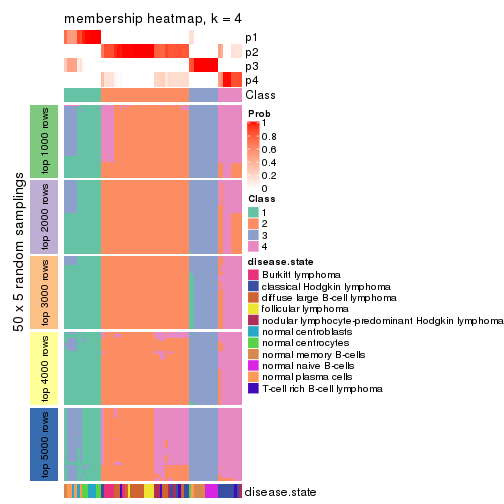</p>

</div>
<div id='tab-ATC-mclust-membership-heatmap-4'>
<pre><code class="r">membership_heatmap(res, k = 5)
</code></pre>

<p></p>

</div>
<div id='tab-ATC-mclust-membership-heatmap-5'>
<pre><code class="r">membership_heatmap(res, k = 6)
</code></pre>

<p></p>

</div>
</div>

As soon as we have had the classes for columns, we can look for signatures
which are significantly different between classes which can be candidate marks
for certain classes. Following are the heatmaps for signatures.


Signature heatmaps where rows are scaled:


<script>
$( function() {
	$( '#tabs-ATC-mclust-get-signatures' ).tabs();
} );
</script>
<div id='tabs-ATC-mclust-get-signatures'>
<ul>
<li><a href='#tab-ATC-mclust-get-signatures-1'>k = 2</a></li>
<li><a href='#tab-ATC-mclust-get-signatures-2'>k = 3</a></li>
<li><a href='#tab-ATC-mclust-get-signatures-3'>k = 4</a></li>
<li><a href='#tab-ATC-mclust-get-signatures-4'>k = 5</a></li>
<li><a href='#tab-ATC-mclust-get-signatures-5'>k = 6</a></li>
</ul>
<div id='tab-ATC-mclust-get-signatures-1'>
<pre><code class="r">get_signatures(res, k = 2)
</code></pre>

<p></p>

</div>
<div id='tab-ATC-mclust-get-signatures-2'>
<pre><code class="r">get_signatures(res, k = 3)
</code></pre>

<p></p>

</div>
<div id='tab-ATC-mclust-get-signatures-3'>
<pre><code class="r">get_signatures(res, k = 4)
</code></pre>

<p></p>

</div>
<div id='tab-ATC-mclust-get-signatures-4'>
<pre><code class="r">get_signatures(res, k = 5)
</code></pre>

<p></p>

</div>
<div id='tab-ATC-mclust-get-signatures-5'>
<pre><code class="r">get_signatures(res, k = 6)
</code></pre>

<p></p>

</div>
</div>


Signature heatmaps where rows are not scaled:


<script>
$( function() {
	$( '#tabs-ATC-mclust-get-signatures-no-scale' ).tabs();
} );
</script>
<div id='tabs-ATC-mclust-get-signatures-no-scale'>
<ul>
<li><a href='#tab-ATC-mclust-get-signatures-no-scale-1'>k = 2</a></li>
<li><a href='#tab-ATC-mclust-get-signatures-no-scale-2'>k = 3</a></li>
<li><a href='#tab-ATC-mclust-get-signatures-no-scale-3'>k = 4</a></li>
<li><a href='#tab-ATC-mclust-get-signatures-no-scale-4'>k = 5</a></li>
<li><a href='#tab-ATC-mclust-get-signatures-no-scale-5'>k = 6</a></li>
</ul>
<div id='tab-ATC-mclust-get-signatures-no-scale-1'>
<pre><code class="r">get_signatures(res, k = 2, scale_rows = FALSE)
</code></pre>

<p></p>

</div>
<div id='tab-ATC-mclust-get-signatures-no-scale-2'>
<pre><code class="r">get_signatures(res, k = 3, scale_rows = FALSE)
</code></pre>

<p></p>

</div>
<div id='tab-ATC-mclust-get-signatures-no-scale-3'>
<pre><code class="r">get_signatures(res, k = 4, scale_rows = FALSE)
</code></pre>

<p></p>

</div>
<div id='tab-ATC-mclust-get-signatures-no-scale-4'>
<pre><code class="r">get_signatures(res, k = 5, scale_rows = FALSE)
</code></pre>

<p></p>

</div>
<div id='tab-ATC-mclust-get-signatures-no-scale-5'>
<pre><code class="r">get_signatures(res, k = 6, scale_rows = FALSE)
</code></pre>

<p></p>

</div>
</div>


Compare the overlap of signatures from different k:

```r
compare_signatures(res)
```


`get_signature()` returns a data frame invisibly. TO get the list of signatures, the function
call should be assigned to a variable explicitly. In following code, if `plot` argument is set
to `FALSE`, no heatmap is plotted while only the differential analysis is performed.

```r
# code only for demonstration
tb = get_signature(res, k = ..., plot = FALSE)
```

An example of the output of `tb` is:

```
#>   which_row         fdr    mean_1    mean_2 scaled_mean_1 scaled_mean_2 km
#> 1        38 0.042760348  8.373488  9.131774    -0.5533452     0.5164555  1
#> 2        40 0.018707592  7.106213  8.469186    -0.6173731     0.5762149  1
#> 3        55 0.019134737 10.221463 11.207825    -0.6159697     0.5749050  1
#> 4        59 0.006059896  5.921854  7.869574    -0.6899429     0.6439467  1
#> 5        60 0.018055526  8.928898 10.211722    -0.6204761     0.5791110  1
#> 6        98 0.009384629 15.714769 14.887706     0.6635654    -0.6193277  2
...
```

The columns in `tb` are:

1. `which_row`: row indices corresponding to the input matrix.
2. `fdr`: FDR for the differential test. 
3. `mean_x`: The mean value in group x.
4. `scaled_mean_x`: The mean value in group x after rows are scaled.
5. `km`: Row groups if k-means clustering is applied to rows.


UMAP plot which shows how samples are separated.


<script>
$( function() {
	$( '#tabs-ATC-mclust-dimension-reduction' ).tabs();
} );
</script>
<div id='tabs-ATC-mclust-dimension-reduction'>
<ul>
<li><a href='#tab-ATC-mclust-dimension-reduction-1'>k = 2</a></li>
<li><a href='#tab-ATC-mclust-dimension-reduction-2'>k = 3</a></li>
<li><a href='#tab-ATC-mclust-dimension-reduction-3'>k = 4</a></li>
<li><a href='#tab-ATC-mclust-dimension-reduction-4'>k = 5</a></li>
<li><a href='#tab-ATC-mclust-dimension-reduction-5'>k = 6</a></li>
</ul>
<div id='tab-ATC-mclust-dimension-reduction-1'>
<pre><code class="r">dimension_reduction(res, k = 2, method = &quot;UMAP&quot;)
</code></pre>

<p></p>

</div>
<div id='tab-ATC-mclust-dimension-reduction-2'>
<pre><code class="r">dimension_reduction(res, k = 3, method = &quot;UMAP&quot;)
</code></pre>

<p></p>

</div>
<div id='tab-ATC-mclust-dimension-reduction-3'>
<pre><code class="r">dimension_reduction(res, k = 4, method = &quot;UMAP&quot;)
</code></pre>

<p></p>

</div>
<div id='tab-ATC-mclust-dimension-reduction-4'>
<pre><code class="r">dimension_reduction(res, k = 5, method = &quot;UMAP&quot;)
</code></pre>

<p>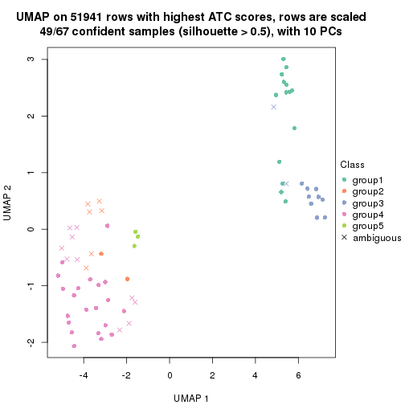</p>

</div>
<div id='tab-ATC-mclust-dimension-reduction-5'>
<pre><code class="r">dimension_reduction(res, k = 6, method = &quot;UMAP&quot;)
</code></pre>

<p></p>

</div>
</div>


Following heatmap shows how subgroups are split when increasing `k`:

```r
collect_classes(res)
```


Test correlation between subgroups and known annotations. If the known
annotation is numeric, one-way ANOVA test is applied, and if the known
annotation is discrete, chi-squared contingency table test is applied.

```r
test_to_known_factors(res)
```

```
#>             n disease.state(p) k
#> ATC:mclust 67         1.68e-10 2
#> ATC:mclust 61         1.06e-13 3
#> ATC:mclust 61         5.18e-12 4
#> ATC:mclust 49         1.64e-10 5
#> ATC:mclust 27         1.12e-06 6
```


If matrix rows can be associated to genes, consider to use `GO_Enrichment(res,
...)` to perform function enrichment for the signature genes.


 

---------------------------------------------------


### ATC:NMF*


The object with results only for a single top-value method and a single partition method 
can be extracted as:

```r
res = res_list["ATC", "NMF"]
# you can also extract it by
# res = res_list["ATC:NMF"]
```

A summary of `res` and all the functions that can be applied to it:

```r
res
```

```
#> A 'ConsensusPartition' object with k = 2, 3, 4, 5, 6.
#>   On a matrix with 51941 rows and 67 columns.
#>   Top rows (1000, 2000, 3000, 4000, 5000) are extracted by 'ATC' method.
#>   Subgroups are detected by 'NMF' method.
#>   Performed in total 1250 partitions by row resampling.
#>   Best k for subgroups seems to be 3.
#> 
#> Following methods can be applied to this 'ConsensusPartition' object:
#>  [1] "cola_report"             "collect_classes"         "collect_plots"          
#>  [4] "collect_stats"           "colnames"                "compare_signatures"     
#>  [7] "consensus_heatmap"       "dimension_reduction"     "functional_enrichment"  
#> [10] "get_anno_col"            "get_anno"                "get_classes"            
#> [13] "get_consensus"           "get_matrix"              "get_membership"         
#> [16] "get_param"               "get_signatures"          "get_stats"              
#> [19] "is_best_k"               "is_stable_k"             "membership_heatmap"     
#> [22] "ncol"                    "nrow"                    "plot_ecdf"              
#> [25] "rownames"                "select_partition_number" "show"                   
#> [28] "suggest_best_k"          "test_to_known_factors"
```

`collect_plots()` function collects all the plots made from `res` for all `k` (number of partitions)
into one single page to provide an easy and fast comparison between different `k`.

```r
collect_plots(res)
```


The plots are:

- The first row: a plot of the ECDF (Empirical cumulative distribution
  function) curves of the consensus matrix for each `k` and the heatmap of
  predicted classes for each `k`.
- The second row: heatmaps of the consensus matrix for each `k`.
- The third row: heatmaps of the membership matrix for each `k`.
- The fouth row: heatmaps of the signatures for each `k`.

All the plots in panels can be made by individual functions and they are
plotted later in this section.

`select_partition_number()` produces several plots showing different
statistics for choosing "optimized" `k`. There are following statistics:

- ECDF curves of the consensus matrix for each `k`;
- 1-PAC. [The PAC
  score](https://en.wikipedia.org/wiki/Consensus_clustering#Over-interpretation_potential_of_consensus_clustering)
  measures the proportion of the ambiguous subgrouping.
- Mean silhouette score.
- Concordance. The mean probability of fiting the consensus class ids in all
  partitions.
- Area increased. Denote $A_k$ as the area under the ECDF curve for current
  `k`, the area increased is defined as $A_k - A_{k-1}$.
- Rand index. The percent of pairs of samples that are both in a same cluster
  or both are not in a same cluster in the partition of k and k-1.
- Jaccard index. The ratio of pairs of samples are both in a same cluster in
  the partition of k and k-1 and the pairs of samples are both in a same
  cluster in the partition k or k-1.

The detailed explanations of these statistics can be found in [the cola
vignette](http://bioconductor.org/packages/devel/bioc/vignettes/cola/inst/doc/cola.html#toc_13).

Generally speaking, lower PAC score, higher mean silhouette score or higher
concordance corresponds to better partition. Rand index and Jaccard index
measure how similar the current partition is compared to partition with `k-1`.
If they are too similar, we won't accept `k` is better than `k-1`.

```r
select_partition_number(res)
```


The numeric values for all these statistics can be obtained by `get_stats()`.

```r
get_stats(res)
```

```
#>   k 1-PAC mean_silhouette concordance area_increased  Rand Jaccard
#> 2 2 1.000           0.994       0.997         0.4951 0.506   0.506
#> 3 3 0.901           0.915       0.963         0.2371 0.844   0.702
#> 4 4 0.598           0.599       0.767         0.1496 0.907   0.771
#> 5 5 0.592           0.645       0.784         0.1040 0.762   0.388
#> 6 6 0.573           0.524       0.717         0.0383 0.957   0.806
```

`suggest_best_k()` suggests the best $k$ based on these statistics. The rules are as follows:

- All $k$ with Jaccard index larger than 0.95 are removed because the increase of
  the partition number does not provides enough extra information. If all $k$ are removed,
  the best $k$ is assigned by `NA`.
- For $k$ with 1-PAC larger than 0.9, the maximal $k$ is taken as the "best k". Other $k$ is called "optional k".
- If it does not fit the second rule. The $k$ with the highest vote of highest
  1-PAC, mean silhouette and concordance is taken as the "best k".

```r
suggest_best_k(res)
```

```
#> [1] 3
#> attr(,"optional")
#> [1] 2
```

There is also optional best $k$ = 2 that is worth to check.

Following shows the table of the partitions (You need to click the **show/hide
code output** link to see it). The membership matrix (columns with name `p*`)
is inferred by
[`clue::cl_consensus()`](https://www.rdocumentation.org/link/cl_consensus?package=clue)
function with the `SE` method. Basically the value in the membership matrix
represents the probability to belong to a certain group. The finall class
label for an item is determined with the group with highest probability it
belongs to.

In `get_classes()` function, the entropy is calculated from the membership
matrix and the silhouette score is calculated from the consensus matrix.


<script>
$( function() {
	$( '#tabs-ATC-NMF-get-classes' ).tabs();
} );
</script>
<div id='tabs-ATC-NMF-get-classes'>
<ul>
<li><a href='#tab-ATC-NMF-get-classes-1'>k = 2</a></li>
<li><a href='#tab-ATC-NMF-get-classes-2'>k = 3</a></li>
<li><a href='#tab-ATC-NMF-get-classes-3'>k = 4</a></li>
<li><a href='#tab-ATC-NMF-get-classes-4'>k = 5</a></li>
<li><a href='#tab-ATC-NMF-get-classes-5'>k = 6</a></li>
</ul>

<div id='tab-ATC-NMF-get-classes-1'>
<p><a id='tab-ATC-NMF-get-classes-1-a' style='color:#0366d6' href='#'>show/hide code output</a></p>
<pre><code class="r">cbind(get_classes(res, k = 2), get_membership(res, k = 2))
</code></pre>

<pre><code>#&gt;           class entropy silhouette    p1    p2
#&gt; GSM312811     2  0.0000      0.995 0.000 1.000
#&gt; GSM312812     2  0.0000      0.995 0.000 1.000
#&gt; GSM312813     2  0.0000      0.995 0.000 1.000
#&gt; GSM312814     2  0.0000      0.995 0.000 1.000
#&gt; GSM312815     2  0.4690      0.893 0.100 0.900
#&gt; GSM312816     2  0.1184      0.981 0.016 0.984
#&gt; GSM312817     2  0.0000      0.995 0.000 1.000
#&gt; GSM312818     1  0.0000      1.000 1.000 0.000
#&gt; GSM312819     2  0.0000      0.995 0.000 1.000
#&gt; GSM312820     1  0.0376      0.996 0.996 0.004
#&gt; GSM312821     1  0.0000      1.000 1.000 0.000
#&gt; GSM312822     2  0.0000      0.995 0.000 1.000
#&gt; GSM312823     2  0.0000      0.995 0.000 1.000
#&gt; GSM312824     2  0.0000      0.995 0.000 1.000
#&gt; GSM312825     2  0.0000      0.995 0.000 1.000
#&gt; GSM312826     2  0.0000      0.995 0.000 1.000
#&gt; GSM312839     2  0.0000      0.995 0.000 1.000
#&gt; GSM312840     2  0.0000      0.995 0.000 1.000
#&gt; GSM312841     2  0.0000      0.995 0.000 1.000
#&gt; GSM312843     2  0.0000      0.995 0.000 1.000
#&gt; GSM312844     2  0.0938      0.985 0.012 0.988
#&gt; GSM312845     2  0.0000      0.995 0.000 1.000
#&gt; GSM312846     2  0.3431      0.934 0.064 0.936
#&gt; GSM312847     2  0.0000      0.995 0.000 1.000
#&gt; GSM312848     2  0.0000      0.995 0.000 1.000
#&gt; GSM312849     2  0.0000      0.995 0.000 1.000
#&gt; GSM312851     2  0.0000      0.995 0.000 1.000
#&gt; GSM312853     2  0.0000      0.995 0.000 1.000
#&gt; GSM312854     2  0.0000      0.995 0.000 1.000
#&gt; GSM312856     2  0.0000      0.995 0.000 1.000
#&gt; GSM312857     2  0.0000      0.995 0.000 1.000
#&gt; GSM312858     2  0.0000      0.995 0.000 1.000
#&gt; GSM312859     2  0.0000      0.995 0.000 1.000
#&gt; GSM312860     2  0.0000      0.995 0.000 1.000
#&gt; GSM312861     2  0.0000      0.995 0.000 1.000
#&gt; GSM312862     2  0.0000      0.995 0.000 1.000
#&gt; GSM312863     2  0.0000      0.995 0.000 1.000
#&gt; GSM312864     2  0.0000      0.995 0.000 1.000
#&gt; GSM312865     2  0.0000      0.995 0.000 1.000
#&gt; GSM312867     2  0.0000      0.995 0.000 1.000
#&gt; GSM312868     2  0.0000      0.995 0.000 1.000
#&gt; GSM312869     2  0.0000      0.995 0.000 1.000
#&gt; GSM312870     1  0.0000      1.000 1.000 0.000
#&gt; GSM312872     1  0.0000      1.000 1.000 0.000
#&gt; GSM312874     1  0.0000      1.000 1.000 0.000
#&gt; GSM312875     1  0.0000      1.000 1.000 0.000
#&gt; GSM312876     1  0.0000      1.000 1.000 0.000
#&gt; GSM312877     1  0.0000      1.000 1.000 0.000
#&gt; GSM312879     1  0.0000      1.000 1.000 0.000
#&gt; GSM312882     1  0.0000      1.000 1.000 0.000
#&gt; GSM312883     1  0.0000      1.000 1.000 0.000
#&gt; GSM312886     1  0.0000      1.000 1.000 0.000
#&gt; GSM312887     1  0.0000      1.000 1.000 0.000
#&gt; GSM312890     1  0.0000      1.000 1.000 0.000
#&gt; GSM312893     1  0.0000      1.000 1.000 0.000
#&gt; GSM312894     1  0.0000      1.000 1.000 0.000
#&gt; GSM312895     1  0.0000      1.000 1.000 0.000
#&gt; GSM312937     1  0.0000      1.000 1.000 0.000
#&gt; GSM312938     1  0.0000      1.000 1.000 0.000
#&gt; GSM312939     1  0.0000      1.000 1.000 0.000
#&gt; GSM312940     1  0.0000      1.000 1.000 0.000
#&gt; GSM312941     1  0.0000      1.000 1.000 0.000
#&gt; GSM312942     1  0.0000      1.000 1.000 0.000
#&gt; GSM312943     1  0.0000      1.000 1.000 0.000
#&gt; GSM312944     1  0.0000      1.000 1.000 0.000
#&gt; GSM312945     1  0.0000      1.000 1.000 0.000
#&gt; GSM312946     1  0.0000      1.000 1.000 0.000
</code></pre>

<script>
$('#tab-ATC-NMF-get-classes-1-a').parent().next().next().hide();
$('#tab-ATC-NMF-get-classes-1-a').click(function(){
  $('#tab-ATC-NMF-get-classes-1-a').parent().next().next().toggle();
  return(false);
});
</script>
</div>

<div id='tab-ATC-NMF-get-classes-2'>
<p><a id='tab-ATC-NMF-get-classes-2-a' style='color:#0366d6' href='#'>show/hide code output</a></p>
<pre><code class="r">cbind(get_classes(res, k = 3), get_membership(res, k = 3))
</code></pre>

<pre><code>#&gt;           class entropy silhouette    p1    p2    p3
#&gt; GSM312811     2  0.0237      0.974 0.000 0.996 0.004
#&gt; GSM312812     2  0.0000      0.977 0.000 1.000 0.000
#&gt; GSM312813     2  0.0000      0.977 0.000 1.000 0.000
#&gt; GSM312814     2  0.0000      0.977 0.000 1.000 0.000
#&gt; GSM312815     2  0.0848      0.965 0.008 0.984 0.008
#&gt; GSM312816     3  0.6045      0.371 0.000 0.380 0.620
#&gt; GSM312817     2  0.0000      0.977 0.000 1.000 0.000
#&gt; GSM312818     3  0.0000      0.934 0.000 0.000 1.000
#&gt; GSM312819     2  0.0000      0.977 0.000 1.000 0.000
#&gt; GSM312820     3  0.0000      0.934 0.000 0.000 1.000
#&gt; GSM312821     3  0.0000      0.934 0.000 0.000 1.000
#&gt; GSM312822     2  0.0237      0.974 0.000 0.996 0.004
#&gt; GSM312823     2  0.0000      0.977 0.000 1.000 0.000
#&gt; GSM312824     2  0.0000      0.977 0.000 1.000 0.000
#&gt; GSM312825     2  0.0000      0.977 0.000 1.000 0.000
#&gt; GSM312826     2  0.0000      0.977 0.000 1.000 0.000
#&gt; GSM312839     2  0.3816      0.822 0.148 0.852 0.000
#&gt; GSM312840     2  0.0000      0.977 0.000 1.000 0.000
#&gt; GSM312841     2  0.0000      0.977 0.000 1.000 0.000
#&gt; GSM312843     2  0.0000      0.977 0.000 1.000 0.000
#&gt; GSM312844     2  0.0000      0.977 0.000 1.000 0.000
#&gt; GSM312845     1  0.1860      0.883 0.948 0.052 0.000
#&gt; GSM312846     2  0.5327      0.626 0.272 0.728 0.000
#&gt; GSM312847     2  0.0000      0.977 0.000 1.000 0.000
#&gt; GSM312848     2  0.0000      0.977 0.000 1.000 0.000
#&gt; GSM312849     2  0.3340      0.857 0.120 0.880 0.000
#&gt; GSM312851     2  0.4796      0.714 0.000 0.780 0.220
#&gt; GSM312853     2  0.0000      0.977 0.000 1.000 0.000
#&gt; GSM312854     2  0.0000      0.977 0.000 1.000 0.000
#&gt; GSM312856     2  0.0000      0.977 0.000 1.000 0.000
#&gt; GSM312857     2  0.0000      0.977 0.000 1.000 0.000
#&gt; GSM312858     2  0.0000      0.977 0.000 1.000 0.000
#&gt; GSM312859     2  0.0000      0.977 0.000 1.000 0.000
#&gt; GSM312860     2  0.0000      0.977 0.000 1.000 0.000
#&gt; GSM312861     2  0.0000      0.977 0.000 1.000 0.000
#&gt; GSM312862     2  0.0000      0.977 0.000 1.000 0.000
#&gt; GSM312863     2  0.0000      0.977 0.000 1.000 0.000
#&gt; GSM312864     2  0.0000      0.977 0.000 1.000 0.000
#&gt; GSM312865     2  0.0000      0.977 0.000 1.000 0.000
#&gt; GSM312867     1  0.5291      0.614 0.732 0.268 0.000
#&gt; GSM312868     2  0.0000      0.977 0.000 1.000 0.000
#&gt; GSM312869     2  0.0000      0.977 0.000 1.000 0.000
#&gt; GSM312870     3  0.0000      0.934 0.000 0.000 1.000
#&gt; GSM312872     3  0.0000      0.934 0.000 0.000 1.000
#&gt; GSM312874     3  0.0000      0.934 0.000 0.000 1.000
#&gt; GSM312875     3  0.1643      0.922 0.044 0.000 0.956
#&gt; GSM312876     3  0.1643      0.922 0.044 0.000 0.956
#&gt; GSM312877     1  0.0000      0.927 1.000 0.000 0.000
#&gt; GSM312879     3  0.0000      0.934 0.000 0.000 1.000
#&gt; GSM312882     3  0.2066      0.911 0.060 0.000 0.940
#&gt; GSM312883     3  0.2448      0.898 0.076 0.000 0.924
#&gt; GSM312886     3  0.0000      0.934 0.000 0.000 1.000
#&gt; GSM312887     3  0.0424      0.933 0.008 0.000 0.992
#&gt; GSM312890     1  0.0000      0.927 1.000 0.000 0.000
#&gt; GSM312893     1  0.0000      0.927 1.000 0.000 0.000
#&gt; GSM312894     1  0.0000      0.927 1.000 0.000 0.000
#&gt; GSM312895     1  0.0000      0.927 1.000 0.000 0.000
#&gt; GSM312937     1  0.0000      0.927 1.000 0.000 0.000
#&gt; GSM312938     3  0.3752      0.822 0.144 0.000 0.856
#&gt; GSM312939     1  0.0000      0.927 1.000 0.000 0.000
#&gt; GSM312940     1  0.0000      0.927 1.000 0.000 0.000
#&gt; GSM312941     1  0.0000      0.927 1.000 0.000 0.000
#&gt; GSM312942     3  0.1643      0.922 0.044 0.000 0.956
#&gt; GSM312943     1  0.5882      0.461 0.652 0.000 0.348
#&gt; GSM312944     1  0.0000      0.927 1.000 0.000 0.000
#&gt; GSM312945     1  0.3816      0.802 0.852 0.000 0.148
#&gt; GSM312946     1  0.2165      0.884 0.936 0.000 0.064
</code></pre>

<script>
$('#tab-ATC-NMF-get-classes-2-a').parent().next().next().hide();
$('#tab-ATC-NMF-get-classes-2-a').click(function(){
  $('#tab-ATC-NMF-get-classes-2-a').parent().next().next().toggle();
  return(false);
});
</script>
</div>

<div id='tab-ATC-NMF-get-classes-3'>
<p><a id='tab-ATC-NMF-get-classes-3-a' style='color:#0366d6' href='#'>show/hide code output</a></p>
<pre><code class="r">cbind(get_classes(res, k = 4), get_membership(res, k = 4))
</code></pre>

<pre><code>#&gt;           class entropy silhouette    p1    p2    p3    p4
#&gt; GSM312811     2  0.3726     0.7073 0.000 0.788 0.000 0.212
#&gt; GSM312812     2  0.4741     0.6888 0.028 0.744 0.000 0.228
#&gt; GSM312813     2  0.3266     0.7371 0.000 0.832 0.000 0.168
#&gt; GSM312814     2  0.4936     0.4437 0.000 0.624 0.004 0.372
#&gt; GSM312815     4  0.7660     0.3824 0.304 0.208 0.004 0.484
#&gt; GSM312816     4  0.7485    -0.0831 0.000 0.180 0.380 0.440
#&gt; GSM312817     2  0.1211     0.7769 0.000 0.960 0.000 0.040
#&gt; GSM312818     3  0.4855     0.4025 0.000 0.000 0.600 0.400
#&gt; GSM312819     2  0.1474     0.7761 0.000 0.948 0.000 0.052
#&gt; GSM312820     3  0.4888     0.3821 0.000 0.000 0.588 0.412
#&gt; GSM312821     3  0.4866     0.3955 0.000 0.000 0.596 0.404
#&gt; GSM312822     2  0.5788     0.1398 0.012 0.532 0.012 0.444
#&gt; GSM312823     2  0.3649     0.7168 0.000 0.796 0.000 0.204
#&gt; GSM312824     2  0.3539     0.7297 0.004 0.820 0.000 0.176
#&gt; GSM312825     2  0.5279     0.6685 0.072 0.736 0.000 0.192
#&gt; GSM312826     2  0.5226     0.6750 0.076 0.744 0.000 0.180
#&gt; GSM312839     1  0.6968     0.0407 0.552 0.140 0.000 0.308
#&gt; GSM312840     2  0.3311     0.7363 0.000 0.828 0.000 0.172
#&gt; GSM312841     2  0.3907     0.6996 0.000 0.768 0.000 0.232
#&gt; GSM312843     2  0.1792     0.7607 0.000 0.932 0.000 0.068
#&gt; GSM312844     4  0.7122     0.3149 0.144 0.340 0.000 0.516
#&gt; GSM312845     1  0.5471     0.6394 0.720 0.060 0.004 0.216
#&gt; GSM312846     2  0.6314     0.1016 0.372 0.560 0.000 0.068
#&gt; GSM312847     2  0.1833     0.7522 0.024 0.944 0.000 0.032
#&gt; GSM312848     2  0.1389     0.7589 0.000 0.952 0.000 0.048
#&gt; GSM312849     2  0.5374     0.4651 0.244 0.704 0.000 0.052
#&gt; GSM312851     2  0.6794    -0.0317 0.000 0.584 0.136 0.280
#&gt; GSM312853     2  0.1474     0.7625 0.000 0.948 0.000 0.052
#&gt; GSM312854     2  0.0592     0.7688 0.000 0.984 0.000 0.016
#&gt; GSM312856     2  0.1211     0.7658 0.000 0.960 0.000 0.040
#&gt; GSM312857     2  0.1716     0.7537 0.000 0.936 0.000 0.064
#&gt; GSM312858     2  0.0927     0.7717 0.008 0.976 0.000 0.016
#&gt; GSM312859     2  0.3074     0.7442 0.000 0.848 0.000 0.152
#&gt; GSM312860     2  0.5874     0.5994 0.124 0.700 0.000 0.176
#&gt; GSM312861     2  0.2053     0.7756 0.004 0.924 0.000 0.072
#&gt; GSM312862     2  0.5330     0.5230 0.000 0.748 0.132 0.120
#&gt; GSM312863     2  0.0592     0.7688 0.000 0.984 0.000 0.016
#&gt; GSM312864     2  0.0188     0.7723 0.000 0.996 0.000 0.004
#&gt; GSM312865     2  0.1256     0.7651 0.008 0.964 0.000 0.028
#&gt; GSM312867     1  0.4780     0.5883 0.788 0.116 0.000 0.096
#&gt; GSM312868     2  0.0336     0.7716 0.000 0.992 0.000 0.008
#&gt; GSM312869     1  0.7170    -0.0479 0.548 0.268 0.000 0.184
#&gt; GSM312870     3  0.0469     0.7216 0.000 0.000 0.988 0.012
#&gt; GSM312872     3  0.2401     0.7097 0.004 0.000 0.904 0.092
#&gt; GSM312874     3  0.0707     0.7220 0.000 0.000 0.980 0.020
#&gt; GSM312875     3  0.4776     0.6581 0.024 0.000 0.732 0.244
#&gt; GSM312876     3  0.4807     0.6568 0.024 0.000 0.728 0.248
#&gt; GSM312877     1  0.7707     0.2010 0.440 0.000 0.240 0.320
#&gt; GSM312879     3  0.0188     0.7215 0.000 0.000 0.996 0.004
#&gt; GSM312882     3  0.4964     0.6552 0.032 0.000 0.724 0.244
#&gt; GSM312883     3  0.5416     0.6362 0.048 0.000 0.692 0.260
#&gt; GSM312886     3  0.2345     0.7000 0.000 0.000 0.900 0.100
#&gt; GSM312887     3  0.2918     0.6961 0.008 0.000 0.876 0.116
#&gt; GSM312890     1  0.0592     0.7628 0.984 0.000 0.000 0.016
#&gt; GSM312893     1  0.2675     0.7592 0.908 0.000 0.048 0.044
#&gt; GSM312894     1  0.4203     0.7283 0.824 0.000 0.108 0.068
#&gt; GSM312895     1  0.1004     0.7640 0.972 0.000 0.004 0.024
#&gt; GSM312937     1  0.1406     0.7658 0.960 0.000 0.024 0.016
#&gt; GSM312938     3  0.7146     0.4481 0.228 0.000 0.560 0.212
#&gt; GSM312939     1  0.0592     0.7628 0.984 0.000 0.000 0.016
#&gt; GSM312940     1  0.0817     0.7618 0.976 0.000 0.000 0.024
#&gt; GSM312941     1  0.0657     0.7654 0.984 0.000 0.004 0.012
#&gt; GSM312942     3  0.3037     0.7049 0.020 0.000 0.880 0.100
#&gt; GSM312943     3  0.6722     0.0548 0.408 0.000 0.500 0.092
#&gt; GSM312944     1  0.4318     0.7193 0.816 0.000 0.116 0.068
#&gt; GSM312945     1  0.5773     0.4253 0.620 0.000 0.336 0.044
#&gt; GSM312946     1  0.3611     0.7444 0.860 0.000 0.080 0.060
</code></pre>

<script>
$('#tab-ATC-NMF-get-classes-3-a').parent().next().next().hide();
$('#tab-ATC-NMF-get-classes-3-a').click(function(){
  $('#tab-ATC-NMF-get-classes-3-a').parent().next().next().toggle();
  return(false);
});
</script>
</div>

<div id='tab-ATC-NMF-get-classes-4'>
<p><a id='tab-ATC-NMF-get-classes-4-a' style='color:#0366d6' href='#'>show/hide code output</a></p>
<pre><code class="r">cbind(get_classes(res, k = 5), get_membership(res, k = 5))
</code></pre>

<pre><code>#&gt;           class entropy silhouette    p1    p2    p3    p4    p5
#&gt; GSM312811     2  0.4342      0.723 0.000 0.728 0.000 0.232 0.040
#&gt; GSM312812     2  0.2291      0.756 0.012 0.908 0.000 0.072 0.008
#&gt; GSM312813     2  0.4015      0.664 0.000 0.652 0.000 0.348 0.000
#&gt; GSM312814     2  0.4747      0.759 0.000 0.720 0.000 0.196 0.084
#&gt; GSM312815     2  0.4246      0.654 0.088 0.800 0.008 0.004 0.100
#&gt; GSM312816     5  0.4258      0.640 0.004 0.100 0.032 0.052 0.812
#&gt; GSM312817     4  0.3424      0.643 0.000 0.240 0.000 0.760 0.000
#&gt; GSM312818     5  0.3146      0.677 0.000 0.052 0.092 0.000 0.856
#&gt; GSM312819     4  0.2891      0.759 0.000 0.176 0.000 0.824 0.000
#&gt; GSM312820     5  0.3012      0.691 0.004 0.072 0.052 0.000 0.872
#&gt; GSM312821     5  0.2734      0.690 0.008 0.052 0.048 0.000 0.892
#&gt; GSM312822     2  0.6505      0.609 0.012 0.532 0.000 0.168 0.288
#&gt; GSM312823     2  0.3816      0.713 0.000 0.696 0.000 0.304 0.000
#&gt; GSM312824     2  0.3366      0.760 0.000 0.768 0.000 0.232 0.000
#&gt; GSM312825     2  0.4167      0.747 0.136 0.788 0.000 0.072 0.004
#&gt; GSM312826     2  0.4686      0.768 0.104 0.736 0.000 0.160 0.000
#&gt; GSM312839     2  0.4964      0.634 0.228 0.712 0.004 0.020 0.036
#&gt; GSM312840     2  0.3480      0.753 0.000 0.752 0.000 0.248 0.000
#&gt; GSM312841     2  0.2286      0.765 0.000 0.888 0.000 0.108 0.004
#&gt; GSM312843     4  0.3838      0.646 0.000 0.280 0.000 0.716 0.004
#&gt; GSM312844     2  0.4312      0.657 0.048 0.792 0.004 0.016 0.140
#&gt; GSM312845     1  0.5771      0.592 0.664 0.000 0.100 0.208 0.028
#&gt; GSM312846     1  0.5341      0.432 0.600 0.036 0.000 0.348 0.016
#&gt; GSM312847     4  0.1299      0.878 0.008 0.020 0.000 0.960 0.012
#&gt; GSM312848     4  0.1282      0.875 0.000 0.044 0.000 0.952 0.004
#&gt; GSM312849     1  0.6204      0.291 0.524 0.136 0.000 0.336 0.004
#&gt; GSM312851     4  0.4356      0.653 0.000 0.020 0.024 0.756 0.200
#&gt; GSM312853     4  0.0579      0.876 0.000 0.008 0.000 0.984 0.008
#&gt; GSM312854     4  0.0579      0.878 0.000 0.008 0.000 0.984 0.008
#&gt; GSM312856     4  0.1310      0.878 0.000 0.024 0.000 0.956 0.020
#&gt; GSM312857     4  0.1568      0.865 0.000 0.020 0.000 0.944 0.036
#&gt; GSM312858     4  0.1894      0.867 0.000 0.072 0.000 0.920 0.008
#&gt; GSM312859     2  0.4192      0.580 0.000 0.596 0.000 0.404 0.000
#&gt; GSM312860     2  0.4950      0.645 0.040 0.612 0.000 0.348 0.000
#&gt; GSM312861     4  0.3475      0.745 0.012 0.180 0.000 0.804 0.004
#&gt; GSM312862     3  0.6996      0.152 0.000 0.284 0.456 0.244 0.016
#&gt; GSM312863     4  0.0609      0.881 0.000 0.020 0.000 0.980 0.000
#&gt; GSM312864     4  0.1121      0.880 0.000 0.044 0.000 0.956 0.000
#&gt; GSM312865     4  0.0963      0.880 0.000 0.036 0.000 0.964 0.000
#&gt; GSM312867     1  0.2713      0.769 0.888 0.036 0.004 0.072 0.000
#&gt; GSM312868     4  0.2193      0.852 0.000 0.092 0.000 0.900 0.008
#&gt; GSM312869     2  0.5684      0.721 0.200 0.668 0.000 0.112 0.020
#&gt; GSM312870     3  0.4066      0.478 0.000 0.004 0.672 0.000 0.324
#&gt; GSM312872     3  0.3395      0.537 0.000 0.000 0.764 0.000 0.236
#&gt; GSM312874     3  0.3983      0.462 0.000 0.000 0.660 0.000 0.340
#&gt; GSM312875     3  0.0955      0.585 0.004 0.000 0.968 0.000 0.028
#&gt; GSM312876     3  0.0609      0.580 0.000 0.000 0.980 0.000 0.020
#&gt; GSM312877     3  0.4936      0.345 0.260 0.008 0.684 0.000 0.048
#&gt; GSM312879     3  0.4084      0.472 0.000 0.004 0.668 0.000 0.328
#&gt; GSM312882     3  0.0510      0.583 0.000 0.000 0.984 0.000 0.016
#&gt; GSM312883     3  0.0865      0.576 0.024 0.000 0.972 0.000 0.004
#&gt; GSM312886     3  0.4449      0.164 0.000 0.004 0.512 0.000 0.484
#&gt; GSM312887     5  0.4504     -0.072 0.000 0.008 0.428 0.000 0.564
#&gt; GSM312890     1  0.0740      0.813 0.980 0.000 0.008 0.004 0.008
#&gt; GSM312893     1  0.1043      0.807 0.960 0.000 0.040 0.000 0.000
#&gt; GSM312894     1  0.2519      0.776 0.884 0.000 0.100 0.000 0.016
#&gt; GSM312895     1  0.0693      0.811 0.980 0.012 0.000 0.000 0.008
#&gt; GSM312937     1  0.0451      0.813 0.988 0.004 0.008 0.000 0.000
#&gt; GSM312938     5  0.8283      0.186 0.328 0.100 0.136 0.028 0.408
#&gt; GSM312939     1  0.0613      0.813 0.984 0.004 0.004 0.000 0.008
#&gt; GSM312940     1  0.1153      0.810 0.964 0.004 0.008 0.000 0.024
#&gt; GSM312941     1  0.0579      0.813 0.984 0.000 0.008 0.000 0.008
#&gt; GSM312942     3  0.4451      0.161 0.000 0.004 0.504 0.000 0.492
#&gt; GSM312943     3  0.5987      0.441 0.248 0.036 0.632 0.000 0.084
#&gt; GSM312944     1  0.5073      0.373 0.640 0.040 0.312 0.000 0.008
#&gt; GSM312945     3  0.6287      0.223 0.408 0.028 0.488 0.000 0.076
#&gt; GSM312946     1  0.3771      0.735 0.836 0.024 0.088 0.000 0.052
</code></pre>

<script>
$('#tab-ATC-NMF-get-classes-4-a').parent().next().next().hide();
$('#tab-ATC-NMF-get-classes-4-a').click(function(){
  $('#tab-ATC-NMF-get-classes-4-a').parent().next().next().toggle();
  return(false);
});
</script>
</div>

<div id='tab-ATC-NMF-get-classes-5'>
<p><a id='tab-ATC-NMF-get-classes-5-a' style='color:#0366d6' href='#'>show/hide code output</a></p>
<pre><code class="r">cbind(get_classes(res, k = 6), get_membership(res, k = 6))
</code></pre>

<pre><code>#&gt;           class entropy silhouette    p1    p2    p3    p4    p5    p6
#&gt; GSM312811     2  0.6315     0.5684 0.000 0.580 0.000 0.184 0.112 0.124
#&gt; GSM312812     2  0.3846     0.5789 0.004 0.776 0.000 0.040 0.008 0.172
#&gt; GSM312813     2  0.3445     0.6715 0.000 0.744 0.000 0.244 0.000 0.012
#&gt; GSM312814     2  0.5154     0.7039 0.000 0.680 0.000 0.156 0.136 0.028
#&gt; GSM312815     2  0.5624     0.4659 0.056 0.648 0.000 0.000 0.156 0.140
#&gt; GSM312816     5  0.6395     0.4953 0.000 0.128 0.056 0.092 0.636 0.088
#&gt; GSM312817     4  0.4002     0.4744 0.000 0.320 0.000 0.660 0.000 0.020
#&gt; GSM312818     5  0.4499     0.6892 0.000 0.032 0.108 0.004 0.760 0.096
#&gt; GSM312819     4  0.3784     0.4983 0.000 0.308 0.000 0.680 0.000 0.012
#&gt; GSM312820     5  0.2715     0.7091 0.000 0.028 0.088 0.000 0.872 0.012
#&gt; GSM312821     5  0.2780     0.6946 0.000 0.016 0.092 0.000 0.868 0.024
#&gt; GSM312822     2  0.6803     0.3755 0.020 0.436 0.008 0.104 0.388 0.044
#&gt; GSM312823     2  0.3454     0.6976 0.000 0.760 0.000 0.224 0.012 0.004
#&gt; GSM312824     2  0.2520     0.7309 0.000 0.844 0.000 0.152 0.000 0.004
#&gt; GSM312825     2  0.2736     0.6969 0.020 0.880 0.000 0.052 0.000 0.048
#&gt; GSM312826     2  0.3066     0.7337 0.016 0.836 0.000 0.132 0.000 0.016
#&gt; GSM312839     2  0.6155     0.5181 0.120 0.644 0.000 0.024 0.100 0.112
#&gt; GSM312840     2  0.3746     0.7165 0.000 0.760 0.000 0.192 0.000 0.048
#&gt; GSM312841     2  0.3317     0.7065 0.000 0.836 0.000 0.080 0.012 0.072
#&gt; GSM312843     4  0.6274     0.4187 0.012 0.184 0.000 0.556 0.028 0.220
#&gt; GSM312844     2  0.6214     0.4267 0.056 0.576 0.000 0.004 0.220 0.144
#&gt; GSM312845     1  0.6975     0.2940 0.544 0.016 0.040 0.236 0.036 0.128
#&gt; GSM312846     1  0.6657     0.3244 0.564 0.044 0.000 0.196 0.036 0.160
#&gt; GSM312847     4  0.4422     0.6661 0.104 0.044 0.000 0.764 0.000 0.088
#&gt; GSM312848     4  0.2201     0.7375 0.000 0.028 0.000 0.896 0.000 0.076
#&gt; GSM312849     4  0.7327     0.1215 0.320 0.216 0.000 0.348 0.000 0.116
#&gt; GSM312851     4  0.4678     0.5386 0.004 0.004 0.016 0.736 0.148 0.092
#&gt; GSM312853     4  0.2756     0.6849 0.000 0.016 0.000 0.872 0.028 0.084
#&gt; GSM312854     4  0.1155     0.7437 0.004 0.004 0.000 0.956 0.000 0.036
#&gt; GSM312856     4  0.1699     0.7596 0.016 0.032 0.000 0.936 0.000 0.016
#&gt; GSM312857     4  0.2219     0.7436 0.012 0.020 0.000 0.916 0.016 0.036
#&gt; GSM312858     4  0.3542     0.7042 0.000 0.160 0.000 0.788 0.000 0.052
#&gt; GSM312859     2  0.3565     0.6027 0.000 0.692 0.000 0.304 0.000 0.004
#&gt; GSM312860     2  0.4536     0.6101 0.008 0.664 0.000 0.280 0.000 0.048
#&gt; GSM312861     4  0.4643     0.4901 0.008 0.304 0.000 0.640 0.000 0.048
#&gt; GSM312862     6  0.7921     0.0401 0.004 0.200 0.164 0.164 0.036 0.432
#&gt; GSM312863     4  0.1320     0.7611 0.000 0.036 0.000 0.948 0.000 0.016
#&gt; GSM312864     4  0.2209     0.7550 0.000 0.072 0.000 0.900 0.004 0.024
#&gt; GSM312865     4  0.2190     0.7590 0.000 0.060 0.000 0.900 0.000 0.040
#&gt; GSM312867     1  0.4901     0.4954 0.736 0.112 0.004 0.072 0.000 0.076
#&gt; GSM312868     4  0.3247     0.7118 0.000 0.156 0.000 0.808 0.000 0.036
#&gt; GSM312869     2  0.5360     0.6952 0.088 0.716 0.000 0.116 0.040 0.040
#&gt; GSM312870     3  0.4274     0.6111 0.000 0.000 0.676 0.000 0.276 0.048
#&gt; GSM312872     3  0.3808     0.6403 0.000 0.000 0.736 0.000 0.228 0.036
#&gt; GSM312874     3  0.4386     0.5895 0.000 0.000 0.652 0.000 0.300 0.048
#&gt; GSM312875     3  0.1138     0.6595 0.004 0.000 0.960 0.000 0.024 0.012
#&gt; GSM312876     3  0.1223     0.6550 0.008 0.004 0.960 0.000 0.016 0.012
#&gt; GSM312877     3  0.5592     0.1494 0.196 0.000 0.644 0.000 0.060 0.100
#&gt; GSM312879     3  0.4249     0.6174 0.000 0.000 0.688 0.000 0.260 0.052
#&gt; GSM312882     3  0.0976     0.6542 0.008 0.000 0.968 0.000 0.008 0.016
#&gt; GSM312883     3  0.0912     0.6425 0.008 0.004 0.972 0.000 0.004 0.012
#&gt; GSM312886     3  0.5207     0.4542 0.000 0.000 0.560 0.008 0.352 0.080
#&gt; GSM312887     5  0.5301    -0.2054 0.004 0.000 0.416 0.000 0.492 0.088
#&gt; GSM312890     1  0.0000     0.6435 1.000 0.000 0.000 0.000 0.000 0.000
#&gt; GSM312893     1  0.1976     0.6284 0.916 0.000 0.060 0.000 0.008 0.016
#&gt; GSM312894     1  0.5278     0.4349 0.672 0.000 0.192 0.000 0.052 0.084
#&gt; GSM312895     1  0.1668     0.6359 0.928 0.008 0.004 0.000 0.000 0.060
#&gt; GSM312937     1  0.1492     0.6425 0.940 0.000 0.036 0.000 0.000 0.024
#&gt; GSM312938     1  0.7921     0.1558 0.468 0.028 0.112 0.032 0.220 0.140
#&gt; GSM312939     1  0.0603     0.6427 0.980 0.004 0.000 0.000 0.000 0.016
#&gt; GSM312940     1  0.1821     0.6387 0.928 0.000 0.008 0.000 0.040 0.024
#&gt; GSM312941     1  0.1088     0.6429 0.960 0.000 0.016 0.000 0.000 0.024
#&gt; GSM312942     3  0.6377     0.3394 0.020 0.008 0.484 0.004 0.332 0.152
#&gt; GSM312943     6  0.7768    -0.1160 0.260 0.076 0.228 0.004 0.036 0.396
#&gt; GSM312944     1  0.7325    -0.1141 0.400 0.108 0.128 0.004 0.012 0.348
#&gt; GSM312945     1  0.7598    -0.2746 0.348 0.068 0.220 0.004 0.024 0.336
#&gt; GSM312946     1  0.7691    -0.0374 0.436 0.084 0.152 0.000 0.060 0.268
</code></pre>

<script>
$('#tab-ATC-NMF-get-classes-5-a').parent().next().next().hide();
$('#tab-ATC-NMF-get-classes-5-a').click(function(){
  $('#tab-ATC-NMF-get-classes-5-a').parent().next().next().toggle();
  return(false);
});
</script>
</div>
</div>

Heatmaps for the consensus matrix. It visualizes the probability of two
samples to be in a same group.


<script>
$( function() {
	$( '#tabs-ATC-NMF-consensus-heatmap' ).tabs();
} );
</script>
<div id='tabs-ATC-NMF-consensus-heatmap'>
<ul>
<li><a href='#tab-ATC-NMF-consensus-heatmap-1'>k = 2</a></li>
<li><a href='#tab-ATC-NMF-consensus-heatmap-2'>k = 3</a></li>
<li><a href='#tab-ATC-NMF-consensus-heatmap-3'>k = 4</a></li>
<li><a href='#tab-ATC-NMF-consensus-heatmap-4'>k = 5</a></li>
<li><a href='#tab-ATC-NMF-consensus-heatmap-5'>k = 6</a></li>
</ul>
<div id='tab-ATC-NMF-consensus-heatmap-1'>
<pre><code class="r">consensus_heatmap(res, k = 2)
</code></pre>

<p></p>

</div>
<div id='tab-ATC-NMF-consensus-heatmap-2'>
<pre><code class="r">consensus_heatmap(res, k = 3)
</code></pre>

<p></p>

</div>
<div id='tab-ATC-NMF-consensus-heatmap-3'>
<pre><code class="r">consensus_heatmap(res, k = 4)
</code></pre>

<p></p>

</div>
<div id='tab-ATC-NMF-consensus-heatmap-4'>
<pre><code class="r">consensus_heatmap(res, k = 5)
</code></pre>

<p></p>

</div>
<div id='tab-ATC-NMF-consensus-heatmap-5'>
<pre><code class="r">consensus_heatmap(res, k = 6)
</code></pre>

<p></p>

</div>
</div>

Heatmaps for the membership of samples in all partitions to see how consistent they are:


<script>
$( function() {
	$( '#tabs-ATC-NMF-membership-heatmap' ).tabs();
} );
</script>
<div id='tabs-ATC-NMF-membership-heatmap'>
<ul>
<li><a href='#tab-ATC-NMF-membership-heatmap-1'>k = 2</a></li>
<li><a href='#tab-ATC-NMF-membership-heatmap-2'>k = 3</a></li>
<li><a href='#tab-ATC-NMF-membership-heatmap-3'>k = 4</a></li>
<li><a href='#tab-ATC-NMF-membership-heatmap-4'>k = 5</a></li>
<li><a href='#tab-ATC-NMF-membership-heatmap-5'>k = 6</a></li>
</ul>
<div id='tab-ATC-NMF-membership-heatmap-1'>
<pre><code class="r">membership_heatmap(res, k = 2)
</code></pre>

<p></p>

</div>
<div id='tab-ATC-NMF-membership-heatmap-2'>
<pre><code class="r">membership_heatmap(res, k = 3)
</code></pre>

<p></p>

</div>
<div id='tab-ATC-NMF-membership-heatmap-3'>
<pre><code class="r">membership_heatmap(res, k = 4)
</code></pre>

<p>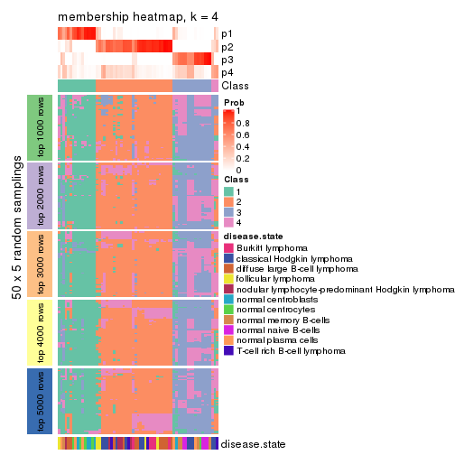</p>

</div>
<div id='tab-ATC-NMF-membership-heatmap-4'>
<pre><code class="r">membership_heatmap(res, k = 5)
</code></pre>

<p></p>

</div>
<div id='tab-ATC-NMF-membership-heatmap-5'>
<pre><code class="r">membership_heatmap(res, k = 6)
</code></pre>

<p></p>

</div>
</div>

As soon as we have had the classes for columns, we can look for signatures
which are significantly different between classes which can be candidate marks
for certain classes. Following are the heatmaps for signatures.


Signature heatmaps where rows are scaled:


<script>
$( function() {
	$( '#tabs-ATC-NMF-get-signatures' ).tabs();
} );
</script>
<div id='tabs-ATC-NMF-get-signatures'>
<ul>
<li><a href='#tab-ATC-NMF-get-signatures-1'>k = 2</a></li>
<li><a href='#tab-ATC-NMF-get-signatures-2'>k = 3</a></li>
<li><a href='#tab-ATC-NMF-get-signatures-3'>k = 4</a></li>
<li><a href='#tab-ATC-NMF-get-signatures-4'>k = 5</a></li>
<li><a href='#tab-ATC-NMF-get-signatures-5'>k = 6</a></li>
</ul>
<div id='tab-ATC-NMF-get-signatures-1'>
<pre><code class="r">get_signatures(res, k = 2)
</code></pre>

<p></p>

</div>
<div id='tab-ATC-NMF-get-signatures-2'>
<pre><code class="r">get_signatures(res, k = 3)
</code></pre>

<p></p>

</div>
<div id='tab-ATC-NMF-get-signatures-3'>
<pre><code class="r">get_signatures(res, k = 4)
</code></pre>

<p></p>

</div>
<div id='tab-ATC-NMF-get-signatures-4'>
<pre><code class="r">get_signatures(res, k = 5)
</code></pre>

<p></p>

</div>
<div id='tab-ATC-NMF-get-signatures-5'>
<pre><code class="r">get_signatures(res, k = 6)
</code></pre>

<p></p>

</div>
</div>


Signature heatmaps where rows are not scaled:


<script>
$( function() {
	$( '#tabs-ATC-NMF-get-signatures-no-scale' ).tabs();
} );
</script>
<div id='tabs-ATC-NMF-get-signatures-no-scale'>
<ul>
<li><a href='#tab-ATC-NMF-get-signatures-no-scale-1'>k = 2</a></li>
<li><a href='#tab-ATC-NMF-get-signatures-no-scale-2'>k = 3</a></li>
<li><a href='#tab-ATC-NMF-get-signatures-no-scale-3'>k = 4</a></li>
<li><a href='#tab-ATC-NMF-get-signatures-no-scale-4'>k = 5</a></li>
<li><a href='#tab-ATC-NMF-get-signatures-no-scale-5'>k = 6</a></li>
</ul>
<div id='tab-ATC-NMF-get-signatures-no-scale-1'>
<pre><code class="r">get_signatures(res, k = 2, scale_rows = FALSE)
</code></pre>

<p></p>

</div>
<div id='tab-ATC-NMF-get-signatures-no-scale-2'>
<pre><code class="r">get_signatures(res, k = 3, scale_rows = FALSE)
</code></pre>

<p></p>

</div>
<div id='tab-ATC-NMF-get-signatures-no-scale-3'>
<pre><code class="r">get_signatures(res, k = 4, scale_rows = FALSE)
</code></pre>

<p></p>

</div>
<div id='tab-ATC-NMF-get-signatures-no-scale-4'>
<pre><code class="r">get_signatures(res, k = 5, scale_rows = FALSE)
</code></pre>

<p></p>

</div>
<div id='tab-ATC-NMF-get-signatures-no-scale-5'>
<pre><code class="r">get_signatures(res, k = 6, scale_rows = FALSE)
</code></pre>

<p></p>

</div>
</div>


Compare the overlap of signatures from different k:

```r
compare_signatures(res)
```

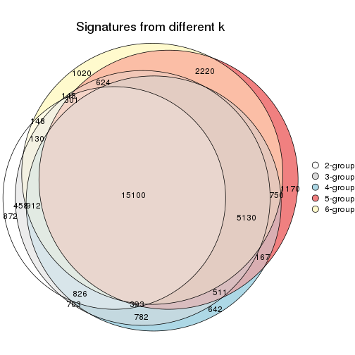

`get_signature()` returns a data frame invisibly. TO get the list of signatures, the function
call should be assigned to a variable explicitly. In following code, if `plot` argument is set
to `FALSE`, no heatmap is plotted while only the differential analysis is performed.

```r
# code only for demonstration
tb = get_signature(res, k = ..., plot = FALSE)
```

An example of the output of `tb` is:

```
#>   which_row         fdr    mean_1    mean_2 scaled_mean_1 scaled_mean_2 km
#> 1        38 0.042760348  8.373488  9.131774    -0.5533452     0.5164555  1
#> 2        40 0.018707592  7.106213  8.469186    -0.6173731     0.5762149  1
#> 3        55 0.019134737 10.221463 11.207825    -0.6159697     0.5749050  1
#> 4        59 0.006059896  5.921854  7.869574    -0.6899429     0.6439467  1
#> 5        60 0.018055526  8.928898 10.211722    -0.6204761     0.5791110  1
#> 6        98 0.009384629 15.714769 14.887706     0.6635654    -0.6193277  2
...
```

The columns in `tb` are:

1. `which_row`: row indices corresponding to the input matrix.
2. `fdr`: FDR for the differential test. 
3. `mean_x`: The mean value in group x.
4. `scaled_mean_x`: The mean value in group x after rows are scaled.
5. `km`: Row groups if k-means clustering is applied to rows.


UMAP plot which shows how samples are separated.


<script>
$( function() {
	$( '#tabs-ATC-NMF-dimension-reduction' ).tabs();
} );
</script>
<div id='tabs-ATC-NMF-dimension-reduction'>
<ul>
<li><a href='#tab-ATC-NMF-dimension-reduction-1'>k = 2</a></li>
<li><a href='#tab-ATC-NMF-dimension-reduction-2'>k = 3</a></li>
<li><a href='#tab-ATC-NMF-dimension-reduction-3'>k = 4</a></li>
<li><a href='#tab-ATC-NMF-dimension-reduction-4'>k = 5</a></li>
<li><a href='#tab-ATC-NMF-dimension-reduction-5'>k = 6</a></li>
</ul>
<div id='tab-ATC-NMF-dimension-reduction-1'>
<pre><code class="r">dimension_reduction(res, k = 2, method = &quot;UMAP&quot;)
</code></pre>

<p></p>

</div>
<div id='tab-ATC-NMF-dimension-reduction-2'>
<pre><code class="r">dimension_reduction(res, k = 3, method = &quot;UMAP&quot;)
</code></pre>

<p></p>

</div>
<div id='tab-ATC-NMF-dimension-reduction-3'>
<pre><code class="r">dimension_reduction(res, k = 4, method = &quot;UMAP&quot;)
</code></pre>

<p></p>

</div>
<div id='tab-ATC-NMF-dimension-reduction-4'>
<pre><code class="r">dimension_reduction(res, k = 5, method = &quot;UMAP&quot;)
</code></pre>

<p></p>

</div>
<div id='tab-ATC-NMF-dimension-reduction-5'>
<pre><code class="r">dimension_reduction(res, k = 6, method = &quot;UMAP&quot;)
</code></pre>

<p></p>

</div>
</div>


Following heatmap shows how subgroups are split when increasing `k`:

```r
collect_classes(res)
```


Test correlation between subgroups and known annotations. If the known
annotation is numeric, one-way ANOVA test is applied, and if the known
annotation is discrete, chi-squared contingency table test is applied.

```r
test_to_known_factors(res)
```

```
#>          n disease.state(p) k
#> ATC:NMF 67         9.63e-09 2
#> ATC:NMF 65         1.12e-08 3
#> ATC:NMF 50         9.27e-09 4
#> ATC:NMF 53         7.16e-12 5
#> ATC:NMF 44         5.37e-13 6
```


If matrix rows can be associated to genes, consider to use `GO_Enrichment(res,
...)` to perform function enrichment for the signature genes.


 

## Session info


```r
sessionInfo()
```

```
#> R version 3.6.0 (2019-04-26)
#> Platform: x86_64-pc-linux-gnu (64-bit)
#> Running under: CentOS Linux 7 (Core)
#> 
#> Matrix products: default
#> BLAS:   /usr/lib64/libblas.so.3.4.2
#> LAPACK: /usr/lib64/liblapack.so.3.4.2
#> 
#> locale:
#>  [1] LC_CTYPE=en_GB.UTF-8       LC_NUMERIC=C               LC_TIME=en_GB.UTF-8       
#>  [4] LC_COLLATE=en_GB.UTF-8     LC_MONETARY=en_GB.UTF-8    LC_MESSAGES=en_GB.UTF-8   
#>  [7] LC_PAPER=en_GB.UTF-8       LC_NAME=C                  LC_ADDRESS=C              
#> [10] LC_TELEPHONE=C             LC_MEASUREMENT=en_GB.UTF-8 LC_IDENTIFICATION=C       
#> 
#> attached base packages:
#> [1] grid      parallel  stats     graphics  grDevices utils     datasets  methods   base     
#> 
#> other attached packages:
#>  [1] genefilter_1.66.0     ComplexHeatmap_2.1.1  markdown_1.1          knitr_1.26           
#>  [5] preprocessCore_1.46.0 cola_1.3.2            GEOquery_2.52.0       Biobase_2.44.0       
#>  [9] BiocGenerics_0.30.0   GetoptLong_0.1.7     
#> 
#> loaded via a namespace (and not attached):
#>  [1] bitops_1.0-6         matrixStats_0.55.0   bit64_0.9-7          doParallel_1.0.15   
#>  [5] RColorBrewer_1.1-2   httr_1.4.1           tools_3.6.0          backports_1.1.5     
#>  [9] R6_2.4.1             DBI_1.0.0            lazyeval_0.2.2       colorspace_1.4-1    
#> [13] withr_2.1.2          tidyselect_0.2.5     gridExtra_2.3        bit_1.1-14          
#> [17] compiler_3.6.0       xml2_1.2.2           microbenchmark_1.4-7 pkgmaker_0.28       
#> [21] slam_0.1-46          scales_1.1.0         readr_1.3.1          NMF_0.23.6          
#> [25] stringr_1.4.0        digest_0.6.23        pkgconfig_2.0.3      bibtex_0.4.2        
#> [29] highr_0.8            limma_3.40.6         rlang_0.4.2          GlobalOptions_0.1.1 
#> [33] RSQLite_2.1.2        impute_1.58.0        shape_1.4.4          mclust_5.4.5        
#> [37] dendextend_1.12.0    dplyr_0.8.3          RCurl_1.95-4.12      magrittr_1.5        
#> [41] Matrix_1.2-17        Rcpp_1.0.3           munsell_0.5.0        S4Vectors_0.22.1    
#> [45] viridis_0.5.1        lifecycle_0.1.0      stringi_1.4.3        plyr_1.8.4          
#> [49] blob_1.2.0           crayon_1.3.4         lattice_0.20-38      splines_3.6.0       
#> [53] annotate_1.62.0      circlize_0.4.9       hms_0.5.2            zeallot_0.1.0       
#> [57] pillar_1.4.2         rjson_0.2.20         rngtools_1.4         reshape2_1.4.3      
#> [61] codetools_0.2-16     stats4_3.6.0         XML_3.98-1.20        glue_1.3.1          
#> [65] evaluate_0.14        png_0.1-7            vctrs_0.2.0          foreach_1.4.7       
#> [69] polyclip_1.10-0      gtable_0.3.0         purrr_0.3.3          tidyr_1.0.0         
#> [73] clue_0.3-57          assertthat_0.2.1     ggplot2_3.2.1        xfun_0.11           
#> [77] gridBase_0.4-7       eulerr_6.0.0         xtable_1.8-4         skmeans_0.2-11      
#> [81] survival_2.44-1.1    viridisLite_0.3.0    tibble_2.1.3         iterators_1.0.12    
#> [85] AnnotationDbi_1.46.1 registry_0.5-1       memoise_1.1.0        IRanges_2.18.3      
#> [89] cluster_2.1.0        brew_1.0-6
```


